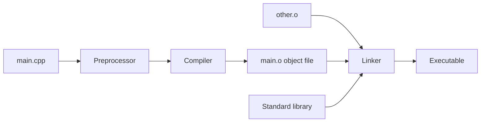
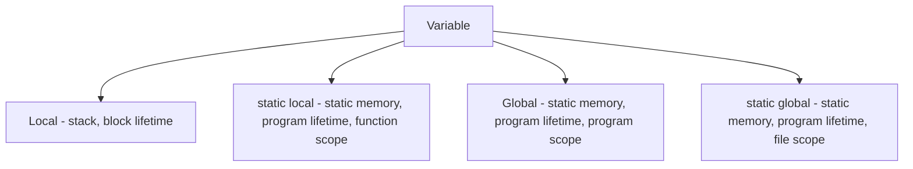
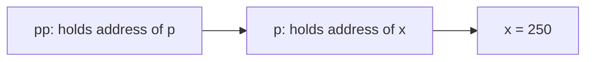
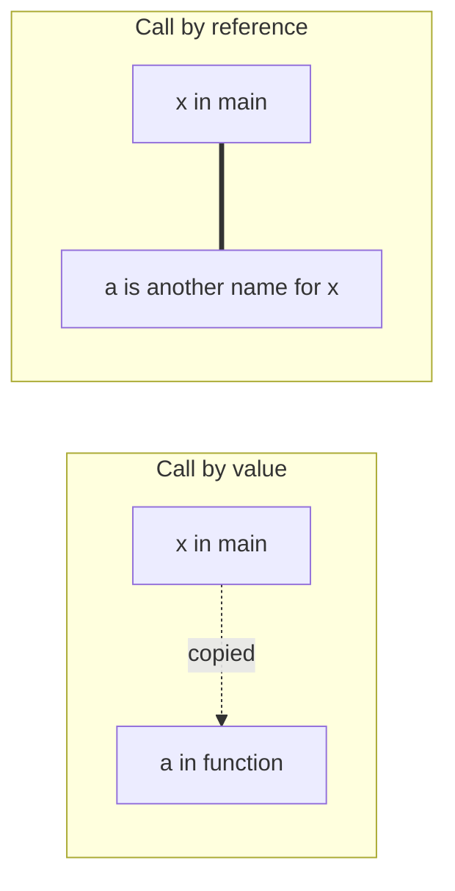
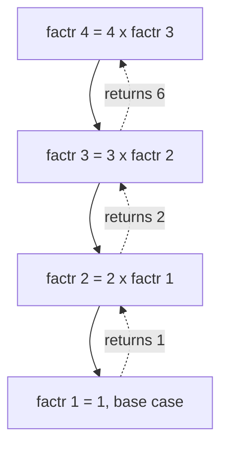
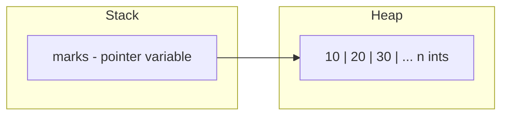
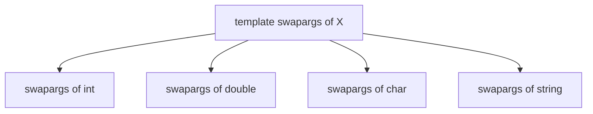
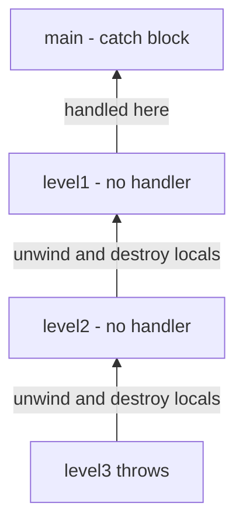
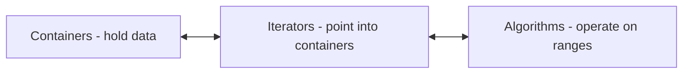
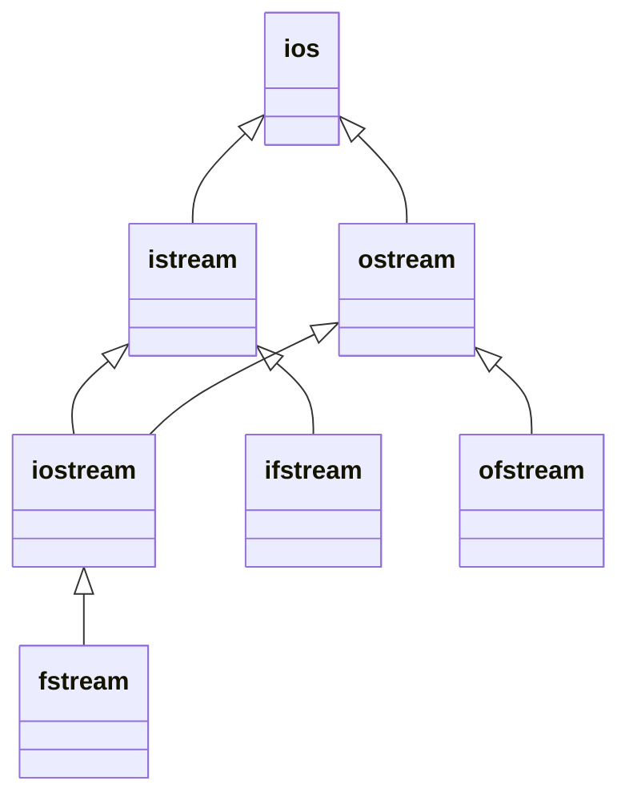

=== Structure of a C++ Program and How It Is Compiled
difficulty: easy
---
Every C++ program, no matter how large, follows the same basic shape: some **preprocessor directives** (usually `#include` lines), optional **global declarations**, and a function called **`main()`** where execution begins. Interviewers often open with "walk me through what happens when you build and run a C++ program", so it is worth knowing both the layout of the source file *and* the journey from source code to executable.

```cpp
#include <iostream>      // 1. preprocessor: pull in the I/O library declarations
using namespace std;     // 2. make names like cout visible without std::

int square(int x);       // 3. function prototype (declaration)

int main()               // 4. execution always starts here
{
    int n;
    cout << "Enter a number: ";
    cin >> n;                              // read from standard input
    cout << n << " squared is " << square(n) << "\n";
    return 0;                              // 0 tells the OS "success"
}

int square(int x)        // 5. function definition
{
    return x * x;
}
```

**Line by line:**
- `#include <iostream>` is not a C++ statement — it is an instruction to the **preprocessor**, which literally pastes the contents of the `iostream` header into your file before compilation. Modern C++ headers have no `.h` extension.
- `using namespace std;` — everything in the C++ standard library lives inside the namespace `std`. Without this line you would write `std::cout` and `std::cin`.
- The **prototype** `int square(int x);` tells the compiler the function's name, return type and parameters before it is used, so the call inside `main()` can be type-checked. In C++ prototypes are *mandatory* for any function called before it is defined.
- `cout <<` is the **insertion** (output) operator and `cin >>` is the **extraction** (input) operator. They are just overloaded versions of the shift operators.
- `return 0;` from `main()` reports success to the operating system. If you leave it out, C++ automatically returns 0 from `main` (and only from `main`).

### From source code to executable



1. **Preprocessing** — handles `#include`, `#define`, `#ifdef` and strips comments. The output is one big "translation unit".
2. **Compilation** — translates that unit into machine code, producing an **object file** (`.o` / `.obj`). Calls to functions defined elsewhere are left as unresolved references.
3. **Linking** — the linker combines your object files with library code (for example the code behind `cout`) and resolves every reference. A missing function body shows up here as an "undefined reference" error, not as a compile error.

This also explains **separate compilation**: a large project is split into many `.cpp` files that are compiled independently, so changing one file only recompiles that file before re-linking.

**Key points:**
- Execution starts at `main()`; it must return `int`.
- `#include` is a textual copy done by the preprocessor, before the compiler sees the code.
- Compile errors come from syntax/type problems; **linker errors** ("undefined reference") come from declared-but-never-defined functions.
- C++ requires a declaration (prototype) before a function is called.

**Common interview questions:**
- *What is the difference between a declaration and a definition?* A declaration introduces a name and type; a definition also allocates storage or provides the body. You may declare many times but define only once (the One Definition Rule).
- *Is `cout` a keyword?* No — it is an object of class `ostream` declared in `<iostream>`.

=== Key Differences Between C and C++
difficulty: easy
---
"What is the difference between C and C++?" is one of the most common opening questions in a technical interview. C++ was created by **Bjarne Stroustrup** at Bell Labs starting in 1979, originally called "C with Classes". It is almost a superset of C — the book's Part I is literally "The C Subset" — but it adds object-oriented programming, generic programming and many safety and convenience features.

| Feature | C | C++ |
|---|---|---|
| Paradigm | Procedural | Multi-paradigm: procedural, object-oriented, generic |
| Classes, objects, inheritance, polymorphism | No | Yes |
| Encapsulation / access control | No (struct members all public) | `private`, `protected`, `public` |
| Function overloading | No | Yes |
| Operator overloading | No | Yes |
| Default arguments | No | Yes |
| References | No (pointers only) | Yes |
| Templates (generic code) | No (macros, `void*`) | Yes |
| Exception handling | No (error codes, `setjmp`) | `try` / `catch` / `throw` |
| Namespaces | No | Yes |
| Dynamic memory | `malloc()` / `free()` | `new` / `delete` (call constructors/destructors) |
| Console I/O | `printf()` / `scanf()` | `cin` / `cout` streams (type-safe, extensible) |
| `bool` type | Only via `<stdbool.h>` (C99) | Built-in |
| Standard library | C library | C library + STL + strings + streams |
| Function prototypes | Optional in old C | Mandatory |
| Variables declared | Start of block (C89) | Anywhere |
| File extension | `.c` | `.cpp`, `.cc`, `.cxx` |

### Some subtle differences
Beyond the big features, the book lists a number of small differences that can trip you up when moving code between the languages:

- **Empty parameter list:** in C, `int f();` means "f takes an unspecified number of arguments"; in C++ it means "f takes no arguments" (same as `int f(void);`).
- **Prototypes are required** in C++ for every function before it is called; old C allowed calling undeclared functions.
- **No "default to int":** C89 assumed `int` when a type was missing (`main()` instead of `int main()`); C++ does not.
- **`return` with a value is required** in a non-void C++ function (except `main`, which returns 0 automatically).
- **Character literals:** in C, `'a'` has type `int`; in C++ it has type `char`. So `sizeof('a')` is 4 in C but 1 in C++.
- **`void*` conversion:** C automatically converts `void*` to any pointer type (`int *p = malloc(...)`); C++ requires an explicit cast.
- **Struct tags:** in C you must write `struct Student s;`; in C++ `Student s;` is enough because the struct name is a type.
- **`const` globals** have internal linkage (file scope) by default in C++ but external linkage in C.
- **Local variables** can be declared anywhere in C++, including inside `for` statements: `for (int i = 0; ...)`.

### Why choose one over the other?
- **C** remains popular for operating-system kernels, embedded firmware and anywhere a tiny, predictable runtime matters. It is simpler, and its ABI is the "lingua franca" other languages use to talk to each other.
- **C++** is chosen for large systems where abstraction pays off without sacrificing performance: game engines, browsers, databases, trading systems, compilers. Its design principle is the **zero-overhead abstraction** — you do not pay for features you do not use, and what you do use is as efficient as hand-written code.

Most valid C programs are also valid C++ programs (with a few exceptions like the `void*` conversion above), so C++ code can call C libraries directly. To call C functions from C++, wrap their declarations in `extern "C" { ... }` to turn off C++ **name mangling**.

**Key points:**
- C is procedural; C++ adds OOP, templates, exceptions, references, overloading and namespaces.
- `new`/`delete` call constructors/destructors; `malloc`/`free` do not.
- `int f();` means "no arguments" in C++ but "unspecified arguments" in C.
- `extern "C"` lets C++ link with C code by disabling name mangling.

=== Basic Data Types, Modifiers and Type Conversion
difficulty: easy
---
C++ inherits **five basic data types** from C — `char`, `int`, `float`, `double` and `void` — and adds **`bool`** (and `wchar_t` for wide characters). Each type can be adjusted with **type modifiers**: `signed`, `unsigned`, `short` and `long`. Interviewers like this topic because it hides several traps: overflow, signed/unsigned comparisons, and silent conversions.

| Type | Typical size | Typical range |
|---|---|---|
| `char` | 1 byte | -128 to 127 (or 0 to 255) |
| `int` | 4 bytes | about ±2.1 billion |
| `unsigned int` | 4 bytes | 0 to about 4.2 billion |
| `short int` | 2 bytes | -32,768 to 32,767 |
| `long long` | 8 bytes | about ±9.2 × 10^18 |
| `float` | 4 bytes | ~6 significant digits |
| `double` | 8 bytes | ~15 significant digits |
| `bool` | 1 byte | `true` / `false` |

The standard only fixes *minimum* sizes (e.g. `int` is at least 16 bits), which is why portable code uses the **`sizeof`** operator instead of hard-coding sizes.

```cpp
#include <iostream>
using namespace std;

int main()
{
    cout << "int: " << sizeof(int) << " bytes\n";
    cout << "double: " << sizeof(double) << " bytes\n";

    // 1. Integer overflow with a short
    short s = 32767;
    s = s + 1;                 // wraps around on typical machines
    cout << "short after overflow: " << s << "\n";

    // 2. Integer division truncates
    int a = 7, b = 2;
    cout << "7 / 2 = " << a / b << "\n";              // 3
    cout << "7 / 2.0 = " << a / 2.0 << "\n";          // 3.5 (int promoted to double)

    // 3. Explicit cast
    cout << "cast: " << (double)a / b << "\n";        // 3.5

    // 4. Signed/unsigned trap
    int neg = -1;
    unsigned int u = 1;
    if (neg < u) cout << "-1 < 1\n";
    else         cout << "-1 is NOT less than 1u !\n"; // this prints
    return 0;
}
```

```text
int: 4 bytes
double: 8 bytes
short after overflow: -32768
7 / 2 = 3
7 / 2.0 = 3.5
cast: 3.5
-1 is NOT less than 1u !
```

**What is happening:**
- **Overflow:** a `short` can hold at most 32767. Adding one wraps it to -32768. (Strictly, signed overflow in arithmetic is *undefined behaviour*; unsigned overflow is defined to wrap modulo 2ⁿ.)
- **Type conversion in expressions (promotion):** when an expression mixes types, the "smaller" operand is converted to the "larger" one before the operation. `char` and `short` become `int`; if one operand is `double`, the other becomes `double`. So `a / 2.0` is floating-point division while `a / b` is integer division.
- **Casts:** `(double)a` forces a conversion. In modern C++ prefer `static_cast<double>(a)` because it is easier to search for and more restricted.
- **Signed vs unsigned:** when an `int` is compared with an `unsigned int`, the `int` is converted to `unsigned`. -1 becomes 4294967295, so the comparison is false. This is a classic bug when comparing a loop index with `v.size()`, which is unsigned.

**Type conversion in assignment:** when you assign a value of one type to a variable of another, the value is converted to the target type. Assigning a `double` to an `int` drops the fractional part; assigning a large `int` to a `char` keeps only the low-order bits. The compiler usually does this silently.

**Key points:**
- Use `sizeof` rather than assuming sizes.
- Integer division truncates toward zero — convert one operand to get a fractional result.
- Mixing signed and unsigned in comparisons is dangerous.
- Prefer `static_cast<>` over C-style casts.

=== Storage Classes: auto, extern, static and register
difficulty: medium
---
A **storage class specifier** tells the compiler *where* and *for how long* a variable lives, and *who can see it*. C++ supports `extern`, `static`, `register` and `mutable` (in modern C++ `auto` has been reused for type deduction, and `register` is deprecated). Questions about `static` are extremely common, because the keyword means different things in different places.

Before storage classes, remember the three places a variable can be declared:
- **Local variables** — declared inside a block. Created when the block is entered and destroyed when it exits.
- **Formal parameters** — the variables in a function's parameter list; they behave like locals.
- **Global variables** — declared outside every function. They exist for the whole run of the program and are visible to any code after the declaration.

### static local variables — remember the value between calls

```cpp
#include <iostream>
using namespace std;

int counter()
{
    static int count = 0;   // initialized only ONCE
    count++;
    return count;
}

int normalCounter()
{
    int count = 0;          // re-created on every call
    count++;
    return count;
}

int main()
{
    for (int i = 0; i < 3; i++)
        cout << counter() << " ";        // 1 2 3
    cout << "\n";
    for (int i = 0; i < 3; i++)
        cout << normalCounter() << " ";  // 1 1 1
    cout << "\n";
    return 0;
}
```

A `static` local is stored in the same permanent memory area as globals, so it keeps its value between calls, but it is still only *visible* inside its function. This gives you persistence without exposing the variable to the rest of the program — a nice example of encapsulation even in procedural code. A typical use is a random-number generator that must remember its seed.

### static global variables — file scope only
A global declared `static` is visible only inside the file in which it is declared. Other files cannot reference it even with `extern`. This hides implementation details of a module. (In modern C++ an **unnamed namespace** does the same job.)

### extern — "this variable is defined somewhere else"
In a multi-file program a global variable must be **defined** in exactly one file, but other files need to **declare** it:

```cpp
// file1.cpp
int total = 0;          // definition: storage is allocated here

// file2.cpp
extern int total;       // declaration only: no storage, the linker finds it
void add(int x) { total += x; }
```

Without `extern`, both files would define `total` and the linker would report a duplicate symbol.

### register
`register` was a *request* that the compiler keep a variable in a CPU register for speed. Modern compilers ignore it because they allocate registers better than people do, and it was removed in C++17. The one rule worth remembering: you cannot take the address (`&`) of a register variable.



**Key points:**
- `static` on a local variable changes its **lifetime** (it persists); `static` on a global changes its **linkage** (it becomes file-private).
- `static` variables are zero-initialized by default; ordinary locals contain garbage until assigned.
- `extern` declares without defining; there must be exactly one definition across the program.
- Inside a class, `static` means the member is shared by all objects (see [Static Data Members and Static Member Functions](/student/interview-prep/guides/oop-cpp/static-data-members-and-static-member-functions)).

=== const and volatile Qualifiers (const with Pointers)
difficulty: medium
---
C++ has two **type qualifiers** that control how a variable may be accessed: `const` and `volatile`. `const` is everywhere in real C++ code, and "what is the difference between `const int *p` and `int * const p`?" is one of the most frequently asked C++ interview questions.

### const variables
A `const` variable cannot be changed by your program after it is initialized, so it **must** be initialized when declared:

```cpp
const int MAX_STUDENTS = 60;
// MAX_STUDENTS = 70;   // error: assignment of read-only variable
```

Unlike a `#define` macro, a `const` has a type, obeys scope rules and is visible in a debugger.

### const with pointers — read right to left
There are two things that can be constant: the **data pointed to**, and the **pointer itself**.

```cpp
#include <iostream>
using namespace std;

int main()
{
    int a = 10, b = 20;

    const int *p1 = &a;       // pointer to const int
    // *p1 = 15;              // ERROR: cannot change the value through p1
    p1 = &b;                  // OK: p1 can point somewhere else

    int * const p2 = &a;      // const pointer to int
    *p2 = 15;                 // OK: the value can change
    // p2 = &b;               // ERROR: p2 must always point to a

    const int * const p3 = &a; // const pointer to const int
    // *p3 = 1; p3 = &b;       // both are errors

    cout << a << " " << *p1 << " " << *p2 << " " << *p3 << "\n";
    return 0;
}
```

```text
15 20 15 15
```

**The trick:** read the declaration from right to left. `int * const p2` reads "p2 is a const pointer to int". `const int *p1` reads "p1 is a pointer to an int that is const". `int const *p` means exactly the same as `const int *p`.

### const parameters — protecting the caller's data
A very common use of `const` is in function parameters, to promise that the function will not modify the argument:

```cpp
#include <iostream>
#include <cctype>
using namespace std;

// The string is passed by pointer for speed, but the function
// promises not to change it.
void printUpper(const char *str)
{
    while (*str) {
        cout << (char)toupper(*str);
        // *str = 'x';   // would be a compile-time error
        str++;           // fine: the pointer itself is not const
    }
    cout << "\n";
}

int main()
{
    printUpper("hello");   // HELLO
    return 0;
}
```

The same idea in C++ style is passing objects by **const reference** (`const string &s`): no copy is made, and the function cannot change the caller's object. Many standard library functions use this pattern.

### volatile
`volatile` tells the compiler that a variable's value may change in ways not visible in the code — for example, a hardware register, a variable changed by an interrupt handler, or memory shared with another device. The compiler must then re-read the variable from memory every time it is used instead of caching it in a register. Without `volatile`, an optimizer might turn `while (flag == 0) {}` into an infinite loop because it "knows" nothing in the loop changes `flag`.

A variable can be both: `const volatile int *port;` — your program may not write to it, but something external may change it.

**Key points:**
- `const int *p` → data is constant; `int *const p` → pointer is constant.
- `const` objects must be initialized at declaration.
- Pass large objects as `const T&` — efficient and safe.
- `volatile` disables caching optimizations; it does **not** make code thread-safe (use `std::atomic` for that).

=== Operators: Increment, Bitwise, Ternary, sizeof and Precedence
difficulty: easy
---
C++ has a rich set of operators. Most are obvious, but a few — prefix vs postfix increment, bitwise operators, the ternary operator, `sizeof` and the comma operator — come up again and again in interviews and output-prediction questions.

### Prefix vs postfix increment

```cpp
#include <iostream>
using namespace std;

int main()
{
    int x = 10, y;

    y = ++x;      // prefix: increment FIRST, then use -> x = 11, y = 11
    cout << x << " " << y << "\n";

    x = 10;
    y = x++;      // postfix: use FIRST, then increment -> y = 10, x = 11
    cout << x << " " << y << "\n";
    return 0;
}
```

```text
11 11
11 10
```

When the increment is a statement on its own (`i++;`), both forms do the same thing. For class types such as iterators, **prefer `++it`**, because postfix must create and return a copy of the old value.

> Trap: expressions like `i = i++ + ++i;` modify `i` more than once without a sequence point. The result is **undefined behaviour** — the correct interview answer is "it is undefined", not a number.

### Bitwise operators
`&` (AND), `|` (OR), `^` (XOR), `~` (one's complement), `<<` (left shift) and `>>` (right shift) work on the individual bits of integers.

```cpp
#include <iostream>
using namespace std;

int main()
{
    unsigned int n = 13;                 // binary 1101

    cout << (n & 1) << "\n";             // 1  -> n is odd
    cout << (n << 1) << "\n";            // 26 -> multiply by 2
    cout << (n >> 2) << "\n";            // 3  -> divide by 4
    cout << (n | 2) << "\n";             // 15 -> set bit 1
    cout << (n & ~4u) << "\n";           // 9  -> clear bit 2

    // swap two numbers with XOR (no temporary)
    int a = 5, b = 9;
    a ^= b; b ^= a; a ^= b;
    cout << a << " " << b << "\n";        // 9 5

    // count set bits
    int count = 0;
    for (unsigned int t = n; t; t &= t - 1) count++;
    cout << "set bits in 13: " << count << "\n";   // 3
    return 0;
}
```

`t &= t - 1` removes the lowest set bit each time — a favourite trick in coding rounds. Shifting left by k multiplies by 2ᵏ and shifting right divides by 2ᵏ (for unsigned values).

### The ternary operator `? :`
`Exp1 ? Exp2 : Exp3` evaluates `Exp1`; if true, the result is `Exp2`, otherwise `Exp3`. It is an *expression*, so it produces a value:

```cpp
int big = (a > b) ? a : b;
```

### sizeof and the comma operator
- **`sizeof`** is a *compile-time* operator that gives the size in bytes of a type or variable. `sizeof(arr) / sizeof(arr[0])` gives the number of elements in an array — but only where the real array is visible, not inside a function that received it as a pointer.
- The **comma operator** evaluates its left operand, discards the result, then evaluates the right operand: `x = (y = 3, y + 1);` sets `x` to 4.

### Precedence
Precedence decides grouping; associativity decides the order for equal precedence. Common traps:
- `a & b == c` means `a & (b == c)` because `==` binds tighter than `&`.
- `*p++` means `*(p++)` — it reads the value, then advances the pointer.
- `x = y = z = 0;` works because `=` is right-associative.

When in doubt, add parentheses — it costs nothing and makes intent clear.

**Key points:**
- Prefix changes then uses; postfix uses then changes.
- Modifying a variable twice in one expression is undefined behaviour.
- `n & 1` checks odd/even; `n & (n - 1)` clears the lowest set bit; `(n & (n - 1)) == 0` tests a power of two (the outer parentheses are required because `==` binds tighter than `&`).
- `sizeof` is evaluated at compile time.

=== Control Statements: if, switch, Loops, break, continue and goto
difficulty: easy
---
Control statements decide which statements run and how many times. C++ groups them into **selection** (`if`, `switch`), **iteration** (`for`, `while`, `do-while`), and **jump** statements (`break`, `continue`, `return`, `goto`). Interviewers usually test the subtle parts: what counts as "true", switch fall-through, and when to use which loop.

### True and false
In C++ any non-zero value is true and zero is false. So `if (n)` means "if n is not zero" and `if (!p)` means "if the pointer is null". A classic bug is writing `if (x = 5)` instead of `if (x == 5)` — the assignment yields 5, which is always true.

### The if-else-if ladder

```cpp
#include <iostream>
using namespace std;

int main()
{
    int marks = 72;
    if (marks >= 90)      cout << "A\n";
    else if (marks >= 75) cout << "B\n";
    else if (marks >= 60) cout << "C\n";    // prints C
    else                  cout << "Fail\n";
    return 0;
}
```

Conditions are tested from top to bottom, and only the first true branch runs. An `else` always belongs to the nearest unmatched `if` — use braces to avoid the "dangling else" confusion.

### switch and fall-through

```cpp
#include <iostream>
using namespace std;

int main()
{
    char grade = 'B';
    switch (grade) {
        case 'A':
            cout << "Excellent\n";
            break;
        case 'B':
        case 'C':                 // B and C share this code
            cout << "Good\n";
            // no break: falls through!
        case 'D':
            cout << "You passed\n";
            break;
        default:
            cout << "Invalid grade\n";
    }
    return 0;
}
```

```text
Good
You passed
```

**Things to know about `switch`:**
- It only tests **equality** against **integer or character constants** — no ranges, no strings, no floating-point values.
- Without `break`, execution "falls through" into the next case. Sometimes deliberate (as with 'B' and 'C'), often a bug.
- `default` runs when nothing matches; it is optional and can appear anywhere.
- A `switch` is often faster than a long `if-else` chain because the compiler can build a jump table.

### Loops

```cpp
// for: when the number of iterations is known
for (int i = 0; i < 5; i++) cout << i << " ";

// while: condition checked BEFORE each iteration (may run zero times)
int n = 1234, sum = 0;
while (n > 0) { sum += n % 10; n /= 10; }   // digit sum = 10

// do-while: condition checked AFTER (always runs at least once)
int choice;
do {
    cout << "1. Play  2. Quit\n";
    cin >> choice;
} while (choice != 2);
```

All three parts of a `for` header are optional: `for (;;)` is an infinite loop, typically left with `break`. A `for` with no body, like `for (i = 0; s[i]; i++);`, can be used to find the length of a string — note the semicolon.

### Jump statements
- **`break`** exits the nearest enclosing loop or `switch` immediately.
- **`continue`** skips the rest of the current iteration and moves to the next one (in a `for` loop, the increment still runs).
- **`return`** exits the function, optionally with a value.
- **`goto`** jumps to a label in the same function. It is legal but makes control flow hard to follow; its only widely accepted use is breaking out of deeply nested loops.
- **`exit()`** (from `<cstdlib>`) ends the whole program, not just the function.

```cpp
for (int i = 1; i <= 10; i++) {
    if (i % 2 == 0) continue;   // skip even numbers
    if (i > 7) break;           // stop completely after 7
    cout << i << " ";           // 1 3 5 7
}
```

**Key points:**
- Non-zero is true; watch out for `=` vs `==`.
- `switch` works only with integral constants and falls through without `break`.
- `do-while` executes at least once; `while` may execute zero times.
- `break` leaves a loop; `continue` skips to the next iteration.

=== Arrays and Null-Terminated Strings
difficulty: easy
---
An **array** is a collection of variables of the same type stored in **contiguous memory** and accessed by an index. In C++ the first element is index 0, so an array of size N has valid indices 0 to N-1. C++ performs **no bounds checking** — writing past the end of an array silently corrupts other memory, which is one of the most common sources of bugs.

```cpp
#include <iostream>
using namespace std;

int main()
{
    int marks[5] = {90, 75, 60, 85, 70};
    int total = 0;
    for (int i = 0; i < 5; i++) total += marks[i];
    cout << "Average: " << total / 5.0 << "\n";

    int n = sizeof(marks) / sizeof(marks[0]);   // 5 elements
    cout << "Elements: " << n << "\n";

    // marks[5] = 100;   // out of bounds: compiles, but is undefined behaviour
    return 0;
}
```

### An array name is (almost) a pointer
When you use the name of an array without an index, you get a **pointer to its first element**. So `marks` is equivalent to `&marks[0]`, and `marks[i]` is the same as `*(marks + i)`.

This leads to a very important rule: **you cannot pass an entire array to a function** — only a pointer to its first element is passed. That is called *array decay*.

```cpp
#include <iostream>
using namespace std;

// All three declarations mean exactly the same thing to the compiler:
// void show(int a[10]);   void show(int a[]);   void show(int *a);
void show(int a[], int size)
{
    // sizeof(a) here is the size of a POINTER, not the array!
    for (int i = 0; i < size; i++) cout << a[i] << " ";
    cout << "\n";
}

void doubleAll(int *a, int size)
{
    for (int i = 0; i < size; i++) a[i] *= 2;   // modifies the caller's array
}

int main()
{
    int nums[4] = {1, 2, 3, 4};
    doubleAll(nums, 4);
    show(nums, 4);            // 2 4 6 8
    return 0;
}
```

Because only an address is passed, the function works on the **original** array (not a copy), and it has no idea how large the array is — that is why the size is passed separately.

### Null-terminated strings
C++ supports two kinds of strings: the `string` class, and the C-style **null-terminated string** — a `char` array ending with the null character `'\0'`. When declaring one you must leave room for the terminator: the text "hello" needs `char s[6]`.

```cpp
#include <iostream>
#include <cstring>
using namespace std;

int main()
{
    char s1[20] = "Hello";
    char s2[] = "World";             // size computed automatically: 6

    cout << strlen(s1) << "\n";      // 5 (terminator not counted)
    strcat(s1, " ");                 // s1 = "Hello "
    strcat(s1, s2);                  // s1 = "Hello World"
    cout << s1 << "\n";

    if (strcmp(s1, "Hello World") == 0) cout << "Equal\n";
    // Note: s1 == "Hello World" would compare ADDRESSES, not contents.
    return 0;
}
```

Common functions from `<cstring>`: `strcpy(dest, src)`, `strcat(dest, src)`, `strlen(s)`, `strcmp(a, b)` (returns 0 if equal, negative if `a < b`, positive if `a > b`), `strchr`, `strstr`. None of them check whether the destination is large enough, which is why buffer overflows happen and why modern C++ prefers `std::string`.

### Two-dimensional arrays
A 2-D array is stored in **row-major order**: all of row 0, then all of row 1, and so on. When passing one to a function you must specify every dimension except the first, because the compiler needs the row length to compute addresses:

```cpp
void print(int m[][3], int rows);   // the column count (3) is required
```

**Key points:**
- Indices run from 0 to N-1, and there is no bounds checking.
- Arrays decay to a pointer to their first element when passed to functions.
- `sizeof(arr)/sizeof(arr[0])` works only where the actual array is in scope.
- C-strings end with `'\0'`; compare them with `strcmp`, not `==`.

=== Pointers and Pointer Arithmetic
difficulty: medium
---
A **pointer** is a variable that holds a **memory address**, usually the address of another variable. Pointers are what make C++ powerful (dynamic memory, efficient parameter passing, data structures such as linked lists and trees) — and they are also the source of its most dangerous bugs. Expect at least one pointer question in every C++ interview.

### The two pointer operators
- `&` — the **address-of** operator: `&x` gives the address of `x`.
- `*` — the **dereference** (indirection) operator: `*p` gives the value stored at the address in `p`.

```cpp
#include <iostream>
using namespace std;

int main()
{
    int x = 100;
    int *p = &x;          // p holds the address of x

    cout << "x  = " << x  << "\n";    // 100
    cout << "*p = " << *p << "\n";    // 100 (value at that address)

    *p = 250;             // change x THROUGH the pointer
    cout << "x  = " << x  << "\n";    // 250

    int **pp = &p;        // pointer to a pointer (multiple indirection)
    cout << "**pp = " << **pp << "\n"; // 250
    return 0;
}
```



The **base type** of a pointer matters: an `int *` tells the compiler that the address points to an `int`, so `*p` reads 4 bytes and pointer arithmetic moves in steps of `sizeof(int)`.

### Pointer arithmetic
Only four arithmetic operations are allowed on pointers: `++`, `--`, `+` integer and `-` integer — plus subtracting two pointers into the same array to get the distance between them.

```cpp
#include <iostream>
using namespace std;

int main()
{
    int arr[] = {10, 20, 30, 40, 50};
    int *p = arr;                 // points to arr[0]

    cout << *p << "\n";           // 10
    p++;                          // moves 4 bytes forward (one int), not 1 byte
    cout << *p << "\n";           // 20
    cout << *(p + 2) << "\n";     // 40

    int *end = &arr[4];
    cout << "distance: " << (end - p) << "\n";   // 3 elements

    // walk an array with a pointer
    for (int *q = arr; q < arr + 5; q++) cout << *q << " ";
    cout << "\n";
    return 0;
}
```

If `p` is a `double *` holding address 1000, `p + 1` is 1008, because a `double` is 8 bytes. You cannot add two pointers together, or multiply/divide them.

### Pointers to functions
A function also has an address, so you can store it in a pointer and call it later. This is how callbacks work (for example, the comparison function passed to `qsort`).

```cpp
int add(int a, int b) { return a + b; }
int mul(int a, int b) { return a * b; }

int compute(int (*op)(int, int), int x, int y) { return op(x, y); }

// compute(add, 3, 4) -> 7     compute(mul, 3, 4) -> 12
```

### Problems with pointers
The book stresses that a pointer bug is hard to find because the program often appears to work. The usual suspects:
1. **Uninitialized (wild) pointer** — `int *p; *p = 10;` writes to a random address. Always initialize pointers, using `nullptr` if there is nothing to point to yet.
2. **Null pointer dereference** — dereferencing `nullptr` crashes the program. Check before use.
3. **Dangling pointer** — the pointer still holds an address after the memory has been freed or the local variable has gone out of scope (for example, returning the address of a local variable).
4. **Memory leak** — memory allocated with `new` is never `delete`d.
5. **Misunderstanding `*p++`** — it advances the pointer, it does not increment the value. Use `(*p)++` to increment the value.

**Key points:**
- `&` gives an address; `*` follows an address to its value.
- Pointer arithmetic is scaled by the size of the base type.
- `arr[i]` is defined as `*(arr + i)`.
- Initialize every pointer; set it to `nullptr` after `delete`.
- A `void *` can hold any address but must be cast before being dereferenced.

=== Call by Value vs Call by Reference
difficulty: easy
---
When you call a function, the arguments must somehow be given to its parameters. C++ supports three ways of doing this: **call by value**, **call by reference using pointers** (the C way) and **call by reference using reference parameters** (the C++ way). Knowing the difference — and the classic `swap()` example — is essential.

### Call by value
By default C++ uses call by value: the **value** of each argument is **copied** into the parameter. The function works on its own copy, so changes do not affect the caller's variable.

```cpp
#include <iostream>
using namespace std;

void swapByValue(int a, int b)
{
    int temp = a;
    a = b;
    b = temp;          // only the local copies are swapped
}

void swapByPointer(int *a, int *b)
{
    int temp = *a;
    *a = *b;
    *b = temp;         // the caller's variables are swapped
}

void swapByReference(int &a, int &b)
{
    int temp = a;
    a = b;
    b = temp;          // a and b ARE the caller's variables
}

int main()
{
    int x = 1, y = 2;

    swapByValue(x, y);
    cout << "by value:     " << x << " " << y << "\n";   // 1 2

    swapByPointer(&x, &y);
    cout << "by pointer:   " << x << " " << y << "\n";   // 2 1

    swapByReference(x, y);
    cout << "by reference: " << x << " " << y << "\n";   // 1 2 (swapped back)
    return 0;
}
```



### Call by reference with pointers
Passing **addresses** (`&x`) lets the function reach back and change the caller's variables through `*a`. The pointer itself is still passed by value, but since it is a copy of an *address*, it reaches the same memory. This is how C functions such as `scanf()` return values through their arguments.

### Call by reference with reference parameters
C++ adds **reference parameters**, declared with `&` in the parameter list. Inside the function the parameter is simply another name (an alias) for the argument — no `*` and no `&` are needed when calling. The compiler handles the addresses for you, so the code is cleaner and you cannot accidentally pass a null pointer.

### Which one to use?
| Situation | Best choice |
|---|---|
| Small built-in value, function must not change it | by value (`int x`) |
| Function must modify the caller's variable | by reference (`int &x`) |
| Large object, read-only | by const reference (`const string &s`) |
| Argument is optional (may be "nothing") | pointer (`int *p`, may be `nullptr`) |

Passing a large object by value is expensive: the whole object is copied and its **copy constructor** and **destructor** are called. Passing by `const &` avoids the copy while still protecting the object.

### Arrays are the exception
When an array is passed, only the address of its first element is passed, so functions **always** operate on the original array. This is effectively call by reference even though you did not ask for it.

**Key points:**
- Call by value copies the argument; changes are local.
- Pointers and references both let a function modify the caller's data.
- References are cleaner and safer (cannot be null, cannot be reseated).
- Prefer `const T&` for large read-only objects.

=== Functions: Prototypes, Recursion and Command-Line Arguments
difficulty: easy
---
A **function** is a named block of code that performs one task. The general form is `return-type name(parameter-list) { body }`. Beyond the basics, interviewers like to ask about scope rules, recursion (and how it uses the stack), and the arguments to `main()`.

### Scope rules of functions
- Each function is a separate block. Code inside one function cannot see the local variables of another, and it cannot `goto` into another function.
- Variables declared inside a function are **local**: they are created on entry and destroyed on exit (unless declared `static`).
- In C++ you cannot define a function inside another function (lambdas are the modern exception).

### Returning values
A function returns with a `return` statement or when it reaches its closing brace. A `void` function returns no value. A function returning a pointer or reference must never return the address of a local variable, because that variable is destroyed on return.

### Recursion
A function is **recursive** when it calls itself. Every recursive function needs a **base case** that stops the recursion, and each call must move closer to it. The book's example is the factorial:

```cpp
#include <iostream>
using namespace std;

// recursive version
long factr(int n)
{
    if (n == 1 || n == 0) return 1;     // base case
    return n * factr(n - 1);            // recursive case
}

// iterative version
long fact(int n)
{
    long answer = 1;
    for (int t = 1; t <= n; t++) answer *= t;
    return answer;
}

int main()
{
    cout << factr(5) << " " << fact(5) << "\n";   // 120 120
    return 0;
}
```

How `factr(4)` runs:



Each call gets its own **stack frame** with its own copy of `n`. The calls stack up until the base case, then the results are multiplied on the way back. Consequences:
- Recursion uses O(depth) stack memory. Too many levels (or a missing base case) causes a **stack overflow** and the program crashes.
- Recursive solutions are often slower than loops because of call overhead, but are much clearer for problems that are naturally recursive: tree traversals, quicksort, merge sort, backtracking and divide-and-conquer.
- A **tail-recursive** function (the recursive call is the last action) can be optimized by many compilers into a loop.

### Function prototypes
C++ requires that every function be **declared before it is called**. The prototype gives the return type and parameter types so the compiler can check every call and convert arguments if needed:

```cpp
double average(int arr[], int n);   // prototype: parameter names are optional
```

Standard library prototypes come from headers, which is why you `#include <cmath>` before calling `sqrt()`.

### argc and argv — arguments to main()
Information can be passed to a program from the command line. `main()` can receive it through two parameters:

```cpp
#include <iostream>
#include <cstdlib>
using namespace std;

// run as:  program.exe Riya 3
int main(int argc, char *argv[])
{
    if (argc != 3) {
        cout << "Usage: program name times\n";
        return 1;                       // non-zero = error
    }
    int times = atoi(argv[2]);          // arguments arrive as strings
    for (int i = 0; i < times; i++)
        cout << "Hello, " << argv[1] << "\n";
    return 0;
}
```

- `argc` (**argument count**) is the number of arguments, including the program name, so it is always at least 1.
- `argv` (**argument vector**) is an array of C-strings. `argv[0]` is the program name, `argv[1]` the first real argument, and `argv[argc]` is a null pointer.
- Numbers arrive as text and must be converted with `atoi()`, `atof()` or `stoi()`.

### What does main() return?
`main()` returns an `int` to the calling process (usually the operating system). By convention 0 (or `EXIT_SUCCESS`) means success and non-zero means failure — shell scripts and build tools check this value.

**Key points:**
- Every function must be declared (prototyped) before use in C++.
- Recursion needs a base case; each call uses a new stack frame.
- Deep recursion can overflow the stack; iteration uses constant stack space.
- `argc` counts arguments including the program name; `argv` holds them as strings.

=== References in C++ (Reference vs Pointer)
difficulty: medium
---
A **reference** is an **alias** — another name for an existing variable. It is essentially an implicit pointer: under the hood the compiler usually implements it with an address, but in your code you use it exactly like the original variable. References can be used in three ways: as **function parameters**, as **function return values**, and as **independent references**.

### Reference parameters
Covered in "Call by Value vs Call by Reference": `void f(int &x)` lets the function change the caller's variable directly, without pointer syntax.

### Returning a reference
A function that returns a reference returns the variable itself, not a copy of its value. That means **the function call can appear on the left side of an assignment**:

```cpp
#include <iostream>
using namespace std;

double prices[] = {10.5, 20.0, 30.25};

double &item(int i)          // returns a reference to an array element
{
    return prices[i];
}

int main()
{
    cout << item(1) << "\n";     // 20
    item(1) = 99.9;              // assigns to prices[1] through the reference
    cout << prices[1] << "\n";   // 99.9
    return 0;
}
```

This is exactly how `operator[]` is written for container classes so that `v[i] = 5;` works.

**Danger:** never return a reference (or pointer) to a local variable. The local is destroyed when the function returns, leaving a **dangling reference**:

```cpp
int &bad()
{
    int x = 10;
    return x;     // WRONG: x dies when bad() returns
}
```

### Independent references

```cpp
int a = 5;
int &ref = a;   // ref is now another name for a
ref = 20;       // a becomes 20
int b = 7;
ref = b;        // does NOT rebind ref; it copies 7 into a
```

An independent reference must be initialized when it is declared and can never be made to refer to another variable. They are rarely useful on their own, but this behaviour explains how references work everywhere else.

### Restrictions on references
- You **cannot** reference another reference (no reference-to-reference).
- You **cannot** obtain the address of a reference itself (`&ref` gives the address of the original variable).
- You **cannot** create arrays of references or pointers to references.
- A reference must be initialized (except class members, which are initialized in the constructor, and parameters/return values, which are bound at the call).
- There are no null references.

### Pointer vs reference — the classic comparison

| | Pointer | Reference |
|---|---|---|
| Must be initialized | No | Yes |
| Can be null | Yes (`nullptr`) | No |
| Can be re-pointed | Yes | No, bound for life |
| Syntax to access | `*p`, `p->m` | Just the name, `r.m` |
| Has its own address | Yes | No (alias only) |
| Arithmetic | Allowed | Not allowed |
| Multiple levels | `int **pp` | No reference to reference |

```cpp
#include <iostream>
using namespace std;

int main()
{
    int x = 10, y = 20;
    int *p = &x;   int &r = x;
    p = &y;        // p now points to y
    r = y;         // x becomes 20; r still refers to x
    cout << x << " " << *p << " " << r << "\n";   // 20 20 20
    return 0;
}
```

**References to derived types:** a base-class reference can refer to a derived-class object, just like a base-class pointer can point to one. This is how virtual functions are called through references (see [Virtual Functions and Runtime Polymorphism](/student/interview-prep/guides/oop-cpp/virtual-functions-and-runtime-polymorphism)).

**Key points:**
- A reference is an alias and must be bound at creation.
- Returning a reference allows a function call on the left of `=`.
- Never return a reference to a local variable.
- Use references when "nothing" is not a valid value; use pointers when it is, or when you need to re-point.

=== Inline Functions vs Macros
difficulty: medium
---
Calling a function has a small cost: arguments are pushed, the CPU jumps to the function, and the return value is passed back. For very short functions called many times (for example in a tight loop) that overhead can be larger than the work itself. C++ offers **inline functions** to remove it, as a safer replacement for C's **function-like macros**.

### Inline functions
Putting `inline` in front of a function's definition *asks* the compiler to replace each call with a copy of the function's body:

```cpp
#include <iostream>
using namespace std;

inline int maxOf(int a, int b)
{
    return a > b ? a : b;
}

int main()
{
    cout << maxOf(10, 20) << "\n";   // compiler may expand to: (10 > 20 ? 10 : 20)
    cout << maxOf(99, 88) << "\n";
    return 0;
}
```

Important details:
- `inline` is a **request, not a command**. The compiler may refuse — typically for functions with loops, recursion, `static` variables or a large body — and it may also inline functions you did not mark.
- Inlining trades **speed for size**: each call site gets a copy of the code, so inlining large functions makes the executable bigger and can even slow it down (worse cache behaviour).
- Any member function **defined inside a class declaration** is automatically inline. This is why short getters and setters are usually written inside the class.

```cpp
class Circle {
    double r;
public:
    Circle(double radius) { r = radius; }          // implicitly inline
    double area() const { return 3.14159 * r * r; } // implicitly inline
};
```

### Why not just use a macro?
A function-like macro is a plain text substitution done by the preprocessor:

```cpp
#include <iostream>
using namespace std;

#define SQUARE(x) x * x
#define MAX(a, b) ((a) > (b) ? (a) : (b))

inline int square(int x) { return x * x; }

int main()
{
    cout << SQUARE(3 + 1) << "\n";   // expands to 3 + 1 * 3 + 1 = 7, not 16!
    cout << square(3 + 1) << "\n";   // 16 - the argument is evaluated first

    int i = 5;
    cout << MAX(i++, 3) << "\n";     // i++ is evaluated TWICE: prints 6, i becomes 7
    cout << "i = " << i << "\n";
    return 0;
}
```

```text
7
16
6
i = 7
```

The two macro bugs shown here are classic interview material:
1. **Operator precedence** — without parentheses around every parameter and the whole body, the expanded text groups incorrectly.
2. **Multiple evaluation** — an argument with a side effect (`i++`) is pasted, and therefore executed, more than once.

### Inline function vs macro

| | Macro | Inline function |
|---|---|---|
| Processed by | Preprocessor (text replacement) | Compiler |
| Type checking | None | Full |
| Arguments evaluated | Possibly many times | Exactly once |
| Can access private members | No | Yes, as a member function |
| Debugging | Hard (no symbol) | Normal |
| Scope / namespaces | Ignores them | Respects them |

**Key points:**
- `inline` removes call overhead for small, frequently called functions.
- It is only a hint; the compiler decides.
- Functions defined inside a class body are implicitly inline.
- Prefer inline functions (and `const`/`constexpr`) over macros — they are type-safe and evaluate arguments once.

=== Structures, Unions, Enumerations and typedef
difficulty: easy
---
C++ lets you build your own data types from the built-in ones. The C subset provides five ways: **structures**, **unions**, **bit-fields**, **enumerations** and **typedef**. In C++, structures and unions are also closely related to classes, which is a favourite interview question.

### Structures
A **structure** groups variables of different types under one name. Each variable is a **member** (or field).

```cpp
#include <iostream>
#include <cstring>
using namespace std;

struct Student {
    char name[30];
    int roll;
    float cgpa;
};

void print(const Student &s)          // pass by const reference: no copy
{
    cout << s.roll << " " << s.name << " " << s.cgpa << "\n";
}

int main()
{
    Student a;                        // in C++ the word 'struct' is not needed here
    strcpy(a.name, "Riya");
    a.roll = 1;
    a.cgpa = 8.7f;

    Student b = a;                    // structure assignment copies every member
    b.roll = 2;

    Student *p = &a;                  // pointer to a structure
    p->cgpa = 9.1f;                   // arrow operator: same as (*p).cgpa

    print(a);                         // 1 Riya 9.1
    print(b);                         // 2 Riya 8.7
    return 0;
}
```

Members are accessed with the **dot operator** (`a.roll`) on an object and with the **arrow operator** (`p->roll`) through a pointer. Assigning one structure to another copies all members, including arrays inside it. Passing a whole structure **by value** copies it too, which is slow for large structures — pass a pointer or a reference instead.

**Structure padding:** `sizeof(Student)` is often larger than the sum of its members' sizes, because the compiler inserts padding bytes so that each member is properly aligned in memory. Ordering members from largest to smallest can reduce the padding.

### struct vs class in C++
In C++ a structure can have member functions, constructors, access specifiers and inheritance — it is a class. The **only** difference is the default access:

| | `struct` | `class` |
|---|---|---|
| Default member access | `public` | `private` |
| Default inheritance | `public` | `private` |

By convention, `struct` is used for plain data with no invariants and `class` for types with private state and behaviour.

### Unions
A **union** is a memory location shared by two or more variables of different types. All members start at the same address, and the union's size is the size of its **largest** member. Only one member holds a meaningful value at a time.

```cpp
#include <iostream>
using namespace std;

union Value {
    int i;
    float f;
    char bytes[4];
};

int main()
{
    Value v;
    cout << "size: " << sizeof(v) << "\n";   // 4, not 4 + 4 + 4
    v.i = 65;
    cout << v.bytes[0] << "\n";              // 'A' on a little-endian machine
    return 0;
}
```

Unions are used to save memory (for example in a node that stores *either* an integer or a string) and for low-level byte manipulation. Reading a member other than the one last written is technically undefined behaviour in C++; modern code uses `std::variant` for type-safe unions.

### Bit-fields
A **bit-field** lets a structure member occupy a specified number of bits — useful for hardware registers or packing flags:

```cpp
struct Status {
    unsigned ready : 1;
    unsigned error : 1;
    unsigned mode  : 3;   // values 0-7
};
```

You cannot take the address of a bit-field.

### Enumerations
An **enumeration** is a set of named integer constants:

```cpp
enum Color { RED, GREEN = 5, BLUE };      // RED = 0, GREEN = 5, BLUE = 6
Color c = BLUE;
// Modern C++: scoped enums do not leak names and do not convert to int implicitly
enum class Direction { Up, Down };
Direction d = Direction::Up;
```

Each name is given the value one greater than the previous name unless you assign it explicitly.

### typedef
`typedef` creates a new **name** for an existing type (it does not create a new type):

```cpp
typedef unsigned long long ull;
ull big = 1000000000000ULL;
using ll = long long;     // modern C++ equivalent
```

**Key points:**
- `struct` and `class` differ only in default access (public vs private).
- A union's size is that of its largest member; all members share memory.
- Use `.` with objects and `->` with pointers.
- `typedef`/`using` only create aliases, which helps readability and portability.

=== The Preprocessor: #define, Macros, #include and Conditional Compilation
difficulty: medium
---
The **preprocessor** runs before the compiler. It reads lines that begin with `#` — **directives** — and transforms the source text: pasting header files, replacing macros and removing code that should not be compiled. The directives are `#define`, `#undef`, `#include`, `#if`, `#ifdef`, `#ifndef`, `#else`, `#elif`, `#endif`, `#error`, `#line` and `#pragma`.

### #define — macro substitution
`#define` tells the preprocessor to replace every later occurrence of a name with a piece of text:

```cpp
#define PI 3.14159
#define MAX_SIZE 100
#define AREA(r) (PI * (r) * (r))     // function-like macro

double a = AREA(2.0);                // becomes (3.14159 * (2.0) * (2.0))
```

Because it is plain text replacement, a macro has **no type and no scope**, and the compiler never sees its name — error messages refer to the replaced text. Always wrap macro parameters and the whole body in parentheses (see [Inline Functions vs Macros](/student/interview-prep/guides/cpp/inline-functions-vs-macros) for what goes wrong otherwise). In C++, prefer `const`/`constexpr` for constants and inline functions or templates for function-like macros.

### #include — two forms

```cpp
#include <iostream>    // search the standard system directories
#include "student.h"   // search the current project directory first
```

### Conditional compilation
You can tell the preprocessor to compile code only if a condition holds. This is used for debug builds, platform-specific code and include guards.

```cpp
#include <iostream>
using namespace std;

#define DEBUG 1
#define WINDOWS

int main()
{
#if DEBUG
    cout << "Debug mode is ON\n";
#else
    cout << "Release mode\n";
#endif

#ifdef WINDOWS
    cout << "Compiling for Windows\n";
#elif defined(LINUX)
    cout << "Compiling for Linux\n";
#endif

#ifndef VERSION
    cout << "VERSION not defined\n";
#endif
    return 0;
}
```

- `#if expr` — compiles the block if the constant expression is non-zero.
- `#ifdef NAME` / `#ifndef NAME` — compiles if the macro is / is not defined.
- `#elif` and `#else` work like `else if` and `else`; every `#if` needs an `#endif`.
- `defined(NAME)` can be combined with `&&` and `||` inside `#if`.

### Include guards — the most common use
If a header is included twice in one translation unit (directly or through other headers), its classes would be defined twice and compilation fails. Include guards prevent this:

```cpp
// student.h
#ifndef STUDENT_H
#define STUDENT_H

class Student {
    // ...
};

#endif
```

The first time the header is included, `STUDENT_H` is not defined, so the content is processed and the macro gets defined. Every later inclusion skips straight to `#endif`. Most compilers also support the non-standard but widely used `#pragma once` for the same purpose.

### The # and ## operators
- `#` (**stringizing**) turns a macro argument into a string literal.
- `##` (**token pasting**) joins two tokens into one.

```cpp
#define SHOW(x) cout << #x << " = " << (x) << "\n"
#define MAKE_VAR(n) var##n

int MAKE_VAR(1) = 10;    // declares int var1 = 10;
SHOW(var1 * 2);          // prints: var1 * 2 = 20
```

### Predefined macros
Every compiler defines `__LINE__`, `__FILE__`, `__DATE__`, `__TIME__` and `__cplusplus`. They are useful in logging and assertions:

```cpp
cout << "Error in " << __FILE__ << " at line " << __LINE__ << "\n";
```

### #error, #undef and #pragma
- `#error message` stops compilation with your message (e.g. when a required macro is missing).
- `#undef NAME` removes a macro definition.
- `#pragma` gives implementation-specific instructions to the compiler (such as `#pragma once` or warning control).

**Key points:**
- The preprocessor performs text substitution before compilation; it knows nothing about C++ types or scope.
- `<...>` searches system paths; `"..."` searches the local directory first.
- Include guards (`#ifndef`/`#define`/`#endif`) prevent multiple definitions.
- Prefer `constexpr`, `inline` functions and templates over macros in C++.

=== Dynamic Memory Allocation: new and delete vs malloc and free
difficulty: medium
---
Variables declared normally have their size fixed at compile time and live on the **stack** (locals) or in static memory (globals). When a program needs memory whose size is only known at run time — an array whose length the user types in, or the nodes of a linked list — it allocates it from the **heap** (free store) using **dynamic allocation**. C++ provides two operators for this: **`new`** and **`delete`**.

```cpp
#include <iostream>
using namespace std;

int main()
{
    // single value
    int *p = new int;        // allocate one int (uninitialized)
    *p = 42;
    int *q = new int(100);   // allocate and initialize to 100

    // array whose size is known only at run time
    int n;
    cout << "How many marks? ";
    cin >> n;
    int *marks = new int[n];
    for (int i = 0; i < n; i++) marks[i] = (i + 1) * 10;
    for (int i = 0; i < n; i++) cout << marks[i] << " ";
    cout << "\n";

    delete p;                // free a single object
    delete q;
    delete[] marks;          // free an array: note the []
    marks = nullptr;         // avoid a dangling pointer
    return 0;
}
```



The pointer variable itself lives on the stack, but the memory it points to lives on the heap and stays allocated until you `delete` it — even after the function that allocated it returns.

### Allocating objects
When `new` allocates an object of a class, it **calls the constructor**; `delete` **calls the destructor** before freeing the memory. This is the main reason C++ has its own operators instead of using C's `malloc()`.

```cpp
#include <iostream>
using namespace std;

class Account {
    double balance;
public:
    Account(double b) : balance(b) { cout << "Constructing\n"; }
    ~Account() { cout << "Destructing\n"; }
    double get() const { return balance; }
};

int main()
{
    Account *acc = new Account(5000.0);   // constructor runs
    cout << acc->get() << "\n";
    delete acc;                           // destructor runs
    return 0;
}
```

### new/delete vs malloc/free — a top interview question

| | `new` / `delete` | `malloc()` / `free()` |
|---|---|---|
| Kind | Operators (can be overloaded) | Library functions |
| Size | Computed automatically from the type | Must pass the byte count (`sizeof`) |
| Return type | Correctly typed pointer | `void *`, must be cast |
| Constructors/destructors | Called | Not called |
| On failure | Throws `std::bad_alloc` | Returns `NULL` |
| Initialization | `new int(5)`, `new T(args)` | None (`calloc` zeroes) |

Never mix them: memory from `new` must be released with `delete`, memory from `new[]` with `delete[]`, and memory from `malloc` with `free`. Using `delete` on an array allocated with `new[]` is undefined behaviour — the destructors of all but the first element may not run.

### Handling allocation failure
Standard C++ `new` throws a `bad_alloc` exception when memory runs out. If you prefer a null pointer, use the **nothrow** form:

```cpp
#include <new>
int *big = new (nothrow) int[100000000];
if (!big) cout << "Allocation failed\n";
```

### Placement new
A special form, **placement new**, constructs an object at a memory address you already own, without allocating: `new (buffer) T(args)`. It is used in memory pools and in the implementation of containers such as `vector`.

### Common dynamic memory bugs
1. **Memory leak** — forgetting `delete`, or losing the only pointer (`p = new int; p = new int;`).
2. **Dangling pointer** — using a pointer after `delete`.
3. **Double delete** — deleting the same memory twice (crash or heap corruption). Setting the pointer to `nullptr` after deleting makes a second `delete` harmless.
4. **Mismatched forms** — `delete` vs `delete[]`, or `free` on `new`ed memory.

In modern C++ you rarely write `new`/`delete` by hand: use `std::vector` for dynamic arrays and smart pointers (`std::unique_ptr`, `std::shared_ptr`) for single objects, so memory is released automatically (RAII).

**Key points:**
- `new` allocates on the heap and calls constructors; `delete` calls destructors and frees.
- Use `delete[]` for arrays allocated with `new[]`.
- `new` throws `bad_alloc` on failure; `new (nothrow)` returns `nullptr`.
- Every `new` needs exactly one matching `delete` — or let a smart pointer handle it.

=== Function Overloading, Default Arguments and Ambiguity
difficulty: medium
---
**Function overloading** means defining two or more functions with the **same name** but **different parameter lists**. It is one of the ways C++ achieves **compile-time (static) polymorphism**: the compiler looks at the arguments in each call and picks the matching version.

```cpp
#include <iostream>
using namespace std;

int area(int side)               { return side * side; }           // square
int area(int length, int width)  { return length * width; }        // rectangle
double area(double radius)       { return 3.14159 * radius * radius; } // circle

int main()
{
    cout << area(4) << "\n";       // 16       -> area(int)
    cout << area(4, 5) << "\n";    // 20       -> area(int, int)
    cout << area(2.0) << "\n";     // 12.5664  -> area(double)
    return 0;
}
```

The functions must differ in the **number** or **types** of parameters. **Return type alone is not enough** — `int f(int)` and `double f(int)` cannot coexist, because the compiler could not tell from a call like `f(3);` which one you meant.

How does the linker tell the versions apart if they have the same name? The compiler performs **name mangling**: it encodes the parameter types into each function's internal symbol name (something like `_Z4areai` and `_Z4areaii`). This is also why C functions must be declared `extern "C"` when called from C++.

### Overloading constructors
Constructors are overloaded very often, so that objects can be created in different ways — for example a `Date` that can be built from three integers or from a string. This also lets you create both initialized and uninitialized objects, and arrays of objects (which need a constructor with no arguments).

### Default function arguments
A **default argument** is a value used when the caller does not supply one:

```cpp
#include <iostream>
using namespace std;

void printLine(char ch = '-', int length = 20)
{
    for (int i = 0; i < length; i++) cout << ch;
    cout << "\n";
}

int main()
{
    printLine();          // --------------------
    printLine('*');       // ********************
    printLine('=', 5);    // =====
    return 0;
}
```

Rules:
- Default arguments must be the **rightmost** parameters. Once a parameter has a default, every parameter to its right must have one too. `void f(int a = 1, int b);` is illegal.
- Specify the default only **once**, normally in the declaration (prototype), not again in the definition.
- You cannot skip an argument in the middle: `printLine(, 5)` is not allowed.

**Default arguments vs overloading:** default arguments are often a simpler alternative to overloading. `printLine` with defaults replaces three overloaded functions. Use overloading when the versions do genuinely different work; use defaults when they are the same algorithm with optional parameters.

### Ambiguity
Sometimes the compiler cannot decide which overloaded function to call. An ambiguous call is a **compile-time error**. The usual causes:

**1. Automatic type conversion**

```cpp
float  myfunc(float i)  { return i; }
double myfunc(double i) { return -i; }

myfunc(10.1);   // OK: 10.1 is a double, exact match
myfunc(10);     // ERROR: int converts equally well to float and double
```

**2. Reference parameters**

```cpp
int f(int a);
int f(int &a);
int x = 1;
f(x);           // ERROR: both are equally good matches
```

**3. Default arguments**

```cpp
int g(int i);
int g(int i, int j = 1);
g(4, 5);        // OK: only the two-parameter version fits
g(10);          // ERROR: both versions can be called with one argument
```

The fix is always to make the intended call unambiguous — add an explicit cast (`myfunc(10.0f)`), rename one function, or remove the overlapping default.

**Key points:**
- Overloads must differ in parameter number or types, not just return type.
- Resolution happens at compile time (static polymorphism) using name mangling.
- Default arguments go at the right end and are given once.
- Ambiguity comes from conversions, references and overlapping defaults; it is a compile error.

=== Operator Overloading
difficulty: hard
---
**Operator overloading** lets you define what operators such as `+`, `==`, `<<` or `[]` mean for objects of your own classes. It makes user-defined types feel like built-in ones: `c = a + b;` for complex numbers or matrices is far more readable than `c = a.add(b);`. It is closely related to function overloading — an overloaded operator is just a function named `operator+`, `operator==`, and so on.

The book uses a `loc` class that stores a longitude and latitude. Here is an expanded version:

```cpp
#include <iostream>
using namespace std;

class loc {
    int longitude, latitude;
public:
    loc() : longitude(0), latitude(0) {}
    loc(int lg, int lt) : longitude(lg), latitude(lt) {}

    void show() const { cout << longitude << " " << latitude << "\n"; }

    // binary operator as a member: the LEFT operand is *this
    loc operator+(const loc &op2) const {
        return loc(longitude + op2.longitude, latitude + op2.latitude);
    }

    // shorthand assignment: modify *this and return a reference
    loc &operator+=(const loc &op2) {
        longitude += op2.longitude;
        latitude  += op2.latitude;
        return *this;
    }

    // prefix ++ : increment then return the new value
    loc &operator++() {
        longitude++; latitude++;
        return *this;
    }

    // postfix ++ : the dummy int parameter marks it as postfix
    loc operator++(int) {
        loc old = *this;
        ++(*this);
        return old;
    }

    bool operator==(const loc &op2) const {
        return longitude == op2.longitude && latitude == op2.latitude;
    }

    // friend function: needed when the LEFT operand is not a loc
    friend loc operator*(int k, const loc &p);
    friend ostream &operator<<(ostream &out, const loc &p);
};

loc operator*(int k, const loc &p) { return loc(k * p.longitude, k * p.latitude); }

ostream &operator<<(ostream &out, const loc &p)
{
    out << "(" << p.longitude << ", " << p.latitude << ")";
    return out;          // returning the stream allows chaining: cout << a << b
}

int main()
{
    loc ob1(10, 20), ob2(5, 30);

    loc ob3 = ob1 + ob2;          // calls ob1.operator+(ob2)
    cout << ob3 << "\n";          // (15, 50)

    ob1 += ob2;                   // (15, 50)
    cout << ob1 << "\n";

    loc ob4 = ob2++;              // ob4 gets the OLD value
    cout << ob4 << " " << ob2 << "\n";   // (5, 30) (6, 31)

    cout << 2 * ob4 << "\n";      // (10, 60) -> operator*(2, ob4)
    cout << (ob1 == ob3 ? "equal" : "different") << "\n";   // equal
    return 0;
}
```

### Member vs friend operator functions
- As a **member function**, a binary operator takes **one** parameter: the left operand is the object that calls it (`*this`) and the right operand is the parameter. `ob1 + ob2` becomes `ob1.operator+(ob2)`. A unary operator member takes **no** parameters.
- As a **friend** (non-member) function, both operands are passed explicitly, so a binary operator takes **two** parameters.

Friend versions are **required** when the left operand is not an object of your class. `2 * ob4` would be `2.operator*(ob4)`, which is impossible because `2` is an `int`. Likewise `cout << ob` needs a non-member `operator<<` because the left operand is `cout`, an `ostream`.

### Prefix vs postfix ++
C++ distinguishes them with a **dummy `int` parameter**: `operator++()` is prefix and `operator++(int)` is postfix. Prefix returns a reference to the updated object; postfix saves a copy, increments, and returns the copy — that extra copy is why prefix is preferred for iterators.

### Overloading [ ] and ( )
`operator[]` should return a **reference** so that it can be used on the left of an assignment, and it is the natural place for bounds checking:

```cpp
class SafeArray {
    int a[10];
public:
    int &operator[](int i) {
        if (i < 0 || i >= 10) throw out_of_range("index");
        return a[i];
    }
};
// arr[3] = 7;   works because operator[] returns int&
```

Overloading `()` creates a **function object (functor)** — an object that can be called like a function, used heavily with STL algorithms. `operator->` is overloaded by smart pointers.

### Restrictions
- You **cannot** change an operator's precedence, associativity or number of operands.
- You **cannot** create new operators (no `**` for power).
- These operators **cannot** be overloaded: `.` `::` `.*` `?:` and `sizeof`.
- `=`, `()`, `[]` and `->` must be member functions.
- At least one operand must be a user-defined type — you cannot redefine `+` for two `int`s.
- Keep the usual meaning: overloading `+` to subtract is legal but terrible design.

Remember that the assignment operator `=` is generated automatically (memberwise copy). For classes that manage dynamic memory you must overload it yourself together with the copy constructor (see [Copy Constructor, Deep Copy and Shallow Copy](/student/interview-prep/guides/oop-cpp/copy-constructor-deep-copy-and-shallow-copy)).

**Key points:**
- An overloaded operator is a function named `operatorX`.
- Member binary operators take one argument (`*this` is the left operand); friend versions take two.
- Use a friend/non-member when the left operand is not your class (`int * obj`, `cout << obj`).
- Postfix `++` takes a dummy `int`; `operator[]` should return a reference.
- `.`, `::`, `.*`, `?:` and `sizeof` cannot be overloaded.

=== Function Templates (Generic Functions)
difficulty: medium
---
Many algorithms are the same no matter what type of data they work on: swapping two values, finding a maximum, sorting an array. Writing a separate overloaded function for `int`, `double`, `char` and every class would duplicate the same code again and again. A **template** lets you write the algorithm **once** with the type as a **parameter**; the compiler then generates a specific version for each type you use. This is called **generic programming**, and it is the foundation of the Standard Template Library.

The book's classic example is a generic `swapargs()` function:

```cpp
#include <iostream>
#include <string>
using namespace std;

template <class X>            // X is a placeholder type
void swapargs(X &a, X &b)
{
    X temp = a;
    a = b;
    b = temp;
}

int main()
{
    int i = 10, j = 20;
    double x = 10.1, y = 23.3;
    char a = 'x', b = 'z';
    string s1 = "hello", s2 = "world";

    swapargs(i, j);      // compiler generates swapargs<int>
    swapargs(x, y);      // generates swapargs<double>
    swapargs(a, b);      // generates swapargs<char>
    swapargs(s1, s2);    // generates swapargs<string>

    cout << i << " " << j << "\n";     // 20 10
    cout << x << " " << y << "\n";     // 23.3 10.1
    cout << a << " " << b << "\n";     // z x
    cout << s1 << " " << s2 << "\n";   // world hello
    return 0;
}
```

**How it works:** the line `template <class X>` tells the compiler that `X` is a type to be filled in later (`typename` can be used instead of `class` — they mean the same here). The function itself is only a pattern; no code exists until it is used. When the compiler sees `swapargs(i, j)` it **deduces** that `X` is `int` and **instantiates** a real function with `X` replaced by `int`. Each such generated version is called a **specialization** or **instantiation**.



### More than one generic type

```cpp
template <class T1, class T2>
void printPair(T1 a, T2 b)
{
    cout << a << " and " << b << "\n";
}

printPair(10, "ten");        // T1 = int, T2 = const char*
printPair(3.5, 'c');         // T1 = double, T2 = char
```

### Explicit template arguments
When the type cannot be deduced, or you want a specific version, name it in angle brackets:

```cpp
template <class T>
T maxOf(T a, T b) { return a > b ? a : b; }

maxOf(3, 7);              // T = int
// maxOf(3, 7.5);         // ERROR: T cannot be both int and double
maxOf<double>(3, 7.5);    // OK: T = double, 3 is converted
```

### Explicitly specializing (overloading) a generic function
Sometimes one type needs different behaviour. You can provide an **explicit specialization**, which is used instead of the generic version for that type:

```cpp
template <class X>
void show(X a) { cout << "Generic: " << a << "\n"; }

template <>
void show<bool>(bool a) { cout << "Bool: " << (a ? "true" : "false") << "\n"; }

show(5);      // Generic: 5
show(true);   // Bool: true
```

You can also overload a function template with ordinary functions or with another template that has a different parameter list; non-template functions win when they match exactly.

### A generic sort
Templates shine for algorithms. This bubble sort works for any type that supports `>`:

```cpp
template <class T>
void bubble(T *items, int count)
{
    for (int a = 1; a < count; a++)
        for (int b = count - 1; b >= a; b--)
            if (items[b - 1] > items[b]) {
                T t = items[b - 1];
                items[b - 1] = items[b];
                items[b] = t;
            }
}
```

It sorts `int` arrays, `double` arrays, `string` arrays — and arrays of your own class, as long as it overloads `operator>`.

### Templates vs overloading vs macros
- **Overloaded functions** can do *different* things for different types; a **template** does the *same* thing for every type.
- Unlike macros, templates are type-checked, evaluate arguments once and respect scope.
- Restriction: a generic function must perform the same general action for all types. If the versions need truly different logic, use overloading.

**Costs:** each instantiation is separate machine code, so heavy template use can increase executable size ("code bloat"), and template error messages can be long. Template definitions are normally placed in **header files**, because the compiler must see the full definition at the point of use to instantiate it.

**Key points:**
- `template <class T>` (or `typename T`) declares a type parameter.
- The compiler deduces `T` from the arguments and generates code at compile time.
- Explicit specialization (`template <>`) customizes the behaviour for one type.
- Templates are compile-time polymorphism; the STL is built entirely from them.

=== Class Templates (Generic Classes)
difficulty: hard
---
Just as functions can be generic, so can classes. A **class template** defines all the algorithms of a class once, while the actual type of data it stores is supplied when an object is created. This is perfect for **container classes** — stacks, queues, linked lists, arrays — whose logic does not depend on what they hold. Every STL container (`vector<int>`, `map<string,int>` ...) is a class template.

The book builds a generic stack. Here it is with a few improvements:

```cpp
#include <iostream>
#include <string>
#include <stdexcept>
using namespace std;

const int SIZE = 10;

template <class StackType>
class Stack {
    StackType stck[SIZE];   // holds the stack
    int tos;                // index of top of stack
public:
    Stack() : tos(0) {}
    void push(const StackType &ob);
    StackType pop();
    bool empty() const { return tos == 0; }
};

// Member functions defined outside the class must repeat the template header
template <class StackType>
void Stack<StackType>::push(const StackType &ob)
{
    if (tos == SIZE) throw overflow_error("Stack is full");
    stck[tos++] = ob;
}

template <class StackType>
StackType Stack<StackType>::pop()
{
    if (tos == 0) throw underflow_error("Stack is empty");
    return stck[--tos];
}

int main()
{
    Stack<char> s1;              // a stack of characters
    s1.push('a'); s1.push('b'); s1.push('c');
    while (!s1.empty()) cout << s1.pop() << " ";   // c b a
    cout << "\n";

    Stack<double> s2;            // a stack of doubles
    s2.push(1.1); s2.push(3.3);
    cout << s2.pop() << "\n";    // 3.3

    Stack<string> s3;            // even a stack of strings
    s3.push("first"); s3.push("second");
    cout << s3.pop() << "\n";    // second
    return 0;
}
```

**Points to notice:**
- `template <class StackType>` precedes the class; inside it, `StackType` is used wherever the element type is needed.
- An object is created by giving the actual type in angle brackets: `Stack<char> s1;`. `Stack<char>` and `Stack<double>` are **completely different classes** generated by the compiler.
- A member function defined **outside** the class needs its own `template <class StackType>` line, and the class name must be written as `Stack<StackType>::`.
- Before C++17 the type argument for a class template always had to be given explicitly (it is not deduced like a function template's).

### Two generic types

```cpp
template <class Type1, class Type2>
class Pair {
    Type1 first;
    Type2 second;
public:
    Pair(Type1 a, Type2 b) : first(a), second(b) {}
    void show() const { cout << first << " : " << second << "\n"; }
};

Pair<int, string> p(1, "one");    // 1 : one
Pair<string, double> q("pi", 3.14);
```

### Non-type template arguments
A template parameter can also be a **value**, such as an integer constant. This lets the size be part of the type, checked at compile time:

```cpp
template <class AType, int size>
class SafeArray {
    AType a[size];             // size is known at compile time
public:
    AType &operator[](int i) {
        if (i < 0 || i >= size) throw out_of_range("bad index");
        return a[i];
    }
    int length() const { return size; }
};

SafeArray<int, 10> intArr;      // array of 10 ints
SafeArray<double, 15> dblArr;   // array of 15 doubles
```

Non-type arguments must be compile-time constants (integers, enums, pointers...). `std::array<int, 5>` works exactly like this.

### Default template arguments

```cpp
template <class AType = int, int size = 10>
class Buffer { /* ... */ };

Buffer<> b1;              // int, 10
Buffer<double> b2;        // double, 10
Buffer<char, 64> b3;      // char, 64
```

### Explicit class specialization
You can provide a completely different implementation of a class for one specific type:

```cpp
template <class T>
class Printer {
public:
    void print(T x) { cout << "Value: " << x << "\n"; }
};

template <>
class Printer<bool> {          // used only for Printer<bool>
public:
    void print(bool x) { cout << "Flag: " << (x ? "ON" : "OFF") << "\n"; }
};
```

The standard library does this with `vector<bool>`, which is specialized to store each element as a single bit.

### The typename keyword
Besides replacing `class` in a template header, `typename` tells the compiler that a dependent name is a **type**: `typename T::iterator it;`. Without it the compiler would assume `T::iterator` is a value.

**Key points:**
- A class template is a blueprint for classes; `Stack<int>` and `Stack<char>` are distinct types.
- Members defined outside the class repeat `template <...>` and use `ClassName<T>::`.
- Template parameters can be types, compile-time values, and can have defaults.
- Explicit specialization provides custom code for a particular type.
- Template code usually lives in headers because instantiation happens at compile time.

=== Exception Handling: try, catch and throw
difficulty: medium
---
**Exception handling** is C++'s structured way of dealing with run-time errors such as division by zero, invalid input, a failed memory allocation or a file that will not open. Instead of every function returning an error code that every caller must remember to check, the code that detects a problem **throws** an exception, and control jumps to the nearest matching **handler** somewhere up the call chain.

C++ exception handling uses three keywords:
- **`try`** — a block of code that is monitored for exceptions.
- **`throw`** — signals that an error has occurred, sending an exception object.
- **`catch`** — a handler that receives the exception if its parameter type matches.

```cpp
#include <iostream>
#include <stdexcept>
using namespace std;

double divide(double a, double b)
{
    if (b == 0)
        throw runtime_error("Division by zero!");   // leaves divide() immediately
    return a / b;
}

int main()
{
    cout << "Start\n";
    try {
        cout << divide(10, 2) << "\n";   // 5
        cout << divide(5, 0) << "\n";    // throws: the next line never runs
        cout << "This will not print\n";
    }
    catch (runtime_error &e) {
        cout << "Caught: " << e.what() << "\n";
    }
    cout << "End\n";                     // execution continues after the catch
    return 0;
}
```

```text
Start
5
Caught: Division by zero!
End
```

When `throw` executes, the rest of the `try` block is skipped and control transfers to the first `catch` whose type matches. After the handler finishes, the program continues with the statement **after** the whole try/catch — it does **not** go back to the point of the throw. If no handler matches anywhere, the program calls **`terminate()`**, which by default ends the program abnormally.

### Stack unwinding
If the throw happens deep inside several nested function calls, C++ **unwinds the stack**: it leaves each function in turn, running the **destructors of all local objects** as it goes, until it reaches a matching handler. This is why resources owned by objects (RAII) are released safely even when errors occur.



### Catching class types and multiple handlers
You can throw any type — `int`, `const char*` or, best of all, an **object of a class**, which can carry detailed information about the error:

```cpp
#include <iostream>
#include <string>
using namespace std;

class InsufficientFunds {
public:
    double needed;
    InsufficientFunds(double n) : needed(n) {}
};

void withdraw(double balance, double amount)
{
    if (amount < 0) throw string("Negative amount");
    if (amount > balance) throw InsufficientFunds(amount - balance);
    cout << "Withdrawn " << amount << "\n";
}

int main()
{
    double tests[] = {100, -5, 900};
    for (double amt : tests) {
        try {
            withdraw(500, amt);
        }
        catch (InsufficientFunds &e) {
            cout << "Short by " << e.needed << "\n";
        }
        catch (string &msg) {
            cout << "Error: " << msg << "\n";
        }
        catch (...) {                         // catches anything else
            cout << "Unknown error\n";
        }
    }
    return 0;
}
```

```text
Withdrawn 100
Error: Negative amount
Short by 400
```

Handlers are checked **in order**, and the first match wins. `catch (...)` (with a literal ellipsis) catches every type of exception, so it should come last.

### Handling derived-class exceptions — order matters
A `catch` for a **base class** also matches any **derived class** object. So handlers for derived classes must come **before** handlers for their base classes, otherwise the derived handler is unreachable:

```cpp
class Base {};
class Derived : public Base {};

try { throw Derived(); }
catch (Derived &d) { cout << "Caught Derived\n"; }  // must be first
catch (Base &b)    { cout << "Caught Base\n"; }
```

The standard exceptions form such a hierarchy: `exception` is the root, with `logic_error` (`invalid_argument`, `out_of_range`...), `runtime_error` (`overflow_error`...), `bad_alloc` (thrown by `new`) and `bad_cast` (thrown by `dynamic_cast` on references). Catching `const exception &e` handles all of them, and `e.what()` returns a description.

Always **catch by reference** — catching by value copies the object and *slices* away the derived part.

### Rethrowing an exception
A handler can do partial work (such as logging) and pass the exception on with a bare `throw;`:

```cpp
try {
    // ...
}
catch (const exception &e) {
    cout << "Logging: " << e.what() << "\n";
    throw;          // rethrow the SAME exception to an outer handler
}
```

### Restricting exceptions
Older C++ allowed `void f() throw(int, char);` to list allowed exception types. That form is deprecated and removed in modern C++. Today you mark functions that never throw with **`noexcept`**; if such a function does throw, `terminate()` is called.

### Important rules
- **Never let an exception escape a destructor**: if a destructor throws during stack unwinding, `terminate()` is called.
- A constructor has no return value, so throwing is the standard way to report that construction failed. The destructor of a partially constructed object does not run, but its fully built members are destroyed.
- Exceptions are for **exceptional** situations, not normal control flow — throwing is relatively expensive.

**Key points:**
- `try` monitors, `throw` signals, `catch` handles.
- After a handler runs, execution continues after the try/catch, not at the throw.
- Stack unwinding destroys local objects on the way to the handler.
- Put derived-class handlers before base-class handlers; `catch(...)` goes last.
- Catch by reference; never throw from a destructor; use `noexcept` for non-throwing functions.

=== Namespaces and the std Namespace
difficulty: easy
---
In a large program built from many libraries, two pieces of code may easily use the same name — two different `log()` functions, or two classes called `Matrix`. Before namespaces, all global names lived in one shared space and such **name collisions** were a constant problem. A **namespace** creates a named **declarative region** so that identically named things in different namespaces do not conflict.

```cpp
#include <iostream>
using namespace std;

namespace Physics {
    double g = 9.8;
    double weight(double mass) { return mass * g; }
}

namespace Finance {
    double g = 0.05;                   // growth rate - same name, no conflict
    double grow(double amount) { return amount * (1 + g); }
}

int main()
{
    cout << Physics::weight(10) << "\n";   // 98
    cout << Finance::grow(1000) << "\n";   // 1050
    cout << Physics::g << " " << Finance::g << "\n";
    return 0;
}
```

Outside its namespace, a member is referred to with the **scope resolution operator** `::`, as in `Physics::g`. Inside the namespace, members can refer to each other directly.

### The using keyword
Writing the namespace name every time can be tedious. `using` brings names into the current scope in two ways:

```cpp
using Physics::weight;      // using-declaration: brings in ONE name
cout << weight(5);          // OK

using namespace Finance;    // using-directive: brings in EVERY name
cout << grow(200);          // OK
```

### The std namespace
The entire C++ standard library — `cout`, `cin`, `string`, `vector`, `sort` and so on — is declared inside the namespace **`std`**. That is why programs either write `std::cout` or start with `using namespace std;`.

**Interview point:** `using namespace std;` is fine in small programs and in `.cpp` files, but you should **never put it in a header file**. Every file that includes the header would have the whole standard library dumped into its global scope, which can cause collisions with the user's own names (for example a user function called `count` or `distance`). In larger code, prefer `std::` or individual using-declarations.

### Namespaces are open
A namespace can be split across several places — even several files. Later blocks with the same name add to it:

```cpp
namespace Utils { int a; }
namespace Utils { int b; }   // Utils now contains a and b
```

This is how the standard library spreads `std` across many headers.

### Nested namespaces and aliases

```cpp
namespace Company {
    namespace Project {
        void run() {}
    }
}
Company::Project::run();

namespace CP = Company::Project;   // alias
CP::run();
```

### Unnamed (anonymous) namespaces
A namespace without a name makes its members visible **only inside that file**:

```cpp
namespace {
    int helperCount = 0;     // private to this .cpp file
    void helper() {}
}
```

This is the modern C++ replacement for declaring global variables and functions `static` to give them file scope.

### Rules
- Namespaces must be declared at global scope or inside another namespace, not inside a function.
- `::name` with nothing before it refers to the **global** namespace — useful when a local variable hides a global one.

**Key points:**
- Namespaces prevent name collisions by grouping names into named regions.
- Access members with `Namespace::name`, or bring them in with `using`.
- The standard library lives in `std`; avoid `using namespace std;` in headers.
- Unnamed namespaces give file-level privacy (replacing file-scope `static`).

=== Type Casting Operators and RTTI (static_cast, dynamic_cast, typeid)
difficulty: hard
---
C++ supports the old C-style cast `(type) expr`, but it also provides **four casting operators** that make the *intent* of a conversion explicit and let the compiler catch misuse. Together with **Run-Time Type Identification (RTTI)**, they are a common topic in interviews for experienced roles.

### static_cast — ordinary, compile-time-checked conversions
Use `static_cast` for "normal" conversions the compiler can check: between numeric types, from `void*` to a typed pointer, and **up or down** a class hierarchy when you are sure of the type. No run-time check is made.

```cpp
int total = 7, count = 2;
double avg = static_cast<double>(total) / count;   // 3.5

void *vp = &total;
int *ip = static_cast<int*>(vp);
```

### dynamic_cast — safe downcasting at run time
`dynamic_cast` converts a pointer or reference to a base class into a pointer or reference to a derived class, **checking at run time** whether the object really is of that type. It works only with **polymorphic** classes (classes that have at least one virtual function).
- With pointers, a failed cast returns **`nullptr`**.
- With references, a failed cast throws **`std::bad_cast`**.

```cpp
#include <iostream>
#include <typeinfo>
using namespace std;

class Shape {
public:
    virtual ~Shape() {}                 // makes Shape polymorphic
    virtual double area() const = 0;
};

class Circle : public Shape {
    double r;
public:
    Circle(double r) : r(r) {}
    double area() const override { return 3.14159 * r * r; }
    double radius() const { return r; }
};

class Square : public Shape {
    double s;
public:
    Square(double s) : s(s) {}
    double area() const override { return s * s; }
};

int main()
{
    Shape *shapes[] = { new Circle(1.0), new Square(2.0) };

    for (Shape *sp : shapes) {
        cout << typeid(*sp).name() << " area " << sp->area();
        // only Circles have a radius - check safely
        if (Circle *cp = dynamic_cast<Circle*>(sp))
            cout << ", radius " << cp->radius();
        cout << "\n";
    }

    for (Shape *sp : shapes) delete sp;
    return 0;
}
```

The `dynamic_cast` succeeds for the `Circle` and returns `nullptr` for the `Square`, so the radius is printed only once. (The exact text from `typeid(...).name()` depends on the compiler.)

### const_cast — add or remove const
`const_cast` is the only cast that can remove `const` (or `volatile`). It is mainly used to call an old API that takes a non-const pointer but does not actually modify the data:

```cpp
void legacyPrint(char *s);          // old function, does not modify s
const char *msg = "hello";
legacyPrint(const_cast<char*>(msg));
```

Modifying an object that was **originally declared const** through such a pointer is undefined behaviour.

### reinterpret_cast — reinterpret the bits
`reinterpret_cast` converts between unrelated pointer types, or between pointers and integers. It is inherently non-portable and is used for low-level work such as hardware access or serialization:

```cpp
int x = 65;
char *bytes = reinterpret_cast<char*>(&x);    // view the int as raw bytes
```

### Comparison

| Cast | Checked | Typical use |
|---|---|---|
| `static_cast` | Compile time | Numeric conversions, upcasts, `void*` to `T*` |
| `dynamic_cast` | Run time | Safe downcast in polymorphic hierarchies |
| `const_cast` | Compile time | Adding or removing `const` |
| `reinterpret_cast` | None | Low-level bit reinterpretation |
| C-style `(T)x` | None | Silently tries static, const and reinterpret casts — avoid in C++ |

The C-style cast is dangerous precisely because it silently does whatever it takes, including a `reinterpret_cast` or casting away `const`. The named casts are also easy to search for in a codebase.

### RTTI and typeid
**Run-Time Type Identification** lets a program find the actual type of an object while it runs — which matters with polymorphism, because a `Shape*` may point to a `Circle`, a `Square` or anything else derived from `Shape`. Include `<typeinfo>` and use `typeid(expr)`, which returns a `type_info` object that can be compared with `==` and `!=` and has a `name()` member:

```cpp
if (typeid(*sp) == typeid(Circle)) cout << "It's a circle\n";
```

When applied to a dereferenced pointer to a **polymorphic** class, `typeid` reports the **dynamic** (actual) type of the object. For a non-polymorphic class it reports the static (declared) type. If the pointer is null, `typeid(*p)` throws `bad_typeid`.

**Design note:** frequent `dynamic_cast` or `typeid` checks usually mean a missing virtual function. Instead of asking "are you a Circle?", give the base class a virtual method and let each derived class do the right thing.

**Key points:**
- Prefer the four named casts over C-style casts.
- `dynamic_cast` requires a polymorphic base; it returns `nullptr` (pointers) or throws `bad_cast` (references) on failure.
- `const_cast` is the only way to remove `const`; writing to a truly const object is undefined.
- `typeid` gives the dynamic type for polymorphic objects.

=== const Member Functions, mutable, explicit Constructors and Conversion Functions
difficulty: hard
---
These four features control how objects of a class may be used and converted. They come up frequently when interviewers check whether you write "const-correct" C++ and understand implicit conversions.

### const member functions
A member function declared with `const` after its parameter list promises **not to modify the object** it is called on. Inside it, `this` is a pointer to a const object, so assigning to any data member is a compile-time error. Only const member functions can be called on **const objects** (and through const references, which are everywhere in real code).

```cpp
#include <iostream>
using namespace std;

class Student {
    string name;
    int marks;
public:
    Student(string n, int m) : name(n), marks(m) {}

    int getMarks() const { return marks; }          // const: read-only
    void setMarks(int m) { marks = m; }             // non-const: modifies

    // void bad() const { marks = 0; }              // ERROR: modifies in const function
};

void report(const Student &s)      // receives a const reference
{
    cout << s.getMarks() << "\n";  // OK: getMarks is const
    // s.setMarks(90);             // ERROR: cannot call non-const on const object
}

int main()
{
    Student s("Aman", 82);
    report(s);
    const Student topper("Neha", 99);
    cout << topper.getMarks() << "\n";   // OK
    return 0;
}
```

**Rule of thumb:** make every member function that does not change the object `const`. If you forget, your class cannot be used with const references — and much of the standard library passes objects that way.

### mutable — an exception to const
Sometimes a member is an implementation detail that may change even in a const function — a cache, a counter of how many times something was accessed, or a mutex. Declaring it **`mutable`** allows a const member function to modify it:

```cpp
class Document {
    string text;
    mutable int readCount = 0;      // may change even in const functions
public:
    Document(string t) : text(t) {}
    string read() const {
        readCount++;                 // allowed because readCount is mutable
        return text;
    }
    int reads() const { return readCount; }
};
```

The object is still logically unchanged from the user's point of view (its "observable state" is the same), which is the idea behind const: **logical constness**, not bit-for-bit constness.

### explicit constructors — stopping silent conversions
A constructor that can be called with **one argument** also acts as an **implicit conversion** from that argument's type to the class type:

```cpp
#include <iostream>
using namespace std;

class Meters {
    double value;
public:
    Meters(double v) : value(v) {}          // also converts double -> Meters
    double get() const { return value; }
};

class Seconds {
    double value;
public:
    explicit Seconds(double v) : value(v) {} // no implicit conversion
    double get() const { return value; }
};

void run(Meters m)  { cout << "Running " << m.get() << " m\n"; }
void wait(Seconds s) { cout << "Waiting " << s.get() << " s\n"; }

int main()
{
    Meters m = 100;          // allowed: implicit conversion
    run(42.5);               // allowed: 42.5 silently becomes a Meters object
    // Seconds s = 5;        // ERROR: constructor is explicit
    // wait(5);              // ERROR
    wait(Seconds(5));        // OK: conversion is written out
    return 0;
}
```

Silent conversions can hide bugs — passing a plain number where a distance was expected compiles happily. Marking single-argument constructors **`explicit`** forces the caller to write the conversion. The standard library does this for e.g. `vector(size_t n)`, so `vector<int> v = 10;` is an error.

### Conversion functions — converting the other way
A constructor converts *into* your class. A **conversion function** converts an object of your class *into* another type. It is written as `operator type()` with no return type and no parameters:

```cpp
class Fraction {
    int num, den;
public:
    Fraction(int n, int d) : num(n), den(d) {}
    operator double() const { return static_cast<double>(num) / den; }
};

Fraction f(3, 4);
double d = f;            // calls operator double(): 0.75
double x = f * 2;        // f converted to double first: 1.5
```

Conversion functions can also be `explicit` (C++11). A typical example is `explicit operator bool()`, which lets an object be used in `if (obj)` without allowing accidental arithmetic — this is how streams (`if (cin)`) and smart pointers work.

**Key points:**
- Mark member functions that do not modify the object as `const`; only those can be called on const objects.
- `mutable` members may change inside const functions (caches, counters, locks).
- A single-argument constructor is an implicit conversion unless declared `explicit`.
- `operator T()` converts your object to type `T`; make it `explicit` to avoid surprises.

=== STL Overview: Containers, Iterators and Algorithms
difficulty: medium
---
The **Standard Template Library (STL)** is a collection of general-purpose template classes and functions that implement the most common data structures and algorithms. Because it is built from templates, it works with any type — including your own classes. In coding interviews you are expected to use it fluently instead of writing your own linked lists and sorts.

The STL is built on three core components:



1. **Containers** are objects that hold other objects.
   - **Sequence containers:** `vector` (dynamic array), `deque` (double-ended queue), `list` (doubly linked list).
   - **Associative containers:** `set`, `multiset`, `map`, `multimap` — keep elements sorted by key (implemented as balanced binary search trees, typically red-black trees). C++11 added the hash-based `unordered_set` and `unordered_map`.
   - **Container adaptors:** `stack`, `queue`, `priority_queue` — restricted interfaces built on top of another container.
2. **Algorithms** act on containers: sorting, searching, counting, transforming, reversing, and many more. They live in `<algorithm>` and work on **ranges** given as a pair of iterators.
3. **Iterators** are objects that act like pointers: you can dereference them (`*it`) and move them (`++it`) to cycle through a container. They are the glue that lets one algorithm work with every container.

Other STL elements include **allocators** (manage memory for containers), **function objects** (classes that overload `operator()`) and **adaptors**.

### Iterators
Every container has `begin()`, which returns an iterator to the first element, and `end()`, which returns an iterator **one past the last element** (not to the last element!). So the canonical loop is:

```cpp
for (auto it = v.begin(); it != v.end(); ++it) cout << *it;
```

Iterators come in categories: **random-access** (`vector`, `deque` — support `it + 5`), **bidirectional** (`list`, `set`, `map` — `++` and `--`), **forward**, **input** and **output**. An algorithm states which category it needs; for example `sort()` needs random-access iterators, which is why `list` has its own `sort()` member function.

### A tour in one program

```cpp
#include <iostream>
#include <vector>
#include <list>
#include <map>
#include <algorithm>
#include <string>
using namespace std;

int main()
{
    // vector: dynamic array
    vector<int> v = {50, 10, 40, 20, 30};
    v.push_back(60);
    sort(v.begin(), v.end());                       // 10 20 30 40 50 60
    for (int x : v) cout << x << " ";
    cout << "\n";

    // binary search on sorted data
    cout << binary_search(v.begin(), v.end(), 40) << "\n";   // 1 (true)

    // list: doubly linked list - cheap insertion at both ends
    list<char> lst;
    lst.push_back('b');
    lst.push_front('a');
    lst.push_back('c');
    for (char c : lst) cout << c;                   // abc
    cout << "\n";

    // map: sorted key -> value pairs
    map<string, int> marks;
    marks["Riya"] = 91;
    marks["Aman"] = 78;
    marks.insert({"Neha", 85});
    for (auto &p : marks)                           // sorted by key
        cout << p.first << ": " << p.second << "\n";

    // algorithms: count, find, reverse
    vector<int> w = {1, 2, 3, 2, 2, 5};
    cout << "count of 2: " << count(w.begin(), w.end(), 2) << "\n";   // 3
    auto pos = find(w.begin(), w.end(), 5);
    if (pos != w.end()) cout << "found 5 at index " << (pos - w.begin()) << "\n";
    reverse(w.begin(), w.end());                    // 5 2 2 3 2 1
    return 0;
}
```

```text
10 20 30 40 50 60
1
abc
Aman: 78
Neha: 85
Riya: 91
count of 2: 3
found 5 at index 5
```

### Choosing a container — the interview question

| Need | Use | Why |
|---|---|---|
| Fast random access, append at end | `vector` | Contiguous memory, O(1) index |
| Insert/remove at both ends | `deque` | O(1) at front and back |
| Frequent insert/erase in the middle | `list` | O(1) once you have the iterator |
| Sorted unique keys | `set` / `map` | O(log n) lookup, ordered traversal |
| Fastest lookup, order irrelevant | `unordered_map` | O(1) average (hash table) |
| LIFO / FIFO / always-get-max | `stack` / `queue` / `priority_queue` | Adaptors |

### Function objects and predicates
Many algorithms take an extra argument that decides *how* to compare or *what* to count. This can be a function pointer, a **function object** (an object of a class that overloads `operator()`), or a lambda:

```cpp
sort(v.begin(), v.end(), greater<int>());              // built-in function object: descending
int evens = count_if(v.begin(), v.end(),
                     [](int x) { return x % 2 == 0; });  // lambda predicate
```

The book also covers `transform()` (apply a function to every element) and `remove()`/`replace()`. Note that `remove()` does not shrink the container — it moves the kept elements forward and returns the new logical end, so it is combined with `erase()` (the "erase-remove idiom").

**Key points:**
- STL = containers + iterators + algorithms, all templates.
- `end()` points one past the last element.
- Algorithms work on iterator ranges, so one `sort` or `find` serves many containers.
- Pick containers by their complexity guarantees; `vector` is the default choice.

=== STL vector, list and map in Depth
difficulty: medium
---
`vector`, `list` and `map` are the three containers the book covers in detail, and the ones interviewers ask about most: "How does a vector grow?", "When would you use a list instead?", "What is the complexity of map lookup?".

### vector — a dynamic array
A `vector` stores its elements in **contiguous memory**, like an array, but grows automatically as elements are added.

```cpp
#include <iostream>
#include <vector>
using namespace std;

int main()
{
    vector<int> v;                       // empty
    for (int i = 1; i <= 10; i++) {
        v.push_back(i * 10);
        cout << "size " << v.size() << ", capacity " << v.capacity() << "\n";
    }

    v.insert(v.begin() + 2, 999);        // insert before index 2 - O(n)
    v.erase(v.begin());                  // erase the first element - O(n)
    v.pop_back();                        // remove last - O(1)

    cout << v[0] << " " << v.at(1) << " " << v.front() << " " << v.back() << "\n";
    // v.at(100) throws out_of_range; v[100] is undefined behaviour
    return 0;
}
```

**How it grows:** a vector has a **size** (elements in use) and a **capacity** (space allocated). When `push_back` finds size == capacity, the vector allocates a *larger* block (typically 1.5x or 2x the old capacity), copies or moves every element into it, and frees the old block. Because the capacity grows geometrically, `push_back` is **amortized O(1)** even though an individual reallocation is O(n).

**Important consequence — iterator invalidation:** after a reallocation, every pointer, reference and iterator into the old memory is **invalid**. Inserting or erasing in the middle also invalidates iterators after that point. Calling `v.reserve(n)` in advance avoids repeated reallocations when you know the final size.

| Operation | vector complexity |
|---|---|
| `v[i]`, `at(i)`, `front()`, `back()` | O(1) |
| `push_back` / `pop_back` | O(1) amortized |
| `insert` / `erase` in the middle | O(n) |
| `find` (unsorted) | O(n) |

### list — a doubly linked list
A `list` stores each element in a separate node with pointers to the previous and next node. It has **no random access** (`lst[3]` does not exist), but inserting or erasing anywhere is **O(1)** once you hold an iterator to the position, and doing so **never invalidates other iterators**.

```cpp
#include <iostream>
#include <list>
using namespace std;

int main()
{
    list<int> a = {5, 1, 4};
    list<int> b = {3, 2};

    a.push_front(10);          // 10 5 1 4
    a.sort();                  // member sort: 1 4 5 10  (std::sort needs random access)
    b.sort();                  // 2 3
    a.merge(b);                // merges two sorted lists: 1 2 3 4 5 10, b is now empty
    a.remove(4);               // removes every element equal to 4
    a.reverse();               // 10 5 3 2 1

    for (int x : a) cout << x << " ";
    cout << "\nb is " << (b.empty() ? "empty" : "not empty") << "\n";
    return 0;
}
```

`push_front()` and `push_back()` both run in constant time. `list` provides its own `sort()`, `merge()`, `reverse()`, `remove()` and `splice()` because the general algorithms either need random-access iterators or would be less efficient.

**vector vs list:** in practice `vector` is faster for almost everything — even middle insertions for moderate sizes — because contiguous memory is cache-friendly. Choose `list` only when you need stable iterators or constant-time splicing of large sequences.

### map — sorted key/value pairs
A `map` stores **unique keys**, each associated with a value, kept **sorted by key**. It is usually implemented as a red-black tree, so lookup, insertion and deletion are **O(log n)**. Each element is a `pair<const Key, Value>`, accessed through `.first` and `.second`.

```cpp
#include <iostream>
#include <map>
#include <string>
using namespace std;

int main()
{
    string text = "the cat and the hat and the bat";
    map<string, int> freq;

    // count word frequencies
    string word;
    for (size_t i = 0; i <= text.size(); i++) {
        if (i == text.size() || text[i] == ' ') {
            if (!word.empty()) freq[word]++;   // operator[] inserts 0 if key missing
            word.clear();
        } else {
            word += text[i];
        }
    }

    for (auto &p : freq) cout << p.first << " -> " << p.second << "\n";

    // safe lookup without inserting
    auto it = freq.find("dog");
    if (it == freq.end()) cout << "dog not found\n";
    cout << "contains cat? " << freq.count("cat") << "\n";
    return 0;
}
```

```text
and -> 2
bat -> 1
cat -> 1
hat -> 1
the -> 3
dog not found
contains cat? 1
```

**The `operator[]` trap:** `freq["dog"]` *inserts* the key with a default value (0) if it is missing. To check whether a key exists without changing the map, use `find()` or `count()`.

**Storing class objects:** a class used as a map **key** must support `operator<` (or you supply a comparison object), because the map orders keys. A class stored in a `vector` or `list` should have a default constructor, copy constructor and assignment operator available — the containers copy elements around.

**map vs unordered_map:** `unordered_map` is a hash table with O(1) average lookup but no ordering and O(n) worst case. Use `map` when you need sorted iteration or range queries (`lower_bound`), `unordered_map` when you only need fast lookup.

**Key points:**
- `vector` doubles its capacity when full, so `push_back` is amortized O(1); reallocation invalidates iterators.
- `list` gives O(1) insertion anywhere and stable iterators, but no indexing.
- `map` keeps keys sorted with O(log n) operations; `operator[]` inserts missing keys.
- Use `reserve()`, `find()` and the right container to avoid hidden costs.

=== The string Class
difficulty: easy
---
C++ supports two kinds of strings: the C-style **null-terminated character array**, and the standard library's **`string` class** (in `<string>`). The `string` class exists because null-terminated strings cannot be handled with normal operators — you cannot assign them with `=`, join them with `+` or compare them with `==` — and the C library functions such as `strcpy()` cannot protect against overflowing the array. A `string` manages its own memory and grows as needed.

```cpp
#include <iostream>
#include <string>
using namespace std;

int main()
{
    string s1 = "Hello";
    string s2("World");
    string s3;

    s3 = s1 + ", " + s2 + "!";          // concatenation with +
    cout << s3 << "\n";                  // Hello, World!
    cout << "length: " << s3.length() << "\n";   // 13

    if (s1 == "Hello") cout << "s1 equals Hello\n";   // comparison with ==
    if (s1 < s2) cout << "Hello comes before World\n"; // lexicographic <

    s1 += " there";                      // append
    cout << s1 << "\n";                  // Hello there

    s3[0] = 'J';                         // character access like an array
    cout << s3 << "\n";                  // Jello, World!
    return 0;
}
```

All the familiar operators work: `=` assignment, `+` and `+=` concatenation, `==`, `!=`, `<`, `>`, `<=`, `>=` comparison, `[]` indexing, and `<<`/`>>` for I/O. You can freely mix `string` objects with string literals in these expressions.

### Useful member functions

```cpp
#include <iostream>
#include <string>
using namespace std;

int main()
{
    string s = "Interview preparation with C++";

    size_t pos = s.find("prep");          // index of first match
    if (pos != string::npos) cout << "found at " << pos << "\n";   // 10

    cout << s.substr(0, 9) << "\n";       // Interview  (start, length)

    s.insert(9, " ready");                // Interview ready preparation with C++
    s.replace(0, 9, "Placement");         // Placement ready preparation with C++
    s.erase(s.find(" with"));             // Placement ready preparation
    cout << s << "\n";

    cout << s.rfind('a') << "\n";         // index of last 'a'
    const char *cstr = s.c_str();         // read-only C-string for old APIs
    cout << cstr << "\n";

    int n = stoi("2024");                 // string -> int
    string t = to_string(3.5);            // number -> string
    cout << n + 1 << " " << t << "\n";
    return 0;
}
```

| Function | Purpose |
|---|---|
| `length()` / `size()` | Number of characters |
| `empty()` | True if length is 0 |
| `find(str)` / `rfind(str)` | First / last position, or `string::npos` |
| `substr(pos, len)` | Extract part of the string |
| `insert(pos, str)` | Insert text |
| `erase(pos, len)` | Remove characters |
| `replace(pos, len, str)` | Replace a range |
| `compare(str)` | Returns <0, 0 or >0 like `strcmp` |
| `c_str()` | Pointer to a null-terminated version |

**`string::npos`** is a special value (the largest possible `size_t`) returned by `find` when nothing is found. Always compare with `npos` rather than with -1 or 0.

### Reading strings
`cin >> s` reads only up to the first whitespace. To read a whole line, use `getline(cin, s)`. A classic bug: after `cin >> n;` the newline is still in the buffer, so a following `getline` reads an empty line — call `cin.ignore()` in between.

### Strings are containers
`string` behaves like an STL container of `char`: it has `begin()`, `end()`, `push_back()` and iterators, so all the algorithms work on it:

```cpp
#include <algorithm>
string w = "racecar";
string r(w.rbegin(), w.rend());      // reversed copy
bool palindrome = (w == r);          // true
sort(w.begin(), w.end());            // aaccerr
```

You can also store strings in other containers — `vector<string>`, `map<string,int>` — which is extremely common in interview problems.

**string vs char array:**
- `string` grows automatically; a `char` array has a fixed size and can overflow.
- `string` supports `=`, `+`, `==`; C-strings need `strcpy`, `strcat`, `strcmp`.
- `string` knows its length in O(1); `strlen` scans the whole array in O(n).

**Key points:**
- Prefer `std::string` over C-style strings in C++.
- `find()` returns `string::npos` when the text is not found.
- Use `getline()` for full lines and watch out for the leftover newline after `cin >>`.
- `c_str()` gives a C-string when an older API needs one.

=== C++ I/O Streams and File Handling
difficulty: medium
---
C++ performs input and output through **streams**. A stream is a logical device that produces or consumes information and is linked to a physical device (keyboard, screen, file) by the I/O system. Because all streams behave the same way, the same operators and functions work whether you are writing to the console or to a file.

### The stream class hierarchy



- `istream` handles input, `ostream` handles output, `iostream` both.
- `ifstream`, `ofstream` and `fstream` (from `<fstream>`) are the file versions.
- When a C++ program starts, four streams are opened automatically: **`cin`** (standard input), **`cout`** (standard output), **`cerr`** (standard error, unbuffered) and **`clog`** (buffered error/log output).

### Formatted output with manipulators

```cpp
#include <iostream>
#include <iomanip>
using namespace std;

int main()
{
    double pi = 3.14159265;
    cout << fixed << setprecision(2) << pi << "\n";      // 3.14
    cout << setw(10) << setfill('*') << 42 << "\n";      // ********42
    cout << left << setw(10) << "Name" << "|\n";         // Name******|
    cout << hex << 255 << " " << oct << 8 << dec << "\n"; // ff 10
    cout << boolalpha << true << "\n";                   // true
    return 0;
}
```

Manipulators such as `setw()` (field width — applies to the next item only), `setprecision()`, `setfill()`, `fixed`, `hex`, `left` and `endl` are inserted directly into the stream. Formatting can also be controlled with member functions like `cout.width()`, `cout.precision()` and `cout.setf()`.

**`endl` vs `"\n"`:** both end the line, but `endl` also **flushes** the buffer, which is slower in loops. Use `"\n"` unless you need the output to appear immediately.

### Overloading << and >> for your classes
You can make your own classes work with streams by writing an **inserter** (`operator<<`) and **extractor** (`operator>>`). They must be non-member (usually friend) functions, because the left operand is the stream, and they return the stream to allow chaining:

```cpp
class Point {
    int x, y;
public:
    Point(int a = 0, int b = 0) : x(a), y(b) {}
    friend ostream &operator<<(ostream &out, const Point &p) {
        return out << "(" << p.x << ", " << p.y << ")";
    }
    friend istream &operator>>(istream &in, Point &p) {
        return in >> p.x >> p.y;
    }
};
// cout << Point(3, 4);   prints (3, 4)
```

### File I/O
To work with a file, create a file stream object and open it. Then use exactly the same `<<`, `>>` and `getline` you already know:

```cpp
#include <iostream>
#include <fstream>
#include <string>
using namespace std;

int main()
{
    // write a text file
    ofstream out("students.txt");          // opens (creates/truncates) the file
    if (!out) { cerr << "Cannot open file for writing\n"; return 1; }
    out << "Riya 91\n";
    out << "Aman 78\n";
    out.close();

    // append to it
    ofstream app("students.txt", ios::app);
    app << "Neha 85\n";
    app.close();

    // read it back
    ifstream in("students.txt");
    if (!in) { cerr << "Cannot open file for reading\n"; return 1; }
    string name;
    int marks;
    while (in >> name >> marks)            // loop stops at end of file or bad data
        cout << name << " scored " << marks << "\n";
    in.close();
    return 0;
}
```

**Open modes** (combine with `|`): `ios::in` (read), `ios::out` (write), `ios::app` (append to the end), `ios::ate` (start at the end), `ios::trunc` (discard existing content), `ios::binary` (no character translation).

**Checking for errors:** a stream converts to `false` when it has failed, so `if (!in)` checks whether the file opened and `while (in >> x)` loops until input fails. The member functions `good()`, `eof()`, `fail()` and `bad()` report the detailed state, and `clear()` resets it. Avoid `while (!in.eof())` — it usually processes the last item twice because `eof()` only becomes true *after* a read fails.

### Binary and random-access I/O
For binary data use `read()` and `write()`, which transfer raw bytes, and open the file with `ios::binary`:

```cpp
struct Record { int id; double score; };
Record r = {1, 9.5};
ofstream bout("data.bin", ios::binary);
bout.write(reinterpret_cast<char*>(&r), sizeof(r));
```

Random access moves the file position: `seekg()`/`tellg()` for the read ("get") pointer and `seekp()`/`tellp()` for the write ("put") pointer. Other useful functions: `get()`/`put()` for single characters, `getline()`, `ignore()`, `peek()` and `flush()`.

Files are closed automatically when the stream object is destroyed — another example of RAII.

**Key points:**
- `cin`, `cout`, `cerr`, `clog` are opened automatically.
- `ifstream`/`ofstream`/`fstream` use the same operators as console I/O.
- Always check that a file opened; loop with `while (in >> x)`, not `while (!in.eof())`.
- Overload `<<`/`>>` as friend functions that return the stream.
