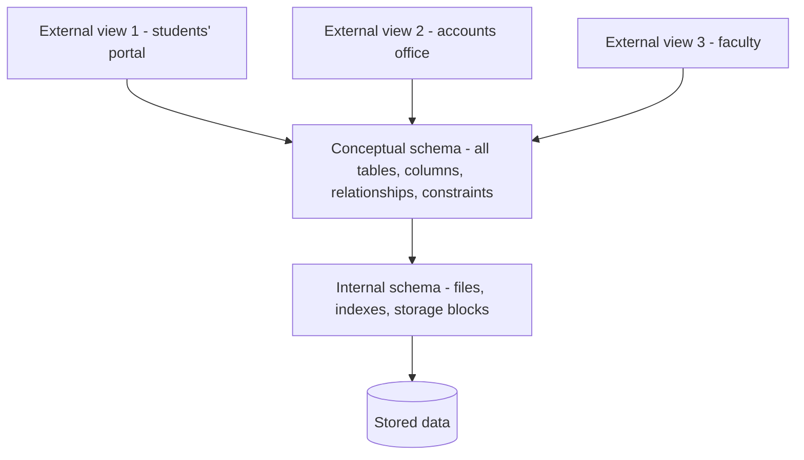
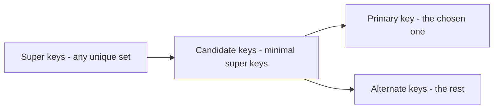
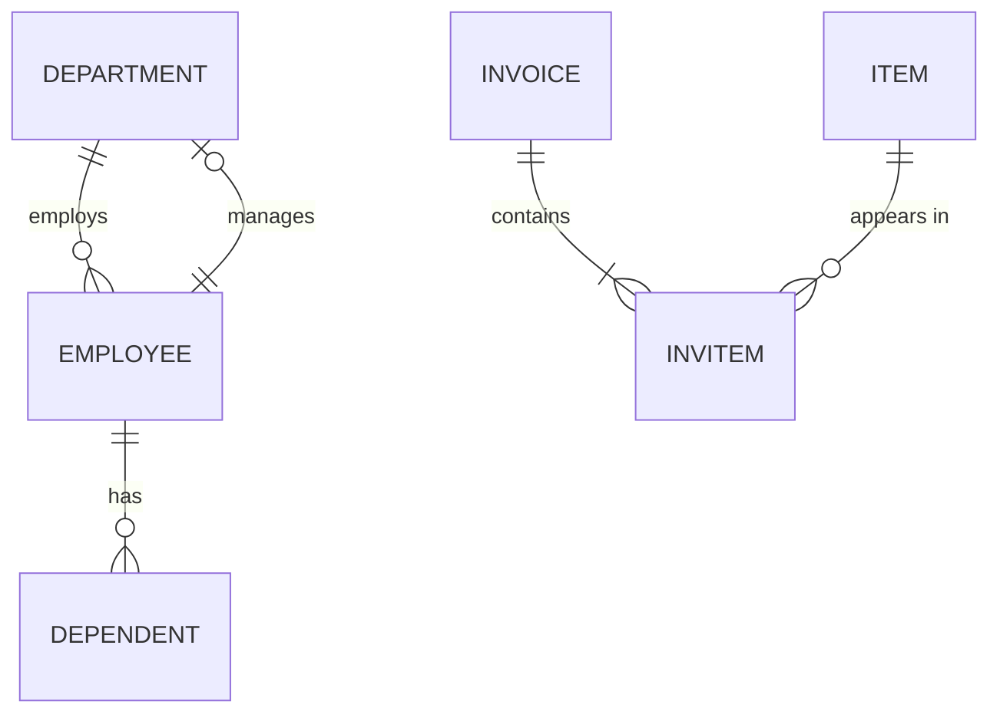
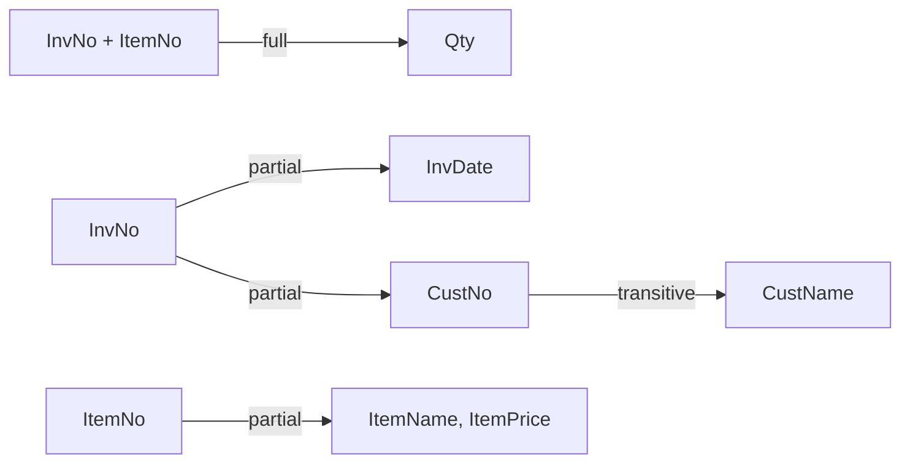
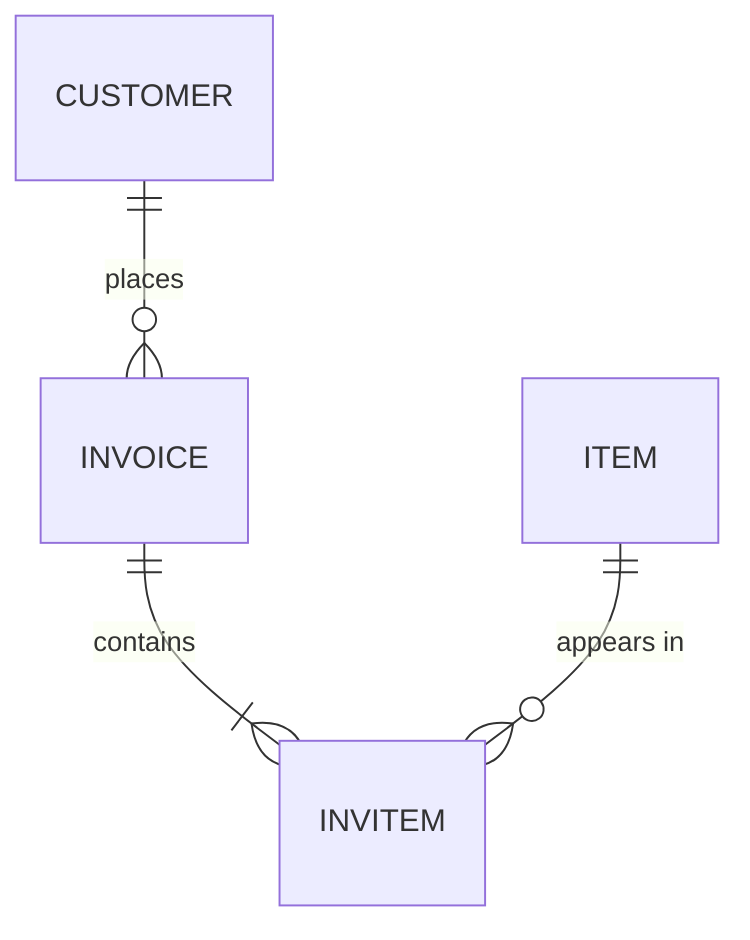
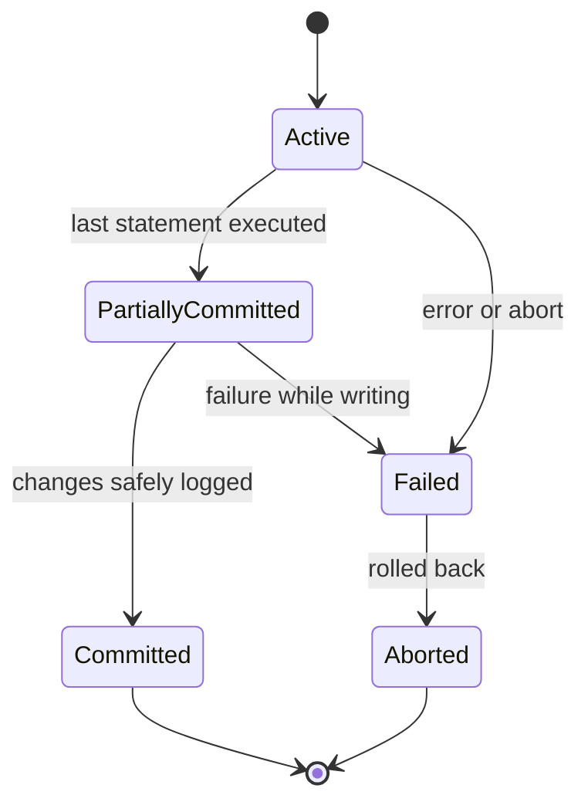
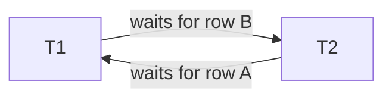
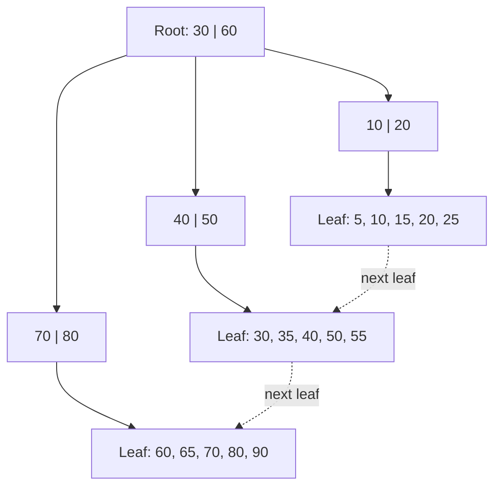

=== Database and DBMS: Basic Concepts
difficulty: easy
---
A **database** is an electronic store of data — a repository that holds information about different "things" **and the relationships between them**. A **Database Management System (DBMS)** is the software that creates, stores, retrieves and manages that data: Oracle, MySQL, PostgreSQL, SQL Server, MS Access. A DBMS based on the relational model is called an **RDBMS**.

### Basic vocabulary
- **Entity** — a person, place, event or item we keep data about (a student, a course, an invoice).
- **Data** — the raw facts describing an entity.
- **Attribute** — a characteristic of an entity (student ID, name, phone, birth date).
- **Entity set** — the collection of all related entities, given a **singular** name: STUDENT, EMPLOYEE. In a relational database an entity set becomes a **table**.
- **Database** — a collection of entity sets (a college database holds STUDENT, FACULTY, COURSE, ...).
- **Relationship** — an interaction between entity sets, described with an active verb: a student *takes* a course section; a faculty member *teaches* in a building.

**Data vs information:** data are the raw materials; **information** is processed, organized data that is useful for decisions — "the average marks of section A" is information computed from data (the individual marks).

### Types of relationships
1. **One-to-one (1:1)** — a department has one chairperson and a chairperson chairs one department.
2. **One-to-many (1:M)** — a department has many employees, but each employee works in one department.
3. **Many-to-many (M:N)** — a student takes many courses and a course has many students.

A quick test: ask "can one X have many Y?" and "can one Y have many X?". Two "no"s → 1:1; one "yes" → 1:M; two "yes"es → M:N. M:N relationships are implemented by **decomposing them into two 1:M relationships** through a linking table.

### File system vs DBMS
Before databases, each application kept its own files. The problems that caused are exactly the reasons DBMSs exist:

| File-processing system | DBMS |
|---|---|
| **Data redundancy** — the same data copied in many files | Data stored once and shared (controlled redundancy) |
| **Inconsistency** — copies get out of sync | One copy, so one truth |
| Hard to access — a new program for every new question | Ad-hoc queries in SQL |
| Program-data dependence — changing a file format breaks programs | **Data independence** |
| Integrity rules buried in program code | Constraints declared once in the schema |
| No safe concurrent access | Locking and transactions |
| Weak security | Users, roles and privileges |
| No crash recovery | Backup, logging and recovery |

### What a DBMS does
- Stores the data **and the relationships** between them.
- Maintains a **data dictionary** (system catalog) — **metadata**, "data about data": table names, column names, data types, constraints, space used, relationships.
- Manages day-to-day **transactions**.
- Provides **data independence**: applications do not need to know how data is physically stored.
- Translates logical requests (SQL) into operations on physical storage.
- Enforces **validation rules / constraints** (e.g. gender can only be 'M' or 'F').
- Provides **security** — passwords, encryption, user privileges.
- Provides **backup and recovery**.
- Lets many users **share** data safely with **locking**.
- Offers **import/export** utilities.
- Lets users **join** tables, so the design can avoid redundancy — fewer data-entry errors, better integrity.

### Components of a database system
**Hardware**, **software** (OS, network software and the DBMS), the **database** itself (tables, data dictionary, other objects), **applications** (forms, reports, programs) and **people**:
- **DBA (Database Administrator)** — installs, tunes, secures, backs up and controls access to the database;
- **database designer/analyst** — designs the schema;
- **application programmers** — write programs that use the database;
- **end users** — use the applications or query the data.

**Key points:**
- Entity → row, attribute → column, entity set → table, database → collection of tables.
- Relationships are 1:1, 1:M or M:N; M:N is implemented with a linking table.
- A DBMS fixes the file system's redundancy, inconsistency, dependence, integrity, concurrency, security and recovery problems.
- The data dictionary stores metadata.

=== DBMS Architecture: Three-Schema Model and Data Independence
difficulty: medium
---
A central goal of a DBMS is to **separate how users see data from how it is physically stored**. The standard way to describe this is the **ANSI/SPARC three-schema (three-level) architecture**.



### The three levels
1. **External (view) level** — what a particular user or application sees. Each group gets a customized **view**: the accounts office sees fee data but not exam marks; a student portal sees only that student's records. Implemented with **views** and privileges. There can be many external schemas.
2. **Conceptual (logical) level** — the **whole database** as a community sees it: all entities, attributes, relationships, data types and constraints — *what* is stored, without saying *how*. There is exactly one conceptual schema (in SQL: the CREATE TABLE definitions).
3. **Internal (physical) level** — *how* the data is actually stored: file organization, record layout, indexes, compression, block sizes, access paths. Exactly one internal schema.

The DBMS keeps **mappings** between the levels (external ↔ conceptual and conceptual ↔ internal) and translates every request through them.

### Data independence
Because of the mappings, a change at one level need not affect the level above:

- **Physical data independence** — the internal schema can change **without changing the conceptual schema** (or applications). Examples: adding an index, moving a table to a faster disk, changing file organization or compression. *Relatively easy to achieve, and fully supported by RDBMSs.*
- **Logical data independence** — the conceptual schema can change **without changing external views** or the applications using them. Examples: adding a new column or a new table; splitting a table in two and providing a view with the old shape. *Harder to achieve*, because applications are closer to the logical structure.

> Interview phrasing: "Physical independence = change storage without touching tables. Logical independence = change tables without touching applications."

### Schema vs instance
- **Schema** — the **design / structure** of the database (table definitions). It changes rarely. Also called the **intension**.
- **Instance** (state, snapshot) — the **actual data** at a given moment. It changes constantly. Also called the **extension**.

### DBMS languages
- **DDL (Data Definition Language)** — defines the schema: CREATE, ALTER, DROP, TRUNCATE, RENAME.
- **DML (Data Manipulation Language)** — works with the data: SELECT, INSERT, UPDATE, DELETE. (SELECT alone is sometimes called **DQL**.)
- **DCL (Data Control Language)** — permissions: GRANT, REVOKE.
- **TCL (Transaction Control Language)** — COMMIT, ROLLBACK, SAVEPOINT.

DML can be **procedural** (say *how* to get the data step by step — like relational algebra or PL/SQL loops) or **non-procedural / declarative** (say *what* you want and let the DBMS decide how — SQL).

### Main components inside a DBMS
- **Query processor** — parses SQL, checks it against the data dictionary, chooses an efficient execution plan (**query optimizer**) and runs it.
- **Storage manager** — manages files, buffers, indexes and the data dictionary.
- **Transaction manager** — guarantees ACID properties: **concurrency control** (locking) and **recovery** (logging).

### Two-tier and three-tier architectures
- **Two-tier (client/server):** the client application talks directly to the database server.
- **Three-tier:** client (browser) → **application server** (business logic, e.g. a web API) → database server. Used by almost all web applications, because it improves security (the database is never exposed to clients), scalability and maintainability.

**Key points:**
- Three levels: external (views), conceptual (logical design), internal (physical storage).
- Physical data independence: change storage without changing the logical schema.
- Logical data independence: change the logical schema without changing views/applications (harder).
- Schema = structure (rarely changes); instance = current data (changes constantly).

=== Data Models and Database Types: Hierarchical, Network, Relational, Object
difficulty: easy
---
A **data model** is a set of concepts for describing the structure of a database — how data is organized and how relationships are represented. Over the years several models have been used.

### Hierarchical model
Data is organized as a **tree**: each child record has exactly **one parent**, giving natural 1:M relationships (a department → its employees). Example: IBM's IMS (1960s).
- Fast for queries that follow the hierarchy.
- M:N relationships are awkward (data must be duplicated), and you can only reach a record by navigating down from its root.

### Network model
Records form a **graph**: a child can have **several parents**, so M:N relationships can be represented directly (CODASYL / IDMS).
- More flexible than hierarchical.
- Programs must still **navigate pointers** record by record, so queries are complex and the structure is hard to change.

### Relational model
Proposed by **E. F. Codd in 1970**, based on mathematical **set theory**. All data is presented as **relations — two-dimensional tables** of rows and columns. Relationships are represented by **values in common columns** (foreign keys), not by physical pointers.
- Simple logical view: users see tables and never need to know the physical layout.
- Powerful declarative query language (SQL), based on relational algebra and calculus.
- Strong theory for good design (normalization).
- The dominant model since the 1980s: Oracle, MySQL, PostgreSQL, SQL Server, DB2.

### Object and object-relational models
- **Object-oriented databases** store objects (data + methods) directly, matching OO programming languages.
- **Object-relational** systems (Oracle, PostgreSQL) add object features — user-defined types, arrays, inheritance — to the relational model.

### Entity-Relationship (ER) model
A **conceptual** (design-time) model used to draw entities, attributes and relationships before converting them into tables. (See "ER Model and ER Diagrams".)

### Personal vs client/server databases
Shah's book compares two kinds of systems:

| Issue | Personal database (e.g. MS Access on a file share) | Client/server database (e.g. Oracle) |
|---|---|---|
| Processing | Done on the **client**: whole tables travel over the network | Done on the **server**: only the query and its result travel |
| Network traffic | Heavy | Light |
| Locking | Often whole tables are locked | **Row-level** locking |
| Client failure | Can corrupt the shared files | Server rolls back the client's unfinished work |
| Transactions | Limited support | Full transaction processing with logs |
| Scale | A few users | Hundreds or thousands of users |

### Relational vs NoSQL (modern interview addition)
**NoSQL** databases drop the fixed table model to scale horizontally or store flexible data:

| Type | Stores | Examples | Good for |
|---|---|---|---|
| Key-value | Key → value | Redis, DynamoDB | Caching, sessions |
| Document | JSON-like documents | MongoDB, Firestore | Flexible schemas, catalogues |
| Column-family | Wide rows grouped into column families | Cassandra, HBase | Huge write-heavy datasets |
| Graph | Nodes and edges | Neo4j | Social networks, recommendations |

| | Relational (SQL) | NoSQL |
|---|---|---|
| Schema | Fixed, defined in advance | Flexible / schema-less |
| Relationships | Joins with foreign keys | Usually embedded or denormalized |
| Consistency | Strong, **ACID** transactions | Often **eventual consistency** (BASE) |
| Scaling | Mainly vertical (bigger server) | Horizontal (more servers) |
| Query language | SQL | Product-specific APIs |

Choose relational when data is structured and consistency matters (banking, orders, student records); consider NoSQL for massive scale, rapidly changing structure, or specific access patterns.

**Key points:**
- Hierarchical = tree (one parent); network = graph (many parents); both navigate physical pointers.
- Relational (Codd, 1970) = tables + values in common columns; based on set theory.
- Client/server databases process queries on the server and lock rows, not tables.
- SQL vs NoSQL: fixed schema + ACID + joins vs flexible schema + horizontal scale + eventual consistency.

=== The Relational Model: Relations, Tuples, Attributes, Degree and Domain
difficulty: easy
---
In the relational model the database is a collection of **relations**, each shown as a two-dimensional **table**. Codd's model uses mathematical terms, but in practice the words are used interchangeably:

| Relational term | Table term | File-system term |
|---|---|---|
| Relation | Table | File |
| Tuple | Row | Record |
| Attribute | Column | Field |
| Domain | Set of allowed values for a column | — |

### Definitions
- **Relation** — a table: a set of rows with the same columns.
- **Tuple** — one row (rhymes with "couple"); represents one entity.
- **Attribute** — one column; represents one characteristic.
- **Degree** — the **number of columns** (attributes). A table with 4 columns has degree 4.
- **Cardinality** — the **number of rows** (tuples). It changes as data is inserted and deleted.
- **Domain** — the set of all possible values of a column. Two columns have the same domain only if they share meaning *and* values: ProjNo and DeptNo are both numbers, but their domains differ.
- **Relation schema** — the name and attributes: `EMPLOYEE (EmpNo, Ename, DeptNo, ProjNo, Salary)`, with the primary key underlined in diagrams.

### Example (from the book's project database)

```calc
EMPLOYEE
EmpNo  Ename   DeptNo  ProjNo  Salary
101    Carter  10      1       25000
102    Albert  20      3       37000
103    Breen   30      6       50500
104    Gould   20      5       23700
105    Barker  10      7       75000

Degree = 5 (columns)     Cardinality = 5 (rows)
Domain of DeptNo = {10, 20, 30} (department numbers that exist)
```

### Properties of a relation
1. **Each cell holds one atomic value** — no lists or repeating groups (this is first normal form).
2. **No two rows are identical** — every row is unique (guaranteed by the primary key).
3. **The order of rows does not matter** — a relation is a *set*; "the third row" means nothing unless you sort with ORDER BY.
4. **The order of columns does not matter** — columns are referenced by name.
5. **Each column has a unique name** within the table, and all its values come from the same domain.

### NULL
**NULL** means a value that is **unknown, not entered, not defined or not applicable** — for example, an employee with no middle name, or a new hire with no department yet. NULL is **not zero and not a space**. Any comparison with NULL is *unknown*, so SQL needs special operators (`IS NULL`, `IS NOT NULL`). Shah's advice: avoid unnecessary NULLs in non-key columns, because every query must then take extra care to include or exclude them; use a **DEFAULT** value where sensible.

### Codd's rules (brief)
Codd later published **12 rules** (numbered 0–12) that a system must satisfy to be called fully relational. The best-known ideas:
- the **information rule** — all data is represented as values in tables;
- **guaranteed access** — every value is reachable by table name + primary key + column name;
- **systematic treatment of NULL**;
- an **online catalogue** (data dictionary) that is itself made of tables;
- a **comprehensive data sublanguage** (SQL);
- **physical and logical data independence**;
- **integrity independence** — integrity constraints are stored in the catalogue, not in application code.

**Key points:**
- Relation = table, tuple = row, attribute = column.
- Degree = number of columns; cardinality = number of rows; domain = allowed values.
- Rows are unique and unordered; every cell is atomic.
- NULL means unknown/not applicable — not zero, not blank.

=== Keys in DBMS: Super, Candidate, Primary, Composite, Surrogate and Foreign Keys
difficulty: medium
---
A **key** is a set of one or more columns used to identify rows. Knowing the different kinds of keys — and how they relate — is one of the most common DBMS interview topics.

Use this STUDENT table as the example:

```calc
STUDENT (StudentId, RollNo, Email, Name, Phone, DeptId)
- StudentId is unique
- Email is unique
- (RollNo, DeptId) together are unique   (roll numbers restart in every department)
```

### Super key
**Any set of columns that uniquely identifies every row.** It may contain extra, unnecessary columns.
Examples: {StudentId}, {Email}, {StudentId, Name}, {RollNo, DeptId}, {StudentId, Email, Phone}... The set of all columns is always a super key.

### Candidate key
A **minimal super key** — no column can be removed without losing uniqueness. Here: **{StudentId}**, **{Email}** and **{RollNo, DeptId}**. {StudentId, Name} is a super key but not a candidate key, because Name is unnecessary.

### Primary key
The candidate key **chosen by the designer** to identify rows. Rules:
- **unique** and **NOT NULL** (entity integrity);
- should be **stable** (should not change) and preferably short.

Choose StudentId. Shah's definition: *a key is a minimal set of columns used to uniquely define any row* — if one column is enough, do not use two.

### Alternate key
The candidate keys **not chosen** as the primary key: {Email} and {RollNo, DeptId}. Usually enforced with a **UNIQUE** constraint.

### Composite (concatenated) key
A key made of **two or more columns**. In the book's PRJPARTS table (ProjNo, PartNo, Qty) neither ProjNo nor PartNo is unique on its own, but **(ProjNo, PartNo)** together are — that is a **composite primary key**. Linking tables for M:N relationships almost always have composite keys.

### Secondary key
A column used to **search or retrieve** data in a human-friendly way that is not necessarily unique — a vendor name, an employee's last name, a book title. It is not part of the table's structure in Oracle, just a column people search on (and often index).

### Surrogate key
When no natural column makes a good primary key (or the natural key is long or composite), designers add an **artificial column** just to identify rows: customer ID, invoice number, an auto-increment or sequence-generated number. It has no business meaning, never changes and is compact. (The opposite is a **natural key** such as an Aadhaar or ISBN number.)

### Foreign key
A column (or set of columns) in one table that **references the primary key (or a unique key) of another table**, linking the two tables. In PRJPARTS, PartNo is a foreign key referencing PARTS(PartNo).
- A foreign key value must **match an existing primary key value** or be **NULL** (referential integrity).
- A table can reference **itself** — a self-referencing foreign key, like `manager_id → employee(emp_id)`.
- Foreign keys are what make joins meaningful.



### Summary table

| Key | Unique? | NULL allowed? | How many per table? |
|---|---|---|---|
| Super key | Yes | — | Many |
| Candidate key | Yes, minimal | No (ideally) | One or more |
| Primary key | Yes | **No** | Exactly one |
| Alternate / unique key | Yes | Usually yes (one or more NULLs, depending on the DBMS) | Zero or more |
| Foreign key | No | Yes | Zero or more |

> **Primary key vs unique key:** a table has only one primary key and it can never be NULL; it can have several unique keys, which usually allow NULLs. Many DBMSs create a clustered index on the primary key by default.

**Key points:**
- Every candidate key is a super key; not every super key is a candidate key.
- Primary key = chosen candidate key; unique and NOT NULL; one per table.
- Composite key = multiple columns; surrogate key = artificial ID with no business meaning.
- Foreign key references another table's primary key; it may be NULL.

=== Integrity Constraints: Entity, Referential and Domain Integrity
difficulty: medium
---
Data is only useful if it is **consistent**. The relational model therefore defines **integrity rules**, which the DBMS enforces on every insert, update and delete — so they cannot be bypassed by a buggy application.

### 1. Entity integrity
> **No column of a primary key may be NULL.**

The primary key is what identifies a row. If any part of it were NULL we would not have enough information to identify the row uniquely. Every RDBMS enforces this strictly: a PRIMARY KEY column is automatically NOT NULL and UNIQUE.

### 2. Referential integrity
> **A foreign key value must either be NULL, or match an existing primary key value in the referenced table.**

You cannot record an employee in department 50 if department 50 does not exist. The DBMS checks the referenced table on every insert/update of the child, and on every delete/update of the parent.

What happens when a **parent row is deleted** while child rows still reference it? That is decided by the **referential action** declared on the foreign key:

| Action | Effect when the parent row is deleted |
|---|---|
| **RESTRICT / NO ACTION** (default) | The delete is **rejected** while children exist |
| **ON DELETE CASCADE** | The child rows are **deleted too** |
| **ON DELETE SET NULL** | The child's foreign key is **set to NULL** |
| **ON DELETE SET DEFAULT** | Set to the column default (not supported in Oracle) |

```sql
-- not run (illustration)
CREATE TABLE enrollment (
  student_id INT REFERENCES student(student_id) ON DELETE CASCADE,
  course_id  INT REFERENCES course(course_id),
  PRIMARY KEY (student_id, course_id)
);
-- Deleting a student automatically deletes their enrollments;
-- deleting a course that still has enrollments is rejected.
```

### 3. Domain integrity
Every value in a column must come from the column's **domain**: the right data type, length and range. It is enforced by:
- the **data type** (you cannot store 'abc' in a NUMBER column);
- **NOT NULL**;
- **CHECK** constraints — `CHECK (gender IN ('M','F'))`, `CHECK (salary > 0)`;
- **DEFAULT** values for omitted columns.

### 4. Key constraint (uniqueness)
Values of a candidate key must be unique — enforced with PRIMARY KEY and **UNIQUE** constraints.

### 5. User-defined (business) integrity
Rules specific to the organization: "a course section has between 5 and 35 students", "an order date cannot be in the future". Simple ones become CHECK constraints; complex ones that involve several rows or tables are enforced with **triggers** or **assertions**.

### Constraint types in SQL

| Constraint | Purpose |
|---|---|
| PRIMARY KEY | Unique + NOT NULL identifier (entity integrity) |
| FOREIGN KEY ... REFERENCES | Link to a parent table (referential integrity) |
| UNIQUE | No duplicate values (NULLs usually allowed) |
| NOT NULL | Value required |
| CHECK | Value must satisfy a condition (domain integrity) |
| DEFAULT | Value used when none is given (strictly a default, not a constraint) |

Constraints can be declared at **column level** (next to the column) or **table level** (after all columns — required for composite keys), and should be **named** (`CONSTRAINT emp_dept_fk FOREIGN KEY ...`) so error messages and later ALTER commands are clear.

**Key points:**
- Entity integrity: primary key columns can never be NULL.
- Referential integrity: a foreign key is NULL or matches an existing parent key.
- ON DELETE CASCADE / SET NULL / RESTRICT decide what happens to child rows.
- Domain integrity: data type, NOT NULL, CHECK and DEFAULT keep values valid.

=== Relational Algebra
difficulty: hard
---
**Relational algebra** is a **procedural** query language proposed by Codd: you reach the answer by applying a **sequence of operations**, each of which takes tables as input and produces a new table. It is the theoretical foundation of SQL and of every query optimizer — the DBMS converts your SQL into an algebra expression and then rearranges it to run faster.

The book's example tables:

```calc
PROJ2002 (ProjNo, Loc, Customer)      PROJ2003 (ProjNo, Loc, Customer)
1 Miami Stocks                        1 Miami Stocks
3 Trenton Smith                       2 Orlando Allen
5 Phoenix Robins                      3 Trenton Smith
6 Edison Shaw                         4 Charlotte Jones
7 Seattle Douglas

PARTS (PartNo, PartDesc, Vendor, Cost)   PRJPARTS (ProjNo, PartNo, Qty)
11 Nut     Richards 19.95                1 11 20    2 33 5    3 11 7
22 Bolt    Black     5.00                1 22 10    2 11 3
33 Washer  Mobley   55.99

DEPARTMENT (DeptNo, DeptName)   EMPLOYEE (EmpNo, Ename, DeptNo, ProjNo, Salary)
10 Production                   101 Carter 10 1 25000    104 Gould  20 5 23700
20 Supplies                     102 Albert 20 3 37000    105 Barker 10 7 75000
30 Marketing                    103 Breen  30 6 50500
```

### Set operations (tables must be **union compatible**: same degree, matching domains)
- **Union (∪)** — rows in either table, duplicates removed.
- **Intersection (∩)** — rows in both tables.
- **Difference (−)** — rows in the first table but not the second. **A − B ≠ B − A.**

```sql
-- PROJ2002 - PROJ2003: projects in 2002 that did not continue in 2003
SELECT * FROM proj2002
EXCEPT
SELECT * FROM proj2003
ORDER BY projno;
```

```text
projno | loc     | customer
-------+---------+---------
5      | Phoenix | Robins
6      | Edison  | Shaw
7      | Seattle | Douglas
```

PROJ2002 ∪ PROJ2003 gives projects 1–7 (seven rows; 1 and 3 appear once), and PROJ2002 ∩ PROJ2003 gives projects 1 and 3.

### Selection (σ) — horizontal slice
Picks the **rows** that satisfy a condition. Written σ<sub>condition</sub>(R) or, in the book's notation, `Sel(PARTS : Cost > 10.00)`. SQL: the **WHERE** clause.

### Projection (π) — vertical slice
Picks **columns** and removes duplicate rows. Written π<sub>PartDesc, Cost</sub>(PARTS). SQL: the **SELECT list** (with DISTINCT for true set semantics).

```sql
-- pi PartDesc, Cost ( sigma Cost > 10 (PARTS) )
SELECT partdesc, cost FROM parts WHERE cost > 10 ORDER BY partno;
```

```text
partdesc | cost
---------+------
Nut      | 19.95
Washer   | 55.99
```

### Cartesian product (×)
Combines **every row of the first table with every row of the second**. If R has x rows and m columns and S has y rows and n columns, R × S has **x × y rows and m + n columns**. EMPLOYEE (5 rows) × DEPARTMENT (3 rows) = 15 rows. Usually only an intermediate step.

### Join (⋈)
A product followed by a selection on related columns (and a projection to remove the duplicate column). Joining EMPLOYEE and DEPARTMENT on DeptNo attaches each employee's department name. A join on equality of values is an **equijoin**; when the common column is matched by name and kept only once, it is a **natural join**. Joins are the most important — and most expensive — operation.

### Division (÷)
Finds rows in one table related to **all** rows of another — the "for all" query. *Which parts are used in every project?*

```calc
PRJPARTS (ProjNo, PartNo) / PROJ (ProjNo = 1, 2, 3)
Part 11 appears with projects 1, 2 and 3  -> included
Part 22 appears only with project 1      -> excluded
Part 33 appears only with project 2      -> excluded
Result: PartNo = 11
```

SQL has no DIVIDE operator; it is written with a double NOT EXISTS ("there is no project this part is not used in"):

```sql
SELECT DISTINCT p.partno
FROM prjparts p
WHERE NOT EXISTS (
  SELECT 1 FROM (VALUES (1), (2), (3)) AS proj(projno)
  WHERE NOT EXISTS (
    SELECT 1 FROM prjparts x
    WHERE x.partno = p.partno AND x.projno = proj.projno));
```

```text
partno
------
11
```

### Assignment (←) and rename (ρ)
**Assignment** stores an intermediate result under a name (`TABLE_A ← PROJ2002 ∪ PROJ2003`); **rename** gives a relation or attribute a new name (needed for self-joins).

### Putting operations together
*Which employee works on a project in Miami during 2003?*

```calc
A <- join(PROJ2003, EMPLOYEE : ProjNo = ProjNo)
B <- Sel(A : Loc = 'Miami')
C <- B(Ename)            -> Carter
```

The same query in SQL:

```sql
SELECT e.ename
FROM proj2003 p JOIN employee e ON e.projno = p.projno
WHERE p.loc = 'Miami';
```

```text
ename
------
Carter
```

### Fundamental vs derived operations
The **fundamental** operations are selection, projection, union, difference, Cartesian product and rename; **intersection, join and division** can be expressed using them (e.g. R ∩ S = R − (R − S)). Relational algebra cannot sort, group, do arithmetic or format output — SQL adds those.

**Key points:**
- Procedural: a sequence of operations on tables producing tables.
- σ selects rows, π selects columns, × combines every pair, ⋈ = product + selection.
- Union, intersection and difference need union-compatible tables.
- Division answers "for all" questions; SQL expresses it with double NOT EXISTS.

=== Relational Calculus and How It Relates to SQL
difficulty: medium
---
Codd proposed two theoretical query languages for the relational model:
1. **Relational algebra** — **procedural**: you specify *how* to get the result, as a sequence of operations.
2. **Relational calculus** — **non-procedural (declarative)**: you specify *what* the result must satisfy, and the system works out the operations.

Both have the same expressive power (Codd's theorem: safe relational calculus and relational algebra can express exactly the same queries). A language that can express all of them is called **relationally complete** — SQL is relationally complete, and goes further with aggregation, sorting and arithmetic.

### Tuple relational calculus (TRC)
Variables range over **rows (tuples)**. The general form used in Shah's book:

```calc
Result = (column list) : expression
```

The columns to output are on the left of the colon, the conditions on the right; **r** is a **row variable** ("r in PRJPARTS" means r ranges over the rows of PRJPARTS).

**Problem 1 — find projects that use part 11:**

```calc
(r.ProjNo) : r in PRJPARTS and r.PartNo = 11
Result: ProjNo 1, 3, 2
```

The same in relational algebra takes two explicit steps — `M = Sel(PRJPARTS : PartNo = 11)` then `N = M(ProjNo)` — and in SQL:

```sql
SELECT projno FROM prjparts WHERE partno = 11 ORDER BY projno;
```

```text
projno
------
1
2
3
```

**Problem 2 — names and salaries of employees who work in Production (two row variables):**

```calc
(r.Ename, r.Salary) : r in EMPLOYEE and s in DEPARTMENT and
                      s.DeptName = 'Production' and r.DeptNo = s.DeptNo
```

```sql
SELECT r.ename, r.salary
FROM employee r, department s
WHERE s.deptname = 'Production' AND r.deptno = s.deptno
ORDER BY r.empno;
```

```text
ename  | salary
-------+-------
Carter | 25000
Barker | 75000
```

Notice how closely the SQL mirrors the calculus: the FROM clause declares the row variables, WHERE holds the conditions and SELECT lists the output columns. **SQL is essentially tuple relational calculus with a friendlier syntax.**

### Quantifiers
Formal TRC is written {t | P(t)} and uses the quantifiers **∃ (there exists)** and **∀ (for all)**:

```calc
Employees who work on at least one project located in Miami (2003):
{ e.Ename | e in EMPLOYEE and EXISTS p in PROJ2003 (p.ProjNo = e.ProjNo and p.Loc = 'Miami') }
```

∃ maps to SQL's **EXISTS**; ∀ is expressed as **NOT EXISTS ... NOT EXISTS** ("there is no row for which the condition fails"), exactly as in the division example of relational algebra.

### Domain relational calculus (DRC)
Variables range over **column values (domains)** instead of whole rows: {⟨n, s⟩ | ∃ e, d, p (⟨e, n, d, p, s⟩ ∈ EMPLOYEE ∧ s > 50000)}. **QBE (Query By Example)** — the grid interfaces of MS Access — is based on domain calculus.

### Safety
A calculus expression must be **safe**: its result must be finite and use only values that appear in the database. {t | NOT (t in EMPLOYEE)} is unsafe — it describes infinitely many tuples.

### Algebra vs calculus

| | Relational algebra | Relational calculus |
|---|---|---|
| Style | Procedural — *how* | Declarative — *what* |
| Expressed as | Sequence of operations | Logical formula with variables and quantifiers |
| Variants | — | Tuple (TRC) and domain (DRC) calculus |
| Used for | Query execution plans and optimization | Basis of SQL (TRC) and QBE (DRC) |
| Power | Same (for safe expressions) | Same |

**Key points:**
- Relational calculus is declarative: describe the result, not the steps.
- TRC uses row variables; DRC uses column-value variables.
- SQL's FROM / WHERE / SELECT mirror TRC's row variables / conditions / output list.
- ∃ ↔ EXISTS; ∀ ↔ NOT EXISTS of a NOT EXISTS. Algebra and safe calculus are equally powerful.

=== ER Model and ER Diagrams
difficulty: medium
---
Before creating tables, designers draw a **model** — a simplified picture of the real-world data. The most popular is the **Entity-Relationship (E-R) model** (Peter Chen, 1976), drawn as an **E-R diagram (ERD)**. It is an excellent **communication tool** between designers and users and a simple graphical representation of data.

### Building blocks
- **Entity (set)** — drawn as a **rectangle** with a singular, uppercase name: EMPLOYEE, CUSTOMER.
- **Relationship** — a line (or a diamond in Chen notation) labelled with an **active verb**: *manages*, *employs*, *contains*.
- **Attribute** — an oval (Chen) or a list inside the entity box (crow's foot).

### Types of attributes
- **Simple (atomic)** — cannot be divided: gender, city.
- **Composite** — can be divided into parts: Name → First, Middle, Last; Address → Street, City, PIN. Store the parts in separate columns.
- **Single-valued** — one value per entity: date of birth, employee ID.
- **Multivalued** — several values: phone numbers, degrees, skills. In tables they must be moved to a **separate table** (not Phone1, Phone2, Phone3 columns).
- **Derived** — computed from others: age from date of birth, total from quantity × price. Usually not stored.
- **Key attribute** — uniquely identifies the entity (underlined).

### Connectivity and cardinality
- **Connectivity** (multiplicity) — the type of relationship: **1:1, 1:M, M:N**.
- **Cardinality** — the **minimum and maximum** number of related entities, written (min, max) next to each entity. (1,1) = exactly one; (0,N) = zero or more; (1,N) = at least one. Limits come from **business rules** — e.g. a course section must have between 5 and 35 students → (5,35).
- **Optional relationship** — the minimum is 0 (shown with a small circle): a customer may have rented no videos, and a video may not be rented at the moment.
- **Participation:** **total** (every entity must take part, min ≥ 1) vs **partial** (min = 0).



*(Crow's-foot notation: `||` = exactly one, `o|` = zero or one, `o{` = zero or many, `|{` = one or many.)*

### Composite (associative) entities — resolving M:N
An M:N relationship cannot be stored directly in relational tables. It is decomposed into **two 1:M relationships** through a **composite (associative / bridge) entity**, whose primary key combines the primary keys of the two entities:

```calc
INVOICE (InvoiceNo, InvoiceDate)          ITEM (ItemNo, ItemName, Price)
              1 : M                                  1 : M
          INVITEM (InvoiceNo, ItemNo, Qty)
          PK = (InvoiceNo, ItemNo)
          InvoiceNo -> FK to INVOICE,  ItemNo -> FK to ITEM
```

The composite entity often has attributes of its own (Qty here, marks for a student–course registration).

### Weak entities
A **weak entity** cannot exist without its **owner (strong) entity** and has no complete key of its own. A DEPENDENT exists only because an EMPLOYEE exists; dependents are identified by (EmpNo, dependent name). Drawn with a **double rectangle**; the identifying relationship with a double diamond. Its primary key = owner's key + a **partial key** (discriminator). Deleting the owner usually deletes its weak entities (ON DELETE CASCADE).

### Other concepts
- **Recursive (unary) relationship** — an entity related to itself: an EMPLOYEE *manages* other EMPLOYEEs (implemented as a self-referencing foreign key).
- **Degree of a relationship** — unary (1 entity), binary (2, the most common), ternary (3).
- **Generalization / specialization** (EER) — EMPLOYEE specialized into FULL_TIME and PART_TIME (an "is-a" hierarchy); generalization is the reverse, bottom-up.
- **Aggregation** — treating a relationship as an entity so it can take part in another relationship.

### Converting an ERD to tables
1. Each **strong entity** → a table; simple attributes → columns; key → primary key; composite attributes → their parts.
2. **1:M** → put the primary key of the "one" side as a **foreign key** in the "many" side.
3. **1:1** → put a foreign key on either side (usually the side with total participation), with a UNIQUE constraint.
4. **M:N** → a new **linking table** with both keys as a composite primary key.
5. **Multivalued attribute** → a new table (owner key + value).
6. **Weak entity** → table whose primary key includes the owner's key.

**Key points:**
- ERD: entities (rectangles), relationships (verbs), attributes (simple/composite, single/multivalued, derived, key).
- Connectivity = 1:1/1:M/M:N; cardinality = (min, max) set by business rules.
- M:N is resolved with a composite (associative) entity with a composite key.
- Weak entities depend on an owner and borrow its key.

=== Functional Dependencies: Full, Partial and Transitive
difficulty: medium
---
Normalization is built on one idea: **functional dependency (FD)**.

> **X → Y** ("X determines Y", "Y is functionally dependent on X") means: whenever two rows have the same value of X, they must have the same value of Y.

In the PARTS table, PartNo → PartDesc, Cost: knowing the part number tells you exactly one description and one cost. In DEPARTMENT, DeptNo → DeptName. X is called the **determinant**.

### The book's INVOICE example

```calc
INVOICE (InvNo, InvDate, CustNo, ItemNo, CustName, ItemName, ItemPrice, Qty)
InvNo  InvDate   CustNo ItemNo CustName ItemName ItemPrice Qty
1001   04/14/03  212    1      Starks   Screw    2.25      5
1001   04/14/03  212    3      Starks   Bolt     3.99      5
1001   04/14/03  212    5      Starks   Washer   1.99      9
1002   04/17/03  225    1      Connors  Screw    2.25      2
1002   04/17/03  225    2      Connors  Nut      5.00      3
1003   04/17/03  239    1      Kapur    Screw    2.25      7
1003   04/17/03  239    2      Kapur    Nut      5.00      1
1004   04/18/03  211    4      Garcia   Hammer   9.99      5
```

No single column identifies a row: InvNo repeats (an invoice has several items), CustNo repeats (a customer has several invoices) and ItemNo repeats (an item appears on several invoices). The primary key is the **composite key (InvNo, ItemNo)**. The FDs are:

```calc
InvNo          -> InvDate, CustNo
CustNo         -> CustName
ItemNo         -> ItemName, ItemPrice
InvNo, ItemNo  -> Qty
```

### Three kinds of dependency on a primary key
1. **Full (total) dependency** — a nonkey column depends on the **whole** primary key. *Qty* needs both InvNo and ItemNo.
2. **Partial dependency** — a nonkey column depends on **part of a composite key**. *InvDate* depends only on InvNo; *ItemName* and *ItemPrice* depend only on ItemNo. Partial dependency can only exist when the key is composite.
3. **Transitive dependency** — a nonkey column depends on **another nonkey column**. *CustName* depends on CustNo, which depends on InvNo: InvNo → CustNo → CustName.



### Trivial and non-trivial FDs
- **Trivial:** Y is a subset of X — {InvNo, ItemNo} → InvNo. Always true and uninteresting.
- **Non-trivial:** Y is not a subset of X — InvNo → InvDate.

### Armstrong's axioms (inference rules)
From a set of FDs you can derive others:
- **Reflexivity:** if Y ⊆ X then X → Y.
- **Augmentation:** if X → Y then XZ → YZ.
- **Transitivity:** if X → Y and Y → Z then X → Z.

Derived rules: **union** (X → Y and X → Z ⟹ X → YZ), **decomposition** (X → YZ ⟹ X → Y and X → Z) and **pseudo-transitivity** (X → Y and WY → Z ⟹ WX → Z). The axioms are **sound** (they derive only valid FDs) and **complete** (they derive all of them).

### Attribute closure — finding keys
The **closure X⁺** is the set of all attributes determined by X. Start with X and keep adding the right-hand side of any FD whose left-hand side is already inside the set.

```calc
R(A, B, C, D, E)   FDs: A -> B,  B -> C,  CD -> E
{A}+    = {A, B, C}                     (A->B, then B->C)
{A,D}+  = {A, D} -> add B -> add C -> CD in set, add E = {A, B, C, D, E}
{A,D}+ contains every attribute, so AD is a super key.
{A}+ and {D}+ = {D} do not, so AD is minimal -> AD is a candidate key.
Tip: an attribute that never appears on the right of any FD (A and D here)
must be part of every candidate key.
```

Interview questions often give a relation and FDs and ask for all candidate keys, or the highest normal form — attribute closure answers both.

**Key points:**
- X → Y: equal X values force equal Y values.
- Full = depends on the whole key; partial = on part of a composite key; transitive = through another nonkey column.
- Armstrong's axioms: reflexivity, augmentation, transitivity.
- If X⁺ contains all attributes, X is a super key; a minimal one is a candidate key.

=== Anomalies and Normalization: 1NF, 2NF and 3NF
difficulty: hard
---
In the INVOICE table (see "Functional Dependencies") data repeats from row to row: InvDate, CustNo and CustName repeat for every item on an invoice, and ItemName/ItemPrice repeat on every invoice. Someone must type the same data again and again, and a change must be made in many places — if Starks changes their name, every Starks row must be updated. This **redundancy** causes **anomalies**:

- **Insertion anomaly** — information about one entity cannot be inserted without information about another. A newly purchased item cannot be recorded until some invoice contains it.
- **Deletion anomaly** — deleting one entity's information also deletes another's. Removing Garcia's invoice 1004 also removes the only record of item 4 (Hammer).
- **Update anomaly** — one fact is stored in many rows, so an update must touch them all; missing one leaves the data **inconsistent** (Screw priced 2.25 in one row, 2.50 in another).

**Normalization** is the process of **decomposing tables into smaller tables** to remove redundancy and anomalies, **without losing information**. The higher the normal form, the lower the redundancy. Each normal form includes the previous one.

### Unnormalized form (UNF)
The book's Figure 2-9 shows invoice 1001 as **one row** whose ItemNo, ItemName, ItemPrice and Qty columns each hold **several values** (1, 3, 5 / Screw, Bolt, Washer ...). Multivalued columns or repeating groups = not even 1NF.

### First Normal Form (1NF)
A table is in 1NF when:
- a **primary key is defined** (composite if necessary — here InvNo + ItemNo);
- all nonkey columns are **functionally dependent on the primary key**;
- **every column is single-valued (atomic)** — the intersection of a row and a column holds only one value. No repeating groups, no lists, no Phone1/Phone2/Phone3 columns.

Converting to 1NF means repeating the invoice data on a row per item, which gives the 8-row INVOICE table. It is 1NF — but still full of redundancy.

### Second Normal Form (2NF)
> 1NF **and no partial dependency** (every nonkey column depends on the **whole** key).

A 1NF table **without a composite key is automatically in 2NF**, because partial dependency needs a composite key.

**1NF → 2NF:** move each group of partially dependent columns to a new table, together with the part of the key it depends on; columns fully dependent on the composite key stay behind.

```calc
INVOICE (InvNo, InvDate, CustNo, CustName)   <- depended on InvNo only
ITEM    (ItemNo, ItemName, ItemPrice)        <- depended on ItemNo only
INVITEM (InvNo, ItemNo, Qty)                 <- full dependency stays
```

### Third Normal Form (3NF)
> 2NF **and no transitive dependency** (no nonkey column depends on another nonkey column).

INVOICE still has InvNo → CustNo → CustName. **2NF → 3NF:** move the transitively dependent columns to a new table whose primary key is their determinant, and keep that determinant in the original table as a **foreign key**.

```calc
INVOICE  (InvNo, InvDate, CustNo)    CustNo -> FK to CUSTOMER
CUSTOMER (CustNo, CustName)
ITEM     (ItemNo, ItemName, ItemPrice)
INVITEM  (InvNo, ItemNo, Qty)        InvNo -> FK, ItemNo -> FK
```



Now every fact is stored once: a customer's name in one row, an item's price in one row. All three anomalies are gone — a new item is just a row in ITEM, deleting invoice 1004 leaves Hammer in ITEM, and a price change touches one row.

### Lossless: the original data comes back with joins
Normalization must not lose information. Joining the 3NF tables reproduces the original INVOICE rows:

```sql
SELECT i.invno, c.custname, t.itemname, t.itemprice, x.qty
FROM invoice i
JOIN customer c ON c.custno = i.custno
JOIN invitem  x ON x.invno  = i.invno
JOIN item     t ON t.itemno = x.itemno
WHERE i.invno = 1001
ORDER BY t.itemno;
```

```text
invno | custname | itemname | itemprice | qty
------+----------+----------+-----------+----
1001  | Starks   | Screw    | 2.25      | 5
1001  | Starks   | Bolt     | 3.99      | 5
1001  | Starks   | Washer   | 1.99      | 9
```

### A memory aid
> Every nonkey column must depend on **the key** (1NF), **the whole key** (2NF), and **nothing but the key** (3NF).

### Formal 3NF definition
For every non-trivial FD X → A, either **X is a super key** or **A is a prime attribute** (part of some candidate key). The second escape clause is what BCNF removes.

**Key points:**
- Redundancy causes insertion, deletion and update anomalies.
- 1NF: primary key + atomic values; 2NF: no partial dependency; 3NF: no transitive dependency.
- A 1NF table with a single-column key is automatically 2NF.
- Decompose by moving dependent columns out with their determinant; keep it behind as a foreign key.

=== BCNF, 4NF, 5NF and Properties of Decomposition
difficulty: hard
---
Shah's book stops at 3NF (it names BCNF, 4NF, 5NF and DKNF but does not cover them). They are standard interview topics, so this topic covers them.

### Boyce–Codd Normal Form (BCNF)
> For **every** non-trivial FD X → Y, **X must be a super key**.

3NF allows one exception — X → A where A is a **prime attribute** (part of a candidate key). BCNF removes it, so BCNF is stricter: **every BCNF table is in 3NF, but not every 3NF table is in BCNF.** The difference shows up only when a table has **multiple overlapping composite candidate keys**.

```calc
TEACHES (Student, Course, Teacher)
Rules: each teacher teaches exactly one course   -> Teacher -> Course
       a student takes a course from one teacher -> (Student, Course) -> Teacher
Candidate keys: (Student, Course) and (Student, Teacher)
Student  Course  Teacher
Asha     DBMS    Rao
Ravi     DBMS    Rao
Asha     OS      Iyer
Ravi     DBMS    -> must be Rao: if Rao changes course, update many rows

Teacher -> Course: Teacher is not a super key, but Course is prime
-> 3NF (allowed by the escape clause) but NOT BCNF.
Decompose: TEACHER_COURSE(Teacher, Course), STUDENT_TEACHER(Student, Teacher)
```

The decomposition is lossless, but the FD (Student, Course) → Teacher can no longer be checked within a single table — **BCNF decomposition is not always dependency-preserving.** That is why designers sometimes stop at 3NF.

### Fourth Normal Form (4NF) — multivalued dependencies
A **multivalued dependency (MVD)** X ↠ Y means X determines a *set* of Y values independently of the other columns.

```calc
EMP_SKILL_LANG (Emp, Skill, Language)
An employee's skills and languages are independent facts:
Asha  SQL   English
Asha  SQL   Hindi
Asha  Java  English
Asha  Java  Hindi       <- every combination must be stored
Emp ->> Skill  and  Emp ->> Language
```

> **4NF** = BCNF and **no non-trivial multivalued dependency** (except on a super key).

Decompose into EMP_SKILL(Emp, Skill) and EMP_LANG(Emp, Language). Adding one language now adds one row, not one per skill.

### Fifth Normal Form (5NF / Project-Join NF)
> A table is in 5NF when it **cannot be decomposed further without loss** — every **join dependency** is implied by the candidate keys.

Classic case: SUPPLIER–PART–PROJECT with a rule such as "if a supplier supplies a part, the part is used in a project and the supplier supplies that project, then the supplier supplies that part to that project". Such a table can be split into **three** two-column tables and rebuilt losslessly by joining all three, although no two of them suffice. 5NF is rarely needed in practice.

**DKNF (Domain-Key Normal Form)** — every constraint is a logical consequence of domain constraints and key constraints. It is theoretical.

### Summary

| Normal form | Requirement |
|---|---|
| 1NF | Atomic values, primary key, no repeating groups |
| 2NF | 1NF + no partial dependency |
| 3NF | 2NF + no transitive dependency (X super key or A prime) |
| BCNF | Every determinant is a super key |
| 4NF | BCNF + no non-trivial multivalued dependency |
| 5NF | 4NF + no non-trivial join dependency |

### Properties of a good decomposition
1. **Lossless (non-additive) join** — joining the decomposed tables gives back **exactly** the original rows, with no extra (spurious) rows. A decomposition of R into R1 and R2 is lossless if the **common attributes form a key of R1 or of R2**: (R1 ∩ R2) → R1 or (R1 ∩ R2) → R2. In the invoice example, INVOICE ∩ CUSTOMER = CustNo, the key of CUSTOMER.
2. **Dependency preservation** — every original FD can be checked inside a single decomposed table, without joins.

Decomposition to **3NF can always achieve both**; **BCNF guarantees lossless join but not always dependency preservation**. Losslessness is mandatory; dependency preservation is desirable.

**Key points:**
- BCNF: the left side of every non-trivial FD is a super key; stricter than 3NF.
- 3NF ≠ BCNF only with overlapping composite candidate keys.
- 4NF removes independent multivalued facts; 5NF removes join dependencies.
- Lossless if the common columns are a key of one side; 3NF keeps dependencies, BCNF may not.

=== Denormalization: When to Break the Rules
difficulty: easy
---
Normalization splits data into many small tables, and they must be **joined** to answer questions. The more tables, the more joins, and in a busy multi-user system joins cost CPU, memory and I/O.

**Denormalization** is the reverse process: deliberately **lowering the normal form and adding controlled redundancy** to make reads faster. Shah's book: *with denormalization, the information is stored with duplicate data, more storage is required, and anomalies and inconsistent data can exist. The designer has to weigh this against performance.*

### Common denormalization techniques
- **Storing derived values** — keep `invoice_total` in INVOICE instead of summing INVITEM × ITEM every time; keep `order_count` on CUSTOMER.
- **Copying a column into a child table** — store `customer_name` on each order so order listings need no join.
- **Merging tables** that are always read together (1:1 relationships).
- **Pre-joined / summary tables** — a daily sales summary for dashboards.
- **Materialized views** — the DBMS stores the result of a query and refreshes it.
- **Repeating groups** for fixed small sets — `jan_sales ... dec_sales` columns in a reporting table.

### Normalization vs denormalization

| | Normalized | Denormalized |
|---|---|---|
| Redundancy | Minimal | Deliberate |
| Writes (insert/update) | Fast, one place to change | Slower, many copies to keep in sync |
| Reads | More joins | Fewer joins, faster |
| Integrity | Easy to keep consistent | Risk of anomalies |
| Storage | Less | More |
| Typical use | OLTP — banking, orders, registrations | OLAP / reporting / data warehouses, read-heavy pages |

### How to denormalize safely
1. **Normalize first** (at least to 3NF); then denormalize only where measurements show a real performance problem.
2. Keep the redundant copies consistent with **triggers**, application logic or scheduled refreshes.
3. Document every intentional redundancy.

Data warehouses go furthest: a **star schema** keeps one large **fact table** (sales) surrounded by denormalized **dimension tables** (date, product, store) — designed for fast aggregation, not for updates.

**Key points:**
- Denormalization adds redundancy to reduce joins and speed up reads.
- Costs: more storage, slower writes, possible anomalies.
- Normalize first, denormalize where measured performance needs it.
- OLTP → normalized; OLAP/reporting → denormalized (star schema).

=== Transactions and ACID Properties
difficulty: medium
---
A **transaction** is a **logical unit of work** — a sequence of SQL statements that must succeed or fail **as a whole**. Transferring ₹5,000 from account A to account B is one transaction made of two updates:

```sql
-- not run (illustration)
BEGIN;                                                           -- Oracle starts implicitly
UPDATE account SET balance = balance - 5000 WHERE acc_no = 'A';
UPDATE account SET balance = balance + 5000 WHERE acc_no = 'B';
COMMIT;                                                          -- or ROLLBACK on error
```

If the system crashes between the two updates, money would vanish — unless the DBMS treats both as one unit.

### Transaction control statements
- **COMMIT** — makes all changes of the transaction permanent and visible to other users.
- **ROLLBACK** — undoes all changes since the last commit.
- **SAVEPOINT name** — marks a point inside a transaction; **ROLLBACK TO name** undoes only the work after it.
- In Oracle a transaction **begins automatically** with the first DML statement and ends with COMMIT/ROLLBACK. Any **DDL statement** (CREATE, ALTER, DROP, TRUNCATE) causes an **implicit commit**; a normal exit from SQL*Plus commits, while an abnormal termination rolls back.

### ACID properties

| Property | Meaning | Ensured by |
|---|---|---|
| **Atomicity** | All or nothing: either every operation happens or none does | Undo logs / rollback |
| **Consistency** | A transaction takes the database from one valid state to another; all constraints hold (A + B stays the same) | Constraints, triggers and correct transaction logic |
| **Isolation** | Concurrent transactions do not see each other's intermediate states; the result equals some serial order | Concurrency control (locks, MVCC) |
| **Durability** | Once committed, changes survive crashes and power failures | Redo logs / write-ahead logging, backups |

### Transaction states



- **Active** — executing statements.
- **Partially committed** — the last statement has run but changes may still be only in memory.
- **Committed** — changes are permanent.
- **Failed** — normal execution cannot continue.
- **Aborted** — rolled back; the database is restored to its state before the transaction. The transaction may then be **restarted** or **killed**.

### BASE (contrast with NoSQL)
Many distributed NoSQL systems relax ACID in favour of **BASE**: **B**asically **A**vailable, **S**oft state, **E**ventual consistency. The **CAP theorem** says that during a network partition a distributed system must choose between **C**onsistency and **A**vailability.

**Key points:**
- A transaction is a unit of work that commits or rolls back as a whole.
- ACID: Atomicity (all or nothing), Consistency (valid → valid), Isolation (no interference), Durability (committed = permanent).
- Logs give atomicity and durability; concurrency control gives isolation.
- In Oracle, DDL statements auto-commit.

=== Schedules and Serializability
difficulty: hard
---
When transactions run **concurrently**, their operations are interleaved. A **schedule** is the order in which the operations of several transactions are executed (reads R(X), writes W(X), commits C).

- **Serial schedule** — transactions run one after another with no interleaving (T1 completely, then T2). Always correct, but no concurrency.
- **Non-serial (concurrent) schedule** — operations are interleaved. Faster, but may produce wrong results.

A non-serial schedule is **correct** if it is **serializable** — its effect equals that of **some serial schedule**.

### Problems caused by uncontrolled concurrency

```calc
Lost update (X = 100)                    Dirty read
T1: R(X) = 100                           T1: W(X) = 200      (not committed)
T2: R(X) = 100                           T2: R(X) = 200      reads uncommitted data
T1: W(X) = 100 + 50 = 150                T1: ROLLBACK        X is 100 again
T2: W(X) = 100 - 30 = 70                 T2 has used a value that never existed
Final X = 70, but should be 120 -> T1's update is lost
```

- **Lost update** — two transactions read and update the same item; one overwrites the other.
- **Dirty read (temporary update)** — reading data written by an uncommitted transaction that later rolls back.
- **Non-repeatable read (unrepeatable read)** — a transaction reads the same row twice and gets different values because another transaction updated it in between.
- **Phantom read** — re-running a query returns **new rows** because another transaction inserted (or deleted) rows that match the condition.
- **Incorrect summary** — an aggregate is computed while another transaction updates some of the rows being summed.

### Conflict serializability
Two operations **conflict** if they belong to **different transactions**, access the **same data item**, and **at least one is a write**: R-W, W-R and W-W conflicts. (R-R never conflicts.)

A schedule is **conflict serializable** if it can be turned into a serial schedule by swapping adjacent **non-conflicting** operations.

**Test — the precedence (serialization) graph:**
1. Draw a node for each transaction.
2. For every conflicting pair where Ti's operation comes first, draw an edge **Ti → Tj**.
3. The schedule is conflict serializable **if and only if the graph has no cycle**. A topological order of the graph gives the equivalent serial order.

```calc
S: R1(A) W1(A) R2(A) W2(A) R1(B) W1(B) R2(B) W2(B)
Conflicts: W1(A) before R2(A) -> T1 -> T2;  W1(B) before R2(B) -> T1 -> T2
Graph: T1 -> T2, no cycle -> conflict serializable, equivalent to T1 then T2

S': R1(A) R2(A) W1(A) W2(A)
R2(A) before W1(A) -> T2 -> T1;  R1(A) before W2(A) -> T1 -> T2
Graph has a cycle T1 <-> T2 -> NOT conflict serializable (this is a lost update)
```

### View serializability
A weaker condition: the schedule is **view equivalent** to a serial schedule if every transaction reads the same values (same initial reads and same writer for each read) and the same transaction makes the final write of each item. **Every conflict-serializable schedule is view serializable**, but not vice versa (the extra ones involve **blind writes** — writes without a prior read). Testing view serializability is NP-complete, so DBMSs use conflict serializability.

### Recoverability
- **Recoverable schedule** — a transaction commits only **after** every transaction it read from has committed. Otherwise, if the writer rolls back, the reader has already committed a dirty value.
- **Cascading rollback** — one transaction's abort forces others that read its data to abort too.
- **Cascadeless (ACA) schedule** — transactions read **only committed** data, so aborts never cascade.
- **Strict schedule** — no transaction reads **or writes** an item until the last transaction that wrote it has committed or aborted. Strict ⊂ cascadeless ⊂ recoverable.

**Key points:**
- Serial schedules are always correct; a concurrent schedule is correct if serializable.
- Conflicts: same item, different transactions, at least one write.
- Precedence graph without a cycle ⟺ conflict serializable.
- Recoverable → cascadeless → strict: progressively safer schedules.

=== Concurrency Control: Locks, Two-Phase Locking and Timestamps
difficulty: hard
---
**Concurrency control** ensures that concurrent transactions produce serializable (correct) results while still running in parallel. Oracle's built-in mechanism is **locking**; the book lists the standard lock types used.

### Lock types
- **Shared lock (S, read lock)** — a transaction holding it can **read** the item. Many transactions can hold S locks on the same item at the same time.
- **Exclusive lock (X, write lock)** — needed to **write** the item. Only one transaction may hold it, and no one else may hold any lock on that item.

**Compatibility matrix** (can a new request be granted?):

| Held \ Requested | Shared | Exclusive |
|---|---|---|
| **Shared** | Yes | No |
| **Exclusive** | No | No |

A shared lock can be **upgraded** to exclusive, and an exclusive lock **downgraded** to shared.

### Lock granularity
Locks can cover a **database, table, page/block or row**. Coarse locks (whole table) have low overhead but low concurrency; fine locks (row) give high concurrency with more overhead. **Oracle uses row-level locks for DML** and never escalates them to table locks. **Intention locks** (IS, IX) on a table announce that rows inside it are locked, so a table-level lock request can be checked quickly.

In SQL you can lock explicitly:

```sql
-- Oracle
SELECT * FROM employee WHERE empno = 101 FOR UPDATE;   -- lock the row for this transaction
LOCK TABLE employee IN EXCLUSIVE MODE;                 -- lock the whole table
```

Readers never block writers in Oracle: a query sees a **read-consistent snapshot** from the undo data (multi-version concurrency control, MVCC), so only writers wait for writers.

### Two-Phase Locking (2PL)
Simply using locks is not enough — releasing a lock too early still allows non-serializable schedules. **2PL** adds one rule: **a transaction must acquire all its locks before releasing any.** Every transaction has two phases:
1. **Growing phase** — acquires locks, releases none.
2. **Shrinking phase** — releases locks, acquires none.

The moment of the last lock acquisition is the **lock point**. **2PL guarantees conflict serializability** (transactions are serialized in lock-point order). It does **not** prevent **deadlocks** or **cascading rollbacks**.

| Variant | Rule | Benefit |
|---|---|---|
| Basic 2PL | Growing then shrinking | Serializability |
| **Strict 2PL** | Hold all **exclusive** locks until commit/abort | Also strict schedules: no cascading rollbacks (most common) |
| Rigorous 2PL | Hold **all** locks until commit/abort | Serialization order = commit order |
| Conservative (static) 2PL | Acquire all locks **before starting** | No deadlocks (but need to know the items in advance) |

### Timestamp ordering (lock-free)
Each transaction gets a unique **timestamp TS(T)** when it starts; the protocol ensures the result equals the serial order of timestamps. Each item X records **read_TS(X)** and **write_TS(X)** — the largest timestamps that have read and written it.
- T wants to **read X**: if TS(T) < write_TS(X), a younger transaction has already overwritten X → **abort and restart T**; otherwise read and update read_TS(X).
- T wants to **write X**: if TS(T) < read_TS(X) or TS(T) < write_TS(X) → **abort T**; otherwise write.
- **Thomas's write rule:** if TS(T) < write_TS(X) (only), the write is obsolete and can simply be **ignored** instead of aborting T.

Timestamp ordering is **deadlock-free** (no waiting), but can cause **starvation** and many restarts.

### Optimistic (validation-based) concurrency control
Assume conflicts are rare: transactions run without locks in three phases — **read** (work on private copies), **validate** (check for conflicts with committed transactions) and **write** (apply changes only if validation passes, otherwise restart). Good for read-heavy workloads.

### Multi-version concurrency control (MVCC)
Keep **several versions** of each row; readers see the version that was committed when their statement/transaction began, so **readers don't block writers and writers don't block readers**. Used by Oracle, PostgreSQL and MySQL InnoDB.

**Key points:**
- Shared locks are compatible with each other; exclusive locks with nothing.
- 2PL (growing then shrinking) guarantees conflict serializability but not deadlock freedom.
- Strict 2PL holds write locks until commit to prevent cascading rollbacks.
- Timestamp ordering aborts out-of-order operations; MVCC lets readers and writers proceed together.

=== Deadlocks: Detection, Prevention and Avoidance
difficulty: medium
---
A **deadlock** happens when two or more transactions each **wait for a lock held by another**, forming a cycle, so none of them can ever proceed.

```calc
T1: locks row A (X)                T2: locks row B (X)
T1: requests row B -> waits for T2  T2: requests row A -> waits for T1
Neither can continue -> deadlock
```

### Necessary conditions (Coffman conditions)
All four must hold at once for a deadlock:
1. **Mutual exclusion** — a lock (resource) cannot be shared.
2. **Hold and wait** — a transaction holds locks while waiting for more.
3. **No preemption** — locks cannot be taken away; they are only released voluntarily.
4. **Circular wait** — a cycle of transactions, each waiting for the next.

Breaking any one condition prevents deadlocks.

### 1. Deadlock detection and recovery (what most DBMSs do)
The DBMS maintains a **wait-for graph**: an edge Ti → Tj means Ti waits for a lock held by Tj. A **cycle means a deadlock**.



On detecting a cycle, the DBMS chooses a **victim** — typically the transaction that has done the least work, holds the fewest locks or is youngest — and **rolls it back**, releasing its locks. Avoid always choosing the same victim (starvation). **Oracle detects deadlocks automatically** and rolls back the statement that detected it with **ORA-00060: deadlock detected**; the application then decides to roll back or retry.

**Timeouts** are a simpler alternative: if a transaction waits longer than a limit, assume a deadlock and abort it.

### 2. Deadlock prevention
Design the protocol so that a deadlock can never form:
- **Conservative 2PL** — lock everything needed up front (removes hold-and-wait).
- **Lock ordering** — always lock resources in the same global order (e.g. by account number); removes circular wait. This is the most practical rule for application developers.
- **Timestamp-based schemes** — when Ti requests a lock held by Tj (older = smaller timestamp):

| Scheme | If Ti is **older** than Tj | If Ti is **younger** than Tj |
|---|---|---|
| **Wait-die** (non-preemptive) | Ti **waits** | Ti **dies** (rolls back, restarts later with the **same** timestamp) |
| **Wound-wait** (preemptive) | Ti **wounds** Tj (Tj rolls back) | Ti **waits** |

In both schemes the **older transaction always has priority**, and keeping the original timestamp on restart guarantees no starvation. Memory aid: in *wait-die*, old waits and young dies; in *wound-wait*, old wounds and young waits.

### 3. Deadlock avoidance
Grant a lock only if the system stays in a **safe state** (e.g. the Banker's algorithm from operating systems). It needs advance knowledge of each transaction's maximum needs, so it is rarely used in databases.

### Starvation vs deadlock
- **Deadlock** — a set of transactions waiting for each other forever; none progresses.
- **Starvation (livelock)** — one transaction waits indefinitely (or is repeatedly chosen as victim) while others progress. Cured with fair queuing or aging (priority grows with waiting time).

### Tips for developers
- Keep transactions **short**; never wait for user input inside a transaction.
- Access tables and rows in a **consistent order**.
- Use the lowest **isolation level** that is correct, and **retry** on deadlock errors.

**Key points:**
- Deadlock = cycle of transactions waiting for each other's locks.
- Four conditions: mutual exclusion, hold-and-wait, no preemption, circular wait.
- Detection: wait-for graph cycle → roll back a victim (Oracle: ORA-00060).
- Prevention: lock ordering, wait-die (old waits, young dies), wound-wait (old wounds, young waits).

=== Isolation Levels and Read Phenomena
difficulty: medium
---
Full serializability is safe but limits concurrency. SQL therefore lets each transaction choose an **isolation level** — a trade-off between **correctness** and **performance** — defined by which **read phenomena** it allows.

### The three phenomena
- **Dirty read** — reading another transaction's **uncommitted** changes.
- **Non-repeatable read** — reading the **same row** twice gives different values, because another transaction **updated or deleted** it and committed in between.
- **Phantom read** — running the **same query** twice returns a different **set of rows**, because another transaction **inserted** (or deleted) matching rows.

```calc
Non-repeatable read                       Phantom read
T1: SELECT salary WHERE id=1 -> 50000     T1: SELECT COUNT(*) WHERE dept=10 -> 5
T2: UPDATE salary = 60000 WHERE id=1      T2: INSERT a new employee in dept 10
T2: COMMIT                                T2: COMMIT
T1: SELECT salary WHERE id=1 -> 60000     T1: SELECT COUNT(*) WHERE dept=10 -> 6
```

### The four SQL standard levels

| Isolation level | Dirty read | Non-repeatable read | Phantom read |
|---|---|---|---|
| **READ UNCOMMITTED** | Possible | Possible | Possible |
| **READ COMMITTED** | Prevented | Possible | Possible |
| **REPEATABLE READ** | Prevented | Prevented | Possible |
| **SERIALIZABLE** | Prevented | Prevented | Prevented |

Higher levels give more consistency but more locking/waiting or more aborted transactions.

### How they are typically implemented with locks
- **Read uncommitted** — reads take no locks.
- **Read committed** — read locks are released right after each read (or each statement reads a committed snapshot).
- **Repeatable read** — read locks on rows are held until the end of the transaction.
- **Serializable** — also locks **ranges** (predicate / key-range locks) so no new matching rows can appear, or uses serializable snapshot isolation.

### What real databases do
- **Oracle:** supports **READ COMMITTED (default)** and **SERIALIZABLE**, plus READ ONLY. Readers never see dirty data, so read uncommitted does not exist. Oracle's "serializable" is really **snapshot isolation**.
- **PostgreSQL:** default READ COMMITTED; REPEATABLE READ is snapshot isolation; SERIALIZABLE is true serializable snapshot isolation (SSI).
- **MySQL InnoDB:** default **REPEATABLE READ** (it also uses gap locks to block most phantoms).
- **SQL Server:** default READ COMMITTED; also offers SNAPSHOT.

```sql
-- not run (illustration)
SET TRANSACTION ISOLATION LEVEL SERIALIZABLE;   -- must be the first statement of the transaction
```

### Snapshot isolation and write skew
Under **snapshot isolation** every transaction reads a consistent snapshot as of its start. It prevents dirty, non-repeatable and phantom reads, but allows **write skew**: two doctors on call each check "is someone else on call?" (yes, the other), and both go off call — each transaction was valid on its own snapshot, but together they break the rule. Only true serializable isolation prevents it.

**Key points:**
- Dirty read = uncommitted data; non-repeatable read = changed row; phantom = new rows.
- Read uncommitted < read committed < repeatable read < serializable.
- Oracle and PostgreSQL default to READ COMMITTED; MySQL InnoDB to REPEATABLE READ.
- Snapshot isolation still allows write skew.

=== Database Recovery: Logs, Checkpoints and Backups
difficulty: medium
---
Failures are inevitable. **Recovery** restores the database to a **consistent state** after a failure while preserving **atomicity** (undo unfinished transactions) and **durability** (redo committed ones).

### Types of failure
- **Transaction failure** — a logical error (constraint violation, divide by zero) or a system decision (deadlock victim). Only that transaction is rolled back.
- **System crash** — power failure, OS or DBMS crash. Main memory (the buffer cache) is lost; disk survives.
- **Media (disk) failure** — the disk itself is damaged; recovery needs **backups** and archived logs.

### The log (journal)
Every change is first recorded in a sequential **log** on stable storage. A typical update record contains:

```calc
<T1, start>
<T1, X, old value = 100, new value = 150>     (before image, after image)
<T1, commit>                                  or  <T1, abort>
```

**Write-Ahead Logging (WAL)** rule: the log record for a change must reach stable storage **before** the changed data page is written to disk, and all of a transaction's log records must be on disk **before** it is reported committed. In Oracle the **redo log** records changes (written by LGWR at commit) and the **undo segments** hold before-images for rollback and read consistency.

### Undo and redo
- **UNDO** — use the **old values** to reverse changes of transactions that did **not** commit.
- **REDO** — use the **new values** to reapply changes of transactions that **did** commit but whose pages may not have reached disk.

After a crash: scan the log; transactions with `<T, commit>` are **redone**; those with `<T, start>` but no commit/abort are **undone**.

### Update strategies
- **Deferred update (NO-UNDO/REDO)** — changes go to disk **only after commit**. An uncommitted transaction never touched the disk, so recovery only **redoes** committed transactions.
- **Immediate update (UNDO/REDO)** — changes may reach disk **before commit**, so recovery must **undo** uncommitted transactions and **redo** committed ones. Most real systems use this (with a steal/no-force buffer policy).

### Checkpoints
Without help, recovery would scan the whole log from the beginning. A **checkpoint** periodically writes all modified buffers to disk and records `<checkpoint, list of active transactions>` in the log. After a crash, only transactions active at, or started after, the last checkpoint need attention.

```calc
-------|-------------|-----------------------|--> time
     T1 commits   CHECKPOINT   T2 commits     CRASH
                   T3 active ......................  (no commit)
T1: committed before the checkpoint -> nothing to do
T2: committed after the checkpoint  -> REDO
T3: not committed at the crash      -> UNDO
```

### Shadow paging
An alternative to logging: keep a **shadow page table** pointing to the old pages, write changes to new pages, and at commit **atomically switch** to the new page table. Recovery = keep the shadow table. Simple, but causes data fragmentation and needs garbage collection; rarely used for large DBMSs.

### ARIES (industry-standard algorithm)
Three passes: **Analysis** (find dirty pages and active transactions from the last checkpoint), **Redo** ("repeat history" — reapply all logged changes) and **Undo** (roll back the losers, writing compensation log records). Used by DB2, SQL Server and others.

### Backups
- **Full backup** — the whole database.
- **Incremental backup** — only changes since the last backup of any kind.
- **Differential backup** — changes since the last **full** backup.
- **Hot (online)** vs **cold (offline)** backups.

Media recovery = **restore** the backup, then **roll forward** using the archived redo logs. Oracle provides import/export (Data Pump) utilities and RMAN for this.

**Key points:**
- Undo uncommitted transactions (atomicity), redo committed ones (durability).
- WAL: write the log before the data page, and before reporting commit.
- Checkpoints limit how much log must be scanned after a crash.
- Media failure needs a backup plus archived logs (restore + roll forward).

=== Indexing: B+ Trees, Hashing, Clustered and Non-Clustered Indexes
difficulty: hard
---
Without help, finding rows means a **full table scan** — reading every block. An **index** is a separate structure that maps column values to row locations (Oracle's **ROWID**), like the index at the back of a book: fast lookup in exchange for extra storage and slower writes.

### Types of index
- **Primary index** — on the ordering key of a sorted file.
- **Clustered index** — the table rows are **physically stored in the order** of the index key. Only **one** per table (rows can be sorted only one way). In SQL Server/MySQL InnoDB the primary key is clustered by default; in Oracle the equivalent is an **index-organized table**.
- **Non-clustered (secondary) index** — a separate structure with keys and pointers to rows; rows are stored in a different order. **Many** per table.
- **Dense index** — an entry for **every** search-key value (or row).
- **Sparse index** — entries for only **some** values (e.g. the first key of each block); possible only when the data is sorted on that key.
- **Unique index** — no duplicate keys; created automatically for PRIMARY KEY and UNIQUE constraints.
- **Composite index** — on several columns, e.g. (last_name, first_name). It helps queries that filter on the **leading column(s)** (the leftmost-prefix rule).
- **Bitmap index** (Oracle) — a bit vector per distinct value; ideal for **low-cardinality** columns (gender, status) in data warehouses, poor for heavy concurrent updates.
- **Function-based index** — on an expression such as UPPER(name).

```sql
CREATE INDEX emp_name_idx ON employee (ename);
CREATE UNIQUE INDEX parts_desc_uq ON parts (partdesc);
SELECT ename, salary FROM employee WHERE ename = 'Breen';
```

```text
ename | salary
------+-------
Breen | 50500
```

### B-tree and B+ tree
Most DBMS indexes are **B+ trees** — balanced, multi-level search trees with a high **fan-out** (hundreds of keys per node), so even millions of rows are only 3–4 levels deep.



Properties of a **B+ tree**:
- **All data pointers are in the leaves**; internal nodes hold only keys to guide the search.
- **All leaves are at the same depth** (perfectly balanced), so every lookup costs the same: O(log n).
- **Leaves are linked** in key order, so **range queries** (BETWEEN, >, ORDER BY) scan along the leaves.
- Nodes are at least half full; inserts **split** nodes and deletes **merge/redistribute** them, keeping the tree balanced.

**B-tree vs B+ tree:** a B-tree stores data pointers in internal nodes too (a lookup can stop early), but its leaves are not linked and internal nodes hold fewer keys. B+ trees are preferred for databases because of the higher fan-out and efficient range scans.

### Hashing
A **hash function** maps a key directly to a **bucket** address: h(key) = key mod number_of_buckets.
- Lookup by **equality** is **O(1)** on average — ideal for `WHERE id = 42`.
- **Useless for range queries** and sorting (hashing scatters neighbouring keys).
- **Collisions / overflow** are handled with overflow chains or open addressing.
- **Static hashing** has a fixed number of buckets; **dynamic hashing** (extendible, linear) grows gracefully with the data.

### When to index (and when not to)
**Good candidates:** primary and foreign keys (joins), columns used often in WHERE, JOIN, ORDER BY or GROUP BY, and highly selective columns.

**Avoid indexes on:** small tables, columns with few distinct values (use bitmap only in warehouses), columns that are updated very frequently, and tables with heavy bulk inserts.

**An index may be ignored when** the query wraps the column in a function (`WHERE UPPER(name) = 'X'`, unless function-based), uses a leading wildcard (`LIKE '%son'`), compares with an implicit type conversion, tests for NULL (in Oracle, B-tree indexes do not store all-NULL keys), or would return a large fraction of the table — the optimizer then prefers a full scan.

### File organizations (how rows are stored)
- **Heap (unordered)** — new rows go wherever there is space; fast inserts, slow searches without indexes.
- **Sequential (sorted)** — sorted on a key; good for range scans, costly inserts.
- **Hashed** — position computed by a hash function.
- **Clustered** — rows from related tables stored together (Oracle **clusters**).

**Key points:**
- Indexes speed up reads at the cost of storage and slower INSERT/UPDATE/DELETE.
- One clustered index per table (physical order); many non-clustered.
- B+ tree: balanced, data in linked leaves, O(log n) lookups, great for ranges.
- Hash index: O(1) equality lookups, no range queries.
