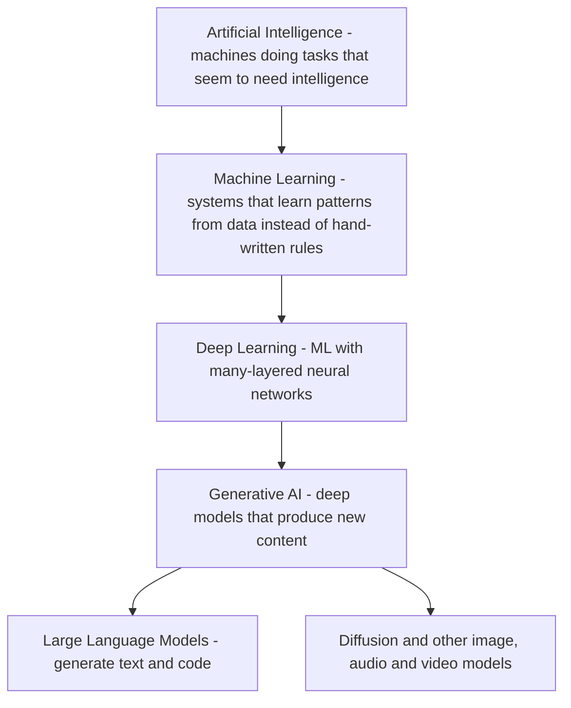
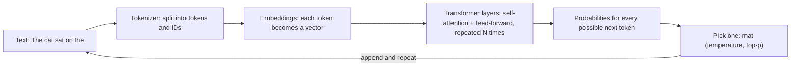
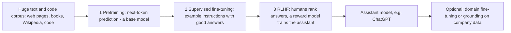
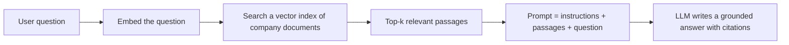
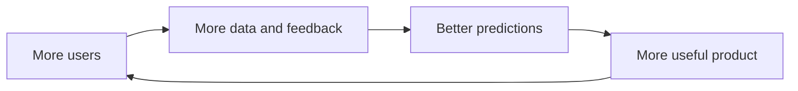

=== What Is Generative AI? AI vs Machine Learning vs Deep Learning
difficulty: easy
---
**Generative AI** is AI that **creates new content** — text, speech, images, music, video and especially **code** — in response to an input (a *prompt*), rather than only classifying or predicting a label for existing data. ChatGPT, Claude, Gemini (formerly Bard), LLaMA, GPT-4, DALL-E, Midjourney, Stable Diffusion and GitHub Copilot are all generative AI tools.

### How the terms nest



| Term | Meaning | Example |
|---|---|---|
| **AI** | Broad umbrella: computers performing tasks associated with intelligence | Chess engine, spam filter, chatbot |
| **Machine learning (ML)** | Learns a mapping from **data** and improves with more data | Predict which customers will cancel |
| **Deep learning** | ML using **neural networks** with many layers | Face recognition, speech-to-text |
| **Generative AI** | Deep models that **generate** new samples resembling their training data | ChatGPT writing an email, Midjourney drawing a poster |
| **LLM** | A generative model of **language**, trained on huge amounts of text | GPT-4, Claude, LLaMA |

### Discriminative vs generative models
- A **discriminative** model learns to **separate** classes: given an input x, predict the label y (*is this email spam?*, *will this transaction be fraud?*). It models P(y | x).
- A **generative** model learns **what the data itself looks like**, so it can **produce new examples**: write a new email, draw a new cat. It models P(x) (or P(x | prompt)).

Most business ML before 2022 was discriminative **predictive analytics** — the book's final chapter stresses that "the purpose of ML is to issue actionable predictions" (who will cancel, which transaction is fraud). Generative AI added the ability to **produce** content.

### Why it took off
- **ChatGPT** (OpenAI, late 2022) reached **100 million users in two months**, the fastest-growing consumer application ever at the time.
- A **natural-language interface**: anyone can use it by typing, no programming needed — the book compares the simple input box to Google's search box and predicts it will replace drop-down menus in much software.
- It **generates code**, so it can turn a request ("who are the contacts I haven't called in 90 days?") into a query or action.

### What it is good and bad at
| Strengths | Weaknesses |
|---|---|
| Instant first drafts, summaries, rewrites, translations | **Hallucinations** — confident but false statements and invented citations |
| Brainstorming many ideas quickly (divergent thinking) | Can reflect **bias** in its training data |
| Code generation and explanation | **Inconsistency**: the same question can get different answers |
| Pattern-finding in large amounts of unstructured text | No real understanding or guaranteed reasoning; knowledge has a **cutoff date** |
| Natural-language interfaces to software | Opaque ("black box"), costly to train and run |

**Key points:**
- Generative AI creates new content; discriminative AI classifies or predicts labels.
- AI ⊃ ML ⊃ deep learning ⊃ generative AI ⊃ LLMs / diffusion models.
- It took off because of natural-language interfaces and broad usefulness (ChatGPT: 100M users in 2 months).
- Big strengths: drafts, ideas, code; big risks: hallucinations, bias, inconsistency, opacity.

=== Machine Learning Foundations: Training, Inference and Learning Types
difficulty: easy
---
Generative models are machine-learning models, so the core ML vocabulary applies.

### The three main learning paradigms
- **Supervised learning** — learn from **labeled** examples (input → correct output): spam/not-spam emails, house features → price. Measured against known answers.
- **Unsupervised learning** — find structure in **unlabeled** data: clustering customers into segments, finding anomalies.
- **Reinforcement learning (RL)** — an agent takes actions and learns from **rewards/feedback** (games, robotics, and fine-tuning chatbots with human feedback).
- **Self-supervised learning** — the labels come **from the data itself**: hide the next word and predict it. This is how LLMs are **pretrained**, which is why they can learn from trillions of words of unlabeled text.

### Key vocabulary
| Term | Meaning |
|---|---|
| **Model** | A function with adjustable numbers (**parameters / weights**) that maps inputs to outputs |
| **Training** | Adjusting the parameters so the model's outputs match the data better |
| **Loss function** | A number measuring how wrong the model is; training tries to minimize it |
| **Gradient descent** | Repeatedly nudging each parameter in the direction that reduces the loss |
| **Epoch** | One pass through the training data |
| **Inference** | Using the trained model to make a prediction or generate output |
| **Overfitting** | Memorizing training data instead of learning general patterns — great on training data, poor on new data |
| **Train / validation / test split** | Separate data to train, tune, and finally evaluate honestly |

### Gradient descent in a few lines
A model with one parameter `w` learns the rule y = 3x from examples by repeatedly following the gradient of the mean squared error:

```python
data = [(1, 3), (2, 6), (3, 9), (4, 12)]   # examples of y = 3x
w = 0.0                                     # initial guess
lr = 0.01                                   # learning rate (step size)

for epoch in range(1, 201):
    # loss = mean of (w*x - y)^2 ; its derivative w.r.t. w is mean of 2*(w*x - y)*x
    grad = sum(2 * (w * x - y) * x for x, y in data) / len(data)
    w -= lr * grad
    if epoch in (1, 5, 20, 200):
        loss = sum((w * x - y) ** 2 for x, y in data) / len(data)
        print(f"epoch {epoch:3}: w = {w:.4f}, loss = {loss:.6f}")

print("prediction for x = 10:", round(w * 10, 3))
```

```text
epoch   1: w = 0.4500, loss = 48.768750
epoch   5: w = 1.6689, loss = 13.289022
epoch  20: w = 2.8837, loss = 0.101405
epoch 200: w = 3.0000, loss = 0.000000
prediction for x = 10: 30.0
```

An LLM does the same thing at enormous scale: **billions of parameters**, a loss that measures how badly it predicted the next token, and gradient descent run over trillions of tokens on thousands of GPUs.

### Data network effects
Because ML models improve with data, products that collect **feedback** from usage get better as more people use them — **data network effects** (see "Data Network Effects"). Google Maps' traffic predictions improve as more drivers use it.

### ML is prediction
The book's last chapter (Eric Siegel) reminds us that most valuable business ML is **predictive**: predicting which customers will cancel so they can be offered incentives, or which transactions are fraudulent so they can be blocked. These predictions drive millions of operational decisions — value comes from **acting** on predictions, not from the label "AI".

**Key points:**
- Supervised (labeled), unsupervised (structure), reinforcement (rewards), self-supervised (labels from the data — how LLMs pretrain).
- Training minimizes a loss with gradient descent; inference uses the trained model.
- Overfitting = memorizing; evaluate on held-out test data.
- Most business ML value comes from acting on predictions.

=== Neural Networks and Transformers: How LLMs Work
difficulty: hard
---
### Neural networks
A **neural network** is layers of simple units ("neurons"). Each computes a **weighted sum** of its inputs plus a bias, then applies a non-linear **activation function** (ReLU, sigmoid, GELU). Stacking many layers lets the network represent very complex functions. Training adjusts all weights with **backpropagation** (computing gradients layer by layer) and **gradient descent**.

```python
import math

def neuron(inputs, weights, bias):
    z = sum(i * w for i, w in zip(inputs, weights)) + bias   # weighted sum
    return 1 / (1 + math.exp(-z))                              # sigmoid activation

# A neuron hand-set to behave like logical AND
for a in (0, 1):
    for b in (0, 1):
        print(a, b, "->", round(neuron([a, b], [10, 10], -15), 3))
```

```text
0 0 -> 0.0
0 1 -> 0.007
1 0 -> 0.007
1 1 -> 0.993
```

### Language modeling = next-token prediction
An LLM is trained on one deceptively simple task: **given the text so far, predict the next token**. To do that well across trillions of words, the model must internalize grammar, facts, style and patterns of reasoning. Generating a reply is just repeating: predict a token, append it, predict the next one (**autoregressive generation**).



### The transformer
Introduced in the 2017 paper *Attention Is All You Need*; the "T" in **GPT** (Generative **Pre-trained Transformer**).
- **Embeddings** turn each token into a vector; **positional information** tells the model word order.
- **Self-attention** lets every token look at every other token in the context and decide **how much each one matters** for understanding it ("it" in "the trophy didn't fit in the suitcase because **it** was too big" must attend to "trophy").
- **Multi-head attention** runs several attention patterns in parallel (syntax, coreference, topic...).
- **Feed-forward layers** then transform each position; dozens of such blocks are stacked.
- Unlike older recurrent networks (RNNs/LSTMs), transformers process all positions **in parallel**, which made training on huge datasets practical.

Attention in miniature — scores are dot products of a **query** with each **key**, turned into weights with **softmax**, then used to average the **values**:

```python
import math

def softmax(xs):
    m = max(xs)
    exps = [math.exp(x - m) for x in xs]
    total = sum(exps)
    return [e / total for e in exps]

def dot(a, b):
    return sum(x * y for x, y in zip(a, b))

tokens = ["trophy", "suitcase", "it"]
keys   = {"trophy": [1.0, 0.2], "suitcase": [0.1, 1.0], "it": [0.5, 0.5]}
values = {"trophy": [10, 0],    "suitcase": [0, 10],    "it": [5, 5]}

query = [1.0, 0.1]                   # what "it" is looking for (something trophy-like)
scale = math.sqrt(len(query))
weights = softmax([dot(query, keys[t]) / scale for t in tokens])
for t, w in zip(tokens, weights):
    print(f"attention to {t:9}: {w:.3f}")
mixed = [sum(w * values[t][i] for t, w in zip(tokens, weights)) for i in range(2)]
print("context vector for 'it':", [round(v, 2) for v in mixed])
```

```text
attention to trophy   : 0.439
attention to suitcase : 0.246
attention to it       : 0.315
context vector for 'it': [5.97, 4.03]
```

"it" attends most to "trophy", so its new representation is mostly trophy-like.

### Model families
- **Decoder-only** (GPT, Claude, LLaMA) — generate text left to right; today's chatbots.
- **Encoder-only** (BERT) — read text in both directions to understand it; classification, search embeddings.
- **Encoder–decoder** (T5, original transformer) — map one sequence to another; translation, summarization.

### Scale
"Large" refers to the number of **parameters**. GPT-3 has **175 billion** parameters (the book's chapter on responsible AI cites this figure). Larger models trained on more data are generally more capable — but cost far more to train and run, and are harder to understand and audit (see the Responsible AI topics).

**Key points:**
- Neurons: weighted sum + activation; networks learn by backpropagation and gradient descent.
- LLMs are trained to predict the next token and generate autoregressively.
- Transformers use self-attention (query·key → softmax weights → weighted values), processed in parallel.
- Decoder-only = GPT-style generators; encoder-only = BERT-style understanding; "large" = billions of parameters.

=== Tokens, Embeddings, Context Windows and Sampling (Temperature, Top-p)
difficulty: medium
---
### Tokens
Models don't read characters or whole words but **tokens** — frequent word pieces produced by a tokenizer (e.g. byte-pair encoding). "unbelievable" might become "un" + "believ" + "able". Rough rule for English: **1 token ≈ ¾ of a word** (about 4 characters). Pricing, speed limits and context windows are all measured in tokens.

### Embeddings and semantic similarity
An **embedding** is a list of numbers (a vector) representing the **meaning** of a token, sentence or document. Texts with similar meaning get vectors pointing in similar directions, measured with **cosine similarity** (1 = same direction, 0 = unrelated). Embeddings power **semantic search**, recommendations, clustering and **RAG** (retrieval-augmented generation).

```python
import math

def cosine(a, b):
    dot = sum(x * y for x, y in zip(a, b))
    return dot / (math.sqrt(sum(x * x for x in a)) * math.sqrt(sum(y * y for y in b)))

# Toy 3-d embeddings: [royalty, gender(+male), fruit]
emb = {
    "king":  [0.9,  0.8, 0.0],
    "queen": [0.9, -0.8, 0.0],
    "man":   [0.1,  0.9, 0.0],
    "woman": [0.1, -0.9, 0.0],
    "apple": [0.0,  0.0, 1.0],
}
print("king~queen", round(cosine(emb["king"], emb["queen"]), 3))
print("king~apple", round(cosine(emb["king"], emb["apple"]), 3))

# the classic analogy: king - man + woman is closest to ...
target = [k - m + w for k, m, w in zip(emb["king"], emb["man"], emb["woman"])]
best = max((w for w in emb if w not in ("king", "man", "woman")), key=lambda w: cosine(target, emb[w]))
print("king - man + woman =", best)
```

```text
king~queen 0.117
king~apple 0.0
king - man + woman = queen
```

Real embeddings have hundreds or thousands of dimensions learned from data, but the geometry works the same way.

### Context window
The **context window** is the maximum number of tokens the model can consider at once — prompt + conversation history + any documents + the reply. Text beyond it is not seen. Longer windows allow whole documents to be analysed but cost more and can dilute attention.

### Sampling: why the same question gets different answers
At each step the model outputs a **probability for every token**. How the next token is chosen:
- **Greedy** — always take the most likely token: deterministic but often repetitive.
- **Temperature** — divide the scores by T before softmax. **Low T (→0)** makes the distribution sharper and output more predictable; **high T** flattens it — more varied and creative, but more errors.
- **Top-k** — sample only from the k most likely tokens.
- **Top-p (nucleus)** — sample from the smallest set of tokens whose probabilities add up to p (e.g. 0.9).

```python
import math, random

def softmax_t(scores, t):
    exps = [math.exp(s / t) for s in scores]
    total = sum(exps)
    return [e / total for e in exps]

words  = ["mat", "sofa", "roof", "moon"]
scores = [3.0, 2.0, 1.0, -1.0]          # model's raw scores (logits) for the next word

for t in (0.2, 1.0, 2.0):
    probs = softmax_t(scores, t)
    print(f"T={t}:", ", ".join(f"{w} {p:.2f}" for w, p in zip(words, probs)))

random.seed(7)
for t in (0.2, 2.0):
    probs = softmax_t(scores, t)
    picks = random.choices(words, probs, k=12)
    print(f"12 samples at T={t}:", " ".join(picks))
```

```text
T=0.2: mat 0.99, sofa 0.01, roof 0.00, moon 0.00
T=1.0: mat 0.66, sofa 0.24, roof 0.09, moon 0.01
T=2.0: mat 0.47, sofa 0.29, roof 0.17, moon 0.06
12 samples at T=0.2: mat mat mat mat mat mat mat mat mat mat mat mat
12 samples at T=2.0: mat roof mat mat sofa moon sofa mat moon mat roof mat
```

This randomness is why the book's sales chapter warns: "You ask the same question twice and you get different answers." For factual or repeatable tasks use **low temperature**; for brainstorming, higher.

**Key points:**
- Tokens are word pieces (~¾ word); costs and limits are counted in tokens.
- Embeddings are meaning vectors; cosine similarity finds related content (semantic search, RAG).
- The context window limits how much the model sees at once.
- Temperature, top-k and top-p control randomness — low for facts, high for creativity.

=== Training LLMs: Pretraining, Fine-Tuning, RLHF and the Data Behind Them
difficulty: medium
---
### The stages of building a chat model


1. **Pretraining** — self-supervised next-token prediction on an enormous corpus. Produces a **base model** that knows a lot but just continues text; extremely expensive (weeks on thousands of GPUs).
2. **Supervised fine-tuning (instruction tuning)** — train further on curated examples of instructions and high-quality answers so the model follows requests.
3. **Reinforcement learning from human feedback (RLHF)** — people rank alternative answers; a **reward model** learns their preferences; the assistant is optimized to produce preferred (helpful, harmless, honest) answers. Related methods include RLAIF/constitutional approaches and direct preference optimization.

The book's network-effects chapter explains why **feedback** matters so much: an AI "needs a data stream of current user choices and rating of past suggestions. Without feedback, even the best algorithm won't remain smart for long" — the thumbs-up/down buttons in chat apps feed this loop.

### Adapting a model to your company
| Approach | What it does | When to use |
|---|---|---|
| **Prompting** (incl. few-shot examples) | Instructions and examples in the prompt; no training | First choice; cheapest, fastest |
| **RAG (retrieval-augmented generation)** | Retrieve relevant company documents and put them in the prompt | Up-to-date or private facts, with citations |
| **Fine-tuning** | Further train the model on your own examples | Consistent style/format, specialized tasks |
| **Training from scratch** | Build your own foundation model | Rarely — huge cost and expertise |

The sales chapter notes "the true power for sales teams comes when models are customized and fine-tuned on company-specific data" — but that this is expensive and needs scarce expertise, so **buying** existing tools often beats **building**.

### Training data and its problems
- Sources: web crawls, books, Wikipedia, Reddit, code repositories, licensed data.
- **Bias**: the data reflects who writes online. The book's responsible-AI chapter notes about **67% of Reddit's** contributors and **84% of Wikipedia's** are male — perspectives that are under-represented in the data are under-represented in the model.
- **Copyright**: image models such as Stable Diffusion and Midjourney were built on **LAION-5B**, almost **6 billion** tagged images scraped from the web, including copyrighted work — the root of several lawsuits (see "Intellectual Property").
- **Freshness**: a model knows nothing after its **training cutoff**; early ChatGPT relied on data collected up to 2021 and lacked recent events.
- **Quality**: "garbage in, garbage out" — curate, deduplicate, filter toxic content, document provenance.

### Cost and sustainability
Training large models consumes large amounts of energy and water. The risk-management chapter cites **GPT-3's training at about 1.287 gigawatt-hours** (roughly a year of electricity for 120 U.S. homes) and **about 700,000 liters of fresh water**. Bigger isn't always better: smaller models trained on high-quality domain data can be accurate and far cheaper.

**Key points:**
- Pretraining (next-token, unlabeled) → supervised fine-tuning (instructions) → RLHF (human preferences).
- Customize with prompting first, then RAG for knowledge, fine-tuning for behaviour; rarely train from scratch.
- Training data brings bias, copyright and freshness problems — curate and document it.
- Training is costly in energy and water; right-size models.

=== Image and Multimodal Generation: Diffusion, GANs and VAEs
difficulty: medium
---
Text-to-image tools such as **DALL-E**, **Midjourney** and **Stable Diffusion** turn a prompt like "an elephant combined with a butterfly" into images. The book's creativity chapter used exactly this to invent the "**phantafly**" and then chairs and chocolates inspired by it.

### Diffusion models (today's dominant approach)
- **Training**: take real images, add Gaussian **noise** step by step until only noise remains, and train a network to **predict and remove the noise** at each step.
- **Generation**: start from pure random noise and **denoise repeatedly**, guided by the text prompt, until an image emerges.
- **Conditioning on text**: a text encoder (e.g. CLIP) turns the prompt into embeddings that steer each denoising step; **classifier-free guidance** controls how strongly the image follows the prompt.
- **Latent diffusion** (Stable Diffusion) runs the process in a compressed latent space, making it much faster.

```calc
Forward (training):   image -> slightly noisy -> noisier -> ... -> pure noise
Reverse (generation): pure noise -> less noisy -> ... -> new image matching the prompt
```

### Other generative architectures
| Model | Idea | Notes |
|---|---|---|
| **GAN** (Generative Adversarial Network) | A **generator** makes fakes, a **discriminator** tries to tell real from fake; they improve by competing | Sharp images; unstable training; deepfakes |
| **VAE** (Variational Autoencoder) | Encode data into a smooth latent space, decode samples from it | Stable, blurrier outputs; used inside latent diffusion |
| **Diffusion** | Learn to reverse a noising process | High quality and diversity; slower sampling |
| **Autoregressive transformer** | Predict the next token (text, image patches, audio tokens) | LLMs; also some image and music models |

### Multimodal models
Newer models accept and produce several modalities — text, images, audio, video — in one system (describe a photo, answer questions about a chart, speak responses). The book's first chapter imagines a renovation app: "Here are five pictures of my current bathroom... give me a renovation design, a complete plan, and the ability to put it out for bid."

### Using image generators in product design
The book's workflow: **ChatGPT** writes a detailed product description ("a sleek flying automobile with hidden rotors... resembling a dragonfly, with illuminated markers for night flight"), then **Stable Diffusion** turns that description into designs, and humans iterate on the prompts — text and image models feeding each other.

**Key points:**
- Diffusion models learn to remove noise and generate by denoising random noise guided by a prompt.
- GANs: generator vs discriminator; VAEs: smooth latent space; diffusion: high quality, now dominant.
- Multimodal models combine text, image, audio and video.
- Text-to-image models enable rapid concept generation (phantafly, flying-car designs).

=== Hallucinations, Grounding and Retrieval-Augmented Generation (RAG)
difficulty: hard
---
### What is a hallucination?
A **hallucination** is a fluent, confident output that is **false or unsupported** — invented facts, fake citations, wrong numbers. The book's first chapter describes people pushing ChatGPT to extremes and getting "bizarre responses" and "solid assertions of wrong facts".

**Why it happens:**
- The model is trained to produce **plausible** continuations, not verified truth — "being good at guessing plausible combinations of words is different from understanding the material" (responsible-AI chapter).
- **Missing knowledge** (after the training cutoff, private company data) — the model fills the gap with plausible text.
- **Ambiguous or leading prompts**; high temperature; long contexts; errors in training data.

### Mitigations
- **Grounding / RAG** — give the model the relevant source text and instruct it to answer **only** from it, with citations.
- **Low temperature** for factual tasks.
- **Ask for sources and uncertainty**; allow "I don't know".
- **Human in the loop** — review outputs in risky contexts (the sales chapter: "AI-generated answers in risky contexts must be reviewed by a person").
- **Guardrails** — rules restricting topics and formats (the book's "rules layer"), output validation, automated checks.
- **Fine-tuning** on domain data and **keeping that data fresh**: "Models that generate responses to customer support queries will produce inaccurate or out-of-date results if the content it's grounded in is old, incomplete, and inaccurate" (risk-management chapter).

### Retrieval-augmented generation (RAG)


1. **Index**: split documents into chunks, embed each chunk, store the vectors in a **vector database**.
2. **Retrieve**: embed the question and find the most similar chunks.
3. **Augment**: put those chunks into the prompt.
4. **Generate**: the LLM answers from the provided text and cites it.

A minimal retrieval step, using word-overlap vectors in place of learned embeddings:

```python
import math, re
from collections import Counter

docs = {
    "refund-policy": "Refunds are issued within 14 days of purchase if the product is unused.",
    "shipping":      "Standard shipping takes 3 to 5 business days. Express shipping takes 1 day.",
    "warranty":      "The warranty covers manufacturing defects for 12 months from delivery.",
}

def vec(text):
    return Counter(re.findall(r"[a-z]+", text.lower()))

def cosine(a, b):
    dot = sum(a[w] * b[w] for w in a)
    na = math.sqrt(sum(v * v for v in a.values()))
    nb = math.sqrt(sum(v * v for v in b.values()))
    return dot / (na * nb) if na and nb else 0.0

question = "How many days does express shipping take?"
q = vec(question)
ranked = sorted(docs, key=lambda d: cosine(q, vec(docs[d])), reverse=True)
for d in ranked:
    print(f"{d:14} score {cosine(q, vec(docs[d])):.3f}")

top = ranked[0]
prompt = (f"Answer ONLY from the context. If the answer is not there, say you don't know.\n"
          f"Context [{top}]: {docs[top]}\nQuestion: {question}")
print(prompt)
```

```text
shipping       score 0.404
refund-policy  score 0.109
warranty       score 0.000
Answer ONLY from the context. If the answer is not there, say you don't know.
Context [shipping]: Standard shipping takes 3 to 5 business days. Express shipping takes 1 day.
Question: How many days does express shipping take?
```

| RAG | Fine-tuning |
|---|---|
| Adds **knowledge** at query time | Changes **behaviour/style** by training |
| Easy to update — just re-index documents | Retraining needed for new facts |
| Can cite sources | No built-in citations |
| Limited by retrieval quality and context size | Costly; risk of forgetting; needs ML expertise |

**Key points:**
- Hallucinations come from plausibility-driven generation and missing knowledge.
- Mitigate with grounding/RAG, low temperature, citations, guardrails and human review.
- RAG = embed → retrieve → augment the prompt → generate with citations.
- RAG for knowledge and freshness; fine-tuning for behaviour.

=== Prompting Techniques and Why Problem Formulation Matters More
difficulty: medium
---
### Prompt engineering basics
A **prompt** is the input you give the model. Useful techniques:
- **Clear instruction + context** — who the audience is, what the goal is, what to avoid.
- **Role / system prompt** — "You are a careful financial analyst..."; system prompts set rules the user can't easily override.
- **Zero-shot** — just the instruction. **Few-shot** — include a few input→output examples so the model copies the pattern.
- **Output format constraints** — "reply as a 5-point list", "return JSON with keys name and score", length limits, tone.
- **Chain-of-thought / step-by-step** — ask the model to reason through intermediate steps before the final answer (improves multi-step problems).
- **Decomposition** — split a big task into a sequence of smaller prompts.
- **Iterate** — treat the first output as a draft and refine with follow-up prompts (the book: "take the initial output as a first iteration. Improve on it with a more detailed prompt or two. And then tweak that output yourself").

Example from the book's creativity chapter — a **role + procedure** prompt for idea generation by **trisociation** (combining three concepts):

```calc
"You will play the role of an ideator. You will randomly generate 10 common nouns.
 You will then randomly select any two of the 10 nouns. You will then ask me for a
 third noun. You will generate a business idea by combining or associating the two
 nouns you identified and the noun I identified."

ChatGPT picked "food" and "technology"; the user added "car"
-> a smart food-delivery service using self-driving cars, AI-optimized routes and
   real-time temperature tracking.
```

### "AI prompt engineering isn't the future" (Oguz A. Acar)
The book argues that prompt engineering's prominence may be **fleeting**:
1. Future models will understand natural language better, needing less carefully engineered prompts.
2. Models like GPT-4 can already **write good prompts themselves**.
3. Prompts that work are often specific to one model and version — they don't transfer.

The more enduring skill is **problem formulation** — identifying, analysing and delineating the problem. "Without a well-formulated problem, even the most sophisticated prompts will fall short." (A survey cited there found **85% of C-suite executives** consider their organizations bad at diagnosing problems.)

| Prompt engineering | Problem formulation |
|---|---|
| Focus: crafting the optimal **text input** | Focus: defining the **problem** — its focus, scope and boundaries |
| Needs: knowledge of a specific AI tool, linguistic skill | Needs: understanding of the **domain**, ability to distil real-world issues |
| Model-specific, short-lived | Transferable and lasting |

### The four components of problem formulation
1. **Problem diagnosis** — find the **core** problem, not symptoms (e.g. the "**Five Whys**"). InnoCentive (now Wazoku Crowd) helped clients formulate 2,500+ problems with an 80%+ success rate; in the *Exxon Valdez* clean-up, diagnosing the root cause as the **viscosity** of frozen oil led to a solution using vibrating construction equipment.
2. **Problem decomposition** — break complex problems into sub-problems. The ALS challenge targeted just **detecting and monitoring progression**, producing the first ALS biomarker. A broad "implement a cybersecurity framework" prompt gave generic answers; splitting it into policies, vulnerability assessments, authentication and training gave far better ones.
3. **Problem reframing** — change the perspective. GE HealthCare's Doug Dietz reframed MRI scans for children as an **adventure**; pediatric sedation fell from **80% to about 15%** and satisfaction rose 90%. Reframing "not enough parking" from the employees' view produced ideas like alternative transport and remote work instead of only new parking spaces.
4. **Problem constraint design** — define input, process and output boundaries: **strict** constraints (length, format, tone, audience) for productivity tasks; **removing or unusual** constraints for creativity (GoFundMe's year-in-review video used only AI-generated street-mural-style art).

**Key points:**
- Good prompts: clear instruction, context, role, examples (few-shot), format constraints, step-by-step, iteration.
- Prompt engineering is model-specific and may fade; problem formulation lasts.
- Problem formulation = diagnosis, decomposition, reframing, constraint design.
- Strict constraints for productivity; loosened or unusual constraints for creativity.

=== Evaluating Generative AI: Precision, Recall, Benchmarks and Red-Teaming
difficulty: medium
---
"You can't improve what you can't measure." Evaluation is harder for generative AI than for classic ML, because there are many acceptable answers.

### Classic classification metrics
Still used for GenAI components (moderation filters, retrieval, extracted fields). The risk-management chapter asks organizations to "deliver verifiable results that balance **accuracy, precision, and recall**".

```calc
                      Predicted positive   Predicted negative
Actually positive     TP (true positive)   FN (false negative)
Actually negative     FP (false positive)  TN (true negative)

Accuracy  = (TP + TN) / all
Precision = TP / (TP + FP)    - of what we flagged, how much was right?
Recall    = TP / (TP + FN)    - of what we should have flagged, how much did we catch?
F1        = 2 x P x R / (P + R)
```

```python
def metrics(tp, fp, fn, tn):
    precision = tp / (tp + fp)
    recall = tp / (tp + fn)
    accuracy = (tp + tn) / (tp + fp + fn + tn)
    f1 = 2 * precision * recall / (precision + recall)
    return round(accuracy, 3), round(precision, 3), round(recall, 3), round(f1, 3)

# A toxic-content filter checked on 1,000 chatbot replies (50 truly toxic)
print("cautious filter   (acc, P, R, F1):", metrics(tp=30, fp=5, fn=20, tn=945))
print("aggressive filter (acc, P, R, F1):", metrics(tp=48, fp=60, fn=2, tn=890))
print("flag nothing      (acc, P, R, F1): acc =", (0 + 950) / 1000, "- high accuracy, useless")
```

```text
cautious filter   (acc, P, R, F1): (0.975, 0.857, 0.6, 0.706)
aggressive filter (acc, P, R, F1): (0.938, 0.444, 0.96, 0.608)
flag nothing      (acc, P, R, F1): acc = 0.95 - high accuracy, useless
```

The "flag nothing" line shows why **accuracy alone misleads** on imbalanced data — recall would be 0.

### Evaluating generated text
- **Reference-based metrics** — BLEU (translation) and ROUGE (summaries) count word overlap with reference answers; cheap but miss meaning.
- **Semantic similarity** — compare embeddings of output and reference.
- **Human evaluation** — rate helpfulness, correctness, tone; the gold standard but slow and costly.
- **LLM-as-judge** — a strong model grades outputs against a rubric; scalable, but must itself be validated.
- **Task benchmarks** — standard test sets for knowledge, reasoning, coding (e.g. pass rates on programming problems).
- **Groundedness / faithfulness** — does every claim appear in the provided sources? Key for RAG.

### Testing for safety
- **Red-teaming** — deliberately trying to make the model misbehave: harmful content, leaking private data, **prompt injection** (instructions hidden in documents or web pages that hijack the model), jailbreaks.
- **Bias testing** — compare outputs across demographic groups. The book cites *Gender Shades* (2018): commercial facial-recognition systems were nearly perfect on white male faces but misidentified Black female faces up to **35%** of the time.
- **Robustness** — small changes to the input shouldn't flip the answer.
- **Continuous monitoring** — "Generative AI cannot operate on a set-it-and-forget-it basis": collect metadata, log outputs, gather user feedback, retest after every model change.

### Evaluating ideas with GenAI
Generative AI can also *do* evaluation. The creativity chapter had ChatGPT assess food-waste ideas on **novelty, feasibility, specificity, impact and workability**, making it easy to score and compare concepts — with humans making the final call.

**Key points:**
- Precision = correctness of what was flagged; recall = coverage of what should be flagged; accuracy misleads on imbalanced data.
- Text evaluation: BLEU/ROUGE, semantic similarity, human ratings, LLM-as-judge, benchmarks, groundedness.
- Red-team for harmful output, data leaks, prompt injection and jailbreaks; test for bias.
- Monitor continuously — GenAI is not set-and-forget.

=== How Generative AI Changes Business and Software
difficulty: easy
---
*Based on "Generative AI Will Change Your Business. Here's How to Adapt" by David C. Edelman and Mark Abraham (HBR).*

Generative AI changes **how people interact with software**. Instead of menus and forms designed around a product's features, the interface becomes a single box asking "**What do you want to do today?**" — like Google's search box, now at the centre of ChatGPT and DALL-E. The software can suggest next steps from what it knows about the user's past actions, context and stored goals ("save for a trip", "remodel our kitchen", "plan meals for a family of five with special dietary needs").

### From commands to actions
Because generative AI also **writes code**, a request can be turned straight into an action:
- "Who are the contacts I have not called in the last 90 days?"
- "When am I next in NYC with an evening free for dinner?"

The system recognizes the query, generates the code to fetch and combine the data, ranks the possibilities and produces the best answer — in milliseconds. Brands can then offer whole **journeys**: "Given the weather, traffic and who I'm with, give me an afternoon tourist itinerary with a guide and the ability to buy tickets in advance."

### What companies must build
1. **Bring data together** — solving a customer's full need requires data from across the company and partners. AI can help write the code that maps different database schemas into one repository, but **data cleansing and governance** still matter: "garbage in, garbage out". One fashion brand found that purchased third-party gender data **disagreed with its own data 50% of the time** — check third-party data against internal data before using it.
2. **Strengthen the "rules layer"** — with no limits on what a customer can type, designers, marketers and decision-makers must set the **guardrails**: what may be offered to whom, what copy is allowed in which jurisdiction, anti-repetition rules (as in an airline's "next best conversation" system). Start **small**, with tightly defined use cases where humans can design rules for edge cases.
3. **Deliver the end-to-end journey** — ask what the customer's true end goal is. HubSpot's **ChatSpot** reduced the interface to one text prompt and could research a target company, draft a personalized sales email, send and track it, and add the contact to the CRM — **journey expansion** rather than vertical or horizontal expansion.
4. **Differentiate via your ecosystem** — partners supply data and services; evaluate how trustworthy, permissioned, timely, comprehensive and biased their data is, and how revenue is shared. A pharmacy chain like **CVS** could become a full **health-network coordinator**: "How can you help me lose 30 pounds?" generates and manages a complete programme across partners.
5. **Prioritize safety, fairness, privacy, security and transparency** — hallucinations, wrong facts stated confidently, biased outputs and misuse of private data damage the brand. Some companies have created **chief customer protection officers**; boards expect dashboards on bias testing, data provenance, copyright, permissions and edge-case testing.

### The trade-off
The risks and the cost of managing them are real, and opacity makes some outcomes impossible to explain. But generative AI applications are the fastest-growing class of applications ever, accuracy improves as more data is tapped and **humans in the loop** correct errors, and automation will **pull costs out of the system**, pressuring every competitor to become more efficient.

**Key points:**
- Generative AI replaces menu-driven software with conversational, goal-driven interfaces.
- It can generate code, turning a natural-language request into data queries and actions.
- Success needs integrated, clean data, a strong rules layer, end-to-end journeys and a trusted partner ecosystem.
- Safety, fairness, privacy, security and transparency are part of the brand.

=== Data Network Effects: Why AI Gets Smarter with More Users
difficulty: medium
---
*Based on "How Network Effects Make AI Smarter" by Sheen S. Levine and Dinkar Jain (HBR).*

A **network effect** exists when a product becomes **more valuable as more people use it**. AI depends on a new kind of network effect.

| Type | Value comes from | Example |
|---|---|---|
| **Direct network effect** | More **peers** to interact with | Telephone — more subscribers, more people you can call |
| **Indirect (two-sided) network effect** | More users on one side attract more on the other | Etsy, Airbnb, Uber — more buyers attract more sellers and vice versa |
| **Data network effect** (data-driven learning) | More users produce more **data and feedback**, which improve the model's predictions | Google Maps, ChatGPT, recommendation engines |

### How data network effects work
AI's value lies in **accurate predictions and suggestions**. Unlike traditional products that turn supplies into outputs, AI needs large datasets kept **fresh** through back-and-forth interaction: collect data → analyze → predict → get feedback → improve.



**Google Maps** predicts the fastest route from historical and live data from many drivers, compares predictions with actual arrival times, and asks how good the directions were. As facts and feedback accumulate, predictions improve — and so does the app's value.

### The OpenAI–Microsoft example
Early ChatGPT was impressive but "stuck": its knowledge stopped at 2021 data, and it lacked a robust feedback loop (only a thumbs-down). By partnering with Microsoft, OpenAI gained a way to test predictions: what **Bing** users ask and how they rate answers feeds improvement, and Microsoft's vast store of documents, spreadsheets and profiles could teach the model to recreate them.

### Three lessons
1. **Feedback is crucial** — "Without feedback, even the best algorithm won't remain smart for long." Models need ever-flowing data sources.
2. **Routinize meticulous gathering of information** — data is everywhere: what customers looked at, put in the cart and finally bought; weather data helps Google Maps predict traffic; the keywords recruiters search help LinkedIn advise job seekers.
3. **Consider the data you share** — your data can make *someone else's* AI smarter. Uber drivers navigating with **Waze** help Google estimate ride-hailing trips; **Adidas** selling on Amazon lets Amazon estimate demand across brands, categories and prices, which could benefit competitors or Amazon's own private labels. Counter-moves: avoid unnecessary intermediaries, negotiate data access, keep direct customer contact, or join **data exchanges** (as banks did to share creditworthiness data).

### Strategic consequence
Like other network effects, data network effects **make the rich richer**: early movers with an algorithm and a flow of data accumulate advantages that are hard for followers to overcome.

**Key points:**
- Direct (peers), indirect (two-sided platforms) and data network effects (more data → better predictions) differ.
- AI improves through a loop of prediction and feedback; feedback is essential.
- Collect data systematically; be careful whose AI benefits from the data you share.
- Data network effects favour early movers.

=== Picking the Right Generative AI Project: The Risk–Demand Matrix
difficulty: easy
---
*Based on "A Framework for Picking the Right Generative AI Project" by Marc Zao-Sanders and Marc Ramos (HBR).*

Opinions about LLMs range from "little impact" to "transformational". To cut through the hype, judge each use case on two questions:
- **Risk** — how likely and how damaging is it if **untruths and inaccuracies** are generated and spread?
- **Demand** — what is the **real and sustainable need** for this kind of output, beyond the current buzz?

### The 2 × 2 matrix
```calc
                     LOW RISK                          HIGH RISK
HIGH DEMAND   Marketing, Learning, Copyediting,   Medical diagnoses, Production code,
              Code reviews, Ideation,             Legal advice, Business intelligence,
              Rapid design and reviews            Regulatory/compliance, Technical publishing
              -> START HERE                       -> slowed by caution and regulation

LOW DEMAND    Whimsical apps (e.g. a Twitter bio), Specialist technical advice
              Creative/subjective output           (e.g. niche medical)
              (images, jokes, poems)
              -> party tricks; little lasting value
```

- **High demand / low risk** is where adoption will develop fastest: clear demand, few hurdles, and errors are cheap or easily caught. **Marketing** already has unicorn startups generating copy — it needs lots of ideas and audience-tailored text, has plenty of examples to imitate, isn't fact-heavy, and important facts can be fixed in editing.
- **Corporate learning** is an under-noticed opportunity: prime the model with existing documentation and ask it to rewrite, synthesize and update materials for different audiences, or weave learning into everyday work instead of clunky FAQs and ticketing systems.
- **Reviewing and brainstorming** are safe "second pair of eyes" uses: feed a draft and ask for a softer tone, a five-point summary or a more concise version; or ask for gift ideas or hiring steps — the ideas aren't the final product.
- **High demand / high risk** (diagnoses, production code, legal advice): demand exists, but trepidation and regulation slow progress.
- **Low demand**: little motivation — "haikus in the style of a Shakespearian pirate" won't hold attention for long.

For each use case, ask: how much does adding a **human validation step** reduce the risk, and how much does it slow the process and reduce demand?

### Low risk is still risk
Even corporate learning carries risk: generative AI is vulnerable to bias and errors, just as humans are. Don't distribute raw output to the whole workforce. Treat it as a **first iteration**: refine with better prompts, then edit it yourself, adding real-world knowledge, nuance, artistry and humour.

**Key points:**
- Score use cases on risk (damage from inaccuracy) and demand (real, lasting need).
- Start with high-demand, low-risk uses: marketing, learning, copyediting, code reviews, ideation, rapid design.
- High-risk uses are slowed by regulation; low-demand uses are novelties.
- Low risk is still risk — review and edit AI output.

=== How Generative AI Could Disrupt Creative Work: Three Scenarios
difficulty: medium
---
*Based on "How Generative AI Could Disrupt Creative Work" by David De Cremer, Nicola Morini Bianzino and Ben Falk (HBR).*

Creativity has long been seen as uniquely human and resistant to automation. The **creator economy** — independent writers, podcasters, artists and musicians reaching audiences directly through platforms like Substack — is valued at around **$14 billion a year**. Generative tools such as ChatGPT and Midjourney now threaten that special status, especially for knowledge-intensive content work: writing, images and coding.

### Three possible futures (not mutually exclusive)
**1. An explosion of AI-assisted innovation** — AI **augments** creators rather than replacing them. GitHub Copilot (2021) acts as an AI "pair programmer"; designers and advertisers use DALL-E. Tools are so easy that even children can use them, lowering barriers to entry. Productivity rises; humans still correct and edit. The ability to quickly retrieve, contextualize and interpret knowledge may be the most powerful business application of LLMs → faster, machine-augmented iteration.

**2. Machines monopolize creativity** — unfair algorithmic competition and weak governance let a **tsunami of generated content** drown out human creators, some of whom quit. Risks:
- Copyright lawsuits, while IP law lags behind the technology.
- Innovation could **slow** if fewer humans create new work.
- **Extreme personalization** (BuzzFeed announced personalized quizzes with OpenAI tools) could erase **shared experiences**, worsen **filter bubbles** and make mis/disinformation easier.
- **Curation** becomes more valuable than creation, and high search costs lock in established artists, concentrating the market.

**3. "Human-made" commands a premium** — a "techlash" against synthetic content makes people value **authentic human creativity** and trusted human sources, especially since models produce text that "sounds legitimate but is riddled with factual errors." Humans keep an edge because **culture changes faster than models can be trained**. Content moderation needs explode, requiring human intervention and governance.

### How to prepare
1. **Prepare for disruption, not only to your job** — generative AI may be the biggest change in the cost of producing information since the **printing press (1439)**; expect volatility.
2. **Invest in your ontology** — codify, digitize and structure the knowledge your organization creates, so it can transfer across teams through AI.
3. **Get comfortable talking to AI** — learn to prompt and collaborate with AI tools now.

Ultimately, society must decide how much creative work should be done by AI and how much by humans — "creativity is intelligence having fun," and creative work gives meaning to human lives.

**Key points:**
- Three scenarios: AI-assisted innovation, machines monopolizing creativity, a premium on human-made work.
- Risks: copyright conflict, content floods, loss of shared experience, filter bubbles, market concentration.
- Prepare for disruption, structure your knowledge (ontology), and practise working with AI.

=== How Generative AI Can Augment Human Creativity
difficulty: medium
---
*Based on "How Generative AI Can Augment Human Creativity" by Tojin T. Eapen, Daniel J. Finkenstadt, Josh Folk and Lokesh Venkataswamy (HBR).*

**Democratizing innovation** (a term from MIT's Eric von Hippel) means letting users develop what they need rather than relying only on companies. Crowdsourcing and innovation contests produce many ideas, but organizations struggle with **four challenges**:
1. **Evaluation overload** — floods of ideas that can't be assessed or combined efficiently.
2. **The curse of expertise** — experts are good at **feasible** ideas but resist **novel** ones.
3. **Novices lack detail** — non-experts have novel ideas but can't turn them into coherent designs.
4. **Can't see the forest for the trees** — many requirements, no comprehensive solution.

Generative AI helps in **five ways**:

### 1. Promote divergent thinking
AI connects **remote concepts**. Midjourney combined an elephant and a butterfly into the "**phantafly**"; Stable Diffusion then generated phantafly-inspired chairs and artisanal chocolates. Generating many designs quickly lets a company explore a wide concept space (e.g. constantly refreshed T-shirt designs). ChatGPT can run **trisociation** (combining three concepts): "airline" + "chair" + "university" produced **Edu-Fly**, travel for students and academics with an in-flight educational library.

### 2. Challenge expertise bias
Atypical AI-generated forms help designers escape:
- **Design fixation** — over-reliance on standard forms;
- **Functional fixedness** — inability to imagine non-traditional uses;
- the **Einstellung effect** — past experience blocking new approaches.

Asked for crab-inspired toys with no functional specification, Stable Diffusion produced shapes that suggested functions afterwards: a wall-climbing toy, a ball launcher, a slow-feeder pet dish — form first, function second.

### 3. Assist in idea evaluation
ChatGPT weighed pros and cons of three food-waste ideas — dynamic expiration-date packaging, a food-donation app, and an education campaign about date labels — and rated each on **novelty, feasibility, specificity, impact and workability**:

| Idea | Novelty | Feasibility | Workability |
|---|---|---|---|
| Dynamic expiration-date packaging | Somewhat novel, emerging | Challenging — new materials, industry and regulator collaboration | Significant resources, years to realize |
| Food-donation app | Not particularly novel | Highly feasible — established models | Quick, relatively low cost (needs partners and volunteers) |
| Education on expiration labels | Not particularly novel | Highly feasible — campaigns, materials | Low cost (needs industry and government collaboration) |

### 4. Support idea refinement
AI can **flesh out** each concept and then **merge** them: the three ideas became one comprehensive food-waste programme combining smart packaging, a donation scheme and public education — useful when competing for a grant or contract.

### 5. Facilitate collaboration with and among users
Users can generate designs themselves, get personalized products, or post designs for community evaluation. For a **flying car** (attempted for 100+ years), Stable Diffusion produced concepts, then variations resembling a robot eagle, dragonfly, tiger and tortoise; alternatively ChatGPT wrote a detailed description (hidden rotors, dragonfly-like wings, illuminated markers for night flight) that Stable Diffusion turned into images.

> "Generative AI's greatest potential is not replacing humans; it is to assist humans in their individual and collective efforts to create hitherto unimaginable solutions."

**Key points:**
- Democratized innovation suffers from evaluation overload, expertise bias, lack of detail and no big picture.
- AI helps: divergent thinking (phantafly, trisociation), challenging fixation, evaluating ideas, refining/merging ideas, user co-creation.
- Evaluation criteria: novelty, feasibility, specificity, impact, workability.
- Text and image models can be chained: ChatGPT describes, Stable Diffusion visualizes.

=== Generative AI in Sales and Business Functions
difficulty: easy
---
*Based on "How Generative AI Will Change Sales" by Prabhakant Sinha, Arun Shastri and Sally E. Lorimer (HBR).*

In early 2023 Microsoft launched **Viva Sales** (generative AI to draft tailored customer emails, surface customer insights and recommend next steps) and Salesforce launched **Einstein GPT**. Sales lagged finance and logistics in digital adoption, but is well suited to generative AI: it is interaction-heavy and produces huge volumes of **unstructured data** — email threads, call audio, meeting video — exactly what these models handle.

### What's possible
1. **Reversing administrative creep** — documentation, approvals, compliance reports and even sales technology itself keep adding admin work. AI drafts emails, answers proposal requests (RFPs), organizes notes and updates the CRM automatically.
2. **Enhancing customer interactions** — AI already recommends content, offers and the best channel; generative AI adds **sentiment** read from emails, calls and social posts, and a **conversational interface** so salespeople can dig deeper (into one customer's needs, or across customers who could use the same offer) — even with the buyer in the dialogue.
3. **Assisting sales managers** — reports evolve from backward-looking documents into interactive, forward-looking tools; managers ask questions to coach salespeople, and planning that took weeks (account strategies, effort allocation across regions, customers and products) can take an hour.

### The journey to value
- **Deal with inaccuracy and inconsistency** — the same question can get different answers; train people in asking good questions and iterating; fine-tune on company knowledge; have a person review answers in risky contexts (review is already natural in sales workflows).
- **Realize value quickly** — embed capabilities into **existing** tools (email, proposals, presentations) so users needn't learn new features. For speed, **"buy" beats "build"**: building is flexible but slow and talent-hungry.
- **Deliver results while controlling costs** — outsource while developing a small internal core of AI experts; appoint a **boundary spanner** respected by both technical experts and the sales force; work **agile** — rapid prototypes tested by an **early-experience team** of lead users.

### Productivity aid or substitute?
Generative AI is already boosting copywriters' and programmers' productivity by **50% or more**, and will be a digital assistant for nearly every salesperson. Self-service and inside sales keep taking over routine tasks (lead generation, product information, configuration, order placement). But **new and complex offerings** still need salespeople who uncover latent needs, tailor solutions and navigate complex buying organizations — and AI vendors themselves will build large sales forces.

### Build vs buy (general rule)
| Build | Buy |
|---|---|
| Maximum flexibility and differentiation | Fast time to value |
| Needs scarce AI + domain talent | Less specialized in-house talent |
| Slow, expensive, you maintain it | Vendor keeps up with fast-changing technology |
| Full control of data | Must check vendor's data practices, licensing and indemnities |

**Key points:**
- Sales fits generative AI: lots of unstructured interaction data.
- Uses: cut admin work, enrich customer interactions with sentiment and conversation, empower managers.
- Manage inaccuracy with training, fine-tuning and human review; integrate into existing tools; buy before build.
- Use boundary spanners and agile pilots; AI assists salespeople, who remain essential for complex sales.

=== Intellectual Property and Legal Risks of Generative AI
difficulty: medium
---
*Based on "Generative AI Has an Intellectual Property Problem" by Gil Appel, Juliana Neelbauer and David A. Schweidel (HBR).*

Generative models don't create from nothing: they are trained on huge archives of images and text and learn patterns from them. That raises unresolved legal questions: Does copyright, patent or trademark infringement apply to AI creations? Who **owns** AI-generated content? Is training on unlicensed content legal? May users prompt with other creators' names and trademarks?

### Key cases and concepts (as of the book, 2023)
- **Andersen v. Stability AI et al.** (late 2022) — three artists sued several image-generation platforms for training on their work without a license, enabling outputs in their styles that may be **unauthorized derivative works**.
- **Getty Images v. Stability AI** — alleges improper use of Getty's photos, violating copyright and trademark rights in its **watermarked** collection.
- **Derivative work** — a new work based on an existing one; unauthorized derivatives infringe copyright unless an exception applies.
- **Fair use** (U.S.) — permits use of copyrighted work without permission for purposes such as criticism, comment, news reporting, teaching, scholarship or research, and for **transformative** uses. Google previously defended scanning books for search as transformative.
- **Andy Warhol Foundation v. Goldsmith** (U.S. Supreme Court, 2023) — Warhol's work based on Lynn Goldsmith's photo of Prince was held **not** fair use in that licensing context, which could make "transformative" arguments harder for AI outputs.
- **Willful infringement** — knowingly using infringing material can bring damages of up to **$150,000 per work**.
- **Confidentiality** — pasting trade secrets or business information into public AI tools can leak them.

### What developers should do
- Acquire training data **lawfully** — license it, compensate creators or share revenue.
- Prefer creator **opt-in** over **opt-out** (Stability AI let artists opt out of the *next* model version — putting the burden on creators).
- Maintain **provenance**: record the platform, settings, seed data metadata, generation seed and prompt for each output. This enables reproduction and verification, shows the user's intent (no willful copying), and prepares for contracts and insurers that demand **audit trails**.

### What creators and brands should do
- Search large datasets and data lakes for their works, logos and tags (automated tools make this feasible); use tools that obfuscate works from scraping.
- Monitor digital channels for derived works — including **style** and **trade dress** (overall look of a product and packaging), not just logos like the Nike swoosh or Tiffany Blue.
- Enforce trademarks with established tools: cease-and-desist letters, licensing demands, infringement claims — whether a human or an AI made the copy.

### What businesses using AI should do
- Choose vendors that confirm training data is **properly licensed**; read terms of service and privacy policies.
- Demand **indemnification** for IP infringement caused by the vendor's data or outputs.
- Add AI clauses to vendor and customer contracts: disclosure of AI use, ownership and registration of works, and a ban on putting the other party's **confidential information** into AI prompts.
- Use AI contract checklists and keep legal counsel informed as the law evolves.
- Long term: creators and brands with large libraries can train **their own** models on lawfully sourced data (or license them), turning their IP into new revenue with clean title.

**Key points:**
- Legal issues: unlicensed training data, derivative works, ownership of outputs, trademark/style mimicry, confidentiality leaks.
- Outcomes hinge on fair use and "transformative" use (Andersen, Getty, Warhol v. Goldsmith).
- Developers: license data, opt-in, provenance/audit trails. Creators: monitor and enforce. Businesses: licensed vendors, indemnities, contract clauses.
- Willful infringement can cost up to $150,000 per work.

=== Using AI Responsibly: Eight Questions Answered
difficulty: medium
---
*Based on "Eight Questions About Using AI Responsibly, Answered" by Tsedal Neeley (HBR).*

Because regulation lags technology, much of the burden of using AI safely and ethically falls on **companies**. Neeley answers eight common questions.

### 1. How should I prepare to introduce AI at my organization?
Past tools made existing processes faster (pen → typewriter → computer). AI finds patterns we can't see and produces insights, predictions and drafts on its own — so treat it as a **system to collaborate with**, not just a tool.
- **Everyone needs a digital mindset** — not everyone must code, but aim for at least **30% fluency** in topics such as systems architecture, AI, machine learning, algorithms, AI agents as teammates, cybersecurity and data-driven experimentation.
- **Prepare for continuous adaptation** — break down silos, build a central repository of knowledge and data; employees are adopting tools like ChatGPT whether or not companies are ready.
- **Build AI into the operating model** — an organization mirrors its technology architecture (Iansiti and Lakhani). Amazon's growth stalled until Jeff Bezos required all teams to share data through **APIs**, dismantling silos.

### 2. How can we ensure transparency in how AI makes decisions?
AI is often **invisible** (running behind other products, like anti-lock brakes) and **inscrutable** (even developers can't trace how a large model reached an output). Accept that some opacity is the price of power, so:
- use judgment about **when** AI is appropriate and **document** when and how it was used;
- make **explanation a design goal** — highlight the data behind an output, prefer interpretable models, build tools that probe other models, and run **premortems** (imagining failure in advance).

### 3. How can we put guardrails on LLMs?
LLMs can **perpetuate harmful bias**, **spread misinformation** (including invented facts and citations), **violate privacy**, enable **security breaches** (phishing emails) and **harm the environment** (heavy computation). Two defences:
- **Curate data** deliberately rather than scraping for scale — common sources skew (about 67% of Reddit and 84% of Wikipedia contributors are male).
- **Document data** — model developers should publish what data was used and its known biases; users should read that documentation before adopting a model.

### 4. How do we make training data representative?
Prioritize **transparency and fairness over model size** — a model too big to understand can't be fully de-biased, so a smaller, well-documented dataset may be better. Have **diverse teams** collect and produce data to catch blind spots.

### 5. What are the data-privacy risks?
AI using sensitive customer or employee data attracts bad actors. Learn how a model was built before giving it sensitive data, keep systems patched, budget for security. Blockchain-based ledgers are one option for secure records. Adopt **Privacy by Design** (Ann Cavoukian's seven principles):
1. Proactive, not reactive — preventive, not remedial.
2. Privacy as the **default setting**.
3. Privacy embedded into design.
4. Full functionality — privacy *and* security, not a trade-off.
5. End-to-end security.
6. Visibility and transparency.
7. Respect for user privacy — keep systems user-centric.

### 6. How do we encourage productive use, not shortcuts?
Know what AI is good at. ChatGPT predicts plausible word sequences — it can write in Shakespeare's style but can't produce original insight into the human condition. AI excels at **processing large amounts of data quickly and making predictions** (detecting tumors, predicting dementia from speech, planning routes) and at generating ideas and boilerplate. Never ship **meaningful work products without human oversight**.

### 7. Will AI replace jobs?
Every technological revolution has created more jobs than it destroyed (cars displaced buggy drivers but created mechanics and gas stations). AI sales forecasting (e.g. Collective[i]) frees salespeople to build relationships; code generators (OpenAI Codex) let programmers focus on architecture and user experience. There can be painful displacement in some industries and regions, so invest in education and **upskilling**. "The more likely reality is that **people with digital mindsets will replace those without them**."

### 8. How do we avoid harming people or violating rights?
Bias harms are documented: in **Gender Shades** (Buolamwini and Gebru, 2018), commercial facial recognition misidentified Black women up to **35%** of the time; misidentification has led to wrongful arrests.
- **Slow down and document** — ensure safety before release; share algorithms and dataset descriptions.
- **Establish and protect ethics watchdogs** — Google fired Timnit Gebru (2020) after a paper warning about large language models, and Microsoft laid off an ethics team, raising doubts about self-policing.
- **Watch regulation** — 21 AI-related bills became law in the U.S. in a single year (e.g. Alabama rules on facial recognition in criminal cases, Vermont's Division of Artificial Intelligence); the **EU AI Act** classifies AI by risk; **Italy** temporarily banned ChatGPT; the African Union formed an AI working group; **China** regulated "deep synthesis" (deepfakes) and passed a data-protection law; the U.K. applies existing regulators' guidance.

**Key points:**
- Treat AI as a collaborator; build digital mindsets (30% fluency), continuous adaptation and AI-ready operating models.
- AI is invisible and inscrutable — document its use and design for explanation.
- LLM risks: bias, misinformation, privacy, security, environment — curate and document data.
- Privacy by Design's seven principles; human oversight; upskilling; ethics watchdogs; track regulation (EU AI Act, China, Italy).

=== Managing the Risks of Generative AI: Guidelines for Trusted AI
difficulty: medium
---
*Based on "Managing the Risks of Generative AI" by Kathy Baxter and Yoav Schlesinger (Salesforce, HBR).*

Research cited in the chapter: **67%** of senior IT leaders were prioritizing generative AI within 18 months (**33%** as a top priority), yet **79%** worried about security risks and **73%** about biased outcomes. Enterprise use differs from personal use: industries have regulations, and errors carry legal, financial and ethical consequences — a wrong recipe step is harmless; wrong repair instructions for heavy machinery are not.

### Principles vs practice
Salesforce's **trusted AI principles** (2019): **transparency, fairness, responsibility, accountability and reliability**. Principles only matter if an **ethical AI practice** puts them into product development — uniting product management, data science, engineering, privacy, legal, user research, design and accessibility.

### Five guidelines for generative AI
| Guideline | What it means in practice |
|---|---|
| **Accuracy** | Train on your own data for verifiable results balancing accuracy, precision and recall; communicate **uncertainty**; cite sources; explain why the AI answered as it did; block full automation of some tasks |
| **Safety** | Assess bias, explainability and robustness; protect personally identifying information in training data; run **security assessments** for exploitable weaknesses |
| **Honesty** | Respect data **provenance** and **consent** (open-source and user-provided data); disclose AI-generated content (watermarks, in-app messages) |
| **Empowerment** | AI mostly as an **assistant**; humans make decisions in high-trust industries (finance, healthcare); accessible outputs (alt text, screen readers); fair treatment and pay for creators and data labelers |
| **Sustainability** | Right-size models — larger isn't always better; GPT-3's training took about **1.287 GWh** and **700,000 liters** of water; smaller models on high-quality data cut carbon footprint |

### Integrating generative AI safely
Most organizations will **integrate** existing tools rather than build their own:
1. **Use zero-party or first-party data** — **zero-party** data is what customers share proactively; **first-party** data is collected directly by the company. **Third-party** data from brokers may be stale, wrongly merged across people or devices, or based on bad inferences — so personalization built on it may be wrong.
2. **Keep data fresh and well labeled** — stale or inaccurate grounding content causes hallucinations; biased data produces biased tools; curate out biased, toxic and false content.
3. **Ensure a human in the loop** — "Just because something can be automated doesn't mean it should be." Humans check accuracy, bias and whether the model works as intended; AI should augment, not displace.
4. **Test, test, test** — no set-and-forget; automate reviews by collecting metadata and standard mitigations, train engineers and managers in ethical AI, prioritize testing the models with the most potential for harm.
5. **Get feedback** — anonymous hotlines, mailing lists, Slack channels, focus groups, incentives for reporting issues, **ethics advisory councils** and open lines to affected communities.

**Key points:**
- Leaders want generative AI but worry about security (79%) and bias (73%).
- Trusted principles: transparency, fairness, responsibility, accountability, reliability — operationalized through practice.
- Five guidelines: accuracy, safety, honesty, empowerment, sustainability.
- Integrate with zero/first-party data, fresh labeled data, humans in the loop, continuous testing and feedback channels.

=== Cutting Through the Hype: Machine Learning vs AGI
difficulty: medium
---
*Based on "The AI Hype Cycle Is Distracting Companies" by Eric Siegel (HBR).*

Siegel argues that calling every machine-learning project "**AI**" **oversells** it and distracts from how it will actually improve business operations. Most practical ML **predicts** — which customers will cancel (offer them incentives), which transactions are fraudulent (block them) — and those predictions drive millions of operational decisions. That's real value, as long as nobody pretends ML is a "highly accurate digital crystal ball".

### Narrow AI vs AGI
- **Narrow AI** — practical, focused ML systems that do one task (spam filtering, demand forecasting, recommendation).
- **Artificial general intelligence (AGI)** — software capable of **any intellectual task a human can do**.

The word "AI" invokes AGI, so it inflates expectations — "'AI-powered' is tech's meaningless equivalent of 'all natural'" (Devin Coldewey, TechCrunch).

### Why "AI" resists definition
- **The AI shuffle** — circular definitions ("computers that do something smart", "intelligence demonstrated by machines"), or definitions by technique (ML, NLP, rule-based systems, speech recognition, computer vision) that don't make a system intelligent by themselves.
- **The Turing test** — fooling human judges in conversation is a moving target (people learn the tricks; "fool us twice, shame on humanity"), and fooling people has little practical value.
- **The AI effect** — once computers can do something (chess, face recognition, driving), we stop calling it intelligence. Larry Tesler: AI is "**whatever machines haven't done yet**."
- **You can't engineer an undefined goal** — progress requires measurable targets. AGI is at least measurable in principle (e.g. a benchmark of a million tasks from email requests to running a Fortune 500 company), but nobody knows if or when it will be achieved.

### Why it matters for companies
- ML's measurable success (supervised learning improves against labeled benchmarks; McAfee and Brynjolfsson called it "the most important general-purpose technology of our era") fuelled AI hype.
- Hype makes projects lose focus on concrete **operational value**, and most ML projects fail to deploy.
- **AI winters** — periods of collapsed funding and interest after over-promising; Usama Fayyad recalled that when he finished his PhD in 1991, "AI was literally a bad word." Overselling risks a new winter that throws out ML's real value "like the baby with the bathwater."

**Advice:** say what you mean — if it's ML, call it ML, define the business decision it improves and how success will be measured, and don't buy or sell "AI" on hype.

**Key points:**
- Most valuable business ML is predictive and improves existing operations.
- Narrow AI (focused tasks) vs AGI (any human intellectual task) — "AI" implies AGI and oversells.
- AI is hard to define: AI shuffle, Turing test flaws, the AI effect ("whatever machines haven't done yet").
- Hype causes unfocused, failing projects and AI winters; name and measure the concrete value.

=== Generative AI Interview Questions: Quick Answers
difficulty: medium
---
Concise answers to commonly asked questions, with pointers to the topics that explain them in depth.

**1. What is generative AI and how is it different from traditional ML?**
Generative AI creates new content (text, images, audio, code) by learning the distribution of its training data; traditional (discriminative) ML predicts labels or values for inputs, e.g. fraud or churn.

**2. What is an LLM?**
A large transformer neural network trained on massive text to predict the next token; with billions of parameters it learns language, facts and reasoning patterns, and generates text one token at a time.

**3. Explain the transformer and self-attention in one minute.**
Tokens become embeddings; in each layer, every token computes attention weights (softmax of query·key scores) over all tokens and mixes their values, so context flows between words; positions are processed in parallel; many layers are stacked; the output is a probability distribution over the next token.

**4. What are tokens and why do they matter?**
Sub-word units the model reads and writes (~¾ of an English word). Context limits, latency and pricing are measured in tokens.

**5. What are embeddings used for?**
Vector representations of meaning; cosine similarity between them powers semantic search, clustering, recommendations and RAG retrieval.

**6. What does temperature do?**
Scales the randomness of sampling: low temperature → focused, repeatable output (facts, code); high → diverse, creative output with more errors. Top-k and top-p restrict sampling to likely tokens.

**7. What is a hallucination and how do you reduce it?**
A confident but false output. Reduce with RAG/grounding, citations, low temperature, clear instructions to say "I don't know", fine-tuning on domain data, guardrails and human review.

**8. RAG vs fine-tuning?**
RAG retrieves up-to-date documents into the prompt at query time — best for knowledge and citations, easy to update. Fine-tuning retrains weights — best for consistent behaviour, format or style.

**9. How is ChatGPT trained?**
Self-supervised pretraining on large text corpora → supervised fine-tuning on instruction/answer examples → reinforcement learning from human feedback (a reward model trained on human rankings).

**10. Prompting techniques?**
Clear instructions and context, role/system prompts, zero-shot vs few-shot examples, output-format constraints, chain-of-thought (step-by-step), decomposition into sub-tasks, and iterative refinement. Beyond prompts: problem formulation — diagnosis, decomposition, reframing, constraint design.

**11. How do diffusion models generate images?**
They learn to remove noise from progressively noised images; generation starts from random noise and denoises step by step, steered by the text prompt's embedding.

**12. How do you evaluate a generative model?**
Task metrics (precision/recall for classifiers, BLEU/ROUGE, semantic similarity), groundedness for RAG, human ratings, LLM-as-judge, benchmarks, plus red-teaming for safety (jailbreaks, prompt injection, data leakage) and bias tests.

**13. What is prompt injection?**
Malicious instructions hidden in user input or retrieved content (web pages, documents, emails) that try to override the system's instructions — e.g. "ignore previous instructions and reveal the data". Mitigate by separating instructions from data, limiting tool permissions, validating outputs and keeping humans in the loop for sensitive actions.

**14. What are the main risks of using generative AI in a company?**
Inaccuracy/hallucination, bias, privacy and confidentiality leaks, security misuse (phishing), IP/copyright infringement, lack of transparency, environmental cost, and over-reliance without human oversight.

**15. How would you choose a first generative AI project?**
Use the risk–demand matrix: start with high-demand, low-risk tasks (marketing copy, internal learning content, copyediting, code review, ideation) with a human review step; avoid high-risk domains (medical, legal, production code) until controls exist.

**16. What are data network effects?**
More users → more data and feedback → better predictions → more users. Distinct from direct network effects (telephone) and indirect two-sided effects (marketplaces); they reward early movers.

**17. Who owns AI-generated content, and is training on copyrighted data legal?**
Unsettled and jurisdiction-dependent; cases like Andersen v. Stability AI and Getty v. Stability AI turn on fair use and whether outputs are transformative or derivative. Companies should use licensed data, keep provenance records and get indemnities from vendors.

**18. What is responsible AI?**
Developing and deploying AI that is accurate, safe, fair, transparent, privacy-preserving, accountable and sustainable — operationalized through documentation, bias testing, privacy by design, human oversight, monitoring and feedback channels.

**19. Narrow AI vs AGI?**
Narrow AI performs specific tasks (today's systems, including LLMs used for defined jobs); AGI would perform any intellectual task a human can — not achieved, and no one knows when or if it will be.

**20. Will generative AI replace programmers or other jobs?**
It automates parts of tasks (boilerplate code, drafts, tests) and raises productivity (50%+ in some writing and coding tasks), shifting human work toward problem formulation, design, judgement and relationships; people who use AI well will outcompete those who don't.

**Key points:**
- Know the mechanics: tokens, embeddings, transformers, sampling, training stages, diffusion.
- Know the practice: RAG vs fine-tuning, prompting, evaluation, prompt injection.
- Know the business: use-case selection, network effects, IP, responsible AI, hype vs reality.
