=== Introduction to Java: History, Features, JDK, JRE and JVM
difficulty: easy
---
**Java** is a general-purpose, **object-oriented**, class-based programming language designed so that compiled code runs on **any platform that has a Java Virtual Machine** — "**write once, run anywhere**".

### A short history
- **1990–91** — Sun Microsystems starts the **Green Project**, led by **James Gosling**, to build software for consumer electronics (set-top boxes, TVs, appliances). C++ was tried first; the team created a new language called **Oak**.
- **1993–94** — the World Wide Web takes off. The team builds **applets** (small programs that run inside web pages) and the **HotJava** browser to run them.
- **1995** — Oak is renamed **Java** (the old name failed trademark registration). Netscape and Microsoft announce support.
- Since then: Java 2 (J2SE/J2EE/J2ME editions), **Java 5** (generics, enhanced for, autoboxing), **Java 8** (lambdas, streams), **Java 11** and **17** and **21** (long-term-support releases). Oracle acquired Sun in 2010.

Java was described as "C++ −−++": C++-like syntax with dangerous features removed (explicit pointers, multiple inheritance of classes, operator overloading, manual memory freeing) and useful ones added (garbage collection, built-in threads, a large standard library).

### Features ("buzzwords") of Java
| Feature | Meaning |
|---|---|
| **Simple** | Familiar C/C++ syntax without pointers, `goto`, operator overloading, header files |
| **Object-oriented** | Everything lives in classes (except primitives) |
| **Platform independent / portable** | Source → **bytecode** that runs on any JVM; primitive sizes are fixed on every platform |
| **Compiled and interpreted** | `javac` compiles to bytecode; the JVM interprets it and **JIT-compiles** hot code to machine code |
| **Robust** | Strong type checking, no pointer arithmetic, automatic **garbage collection**, exception handling |
| **Secure** | No explicit pointers, bytecode verifier, class loaders, security manager/sandbox (applets) |
| **Architecture neutral** | Bytecode is not tied to any CPU |
| **High performance** | JIT compilation brings speed close to native code |
| **Multithreaded** | Threads and synchronization built into the language |
| **Distributed** | Networking (sockets, URLs), RMI for calling objects on other machines |
| **Dynamic** | Classes are loaded at run time, on demand; reflection |

### From source to execution

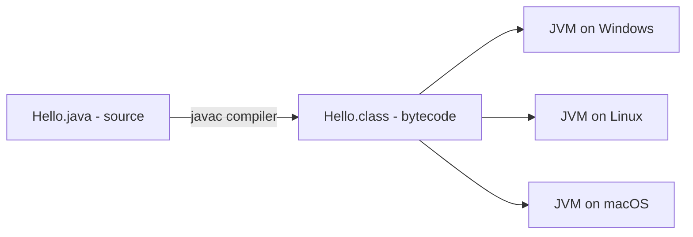

```java
public class Hello {
    public static void main(String[] args) {
        System.out.println("Hello, Java!");
    }
}
```

```text
Hello, Java!
```

```calc
javac Hello.java      -> produces Hello.class (bytecode)
java Hello            -> starts a JVM, loads Hello.class, calls main
```

- The file name must match the **public class** name (`Hello.java`).
- `public static void main(String[] args)` is the entry point: **public** so the JVM can call it, **static** so no object is needed, **void** because it returns nothing, **String[] args** receives command-line arguments.

### JDK vs JRE vs JVM
```calc
+------------------------- JDK (Java Development Kit) ------------------------+
|  javac, javadoc, jar, jdb, jshell ...  (development tools)                  |
|  +------------------- JRE (Java Runtime Environment) ---------------------+ |
|  |  Standard class libraries (java.lang, java.util, java.io ...)          | |
|  |  +------------------ JVM (Java Virtual Machine) ---------------------+ | |
|  |  |  class loader, bytecode verifier, interpreter, JIT, GC            | | |
|  |  +-------------------------------------------------------------------+ | |
|  +------------------------------------------------------------------------+ |
+-----------------------------------------------------------------------------+
```

- **JVM** — an abstract machine that **executes bytecode**. The JVM itself is platform-**dependent** (there is a different JVM for each OS), which is exactly what makes bytecode platform-**independent**.
- **JRE** — JVM + class libraries: what you need to **run** Java programs.
- **JDK** — JRE + development tools (compiler `javac`, debugger, `jar`, `javadoc`): what you need to **develop**. (Since Java 11 Oracle ships only the JDK.)

### Java editions and the standard library
- **Java SE** (Standard Edition) — the core language and libraries.
- **Java EE / Jakarta EE** (Enterprise Edition) — servlets, JSP, EJB, web services.
- **Java ME** (Micro Edition) — small devices.

Core packages: `java.lang` (String, Math, Object, Thread — imported automatically), `java.util` (collections, Scanner), `java.io` (streams, files), `java.net` (networking), `java.sql` (JDBC), `java.awt` / `javax.swing` (GUI), `java.rmi` (remote objects).

**Key points:**
- Java source → bytecode (`.class`) → runs on any JVM: write once, run anywhere.
- JDK ⊃ JRE ⊃ JVM; the JVM is platform-dependent, bytecode is not.
- Key features: object-oriented, robust (GC, no pointers), secure, multithreaded, distributed, dynamic.
- `main` must be `public static void main(String[] args)`.

=== The JVM: Class Loading, Memory Areas, JIT and Garbage Collection
difficulty: hard
---
### JVM architecture

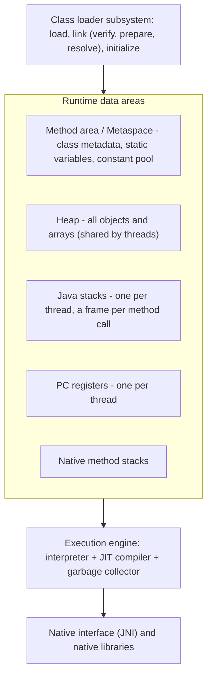

### Class loading
Classes are loaded **lazily** — the first time they are used.
1. **Loading** — find the `.class` file and read the bytecode. Loaders form a **delegation hierarchy**: **Bootstrap** (core `java.*` classes) → **Platform/Extension** → **Application (system)** class loader (your classpath). A loader first asks its **parent**; this prevents user code from replacing core classes like `java.lang.String`.
2. **Linking** — **verify** (the bytecode verifier checks the code is safe and well-formed), **prepare** (allocate static fields with default values), **resolve** (symbolic references → direct references).
3. **Initialization** — run static initializers and assign static fields their values.

### Memory areas
| Area | Holds | Shared? |
|---|---|---|
| **Heap** | All **objects and arrays** (`new`), including instance variables; the **String pool** | Shared by all threads — garbage collected |
| **Stack** | One **frame per method call**: local variables (primitives and **references**), operands, return address | **One per thread** |
| **Method area (Metaspace since Java 8)** | Class structure, method code, static variables, runtime constant pool | Shared |
| **PC register** | Address of the current bytecode instruction | One per thread |
| **Native method stack** | For native (C/C++) methods | One per thread |

```java
public class MemoryDemo {
    static int count = 0;                 // method area (static)
    public static void main(String[] args) {
        int x = 10;                       // stack (primitive local)
        StringBuilder sb = new StringBuilder("hi"); // reference on stack, object on heap
        sb.append(x);
        count++;
        System.out.println(sb + " " + count);
    }
}
```

```text
hi10 1
```

Errors: deep or infinite recursion → **StackOverflowError**; too many live objects → **OutOfMemoryError: Java heap space**.

### Execution engine
- **Interpreter** — executes bytecode instruction by instruction; quick to start.
- **JIT (Just-In-Time) compiler** — finds "hot" methods (run many times) and compiles them to native machine code, with optimizations (inlining, escape analysis). HotSpot JVM is named after this.
- **Garbage collector** — frees memory of unreachable objects (see "Memory Management and Garbage Collection").

### Bytecode
Platform-neutral instructions for the JVM's stack machine. `javap -c Hello` shows them:

```calc
0: getstatic     #7   // Field java/lang/System.out:Ljava/io/PrintStream;
3: ldc           #13  // String Hello, Java!
5: invokevirtual #15  // Method java/io/PrintStream.println:(Ljava/lang/String;)V
8: return
```

**Key points:**
- Class loading: load (parent-delegation), link (verify, prepare, resolve), initialize.
- Heap = objects (shared, GC'd); stack = frames with locals and references (per thread); method area/Metaspace = class data and statics.
- Interpreter + JIT for speed; GC for memory.
- StackOverflowError (stack) vs OutOfMemoryError (heap).

=== Data Types, Variables, Literals and Wrapper Classes
difficulty: easy
---
Java is **strongly and statically typed**: every variable has a type checked at compile time.

### The eight primitive types
Sizes are **fixed on every platform** — part of Java's portability.

| Type | Size | Range / values | Default (fields) |
|---|---|---|---|
| `byte` | 8 bits | −128 to 127 | 0 |
| `short` | 16 bits | −32,768 to 32,767 | 0 |
| `int` | 32 bits | −2³¹ to 2³¹−1 (about ±2.1 billion) | 0 |
| `long` | 64 bits | −2⁶³ to 2⁶³−1 (about ±9.2 × 10¹⁸) | 0L |
| `float` | 32 bits | about ±3.4 × 10³⁸, ~7 significant digits | 0.0f |
| `double` | 64 bits | about ±1.8 × 10³⁰⁸, ~15–16 significant digits | 0.0 |
| `char` | 16 bits | one **Unicode** character, '\u0000' to '￿' | '\u0000' |
| `boolean` | JVM-dependent | `true` / `false` (not 0/1) | false |

> The book's table includes `decimal` and `string` and gives `boolean` 8 bits — those come from C#. Java has exactly **eight** primitives; `String` is a **class**, and `boolean`'s size is not specified by the language.

Everything else is a **reference type**: classes (`String`, `Scanner`), interfaces, arrays, enums. A reference variable holds the **address** of an object on the heap (or `null`).

```java
public class Types {
    public static void main(String[] args) {
        int big = Integer.MAX_VALUE;
        System.out.println(big + 1);              // overflow wraps around silently
        long l = 3_000_000_000L;                  // L suffix; underscores for readability
        float f = 3.14f;                          // f suffix required
        double d = 0.1 + 0.2;
        char c = 'A';
        System.out.println(l + " " + f + " " + d);
        System.out.println(c + 1);                // char promoted to int
        System.out.println((char) (c + 1));
        System.out.println(0x1F + " " + 017 + " " + 0b101); // hex, octal, binary literals
    }
}
```

```text
-2147483648
3000000000 3.14 0.30000000000000004
66
B
31 15 5
```

Notes: integer overflow **wraps around without an error**; `0.1 + 0.2` is not exactly 0.3 (binary floating point) — use `BigDecimal` for money; integer literals are `int` by default, decimals are `double` by default.

### Variables
- **Local variables** — declared in methods/blocks; live on the stack; **must be initialized before use** (no default value — compile error otherwise).
- **Instance variables (fields)** — per object, on the heap; get **default values** (0, false, null).
- **Static (class) variables** — one copy per class, shared by all objects.
- **`final`** variable — a constant; can be assigned only once (`static final double PI = 3.14159;`).
- **`var`** (Java 10+) — local type inference: `var list = new ArrayList<String>();` — still statically typed.

### Wrapper classes and autoboxing
Each primitive has a wrapper class in `java.lang`: `Byte, Short, Integer, Long, Float, Double, Character, Boolean`. Wrappers are needed where objects are required — **collections** (`List<Integer>`), generics, `null` values — and provide utilities (`Integer.parseInt`, `Integer.MAX_VALUE`).
- **Autoboxing** — automatic conversion primitive → wrapper (`Integer x = 5;`).
- **Unboxing** — wrapper → primitive (`int y = x;`). Unboxing `null` throws **NullPointerException**.

The classic interview trap — the **Integer cache** (−128 to 127):

```java
public class Boxing {
    public static void main(String[] args) {
        Integer a = 127, b = 127;
        Integer c = 128, d = 128;
        System.out.println(a == b);       // same cached object
        System.out.println(c == d);       // two different objects
        System.out.println(c.equals(d));  // compares values
        int n = Integer.parseInt("42") + Integer.valueOf("8");
        System.out.println(n);
    }
}
```

```text
true
false
true
50
```

**Never compare wrapper objects with `==`** — use `equals()` (or unbox).

**Key points:**
- Eight primitives with fixed sizes; `String` is a class, not a primitive.
- Locals must be initialized; fields get default values.
- Integer overflow wraps silently; floating point is inexact.
- Autoboxing/unboxing; `Integer` caches −128..127, so `==` on wrappers is unreliable.

=== Type Conversion, Casting and Operators
difficulty: medium
---
### Widening and narrowing conversions
Types have a **rank**; from lowest to highest: `byte → short → int → long → float → double` (and `char → int`).
- **Widening (implicit)** — a lower-ranked value assigned to a higher-ranked type: **automatic and safe**. `int x = 5; double y = x;`
- **Narrowing (explicit casting)** — higher → lower **requires a cast** and may lose information. `double d = 2.9; int i = (int) d;` → 2 (the fraction is **truncated**, not rounded).

The book's example: `int x; double y = 2.5; x = y;` is a **compile error**; `short y; x = y;` is fine because short widens to int.

### Numeric promotion in expressions
- `byte`, `short` and `char` operands are promoted to **int** before arithmetic.
- If either operand is `long`/`float`/`double`, the other is promoted to that type.

```java
public class Casting {
    public static void main(String[] args) {
        byte a = 10, b = 20;
        // byte c = a + b;           // compile error: a + b is an int
        byte c = (byte) (a + b);
        int big = 300;
        byte overflow = (byte) big;  // keeps only the low 8 bits: 300 - 256
        System.out.println(c + " " + overflow);
        System.out.println((int) 9.99 + " " + Math.round(9.99));
        System.out.println(7 / 2 + " " + 7 / 2.0 + " " + 7 % 3 + " " + -7 % 3);
        short s = 5;
        s += 10;                     // compound assignment includes an implicit cast
        System.out.println(s);
    }
}
```

```text
30 44
9 10
3 3.5 1 -1
15
```

### Operators
| Category | Operators |
|---|---|
| Arithmetic | `+ - * / %` (integer `/` truncates; `%` takes the sign of the dividend) |
| Unary | `++ -- + - !` |
| Relational | `== != > < >= <=` (result is boolean) |
| Logical | `&&` `\|\|` (short-circuit), `!` |
| Bitwise | `& \| ^ ~` |
| Shift | `<<` (left), `>>` (signed right — keeps the sign), `>>>` (unsigned right — fills with 0) |
| Assignment | `= += -= *= /= %= &= ...` |
| Ternary | `condition ? a : b` |
| Type check | `instanceof` |

```java
public class Operators {
    public static void main(String[] args) {
        int i = 5;
        int x = i++ + ++i;                  // 5 + 7
        System.out.println(x + " " + i);
        System.out.println(-16 >> 2);       // sign kept
        System.out.println(-16 >>> 28);     // zeros shifted in
        System.out.println(5 & 3);
        System.out.println(5 | 3);
        System.out.println(5 ^ 3);
        System.out.println(1 << 10);
        int a = 0;
        boolean ok = (a != 0) && (10 / a > 1);   // right side never evaluated
        System.out.println(ok);
        String s = "Sum: " + 1 + 2;              // left to right: string concatenation
        String t = 1 + 2 + " is the sum";
        System.out.println(s + " | " + t);
    }
}
```

```text
12 7
-4
15
1
7
6
1024
false
Sum: 12 | 3 is the sum
```

- **Pre-increment** `++i` increments then uses; **post-increment** `i++` uses then increments.
- `&&` and `||` **short-circuit** — the right operand isn't evaluated if the result is already known (avoids the divide by zero above). `&` and `|` on booleans evaluate both sides.
- `+` with a String on either side means **concatenation**, evaluated left to right.

**Key points:**
- Widening is automatic; narrowing needs a cast and may truncate or overflow.
- byte/short/char are promoted to int in arithmetic.
- `>>` keeps the sign, `>>>` fills with zeros.
- `&&`/`||` short-circuit; string concatenation is evaluated left to right.

=== Control Flow: if, switch, Loops, break and continue
difficulty: easy
---
### Selection
```java
public class Grades {
    public static void main(String[] args) {
        int marks = 72;
        if (marks >= 90) System.out.println("A");
        else if (marks >= 70) System.out.println("B");
        else System.out.println("C");

        String day = "TUE";
        switch (day) {                       // switch on String since Java 7
            case "SAT":
            case "SUN":
                System.out.println("Weekend");
                break;
            case "TUE":
                System.out.println("Tuesday");
                // no break: falls through!
            default:
                System.out.println("Weekday");
        }
    }
}
```

```text
B
Tuesday
Weekday
```

- `switch` works on `byte, short, char, int`, their wrappers, **`String`** (Java 7) and **enums** — not on `long`, `float`, `double` or `boolean`.
- Without `break`, execution **falls through** into the next case (shown above).
- Java 14+ adds **switch expressions** with arrows and no fall-through: `String type = switch (day) { case "SAT", "SUN" -> "Weekend"; default -> "Weekday"; };`

### Loops
```java
public class Loops {
    public static void main(String[] args) {
        for (int i = 1; i <= 3; i++) System.out.print(i + " ");
        System.out.println();

        int n = 5, sum = 0;
        while (n > 0) { sum += n; n--; }
        System.out.println("sum = " + sum);

        int k = 10;
        do {                                  // body runs at least once
            System.out.println("do-while ran with k = " + k);
        } while (k < 5);

        int[] nums = {4, 8, 15};
        for (int v : nums) System.out.print(v + " ");   // enhanced for (for-each)
        System.out.println();
    }
}
```

```text
1 2 3
sum = 15
do-while ran with k = 10
4 8 15
```

| Loop | Condition checked | Use when |
|---|---|---|
| `for` | Before each iteration | Number of iterations known |
| `while` | Before each iteration (may run 0 times) | Repeat while a condition holds |
| `do-while` | After each iteration (runs **at least once**) | Menus, input validation |
| for-each | — | Iterate arrays/collections without an index |

### break, continue and labels
- **`break`** exits the innermost loop or switch; **`continue`** skips to the next iteration.
- A **labeled** break/continue acts on an outer loop — Java's replacement for `goto` (which is reserved but unused).

```java
public class Labels {
    public static void main(String[] args) {
        outer:
        for (int i = 1; i <= 3; i++) {
            for (int j = 1; j <= 3; j++) {
                if (j == 2) continue outer;   // next i
                if (i == 3) break outer;      // leave both loops
                System.out.println(i + "," + j);
            }
        }
        System.out.println("done");
    }
}
```

```text
1,1
2,1
done
```

**Key points:**
- switch supports int-like types, String and enums; remember `break` to avoid fall-through.
- do-while runs at least once; for-each iterates arrays and collections.
- Labeled break/continue control outer loops; `goto` is reserved but unused.

=== Arrays: One-Dimensional, Multidimensional and Jagged
difficulty: easy
---
An **array** is an object holding a **fixed number** of values of **one type**, accessed by a zero-based index. Arrays live on the heap; the variable holds a reference.

```java
// fragment
int[] marks;                    // declaration (preferred style; int marks[] also works)
marks = new int[5];             // creation: 5 ints, all 0 by default
int[] primes = {2, 3, 5, 7};    // declaration + initialization
String[] names = new String[3]; // elements default to null
```

- **Length is fixed** once created — read it with the **`length` field** (no parentheses; `String` uses `length()`).
- Accessing index < 0 or ≥ length throws **ArrayIndexOutOfBoundsException** — Java checks bounds, unlike C.
- Default values: 0 for numbers, `false` for boolean, `'\u0000'` for char, `null` for references.

```java
// nondeterministic: the last line prints a hash code
import java.util.Arrays;

public class ArrayDemo {
    public static void main(String[] args) {
        int[] a = {5, 2, 9, 1};
        int sum = 0, max = a[0];
        for (int v : a) { sum += v; if (v > max) max = v; }
        System.out.println("length=" + a.length + " sum=" + sum + " max=" + max);

        int[] copy = Arrays.copyOf(a, a.length);
        Arrays.sort(copy);
        System.out.println(Arrays.toString(a) + " -> " + Arrays.toString(copy));
        System.out.println("index of 9 in sorted: " + Arrays.binarySearch(copy, 9));

        int[] alias = a;              // copies the REFERENCE, not the array
        alias[0] = 100;
        System.out.println(a[0]);
        System.out.println(a);        // prints type@hash, not the contents
    }
}
```

```text
length=4 sum=17 max=9
[5, 2, 9, 1] -> [1, 2, 5, 9]
index of 9 in sorted: 3
100
[I@6f79caec
```

(The last line's hash code differs between runs — always print arrays with `Arrays.toString`.)

### Two-dimensional and jagged arrays
A 2-D array is an **array of arrays**. Rows can have different lengths (**jagged / ragged arrays**).

```java
public class Matrix {
    public static void main(String[] args) {
        int[][] sales = {             // 2 salespeople x 3 items (the book's example idea)
            {10, 20, 30},
            {5, 15, 25}
        };
        for (int[] row : sales) {
            int total = 0;
            for (int v : row) total += v;
            System.out.println(java.util.Arrays.toString(row) + " total=" + total);
        }

        int[][] jagged = new int[3][];           // only the row count is fixed
        for (int i = 0; i < 3; i++) {
            jagged[i] = new int[i + 1];
            for (int j = 0; j <= i; j++) jagged[i][j] = (i == j || j == 0) ? 1 : jagged[i-1][j-1] + jagged[i-1][j];
        }
        System.out.println(java.util.Arrays.deepToString(jagged)); // Pascal's triangle
    }
}
```

```text
[10, 20, 30] total=60
[5, 15, 25] total=45
[[1], [1, 1], [1, 2, 1]]
```

### Arrays vs ArrayList

| Array | ArrayList |
|---|---|
| Fixed size | Grows and shrinks dynamically |
| Holds primitives or objects | Objects only (`ArrayList<Integer>`, autoboxing) |
| `length` field | `size()` method |
| Slightly faster, less memory | Rich API (add, remove, contains) |

**Key points:**
- Arrays are fixed-size objects; use `length`; out-of-range access throws an exception.
- Assigning an array copies the reference; use `Arrays.copyOf` / `clone()` to copy.
- `Arrays.toString`, `sort`, `binarySearch`, `fill`, `deepToString` are the main utilities.
- 2-D arrays are arrays of arrays; rows may differ in length (jagged).

=== Strings: Immutability, the String Pool, StringBuilder and StringBuffer
difficulty: medium
---
A `String` is an **object** representing a sequence of characters. Strings are **immutable** — once created, the contents can never change; every "modifying" method returns a **new** String.

### String literals and the String pool
- A **literal** (`"Java"`) is stored in the **String constant pool** (in the heap). Identical literals share **one** object.
- `new String("Java")` always creates a **new** object on the heap (plus the literal in the pool).
- `intern()` returns the pooled copy.

```java
public class StringPool {
    public static void main(String[] args) {
        String s1 = "Java";
        String s2 = "Java";
        String s3 = new String("Java");
        System.out.println(s1 == s2);          // same pooled object
        System.out.println(s1 == s3);          // different objects
        System.out.println(s1.equals(s3));     // same characters
        System.out.println(s1 == s3.intern());
        String s4 = "Ja" + "va";               // compile-time constant -> pooled
        String part = "Ja";
        String s5 = part + "va";               // built at run time -> new object
        System.out.println((s1 == s4) + " " + (s1 == s5));
    }
}
```

```text
true
false
true
true
true false
```

> **`==` compares references; `equals()` compares contents.** Always use `equals()` (or `equalsIgnoreCase()`) for strings.

### Why are strings immutable?
- **Security** — strings hold file names, URLs, class names, passwords; they can't be altered after validation.
- **String pool** — sharing literals is safe only if nobody can change them.
- **Thread safety** — immutable objects can be shared freely between threads.
- **Hash code caching** — the hash is computed once, making strings fast `HashMap` keys.

```java
public class Immutable {
    public static void main(String[] args) {
        String s = "hello";
        s.toUpperCase();                 // result discarded - s unchanged
        System.out.println(s);
        s = s.toUpperCase();             // reassign the variable to the new object
        System.out.println(s);
    }
}
```

```text
hello
HELLO
```

### Common String methods
```java
public class StringMethods {
    public static void main(String[] args) {
        String s = "  Interview Prep  ";
        String t = s.trim();
        System.out.println("[" + t + "] length=" + t.length());
        System.out.println(t.charAt(0) + " " + t.indexOf("Prep") + " " + t.substring(0, 9));
        System.out.println(t.toLowerCase() + " | " + t.replace('e', '3'));
        System.out.println(t.contains("view") + " " + t.startsWith("Inter") + " " + t.endsWith("x"));
        System.out.println(String.join("-", t.split(" ")));
        System.out.println("apple".compareTo("banana") + " " + "b".compareTo("a"));
        System.out.println(String.valueOf(42) + 1);
        System.out.println(new StringBuilder("racecar").reverse().toString().equals("racecar"));
    }
}
```

```text
[Interview Prep] length=14
I 10 Interview
interview prep | Int3rvi3w Pr3p
true true false
Interview-Prep
-1 1
421
true
```

`compareTo` returns a negative number, zero or a positive number (lexicographic order) — used for sorting.

### StringBuilder and StringBuffer
For building strings in a loop, use a **mutable** builder — concatenating `String`s in a loop creates a new object every iteration (O(n²) copying).

```java
public class Builders {
    public static void main(String[] args) {
        StringBuilder sb = new StringBuilder();
        for (int i = 1; i <= 5; i++) sb.append(i).append(',');
        sb.setLength(sb.length() - 1);        // drop the last comma
        sb.insert(0, "[").append("]");
        System.out.println(sb);
        System.out.println(sb.reverse());
    }
}
```

```text
[1,2,3,4,5]
]5,4,3,2,1[
```

| | String | StringBuilder | StringBuffer |
|---|---|---|---|
| Mutable? | **No** | Yes | Yes |
| Thread-safe? | Yes (immutable) | **No** | **Yes** (synchronized methods) |
| Speed | Slow for repeated changes | **Fastest** | Slower than StringBuilder |
| Since | 1.0 | 1.5 | 1.0 |
| Use for | Fixed text, keys | Building strings in one thread | Shared between threads (rare) |

**Key points:**
- Strings are immutable; literals are pooled; `new String()` makes a new object.
- `==` compares references, `equals()` compares contents.
- Immutability gives security, safe pooling, thread safety and cached hash codes.
- Use StringBuilder (single thread) or StringBuffer (synchronized) for repeated modification.

=== Classes, Objects and Constructors
difficulty: easy
---
Java is a true object-oriented language: all code lives inside **classes**. A **class** is a blueprint that defines **fields** (state) and **methods** (behaviour); an **object** is an **instance** of a class created with `new`, living on the heap.

```calc
class ClassName [extends SuperClass] [implements Interface1, Interface2] {
    fields        // data
    constructors  // initialize new objects
    methods       // behaviour
}
```

### Constructors
A **constructor** initializes a new object. It has the **same name as the class** and **no return type** (not even `void` — adding one turns it into an ordinary method). It runs automatically when `new` is used.
- **Default constructor** — if a class declares **no** constructor, the compiler supplies a no-argument one that sets fields to default values. As soon as you write **any** constructor, the default one is **no longer provided**.
- **Parameterized constructor** — takes arguments to set initial state.
- **Constructor overloading** — several constructors with different parameter lists.
- **`this(...)`** — calls another constructor of the same class (**constructor chaining**); must be the **first statement**.
- **`this`** — refers to the current object; used when a parameter shadows a field (`this.name = name`).

```java
public class Circle {
    private double radius;
    private String colour;
    private static int created = 0;       // shared by all Circle objects

    public Circle() {                      // no-arg constructor
        this(1.0);                         // chain to the next constructor
    }
    public Circle(double radius) {
        this(radius, "red");
    }
    public Circle(double radius, String colour) {
        this.radius = radius;              // this.radius = field, radius = parameter
        this.colour = colour;
        created++;
    }
    public double area() { return Math.PI * radius * radius; }
    public String toString() { return colour + " circle r=" + radius; }

    public static void main(String[] args) {
        Circle a = new Circle();
        Circle b = new Circle(2.5);
        Circle c = new Circle(3, "blue");
        System.out.println(a + " | " + b + " | " + c);
        System.out.printf("area of b = %.2f%n", b.area());
        System.out.println("circles created: " + created);

        Circle d = c;                      // copies the reference
        d.colour = "green";
        System.out.println(c);             // same object changed
    }
}
```

```text
red circle r=1.0 | red circle r=2.5 | blue circle r=3.0
area of b = 19.63
circles created: 3
green circle r=3.0
```

### Objects and references
- `Circle c = new Circle(3, "blue");` — `new` allocates the object on the heap, runs the constructor and returns a **reference**, stored in `c` (on the stack).
- Assigning one reference to another makes both **point to the same object**.
- An object with no references left becomes **eligible for garbage collection**.

### Constructor vs method

| Constructor | Method |
|---|---|
| Same name as the class | Any name |
| No return type | Must have a return type (or `void`) |
| Called automatically by `new` | Called explicitly |
| Not inherited | Inherited (unless private) |
| Default one supplied if none is written | No default |

> Can a constructor be `private`? Yes — used for **singletons** and utility classes so outsiders can't create instances. Can it be `final`, `static` or `abstract`? **No.**

**Key points:**
- Class = blueprint (fields + methods); object = instance created with `new` on the heap.
- Constructor: class name, no return type; default constructor only if none is written.
- `this` = current object; `this(...)` chains constructors and must be first.
- Variables hold references; assignment copies the reference, not the object.

=== Methods: Parameter Passing, Overloading, static and final
difficulty: medium
---
```calc
[modifiers] returnType name(parameterList) [throws Exceptions] {
    body
}
```

### Java is always pass-by-value
Java passes **a copy of the value** of every argument:
- for primitives, a copy of the number — the caller's variable can't change;
- for objects, a **copy of the reference** — the method can **modify the object** it points to, but **reassigning** the parameter doesn't affect the caller's variable.

```java
public class PassByValue {
    static void change(int x, int[] arr, StringBuilder sb) {
        x = 99;                      // changes only the local copy
        arr[0] = 99;                 // modifies the shared array object
        sb.append(" world");         // modifies the shared object
        sb = new StringBuilder("new");  // reassigns the local copy only
    }
    public static void main(String[] args) {
        int x = 1;
        int[] arr = {1, 2};
        StringBuilder sb = new StringBuilder("hello");
        change(x, arr, sb);
        System.out.println(x + " " + arr[0] + " " + sb);
    }
}
```

```text
1 99 hello world
```

That's why a `swap(Integer a, Integer b)` method can never swap the caller's variables in Java.

### Method overloading
Several methods with the **same name** but **different parameter lists** (number, types or order of parameters). The return type alone is **not** enough. Resolved at **compile time** (static polymorphism).

```java
public class Overload {
    static int add(int a, int b) { return a + b; }
    static double add(double a, double b) { return a + b; }
    static int add(int a, int b, int c) { return a + b + c; }
    static String add(String a, String b) { return a + b; }
    static int sum(int... nums) {             // varargs: zero or more ints, seen as an array
        int s = 0;
        for (int n : nums) s += n;
        return s;
    }
    public static void main(String[] args) {
        System.out.println(add(2, 3));
        System.out.println(add(2.5, 3));      // int 3 widened to double
        System.out.println(add(1, 2, 3));
        System.out.println(add("Ja", "va"));
        System.out.println(sum() + " " + sum(5) + " " + sum(1, 2, 3, 4));
    }
}
```

```text
5
5.5
6
Java
0 5 10
```

A **varargs** parameter (`int... nums`) must be the **last** parameter, and only one is allowed.

### static members
- **Static variable** — one copy per **class**, shared by all objects (e.g. a counter of created objects).
- **Static method** — belongs to the class; called as `ClassName.method()` without an object. It **cannot use `this` or access instance members directly** (there is no current object). `main` is static so the JVM can call it before any object exists. `Math.sqrt`, `Integer.parseInt` are static.
- **Static block** — runs **once**, when the class is loaded; used to initialize static data.
- **Instance initializer block** — runs **every time an object is created**, before the constructor body.

```java
public class InitOrder {
    static int s;
    int i;
    static { s = 10; System.out.println("static block (class loaded)"); }
    { i = 5; System.out.println("instance block"); }
    InitOrder() { System.out.println("constructor, i=" + i + ", s=" + s); }

    public static void main(String[] args) {
        System.out.println("main starts");
        new InitOrder();
        new InitOrder();
    }
}
```

```text
static block (class loaded)
main starts
instance block
constructor, i=5, s=10
instance block
constructor, i=5, s=10
```

### final
- **final variable** — a constant: can be assigned once (a `final` reference can't be repointed, but the object it points to can still change).
- **final method** — cannot be **overridden**.
- **final class** — cannot be **extended** (e.g. `String`, `Integer`, `Math`).

### Recursion
A method that calls itself; needs a **base case**. Each call takes a stack frame — too deep → `StackOverflowError`.

```java
public class Recursion {
    static long factorial(int n) { return n <= 1 ? 1 : n * factorial(n - 1); }
    static int fib(int n) { return n < 2 ? n : fib(n - 1) + fib(n - 2); }
    public static void main(String[] args) {
        System.out.println(factorial(10) + " " + fib(10));
    }
}
```

```text
3628800 55
```

**Key points:**
- Java is always pass-by-value; for objects, the value is a copy of the reference.
- Overloading = same name, different parameters; resolved at compile time; return type alone isn't enough.
- static = belongs to the class; static methods can't use `this`; static blocks run once at class load.
- final variable = constant, final method = no override, final class = no subclass.

=== Access Modifiers, Encapsulation and Packages
difficulty: easy
---
### Access modifiers

| Modifier | Same class | Same package | Subclass (other package) | Everywhere |
|---|---|---|---|---|
| `private` | Yes | No | No | No |
| *(default — no keyword, "package-private")* | Yes | Yes | No | No |
| `protected` | Yes | Yes | Yes | No |
| `public` | Yes | Yes | Yes | Yes |

- Top-level classes can be only `public` or package-private.
- `protected` gives subclasses access even in other packages — more than default, less than public. The book notes that public fields violate encapsulation, and protected is a compromise for inheritance.

### Encapsulation
**Bundle data with the methods that operate on it and hide the data**: fields `private`, access through public **getters/setters** that can **validate**. Benefits: control over valid state, freedom to change the internal representation, read-only or write-only properties.

```java
public class BankAccount {
    private final String owner;
    private double balance;

    public BankAccount(String owner, double opening) {
        this.owner = owner;
        deposit(opening);
    }
    public double getBalance() { return balance; }     // read-only from outside
    public void deposit(double amount) {
        if (amount <= 0) throw new IllegalArgumentException("Deposit must be positive");
        balance += amount;
    }
    public boolean withdraw(double amount) {
        if (amount > balance) return false;             // rule enforced in one place
        balance -= amount;
        return true;
    }
    public static void main(String[] args) {
        BankAccount acc = new BankAccount("Asha", 1000);
        System.out.println(acc.withdraw(300) + " " + acc.getBalance());
        System.out.println(acc.withdraw(5000) + " " + acc.getBalance());
        try {
            acc.deposit(-50);
        } catch (IllegalArgumentException e) {
            System.out.println("Rejected: " + e.getMessage());
        }
    }
}
```

```text
true 700.0
false 700.0
Rejected: Deposit must be positive
```

### Packages
A **package** groups related classes and interfaces into a namespace (a folder of `.class` files). Benefits (from the book): classes can be **reused**, names in different packages **don't collide**, packages give **access control** (package-private), and they **organize** large projects.

```java
// fragment
package com.traversal.bank;            // first statement in the file

import java.util.List;                 // one class
import java.util.*;                    // all classes of java.util (not subpackages)
import static java.lang.Math.PI;       // static import of a member
```

- Package names mirror the directory structure (`com/traversal/bank/Account.java`) and by convention use a reversed domain name.
- `java.lang` is imported automatically.
- Fully qualified names avoid imports: `java.util.Date d = new java.util.Date();` — needed when two packages have a class with the same name (`java.util.Date` vs `java.sql.Date`).
- Built-in packages: `java.lang, java.util, java.io, java.net, java.sql, java.awt, javax.swing, java.applet, java.rmi`.
- Compile with `javac -d . Account.java` to create the package folders; run with the full name `java com.traversal.bank.Account`.

**Key points:**
- private < default (package) < protected < public.
- Encapsulation: private fields + validating public methods.
- Packages = namespaces + access control + organization; folder structure mirrors the package name.
- `import` saves typing; `java.lang` is automatic; fully qualified names resolve clashes.

=== Inheritance: extends, super and Constructor Chaining
difficulty: medium
---
**Inheritance** lets a new class (**subclass / child / derived**) acquire the fields and methods of an existing class (**superclass / parent / base**) and add or change behaviour — an **"is-a"** relationship (a Car *is a* Vehicle). It promotes **code reuse** and enables **polymorphism**.

```java
class Vehicle {
    protected String name;
    protected int wheels;
    Vehicle(String name, int wheels) {
        this.name = name;
        this.wheels = wheels;
        System.out.println("Vehicle constructor");
    }
    void describe() { System.out.println(name + " has " + wheels + " wheels"); }
}

class Car extends Vehicle {
    private int seats;
    Car(String name, int seats) {
        super(name, 4);                       // must be the first statement
        this.seats = seats;
        System.out.println("Car constructor");
    }
    @Override
    void describe() {
        super.describe();                     // reuse the parent's version
        System.out.println("  and " + seats + " seats");
    }
}

public class InheritanceDemo {
    public static void main(String[] args) {
        Car c = new Car("Sedan", 5);
        c.describe();
        System.out.println(c instanceof Vehicle);
    }
}
```

```text
Vehicle constructor
Car constructor
Sedan has 4 wheels
  and 5 seats
true
```

### super
- **`super(args)`** — calls the parent constructor; must be the **first statement** of the child constructor. If you don't write it, the compiler inserts **`super()`** (no-arg) — a compile error if the parent has no no-arg constructor.
- **`super.method()`** / **`super.field`** — accesses the parent's version of an overridden method or hidden field.
- **Constructor chaining:** constructors run **from the top of the hierarchy down** — `Object`, then Vehicle, then Car (as the output shows).

### Types of inheritance

```calc
Single:        A <- B
Multilevel:    A <- B <- C          (C inherits from B, which inherits from A)
Hierarchical:  A <- B, A <- C       (several children of one parent)
Multiple:      A, B <- C            NOT allowed with classes in Java
Hybrid:        combination          only via interfaces
```

**Why no multiple inheritance of classes?** The **diamond problem**: if B and C both override `show()` from A and D extends both, which `show()` does D inherit? Java avoids the ambiguity; a class can **implement many interfaces** instead (with Java 8 default methods, a class that inherits conflicting defaults must override the method itself).

### What is and isn't inherited
- Inherited: public and protected members (and package-private ones within the same package).
- **Not inherited:** **private** members (they exist in the object but aren't accessible directly), **constructors**, and static members aren't overridden (they can be **hidden**).
- Every class implicitly extends **`java.lang.Object`** if it extends nothing else.

### Inheritance vs composition
- **Inheritance** — "is-a"; tight coupling; changes in the parent ripple into children.
- **Composition** — "has-a" (a Car *has an* Engine field); more flexible. Common advice: **favour composition over inheritance** unless there is a true is-a relationship.

**Key points:**
- `extends` creates an is-a relationship; Java allows single, multilevel and hierarchical inheritance of classes.
- `super(...)` must be first; the compiler inserts `super()` if omitted; constructors run parent-first.
- No multiple inheritance of classes (diamond problem) — use interfaces.
- Private members and constructors aren't inherited; every class extends Object.

=== Polymorphism: Overriding, Dynamic Method Dispatch and Overloading
difficulty: medium
---
**Polymorphism** ("many forms") — one interface, many implementations.
- **Compile-time (static) polymorphism** — **method overloading**; the compiler picks the method from the argument types.
- **Run-time (dynamic) polymorphism** — **method overriding**; the JVM picks the method from the **actual object's class** at run time (**dynamic method dispatch**).

### Method overriding
A subclass provides its own implementation of a method inherited from the superclass. Rules:
- **Same name and parameter list**; the return type must be the same or a **subtype** (**covariant return**).
- Access can be the **same or wider** (protected → public is fine; public → protected is not).
- It may not throw **new or broader checked exceptions**.
- `private`, `static` and `final` methods **cannot be overridden** (a static method with the same signature **hides** the parent's).
- Use **`@Override`** — the compiler then catches typos that would silently create a new method.

```java
abstract class Shape {
    abstract double area();
    public String toString() { return getClass().getSimpleName() + " area=" + String.format("%.2f", area()); }
    static String kind() { return "shape"; }
}
class Rect extends Shape {
    double w, h;
    Rect(double w, double h) { this.w = w; this.h = h; }
    @Override double area() { return w * h; }
    static String kind() { return "rect"; }      // hides, does not override
}
class Circle extends Shape {
    double r;
    Circle(double r) { this.r = r; }
    @Override double area() { return Math.PI * r * r; }
}

public class Dispatch {
    public static void main(String[] args) {
        Shape[] shapes = { new Rect(2, 3), new Circle(1), new Rect(1, 1) };
        double total = 0;
        for (Shape s : shapes) {          // reference type Shape, object types differ
            System.out.println(s);        // the right area() is chosen at run time
            total += s.area();
        }
        System.out.printf("total=%.2f%n", total);

        Shape s = new Rect(1, 1);
        System.out.println(Shape.kind() + " " + Rect.kind());  // static: resolved by class
    }
}
```

```text
Rect area=6.00
Circle area=3.14
Rect area=1.00
total=10.14
shape rect
```

### Upcasting and downcasting
- **Upcasting** (child → parent reference) is automatic: `Shape s = new Rect(2, 3);` Through `s` you can call only methods declared in `Shape`, but **overridden versions run**.
- **Downcasting** (parent → child) needs a cast and may fail at run time with **ClassCastException**; check first with `instanceof`.

```java
// fragment
Shape s = new Circle(1);
if (s instanceof Circle) {
    Circle c = (Circle) s;            // safe downcast
    System.out.println(c.r);
}
Rect r = (Rect) s;                    // compiles, but ClassCastException at run time
```

Fields are **not** polymorphic: a field access uses the **reference type**, not the object type.

### Overloading vs overriding

| | Overloading | Overriding |
|---|---|---|
| Where | Same class (or subclass) | Subclass |
| Parameters | **Must differ** | **Must be the same** |
| Return type | Can differ | Same or covariant |
| Binding | **Compile time** (static) | **Run time** (dynamic) |
| static/private/final | Can be overloaded | Cannot be overridden |
| Purpose | Same operation, different inputs | Specialized behaviour in a subclass |

**Key points:**
- Overloading = compile-time polymorphism; overriding = run-time polymorphism via dynamic dispatch.
- Overriding rules: same signature, covariant return, no weaker access, no broader checked exceptions.
- static, private and final methods are not overridden (static ones are hidden).
- Upcasting is implicit; downcasting needs a cast and an instanceof check.

=== Abstract Classes and Interfaces
difficulty: medium
---
### Abstract classes
A class declared **`abstract`** cannot be instantiated; it serves as a base for subclasses.
- It may contain **abstract methods** (no body — `abstract double area();`) **and** concrete methods, fields, constructors, static members.
- A concrete subclass **must implement all abstract methods**, or be abstract itself.
- A class with an abstract method **must** be abstract; an abstract class need not have abstract methods (the book notes this).
- Use when related classes share **state and common code** but differ in some behaviour.

### Interfaces
An **interface** is a contract — a collection of **abstract methods and constants** that implementing classes promise to provide.
- Methods are implicitly **`public abstract`**; fields are implicitly **`public static final`** (constants).
- Since **Java 8**: **default methods** (with a body, inherited by implementers) and **static methods**. Since **Java 9**: **private methods**.
- A class can **implement many interfaces** — Java's form of multiple inheritance. An interface can **extend** several interfaces.
- No constructors, no instance state.

```java
interface Payable {
    double TAX = 0.1;                         // public static final
    double amount();                          // public abstract
    default double withTax() { return amount() * (1 + TAX); }   // Java 8 default method
    static String currency() { return "INR"; }
}
interface Printable {
    void print();
}

abstract class Employee implements Payable, Printable {   // implements two interfaces
    protected final String name;
    Employee(String name) { this.name = name; }
    public void print() { System.out.printf("%s: %.1f %s%n", name, withTax(), Payable.currency()); }
}
class Salaried extends Employee {
    private final double monthly;
    Salaried(String n, double m) { super(n); monthly = m; }
    public double amount() { return monthly; }
}
class Hourly extends Employee {
    private final double rate; private final int hours;
    Hourly(String n, double r, int h) { super(n); rate = r; hours = h; }
    public double amount() { return rate * hours; }
}

public class Payroll {
    public static void main(String[] args) {
        Employee[] staff = { new Salaried("Asha", 50000), new Hourly("Ravi", 500, 40) };
        for (Employee e : staff) e.print();
        Payable p = staff[1];                      // interface type reference
        System.out.println(p.amount());
    }
}
```

```text
Asha: 55000.0 INR
Ravi: 22000.0 INR
20000.0
```

### Functional interfaces
An interface with **exactly one abstract method** (e.g. `Runnable`, `Comparator`, `Predicate`) — can be implemented with a **lambda** (see "Java 8 Features"). `@FunctionalInterface` makes the compiler check this.

**Marker interfaces** have no methods and just tag a class: `Serializable`, `Cloneable`.

### Abstract class vs interface

| | Abstract class | Interface |
|---|---|---|
| Methods | Abstract and concrete | Abstract; default/static (8+), private (9+) |
| Variables | Any kind (instance, static, final or not) | Only `public static final` constants |
| Constructors | Yes | No |
| Inheritance | A class **extends one** abstract class | A class **implements many** interfaces |
| Access of members | Any | Public (except private helpers) |
| Relationship | "is-a" with shared code/state | "can-do" capability / contract |
| Example | `AbstractList`, `HttpServlet` | `Comparable`, `Runnable`, `List` |

Rule of thumb: use an **interface** to define a capability many unrelated classes can have; use an **abstract class** to share code among closely related classes.

**Key points:**
- Abstract class: can't be instantiated; mixes abstract and concrete methods; can have state and constructors.
- Interface: contract of public abstract methods + constants; default/static methods since Java 8.
- A class extends one class but implements many interfaces.
- Functional interface = exactly one abstract method → lambda target.

=== The Object Class: toString, equals, hashCode and clone
difficulty: hard
---
`java.lang.Object` is the root of every class hierarchy. Its key methods:

| Method | Default behaviour |
|---|---|
| `toString()` | `ClassName@hexHashCode` — override to give a readable description |
| `equals(Object o)` | Reference equality (`this == o`) — override for value equality |
| `hashCode()` | An int typically derived from the object's identity |
| `getClass()` | Runtime class object |
| `clone()` | Field-by-field copy (protected; class must implement `Cloneable`) |
| `finalize()` | Called by GC before reclaiming (deprecated since Java 9) |
| `wait()`, `notify()`, `notifyAll()` | Thread coordination on the object's monitor |

### The equals–hashCode contract
1. If `a.equals(b)` is true, then **`a.hashCode() == b.hashCode()` must be true**.
2. Equal hash codes do **not** imply equals (collisions are allowed).
3. `equals` must be **reflexive, symmetric, transitive, consistent**, and `x.equals(null)` is false.

**If you override `equals`, you must override `hashCode`**, otherwise hash-based collections (`HashMap`, `HashSet`) break: two "equal" objects land in different buckets.

```java
import java.util.*;

class PointNoHash {
    final int x, y;
    PointNoHash(int x, int y) { this.x = x; this.y = y; }
    @Override public boolean equals(Object o) {
        if (!(o instanceof PointNoHash)) return false;
        PointNoHash p = (PointNoHash) o;
        return x == p.x && y == p.y;
    }
}

class Point {
    final int x, y;
    Point(int x, int y) { this.x = x; this.y = y; }
    @Override public boolean equals(Object o) {
        if (this == o) return true;
        if (!(o instanceof Point)) return false;
        Point p = (Point) o;
        return x == p.x && y == p.y;
    }
    @Override public int hashCode() { return Objects.hash(x, y); }
    @Override public String toString() { return "(" + x + "," + y + ")"; }
}

public class EqualsHash {
    public static void main(String[] args) {
        Set<PointNoHash> bad = new HashSet<>();
        bad.add(new PointNoHash(1, 2));
        System.out.println("without hashCode: " + bad.contains(new PointNoHash(1, 2)));

        Set<Point> good = new HashSet<>();
        good.add(new Point(1, 2));
        good.add(new Point(1, 2));                 // duplicate, not added
        System.out.println("with hashCode: " + good.contains(new Point(1, 2)) + ", size " + good.size());
        System.out.println(good);
    }
}
```

```text
without hashCode: false
with hashCode: true, size 1
[(1,2)]
```

### Shallow vs deep copy (clone)
- **Shallow copy** — copies field values; reference fields still point to the **same** objects (`Object.clone()` does this).
- **Deep copy** — also copies the referenced objects, so the copy is fully independent.

```java
import java.util.*;

public class CloneDemo implements Cloneable {
    String name;
    List<String> tags = new ArrayList<>();

    @Override
    public CloneDemo clone() throws CloneNotSupportedException {
        return (CloneDemo) super.clone();          // shallow
    }
    CloneDemo deepCopy() {
        CloneDemo c = new CloneDemo();
        c.name = name;
        c.tags = new ArrayList<>(tags);            // new list
        return c;
    }
    public static void main(String[] args) throws Exception {
        CloneDemo a = new CloneDemo();
        a.name = "A"; a.tags.add("x");
        CloneDemo shallow = a.clone();
        CloneDemo deep = a.deepCopy();
        a.tags.add("y");
        System.out.println(shallow.tags + " " + deep.tags);
    }
}
```

```text
[x, y] [x]
```

Calling `clone()` on a class that doesn't implement the marker interface `Cloneable` throws `CloneNotSupportedException`. Many developers prefer **copy constructors** instead.

**Key points:**
- Object is the root class; override toString for readable output.
- equals ⇒ equal hashCodes; always override hashCode with equals or HashMap/HashSet break.
- `==` compares references; `equals` compares meaning.
- clone() is shallow; deep copy duplicates referenced objects too.

=== Nested Classes: Inner, Static Nested, Local and Anonymous
difficulty: medium
---
A **nested class** is a class defined inside another class. Benefits (as the book lists): **logical grouping** of classes used in one place, **data hiding** (the nested class can be private), **access to the outer class's private members**, and more readable code (e.g. an iterator for a collection, event handlers in GUIs).

| Kind | Declared | Has access to | Notes |
|---|---|---|---|
| **Static nested class** | `static class X` inside a class | Only **static** members of the outer class | No outer instance needed: `new Outer.Nested()` |
| **Inner (member) class** | Non-static class inside a class | **All** members, including private instance fields | Tied to an outer object: `outer.new Inner()` |
| **Local class** | Inside a method | Outer members + **effectively final** local variables | Visible only in that method |
| **Anonymous class** | Declared and instantiated in one expression | Same as local | No name; implements an interface or extends a class once |

```java
import java.util.*;

public class Outer {
    private int secret = 42;
    private static String brand = "Outer";

    static class StaticNested {
        String info() { return "static nested sees " + brand; }   // no access to secret
    }
    class Inner {
        String info() { return "inner sees secret " + secret; }   // implicit Outer.this
    }

    void localDemo() {
        int base = 10;                                   // effectively final
        class Local {
            int add(int x) { return base + x; }
        }
        System.out.println("local class: " + new Local().add(5));
    }

    public static void main(String[] args) {
        System.out.println(new Outer.StaticNested().info());
        Outer o = new Outer();
        Outer.Inner in = o.new Inner();
        System.out.println(in.info());
        o.localDemo();

        Comparator<String> byLength = new Comparator<String>() {   // anonymous class
            @Override public int compare(String a, String b) { return a.length() - b.length(); }
        };
        List<String> words = new ArrayList<>(List.of("banana", "fig", "apple"));
        words.sort(byLength);
        System.out.println("anonymous comparator: " + words);

        words.sort((a, b) -> b.compareTo(a));                       // the same idea as a lambda
        System.out.println("lambda comparator: " + words);
    }
}
```

```text
static nested sees Outer
inner sees secret 42
local class: 15
anonymous comparator: [fig, apple, banana]
lambda comparator: [fig, banana, apple]
```

Notes:
- An inner class instance holds a hidden reference to its outer object — a possible **memory leak** if the inner object outlives the outer one; prefer **static nested** classes when you don't need the outer instance.
- Local and anonymous classes may use local variables only if they are **final or effectively final** (never reassigned).
- Anonymous classes are common for event listeners and comparators; since Java 8, a **lambda** replaces an anonymous class that implements a **functional interface**.
- Inside an anonymous class, `this` refers to the anonymous object; inside a lambda, `this` refers to the enclosing object.

**Key points:**
- Static nested: no outer instance, only static outer members.
- Inner: tied to an outer object, sees all its members (`outer.new Inner()`).
- Local and anonymous classes can capture effectively final local variables.
- Lambdas replace anonymous classes for functional interfaces.

=== Exception Handling: try, catch, finally, throw and throws
difficulty: medium
---
An **exception** is an event that disrupts normal flow — division by zero, a missing file, a null reference, invalid input. Exception handling separates **error-handling code** from normal code and lets a program recover or fail gracefully instead of crashing. (The book notes it's meant for **synchronous** errors such as invalid parameters or memory exhaustion, not asynchronous events like disk I/O completion, and is not optimized for speed — don't use it for normal control flow.)

### Exception hierarchy

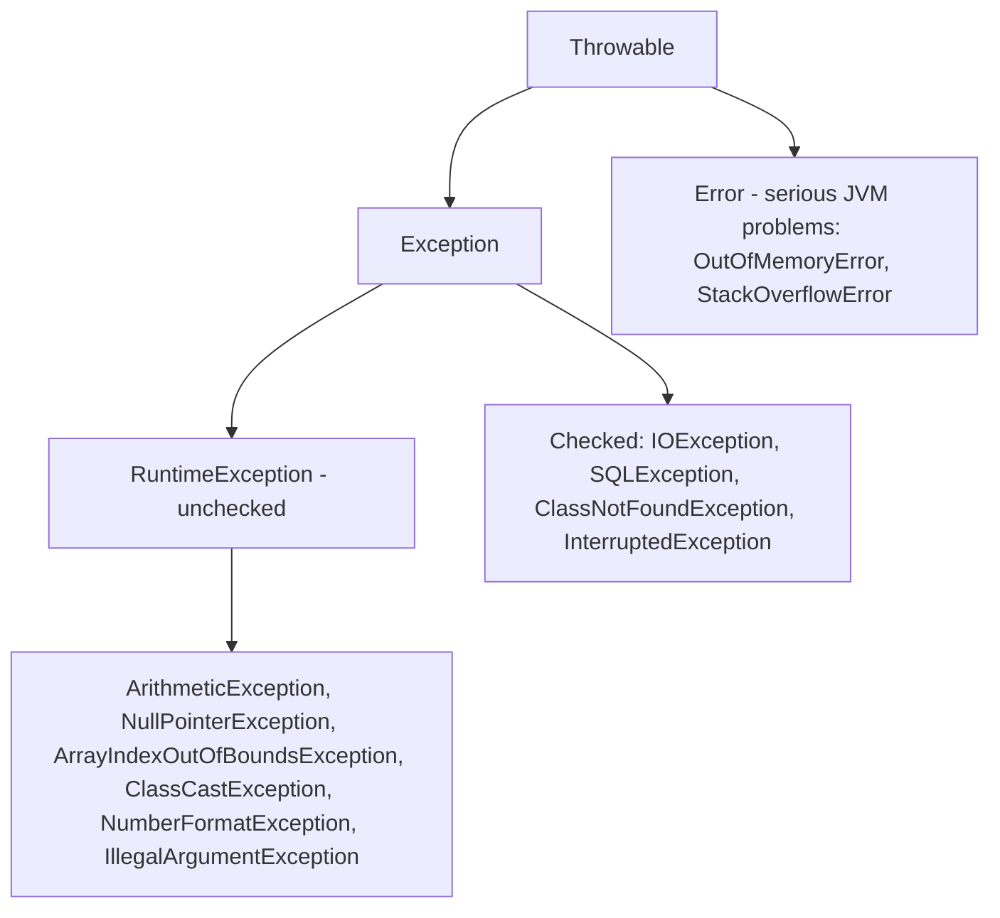

| Checked exceptions | Unchecked exceptions |
|---|---|
| Subclasses of `Exception` except `RuntimeException` | `RuntimeException` and its subclasses (and `Error`s) |
| Checked **at compile time** — must be caught or declared with `throws` | Not checked by the compiler |
| Recoverable external conditions (file missing, network down) | Usually **programming bugs** (null, bad index, bad cast) |
| `IOException`, `SQLException` | `NullPointerException`, `ArithmeticException` |

`Error`s (OutOfMemoryError, StackOverflowError) indicate serious problems an application normally shouldn't try to catch.

### try – catch – finally

```java
public class ExceptionFlow {
    static int divide(int a, int b) { return a / b; }

    public static void main(String[] args) {
        String[] inputs = {"10", "0", "abc"};
        for (String in : inputs) {
            try {
                int n = Integer.parseInt(in);           // may throw NumberFormatException
                System.out.println("100 / " + n + " = " + divide(100, n));
            } catch (ArithmeticException e) {
                System.out.println("Cannot divide by zero: " + e.getMessage());
            } catch (NumberFormatException e) {
                System.out.println("Not a number: " + in);
            } finally {
                System.out.println("finally runs for " + in);
            }
        }
        System.out.println("program continues");
    }
}
```

```text
100 / 10 = 10
finally runs for 10
Cannot divide by zero: / by zero
finally runs for 0
Not a number: abc
finally runs for abc
program continues
```

- **try** encloses code that may throw. **catch** blocks are checked **in order**; the first matching type handles it — so put **subclasses before superclasses** (a `catch (Exception e)` before `catch (ArithmeticException e)` is a compile error: unreachable code).
- **finally** always runs — whether an exception occurred, was caught or not, or the try block returned — used to release resources. (It is skipped only if the JVM exits, e.g. `System.exit()`.)
- **Multi-catch** (Java 7): `catch (IOException | SQLException e)`.
- An uncaught exception propagates up the call stack; if nothing catches it, the thread dies and the JVM prints the **stack trace**.

### throw vs throws; custom exceptions

```java
class InsufficientFundsException extends Exception {          // checked custom exception
    private final double shortBy;
    InsufficientFundsException(String msg, double shortBy) { super(msg); this.shortBy = shortBy; }
    double getShortBy() { return shortBy; }
}

public class CustomException {
    static double balance = 500;

    static void withdraw(double amt) throws InsufficientFundsException {   // declares it
        if (amt <= 0) throw new IllegalArgumentException("amount must be positive"); // unchecked
        if (amt > balance)
            throw new InsufficientFundsException("Balance too low", amt - balance); // throws it
        balance -= amt;
    }

    public static void main(String[] args) {
        try {
            withdraw(200);
            withdraw(700);
        } catch (InsufficientFundsException e) {
            System.out.println(e.getMessage() + ", short by " + e.getShortBy());
        }
        System.out.println("balance = " + balance);
    }
}
```

```text
Balance too low, short by 400.0
balance = 300.0
```

| `throw` | `throws` |
|---|---|
| Statement that **throws an exception object** | Clause in a **method signature** declaring exceptions it may throw |
| `throw new IOException("x");` | `void read() throws IOException` |
| Followed by one instance | Followed by one or more class names |
| Inside a method body | After the parameter list |

### try-with-resources (Java 7)
Any object implementing **`AutoCloseable`** declared in the try header is **closed automatically**, even if an exception occurs — no `finally` needed.

```java
public class TryWithResources {
    static class Resource implements AutoCloseable {
        final String name;
        Resource(String n) { name = n; System.out.println("open " + n); }
        public void close() { System.out.println("close " + name); }
    }
    public static void main(String[] args) {
        try (Resource a = new Resource("A"); Resource b = new Resource("B")) {
            System.out.println("using both");
            throw new IllegalStateException("boom");
        } catch (IllegalStateException e) {
            System.out.println("caught " + e.getMessage());
        }
    }
}
```

```text
open A
open B
using both
close B
close A
caught boom
```

Resources are closed in **reverse order of creation**, before the catch block runs.

### final vs finally vs finalize
- **final** — keyword: constant variable, non-overridable method, non-extendable class.
- **finally** — block that always executes after try/catch.
- **finalize()** — `Object` method the GC may call before reclaiming an object; unreliable and **deprecated** — use try-with-resources instead.

**Key points:**
- Throwable → Exception (checked; RuntimeException = unchecked) and Error.
- Checked exceptions must be caught or declared; unchecked usually signal bugs.
- Catch specific exceptions first; finally always runs.
- throw throws an object; throws declares; try-with-resources closes AutoCloseable resources automatically.

=== The Collections Framework: List, Set, Map and Queue
difficulty: medium
---
The **Java Collections Framework** (`java.util`) is a unified architecture of **interfaces**, **implementations** and **algorithms** for storing and manipulating groups of objects. It replaced the old `Vector`/`Hashtable` classes with a consistent design. (The book only touches collections through inner-class iterators; they are among the most asked Java interview topics.)

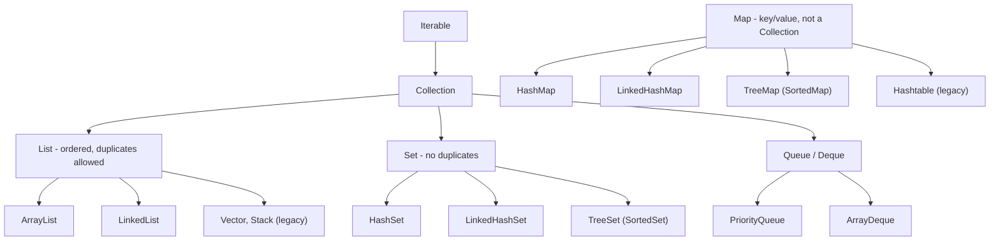

### The main interfaces
- **List** — ordered sequence, index-based access, **duplicates allowed**.
- **Set** — **no duplicates** (uses `equals`/`hashCode`, or `compareTo` for TreeSet).
- **Queue / Deque** — elements processed in order (FIFO, priority, or both ends).
- **Map** — **key → value** pairs, keys unique. Not a subtype of `Collection`.

### Implementations at a glance

| Class | Backed by | Order | Null | get / add / contains |
|---|---|---|---|---|
| `ArrayList` | Resizable array | Insertion | Yes | get O(1), add amortized O(1), insert/remove in middle O(n) |
| `LinkedList` | Doubly linked list | Insertion | Yes | get O(n), add/remove at ends O(1) |
| `HashSet` | HashMap | **None** | One null | O(1) average |
| `LinkedHashSet` | Hash table + linked list | **Insertion** | One null | O(1) |
| `TreeSet` | Red-black tree | **Sorted** | No | O(log n) |
| `HashMap` | Hash table | None | One null key | O(1) average |
| `LinkedHashMap` | Hash table + linked list | Insertion (or access — LRU caches) | Yes | O(1) |
| `TreeMap` | Red-black tree | **Sorted by key** | No null key | O(log n) |
| `PriorityQueue` | Binary heap | Smallest first | No | offer/poll O(log n), peek O(1) |
| `ArrayDeque` | Circular array | Both ends | No | O(1) at ends — use for stacks and queues |

```java
import java.util.*;

public class CollectionsTour {
    public static void main(String[] args) {
        List<String> list = new ArrayList<>(List.of("banana", "apple", "cherry", "apple"));
        list.add(1, "kiwi");
        System.out.println("List: " + list + " get(2)=" + list.get(2));

        System.out.println("HashSet: " + new HashSet<>(list).size() + " unique");
        System.out.println("LinkedHashSet: " + new LinkedHashSet<>(list));
        System.out.println("TreeSet: " + new TreeSet<>(list));

        Map<String, Integer> counts = new TreeMap<>();
        for (String w : list) counts.put(w, counts.getOrDefault(w, 0) + 1);
        System.out.println("TreeMap counts: " + counts);

        Deque<Integer> stack = new ArrayDeque<>();
        stack.push(1); stack.push(2); stack.push(3);
        System.out.println("stack pop: " + stack.pop());

        Queue<Integer> queue = new ArrayDeque<>(List.of(1, 2, 3));
        System.out.println("queue poll: " + queue.poll());

        PriorityQueue<Integer> pq = new PriorityQueue<>(List.of(5, 1, 4, 2));
        StringBuilder sb = new StringBuilder();
        while (!pq.isEmpty()) sb.append(pq.poll()).append(' ');
        System.out.println("PriorityQueue order: " + sb.toString().trim());

        Collections.sort(list);
        Collections.reverse(list);
        System.out.println("sorted desc: " + list + " max=" + Collections.max(list));
    }
}
```

```text
List: [banana, kiwi, apple, cherry, apple] get(2)=apple
HashSet: 4 unique
LinkedHashSet: [banana, kiwi, apple, cherry]
TreeSet: [apple, banana, cherry, kiwi]
TreeMap counts: {apple=2, banana=1, cherry=1, kiwi=1}
stack pop: 3
queue poll: 1
PriorityQueue order: 1 2 4 5
sorted desc: [kiwi, cherry, banana, apple, apple] max=kiwi
```

### ArrayList vs LinkedList

| ArrayList | LinkedList |
|---|---|
| Dynamic array; grows by ~50% when full | Doubly linked nodes |
| **Fast random access** `get(i)` O(1) | `get(i)` O(n) — walks the list |
| Insert/delete in the middle shifts elements O(n) | Insert/delete O(1) **once at the position** |
| Less memory per element; cache friendly | Extra memory for prev/next pointers |
| Default choice for lists | Also implements `Deque` |

In practice `ArrayList` is almost always faster, even for many insertions, because of CPU caches.

### Iterating and fail-fast iterators
```java
import java.util.*;

public class IteratorDemo {
    public static void main(String[] args) {
        List<Integer> nums = new ArrayList<>(List.of(1, 2, 3, 4, 5, 6));
        Iterator<Integer> it = nums.iterator();
        while (it.hasNext()) if (it.next() % 2 == 0) it.remove();   // safe removal
        System.out.println(nums);

        nums.removeIf(n -> n > 3);                                  // Java 8 way
        System.out.println(nums);

        List<Integer> more = new ArrayList<>(List.of(1, 2, 3));
        try {
            for (Integer n : more) if (n == 1) more.remove(n);      // modifies during for-each
        } catch (ConcurrentModificationException e) {
            System.out.println("ConcurrentModificationException");
        }
    }
}
```

```text
[1, 3, 5]
[1, 3]
ConcurrentModificationException
```

The iterators of `ArrayList`, `HashMap` etc. are **fail-fast**: if the collection is structurally modified during iteration (except through the iterator itself) they throw **ConcurrentModificationException**. Concurrent collections (`CopyOnWriteArrayList`, `ConcurrentHashMap`) have **fail-safe/weakly consistent** iterators that work on a snapshot or tolerate changes.

### Legacy and synchronized collections
- `Vector` (synchronized ArrayList), `Stack` (extends Vector), `Hashtable` (synchronized map; **no null keys or values**) — older, slower; avoid in new code.
- `Collections.synchronizedList(...)` wraps any list; for concurrency prefer `java.util.concurrent` classes.
- `List.of(...)`, `Set.of`, `Map.of` (Java 9) create **immutable** collections; `Collections.unmodifiableList` gives a read-only view.

**Key points:**
- List (ordered, duplicates), Set (unique), Queue/Deque, Map (key→value, not a Collection).
- ArrayList for random access; LinkedList only for frequent end insertions; ArrayDeque for stacks/queues.
- HashSet/HashMap unordered O(1); Linked* keep insertion order; Tree* keep sorted order O(log n).
- Iterators are fail-fast; remove via `iterator.remove()` or `removeIf`.

=== HashMap Internals: Hashing, Buckets, Collisions and ConcurrentHashMap
difficulty: hard
---
### How HashMap stores entries
A `HashMap` is an **array of buckets** (`Node<K,V>[] table`). Each node stores `hash, key, value, next`.

`put(key, value)`:
1. Compute `key.hashCode()`, then spread it: `hash = h ^ (h >>> 16)` (mixes high bits into low bits).
2. Bucket index = `hash & (capacity − 1)` — capacity is always a **power of two**, so this equals `hash % capacity`.
3. If the bucket is empty, store the node. Otherwise walk the bucket: if a node has an equal hash **and `equals()` key**, **replace the value**; else append a new node (**collision**).
4. If size exceeds **capacity × load factor**, **resize** (double the table) and redistribute entries.

`get(key)` repeats steps 1–2 and searches only that bucket using `equals()`.

```calc
Default capacity 16, load factor 0.75 -> threshold 12
13th entry -> resize to 32 buckets (threshold 24), entries rehashed

Bucket i:  [k1,v1] -> [k2,v2] -> [k3,v3]     (collisions chained)
Java 8+: when one bucket holds more than 8 entries (and capacity >= 64)
         the chain becomes a red-black tree -> worst case O(log n) instead of O(n)
```

| Operation | Average | Worst (Java 8+) |
|---|---|---|
| get / put / remove | O(1) | O(log n) (tree bucket) |

### Why equals and hashCode matter
- `hashCode` picks the **bucket**; `equals` finds the **entry** inside it.
- If equal keys have different hash codes, `get` looks in the wrong bucket → returns null.
- **Mutable keys are dangerous**: if a key's fields (used in hashCode) change after insertion, the entry is "lost" in its old bucket. Use immutable keys — `String`, `Integer`, records.

```java
import java.util.*;

public class MutableKey {
    static class Key {
        int id;
        Key(int id) { this.id = id; }
        @Override public boolean equals(Object o) { return o instanceof Key && ((Key) o).id == id; }
        @Override public int hashCode() { return Integer.hashCode(id); }
    }
    public static void main(String[] args) {
        Map<Key, String> map = new HashMap<>();
        Key k = new Key(1);
        map.put(k, "one");
        System.out.println(map.get(new Key(1)));     // found
        k.id = 2;                                     // mutate the key after insertion
        System.out.println(map.get(new Key(1)));     // wrong bucket contents now
        System.out.println(map.get(new Key(2)));     // looks in a different bucket
        System.out.println("size still " + map.size());

        Map<String, Integer> m = new HashMap<>();
        m.put(null, 0);                               // one null key allowed
        m.put("a", 1);
        m.merge("a", 10, Integer::sum);               // a -> 11
        m.computeIfAbsent("b", key -> 2);
        m.putIfAbsent("a", 99);                       // ignored, key exists
        System.out.println(m.get(null) + " " + m.get("a") + " " + m.get("b"));
    }
}
```

```text
one
null
null
size still 1
0 11 2
```

### HashMap vs Hashtable vs ConcurrentHashMap

| | HashMap | Hashtable | ConcurrentHashMap |
|---|---|---|---|
| Thread-safe | **No** | Yes — every method synchronized (one lock) | Yes — fine-grained (per-bucket CAS/locks) |
| Null keys/values | One null key, null values | **None** | **None** |
| Performance | Fastest (single thread) | Slow under contention | High concurrency |
| Iterator | Fail-fast | Enumerator (legacy) | Weakly consistent (no CME) |
| Status | Default choice | Legacy | Use for shared maps |

`ConcurrentHashMap` (Java 8) locks only the bucket being written (using CAS for empty buckets), so readers never block and many writers proceed in parallel. Methods like `computeIfAbsent`, `merge` are **atomic**.

### Related classes
- **LinkedHashMap** — keeps a doubly linked list through entries for **insertion order**; constructed with `accessOrder = true` and overriding `removeEldestEntry` it becomes an **LRU cache**.
- **TreeMap** — red-black tree; keys sorted; `firstKey`, `floorKey`, `headMap` and other navigation methods.
- **HashSet** — internally a HashMap whose values are a dummy constant.
- **WeakHashMap** — keys held by weak references; entries vanish when keys are no longer used elsewhere.

**Key points:**
- Index = spread(hashCode) & (capacity − 1); collisions chained, treeified above 8 entries.
- Default capacity 16, load factor 0.75; resize doubles the table.
- hashCode finds the bucket, equals finds the key — keep keys immutable.
- HashMap (not thread-safe, null allowed) vs Hashtable (legacy, synchronized) vs ConcurrentHashMap (scalable).

=== Generics, Comparable and Comparator
difficulty: medium
---
### Generics
**Generics** (Java 5) let classes, interfaces and methods be **parameterized by type**: `List<String>` instead of a raw `List` of `Object`.
- **Compile-time type safety** — inserting the wrong type is a compile error, not a run-time `ClassCastException`.
- **No casts** when reading elements.
- **Reusable** algorithms that work for many types.

```java
import java.util.*;

public class Generics {
    static class Box<T> {                         // generic class
        private final T value;
        Box(T value) { this.value = value; }
        T get() { return value; }
    }
    static <T extends Comparable<T>> T maxOf(List<T> items) {   // bounded generic method
        T best = items.get(0);
        for (T t : items) if (t.compareTo(best) > 0) best = t;
        return best;
    }
    static double sum(List<? extends Number> nums) {             // upper-bounded wildcard
        double s = 0;
        for (Number n : nums) s += n.doubleValue();
        return s;
    }
    public static void main(String[] args) {
        Box<String> b = new Box<>("hello");       // diamond operator infers <String>
        String s = b.get();                       // no cast
        System.out.println(s + " " + new Box<>(42).get());
        System.out.println(maxOf(List.of(3, 9, 4)) + " " + maxOf(List.of("pear", "apple")));
        System.out.println(sum(List.of(1, 2, 3)) + " " + sum(List.of(1.5, 2.5)));
    }
}
```

```text
hello 42
9 pear
6.0 4.0
```

Key ideas:
- **Type parameters**: `T`, `E` (element), `K`, `V` (key, value).
- **Bounded types**: `<T extends Number>` — T must be Number or a subclass.
- **Wildcards** — `List<?>` (any type), `List<? extends Number>` (read Numbers — a **producer**), `List<? super Integer>` (write Integers — a **consumer**). Mnemonic **PECS**: Producer Extends, Consumer Super.
- `List<Integer>` is **not** a subtype of `List<Number>` (generics are invariant), although `Integer[]` is a subtype of `Number[]`.
- **Type erasure** — generic types exist only at compile time; at run time `List<String>` and `List<Integer>` are both just `List`. Consequences: no `new T()`, no `instanceof List<String>`, no primitive type arguments (`List<int>` is illegal — use `Integer`).

### Comparable vs Comparator
Sorting needs an ordering:
- **`Comparable<T>`** — the class defines its **natural ordering** by implementing `compareTo(T other)` (String, Integer, Date implement it). One ordering, inside the class.
- **`Comparator<T>`** — a **separate** object with `compare(a, b)`; define **any number** of orderings without changing the class.

Both return a **negative** number (a before b), **zero** (equal), or a **positive** number (a after b).

```java
import java.util.*;

public class Sorting {
    static class Student implements Comparable<Student> {
        final String name; final int marks;
        Student(String n, int m) { name = n; marks = m; }
        @Override public int compareTo(Student o) { return name.compareTo(o.name); }   // natural: by name
        @Override public String toString() { return name + ":" + marks; }
    }
    public static void main(String[] args) {
        List<Student> list = new ArrayList<>(List.of(
            new Student("Ravi", 82), new Student("Asha", 91), new Student("Meera", 82)));

        Collections.sort(list);                                      // Comparable
        System.out.println("by name:  " + list);

        list.sort(Comparator.comparingInt((Student s) -> s.marks).reversed()
                            .thenComparing(s -> s.name));            // Comparator chain
        System.out.println("by marks: " + list);

        list.sort((a, b) -> Integer.compare(a.marks, b.marks));      // lambda comparator
        System.out.println("asc:      " + list);
    }
}
```

```text
by name:  [Asha:91, Meera:82, Ravi:82]
by marks: [Asha:91, Meera:82, Ravi:82]
asc:      [Meera:82, Ravi:82, Asha:91]
```

| Comparable | Comparator |
|---|---|
| `java.lang`; method `compareTo(T o)` | `java.util`; method `compare(T a, T b)` |
| Implemented **by the class itself** | Separate class / lambda |
| One natural ordering | Many orderings |
| `Collections.sort(list)` | `list.sort(comparator)` |

Tip: avoid `return a.marks - b.marks;` for large values — subtraction can overflow; use `Integer.compare`.

**Key points:**
- Generics give compile-time type safety and remove casts; implemented by type erasure.
- Bounded types and wildcards: `? extends T` to read, `? super T` to write (PECS).
- Comparable = natural order inside the class (`compareTo`); Comparator = external, many orders (`compare`).
- `Comparator.comparing(...).reversed().thenComparing(...)` builds multi-key sorts.

=== Java 8 Features: Lambdas, Functional Interfaces, Streams and Optional
difficulty: hard
---
Java 8 (2014) added functional-style programming.

### Lambda expressions
A **lambda** is an anonymous function: `(parameters) -> expression` or `(parameters) -> { statements; }`. It implements a **functional interface** (exactly one abstract method).

### Built-in functional interfaces (`java.util.function`)
| Interface | Method | Example |
|---|---|---|
| `Predicate<T>` | `boolean test(T)` | `s -> s.isEmpty()` |
| `Function<T,R>` | `R apply(T)` | `s -> s.length()` |
| `Consumer<T>` | `void accept(T)` | `s -> System.out.println(s)` |
| `Supplier<T>` | `T get()` | `() -> new ArrayList<>()` |
| `BiFunction<T,U,R>` | `R apply(T,U)` | `(a, b) -> a + b` |
| `UnaryOperator<T>`, `BinaryOperator<T>` | specializations | `x -> x * 2` |

**Method references** are shorthand lambdas: `String::length` (instance method), `Integer::parseInt` (static), `System.out::println` (method of a particular object), `ArrayList::new` (constructor).

### Stream API
A **stream** is a sequence of elements supporting **declarative pipeline** operations on a collection — *what* to compute rather than *how*.

```calc
source  ->  intermediate operations (lazy)  ->  terminal operation (triggers work)
list.stream() .filter(...) .map(...) .sorted()   .collect(...) / forEach / count / reduce
```

- **Intermediate** (return a stream, **lazy**): `filter`, `map`, `flatMap`, `sorted`, `distinct`, `limit`, `skip`, `peek`.
- **Terminal** (produce a result, run the pipeline): `collect`, `forEach`, `count`, `reduce`, `min`, `max`, `anyMatch`, `allMatch`, `findFirst`.
- Streams **don't modify the source** and **can be consumed only once**. `parallelStream()` splits work across cores.

```java
import java.util.*;
import java.util.stream.*;

public class StreamsDemo {
    static class Emp {
        final String name, dept; final int salary;
        Emp(String n, String d, int s) { name = n; dept = d; salary = s; }
    }
    public static void main(String[] args) {
        List<Emp> emps = List.of(
            new Emp("Asha", "IT", 90000), new Emp("Ravi", "IT", 70000),
            new Emp("Meera", "HR", 60000), new Emp("Karan", "Sales", 65000),
            new Emp("Neha", "HR", 72000));

        List<String> highPaid = emps.stream()
            .filter(e -> e.salary > 65000)
            .map(e -> e.name)
            .sorted()
            .collect(Collectors.toList());
        System.out.println("high paid: " + highPaid);

        int total = emps.stream().mapToInt(e -> e.salary).sum();
        OptionalDouble avg = emps.stream().mapToInt(e -> e.salary).average();
        System.out.printf("total=%d avg=%.1f%n", total, avg.getAsDouble());

        Map<String, Long> perDept = emps.stream()
            .collect(Collectors.groupingBy(e -> e.dept, TreeMap::new, Collectors.counting()));
        System.out.println("per dept: " + perDept);

        Optional<Emp> top = emps.stream().max(Comparator.comparingInt(e -> e.salary));
        System.out.println("top: " + top.map(e -> e.name).orElse("none"));

        String joined = emps.stream().map(e -> e.name.toUpperCase()).collect(Collectors.joining(", "));
        System.out.println(joined);

        int sumSquares = IntStream.rangeClosed(1, 5).map(x -> x * x).reduce(0, Integer::sum);
        System.out.println("sum of squares 1..5 = " + sumSquares);

        List<List<Integer>> nested = List.of(List.of(1, 2), List.of(3), List.of(4, 5));
        System.out.println(nested.stream().flatMap(List::stream).collect(Collectors.toList()));
    }
}
```

```text
high paid: [Asha, Neha, Ravi]
total=357000 avg=71400.0
per dept: {HR=2, IT=2, Sales=1}
top: Asha
ASHA, RAVI, MEERA, KARAN, NEHA
sum of squares 1..5 = 55
[1, 2, 3, 4, 5]
```

`map` transforms each element one-to-one; `flatMap` maps each element to a stream and **flattens** the results into one stream.

### Optional
`Optional<T>` is a container that **may or may not hold a value** — an explicit alternative to returning `null`, which reduces `NullPointerException`s.

```java
import java.util.*;

public class OptionalDemo {
    static Optional<String> findEmail(String user) {
        return "asha".equals(user) ? Optional.of("asha@mail.com") : Optional.empty();
    }
    public static void main(String[] args) {
        System.out.println(findEmail("asha").orElse("no email"));
        System.out.println(findEmail("ravi").orElse("no email"));
        System.out.println(findEmail("asha").map(String::length).orElse(0));
        findEmail("asha").ifPresent(e -> System.out.println("send to " + e));
        System.out.println(Optional.ofNullable(null).isPresent());
    }
}
```

```text
asha@mail.com
no email
13
send to asha@mail.com
false
```

### Other Java 8 additions
- **Default and static methods** in interfaces.
- **New Date/Time API** (`java.time`: `LocalDate`, `LocalDateTime`, `Duration`) — immutable and thread-safe, replacing `Date`/`Calendar`.
- `forEach`, `removeIf`, `computeIfAbsent`, `merge` on collections; `CompletableFuture`; Metaspace replaces PermGen.

Later versions worth naming: `var` (10), `List.of` (9), switch expressions and text blocks (14/15), **records** (16), sealed classes (17), pattern matching for `instanceof` (16), virtual threads (21).

**Key points:**
- Lambda = implementation of a functional interface; method references shorten lambdas.
- Streams: source → lazy intermediate ops → terminal op; don't modify the source; single use.
- map vs flatMap; collect with `Collectors.toList`, `groupingBy`, `joining`.
- Optional makes "no result" explicit — prefer `orElse`, `map`, `ifPresent` over `get()`.

=== Multithreading: Thread Lifecycle, Thread vs Runnable, start vs run
difficulty: medium
---
A **thread** is a lightweight unit of execution within a process; threads of one program **share the heap** but each has its **own stack**. **Multithreading** lets a program do several tasks concurrently — keep a GUI responsive, serve many clients, use multiple cores. The book's examples: a web browser downloading while scrolling, simultaneous operations on a bank account. The JVM itself runs several threads (the main thread, the **garbage collector — a low-priority daemon thread**, and others).

| Multitasking type | Unit | Address space | Switching cost |
|---|---|---|---|
| Process-based | Program | Separate | Heavy |
| Thread-based (multithreading) | Thread | Shared | Light |

### Creating threads — two ways
1. **Extend `Thread`** and override `run()`.
2. **Implement `Runnable`** (or pass a lambda) and give it to a `Thread` — **preferred**: the class can still extend another class, and the task is separated from the thread mechanism.

The book's three-thread example: three threads each print five lines; their output **interleaves differently on every run**.

```java
// nondeterministic: interleaving changes from run to run
public class ThreadTest {
    static class A extends Thread {
        public void run() {
            for (int i = 1; i <= 3; i++) System.out.println("From Thread A: i = " + i);
            System.out.println("Exit from A");
        }
    }
    public static void main(String[] args) throws InterruptedException {
        Thread a = new A();                                  // way 1: subclass Thread
        Runnable taskB = () -> {                             // way 2: Runnable (lambda)
            for (int j = 1; j <= 3; j++) System.out.println("From Thread B: j = " + j);
            System.out.println("Exit from B");
        };
        Thread b = new Thread(taskB, "worker-B");
        a.start();
        b.start();
        a.join();                                            // wait for both to finish
        b.join();
        System.out.println("main done");
    }
}
```

```text
From Thread A: i = 1
From Thread B: j = 1
From Thread A: i = 2
From Thread A: i = 3
Exit from A
From Thread B: j = 2
From Thread B: j = 3
Exit from B
main done
```

(One possible run — the A and B lines can appear in any interleaving, but "main done" is always last because of `join()`.)

### start() vs run()
- **`start()`** creates a **new thread** and the JVM calls `run()` **in that thread**.
- Calling **`run()` directly** just executes the method **in the current thread** — no concurrency.
- Calling `start()` twice on the same Thread throws **IllegalThreadStateException**.

```java
public class StartVsRun {
    public static void main(String[] args) throws InterruptedException {
        Runnable r = () -> System.out.println("running in " + Thread.currentThread().getName());
        Thread t = new Thread(r, "T1");
        t.run();      // plain method call on the main thread
        t.start();    // new thread named T1
        t.join();
    }
}
```

```text
running in main
running in T1
```

### Thread lifecycle (states)

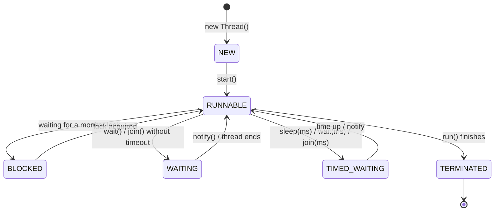

`Thread.State` has six values: **NEW, RUNNABLE** (ready or running — the OS decides), **BLOCKED, WAITING, TIMED_WAITING, TERMINATED**.

### Useful Thread methods
| Method | Purpose |
|---|---|
| `start()` | Begin execution in a new thread |
| `sleep(ms)` (static) | Pause the current thread; **keeps locks** |
| `join()` | Wait for another thread to die |
| `yield()` (static) | Hint to let other threads run |
| `setPriority(1..10)` | `MIN_PRIORITY` 1, `NORM_PRIORITY` 5, `MAX_PRIORITY` 10 — only a hint to the scheduler |
| `setDaemon(true)` | Daemon threads don't keep the JVM alive (e.g. GC); set before `start()` |
| `interrupt()` | Ask a thread to stop; a sleeping/waiting thread gets `InterruptedException` |
| `getName()`, `currentThread()` | Identify threads |

The old `stop()`, `suspend()` and `resume()` are **deprecated** (unsafe — they can leave objects inconsistent or locks held); use interrupts or flags instead.

**Key points:**
- Create threads by extending Thread or (preferred) implementing Runnable/lambda.
- start() runs run() in a new thread; calling run() directly doesn't.
- States: NEW, RUNNABLE, BLOCKED, WAITING, TIMED_WAITING, TERMINATED.
- Priorities are hints; daemon threads don't keep the JVM running; join() waits for completion.

=== Thread Synchronization: synchronized, wait/notify, volatile and Deadlock
difficulty: hard
---
When threads share mutable data, unsynchronized access causes **race conditions** — the book's example is simultaneous deposit, withdraw and enquiry on one bank account. `count++` is three steps (read, add, write), so two threads can lose updates.

```java
// nondeterministic: lost updates vary by run
public class RaceCondition {
    static int unsafe = 0;
    static int safe = 0;
    static synchronized void incSafe() { safe++; }

    public static void main(String[] args) throws InterruptedException {
        Runnable task = () -> {
            for (int i = 0; i < 100_000; i++) { unsafe++; incSafe(); }
        };
        Thread t1 = new Thread(task), t2 = new Thread(task);
        t1.start(); t2.start();
        t1.join(); t2.join();
        System.out.println("synchronized count = " + safe);
        System.out.println("unsynchronized count is 200000? " + (unsafe == 200_000));
    }
}
```

```text
synchronized count = 200000
unsynchronized count is 200000? false
```

(The unsynchronized counter usually loses updates; the exact number differs every run.)

### synchronized
Every object has an intrinsic **monitor lock**.
- **`synchronized` instance method** — locks `this`; only one thread at a time can run any synchronized instance method **on the same object**.
- **`static synchronized` method** — locks the `Class` object.
- **`synchronized (obj) { ... }` block** — locks a chosen object for just the critical section (finer-grained, better performance).

Synchronization guarantees **mutual exclusion** and **visibility** (changes made inside are seen by the next thread that takes the lock). Locks are **reentrant**: a thread holding a lock can enter other synchronized code on the same lock.

### Inter-thread communication: wait, notify, notifyAll
Methods of `Object`, called **only while holding the object's lock** (otherwise `IllegalMonitorStateException`):
- `wait()` — **releases the lock** and sleeps until notified;
- `notify()` — wakes one waiting thread; `notifyAll()` — wakes all.
Always call `wait()` in a **`while` loop** checking the condition (spurious wake-ups, other threads may have changed it).

```java
// nondeterministic: interleaving varies by run
import java.util.*;

public class ProducerConsumer {
    private final Queue<Integer> buffer = new LinkedList<>();
    private final int capacity = 2;

    public synchronized void produce(int item) throws InterruptedException {
        while (buffer.size() == capacity) wait();     // buffer full: release lock and wait
        buffer.add(item);
        System.out.println("produced " + item);
        notifyAll();
    }
    public synchronized int consume() throws InterruptedException {
        while (buffer.isEmpty()) wait();              // buffer empty
        int item = buffer.poll();
        System.out.println("consumed " + item);
        notifyAll();
        return item;
    }
    public static void main(String[] args) throws InterruptedException {
        ProducerConsumer pc = new ProducerConsumer();
        Thread producer = new Thread(() -> {
            try { for (int i = 1; i <= 4; i++) pc.produce(i); } catch (InterruptedException e) { }
        });
        Thread consumer = new Thread(() -> {
            try { int sum = 0; for (int i = 1; i <= 4; i++) sum += pc.consume(); System.out.println("sum " + sum); }
            catch (InterruptedException e) { }
        });
        producer.start(); consumer.start();
        producer.join(); consumer.join();
    }
}
```

```text
produced 1
produced 2
consumed 1
consumed 2
produced 3
produced 4
consumed 3
consumed 4
sum 10
```

(The interleaving of "produced" and "consumed" lines can vary, but never more than 2 items are buffered and the sum is always 10.)

### sleep() vs wait()

| `sleep(ms)` | `wait()` |
|---|---|
| Static method of `Thread` | Instance method of `Object` |
| **Keeps** the lock | **Releases** the lock |
| Can be called anywhere | Only inside synchronized code |
| Wakes after the time (or interrupt) | Wakes on notify/notifyAll (or timeout) |

### volatile
A `volatile` field is always read from and written to **main memory**, so all threads see the latest value (**visibility**), and reordering around it is restricted. It does **not** make compound actions atomic — `volatile int count; count++` is still a race. Typical use: a `volatile boolean running` stop flag.

### Deadlock
Two threads each hold one lock and wait for the other's:

```java
// fragment
// Thread 1                         // Thread 2
synchronized (accountA) {           synchronized (accountB) {
    synchronized (accountB) {           synchronized (accountA) {
        transfer();                         transfer();
    }                                   }
}                                   }
// T1 holds A, wants B; T2 holds B, wants A -> both wait forever
```

Avoid it by **acquiring locks in a fixed global order** (e.g. by account ID), holding locks briefly, using `tryLock` with a timeout (`ReentrantLock`), or using higher-level concurrency utilities. Other liveness problems: **starvation** and **livelock**.

**Key points:**
- Shared mutable data + threads = race conditions; `count++` is not atomic.
- synchronized methods/blocks give mutual exclusion and visibility; locks are reentrant.
- wait/notify need the lock; wait releases it, sleep doesn't; call wait in a while loop.
- volatile gives visibility, not atomicity; prevent deadlock with consistent lock ordering.

=== Concurrency Utilities: Executors, Callable, Future, Locks and Atomics
difficulty: hard
---
`java.util.concurrent` (Java 5) offers higher-level tools than raw threads and `synchronized`.

### Executor framework and thread pools
Creating a thread per task is expensive. An **ExecutorService** manages a **pool of reusable threads** and a task queue.

| Factory | Pool |
|---|---|
| `Executors.newFixedThreadPool(n)` | Fixed number of threads |
| `Executors.newCachedThreadPool()` | Grows as needed, reuses idle threads |
| `Executors.newSingleThreadExecutor()` | One thread, tasks run sequentially |
| `Executors.newScheduledThreadPool(n)` | Delayed / periodic tasks |

### Callable and Future
`Runnable.run()` returns nothing and can't throw checked exceptions; **`Callable<V>.call()`** **returns a value** and can throw. Submitting a Callable returns a **`Future<V>`** — `get()` waits for the result.

```java
import java.util.*;
import java.util.concurrent.*;
import java.util.concurrent.atomic.*;

public class ExecutorDemo {
    public static void main(String[] args) throws Exception {
        ExecutorService pool = Executors.newFixedThreadPool(3);
        List<Future<Long>> results = new ArrayList<>();
        for (int part = 0; part < 4; part++) {
            final int start = part * 250 + 1, end = start + 249;
            results.add(pool.submit(() -> {              // Callable<Long>
                long s = 0;
                for (int i = start; i <= end; i++) s += i;
                return s;
            }));
        }
        long total = 0;
        for (Future<Long> f : results) total += f.get();  // blocks until each is ready
        System.out.println("sum 1..1000 = " + total);

        AtomicInteger counter = new AtomicInteger();
        List<Callable<Void>> tasks = new ArrayList<>();
        for (int t = 0; t < 4; t++) tasks.add(() -> { for (int i = 0; i < 1000; i++) counter.incrementAndGet(); return null; });
        pool.invokeAll(tasks);                             // runs all, waits for all
        System.out.println("atomic counter = " + counter.get());

        ConcurrentHashMap<String, Integer> hits = new ConcurrentHashMap<>();
        List<Callable<Void>> words = new ArrayList<>();
        for (String w : List.of("a", "b", "a", "c", "a")) words.add(() -> { hits.merge(w, 1, Integer::sum); return null; });
        pool.invokeAll(words);
        System.out.println("hits = " + new TreeMap<>(hits));

        CompletableFuture<String> cf = CompletableFuture.supplyAsync(() -> "data", pool)
            .thenApply(String::toUpperCase);
        System.out.println(cf.get());

        pool.shutdown();                                  // stop accepting tasks
        System.out.println("terminated: " + pool.awaitTermination(5, TimeUnit.SECONDS));
    }
}
```

```text
sum 1..1000 = 500500
atomic counter = 4000
hits = {a=3, b=1, c=1}
DATA
terminated: true
```

Always **`shutdown()`** an executor — its threads are non-daemon and keep the JVM alive.

### Locks and other utilities
- **`ReentrantLock`** — explicit `lock()`/`unlock()` (in `finally`); adds `tryLock(timeout)`, fairness and multiple `Condition`s. **`ReadWriteLock`** lets many readers or one writer.
- **Atomic variables** (`AtomicInteger`, `AtomicLong`, `AtomicReference`) — lock-free thread-safe updates using CPU **compare-and-swap (CAS)**.
- **Synchronizers** — `CountDownLatch` (wait until N events happen), `CyclicBarrier` (threads wait for each other), `Semaphore` (limit concurrent access to N permits).
- **Concurrent collections** — `ConcurrentHashMap`, `CopyOnWriteArrayList`, `BlockingQueue` (`ArrayBlockingQueue`, `LinkedBlockingQueue` — `put` blocks when full, `take` when empty: producer–consumer without wait/notify).
- **ForkJoinPool** — divide-and-conquer work stealing; powers parallel streams.
- **Virtual threads** (Java 21) — very lightweight threads managed by the JVM, for millions of concurrent tasks.

| synchronized | ReentrantLock |
|---|---|
| Implicit lock, released automatically | Explicit `lock()`/`unlock()` — must unlock in finally |
| No timeout, can't be interrupted while waiting | `tryLock(timeout)`, `lockInterruptibly()` |
| One wait set (wait/notify) | Multiple `Condition` objects |
| Simpler | More flexible; optional fairness |

**Key points:**
- ExecutorService reuses a pool of threads; always shut it down.
- Callable returns a value; Future.get() waits for it; CompletableFuture chains async steps.
- Atomic classes use CAS; ReentrantLock adds tryLock, fairness and conditions.
- Use concurrent collections and BlockingQueue rather than hand-written wait/notify.

=== Java I/O: Byte Streams, Character Streams, Files and Scanner
difficulty: medium
---
A **stream** is a sequence of data flowing from a **source** to a **destination** — keyboard, file, network, memory. Java's `java.io` package provides two families:

| | Byte streams | Character streams |
|---|---|---|
| Unit | 8-bit **bytes** | 16-bit Unicode **chars** |
| Base classes | `InputStream`, `OutputStream` | `Reader`, `Writer` |
| Use for | Binary data — images, audio, serialized objects | Text |
| File classes | `FileInputStream`, `FileOutputStream` | `FileReader`, `FileWriter` |
| Buffered | `BufferedInputStream`, `BufferedOutputStream` | `BufferedReader`, `BufferedWriter` |
| Others | `DataInputStream/DataOutputStream`, `ObjectInputStream/ObjectOutputStream`, `ByteArrayInputStream`, `PipedInputStream`, `SequenceInputStream` | `PrintWriter`, `InputStreamReader` (bridge bytes→chars), `CharArrayReader`, `StringReader` |

Streams are **chained** (the decorator pattern): a low-level stream connected to a source is wrapped by filter streams that add buffering, data types or line reading — e.g. `new BufferedReader(new InputStreamReader(System.in))`.

**Standard streams**: `System.in` (InputStream, keyboard), `System.out` and `System.err` (PrintStream).

### Writing and reading a text file
```java
import java.io.*;
import java.nio.file.*;
import java.util.*;

public class FileIO {
    public static void main(String[] args) throws IOException {
        File f = new File("students.txt");

        try (PrintWriter out = new PrintWriter(new FileWriter(f))) {    // creates/overwrites
            out.println("Asha 91");
            out.println("Ravi 82");
            out.printf("%s %d%n", "Meera", 77);
        }
        try (FileWriter append = new FileWriter(f, true)) {            // true = append mode
            append.write("Karan 68\n");
        }

        int total = 0, count = 0;
        try (BufferedReader in = new BufferedReader(new FileReader(f))) {
            String line;
            while ((line = in.readLine()) != null) {                   // null at end of file
                String[] parts = line.split(" ");
                total += Integer.parseInt(parts[1]);
                count++;
            }
        }
        System.out.println(count + " students, average " + (double) total / count);

        try (Scanner sc = new Scanner(f)) {                            // Scanner tokenizes input
            sc.next();
            System.out.println("first mark via Scanner: " + sc.nextInt());
        }

        List<String> lines = Files.readAllLines(Paths.get("students.txt"));  // NIO shortcut
        System.out.println("last line: " + lines.get(lines.size() - 1));
        System.out.println("exists=" + f.exists() + " size=" + f.length() + " bytes");
        System.out.println("deleted=" + f.delete());
    }
}
```

```text
4 students, average 79.5
first mark via Scanner: 91
last line: Karan 68
exists=true size=37 bytes
deleted=true
```

### Copying a binary file with byte streams
```java
// fragment
try (InputStream in = new BufferedInputStream(new FileInputStream("photo.jpg"));
     OutputStream out = new BufferedOutputStream(new FileOutputStream("copy.jpg"))) {
    byte[] buf = new byte[8192];
    int n;
    while ((n = in.read(buf)) != -1)       // read returns -1 at end of stream
        out.write(buf, 0, n);
}
```

### Reading keyboard input
- **`Scanner`** (`new Scanner(System.in)`) — easiest; parses tokens with `nextInt()`, `nextDouble()`, `nextLine()`. Pitfall: after `nextInt()`, the newline remains, so a following `nextLine()` returns an empty string.
- **`BufferedReader(new InputStreamReader(System.in))`** — faster for large input; read lines and parse yourself.

### Important points
- **Buffering** reduces the number of slow system calls — always wrap file streams in buffered streams for performance.
- `FileWriter(file)` truncates; `FileWriter(file, true)` appends. A `FileNotFoundException` occurs when reading a missing file or writing into a missing directory.
- **Close** streams (try-with-resources) — otherwise buffered data may never be written and file handles leak. `flush()` forces buffered output out.
- **NIO / NIO.2** (`java.nio.file.Files`, `Paths`, channels and buffers) — modern API: `Files.readAllLines`, `Files.write`, `Files.copy`, non-blocking I/O for servers.
- I/O exceptions: `IOException` and subclasses `FileNotFoundException`, `EOFException`, `InvalidObjectException`, `NotSerializableException`.

**Key points:**
- Byte streams (InputStream/OutputStream) for binary; character streams (Reader/Writer) for text.
- Chain streams: low-level source + buffering + formatting (decorator pattern).
- `readLine()` returns null and `read()` returns −1 at end of stream.
- Use try-with-resources; buffered streams for speed; Scanner for parsing input.

=== Serialization: Serializable, transient and serialVersionUID
difficulty: medium
---
**Serialization** converts an object's state into a **byte stream** so it can be saved to a file, sent over a network (as RMI does) or cached; **deserialization** rebuilds the object from the bytes. Java's serialization classes give a portable binary format for whole object graphs.

- A class becomes serializable by implementing the **marker interface `java.io.Serializable`** (no methods).
- `ObjectOutputStream.writeObject(obj)` serializes; `ObjectInputStream.readObject()` deserializes (returns `Object` — cast it).
- The **whole object graph** is saved: all referenced objects must also be serializable, or `NotSerializableException` is thrown.
- **`transient`** fields are **skipped**; after deserialization they get default values (0, null). Use for passwords, caches, non-serializable resources.
- **`static`** fields are not serialized (they belong to the class, not the object).
- During deserialization **constructors of the serializable class are not called**.

```java
import java.io.*;

public class SerializeDemo {
    static class User implements Serializable {
        private static final long serialVersionUID = 1L;
        String name;
        int age;
        transient String password;             // not saved
        User(String n, int a, String p) { name = n; age = a; password = p; System.out.println("constructor called"); }
        public String toString() { return name + ", " + age + ", password=" + password; }
    }
    public static void main(String[] args) throws Exception {
        User u = new User("Asha", 21, "secret123");
        ByteArrayOutputStream bytes = new ByteArrayOutputStream();
        try (ObjectOutputStream out = new ObjectOutputStream(bytes)) {
            out.writeObject(u);
        }
        System.out.println("serialized " + (bytes.size() > 0 ? "OK" : "empty"));

        try (ObjectInputStream in = new ObjectInputStream(new ByteArrayInputStream(bytes.toByteArray()))) {
            User copy = (User) in.readObject();     // no constructor call
            System.out.println(copy);
            System.out.println("same object? " + (copy == u));
        }
    }
}
```

```text
constructor called
serialized OK
Asha, 21, password=null
same object? false
```

### serialVersionUID
A version number stored in the stream. On deserialization the JVM compares it with the class's current value; if they differ → **`InvalidClassException`**. If you don't declare it, the JVM computes one from the class structure, so **any change** to the class (adding a field) breaks old serialized data. **Declare it explicitly** (`private static final long serialVersionUID = 1L;`) and change it only for incompatible changes.

### Customizing serialization
- Private `writeObject(ObjectOutputStream)` / `readObject(ObjectInputStream)` methods to add custom logic (e.g. encrypt a field).
- **`Externalizable`** — implement `writeExternal`/`readExternal` for full control (requires a public no-arg constructor).
- If a superclass isn't serializable, its fields are initialized by its **no-arg constructor** during deserialization.

Security note: deserializing untrusted data is dangerous (it can trigger code in classes on the classpath); modern systems prefer **JSON** (Jackson, Gson) or Protocol Buffers for data exchange.

**Key points:**
- Serialization = object → bytes (ObjectOutputStream); deserialization = bytes → object (ObjectInputStream).
- Implement the marker interface Serializable; referenced objects must be serializable too.
- transient and static fields aren't serialized; constructors aren't run on deserialization.
- Declare serialVersionUID to control compatibility.

=== Memory Management and Garbage Collection
difficulty: hard
---
Java manages memory **automatically**: objects are allocated with `new` on the **heap**, and the **garbage collector (GC)** reclaims objects that are no longer **reachable**. There is no `delete`/`free`, which eliminates dangling pointers and double frees (memory leaks are still possible).

### When is an object eligible for GC?
When it **cannot be reached** from any **GC root** (local variables on thread stacks, static fields, active threads, JNI references):
- the reference is set to `null`;
- the reference is reassigned to another object;
- the object was created inside a method that has returned;
- **islands of isolation** — objects that reference each other but are unreachable from roots (Java's tracing GC collects them; simple reference counting couldn't).

```java
// fragment
Student a = new Student("A");
a = null;                         // "A" eligible
Student b = new Student("B");
b = new Student("C");             // "B" eligible
Node x = new Node(), y = new Node();
x.next = y; y.next = x;           // cycle
x = null; y = null;               // both eligible - island of isolation
```

`System.gc()` only **requests** a collection; the JVM may ignore it.

### Generational heap
Most objects die young ("weak generational hypothesis"), so the heap is split:

```calc
+------------------------- Heap -------------------------+
| Young generation              | Old (tenured) gen.     |
|  Eden | Survivor S0 | S1      |  long-lived objects    |
+--------------------------------------------------------+
Metaspace (native memory): class metadata (PermGen before Java 8)

new objects -> Eden
Minor GC: live objects in Eden -> Survivor; survivors age, copied S0 <-> S1
objects surviving several minor GCs -> promoted to Old generation
Major / Full GC: cleans the Old generation (slower, longer pauses)
```

### How collectors work
- **Mark** — trace from GC roots and mark reachable objects.
- **Sweep** — free unmarked objects; **compact** — move live objects together to avoid fragmentation. Young-generation collection **copies** live objects between survivor spaces.
- **Stop-the-world pauses** — application threads pause during some phases.

| Collector | Notes |
|---|---|
| Serial | Single thread; small apps |
| Parallel (throughput) | Many threads; maximizes throughput |
| **G1** | **Default since Java 9**; region-based, predictable pause targets |
| ZGC / Shenandoah | Very low pause times on huge heaps |

### Reference types (`java.lang.ref`)
- **Strong** — normal references; never collected while reachable.
- **Soft** — collected only when memory is low (caches).
- **Weak** — collected at the next GC (`WeakHashMap`, listeners).
- **Phantom** — for post-mortem cleanup (with a reference queue).

### Memory leaks in Java
Objects that are still **referenced but no longer needed** can't be collected:
- ever-growing static collections or caches;
- listeners/callbacks registered and never removed;
- inner class instances holding references to outer objects;
- unclosed resources (streams, connections) and `ThreadLocal`s in thread pools.
Diagnose with heap dumps and profilers (VisualVM, JFR); tune with `-Xms` (initial heap), `-Xmx` (max heap), `-Xss` (thread stack size).

### finalize()
`Object.finalize()` may be called by the GC before reclaiming an object, but there's **no guarantee when or whether** it runs; it slows GC and is **deprecated**. Release resources with **try-with-resources** / explicit `close()` (or `Cleaner`) instead.

**Key points:**
- GC reclaims objects unreachable from GC roots, including cycles (islands of isolation).
- Heap: young (Eden + survivors, minor GC) and old generation (major GC); Metaspace holds class data.
- G1 is the default collector; System.gc() is only a request.
- Leaks happen through lingering references; finalize is deprecated.

=== Applets: Life Cycle and Applet vs Application
difficulty: easy
---
An **applet** is a small Java program that is **embedded in a web page** and runs inside a Java-enabled browser (or the `appletviewer` tool). Applets made Java famous in the 1990s; the book covers them in detail.

> **Status today:** browsers removed the Java plug-in years ago; the Applet API was **deprecated in Java 9** and removed in later releases. Interviewers still ask about the life cycle as a classic concept, but new GUIs use Swing/JavaFX desktop apps or web front ends.

### Applet life cycle
`java.applet.Applet` provides four life-cycle methods, and `java.awt.Component` provides `paint()`:

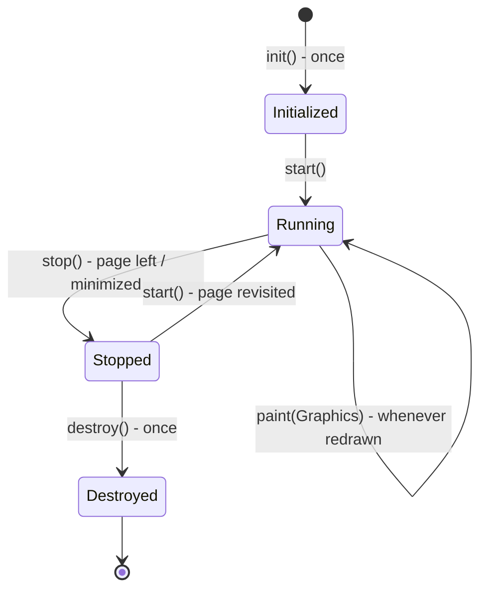

| Method | Called | Use |
|---|---|---|
| `init()` | **Once**, when the applet is loaded | Initialize variables, build the UI |
| `start()` | After `init()` and **each time** the page is revisited | Start animations/threads |
| `paint(Graphics g)` | Whenever the applet must be (re)drawn | Draw text and shapes |
| `stop()` | When the user leaves the page or minimizes | Suspend activity |
| `destroy()` | **Once**, when the browser closes the applet | Release resources |

```java
// compile-only: applets need a browser or appletviewer to run
import java.applet.Applet;
import java.awt.*;

public class HelloApplet extends Applet {
    private String status = "";
    public void init()    { status += "init "; setBackground(Color.WHITE); }
    public void start()   { status += "start "; }
    public void stop()    { status += "stop "; }
    public void destroy() { status += "destroy "; }
    public void paint(Graphics g) {
        g.setColor(Color.BLUE);
        g.drawString("Hello from an applet!", 20, 30);
        g.drawRect(10, 40, 120, 60);
        g.fillOval(150, 40, 60, 60);
        g.drawString("Life cycle so far: " + status, 20, 130);
    }
}
```

Embedding it in HTML (the old way):

```calc
<applet code="HelloApplet.class" width="300" height="150">
    <param name="message" value="Hi">     <- read with getParameter("message")
</applet>

Run without a browser:  appletviewer page.html
```

### Applet vs application

| Applet | Standalone application |
|---|---|
| Runs inside a browser / appletviewer | Runs from the command line with `java` |
| **No `main()`**; life-cycle methods called by the browser | Starts at `main()` |
| Extends `Applet` (or `JApplet`) | Any class |
| Runs in a **sandbox**: can't read/write local files, connect to other hosts, or run programs (unless signed) | Full access permitted by the OS |
| Downloaded from the server; executes on the client — less response time | Installed locally |

Advantages listed in the book: runs on the client side (fast response), secure, cross-platform. Disadvantage: needs a plug-in in the browser.

**Key points:**
- Life cycle: init (once) → start → paint (repeatedly) → stop → destroy (once).
- Applets have no main(); the browser drives them; they run in a security sandbox.
- `paint(Graphics g)` comes from Component; `repaint()` requests a redraw.
- Deprecated since Java 9 — know the concept, not for new code.

=== AWT: Components, Containers and Layout Managers
difficulty: medium
---
The **Abstract Window Toolkit (AWT)**, package `java.awt`, is Java's original GUI library. AWT components are **heavyweight** — each is drawn by the native OS widget (a "peer"), so the look matches the platform.

### Class hierarchy

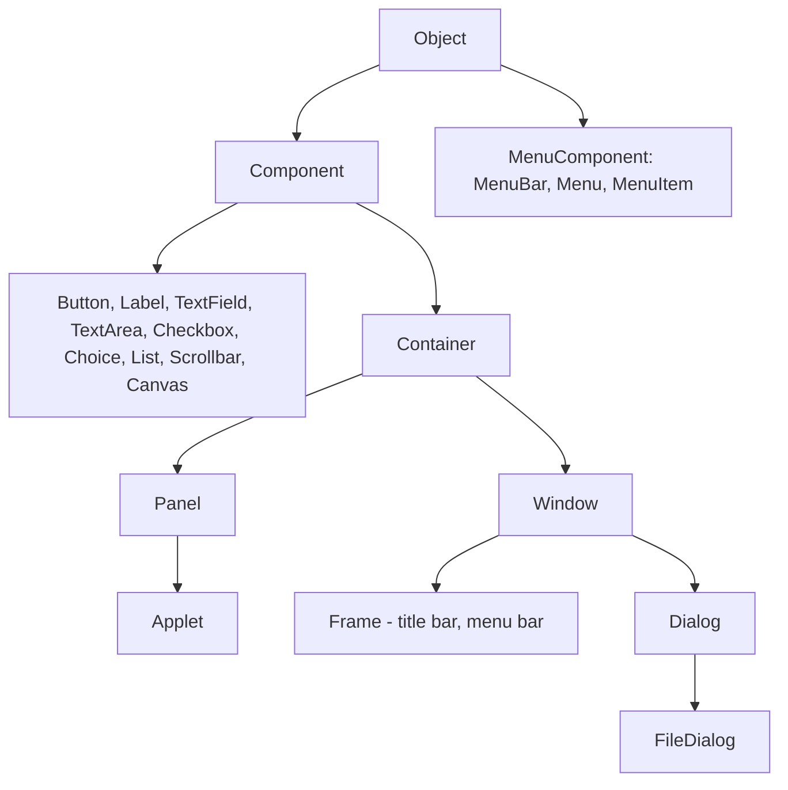

- **Component** — anything shown on screen (has size, position, colours, fonts, and handles events).
- **Container** — a component that **holds other components** (`add(...)`), arranged by a **layout manager**.
  - **Panel** — a plain container with no border or title (Applet is a Panel).
  - **Window** — top-level window without border or menu; **Frame** — window with title bar, border and optional menu bar; **Dialog** — a pop-up window (modal or not).

### Common components
| Component | Purpose |
|---|---|
| `Label` | Read-only text |
| `Button` | Push button that fires an `ActionEvent` |
| `TextField` / `TextArea` | Single-line / multi-line text input |
| `Checkbox` | On/off state; in a `CheckboxGroup` it behaves as a radio button |
| `Choice` | Drop-down list (one selection) |
| `List` | Scrolling list, single or multiple selection |
| `Scrollbar`, `Canvas` | Scroll values; blank drawing area |
| `MenuBar`, `Menu`, `MenuItem` | Menus on a Frame |

### Layout managers
Position and size components automatically, so the GUI adapts to different screens and fonts. Set with `container.setLayout(...)`.

| Layout | Arrangement | Default for |
|---|---|---|
| **FlowLayout** | Left to right in rows, wrapping like text (centered by default) | `Panel`, `Applet` |
| **BorderLayout** | Five regions: **NORTH, SOUTH, EAST, WEST, CENTER** (centre gets the leftover space) | `Frame`, `Window`, `Dialog` |
| **GridLayout** | Grid of **equal-sized** cells, rows × columns | — |
| **CardLayout** | Stack of "cards", one visible at a time (wizards, tabs) | — |
| **GridBagLayout** | Flexible grid, components span cells with constraints | — |
| `null` layout | Absolute positions with `setBounds` (not portable) | — |

```java
// compile-only: needs a display to show the window
import java.awt.*;
import java.awt.event.*;

public class Calculator extends Frame {
    private final TextField display = new TextField("0");

    public Calculator() {
        super("AWT Calculator");
        setLayout(new BorderLayout());
        add(display, BorderLayout.NORTH);

        Panel keys = new Panel(new GridLayout(4, 4, 4, 4));      // 4x4 equal cells
        for (String k : "7 8 9 / 4 5 6 * 1 2 3 - 0 C = +".split(" ")) {
            Button b = new Button(k);
            b.addActionListener(e -> display.setText(display.getText() + e.getActionCommand()));
            keys.add(b);
        }
        add(keys, BorderLayout.CENTER);

        Panel bottom = new Panel(new FlowLayout(FlowLayout.RIGHT));
        bottom.add(new Label("Theme:"));
        Choice theme = new Choice();
        theme.add("Light"); theme.add("Dark");
        bottom.add(theme);
        add(bottom, BorderLayout.SOUTH);

        addWindowListener(new WindowAdapter() {                  // close button
            public void windowClosing(WindowEvent e) { dispose(); }
        });
        setSize(260, 300);
        setVisible(true);
    }
    public static void main(String[] args) { new Calculator(); }
}
```

### Graphics
Every component has a `Graphics` context passed to `paint(Graphics g)`: `drawString`, `drawLine`, `drawRect`/`fillRect`, `drawOval`/`fillOval`, `drawArc`, `drawPolygon`, `setColor(Color.RED)`, `setFont(new Font("Serif", Font.BOLD, 16))`. Call **`repaint()`** to ask for a redraw (it schedules `update()` → `paint()`); never call `paint()` directly. For thicker lines, use `Graphics2D` with `setStroke(new BasicStroke(3))`.

### AWT vs Swing

| AWT | Swing (`javax.swing`) |
|---|---|
| Heavyweight — native peers | **Lightweight** — drawn in Java |
| Platform-dependent look | Pluggable look-and-feel |
| Limited components | Richer: JTable, JTree, JTabbedPane... |
| `Button`, `Frame` | `JButton`, `JFrame` (J prefix) |
| Thread-safety handled by native toolkit | Single-threaded — update UI on the **Event Dispatch Thread** |

Swing is built on top of AWT (it reuses AWT's event model and layout managers); **JavaFX** is the modern successor.

**Key points:**
- Component → Container → Panel/Window → Frame/Dialog; containers hold components.
- Layouts: FlowLayout (Panel/Applet default), BorderLayout (Frame default, 5 regions), GridLayout (equal cells), CardLayout.
- Draw in `paint(Graphics)`; request redraws with `repaint()`.
- AWT = heavyweight native; Swing = lightweight, pluggable look and feel.

=== Event Handling: The Delegation Event Model, Listeners and Adapters
difficulty: medium
---
GUI programs are **event-driven**: instead of running top to bottom, they wait for **events** (clicks, key presses, window actions) and respond. Java (1.1+) uses the **delegation event model**.

### Three parts
1. **Event** — an object describing a state change, e.g. `ActionEvent`, `MouseEvent`. All derive from `java.util.EventObject` (`getSource()` returns the component that generated it); AWT events derive from `java.awt.AWTEvent`.
2. **Event source** — the component that generates the event (Button, TextField, Window). Sources keep a list of listeners and provide **`addTypeListener()` / `removeTypeListener()`** methods.
3. **Event listener** — an object that implements a **listener interface** and is **registered** with the source; the source **delegates** the event to it by calling its method.

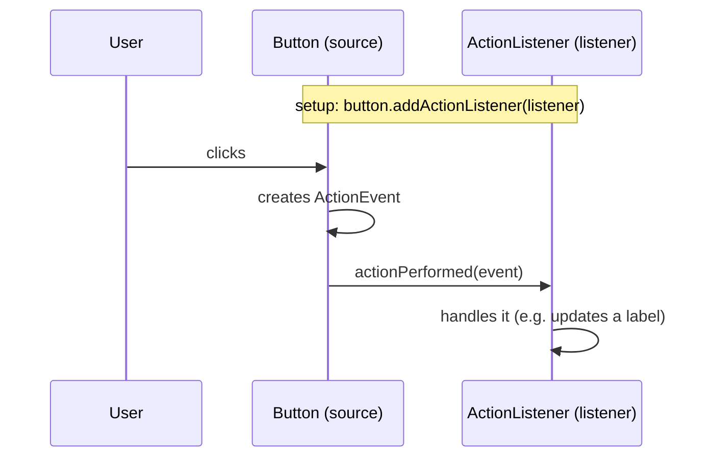

Advantage over the old Java 1.0 model (where events propagated up the containment hierarchy): only **registered** listeners receive events, so the code is efficient and separates **UI** from **logic**.

### Event classes and listeners
| Event | Generated when | Listener interface | Methods |
|---|---|---|---|
| `ActionEvent` | Button pressed, Enter in a TextField, menu item chosen, list item double-clicked | `ActionListener` | `actionPerformed` |
| `ItemEvent` | Checkbox/Choice/List item selected or deselected | `ItemListener` | `itemStateChanged` |
| `KeyEvent` | Key pressed, released, typed | `KeyListener` | `keyPressed`, `keyReleased`, `keyTyped` |
| `MouseEvent` | Clicked, pressed, released, entered, exited | `MouseListener` | 5 methods |
| `MouseEvent` (motion) | Moved, dragged | `MouseMotionListener` | `mouseMoved`, `mouseDragged` |
| `TextEvent` | Text in a TextField/TextArea changes | `TextListener` | `textValueChanged` |
| `WindowEvent` | Window opened, closing, closed, activated, iconified... | `WindowListener` | 7 methods |
| `FocusEvent`, `ComponentEvent`, `ContainerEvent`, `AdjustmentEvent` | Focus, resize/move, component added, scrollbar moved | corresponding listeners | — |

### Adapter classes
Implementing `WindowListener` forces you to write **all 7 methods** even if you need one. An **adapter class** (`WindowAdapter`, `MouseAdapter`, `KeyAdapter`, `MouseMotionAdapter`...) implements the interface with **empty methods**, so you override only what you need — usually as an anonymous inner class. Interfaces with a single method (ActionListener) have no adapter — use a lambda.

```java
// compile-only: needs a display
import java.awt.*;
import java.awt.event.*;

public class EventDemo extends Frame implements ActionListener {   // 1) class implements listener
    private final Label status = new Label("Click a button or move the mouse");
    private int clicks = 0;

    public EventDemo() {
        super("Events");
        setLayout(new FlowLayout());
        Button count = new Button("Count");
        count.addActionListener(this);                              // register this object

        Button reset = new Button("Reset");
        reset.addActionListener(e -> { clicks = 0; status.setText("reset"); });   // 2) lambda

        add(count); add(reset); add(status);

        addMouseMotionListener(new MouseMotionAdapter() {           // 3) adapter + anonymous class
            @Override public void mouseMoved(MouseEvent e) {
                status.setText("mouse at " + e.getX() + "," + e.getY());
            }
        });
        addKeyListener(new KeyAdapter() {
            @Override public void keyTyped(KeyEvent e) { status.setText("typed " + e.getKeyChar()); }
        });
        addWindowListener(new WindowAdapter() {
            @Override public void windowClosing(WindowEvent e) { dispose(); }
        });
        setSize(360, 120);
        setVisible(true);
    }
    @Override public void actionPerformed(ActionEvent e) {
        clicks++;
        status.setText(e.getActionCommand() + " pressed " + clicks + " times");
    }
    public static void main(String[] args) { new EventDemo(); }
}
```

Three ways of writing a handler appear above: the **class itself implements** the listener, a **lambda**, and an **anonymous adapter subclass**. A separate named class or an inner class also works.

**Key points:**
- Delegation model: source generates an event object and calls methods on registered listeners.
- Register with `addXxxListener`; each event type has a listener interface.
- Adapter classes provide empty implementations so you override only needed methods.
- ActionEvent ← buttons/menus/Enter; MouseEvent, KeyEvent, WindowEvent, ItemEvent are the common others.

=== Networking in Java: InetAddress, URL, TCP Sockets and UDP Datagrams
difficulty: hard
---
`java.net` makes network programming part of the standard library (Java was designed as "the language of the Internet").

### InetAddress and URL
- **`InetAddress`** represents an IP address; static factory methods: `getLocalHost()`, `getByName(host)` (DNS lookup), `getAllByName(host)`; instance methods `getHostName()`, `getHostAddress()`.
- **`URL`** represents a web address — `protocol://host:port/path?query#ref`; `openStream()` reads the resource; **`URLConnection` / `HttpURLConnection`** add headers, request methods and response codes.

```java
import java.net.*;

public class UrlParts {
    public static void main(String[] args) throws Exception {
        URL url = new URL("https://www.example.com:8443/docs/index.html?lang=en#intro");
        System.out.println("protocol = " + url.getProtocol());
        System.out.println("host     = " + url.getHost());
        System.out.println("port     = " + url.getPort() + " (default " + url.getDefaultPort() + ")");
        System.out.println("path     = " + url.getPath());
        System.out.println("query    = " + url.getQuery());
        System.out.println("ref      = " + url.getRef());
        InetAddress lo = InetAddress.getByName("127.0.0.1");
        System.out.println("loopback = " + lo.getHostAddress() + ", isLoopback " + lo.isLoopbackAddress());
    }
}
```

```text
protocol = https
host     = www.example.com
port     = 8443 (default 443)
path     = /docs/index.html
query    = lang=en
ref      = intro
loopback = 127.0.0.1, isLoopback true
```

### TCP sockets (connection-oriented)
- **`ServerSocket(port)`** — the server listens on a port; **`accept()` blocks** until a client connects and returns a **`Socket`** for that client.
- **`Socket(host, port)`** — the client connects to the server.
- Each side reads/writes through `getInputStream()` / `getOutputStream()`.
- Steps: server creates ServerSocket → accept → client connects → exchange data over streams → **close** (either side or both). TCP is reliable and ordered.

A complete echo server and client in one program (the server runs on its own thread):

```java
import java.io.*;
import java.net.*;

public class EchoDemo {
    public static void main(String[] args) throws Exception {
        ServerSocket server = new ServerSocket(0);          // 0 = any free port
        int port = server.getLocalPort();

        Thread serverThread = new Thread(() -> {
            try (Socket client = server.accept();           // blocks until a client connects
                 BufferedReader in = new BufferedReader(new InputStreamReader(client.getInputStream()));
                 PrintWriter out = new PrintWriter(client.getOutputStream(), true)) {
                String line;
                while ((line = in.readLine()) != null) {
                    if (line.equals("bye")) { out.println("goodbye"); break; }
                    out.println("echo: " + line.toUpperCase());
                }
            } catch (IOException e) { e.printStackTrace(); }
        });
        serverThread.start();

        try (Socket socket = new Socket("localhost", port);
             PrintWriter out = new PrintWriter(socket.getOutputStream(), true);
             BufferedReader in = new BufferedReader(new InputStreamReader(socket.getInputStream()))) {
            for (String msg : new String[] {"hello", "java sockets", "bye"}) {
                out.println(msg);
                System.out.println("client got -> " + in.readLine());
            }
        }
        serverThread.join();
        server.close();
    }
}
```

```text
client got -> echo: HELLO
client got -> echo: JAVA SOCKETS
client got -> goodbye
```

A real server loops on `accept()` and hands each client to a **thread (pool)** so many clients are served concurrently.

### UDP datagrams (connectionless)
- **`DatagramSocket`** sends and receives **`DatagramPacket`s** — each packet carries its own destination address and port.
- No connection, no guarantee of delivery or order, but **low overhead** — used for DNS, streaming, games.

```java
import java.net.*;

public class UdpDemo {
    public static void main(String[] args) throws Exception {
        try (DatagramSocket receiver = new DatagramSocket(0);
             DatagramSocket sender = new DatagramSocket()) {
            byte[] data = "ping over UDP".getBytes("UTF-8");
            DatagramPacket packet = new DatagramPacket(data, data.length,
                InetAddress.getLoopbackAddress(), receiver.getLocalPort());
            sender.send(packet);

            byte[] buf = new byte[100];
            DatagramPacket incoming = new DatagramPacket(buf, buf.length);
            receiver.setSoTimeout(5000);
            receiver.receive(incoming);                   // blocks until a packet arrives
            System.out.println("received: " + new String(incoming.getData(), 0, incoming.getLength(), "UTF-8"));
        }
    }
}
```

```text
received: ping over UDP
```

### TCP vs UDP in Java

| TCP | UDP |
|---|---|
| `Socket`, `ServerSocket` | `DatagramSocket`, `DatagramPacket` |
| Connection-oriented, stream of bytes | Connectionless, independent packets |
| Reliable, ordered | No guarantee, may arrive out of order |
| HTTP, FTP, email | DNS, video/voice streaming, games |

Common errors: **`BindException: Address already in use`** (port taken), **`ConnectException: Connection refused`** (nothing listening), `UnknownHostException`. Ports below 1024 need administrator/root rights on Unix.

### Proxy servers
The book also covers **proxy servers**: intermediaries between clients and the Internet that provide a **single point of access, control and logging**, **caching** (faster repeated access, less bandwidth), **content filtering** and blocking of dangerous URLs, and hiding of internal addresses. Clients must be configured to use them (or the proxy is transparent). **SOCKS** proxies relay arbitrary TCP connections rather than understanding HTTP. In Java: `System.setProperty("http.proxyHost", ...)` or `new Proxy(Proxy.Type.HTTP, address)` passed to `url.openConnection(proxy)`.

**Key points:**
- InetAddress = IP address (DNS lookups); URL/URLConnection = web resources.
- TCP: ServerSocket.accept() returns a Socket; communicate through input/output streams.
- UDP: DatagramSocket + DatagramPacket, connectionless and unreliable but light.
- Serve multiple clients with one thread (or pool task) per connection.

=== JDBC: Drivers, Connection, Statement, PreparedStatement and Transactions
difficulty: hard
---
**JDBC (Java Database Connectivity)** is the standard Java API (`java.sql`) for working with **tabular data sources** — relational databases — independent of the database vendor. The same code works with MySQL, PostgreSQL, Oracle or SQL Server; only the **driver** and the **connection URL** change.

### JDBC architecture
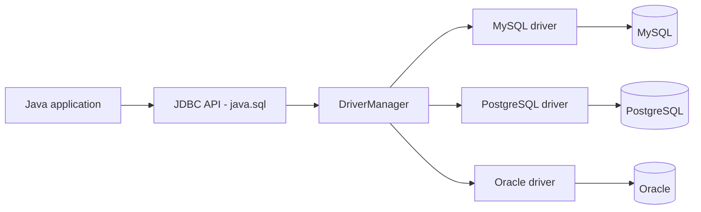

### Driver types
| Type | Name | How it works |
|---|---|---|
| 1 | JDBC–ODBC bridge | Translates JDBC to ODBC calls (removed in Java 8) |
| 2 | Native-API driver | Uses the database's native client library |
| 3 | Network-protocol (middleware) driver | Talks to a middleware server that talks to the DB |
| 4 | **Thin (pure Java) driver** | Speaks the database's network protocol directly — **most common today** |

### The steps

```java
// compile-only: needs a running database and its JDBC driver on the classpath
import java.sql.*;

public class JdbcDemo {
    public static void main(String[] args) {
        String url = "jdbc:mysql://localhost:3306/college";      // jdbc:<subprotocol>:<details>
        // 1. Load the driver (automatic since JDBC 4 if the jar is on the classpath)
        //    Class.forName("com.mysql.cj.jdbc.Driver");
        // 2. Open a connection
        try (Connection con = DriverManager.getConnection(url, "user", "password")) {

            // 3. Plain Statement - fine for fixed SQL
            try (Statement st = con.createStatement();
                 ResultSet rs = st.executeQuery("SELECT id, name, cgpa FROM student ORDER BY cgpa DESC")) {
                while (rs.next()) {                                // cursor starts BEFORE the first row
                    System.out.println(rs.getInt("id") + " " + rs.getString("name") + " " + rs.getDouble(3));
                }
            }

            // 4. PreparedStatement - parameters with ? placeholders
            String sql = "UPDATE student SET cgpa = ? WHERE id = ?";
            try (PreparedStatement ps = con.prepareStatement(sql)) {
                ps.setDouble(1, 8.9);
                ps.setInt(2, 101);
                int rows = ps.executeUpdate();                     // INSERT/UPDATE/DELETE -> row count
                System.out.println(rows + " row(s) updated");
            }

            // 5. Transaction - all or nothing
            con.setAutoCommit(false);
            try (PreparedStatement debit = con.prepareStatement("UPDATE account SET bal = bal - ? WHERE id = ?");
                 PreparedStatement credit = con.prepareStatement("UPDATE account SET bal = bal + ? WHERE id = ?")) {
                debit.setInt(1, 500);  debit.setInt(2, 1);  debit.executeUpdate();
                credit.setInt(1, 500); credit.setInt(2, 2); credit.executeUpdate();
                con.commit();
            } catch (SQLException e) {
                con.rollback();                                    // undo both updates
                throw e;
            }

            // 6. Stored procedure
            try (CallableStatement cs = con.prepareCall("{call get_topper(?)}")) {
                cs.registerOutParameter(1, Types.VARCHAR);
                cs.execute();
                System.out.println("topper: " + cs.getString(1));
            }
        } catch (SQLException e) {                                 // 7. connection closed by try-with-resources
            System.out.println("DB error " + e.getSQLState() + ": " + e.getMessage());
        }
    }
}
```

### Key interfaces
| Interface | Role |
|---|---|
| `DriverManager` (class) | Picks the right driver for a URL and opens connections |
| `Connection` | A session with the database; creates statements; controls transactions |
| `Statement` | Executes **static SQL** |
| `PreparedStatement` | **Precompiled** SQL with `?` parameters |
| `CallableStatement` | Calls **stored procedures** |
| `ResultSet` | Table of results with a **cursor**; `next()`, `getXxx(column)` |
| `ResultSetMetaData` / `DatabaseMetaData` | Column info / database info |
| `SQLException` | Errors, with `getSQLState()` and `getErrorCode()` |

**execute methods:** `executeQuery()` → `ResultSet` (SELECT); `executeUpdate()` → number of rows affected (INSERT/UPDATE/DELETE/DDL); `execute()` → boolean, for either.

### Statement vs PreparedStatement

| Statement | PreparedStatement |
|---|---|
| SQL built by string concatenation | SQL with `?` placeholders, values bound by `setXxx` |
| Parsed and compiled on every execution | **Precompiled once**, reused efficiently |
| **Vulnerable to SQL injection** | **Prevents SQL injection** — values are never parsed as SQL |
| Fine for fixed DDL | Use for anything with user input |

```calc
SQL injection with Statement:
  "SELECT * FROM users WHERE name = '" + input + "'"
  input = ' OR '1'='1      -> WHERE name = '' OR '1'='1'  -> returns every user!
With PreparedStatement the whole input is just a value for ?.
```

### Transactions
By default each statement is **auto-committed**. Call `setAutoCommit(false)` to group statements into a **transaction** (a group of SQL statements forming one logical unit — the book's definition), then `commit()` or `rollback()`; `setSavepoint()` allows partial rollback. `setTransactionIsolation(...)` chooses the isolation level.

### Other points
- **ResultSet types**: forward-only (default) or scrollable (`TYPE_SCROLL_INSENSITIVE`), read-only or updatable.
- **Batch updates**: `addBatch()` + `executeBatch()` send many statements in one round trip.
- **Connection pooling** (`DataSource`, HikariCP) reuses connections — opening one is expensive.
- Always close `ResultSet`, `Statement` and `Connection` (try-with-resources).

**Key points:**
- JDBC = vendor-independent DB API; Type 4 thin drivers are standard.
- Steps: load driver → getConnection → create statement → execute → process ResultSet → close.
- PreparedStatement is precompiled and prevents SQL injection; CallableStatement calls procedures.
- Transactions: setAutoCommit(false), commit(), rollback().

=== RMI: Remote Method Invocation
difficulty: hard
---
**RMI (Remote Method Invocation)** lets a Java program **call methods on an object living in another JVM** — on the same machine or across the network — with the **same syntax as a local call**. It is Java's object-oriented version of **Remote Procedure Calls (RPC)**: instead of passing data to procedures, whole objects can be passed and returned (they are serialized).

### Architecture: stubs and skeletons

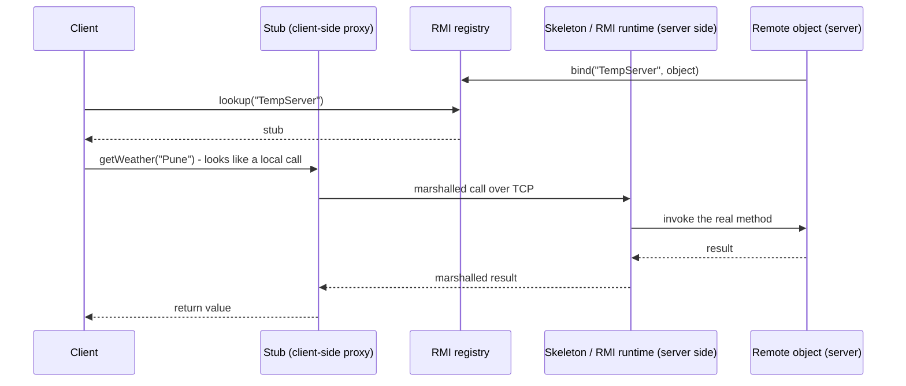

- **Stub** — a client-side proxy implementing the same remote interface; it **marshals** the method name and arguments (serializes them), sends them to the server, waits, and **unmarshals** the result.
- **Skeleton** — the server-side counterpart that unmarshals the call and invokes the real object (since Java 1.2 handled generically by the RMI runtime via reflection; since Java 5 stubs are generated dynamically, so `rmic` isn't needed).
- **RMI registry** — a simple **naming service** (default port **1099**): servers **bind** a name to a remote object; clients **look it up** to get a stub.
- Arguments and return values: primitives and **Serializable** objects are copied by value; **remote objects** are passed as stubs (by reference).

### Steps to build an RMI application
1. Define a **remote interface** that extends `java.rmi.Remote`; every method must declare **`throws RemoteException`**.
2. Implement it in a class that extends **`UnicastRemoteObject`** (or export it with `UnicastRemoteObject.exportObject`).
3. **Start the registry** (`rmiregistry` command or `LocateRegistry.createRegistry(port)`) and **bind** the object under a name.
4. The **client** looks up the name (`Naming.lookup("//host/TempServer")` or `registry.lookup`), **casts** to the interface, and calls methods.

The book's example is a temperature server that downloads weather data and serves it to clients. A runnable version (server and client in one program for demonstration):

```java
import java.rmi.*;
import java.rmi.registry.*;
import java.rmi.server.*;
import java.util.*;

public class RmiDemo {
    // 1. Remote interface
    public interface TemperatureServer extends Remote {
        String getWeather(String city) throws RemoteException;
        List<String> cities() throws RemoteException;
    }

    // 2. Implementation
    public static class TemperatureServerImpl extends UnicastRemoteObject implements TemperatureServer {
        private final Map<String, String> data = new TreeMap<>();
        TemperatureServerImpl() throws RemoteException {
            data.put("Delhi", "34 C, sunny");
            data.put("Mumbai", "29 C, humid");
            data.put("Pune", "26 C, cloudy");
        }
        public String getWeather(String city) { return data.getOrDefault(city, "no data"); }
        public List<String> cities() { return new ArrayList<>(data.keySet()); }
    }

    public static void main(String[] args) throws Exception {
        // 3. Server side: start a registry and bind the object
        Registry registry = LocateRegistry.createRegistry(15099);
        TemperatureServerImpl impl = new TemperatureServerImpl();
        registry.rebind("TempServer", impl);
        System.out.println("server bound as TempServer");

        // 4. Client side: look up the stub and call remote methods
        Registry clientView = LocateRegistry.getRegistry("localhost", 15099);
        TemperatureServer server = (TemperatureServer) clientView.lookup("TempServer");
        System.out.println("stub is a proxy: " + !(server instanceof TemperatureServerImpl));
        for (String city : server.cities())
            System.out.println(city + " -> " + server.getWeather(city));
        System.out.println("Chennai -> " + server.getWeather("Chennai"));

        UnicastRemoteObject.unexportObject(impl, true);
        UnicastRemoteObject.unexportObject(registry, true);
    }
}
```

```text
server bound as TempServer
stub is a proxy: true
Delhi -> 34 C, sunny
Mumbai -> 29 C, humid
Pune -> 26 C, cloudy
Chennai -> no data
```

In a real deployment the server and client are separate programs on different machines; the client uses `LocateRegistry.getRegistry("server-host", 1099)` or `Naming.lookup("rmi://server-host/TempServer")`.

### RMI vs sockets vs RPC
| Sockets | RPC | RMI |
|---|---|---|
| Low level: send/receive bytes; you design the protocol | Call remote **procedures**; data passed by value | Call methods on remote **objects**; objects passed |
| Any language | Language-neutral (with IDL) | **Java-to-Java** only |

Modern alternatives: REST/HTTP APIs, gRPC, message queues. RMI remains a classic exam/interview topic for distributed objects.

**Key points:**
- RMI = call methods on objects in another JVM as if local (object-oriented RPC).
- Remote interface extends Remote; methods throw RemoteException; implementation extends UnicastRemoteObject.
- Stub (client proxy) marshals calls; skeleton/runtime unmarshals on the server; registry (port 1099) maps names to objects.
- Serializable arguments are copied; remote objects are passed as stubs.

=== Servlets: Life Cycle, GET vs POST and HttpServlet
difficulty: hard
---
A **servlet** is a Java class that runs inside a **web server / servlet container** (Apache **Tomcat**, Jetty) and **extends the server's functionality** — typically generating dynamic web pages in response to HTTP requests. The book calls servlets the server-side analogue of applets. Benefits: **thin clients** (only a browser needed), logic written **once on the server**, Java's portability and libraries.

### How a request is handled

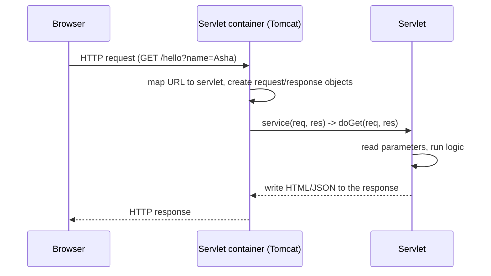

### Servlet life cycle
Managed by the container:
1. **Loading and instantiation** — the class is loaded and **one instance** is created (at startup or on the first request).
2. **`init(ServletConfig)`** — called **once**, for initialization (open resources, read init parameters).
3. **`service(request, response)`** — called **for every request**, each on its **own thread**; `HttpServlet.service()` dispatches to `doGet`, `doPost`, `doPut`, `doDelete`...
4. **`destroy()`** — called **once** before the servlet is removed (release resources).

Because **one instance serves many requests concurrently**, instance variables are shared between threads — keep servlets stateless or synchronize shared data.

```java
// not compiled: needs the servlet API (javax.servlet, provided by Tomcat)
import java.io.*;
import javax.servlet.*;
import javax.servlet.http.*;
import javax.servlet.annotation.WebServlet;

@WebServlet("/hello")                       // URL mapping (or declare it in web.xml)
public class HelloServlet extends HttpServlet {
    private int visits;                      // shared by all requests - careful!

    @Override
    public void init() throws ServletException {
        log("HelloServlet initialized");
    }

    @Override
    protected void doGet(HttpServletRequest req, HttpServletResponse res) throws IOException {
        String name = req.getParameter("name");          // ?name=Asha
        if (name == null) name = "guest";
        synchronized (this) { visits++; }
        res.setContentType("text/html");                 // must be set before writing
        try (PrintWriter out = res.getWriter()) {
            out.println("<html><body>");
            out.println("<h1>Hello, " + escape(name) + "</h1>");
            out.println("<p>Visits so far: " + visits + "</p>");
            out.println("</body></html>");
        }
    }

    @Override
    protected void doPost(HttpServletRequest req, HttpServletResponse res) throws IOException {
        String vote = req.getParameter("vote");          // form field
        // ... store the vote, then redirect (Post/Redirect/Get pattern)
        res.sendRedirect("results");
    }

    private static String escape(String s) {             // prevent HTML injection (XSS)
        return s.replace("&", "&amp;").replace("<", "&lt;").replace(">", "&gt;");
    }

    @Override
    public void destroy() { log("HelloServlet destroyed"); }
}
```

### Key API
- **`Servlet`** interface → **`GenericServlet`** (protocol-independent) → **`HttpServlet`** (HTTP; override `doGet`/`doPost`).
- **`HttpServletRequest`** — `getParameter`, `getParameterValues`, `getHeader`, `getCookies`, `getSession`, `getMethod`, `getRequestURI`.
- **`HttpServletResponse`** — `setContentType`, `getWriter`/`getOutputStream`, `setStatus`, `sendRedirect`, `addCookie`, `setHeader`.
- **`ServletConfig`** (per servlet init parameters) and **`ServletContext`** (shared application-wide data).
- **`RequestDispatcher`** — `forward(req, res)` (server-side, same request, URL unchanged) vs `res.sendRedirect(url)` (client makes a **new** request, URL changes).
- Deployment: `WEB-INF/web.xml` or annotations; packaged as a **WAR** file; Tomcat listens on port **8080** by default (web servers on 80).

### GET vs POST

| GET | POST |
|---|---|
| Data in the **URL query string** (`?name=Asha`) | Data in the **request body** |
| Visible, bookmarkable, cached, logged | Not shown in the URL |
| Length limited by URLs | Large data, file uploads |
| Should be **safe and idempotent** — retrieve data | For actions that **change** state (submit, pay) |
| `doGet` | `doPost` |

### Servlets vs CGI
| CGI | Servlets |
|---|---|
| A **new process** per request | One instance, a **thread** per request — much faster |
| Any language | Java |
| Hard to share state between requests | Shared via ServletContext/sessions |

**JSP (JavaServer Pages)** — HTML pages with embedded Java that the container compiles into servlets; used for the view, with servlets as controllers (MVC). Modern Java web apps use frameworks built on servlets, like **Spring MVC / Spring Boot**.

**Key points:**
- Servlet = Java class in a container (Tomcat) handling HTTP requests.
- Life cycle: load → init (once) → service per request on its own thread → destroy (once).
- HttpServlet: override doGet/doPost; one shared instance → watch thread safety.
- GET = parameters in URL, idempotent; POST = body, state-changing; forward vs sendRedirect.

=== Session Tracking: Cookies, HttpSession, URL Rewriting and Hidden Fields
difficulty: medium
---
**HTTP is stateless** — each request is independent; the server doesn't remember previous requests from the same browser. But applications need state: **shopping carts**, logins, personalization (the book's motivating examples). **Session tracking** distinguishes clients across requests.

### 1. Cookies
A **cookie** is a small name–value pair the server sends in the **response header** (`Set-Cookie`); the browser stores it and **sends it back with every later request** to the same server (`Cookie` header).

```java
// not compiled: needs the servlet API
// Setting a cookie
Cookie c = new Cookie("language", "Java");
c.setMaxAge(7 * 24 * 60 * 60);       // lifetime in seconds; 0 deletes it; -1 (default) = until browser closes
c.setHttpOnly(true);                 // not readable by JavaScript
res.addCookie(c);                    // part of the HTTP header - add before writing the body

// Reading cookies
Cookie[] cookies = req.getCookies(); // null if none
if (cookies != null)
    for (Cookie k : cookies)
        if (k.getName().equals("language")) out.println("You like " + k.getValue());
```

- Limits: small (~4 KB each), stored on the client (users can disable, view or tamper with them — never store sensitive data unprotected).
- Cookies **expire** after their max age and are deleted; session cookies (no max age) vanish when the browser closes.

### 2. HttpSession (server-side sessions)
The container keeps a **session object on the server** for each client, identified by a **session ID** sent to the browser in a cookie (`JSESSIONID`) or in the URL.

```java
// not compiled: needs the servlet API
HttpSession session = req.getSession();          // existing session, or create a new one
// req.getSession(false) returns null instead of creating

List<String> cart = (List<String>) session.getAttribute("cart");   // stored as Object - cast
if (cart == null) {
    cart = new ArrayList<>();
    session.setAttribute("cart", cart);
}
cart.add(req.getParameter("book"));

out.println("Session id: " + session.getId());
out.println("New session? " + session.isNew());
session.setMaxInactiveInterval(30 * 60);         // expire after 30 idle minutes
// session.getAttributeNames() lists the stored names
// session.invalidate();                          // log out
```

Data **stays on the server** (secure, can hold any objects) and is available until the session times out, is invalidated, or the browsing session ends.

### 3. URL rewriting
Append the session ID or data to every URL: `cart?item=5;jsessionid=AB12...` (`res.encodeURL(url)` does it automatically when cookies are disabled). Works without cookies, but every link must be rewritten and IDs appear in URLs, logs and bookmarks.

### 4. Hidden form fields
`<input type="hidden" name="step" value="2">` — the value travels back with the next form submission. Works only for form-based navigation; visible in the page source.

### Comparison

| Technique | Stored where | Pros | Cons |
|---|---|---|---|
| Cookies | Client | Simple, persists across visits | Can be disabled; size limits; client can tamper |
| **HttpSession** | **Server** (ID in cookie/URL) | Secure, any Java object, easy API | Uses server memory; needs clustering care |
| URL rewriting | URL | Works without cookies | Every link must be encoded; IDs leak |
| Hidden fields | HTML form | Simple | Only with forms; visible in source |

Security notes: regenerate the session ID after login (prevents **session fixation**), use `HttpOnly` and `Secure` cookie flags, and set timeouts.

**Key points:**
- HTTP is stateless; session tracking links requests from the same client.
- Cookies: name–value pairs stored by the browser, sent back with each request.
- HttpSession: data on the server, identified by a JSESSIONID cookie or rewritten URL.
- Also URL rewriting and hidden form fields; sessions expire after inactivity or invalidate().

=== JavaBeans: Properties, Conventions and Introspection
difficulty: medium
---
A **JavaBean** is a **reusable software component** written in Java that can be **manipulated visually in a builder tool** (the book demonstrates Sun's **BeanBox** test container). The idea: assemble applications from predefined components — e.g. drop "start" and "stop" buttons and an animation bean onto a form and "connect the dots" so that pressing a button calls a bean method — without knowing the components' implementation.

### Bean conventions
A class is a JavaBean if it follows these rules:
1. **Public no-argument constructor** — so tools can instantiate it.
2. **Private properties** exposed through **getters and setters** named by convention: `getName()` / `setName(...)`; boolean properties may use **`isActive()`**.
3. **Serializable** — so a configured bean can be saved and restored.
4. Optionally fires **events** to notify listeners when properties change.

Builder tools discover a bean's properties, methods and events by **introspection** (reflection on these naming patterns), so no extra metadata is required (a `BeanInfo` class can customize it).

### Kinds of properties
- **Simple** — single value (`getColor`/`setColor`).
- **Indexed** — an array, with `getItem(int i)` / `setItem(int i, value)`.
- **Bound** — fires a **`PropertyChangeEvent`** to registered listeners after it changes.
- **Constrained** — listeners may **veto** a change by throwing `PropertyVetoException`.

```java
import java.beans.*;
import java.io.Serializable;

public class StudentBean implements Serializable {
    private String name = "";
    private int marks;
    private boolean active = true;
    private final PropertyChangeSupport support = new PropertyChangeSupport(this);

    public StudentBean() { }                                   // required no-arg constructor

    public String getName() { return name; }
    public void setName(String name) { this.name = name; }

    public int getMarks() { return marks; }
    public void setMarks(int marks) {                          // bound property
        int old = this.marks;
        this.marks = marks;
        support.firePropertyChange("marks", old, marks);
    }
    public boolean isActive() { return active; }              // boolean getter uses "is"
    public void setActive(boolean active) { this.active = active; }

    public void addPropertyChangeListener(PropertyChangeListener l) { support.addPropertyChangeListener(l); }

    public static void main(String[] args) throws Exception {
        StudentBean bean = new StudentBean();
        bean.addPropertyChangeListener(e ->
            System.out.println(e.getPropertyName() + " changed " + e.getOldValue() + " -> " + e.getNewValue()));
        bean.setName("Asha");
        bean.setMarks(85);
        bean.setMarks(91);

        BeanInfo info = Introspector.getBeanInfo(StudentBean.class, Object.class);  // what a builder tool sees
        for (PropertyDescriptor p : info.getPropertyDescriptors())
            System.out.println("property: " + p.getName() + " (" + p.getPropertyType().getSimpleName() + ")");
    }
}
```

```text
marks changed 0 -> 85
marks changed 85 -> 91
property: active (boolean)
property: marks (int)
property: name (String)
```

Introspection found the three properties purely from the method names.

### Where beans are used
- GUI builders (the original purpose: Swing components are beans).
- **JSP** `<jsp:useBean>` / `<jsp:setProperty>` tags.
- **POJOs / DTOs** in frameworks — Spring, Hibernate/JPA and JSON libraries all rely on getter/setter conventions.
- **Enterprise JavaBeans (EJB)** are a different, server-side component model despite the name.

**Key points:**
- JavaBean = reusable component: public no-arg constructor, private properties with get/set (is for boolean), Serializable.
- Builder tools use introspection on naming conventions (BeanBox was the test container).
- Property kinds: simple, indexed, bound (PropertyChangeEvent), constrained (vetoable).
- The conventions live on in JSP, Spring, JPA and JSON mapping.
