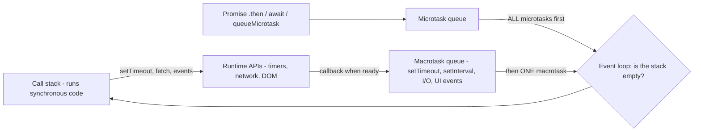
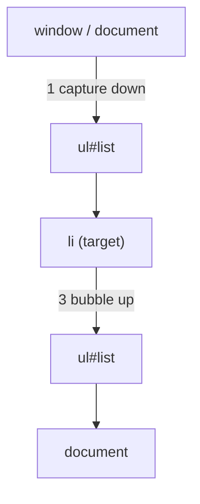

=== Introduction to JavaScript: Engines, Runtimes and ECMAScript
difficulty: easy
---
**JavaScript (JS)** is a high-level, **dynamically typed**, **single-threaded**, **multi-paradigm** language (procedural, object-oriented with **prototypes**, functional). Created by **Brendan Eich** at Netscape in 1995 (in about ten days), it began as the language of web pages and now runs everywhere: browsers, servers (**Node.js**), mobile and desktop apps, even databases.

Despite the name, JavaScript is **unrelated to Java** — the name was a marketing decision.

### ECMAScript
**ECMAScript (ES)** is the language **standard**, maintained by Ecma's TC39 committee; JavaScript is its most famous implementation. Big milestones:
- **ES5 (2009)** — strict mode, JSON, array methods (`forEach`, `map`, `filter`).
- **ES6 / ES2015** — the big modernization: `let`/`const`, arrow functions, classes, template literals, destructuring, spread/rest, default parameters, Promises, modules, `Map`/`Set`, iterators, generators, symbols.
- Yearly releases since: `async`/`await` (2017), optional chaining `?.` and nullish coalescing `??` (2020), top-level await (2022), `Array.prototype.at`, `structuredClone`, `Object.groupBy` and more.

### Engines and runtimes
- A **JavaScript engine** parses and executes code: **V8** (Chrome, Node.js, Edge), **SpiderMonkey** (Firefox), **JavaScriptCore** (Safari). Modern engines use **JIT compilation**: code starts in an interpreter and hot functions are compiled to optimized machine code.
- A **runtime** = engine + environment APIs:
  - **Browser**: the DOM, `window`, `fetch`, `setTimeout`, `localStorage`, events.
  - **Node.js**: file system (`fs`), `http`, `process`, modules — no DOM.
- The engine provides the language; things like `setTimeout` and `fetch` come from the **runtime**, not from JavaScript itself.

```js
console.log("Hello, JavaScript!");
console.log(typeof window === "undefined" ? "running in Node" : "running in a browser");
console.log(2 + 3, "2" + 3, 10 / 4);
```

```text
Hello, JavaScript!
running in Node
5 23 2.5
```

(All examples in this guide were run with Node.js; their output is shown exactly as printed. Examples that need a browser — the DOM — are marked.)

### Characteristics interviewers ask about
| Property | Meaning |
|---|---|
| **Interpreted / JIT-compiled** | No separate compile step; engines compile at run time |
| **Dynamically typed** | Variables have no fixed type; values do |
| **Weakly typed** | Implicit **coercion** between types (`"2" + 3` → `"23"`) |
| **First-class functions** | Functions are values — stored, passed, returned |
| **Prototype-based** | Objects inherit directly from other objects; `class` is syntax on top |
| **Single-threaded + event loop** | One call stack; asynchronous work via callbacks, promises and the event loop |
| **Garbage collected** | Memory freed automatically (mark-and-sweep) |

### Where code runs in a page
```calc
<script src="app.js"></script>              blocks HTML parsing while it downloads and runs
<script src="app.js" defer></script>         downloads in parallel, runs after parsing, in order
<script src="app.js" async></script>         downloads in parallel, runs as soon as ready (any order)
<script type="module" src="app.js"></script> ES module: deferred by default, strict mode
```

**Key points:**
- JavaScript implements the ECMAScript standard; ES6 (2015) was the major modernization.
- Engine (V8, SpiderMonkey) runs the language; runtime (browser, Node) adds APIs.
- Dynamic and weak typing, first-class functions, prototypes, single thread + event loop.
- `defer` runs scripts after parsing in order; `async` runs them whenever they load.

=== Variables: var, let, const, Scope and Hoisting
difficulty: medium
---
JavaScript has three ways to declare variables.

| | `var` | `let` | `const` |
|---|---|---|---|
| Scope | **Function** (or global) | **Block** `{ }` | **Block** |
| Hoisted? | Yes, initialized to `undefined` | Yes, but **not initialized** (TDZ) | Yes, not initialized (TDZ) |
| Re-declare in same scope | Allowed | Error | Error |
| Re-assign | Allowed | Allowed | **Not allowed** |
| Creates a property on the global object | Yes (in scripts) | No | No |

Modern code uses **`const` by default** and `let` when the value must change; `var` is legacy.

### Block scope vs function scope
```js
function scopes() {
  if (true) {
    var a = "var is function-scoped";
    let b = "let is block-scoped";
    const c = "const is block-scoped";
  }
  console.log(a);
  console.log(typeof b, typeof c);   // not visible here
}
scopes();
```

```text
var is function-scoped
undefined undefined
```

### Hoisting and the Temporal Dead Zone
**Hoisting**: declarations are processed before the code runs, as if moved to the top of their scope.
- `var` declarations are hoisted **and initialized to `undefined`** — reading before the assignment gives `undefined`.
- `let`/`const` are hoisted but **uninitialized**; accessing them before the declaration line throws a `ReferenceError` — the **Temporal Dead Zone (TDZ)**.
- **Function declarations** are hoisted **completely** (you can call them before they appear); function **expressions** assigned to variables are not.

```js
// expect-error: TDZ
console.log(hoistedVar);          // undefined, not an error
var hoistedVar = 5;

console.log(sayHi());             // function declarations are fully hoisted
function sayHi() { return "hi"; }

try {
  greet();                        // var greet is undefined here
} catch (e) {
  console.log(e.constructor.name + ": " + e.message);
}
var greet = function () { return "hello"; };

console.log(tdz);                 // let in the TDZ
let tdz = 1;
```

```text
undefined
hi
TypeError: greet is not a function
ReferenceError: Cannot access 'tdz' before initialization
```

### const means a constant binding, not an immutable value
```js
const user = { name: "Asha" };
user.name = "Ravi";              // allowed: mutating the object
user.age = 21;
console.log(user);
try {
  user = {};                     // not allowed: rebinding the name
} catch (e) {
  console.log(e.constructor.name + ": " + e.message);
}
const frozen = Object.freeze({ level: 1 });
frozen.level = 99;               // silently ignored (throws in strict mode)
console.log(frozen.level);
```

```text
{ name: 'Ravi', age: 21 }
TypeError: Assignment to constant variable.
1
```

`Object.freeze` makes an object's own properties read-only — but only **shallowly** (nested objects stay mutable).

### The classic loop bug
```js
const fnsVar = [], fnsLet = [];
for (var i = 0; i < 3; i++) fnsVar.push(() => i);     // ONE i shared by all closures
for (let j = 0; j < 3; j++) fnsLet.push(() => j);     // a NEW j for every iteration
console.log(fnsVar.map(f => f()), fnsLet.map(f => f()));
```

```text
[ 3, 3, 3 ] [ 0, 1, 2 ]
```

With `var`, all three closures see the same variable, which is 3 after the loop. `let` creates a fresh binding per iteration. (The same bug appears with `setTimeout` in a `var` loop.)

**Key points:**
- `var` is function-scoped; `let`/`const` are block-scoped.
- `var` hoists as `undefined`; `let`/`const` throw in the TDZ; function declarations hoist fully.
- `const` prevents rebinding, not mutation; `Object.freeze` is shallow.
- Use `let` in loops that create closures; prefer `const`, then `let`, never `var`.

=== Data Types, typeof and Primitive vs Reference Values
difficulty: easy
---
JavaScript has **8 data types**: **7 primitives** and **objects**.

| Type | Examples | `typeof` |
|---|---|---|
| `number` | `42`, `3.14`, `NaN`, `Infinity` | `"number"` |
| `bigint` | `9007199254740993n` | `"bigint"` |
| `string` | `"hi"`, `'hi'`, `` `hi` `` | `"string"` |
| `boolean` | `true`, `false` | `"boolean"` |
| `undefined` | `undefined` | `"undefined"` |
| `null` | `null` | `"object"` — a famous historical bug |
| `symbol` | `Symbol("id")` | `"symbol"` |
| **object** | `{}`, `[]`, functions, dates, maps... | `"object"` (`"function"` for functions) |

```js
console.log(typeof 42, typeof "x", typeof true, typeof undefined, typeof 10n, typeof Symbol());
console.log(typeof null, typeof {}, typeof [], typeof function () {}, typeof NaN);
console.log(Array.isArray([]), [] instanceof Array, Object.prototype.toString.call(null));
console.log(0.1 + 0.2, 0.1 + 0.2 === 0.3, Math.abs(0.1 + 0.2 - 0.3) < Number.EPSILON);
console.log(Number.MAX_SAFE_INTEGER, 2 ** 53 + 1, 2n ** 53n + 1n);
console.log(1 / 0, -1 / 0, 0 / 0, Number.isNaN("abc"), isNaN("abc"));
```

```text
number string boolean undefined bigint symbol
object object object function number
true true [object Null]
0.30000000000000004 false true
9007199254740991 9007199254740992 9007199254740993n
Infinity -Infinity NaN false true
```

Notes:
- All numbers are **64-bit floating point** (IEEE 754) — there is no separate integer type. Integers are exact only up to `Number.MAX_SAFE_INTEGER` (2⁵³ − 1); beyond that use **BigInt** (`n` suffix).
- `typeof null === "object"` is a bug kept for compatibility — test with `value === null`. Test arrays with `Array.isArray`.
- `NaN` ("not a number") is a number and is **not equal to itself**. Use `Number.isNaN()` — the global `isNaN()` coerces first (`isNaN("abc")` is true).

### undefined vs null
- **`undefined`** — "no value assigned yet": uninitialized variables, missing properties, missing arguments, functions without `return`.
- **`null`** — an **intentional** "no value", assigned by the programmer.

```js
let a;
const obj = {};
function f(x) { return x; }
console.log(a, obj.missing, f(), (function () {})());
console.log(null == undefined, null === undefined, typeof undefined, typeof null);
```

```text
undefined undefined undefined undefined
true false undefined object
```

### Primitives are copied by value; objects are shared by reference
Primitives are **immutable** and copied by value. Objects (including arrays and functions) are accessed through **references** — assigning or passing an object copies the reference, so both names point to the **same** object.

```js
let x = 10;
let y = x;           // copy of the value
y++;
console.log(x, y);

const a = { score: 1 };
const b = a;         // copy of the reference
b.score = 99;
console.log(a.score, a === b);

console.log({ v: 1 } === { v: 1 }, [1] === [1]);   // different objects

let s = "hello";
s[0] = "J";          // strings are immutable: ignored
console.log(s, s.toUpperCase(), s);
```

```text
10 11
99 true
false false
hello HELLO hello
```

**`===` on objects compares identity**, not contents. To compare contents, compare fields (or serialize simple data with `JSON.stringify`).

**Key points:**
- 7 primitives (number, bigint, string, boolean, undefined, null, symbol) + objects.
- `typeof null` is "object"; use `Array.isArray` and `Number.isNaN`.
- Numbers are doubles: `0.1 + 0.2 !== 0.3`; use BigInt beyond 2⁵³ − 1.
- Primitives copy by value; objects share references; `===` on objects means same object.

=== Type Coercion, == vs === and Truthy/Falsy Values
difficulty: hard
---
**Coercion** is automatic (implicit) or manual (explicit) conversion between types. JavaScript is **weakly typed**, so many operators coerce their operands — the source of most "JavaScript WTF" interview puzzles.

### Explicit conversion
```js
console.log(Number("42"), Number(""), Number("4x"), Number(null), Number(undefined), Number(true));
console.log(parseInt("42px"), parseInt("0x1f"), parseFloat("3.14abc"), parseInt("101", 2));
console.log(String(123), String(null), String([1, 2]), String({}));
console.log(Boolean(""), Boolean("0"), Boolean([]), !!0, !!"false");
```

```text
42 0 NaN 0 NaN 1
42 31 3.14 5
123 null 1,2 [object Object]
false true true false true
```

### Implicit coercion with operators
- **`+`**: if either operand is a **string**, it concatenates; otherwise numeric addition. Objects are first converted to primitives (`[]` → `""`, `{}` → `"[object Object]"`).
- **`- * / %`** always convert to **numbers**.
- Comparison `<`, `>` converts to numbers unless **both** are strings (then it compares alphabetically).

```js
console.log("5" + 3, "5" - 3, "5" * "2", 3 + 4 + "5", "3" + 4 + 5);
console.log([] + [], [] + {}, [1, 2] + [3], true + 1, null + 1, undefined + 1);
console.log("10" < "9", 10 < "9", "b" > "a");
```

```text
53 2 10 75 345
 [object Object] 1,23 2 1 NaN
true false true
```

### == (loose) vs === (strict) equality
- **`===`** compares **value and type**, with no conversion. Use it by default.
- **`==`** converts types first using the **abstract equality algorithm**:
  - `null == undefined` is true (and they equal nothing else);
  - number vs string → the string becomes a number;
  - boolean vs anything → the boolean becomes a number (`true` → 1);
  - object vs primitive → the object becomes a primitive.

```js
console.log(1 == "1", 1 === "1", 0 == "", 0 == "0", "" == "0");
console.log(false == "0", false == [], [] == ![], null == 0, null >= 0);
console.log(NaN == NaN, Object.is(NaN, NaN), Object.is(0, -0), 0 === -0);
```

```text
true false true true false
true true true false true
false true false true
```

`"" == "0"` is false but `0 == ""` and `0 == "0"` are both true — `==` is **not transitive**. `[] == ![]` is true: `![]` is false → 0, and `[]` → `""` → 0. `null >= 0` is true even though `null == 0` is false (relational operators convert null to 0; `==` doesn't). `Object.is` is like `===` but treats `NaN` as equal to itself and `+0` ≠ `-0`.

The one common acceptable use of `==`: `value == null` checks for **both** `null` and `undefined`.

### Truthy and falsy
In conditions, values convert to booleans. There are exactly **8 falsy values**:

```calc
false   0   -0   0n   ""   null   undefined   NaN
```

**Everything else is truthy** — including `"0"`, `"false"`, `" "`, `[]`, `{}` and `function(){}`.

```js
const values = [0, "0", "", " ", [], {}, null, NaN, "false", -1];
const show = v => typeof v === "string" ? JSON.stringify(v) : Array.isArray(v) ? "[]" : v && typeof v === "object" ? "{}" : String(v);
for (const v of values) console.log(show(v), "->", v ? "truthy" : "falsy");
```

```text
0 -> falsy
"0" -> truthy
"" -> falsy
" " -> truthy
[] -> truthy
{} -> truthy
null -> falsy
NaN -> falsy
"false" -> truthy
-1 -> truthy
```

### Logical operators return operands, and ?? vs ||
`||` returns the **first truthy** operand (or the last), `&&` the **first falsy** (or the last). This makes `||` a default-value operator — but it also replaces valid falsy values like `0` and `""`. **`??` (nullish coalescing)** replaces **only `null` and `undefined`**.

```js
const settings = { volume: 0, title: "", theme: null };
console.log(settings.volume || 50, settings.volume ?? 50);
console.log(settings.title || "Untitled", settings.title ?? "Untitled");
console.log(settings.theme ?? "dark", settings.missing ?? "default");
console.log("a" && "b", 0 && "b", null || 0 || "x");
let count = 0;
count ||= 10;         // assigns because 0 is falsy
let limit = 0;
limit ??= 10;         // keeps 0
console.log(count, limit);
```

```text
50 0
Untitled
dark default
b 0 x
10 0
```

**Key points:**
- `+` concatenates if either side is a string; other arithmetic converts to numbers.
- Use `===`; `==` coerces (null == undefined, booleans become numbers) and isn't transitive.
- Falsy: false, 0, -0, 0n, "", null, undefined, NaN — everything else is truthy (even `[]` and `"0"`).
- `||` picks the first truthy value; `??` only replaces null/undefined.

=== Functions: Declarations, Expressions, Arrow Functions and Parameters
difficulty: medium
---
Functions are **first-class objects**: they can be assigned to variables, stored in objects and arrays, passed as arguments (**callbacks**) and returned from other functions (**higher-order functions**).

### Ways to define functions
```js
function declared(a, b) { return a + b; }          // declaration: hoisted
const expressed = function (a, b) { return a + b; };   // anonymous function expression
const named = function fact(n) { return n <= 1 ? 1 : n * fact(n - 1); };  // named expression
const arrow = (a, b) => a + b;                       // arrow function: implicit return
const square = x => x * x;                           // one parameter: no parentheses needed
const makeUser = (name) => ({ name, active: true }); // returning an object literal needs ( )
const multiLine = (a, b) => {
  const sum = a + b;
  return sum * 2;                                    // braces need an explicit return
};
console.log(declared(1, 2), expressed(1, 2), named(5), arrow(1, 2), square(4), makeUser("Asha"), multiLine(1, 2));
console.log(typeof declared, declared.length, declared.name);
```

```text
3 3 120 3 16 { name: 'Asha', active: true } 6
function 2 declared
```

### Arrow functions vs regular functions
| | Regular function | Arrow function |
|---|---|---|
| `this` | Set by **how it is called** | **Lexical** — taken from the surrounding scope |
| `arguments` object | Yes | No (use rest parameters) |
| Can be a constructor (`new`) | Yes | **No** |
| Has `prototype` | Yes | No |
| Hoisting | Declarations are hoisted | Like any `const` variable |
| Good for | Methods, constructors | Callbacks, short functions, preserving `this` |

(See "The this Keyword" for examples.)

### Parameters
```js
function greet(name = "guest", greeting = `Hello`) {      // default parameters
  return `${greeting}, ${name}!`;
}
function sum(...nums) {                                    // rest parameter: a real array
  return nums.reduce((total, n) => total + n, 0);
}
function legacy() {
  return Array.from(arguments).join("-");                  // arguments: array-like, not in arrows
}
function describe({ name, age = 18, ...others }) {        // destructured parameter
  return `${name} (${age}) ${JSON.stringify(others)}`;
}
console.log(greet(), greet("Asha"), greet(undefined, "Hi"), greet(null));
console.log(sum(), sum(1, 2, 3), sum(...[4, 5, 6]));      // spread an array into arguments
console.log(legacy("a", "b", "c"));
console.log(describe({ name: "Ravi", city: "Pune", role: "dev" }));
console.log(((a, b) => a)(1), ((a, b) => b)(1));          // missing arguments are undefined
```

```text
Hello, guest! Hello, Asha! Hi, guest! Hello, null!
0 6 15
a-b-c
Ravi (18) {"city":"Pune","role":"dev"}
1 undefined
```

- A default applies when the argument is `undefined` — **not** when it is `null`.
- Extra arguments are ignored; missing ones are `undefined`. JavaScript has **no function overloading**.
- Primitives are passed by value; objects are passed as a **copy of the reference** — a function can mutate the caller's object but not rebind the caller's variable.

### Higher-order functions and callbacks
```js
const applyTwice = (fn, x) => fn(fn(x));
const multiplier = factor => n => n * factor;    // returns a function
const triple = multiplier(3);
console.log(applyTwice(x => x + 10, 1), triple(5), [1, 2, 3].map(multiplier(2)));
```

```text
21 15 [ 2, 4, 6 ]
```

### IIFE (Immediately Invoked Function Expression)
`(function () { ... })();` runs a function once, immediately, creating a private scope — the pre-module way to avoid polluting the global scope.

**Key points:**
- Declarations hoist; expressions and arrows don't (they follow their variable).
- Arrow functions: concise, lexical `this`, no `arguments`, can't be used with `new`.
- Defaults apply only for `undefined`; rest `...args` collects extras; spread `...arr` expands.
- Functions are values: callbacks and higher-order functions are everywhere in JS.

=== Scope, Closures and the Module Pattern
difficulty: hard
---
### Lexical scope and the scope chain
JavaScript uses **lexical (static) scope**: a function can access variables from where it is **defined**, not where it is called. Lookup walks outward through the **scope chain** — local → enclosing functions → module/global — and throws `ReferenceError` if the name is not found. Scopes: **global**, **module**, **function**, and **block** (for `let`/`const`).

```js
const level = "global";
function outer() {
  const level = "outer";
  function inner() {
    console.log(level);          // found in the enclosing scope where inner was DEFINED
  }
  return inner;
}
function caller() {
  const level = "caller";
  outer()();                     // calling from here doesn't matter
}
caller();
```

```text
outer
```

### Closures
A **closure** is a function together with the variables of the scope in which it was created. The inner function **keeps access to those variables even after the outer function has returned** — they stay alive as long as the inner function does.

```js
function createCounter() {
  let count = 0;                       // private: only the returned functions can reach it
  return {
    increment: () => ++count,
    decrement: () => --count,
    get value() { return count; },
  };
}
const c1 = createCounter();
const c2 = createCounter();            // independent state
c1.increment(); c1.increment(); c2.decrement();
console.log(c1.value, c2.value, c1.count);
```

```text
2 -1 undefined
```

### What closures are used for
1. **Data privacy / encapsulation** — the counter above; the "module pattern".
2. **Function factories** — `multiplier(3)` returns a function remembering `3`.
3. **Callbacks and event handlers** that remember context.
4. **Memoization** — caching results in a closed-over object.
5. **`once`, `debounce`, `throttle`** utilities.

```js
function memoize(fn) {
  const cache = new Map();             // closed over
  return function (n) {
    if (cache.has(n)) return cache.get(n);
    const result = fn(n);
    cache.set(n, result);
    return result;
  };
}
let calls = 0;
const slowSquare = n => { calls++; return n * n; };
const fastSquare = memoize(slowSquare);
console.log(fastSquare(9), fastSquare(9), fastSquare(4), "calls:", calls);

function once(fn) {
  let done = false, result;
  return (...args) => done ? result : (done = true, result = fn(...args));
}
const init = once(() => { console.log("initializing"); return 42; });
console.log(init(), init());
```

```text
81 81 16 calls: 2
initializing
42 42
```

### Debounce — a classic interview implementation
**Debounce** delays running a function until calls have **stopped** for `wait` ms (search box suggestions). **Throttle** runs it **at most once per** `wait` ms (scroll handlers).

```js
function debounce(fn, wait) {
  let timer;                                   // closure keeps the pending timer
  return (...args) => {
    clearTimeout(timer);
    timer = setTimeout(() => fn(...args), wait);
  };
}
const search = debounce(q => console.log("searching for", q), 50);
search("j"); search("ja"); search("jav"); search("java");   // only the last call runs
setTimeout(() => search("javascript"), 120);
```

```text
searching for java
searching for javascript
```

### Closure pitfalls
- **Stale/shared variables** in loops with `var` (see "Variables").
- **Memory**: a closure keeps its whole captured scope alive; long-lived closures (event listeners, timers) holding big data cause leaks — remove listeners and clear timers.

**Key points:**
- Lexical scope: variables resolve by where a function is written, via the scope chain.
- A closure = function + the variables it captured; they outlive the outer call.
- Uses: private state, factories, memoization, once/debounce/throttle.
- Debounce waits for quiet; throttle limits frequency.

=== The this Keyword, call/apply/bind
difficulty: hard
---
In a regular function, **`this` is determined by how the function is called**, not where it is defined. The rules, in order of precedence:

| Call style | `this` is |
|---|---|
| `new Fn()` | the newly created object |
| `fn.call(obj)` / `fn.apply(obj)` / `fn.bind(obj)` | `obj` (**explicit binding**) |
| `obj.method()` | `obj` (**implicit binding** — the object before the dot) |
| plain `fn()` | `undefined` in **strict mode**; the global object in sloppy mode |
| **arrow function** | inherited from the **enclosing scope** (lexical); can't be changed |

```js
"use strict";
const user = {
  name: "Asha",
  regular() { return this && this.name; },
  arrow: () => typeof this,                 // module/global this, not user
  delayed() {
    return [1].map(function () { return this; })[0];   // plain call inside: undefined
  },
  delayedArrow() {
    return [1].map(() => this.name)[0];      // arrow borrows delayedArrow's this
  },
};
console.log(user.regular(), user.arrow(), user.delayed(), user.delayedArrow());

const detached = user.regular;               // lost its object
console.log(detached());                     // strict mode: this is undefined
```

```text
Asha object undefined Asha
undefined
```

The **lost `this`** problem: passing `obj.method` as a callback (`setTimeout(user.regular, 100)`, `button.addEventListener("click", obj.handle)`) detaches it from the object. Fixes: an arrow wrapper `() => user.regular()`, `user.regular.bind(user)`, or arrow-function class fields.

### call, apply and bind
All three set `this` explicitly:
- **`fn.call(thisArg, a, b)`** — calls immediately, arguments listed.
- **`fn.apply(thisArg, [a, b])`** — calls immediately, arguments as an **array**.
- **`fn.bind(thisArg, a)`** — **returns a new function** with `this` (and optionally leading arguments) fixed permanently; doesn't call it.

```js
function introduce(greeting, punctuation) {
  return `${greeting}, I am ${this.name}${punctuation}`;
}
const asha = { name: "Asha" }, ravi = { name: "Ravi" };
console.log(introduce.call(asha, "Hi", "!"));
console.log(introduce.apply(ravi, ["Hello", "."]));
const ashaSays = introduce.bind(asha, "Hey");      // partial application
console.log(ashaSays("?"), ashaSays.call(ravi, "!"));   // bind wins over call
console.log(Math.max.apply(null, [3, 9, 2]), Math.max(...[3, 9, 2]));
```

```text
Hi, I am Asha!
Hello, I am Ravi.
Hey, I am Asha? Hey, I am Asha!
9 9
```

A bound function's `this` **cannot be overridden** by `call`/`apply` (only `new` ignores it).

### Implementing bind — a common interview question
```js
Function.prototype.myBind = function (context, ...preset) {
  const fn = this;                                   // the function being bound
  return function (...later) {
    return fn.apply(context, [...preset, ...later]);
  };
};
function add(a, b, c) { return this.base + a + b + c; }
const bound = add.myBind({ base: 100 }, 1, 2);
console.log(bound(3));
```

```text
106
```

### this in classes and event handlers
- Inside class methods `this` is the instance — but class bodies are **strict mode**, so a detached method gets `undefined`.
- In a DOM event listener written as a regular function, `this` is the element (`event.currentTarget`); with an arrow function it is the outer `this`.

**Key points:**
- `this` depends on the call: new > explicit (call/apply/bind) > implicit (obj.method) > default.
- Arrow functions take `this` from their surrounding scope.
- Detached methods lose `this`; fix with bind or an arrow wrapper.
- call (args listed), apply (args array) call now; bind returns a new permanently bound function.

=== Objects: Literals, Properties, Destructuring, Spread and Copying
difficulty: medium
---
An **object** is a collection of **key–value pairs (properties)**. Keys are strings (or symbols); values can be anything, including functions (**methods**).

```js
const key = "role";
const user = {
  name: "Asha",
  "favourite color": "teal",           // keys with spaces need quotes
  [key]: "admin",                      // computed key
  greet() { return `Hi, I'm ${this.name}`; },   // method shorthand
};
console.log(user.name, user["favourite color"], user.role, user.greet());
user.age = 21;                         // add
delete user["favourite color"];        // remove
console.log("age" in user, user.hasOwnProperty("greet"), user.missing);
console.log(Object.keys(user), Object.entries({ a: 1, b: 2 }));
for (const [k, v] of Object.entries({ x: 1, y: 2 })) console.log(k, v);
const nameVar = "Ravi", city = "Pune";
console.log({ nameVar, city });        // shorthand properties
```

```text
Asha teal admin Hi, I'm Asha
true true undefined
[ 'name', 'role', 'greet', 'age' ] [ [ 'a', 1 ], [ 'b', 2 ] ]
x 1
y 2
{ nameVar: 'Ravi', city: 'Pune' }
```

- **Dot notation** for valid identifier keys; **bracket notation** for keys with spaces, dynamic keys or variables.
- Reading a missing property gives `undefined` (no error); reading a property **of** `undefined` throws a TypeError.
- `in` checks own and inherited properties; `Object.hasOwn(obj, k)` / `hasOwnProperty` only own ones.

### Optional chaining
```js
const order = { customer: { address: null }, items: [] };
console.log(order.customer?.address?.city, order.payment?.method, order.items?.[0]?.name);
console.log(order.notify?.(), order.customer?.address?.city ?? "no city");
try {
  console.log(order.payment.method);
} catch (e) {
  console.log(e.constructor.name + ": " + e.message);
}
```

```text
undefined undefined undefined
undefined no city
TypeError: Cannot read properties of undefined (reading 'method')
```

`?.` stops and returns `undefined` if the value on its left is `null`/`undefined` — for properties, array indexes (`?.[i]`) and calls (`?.()`).

### Destructuring
```js
const person = { first: "Asha", last: "Rao", age: 21, address: { city: "Pune" } };
const { first, age: years, country = "India", address: { city }, ...rest } = person;
console.log(first, years, country, city, rest);

const [a, , b = 10, ...others] = [1, 2, undefined, 4, 5];
console.log(a, b, others);
let x = 1, y = 2;
[x, y] = [y, x];                       // swap
console.log(x, y);
```

```text
Asha 21 India Pune { last: 'Rao' }
1 10 [ 4, 5 ]
2 1
```

### Spread, merging and copying
```js
const defaults = { theme: "light", fontSize: 14 };
const prefs = { fontSize: 18 };
const settings = { ...defaults, ...prefs, lang: "en" };   // later keys win
console.log(settings);

const original = { name: "Asha", skills: ["js"] };
const shallow = { ...original };            // or Object.assign({}, original)
const deep = structuredClone(original);     // deep copy (modern runtimes)
original.skills.push("python");
original.name = "Changed";
console.log(shallow, deep);
console.log(JSON.parse(JSON.stringify({ d: new Date(0), f() {}, u: undefined })));
```

```text
{ theme: 'light', fontSize: 18, lang: 'en' }
{ name: 'Asha', skills: [ 'js', 'python' ] } { name: 'Asha', skills: [ 'js' ] }
{ d: '1970-01-01T00:00:00.000Z' }
```

- Spread / `Object.assign` make **shallow** copies — nested objects are still shared.
- **`structuredClone`** makes deep copies (handles Dates, Maps, cycles; not functions).
- The old `JSON.parse(JSON.stringify(x))` trick **loses** functions and `undefined` and turns Dates into strings, as shown.

### Comparing objects
`{a: 1} === {a: 1}` is false — objects compare by **reference**. Deep equality needs a helper (or a library like Lodash's `isEqual`).

**Key points:**
- Dot vs bracket notation; computed keys; method shorthand; `in`/`Object.hasOwn`.
- Optional chaining `?.` and `??` safely read nested data.
- Destructuring with renaming, defaults, nesting and rest; spread to merge (later wins).
- Spread copies are shallow; use `structuredClone` for deep copies.

=== Prototypes and Prototypal Inheritance
difficulty: hard
---
Every object has an internal link, **`[[Prototype]]`**, to another object (or `null`). When you read a property that the object doesn't have, JavaScript looks at its prototype, then the prototype's prototype, and so on — the **prototype chain** — until it finds it or reaches `null`.

```js
const animal = {
  eats: true,
  describe() { return `${this.name} eats: ${this.eats}`; },
};
const rabbit = Object.create(animal);      // rabbit's prototype is animal
rabbit.name = "Bunny";
rabbit.jumps = true;
console.log(rabbit.describe(), rabbit.jumps, rabbit.eats);
console.log(Object.getPrototypeOf(rabbit) === animal, rabbit.hasOwnProperty("eats"));
console.log(Object.keys(rabbit));          // own enumerable properties only
rabbit.eats = false;                       // writing creates an OWN property (shadowing)
console.log(rabbit.eats, animal.eats);
```

```text
Bunny eats: true true true
true false
[ 'name', 'jumps' ]
false true
```

- **Reading** walks the chain; **writing** always creates/updates a property on the object itself.
- `this` inside an inherited method still refers to the object the method was called on (`rabbit`).

### Constructor functions and .prototype
Before classes, objects were created with **constructor functions** and `new`. Every function has a **`prototype` property**; objects created with `new Fn()` get `Fn.prototype` as their `[[Prototype]]`, so methods placed there are **shared** by all instances.

```js
function Person(name) {
  this.name = name;                        // own property, per instance
}
Person.prototype.greet = function () {     // shared method, stored once
  return `Hello, ${this.name}`;
};
const p1 = new Person("Asha"), p2 = new Person("Ravi");
console.log(p1.greet(), p2.greet(), p1.greet === p2.greet);
console.log(Object.getPrototypeOf(p1) === Person.prototype, p1.constructor === Person, p1 instanceof Person);
console.log(Object.getPrototypeOf(Person.prototype) === Object.prototype, Object.getPrototypeOf(Object.prototype));
```

```text
Hello, Asha Hello, Ravi true
true true true
true null
```

```calc
p1 --[[Prototype]]--> Person.prototype --[[Prototype]]--> Object.prototype --> null
     (name)            (greet, constructor)                (toString, hasOwnProperty ...)
```

### What `new` does
1. Creates a new empty object.
2. Sets its `[[Prototype]]` to `Fn.prototype`.
3. Calls `Fn` with `this` bound to the new object.
4. Returns the new object (unless `Fn` explicitly returns another object).

```js
function myNew(Constructor, ...args) {
  const obj = Object.create(Constructor.prototype);       // steps 1-2
  const result = Constructor.apply(obj, args);            // step 3
  return result !== null && typeof result === "object" ? result : obj;   // step 4
}
function Car(model) { this.model = model; }
Car.prototype.drive = function () { return `${this.model} is driving`; };
const c = myNew(Car, "Swift");
console.log(c.drive(), c instanceof Car);
```

```text
Swift is driving true
```

### Terms that get confused
- **`__proto__`** / `Object.getPrototypeOf(obj)` — an object's actual prototype (the link). Prefer `getPrototypeOf`/`setPrototypeOf`; `__proto__` is legacy.
- **`Fn.prototype`** — a property of **functions**: the object that will become the prototype of instances created by `new Fn()`.
- **`instanceof`** — checks whether `Fn.prototype` appears anywhere on the object's chain.

Built-ins work the same way: `[1, 2].map` is found on `Array.prototype`. Adding to built-in prototypes ("monkey patching") is discouraged — it can clash with future standard methods.

**Key points:**
- Property lookup follows the prototype chain up to `Object.prototype` and then `null`.
- `Object.create(proto)` makes an object with a given prototype.
- Methods on `Fn.prototype` are shared by all `new Fn()` instances.
- `new`: create object → link prototype → call with this → return it.

=== Classes: Constructors, Inheritance, Getters, Static and Private Fields
difficulty: medium
---
ES6 **classes** are **syntactic sugar over prototypes** — clearer syntax for constructor functions and prototype methods, plus some new features.

```js
class Account {
  static #count = 0;                 // private static field
  #balance = 0;                      // private instance field: only accessible inside the class
  owner;                             // public field

  constructor(owner, opening = 0) {
    this.owner = owner;
    this.deposit(opening);
    Account.#count++;
  }
  deposit(amount) {
    if (amount < 0) throw new RangeError("negative deposit");
    this.#balance += amount;
    return this;                     // allows chaining
  }
  get balance() { return this.#balance; }        // getter: read like a property
  static get count() { return Account.#count; }  // static: called on the class
  toString() { return `${this.owner}: ${this.#balance}`; }
}

const acc = new Account("Asha", 100).deposit(50).deposit(25);
console.log(acc.balance, String(acc), Account.count, typeof Account);
console.log(acc.balance = 999, acc.balance);    // no setter: assignment ignored
console.log(Object.keys(acc), acc.deposit === Account.prototype.deposit);
```

```text
175 Asha: 175 1 function
999 175
[ 'owner' ] true
```

- **`constructor`** runs on `new`. Methods go on the **prototype** (shared); fields are created **per instance**.
- **`#private`** fields and methods are truly private (accessing them outside is a SyntaxError) — unlike the old `_underscore` convention.
- **getters/setters** (`get`/`set`) look like properties; **`static`** members belong to the class.
- Class bodies run in **strict mode**; classes are **not hoisted** usably (TDZ); calling a class without `new` throws.

### Inheritance with extends and super
```js
class Shape {
  constructor(name) { this.name = name; }
  area() { return 0; }
  describe() { return `${this.name} with area ${this.area().toFixed(2)}`; }
}
class Circle extends Shape {
  constructor(r) {
    super("Circle");               // must call super() before using this
    this.r = r;
  }
  area() { return Math.PI * this.r ** 2; }       // override
}
class Square extends Shape {
  constructor(s) { super("Square"); this.s = s; }
  area() { return this.s ** 2; }
  describe() { return super.describe() + " (all sides equal)"; }   // extend parent method
}
for (const s of [new Circle(1), new Square(3)]) console.log(s.describe());   // polymorphism
const sq = new Square(2);
console.log(sq instanceof Square, sq instanceof Shape, Object.getPrototypeOf(Square) === Shape);
```

```text
Circle with area 3.14
Square with area 9.00 (all sides equal)
true true true
```

- `super(...)` calls the parent constructor (required in a derived constructor before touching `this`); `super.method()` calls a parent method.
- JavaScript has **single inheritance**; reuse behaviour across unrelated classes with **mixins** or **composition**.

### Class fields and the lost-this problem
```js
class Button {
  label = "Save";
  handleClick = () => `clicked ${this.label}`;   // arrow field: this bound to the instance
  regular() { return `regular ${this && this.label}`; }
}
const b = new Button();
const { handleClick, regular } = b;            // detached, like passing as a callback
console.log(handleClick(), regular());
```

```text
clicked Save regular undefined
```

Arrow-function fields keep `this` when passed as callbacks (common in React class components), at the cost of one function per instance instead of one shared prototype method.

### Class vs constructor function
| Constructor function | Class |
|---|---|
| `function Person(){}` + `Person.prototype.m = ...` | `class Person { m() {} }` |
| Callable without `new` (bug-prone) | Throws without `new` |
| Hoisted declaration | TDZ, not hoisted usably |
| Sloppy mode by default | Always strict |
| No private fields | `#private` fields |

**Key points:**
- Classes are sugar over prototypes: methods on the prototype, fields per instance.
- `#private` fields are enforced; getters/setters and static members are supported.
- `extends` + `super()` for inheritance; call super before using this.
- Arrow class fields fix lost `this` for callbacks.

=== Arrays: Essential Methods, Mutating vs Non-Mutating and reduce
difficulty: medium
---
Arrays are ordered, zero-indexed lists that can hold mixed types and grow dynamically. They are objects (`typeof [] === "object"`) with a `length` and many built-in methods.

### Mutating vs non-mutating methods
| Mutate the array | Return a new array / value |
|---|---|
| `push`, `pop` (end) | `map`, `filter`, `slice`, `concat` |
| `unshift`, `shift` (start) | `reduce`, `find`, `findIndex`, `some`, `every`, `includes`, `indexOf` |
| `splice` (insert/remove anywhere) | `join`, `flat`, `flatMap` |
| `sort`, `reverse`, `fill` | `toSorted`, `toReversed`, `toSpliced`, `with` (ES2023 copies) |

```js
const nums = [5, 1, 4];
nums.push(9); nums.unshift(0);                  // add to end / start
console.log(nums);
console.log(nums.pop(), nums.shift(), nums);      // remove from end / start
const letters = ["a", "b", "c", "d", "e"];
const removed = letters.splice(1, 2, "X", "Y", "Z");   // at index 1 remove 2, insert 3
console.log(removed, letters);
console.log(letters.slice(1, 3), letters.slice(-2), letters.includes("Z"), letters.indexOf("q"));
console.log([1, [2, [3, [4]]]].flat(), [1, [2, [3, [4]]]].flat(Infinity), [1, 2].concat([3], 4));
console.log(Array.from({ length: 3 }, (_, i) => i * i), Array.of(7), new Array(3).fill(0), [..."hey"]);
console.log([1, 2, 3].at(-1), [10, 20, 30].findLast(n => n < 25));
```

```text
[ 0, 5, 1, 4, 9 ]
9 0 [ 5, 1, 4 ]
[ 'b', 'c' ] [ 'a', 'X', 'Y', 'Z', 'd', 'e' ]
[ 'X', 'Y' ] [ 'd', 'e' ] true -1
[ 1, 2, [ 3, [ 4 ] ] ] [ 1, 2, 3, 4 ] [ 1, 2, 3, 4 ]
[ 0, 1, 4 ] [ 7 ] [ 0, 0, 0 ] [ 'h', 'e', 'y' ]
3 20
```

`slice` (no p) copies; `splice` (with p) changes the array.

### Iteration methods
```js
const students = [
  { name: "Asha", marks: 91, dept: "IT" },
  { name: "Ravi", marks: 72, dept: "HR" },
  { name: "Meera", marks: 85, dept: "IT" },
  { name: "Karan", marks: 58, dept: "HR" },
];
console.log(students.map(s => s.name));
console.log(students.filter(s => s.marks >= 80).map(s => s.name));
console.log(students.find(s => s.dept === "HR").name, students.findIndex(s => s.marks < 60));
console.log(students.some(s => s.marks < 60), students.every(s => s.marks > 50));
const total = students.reduce((sum, s) => sum + s.marks, 0);
console.log(total, total / students.length);
const byDept = students.reduce((groups, s) => {
  (groups[s.dept] ??= []).push(s.name);
  return groups;
}, {});
console.log(byDept);
const top = students.reduce((best, s) => (s.marks > best.marks ? s : best));
console.log(top.name);
students.forEach((s, i) => { if (i < 2) console.log(i, s.name); });
```

```text
[ 'Asha', 'Ravi', 'Meera', 'Karan' ]
[ 'Asha', 'Meera' ]
Ravi 3
true true
306 76.5
{ IT: [ 'Asha', 'Meera' ], HR: [ 'Ravi', 'Karan' ] }
Asha
0 Asha
1 Ravi
```

- **`map`** transforms each element (same length); **`filter`** keeps matching elements; **`reduce(callback, initial)`** folds into one value (sum, object, max...). Always pass an initial value to `reduce` — without one, an empty array throws.
- **`forEach`** returns `undefined` and can't be stopped with `break` — use `for...of`, `some` or `find` if you need to stop early.
- **`find`** returns the first match (or `undefined`); **`filter`** returns all matches (an array).

### Sorting pitfalls
```js
const numbers = [10, 1, 5, 100, 25];
console.log([...numbers].sort());                 // default: sorts as STRINGS
console.log([...numbers].sort((a, b) => a - b));  // numeric ascending
console.log([...numbers].sort((a, b) => b - a));  // descending
const words = ["banana", "apple", "Cherry"];
console.log([...words].sort(), [...words].sort((a, b) => a.localeCompare(b)));
console.log(numbers);                             // unchanged: we sorted copies
```

```text
[ 1, 10, 100, 25, 5 ]
[ 1, 5, 10, 25, 100 ]
[ 100, 25, 10, 5, 1 ]
[ 'Cherry', 'apple', 'banana' ] [ 'apple', 'banana', 'Cherry' ]
[ 10, 1, 5, 100, 25 ]
```

`sort()` **mutates** the array and, without a comparator, converts elements to strings (`100` comes before `25`). The comparator returns negative / zero / positive. Sorting is stable (ES2019).

### Common interview tasks
```js
const arr = [3, 1, 3, 2, 1, 4];
console.log([...new Set(arr)]);                                       // remove duplicates
console.log(arr.filter((v, i) => arr.indexOf(v) !== i));              // the duplicates
const freq = arr.reduce((m, v) => m.set(v, (m.get(v) || 0) + 1), new Map());
console.log(Object.fromEntries(freq));                                // frequency count
console.log(Math.max(...arr), [[1, 2], [3]].flat().length);
const chunk = (a, size) => Array.from({ length: Math.ceil(a.length / size) }, (_, i) => a.slice(i * size, i * size + size));
console.log(chunk([1, 2, 3, 4, 5], 2));
console.log([1, 2, 3].reverse().join(""), "racecar" === [..."racecar"].reverse().join(""));
```

```text
[ 3, 1, 2, 4 ]
[ 3, 1 ]
{ '1': 2, '2': 1, '3': 2, '4': 1 }
4 3
[ [ 1, 2 ], [ 3, 4 ], [ 5 ] ]
321 true
```

**Key points:**
- push/pop/shift/unshift/splice/sort/reverse mutate; map/filter/slice/concat/reduce don't.
- map transforms, filter selects, reduce folds (give an initial value), find returns one item.
- `sort()` sorts strings by default — pass `(a, b) => a - b` for numbers.
- `[...new Set(arr)]` dedupes; `reduce` or `Map` counts frequencies.

=== Strings, Template Literals, Map, Set and JSON
difficulty: easy
---
### Strings and template literals
Strings are immutable; methods return new strings.

```js
const s = "  JavaScript Interview  ";
const t = s.trim();
console.log(t.length, t.toUpperCase(), t.slice(0, 4), t.slice(-9), t.substring(4, 10));
console.log(t.includes("Script"), t.startsWith("Java"), t.indexOf("a"), t.lastIndexOf("a"));
console.log(t.split(" "), "a-b-c".replaceAll("-", "+"), "ha".repeat(3), "7".padStart(3, "0"));
console.log(t.charAt(0), t[0], t.at(-1), "abc".charCodeAt(0), String.fromCharCode(66));

const name = "Asha", score = 91;
const msg = `${name} scored ${score} (${score >= 90 ? "A" : "B"})
second line kept as written`;                       // template literal: interpolation + multi-line
console.log(msg);
const tag = (strings, ...vals) => strings.raw.map((str, i) => str + (vals[i] !== undefined ? `[${vals[i]}]` : "")).join("");
console.log(tag`user ${name} has ${score} points`);    // tagged template
```

```text
20 JAVASCRIPT INTERVIEW Java Interview Script
true true 1 3
[ 'JavaScript', 'Interview' ] a+b+c hahaha 007
J J w 97 B
Asha scored 91 (A)
second line kept as written
user [Asha] has [91] points
```

### Map vs Object
A **`Map`** is a key–value collection designed for frequent additions/removals and **keys of any type**.

```js
const map = new Map();
const objKey = { id: 1 };
map.set("name", "Asha").set(42, "number key").set(objKey, "object key");
console.log(map.get(42), map.get(objKey), map.has("name"), map.size);
map.delete("name");
for (const [k, v] of map) console.log(typeof k, "->", v);    // insertion order
const obj = {};
obj[objKey] = "stringified!";
console.log(Object.keys(obj));                               // object keys become strings
```

```text
number key object key true 3
number -> number key
object -> object key
[ '[object Object]' ]
```

| Object | Map |
|---|---|
| Keys: strings and symbols (others converted to strings) | Keys of **any type** (objects, functions, NaN) |
| Has a prototype — possible key clashes (`toString`) | No inherited keys |
| `Object.keys(o).length` for size | `map.size` |
| Not directly iterable | Iterable, insertion-ordered |
| JSON support | Needs conversion for JSON |
| Fixed-shape records | Dynamic dictionaries, frequent add/delete |

### Set
A **`Set`** stores **unique values** (compared with SameValueZero, so `NaN` equals `NaN`).

```js
const set = new Set([1, 2, 2, 3, NaN, NaN]);
set.add(4).add(1);
console.log(set, set.size, set.has(2));
const a = new Set([1, 2, 3]), b = new Set([2, 3, 4]);
console.log([...a].filter(x => b.has(x)), [...new Set([...a, ...b])], [...a].filter(x => !b.has(x)));
```

```text
Set(5) { 1, 2, 3, NaN, 4 } 5 true
[ 2, 3 ] [ 1, 2, 3, 4 ] [ 1 ]
```

**WeakMap / WeakSet** hold keys **weakly** (objects only, not iterable): entries disappear when the key object is garbage collected — useful for caching data attached to objects without leaking memory.

### JSON
**JSON** (JavaScript Object Notation) is a text format for data exchange. `JSON.stringify` converts a value to a JSON string; `JSON.parse` converts back.

```js
const data = { name: "Asha", skills: ["js", "sql"], active: true, joined: new Date(Date.UTC(2024, 0, 15)), notes: undefined };
const json = JSON.stringify(data);
console.log(json);
console.log(JSON.stringify({ a: 1, b: [1, 2] }, null, 2));
const back = JSON.parse(json);
console.log(typeof back.joined, back.notes, back.skills[1]);
console.log(JSON.parse('{"price": "19.99"}', (k, v) => (k === "price" ? Number(v) : v)));
try { JSON.parse("{name: 'x'}"); } catch (e) { console.log(e.name); }
```

```text
{"name":"Asha","skills":["js","sql"],"active":true,"joined":"2024-01-15T00:00:00.000Z"}
{
  "a": 1,
  "b": [
    1,
    2
  ]
}
string undefined sql
{ price: 19.99 }
SyntaxError
```

JSON requires **double-quoted keys and strings**; it has no `undefined`, functions, Dates or comments (Dates become ISO strings, `undefined` properties are dropped).

**Key points:**
- Template literals: `${}` interpolation, multi-line strings, tagged templates.
- Map: any key type, ordered, `size`; Object: string keys, records, JSON-friendly.
- Set: unique values; dedupe with `[...new Set(arr)]`; Weak* collections don't prevent GC.
- JSON.stringify drops undefined/functions and turns Dates into strings; JSON.parse needs strict syntax.

=== The Event Loop: Call Stack, Task Queue and Microtasks
difficulty: hard
---
JavaScript runs on a **single thread** with one **call stack** — it does one thing at a time. Yet it handles timers, network requests and user events without blocking. The mechanism is the **event loop**, provided by the runtime (browser or Node).



### The algorithm
1. Run the current **synchronous** code until the call stack is empty.
2. Run **all microtasks** (Promise reactions `.then/.catch/.finally`, code after `await`, `queueMicrotask`) — including microtasks added while doing so.
3. (Browser: render if needed.)
4. Take **one macrotask** (timer callback, I/O, UI event) and run it; then back to step 2.

**Microtasks always run before the next macrotask** — that's why a resolved promise's `.then` runs before a `setTimeout(…, 0)`.

### The classic output-order question
```js
console.log("1: sync start");

setTimeout(() => console.log("6: timeout (macrotask)"), 0);

Promise.resolve()
  .then(() => console.log("4: promise then (microtask)"))
  .then(() => console.log("5: chained then (microtask)"));

queueMicrotask(() => console.log("4b: queueMicrotask"));

(async () => {
  console.log("2: async function body runs synchronously");
  await null;
  console.log("4c: after await (microtask)");
})();

console.log("3: sync end");
```

```text
1: sync start
2: async function body runs synchronously
3: sync end
4: promise then (microtask)
4b: queueMicrotask
4c: after await (microtask)
5: chained then (microtask)
6: timeout (macrotask)
```

Reasoning: synchronous lines first (1, 2, 3 — an `async` function runs synchronously until its first `await`); then the microtasks in the order they were queued (then, queueMicrotask, after-await), and the chained `.then` queued while running them; finally the timeout.

### setTimeout(fn, 0) is not "immediately"
```js
const start = Date.now();
setTimeout(() => console.log("timer fired after the loop, waited >= 50ms:", Date.now() - start >= 50), 0);
while (Date.now() - start < 50) {}       // block the only thread for 50 ms
console.log("busy loop finished");
```

```text
busy loop finished
timer fired after the loop, waited >= 50ms: true
```

The delay is a **minimum**: the callback can't run until the stack is empty. Long synchronous work **blocks everything** — timers, clicks, rendering ("the page freezes"). Split heavy work into chunks or move it to a **Web Worker** / Node **worker thread**.

### Node specifics
Node's loop has phases (timers → I/O callbacks → poll → check (`setImmediate`) → close). Inside Node, `process.nextTick` callbacks run even before promise microtasks:

```js
// nondeterministic: "timeout" and "immediate" can swap between runs
setTimeout(() => console.log("timeout"), 0);
setImmediate(() => console.log("immediate"));
Promise.resolve().then(() => console.log("promise"));
process.nextTick(() => console.log("nextTick"));
console.log("sync");
```

```text
sync
nextTick
promise
timeout
immediate
```

(One possible run. The relative order of `setTimeout(…, 0)` and `setImmediate` in the main module can vary between runs; inside an I/O callback `setImmediate` always comes first.)

### Concurrency vs parallelism in JS
JavaScript gives **concurrency** (many tasks in progress, interleaved on one thread) via the event loop. **Parallelism** (really running at the same time) needs Web Workers or worker threads, which communicate by messages.

**Key points:**
- One thread, one call stack; the runtime handles timers/I/O and queues callbacks.
- After each task: run all microtasks (promises, await, queueMicrotask), then one macrotask (timers, events).
- Promise callbacks beat `setTimeout(…, 0)`; an async function runs synchronously until the first await.
- Long synchronous code blocks everything; Node adds nextTick and setImmediate.

=== Callbacks, Promises and async/await
difficulty: hard
---
### Callbacks and callback hell
Originally, asynchronous results were delivered to **callbacks**. Nesting dependent operations produced the "**pyramid of doom**", with error handling repeated at every level and inversion of control (you trust the callee to call you exactly once).

```js
// fragment
getUser(id, (err, user) => {
  if (err) return handle(err);
  getOrders(user, (err, orders) => {
    if (err) return handle(err);
    getDetails(orders[0], (err, details) => {
      if (err) return handle(err);
      console.log(details);              // deeper and deeper...
    });
  });
});
```

### Promises
A **Promise** represents a value that will be available **later**. It is in one of three states: **pending**, **fulfilled** (with a value) or **rejected** (with a reason); once settled it never changes.

```js
function delay(ms, value, fail = false) {
  return new Promise((resolve, reject) => {
    setTimeout(() => (fail ? reject(new Error(`failed: ${value}`)) : resolve(value)), ms);
  });
}

delay(30, 2)
  .then(n => n * 10)                       // return a value -> next then receives it
  .then(n => delay(10, n + 1))             // return a promise -> chain waits for it
  .then(n => { console.log("chain result:", n); return delay(10, "x", true); })
  .catch(err => { console.log("caught:", err.message); return "recovered"; })
  .then(v => console.log("after catch:", v))
  .finally(() => console.log("finally runs either way"));
```

```text
chain result: 21
caught: failed: x
after catch: recovered
finally runs either way
```

- `.then(onFulfilled)` returns a **new promise**, enabling flat chains instead of nesting.
- A thrown error or rejection skips to the nearest **`.catch`**; after `.catch` returns, the chain continues normally.
- `.finally` runs on success or failure (for cleanup) and passes the result through.

### Combinators
```js
const delay = (ms, v, fail) => new Promise((res, rej) => setTimeout(() => (fail ? rej(new Error(v)) : res(v)), ms));

(async () => {
  console.log(await Promise.all([delay(30, "a"), delay(10, "b"), delay(20, "c")]));  // order of input
  try {
    await Promise.all([delay(10, "ok"), delay(5, "boom", true)]);
  } catch (e) { console.log("all rejects fast:", e.message); }
  const settled = await Promise.allSettled([delay(10, "ok"), delay(5, "bad", true)]);
  console.log(settled.map(r => r.status + ":" + (r.value ?? r.reason.message)));
  console.log("race:", await Promise.race([delay(30, "slow"), delay(10, "fast")]));
  console.log("any:", await Promise.any([delay(5, "x", true), delay(15, "first success")]));
})();
```

```text
[ 'a', 'b', 'c' ]
all rejects fast: boom
[ 'fulfilled:ok', 'rejected:bad' ]
race: fast
any: first success
```

| Combinator | Resolves when | Rejects when |
|---|---|---|
| `Promise.all` | **all** fulfil (results in input order) | **any** rejects (fail-fast) |
| `Promise.allSettled` | all settle — never rejects | — |
| `Promise.race` | the **first** settles (fulfil or reject) | first settles with rejection |
| `Promise.any` | the **first fulfils** | all reject (`AggregateError`) |

### async / await
`async` functions **always return a promise**; inside them, **`await`** pauses until a promise settles and gives its value (or throws its rejection) — asynchronous code that reads like synchronous code, with ordinary `try/catch`.

```js
const fakeFetch = (url, ms) => new Promise((res, rej) =>
  setTimeout(() => (url.includes("bad") ? rej(new Error(`404 ${url}`)) : res({ url, data: url.length })), ms));

async function loadSequential() {
  const t = Date.now();
  const a = await fakeFetch("/users", 50);        // waits 50 ms
  const b = await fakeFetch("/orders", 50);       // then another 50 ms
  return [a.data, b.data, Date.now() - t >= 100];
}
async function loadParallel() {
  const t = Date.now();
  const [a, b] = await Promise.all([fakeFetch("/users", 50), fakeFetch("/orders", 50)]);  // both at once
  return [a.data, b.data, Date.now() - t < 90];
}
async function safeLoad(url) {
  try {
    return (await fakeFetch(url, 10)).data;
  } catch (err) {
    return `handled: ${err.message}`;
  }
}

(async () => {
  console.log("sequential (>=100ms):", await loadSequential());
  console.log("parallel (<90ms):", await loadParallel());
  console.log(await safeLoad("/ok"), "|", await safeLoad("/bad"));
  console.log(loadParallel() instanceof Promise);
})();
```

```text
sequential (>=100ms): [ 6, 7, true ]
parallel (<90ms): [ 6, 7, true ]
3 | handled: 404 /bad
true
```

Common mistakes:
- **Awaiting independent requests one by one** — start them together with `Promise.all`.
- Forgetting `await` (you get a pending Promise, and errors become **unhandled rejections**).
- `await` inside `forEach` doesn't wait — use `for...of` (sequential) or `Promise.all(arr.map(...))` (parallel).
- Top-level `await` works only in ES modules.

### Implementing Promise.all — a common interview question
```js
function promiseAll(items) {
  return new Promise((resolve, reject) => {
    const results = new Array(items.length);
    let remaining = items.length;
    if (remaining === 0) return resolve(results);
    items.forEach((item, i) => {
      Promise.resolve(item).then(value => {
        results[i] = value;                  // keep input order
        if (--remaining === 0) resolve(results);
      }, reject);                            // first rejection wins
    });
  });
}
const wait = (ms, v) => new Promise(r => setTimeout(() => r(v), ms));
promiseAll([wait(20, 1), 2, wait(5, 3)]).then(r => console.log(r));
promiseAll([]).then(r => console.log("empty:", r));
```

```text
empty: []
[ 1, 2, 3 ]
```

**Key points:**
- Callbacks nest badly; Promises chain (pending → fulfilled/rejected) with then/catch/finally.
- all (all or fail-fast), allSettled (never rejects), race (first settled), any (first fulfilled).
- async functions return promises; await pauses; use try/catch for errors.
- Run independent awaits in parallel with Promise.all; don't await inside forEach.

=== Generators, Iterators and Symbols
difficulty: medium
---
### The iteration protocol
An object is **iterable** if it has a `[Symbol.iterator]()` method returning an **iterator** — an object whose `next()` returns `{ value, done }`. `for...of`, spread `...`, destructuring, `Array.from`, `Map`/`Set` constructors and `Promise.all` all use this protocol. Arrays, strings, Maps, Sets and `arguments` are iterable; **plain objects are not**.

```js
const range = {
  from: 1,
  to: 4,
  [Symbol.iterator]() {
    let current = this.from, last = this.to;
    return {
      next: () => (current <= last ? { value: current++, done: false } : { value: undefined, done: true }),
    };
  },
};
console.log([...range], Math.max(...range));
for (const n of range) if (n % 2 === 0) console.log("even", n);
const it = [10, 20][Symbol.iterator]();
console.log(it.next(), it.next(), it.next());
```

```text
[ 1, 2, 3, 4 ] 4
even 2
even 4
{ value: 10, done: false } { value: 20, done: false } { value: undefined, done: true }
```

### for...of vs for...in
- **`for...of`** iterates **values** of an iterable (arrays, strings, Maps, Sets).
- **`for...in`** iterates **enumerable property keys** (strings) of an object, **including inherited ones** — meant for plain objects, not arrays.

```js
const arr = ["a", "b"];
arr.extra = "oops";
for (const i in arr) console.log("for...in key:", i, typeof i);
for (const v of arr) console.log("for...of value:", v);
```

```text
for...in key: 0 string
for...in key: 1 string
for...in key: extra string
for...of value: a
for...of value: b
```

### Generators
A **generator function** (`function*`) returns an iterator. Each **`yield`** produces a value and **pauses** the function; `next()` resumes it. Generators are **lazy** — perfect for sequences that are large or infinite.

```js
function* idGenerator(prefix) {
  let id = 1;
  while (true) yield `${prefix}-${id++}`;     // infinite, but lazy
}
const ids = idGenerator("ORD");
console.log(ids.next().value, ids.next().value, ids.next().value);

function* take(iterable, n) {
  if (n <= 0) return;
  for (const x of iterable) {
    yield x;
    if (--n === 0) return;
  }
}
function* fibonacci() {
  let [a, b] = [0, 1];
  for (;;) { yield a; [a, b] = [b, a + b]; }
}
console.log([...take(fibonacci(), 10)].join(", "));

function* conversation() {
  const name = yield "What is your name?";     // value passed to next() comes back here
  yield `Hello, ${name}!`;
}
const chat = conversation();
console.log(chat.next().value, chat.next("Asha").value, chat.next().done);
```

```text
ORD-1 ORD-2 ORD-3
0, 1, 1, 2, 3, 5, 8, 13, 21, 34
What is your name? Hello, Asha! true
```

`yield*` delegates to another iterable. **Async generators** (`async function*` with `for await...of`) produce values asynchronously — e.g. reading a paginated API page by page.

### Symbols
A **`Symbol`** is a unique, immutable primitive, mainly used as **non-colliding property keys**.

```js
const id = Symbol("id");
const user = { name: "Asha", [id]: 123 };
console.log(user[id], Symbol("id") === Symbol("id"), Object.keys(user), JSON.stringify(user));
console.log(Symbol.for("app") === Symbol.for("app"));   // global registry: same symbol
```

```text
123 false [ 'name' ] {"name":"Asha"}
true
```

Symbol keys are hidden from `Object.keys`, `for...in` and JSON. **Well-known symbols** customize language behaviour: `Symbol.iterator`, `Symbol.asyncIterator`, `Symbol.toPrimitive`, `Symbol.hasInstance`.

**Key points:**
- Iterable = has `[Symbol.iterator]` returning `{ next() → {value, done} }`; plain objects aren't iterable.
- for...of iterates values; for...in iterates (inherited) property keys — don't use it on arrays.
- Generators (`function*`, `yield`) are lazy, pausable iterators; `next(v)` sends values in.
- Symbols are unique keys hidden from keys/JSON; well-known symbols hook into the language.

=== Error Handling: try/catch/finally, Error Types and Async Errors
difficulty: medium
---
### try / catch / finally
```js
function parseAge(input) {
  try {
    const age = JSON.parse(input);                 // may throw SyntaxError
    if (typeof age !== "number") throw new TypeError("age must be a number");
    if (age < 0) throw new RangeError("age cannot be negative");
    return age;
  } catch (err) {
    return `${err.name}: ${err.message}`;
  } finally {
    console.log("checked", JSON.stringify(input));  // always runs
  }
}
console.log(parseAge("21"));
console.log(parseAge("{bad"));
console.log(parseAge('"21"'));
console.log(parseAge("-4"));
```

```text
checked "21"
21
checked "{bad"
SyntaxError: Expected property name or '}' in JSON at position 1 (line 1 column 2)
checked "\"21\""
TypeError: age must be a number
checked "-4"
RangeError: age cannot be negative
```

- `catch (err)` receives whatever was thrown (you can throw any value, but always throw `Error` objects — they carry `name`, `message` and `stack`). The binding is optional: `catch { ... }`.
- `finally` runs whether or not an error occurred — even after `return`.
- Built-in error types: `Error`, `TypeError` (wrong type / calling a non-function / reading a property of undefined), `ReferenceError` (undefined variable), `SyntaxError`, `RangeError`, `URIError`, `EvalError`, `AggregateError`.

### Custom errors
```js
class ValidationError extends Error {
  constructor(field, message) {
    super(message);
    this.name = "ValidationError";
    this.field = field;
  }
}
function register(user) {
  if (!user.email?.includes("@")) throw new ValidationError("email", "Invalid email");
  return "registered";
}
for (const u of [{ email: "a@b.com" }, { email: "nope" }]) {
  try {
    console.log(register(u));
  } catch (e) {
    if (e instanceof ValidationError) console.log(`${e.name} on ${e.field}: ${e.message}`);
    else throw e;                                 // re-throw what you can't handle
  }
}
const wrapped = new Error("Could not save profile", { cause: new Error("DB timeout") });
console.log(wrapped.message, "<- cause:", wrapped.cause.message);
```

```text
registered
ValidationError on email: Invalid email
Could not save profile <- cause: DB timeout
```

### Errors in asynchronous code
`try/catch` only catches errors thrown **synchronously** inside it — **not** errors in a callback that runs later. Handle async errors where they happen: `.catch()` on promises, `try/catch` around `await`, error-first callbacks.

```js
try {
  setTimeout(() => {
    try { null.length; } catch (e) { console.log("caught inside the callback:", e.constructor.name); }
  }, 0);
} catch (e) {
  console.log("never printed - the outer try finished long before");
}

async function load() { throw new Error("network down"); }
load().catch(e => console.log("promise .catch:", e.message));

(async () => {
  try { await load(); } catch (e) { console.log("await + try/catch:", e.message); }
})();

process.on("unhandledRejection", reason => console.log("unhandled rejection:", reason.message));
Promise.reject(new Error("nobody caught me"));
```

```text
promise .catch: network down
await + try/catch: network down
unhandled rejection: nobody caught me
caught inside the callback: TypeError
```

Unhandled promise rejections crash Node by default (and are logged in browsers) — always attach a `.catch` or use `try/await`. In browsers, `window.onerror` and the `unhandledrejection` event are the global safety nets.

**Key points:**
- try/catch/finally; throw Error objects (TypeError, RangeError, custom subclasses).
- Re-throw errors you can't handle; `{ cause }` chains errors.
- try/catch doesn't catch errors from later callbacks — handle them in the callback or the promise.
- Always handle rejections: `.catch()` or `try { await }`.

=== Modules: ES Modules vs CommonJS
difficulty: medium
---
**Modules** split code into files with their own scope; you **export** what others may use and **import** what you need. Two systems exist.

### ES Modules (ESM) — the standard
```js
// fragment - math.js
export const PI = 3.14159;                       // named exports
export function area(r) { return PI * r * r; }
export default class Calculator {}               // one default export per module

// fragment - app.js
import Calculator, { area, PI as pi } from "./math.js";   // default + named (renamed)
import * as math from "./math.js";                        // namespace import
const { format } = await import("./format.js");           // dynamic import: lazy loading
```

- Used by browsers (`<script type="module">`) and Node (`.mjs` files or `"type": "module"` in package.json).
- Imports are **static** (top level, resolved before running) — enabling **tree shaking** (bundlers drop unused exports).
- Imports are **live, read-only bindings** to the exporter's variables.
- Modules are **strict mode**, have their own scope, run **once** (cached), are **deferred** in the browser, and support **top-level `await`**.

### CommonJS (CJS) — Node's original system
```js
// fragment - math.js
const PI = 3.14159;
function area(r) { return PI * r * r; }
module.exports = { PI, area };                   // or exports.area = area

// fragment - app.js
const { area } = require("./math");              // synchronous, can be called anywhere
```

### Comparison
| | ES Modules | CommonJS |
|---|---|---|
| Syntax | `import` / `export` | `require()` / `module.exports` |
| Loading | Static, asynchronous | Dynamic, synchronous |
| Where | Browsers and Node | Node (and bundlers) |
| Bindings | Live references | Copies of exported values |
| Top-level await | Yes | No |
| Tree shaking | Yes | Hard |
| `this` at top level | `undefined` | `module.exports` |

Live bindings vs copied values, demonstrated with a real ES module (top-level `await` + dynamic `import()`):

```js
// module
// a tiny counter module, inlined as a data: URL so the example is one file
const counterSource = "export let count = 0; export function increment() { count++; }";
const counter = await import("data:text/javascript," + encodeURIComponent(counterSource));
const { count, increment } = counter;            // destructuring copies the CURRENT value

console.log(counter.count, count);
increment();
console.log(counter.count, count);               // live binding updated; the copy did not
console.log(typeof this, typeof require);        // module scope: no this, no require
```

```text
0 0
1 0
undefined undefined
```

Reading `counter.count` goes through the live binding; destructuring into a local variable takes a snapshot — which is also exactly what CommonJS's `const { count } = require("./counter")` does.

**Key points:**
- ESM: `import`/`export`, static, live bindings, strict, top-level await, tree-shakable.
- CJS: `require`/`module.exports`, synchronous and dynamic, Node's legacy default.
- Default vs named exports; `import()` loads modules dynamically (code splitting).
- Modules have their own scope and run once.

=== The DOM, Events, Bubbling and Event Delegation
difficulty: medium
---
The **DOM (Document Object Model)** is the browser's tree of objects representing the HTML page. JavaScript reads and changes the DOM to make pages interactive. (These examples need a browser; they aren't run in Node.)

### Selecting and changing elements
```js
// browser
const title = document.getElementById("title");
const firstItem = document.querySelector(".todo li");         // first match (CSS selector)
const items = document.querySelectorAll(".todo li");          // static NodeList of all matches

title.textContent = "My Tasks";              // text only - safe
title.classList.add("highlight");            // add / remove / toggle / contains
title.style.color = "teal";
title.setAttribute("data-count", items.length);

const li = document.createElement("li");
li.textContent = "New task";
document.querySelector(".todo").append(li);  // also prepend, before, after, remove()
```

**`textContent` vs `innerHTML`**: `textContent` inserts plain text; `innerHTML` parses HTML — never put **user input** into `innerHTML`, it enables **XSS** (cross-site scripting).

### Events
```js
// browser
const button = document.querySelector("#save");
function onSave(event) {
  console.log(event.type, event.target);      // "click", the element clicked
}
button.addEventListener("click", onSave);
button.removeEventListener("click", onSave);  // needs the same function reference

document.querySelector("form").addEventListener("submit", (e) => {
  e.preventDefault();                         // stop the default action (page reload)
  // validate and send with fetch...
});
```

### Event propagation: capturing, target, bubbling
When you click an element, the event travels in **three phases**:
1. **Capturing** — from `window` down through the ancestors to the target;
2. **Target** — at the element itself;
3. **Bubbling** — back **up** from the target through every ancestor.



Listeners run in the **bubbling phase by default**; `addEventListener(type, fn, { capture: true })` listens during capture.
- `event.stopPropagation()` stops the event travelling further; `event.preventDefault()` cancels the browser's default action — they are **different** things.
- `event.target` is the element that was actually clicked; `event.currentTarget` is the element whose listener is running.

### Event delegation
Instead of attaching a listener to **every** child, attach **one** listener to a common parent and use `event.target` to see which child was clicked. It uses less memory and works for children **added later**.

```js
// browser
document.querySelector("#list").addEventListener("click", (event) => {
  const item = event.target.closest("li");       // the clicked li (or null)
  if (!item) return;
  if (event.target.matches(".delete")) item.remove();
  else item.classList.toggle("done");
});
```

### Page and network APIs to know
- Load events: **`DOMContentLoaded`** (HTML parsed, DOM ready) vs **`load`** (all images and styles loaded too).
- **`fetch(url, options)`** returns a promise of a `Response`; `await res.json()`. Note: fetch **doesn't reject on HTTP 404/500** — check `res.ok`.
- **Storage**: `localStorage` (persists, ~5 MB, per origin), `sessionStorage` (per tab), cookies (sent to the server with every request).
- **Reflow vs repaint**: changing layout (sizes, positions) forces an expensive reflow; batch DOM changes and avoid reading layout values in a loop.

**Key points:**
- DOM = tree of page objects; select with querySelector(All); use textContent for user data.
- addEventListener / removeEventListener; preventDefault ≠ stopPropagation.
- Events capture down, hit the target, then bubble up (listeners default to bubbling).
- Event delegation: one parent listener + `event.target.closest(...)`.

=== Memory Management and Garbage Collection in JavaScript
difficulty: medium
---
JavaScript allocates memory automatically when objects are created and frees it with a **garbage collector (GC)**.

### Reachability and mark-and-sweep
An object stays in memory while it is **reachable** — accessible from a **root** (global variables, the current call stack, active closures) through a chain of references. Modern engines use **mark-and-sweep**: starting from the roots, mark everything reachable, then free the rest. Unlike pure reference counting, this frees **cycles** of objects that reference each other but are unreachable. V8's GC is **generational** (young objects are collected often and cheaply) and largely concurrent/incremental.

### Common memory leaks
1. **Accidental globals** — assigning to an undeclared variable in sloppy mode creates a global that lives forever (strict mode makes it an error).
2. **Forgotten timers** — `setInterval` callbacks keep their closures alive until `clearInterval`.
3. **Event listeners** not removed from long-lived elements, or holding references to big data.
4. **Detached DOM nodes** — removed from the page but still referenced from JS.
5. **Ever-growing caches** — maps keyed by objects that are never deleted (use `WeakMap`).
6. **Closures** capturing large objects that are no longer needed.

```js
let cache = new Map();
let weakCache = new WeakMap();
let user = { name: "Asha", big: new Array(1000).fill("x") };
cache.set(user, "metadata");        // strong reference: keeps user alive
weakCache.set(user, "metadata");    // weak reference: doesn't prevent GC
user = null;                        // the Map still holds the object
console.log(cache.size, [...cache.keys()][0].name);

const timer = setInterval(() => {}, 1000);
clearInterval(timer);               // always clear timers you no longer need
console.log("interval cleared");
```

```text
1 Asha
interval cleared
```

(A WeakMap can't report its size or be iterated — by design, since its entries can vanish at any time.)

### Finding leaks
Browser DevTools → **Memory** tab: take heap snapshots before and after an action and compare; look for detached DOM trees and growing object counts. In Node: `--inspect` with Chrome DevTools, or `process.memoryUsage()`.

**Key points:**
- Objects live while reachable from roots; mark-and-sweep handles cycles.
- Leaks: accidental globals, uncleared timers, unremoved listeners, detached DOM, unbounded caches.
- WeakMap/WeakSet hold keys without preventing their collection.
- Diagnose with heap snapshots in DevTools.

=== Functional Programming: Pure Functions, Immutability, Currying and Composition
difficulty: hard
---
JavaScript's first-class functions make a **functional style** natural.

- **Pure function** — same inputs always give the same output and there are **no side effects** (no mutation of outside state, no I/O). Easy to test, cache and reason about.
- **Immutability** — create new values instead of changing existing ones (spread, `map`, `filter`, `toSorted`).
- **Higher-order functions** — take or return functions (`map`, `filter`, `reduce`, decorators).

```js
const cart = [{ item: "pen", price: 10 }, { item: "book", price: 250 }];

function addItemImpure(entry) { cart.push(entry); return cart; }         // mutates shared state
const addItem = (list, entry) => [...list, entry];                       // pure: returns a new array

const updated = addItem(cart, { item: "bag", price: 900 });
console.log(cart.length, updated.length);
const total = list => list.reduce((s, x) => s + x.price, 0);
console.log(total(updated), total(cart));
const discounted = updated.map(x => ({ ...x, price: x.price * 0.9 }));   // original untouched
console.log(discounted[0], updated[0]);
```

```text
2 3
1160 260
{ item: 'pen', price: 9 } { item: 'pen', price: 10 }
```

### Currying and partial application
**Currying** turns `f(a, b, c)` into `f(a)(b)(c)` — a chain of single-argument functions. **Partial application** fixes some arguments up front (`bind` or a closure).

```js
const curry = fn => function curried(...args) {
  return args.length >= fn.length ? fn.apply(this, args) : (...more) => curried.apply(this, [...args, ...more]);
};
const volume = (l, w, h) => l * w * h;
const cv = curry(volume);
console.log(cv(2)(3)(4), cv(2, 3)(4), cv(2)(3, 4), cv(2, 3, 4));

const sum = a => b => b !== undefined ? sum(a + b) : a;     // the "infinite sum" puzzle
console.log(sum(1)(2)(3)(4)());
```

```text
24 24 24 24
10
```

### Composition and pipe
**Composition** combines small functions into bigger ones: `compose(f, g)(x) = f(g(x))` (right to left); **pipe** applies them left to right.

```js
const compose = (...fns) => x => fns.reduceRight((acc, fn) => fn(acc), x);
const pipe = (...fns) => x => fns.reduce((acc, fn) => fn(acc), x);

const trim = s => s.trim();
const lower = s => s.toLowerCase();
const slug = s => s.replace(/\s+/g, "-");
const toSlug = pipe(trim, lower, slug);
console.log(toSlug("  Event Loop Explained  "));
console.log(compose(x => x + 1, x => x * 2)(5), pipe(x => x + 1, x => x * 2)(5));
```

```text
event-loop-explained
11 12
```

**Key points:**
- Pure functions: same input → same output, no side effects.
- Prefer non-mutating operations (spread, map, filter, toSorted).
- Currying: `f(a)(b)(c)`; partial application fixes some arguments.
- compose runs right-to-left, pipe left-to-right.

=== Common Interview Implementations: Polyfills and Utilities
difficulty: hard
---
Interviewers often ask you to **implement built-ins or utilities** to test closures, `this`, prototypes and recursion.

### Array.prototype.map, filter and reduce polyfills
A **polyfill** implements a feature for environments that lack it.

```js
Array.prototype.myMap = function (callback, thisArg) {
  const result = [];
  for (let i = 0; i < this.length; i++) {
    if (i in this) result[i] = callback.call(thisArg, this[i], i, this);   // skip holes
  }
  return result;
};
Array.prototype.myFilter = function (callback) {
  const result = [];
  for (let i = 0; i < this.length; i++) if (i in this && callback(this[i], i, this)) result.push(this[i]);
  return result;
};
Array.prototype.myReduce = function (callback, initial) {
  let i = 0, acc = initial;
  if (arguments.length < 2) {                         // no initial value: start from the first element
    if (this.length === 0) throw new TypeError("Reduce of empty array with no initial value");
    acc = this[0]; i = 1;
  }
  for (; i < this.length; i++) acc = callback(acc, this[i], i, this);
  return acc;
};
console.log([1, 2, 3].myMap(x => x * 2), [1, 2, 3, 4].myFilter(x => x % 2 === 0));
console.log([1, 2, 3].myReduce((a, b) => a + b), [1, 2, 3].myReduce((a, b) => a + b, 10));
```

```text
[ 2, 4, 6 ] [ 2, 4 ]
6 16
```

### Deep clone and deep equality
```js
function deepClone(value, seen = new WeakMap()) {
  if (value === null || typeof value !== "object") return value;   // primitives
  if (value instanceof Date) return new Date(value);
  if (seen.has(value)) return seen.get(value);                     // handle cycles
  const copy = Array.isArray(value) ? [] : {};
  seen.set(value, copy);
  for (const key of Object.keys(value)) copy[key] = deepClone(value[key], seen);
  return copy;
}
function deepEqual(a, b) {
  if (Object.is(a, b)) return true;
  if (typeof a !== "object" || typeof b !== "object" || a === null || b === null) return false;
  const ka = Object.keys(a), kb = Object.keys(b);
  return ka.length === kb.length && ka.every(k => deepEqual(a[k], b[k]));
}
const orig = { n: 1, list: [1, { x: 2 }], when: new Date(0) };
orig.self = orig;                                          // a cycle
const copy = deepClone(orig);
copy.list[1].x = 99;
console.log(orig.list[1].x, copy.self === copy, copy.when instanceof Date);
console.log(deepEqual({ a: [1, { b: 2 }] }, { a: [1, { b: 2 }] }), deepEqual({ a: 1 }, { a: "1" }));
```

```text
2 true true
true false
```

### Flatten an array and throttle
```js
const flatten = (arr, depth = Infinity) =>
  depth < 1 ? arr.slice() : arr.reduce((acc, v) => acc.concat(Array.isArray(v) ? flatten(v, depth - 1) : v), []);
console.log(flatten([1, [2, [3, [4, [5]]]]]), flatten([1, [2, [3, [4]]]], 1));

function throttle(fn, wait) {
  let last = 0;
  return (...args) => {
    const now = Date.now();
    if (now - last >= wait) { last = now; fn(...args); }   // at most once per wait ms
  };
}
const log = [];
const onScroll = throttle(n => log.push(n), 100);
for (let i = 0; i < 5; i++) onScroll(i);                   // 5 calls within a few ms
console.log("throttled calls:", log);
```

```text
[ 1, 2, 3, 4, 5 ] [ 1, 2, [ 3, [ 4 ] ] ]
throttled calls: [ 0 ]
```

### Event emitter (pub/sub)
```js
class EventEmitter {
  #handlers = new Map();
  on(event, fn) {
    if (!this.#handlers.has(event)) this.#handlers.set(event, []);
    this.#handlers.get(event).push(fn);
    return () => this.off(event, fn);                       // returns an unsubscribe function
  }
  off(event, fn) {
    this.#handlers.set(event, (this.#handlers.get(event) || []).filter(h => h !== fn));
  }
  once(event, fn) {
    const wrapper = (...args) => { this.off(event, wrapper); fn(...args); };
    return this.on(event, wrapper);
  }
  emit(event, ...args) {
    (this.#handlers.get(event) || []).slice().forEach(h => h(...args));
  }
}
const bus = new EventEmitter();
const stop = bus.on("order", id => console.log("listener A got order", id));
bus.once("order", id => console.log("listener B (once) got order", id));
bus.emit("order", 101);
stop();
bus.emit("order", 102);
console.log("no listeners left for 102");
```

```text
listener A got order 101
listener B (once) got order 101
no listeners left for 102
```

### Output puzzles worth knowing
```js
console.log([1, 2, 3] + [4, 5]);                     // arrays become strings
console.log(typeof typeof 1, [] == false, !!"false");
console.log(["1", "7", "11"].map(parseInt));          // parseInt(value, index)
console.log(0.1 * 3, 9007199254740992 === 9007199254740993);
console.log((() => { try { return "try"; } finally { console.log("finally first"); } })());
const obj = { a: 1, b: 2, a: 3 };                     // duplicate key: last wins
console.log(obj, Object.keys({ 2: "b", 1: "a", x: "c" }));   // integer keys sort first
```

```text
1,2,34,5
string true true
[ 1, NaN, 3 ]
0.30000000000000004 true
finally first
try
{ a: 3, b: 2 } [ '1', '2', 'x' ]
```

`["1","7","11"].map(parseInt)` passes `(value, index)`, so it calls `parseInt("7", 1)` (invalid radix → NaN) and `parseInt("11", 2)` (binary → 3).

**Key points:**
- Polyfills: loop with `i in this` (skip holes), call the callback with (value, index, array).
- reduce without an initial value starts at the first element and throws on empty arrays.
- deepClone needs recursion, special cases (Date) and a WeakMap for cycles.
- Know debounce, throttle, curry, bind, Promise.all and an event emitter by heart.
