=== Data Communication Basics: Components, Characteristics and Data Flow
difficulty: easy
---
A **computer network** is a set of devices (called **nodes**) connected by communication links so that they can exchange information. A node can be a computer, a printer, a phone or any device that sends or receives data. Networks are usually connected to each other to form larger networks — the **Internet** is the best-known "network of networks".

A related term interviewers sometimes ask about is a **distributed system**. In a distributed system, a collection of independent computers *appears to its users as one single system* (usually thanks to a software layer called **middleware**). The **World Wide Web** is a distributed system that runs on top of the Internet, which is a computer network.

### The five components of data communication

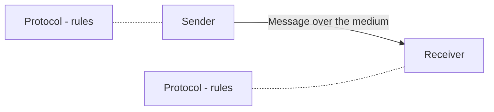

1. **Message** — the information to be sent: text, numbers, images, audio or video.
2. **Sender** — the device that sends the message (computer, phone, camera...).
3. **Receiver** — the device that receives it.
4. **Transmission medium** — the physical path: twisted-pair wire, coaxial cable, fiber, radio waves.
5. **Protocol** — the set of rules both sides agree on. Without a common protocol, two devices may be *connected* but not *communicating* — like a French speaker talking to someone who only understands Japanese.

### Four characteristics of an effective system
- **Delivery** — data must reach the correct destination, and only that destination.
- **Accuracy** — data altered in transit and left uncorrected is useless.
- **Timeliness** — late data is useless, especially for audio and video. Delivering data as fast as it is produced, in order, is called **real-time** transmission.
- **Jitter** — the *variation* in packet arrival time. If video packets are sent every 30 ms but some arrive after 30 ms and others after 40 ms, the video looks uneven. Low average delay is not enough; it must also be consistent.

### Data flow: simplex, half-duplex, full-duplex

| Mode | Direction | Example |
|---|---|---|
| **Simplex** | One way only | Keyboard to computer, traditional monitor, TV broadcast |
| **Half-duplex** | Both ways, but one at a time | Walkie-talkie, CB radio |
| **Full-duplex** | Both ways at the same time | Telephone call |

In half-duplex the whole capacity of the channel is used by whichever side is sending. In full-duplex the capacity is shared between the two directions (either two physical paths, or one path divided between the directions).

### Network criteria
A network is judged on three things:
- **Performance** — measured by **transit time** (time for a message to travel from one device to another) and **response time** (time between a request and its response). Performance is usually expressed as **throughput** and **delay**. The two pull against each other: pushing more data into the network raises throughput but also raises delay because of congestion.
- **Reliability** — how often failures happen, how long a link takes to recover, and how robust the network is in a catastrophe.
- **Security** — protecting data from unauthorized access and damage, and having policies to recover from breaches.

### Type of connection
- **Point-to-point** — a dedicated link between exactly two devices; the whole capacity is reserved for them (for example a TV remote and the TV).
- **Multipoint (multidrop)** — more than two devices share a single link. If they use it at the same moment the sharing is *spatial*; if they take turns it is *temporal* (time-shared).

### Common network threats mentioned in interviews
- **Phishing** — a social-engineering attack where the attacker pretends to be a trusted entity (an email from "your bank") to steal passwords or card numbers.
- **Botnet** — a network of infected machines controlled by an attacker, used for **DDoS (Distributed Denial of Service)** attacks, spam or data theft.

**Key points:**
- Five components: message, sender, receiver, medium, protocol.
- Effectiveness depends on delivery, accuracy, timeliness and jitter.
- Simplex = one way, half-duplex = both ways in turns, full-duplex = both ways at once.
- Throughput and delay usually trade off against each other.

=== Network Topologies: Mesh, Star, Bus, Ring and Hybrid
difficulty: easy
---
The **physical topology** of a network is the geometric arrangement of its links and nodes — how the devices are physically wired together. The four basic topologies are **mesh, star, bus and ring**, and real networks often combine them into a **hybrid**.

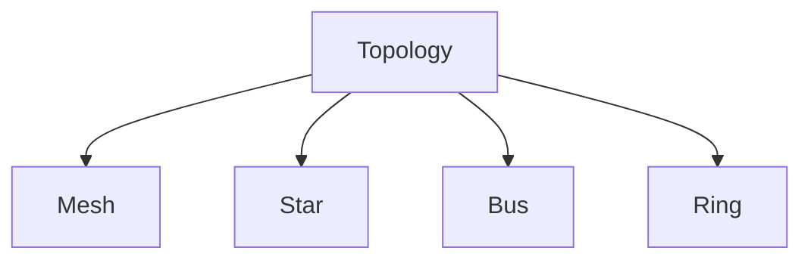

### Mesh
Every node has a **dedicated point-to-point link to every other node**.

In a **full mesh** of *n* nodes, the number of links is:

```calc
links = n(n - 1) / 2

Example: 5 computers  ->  5 x 4 / 2 = 10 links
         and every device needs n - 1 = 4 ports
```

A **partial mesh** connects only some nodes to several others — a cheaper way to get redundancy.

- **Advantages:** handles heavy traffic (many pairs can talk at once); one failed link or device does not bring the network down; dedicated links give privacy and make faults easy to locate.
- **Disadvantages:** expensive — lots of cable and ports; hard to install and maintain. Usually used for backbones, for example connecting core routers.

### Star
Every node connects to a **central device** — a hub, switch or computer. Nodes are not linked to each other directly; all traffic goes through the centre.

- **Advantages:** easy to install and add devices; one failed cable affects only one node; centralized management. This is the most common LAN layout today (computers connected to a switch with RJ-45 cables).
- **Disadvantages:** the central device is a **single point of failure** — if it goes down, the whole network goes down; it also limits performance and the number of nodes.

### Bus
All devices are attached to **one long backbone cable** using drop lines and taps, with a **terminator** at each end.

- **Advantages:** easy to set up for small networks; needs less cable than star.
- **Disadvantages:** a break in the backbone splits or kills the network; hard to troubleshoot; performance drops as devices are added because all of them share the same cable and collisions increase. Used in early Ethernet (10Base5, 10Base2).

### Ring
Each device connects to exactly two neighbours, forming a **closed loop**. Data travels from node to node (usually in one direction — a **unidirectional** ring) until it reaches its destination; each node contains a repeater that regenerates the signal.

- **Advantages:** orderly access — packets flow one way, which reduces collisions (often controlled by a token); no central server needed.
- **Disadvantages:** a single broken link or failed node can disrupt the whole ring (unless a dual ring is used); adding or removing a node disturbs the network; every packet passes through intermediate nodes.

### Hybrid
A combination, for example a **star backbone whose branches are buses**, or several star networks joined by a mesh of routers. Most real-world networks are hybrids.

### Comparison

| Topology | Cables for n nodes | Single point of failure | Typical use |
|---|---|---|---|
| Mesh | n(n-1)/2 | None | WAN backbones |
| Star | n | Central hub/switch | Office and home LANs |
| Bus | 1 backbone + drops | Backbone cable | Old Ethernet |
| Ring | n | Any link (single ring) | Token Ring, FDDI, metro rings |

> Interview tip: do not confuse **physical** topology (how cables run) with **logical** topology (how data flows). A hub-based network is a physical star but behaves like a logical bus, because the hub repeats every signal to every port.

**Key points:**
- Full mesh needs n(n-1)/2 links — most reliable, most expensive.
- Star is the most common LAN topology; the central device is the weak point.
- Bus uses one shared backbone with terminators; a backbone break is fatal.
- Ring passes data around a loop; one break can stop a single ring.

=== Types of Networks: LAN, MAN, WAN and the Internet
difficulty: easy
---
Networks are classified mainly by the **geographical area** they cover, which also affects their speed, ownership, cost and the technologies they use.

### LAN — Local Area Network
- Covers a small area: a room, a building or a campus.
- Usually privately owned (by a company, school or home).
- High data rates (traditionally 10–100 Mbps, today 1–10 Gbps) with very low error rates because the distances are short.
- Used to share files, printers and applications. Example: a computer lab.
- Typical technology: Ethernet over twisted-pair (Cat 5/6) cable, connected through switches.

### MAN — Metropolitan Area Network
- Covers a city — roughly 5 to 50 km.
- Connects several LANs together so resources can be shared, for example the branches of a bank across one city, or a city-wide cable TV network.
- Can be owned by an organization or a service provider.

### WAN — Wide Area Network
- Covers a country, a continent or the whole world.
- Connects many LANs and MANs, usually over leased lines, fiber, satellites and microwave relays operated by telecom companies.
- Lower speeds per user and higher error rates than a LAN; speed depends on the ISP.
- The **Internet** is the biggest example.

### Other types
- **PAN (Personal Area Network)** — devices around one person, for example a phone connected to earbuds and a smartwatch over Bluetooth.
- **WLAN (Wireless LAN)** — a LAN that uses radio waves (Wi-Fi) instead of cables.
- **SAN (Storage Area Network)** — a dedicated high-speed network (often fiber) connecting servers to storage devices, used for backups and mirroring.

| | LAN | MAN | WAN |
|---|---|---|---|
| Area | Building / campus | City | Country / world |
| Ownership | Private | Private or public | Usually public / leased |
| Speed | Highest | Medium | Lower (per link) |
| Error rate | Lowest | Medium | Highest |
| Example | College lab | City cable network | Internet |

### Internet vs internet
An **internet** (small *i*) is any two or more networks that can communicate. **The Internet** (capital *I*) is the worldwide internet built on TCP/IP.

**A short history:** in the 1960s ARPA (part of the US Department of Defense) funded **ARPANET** so that research computers from different manufacturers could share results. In 1969 four nodes (UCLA, UCSB, SRI and the University of Utah) were connected through *Interface Message Processors (IMPs)*. In 1973 Vint Cerf and Bob Kahn described the protocols for end-to-end delivery, later split into **TCP** (reliability, segmentation) and **IP** (routing datagrams) — the **TCP/IP** suite.

### The Internet today: a hierarchy of ISPs

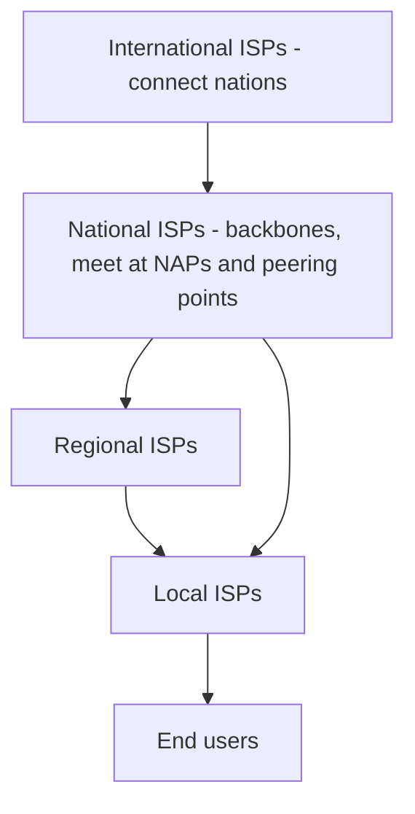

- **International ISPs** connect countries.
- **National ISPs** run backbone networks; they interconnect at **NAPs (Network Access Points)** or private **peering points**.
- **Regional ISPs** connect to one or more national ISPs.
- **Local ISPs** give service directly to end users — this can be a company, a college or a home broadband provider.

The Internet today is run by private companies, not by any government.

**Key points:**
- LAN < MAN < WAN in area; speed and reliability generally go the other way.
- PAN, WLAN and SAN are specialized variants.
- The Internet is a network of networks connected through a hierarchy of ISPs.
- TCP/IP grew out of ARPANET research in the 1970s.

=== Transmission Media: Guided and Unguided
difficulty: easy
---
A **transmission medium** is anything that carries information from a source to a destination. It sits below the physical layer. Media are divided into **guided (wired)** media, where signals travel along a physical path, and **unguided (wireless)** media, where electromagnetic waves travel through free space.

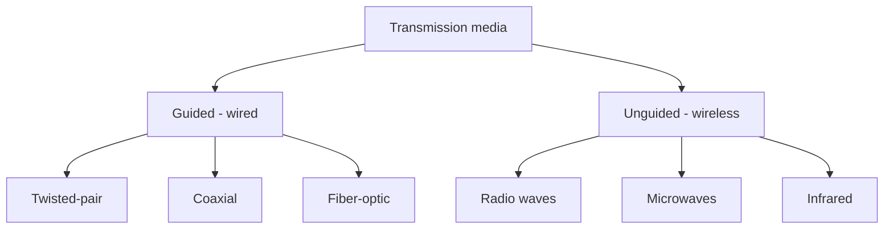

### Twisted-pair cable
Two insulated copper conductors **twisted together**. One carries the signal, the other is a ground reference. The twisting makes both wires pick up roughly the same noise, so the receiver (which looks at the difference between them) cancels most of it.
- **UTP (Unshielded Twisted Pair)** — the most common; cheap and flexible. Connector: **RJ-45**.
- **STP (Shielded Twisted Pair)** — adds a metal foil or braid around the pairs to block noise and crosstalk; bulkier and more expensive.
- **Uses:** telephone lines, Ethernet LANs (10Base-T, 100Base-T, 1000Base-T).

### Coaxial cable
A central copper conductor, surrounded by insulation, then an outer conductor of metal braid or foil (which also acts as a shield), then a plastic cover. It carries **higher frequencies** than twisted pair. Connector: **BNC**.
- **Uses:** cable TV, older telephone trunks, traditional Ethernet (10Base2, 10Base5).

### Fiber-optic cable
Carries signals as **light** through a glass or plastic **core** surrounded by a less dense **cladding**. Light that hits the core-cladding boundary at more than the **critical angle** is totally reflected, so it bounces along the core.

**Propagation modes:**
- **Multimode step-index** — many beams take different paths; the core density is constant and changes suddenly at the cladding. Different path lengths spread the pulse out (distortion).
- **Multimode graded-index** — the core density decreases gradually from the centre, bending the beams smoothly and reducing distortion.
- **Single-mode** — a very thin core and a highly focused source (laser) so light travels almost straight; least distortion, used for long distances.

Connectors: **SC**, **ST** and **MT-RJ**.

**Advantages of fiber:** much higher bandwidth; low attenuation (signals can run about 50 km without regeneration, versus repeaters every ~5 km for copper); immune to electromagnetic interference; resistant to corrosion; light; very hard to tap.
**Disadvantages:** expensive cable and interfaces; installation and maintenance need skill; light travels one way, so two fibers are needed for two-way communication.
**Uses:** Internet backbones, cable TV hybrid networks, Fast/Gigabit Ethernet (100Base-FX, 1000Base-X).

### Unguided media (wireless)
Signals can travel by **ground propagation** (below 2 MHz, following the earth's curve), **sky propagation** (2–30 MHz, bouncing off the ionosphere) or **line-of-sight propagation** (above 30 MHz, straight between antennas).

| | Radio waves | Microwaves | Infrared |
|---|---|---|---|
| Frequency | 3 kHz – 1 GHz | 1 – 300 GHz | 300 GHz – 400 THz |
| Direction | Omnidirectional | Unidirectional | Line of sight |
| Antennas | Omnidirectional | Parabolic dish, horn | — |
| Walls | Can penetrate | Partly | Cannot penetrate |
| Typical use | AM/FM radio, TV, paging (multicast) | Cell phones, satellites, wireless LANs (unicast) | TV remotes, short-range links |

- **Radio waves** spread in all directions, so sender and receiver need not be aligned — but nearby transmitters on the same frequency interfere.
- **Microwaves** must be aimed, so pairs of antennas can be placed side by side without interfering.
- **Infrared** cannot pass through walls, which prevents interference between rooms (your remote does not change your neighbour's TV), but sunlight interferes with it outdoors.

**Key points:**
- Guided: twisted pair (cheapest), coax (higher frequency), fiber (highest bandwidth, light-based).
- Twisting cancels noise; shielding blocks it further.
- Fiber relies on total internal reflection; single-mode is best for long distances.
- Radio = omnidirectional, microwave = directional, infrared = short-range line of sight.

=== Switching: Circuit, Packet (Datagram and Virtual Circuit) and Message Switching
difficulty: medium
---
Connecting every pair of devices directly (a full mesh) is impractical in large networks. Instead, devices are connected through **switches** — nodes that can create temporary connections between the devices attached to them. How those switches move data defines three kinds of switched network:

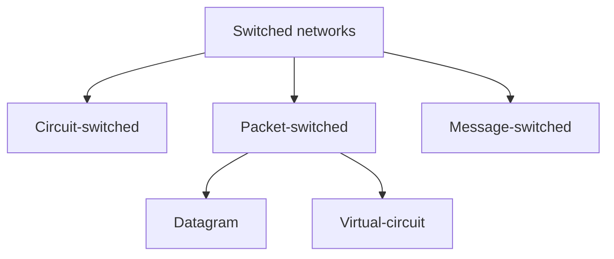

### Circuit switching
A **dedicated path** is reserved between the two ends for the whole conversation. Each link is divided into channels (using FDM or TDM) and one channel on each link is reserved.

Three phases:
1. **Setup** — the source sends a request with the destination address; each switch reserves a channel and forwards the request; the destination's acknowledgement travels back. Only then is the circuit established.
2. **Data transfer** — data flows along the reserved path without being stored at the switches.
3. **Teardown** — a signal releases the resources at every switch.

- **Efficiency is low** — the resources stay reserved even when nobody is talking.
- **Delay is minimal and constant** during transfer, after the initial setup delay.
- Used in the **traditional telephone network**, at the physical layer.

### Packet switching — datagram approach
Data is split into **packets**, and resources are allocated **on demand**, first come first served. In a **datagram network** each packet is treated **independently**:
- Every packet carries the **full destination address**.
- Routers look up the destination in a **routing table** and forward the packet. Different packets of the same message may take **different routes** and **arrive out of order** — the upper layers reorder them.
- No setup or teardown; switches keep **no state** about connections — hence "connectionless".
- More efficient than circuit switching, but each packet may wait in queues, so delay is variable.
- **The Internet uses datagram switching at the network layer (IP).**

### Packet switching — virtual-circuit approach
A **cross between** circuit switching and datagrams:
1. Like circuit switching, there are **setup, data transfer and teardown** phases, and **all packets follow the same path**.
2. Like datagrams, data is sent in packets with a header — but the header carries a small **Virtual Circuit Identifier (VCI)**, not the full address.
3. A VCI has **local (per-link) meaning**. Each switch keeps a table (incoming port, incoming VCI → outgoing port, outgoing VCI) and **rewrites the VCI** as it forwards each frame.

```calc
Switch table entry:   in-port 1, in-VCI 14   ->   out-port 3, out-VCI 22

Frame arrives on port 1 with VCI 14
-> switch looks up (1, 14), changes VCI to 22, sends it out of port 3
```

During **setup**, each switch fills in the incoming port, incoming VCI and outgoing port; the destination's **acknowledgement** travelling back fills in each switch's outgoing VCI. Teardown deletes the entries. Virtual circuits are used in switched WANs such as Frame Relay, ATM and MPLS (label switching).

### Message switching
The whole message is sent hop by hop; each node **stores the complete message** and then forwards it (store-and-forward at message level). Historic (telegraph); not used for data networks today because large messages need large buffers and add long delays.

### Datagram vs virtual-circuit network

| Issue | Datagram | Virtual circuit |
|---|---|---|
| Circuit setup | Not needed | Required |
| Addressing | Full source and destination in every packet | Short VC number |
| State in routers | None | Table entry per connection |
| Routing | Each packet routed independently | Route chosen at setup; all packets follow it |
| Router failure | Only packets in the failed router are lost | All VCs through it are terminated |
| Quality of service / congestion control | Difficult | Easier — resources can be reserved per VC |

**Key points:**
- Circuit switching reserves resources for the whole call: constant delay, poor efficiency (telephone).
- Datagram packet switching: independent packets, no state, possible reordering (Internet/IP).
- Virtual circuits: fixed path set up in advance, VCIs rewritten at each switch.
- Message switching stores whole messages; it is mostly historical.

=== The OSI Reference Model: Seven Layers
difficulty: easy
---
The **OSI (Open Systems Interconnection)** model was created by the **ISO (International Organization for Standardization)** as a reference framework that explains how different networking technologies work together. It is a *model*, not a protocol suite that implementations must follow — but it gives everyone a common vocabulary, which is why every networking interview starts here.

It has **seven layers**. Each layer provides services to the layer above and uses the services of the layer below.

| # | Layer | Data unit (PDU) | Main job | Devices / examples |
|---|---|---|---|---|
| 7 | Application | Data | Network services for applications | HTTP, FTP, SMTP, DNS |
| 6 | Presentation | Data | Translation, compression, encryption | SSL/TLS, JPEG, ASCII |
| 5 | Session | Data | Set up, manage, end dialogues; checkpoints | RPC, NetBIOS |
| 4 | Transport | Segment | Process-to-process delivery, reliability | TCP, UDP, ports |
| 3 | Network | Packet | Logical addressing, routing across networks | IP, router |
| 2 | Data link | Frame | Node-to-node delivery, MAC addresses, error detection | Ethernet, PPP, switch, bridge |
| 1 | Physical | Bits | Transmit raw bits over the medium | Cables, hub, repeater |

**Mnemonics:** top to bottom — "**A**ll **P**eople **S**eem **T**o **N**eed **D**ata **P**rocessing"; bottom to top — "**P**lease **D**o **N**ot **T**hrow **S**ausage **P**izza **A**way".

### What each layer does
- **Physical** — converts frames into signals (electrical, light, radio); defines cables, connectors, voltages, bit rates, encoding and data-flow mode.
- **Data link** — groups bits into **frames**, adds **physical (MAC) addresses**, detects errors, controls flow and access to a shared medium. Works only between **adjacent** nodes — it cannot move frames across routers. It has two sublayers: **LLC (Logical Link Control)** for flow and error control, and **MAC (Media Access Control)** for deciding who may use the medium and for frame synchronization.
- **Network** — **end-to-end** delivery of packets across many networks using **logical (IP) addresses** and **routing**.
- **Transport** — **process-to-process** delivery using **port numbers**; segmentation and reassembly, sequencing, and (with TCP) reliability, flow control and error control. UDP gives fast, connectionless delivery without guarantees.
- **Session** — controls the dialogue (who talks when, simplex/half/full duplex), and adds **checkpoints** so a long transfer can resume after a failure.
- **Presentation** — makes data understandable to the receiver: **translation** between formats (e.g. character encodings), **compression** and **encryption**.
- **Application** — the interface for user applications: browsers use HTTP, email clients use SMTP to send and POP3/IMAP to read.

### Encapsulation
As data moves **down** the sender's stack, each layer adds its own **header** (the data link layer also adds a **trailer**). At the receiver each layer removes its header and passes the rest **up**. The header added by layer *n* is read only by layer *n* on the other side — this is called **peer-to-peer** communication between layers.

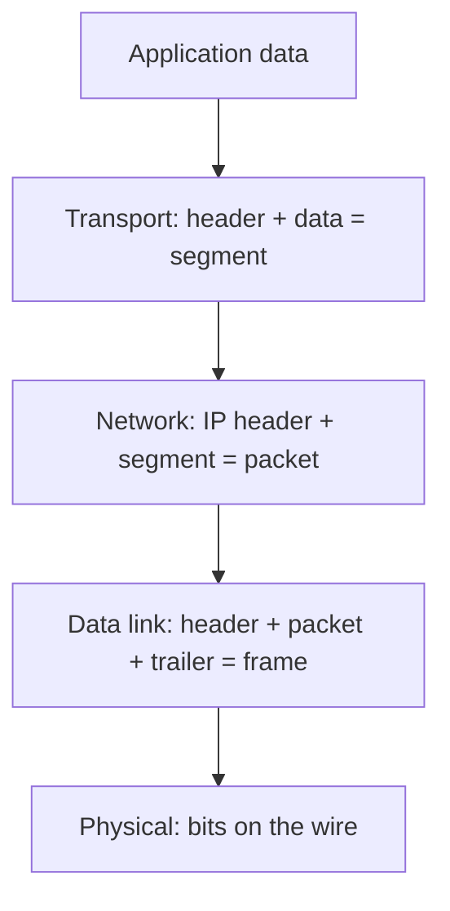

**Intermediate routers** process only the bottom three layers (physical, data link, network); the transport layer and above are handled only by the end hosts.

**Key points:**
- Seven layers: Physical, Data link, Network, Transport, Session, Presentation, Application.
- PDUs: bits, frames, packets, segments, data.
- Data link = hop-to-hop (MAC); Network = host-to-host (IP); Transport = process-to-process (ports).
- Each layer adds a header on the way down and removes it on the way up.

=== The TCP/IP Model and OSI vs TCP/IP
difficulty: easy
---
The **TCP/IP protocol suite** is the set of protocols the Internet actually runs on. Unlike OSI, it was built from working protocols first and the model was written afterwards to describe them. It is usually drawn with **four layers** (some books show five, splitting the bottom layer into physical and data link).

| TCP/IP layer | Equivalent OSI layers | Protocols | Address used |
|---|---|---|---|
| Application | Application, Presentation, Session | HTTP, FTP, SMTP, DNS, TELNET, SNMP, TFTP | Specific (e.g. URL, email) |
| Transport | Transport | TCP, UDP, SCTP | Port address |
| Internet (Network) | Network | IP, ICMP, IGMP, ARP, RARP | Logical (IP) address |
| Host-to-network (Network access) | Data link + Physical | Ethernet, Wi-Fi 802.11, Frame Relay, ATM | Physical (MAC) address |

### The layers
- **Application layer** — the rules for specific network applications: **FTP** for file transfer, **TELNET** for remote login, **SMTP** for mail, **HTTP** for the web, **DNS** for name lookup. It covers the jobs of OSI's application, presentation and session layers.
- **Transport layer** — **TCP** is connection-oriented: it sets up a *virtual* connection (no physical circuit exists), splits data into segments, reassembles and reorders them, retransmits lost data and gives a reliable byte stream. **UDP** is connectionless and unreliable but fast and simple.
- **Internet layer** — **IP** moves packets across network boundaries (routing). **ICMP** reports errors (ping uses it), **IGMP** handles multicast groups, **ARP** maps IP addresses to MAC addresses.
- **Host-to-network layer** — moves frames between adjacent nodes on the same LAN or link; TCP/IP does not define its own protocol here and runs over whatever the underlying network is.

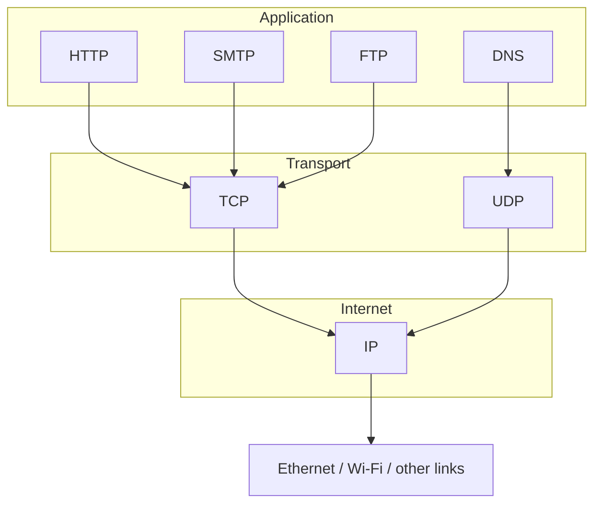

### OSI vs TCP/IP — the classic comparison

| OSI | TCP/IP |
|---|---|
| 7 layers | 4 layers |
| Reference model designed **before** the protocols | Protocols came **first**; the model describes them |
| Clearly separates **service, interface and protocol** | Does not clearly distinguish them |
| Network layer supports connectionless and connection-oriented; transport is connection-oriented only | Network layer is connectionless only (IP); transport supports both (TCP and UDP) |
| Strict layering | Looser layering — protocols can sometimes skip layers |
| Protocols are well hidden and replaceable | Hard to replace a core protocol such as IP |
| Mostly used for teaching and troubleshooting | Used in the real Internet |

### Why both matter
In practice everyone *runs* TCP/IP but *talks* in OSI terms — "a layer 2 switch", "a layer 3 router", "a layer 7 load balancer". Being able to map one model onto the other is exactly what interviewers check.

### Addresses at each level
- **Physical (MAC) address** — 48 bits, identifies a network card on a local link.
- **Logical (IP) address** — identifies a host on the internet; used for routing.
- **Port address** — 16 bits, identifies a process on a host (80 for HTTP, 25 for SMTP...).
- **Specific address** — user-friendly names like a URL or an email address, converted to the others by DNS and the protocols below.

**Key points:**
- TCP/IP: Application, Transport, Internet, Host-to-network.
- TCP/IP's application layer = OSI's application + presentation + session.
- OSI is a design model; TCP/IP is what the Internet actually uses.
- Each level has its own address: MAC, IP, port, and names/URLs.

=== Network Devices: Repeater, Hub, Bridge, Switch, Router and Gateway
difficulty: easy
---
"What is the difference between a hub, a switch and a router?" is one of the most common networking interview questions. The cleanest way to answer is by the **OSI layer** each device works at — that tells you what information it can look at and therefore how smart it is.

| Device | OSI layer | Looks at | Forwards to | Collision domains | Broadcast domains |
|---|---|---|---|---|---|
| Repeater | 1 Physical | Signal only | All (other) side | One | One |
| Hub | 1 Physical | Signal only | **All ports** | One for all ports | One |
| Bridge | 2 Data link | MAC address | Correct segment | One per port | One |
| Switch | 2 Data link | MAC address | **Only the destination port** | One per port | One (per VLAN) |
| Router | 3 Network | IP address | Best next hop | One per port | **One per port** |
| Gateway | Up to 7 | Whole message | Another protocol/network | — | — |

### Repeater (layer 1)
A signal weakens (**attenuates**) as it travels. A repeater **regenerates** the original bit pattern and sends it on, extending the length of a segment. It does not understand frames or addresses. (It *regenerates*, unlike an amplifier, which would also amplify the noise.)

### Hub (layer 1)
A **multiport repeater**. Whatever arrives on one port is copied to **every** other port. All devices on a hub share one collision domain and the bandwidth, so performance drops as devices are added. A hub-based network is a physical star but a logical bus. Hubs are obsolete today.

### Bridge (layer 2)
Connects two LAN segments and **filters** traffic using MAC addresses: a frame is forwarded only if its destination is on the other segment. This splits the network into separate collision domains.
- **Learning (transparent) bridge** — builds its forwarding table automatically by looking at the **source** MAC address of every incoming frame ("A is on port 1"). Frames to an unknown destination are flooded.
- **Spanning tree bridges** — when bridges are connected redundantly, frames could loop forever. The **Spanning Tree Protocol (STP)** selects a root bridge and blocks redundant ports so the active topology is a loop-free tree.

### Switch (layer 2)
Essentially a **multiport bridge** implemented in hardware. It learns MAC addresses and sends each frame **only out of the port** where the destination lives. Every port is its own collision domain, so devices can transmit simultaneously in full-duplex. All ports are still in the same broadcast domain (unless VLANs are used). *Layer 3 switches* can also route.

### Router (layer 3)
Connects **different networks** and forwards packets based on **IP addresses** using a **routing table** filled in by routing protocols (RIP, OSPF, BGP). Routers **do not forward broadcasts**, so each interface is a separate broadcast domain. Your home "Wi-Fi router" combines a router, a switch and a wireless access point.

### Gateway (up to layer 7)
Connects networks that use **different protocols** and translates between them (for example between an email system and SMS, or between different network architectures). In everyday TCP/IP language, the "default gateway" simply means the router a host sends traffic to when the destination is outside its own network.

### Collision domain vs broadcast domain
- A **collision domain** is the set of devices whose transmissions can collide with each other. Hubs extend it; switches and bridges break it up (one per port).
- A **broadcast domain** is the set of devices that receive a broadcast frame. Only routers (or VLANs) break it up.

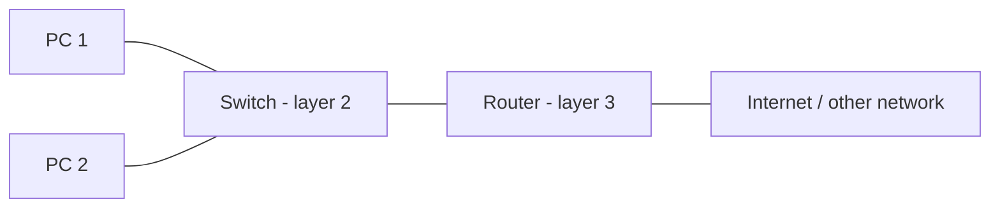

**Key points:**
- Hub = layer 1, repeats to all ports. Switch = layer 2, forwards by MAC to one port. Router = layer 3, forwards by IP between networks.
- Switches break collision domains; routers break broadcast domains.
- Learning bridges/switches learn from source MAC addresses; STP removes loops.
- Gateways translate between different protocols.

=== Data Link Layer Functions and Framing (Byte and Bit Stuffing)
difficulty: medium
---
The **data link layer** takes the raw, possibly error-prone bit stream offered by the physical layer and turns it into a reliable link between **two adjacent nodes**.

### Functions (services) of the data link layer
1. **Services to the network layer:**
   - *Unacknowledged connectionless* — just send frames; suited to low-error links and real-time traffic (Ethernet).
   - *Acknowledged connectionless* — each frame is acknowledged and resent on timeout; useful on unreliable links like Wi-Fi.
   - *Acknowledged connection-oriented* — frames arrive exactly once and in order; for long unreliable links such as satellite channels.
2. **Framing** — divide the bit stream into manageable units called frames.
3. **Physical addressing** — add the sender and receiver MAC addresses in the frame header.
4. **Flow control** — stop a fast sender from overflowing a slow receiver's buffer.
5. **Error control** — detect (and possibly correct or retransmit) damaged, lost or duplicate frames, using a trailer such as a CRC.
6. **Access control** — decide which device may use a shared link at a given moment (the MAC sublayer).

The data link layer is split into the **LLC (Logical Link Control)** sublayer — flow and error control — and the **MAC (Media Access Control)** sublayer — access to the shared medium.

### Why framing is needed
The physical layer only delivers bits, and it does not guarantee them: bits may be lost, added or flipped. The data link layer breaks the stream into **frames** and adds a **checksum** to each one. If the checksum recomputed at the receiver does not match, the frame is known to be damaged. But for this to work, the receiver must be able to tell **where each frame starts and ends**. Four methods are used.

### 1. Character count
A field in the header gives the **number of characters in the frame**. The receiver reads the count and knows where the frame ends.

```calc
Frames of sizes 5, 5, 8 and 8:
| 5 1 2 3 4 | 5 6 7 8 9 | 8 0 1 2 3 4 5 6 | 8 7 8 9 0 1 2 3 |
```

**Problem:** if a count is corrupted (say the second 5 becomes a 7), the receiver loses synchronization and can never find the start of the next frame — even asking for a retransmission does not help, because it does not know how many characters to skip. So this method is rarely used alone.

### 2. Flag bytes with byte stuffing
Each frame starts and ends with a special **FLAG** byte. If the receiver gets lost, it simply searches for the next flag.

But the flag's bit pattern might occur *inside the data*. The fix: the sender inserts an **escape byte (ESC)** before every accidental FLAG — and before every accidental ESC too. The receiver removes the escape bytes. This is **byte (character) stuffing**.

```calc
Original data            After stuffing
A FLAG B         ->      A ESC FLAG B
A ESC B          ->      A ESC ESC B
A ESC FLAG B     ->      A ESC ESC ESC FLAG B
A ESC ESC B      ->      A ESC ESC ESC ESC B
```

A FLAG preceded by ESC is data; a FLAG without ESC is a frame boundary. Disadvantage: it is tied to 8-bit characters.

### 3. Starting and ending flags with bit stuffing
Each frame begins and ends with the bit pattern **01111110** (used by HDLC and PPP). To stop this pattern appearing in the data, the sender **inserts a 0 after every five consecutive 1s** in the data. The receiver deletes any 0 that follows five consecutive 1s. Frames can then contain any number of bits, not just whole bytes.

```calc
Original data:   011011111111111111110010
On the line:     011011111011111011111010010
                          ^     ^     ^      (stuffed 0 bits)
After destuffing: 011011111111111111110010
```

If the data itself contains 01111110, it is sent as 011111010 and restored by the receiver. Because six 1s in a row can now only appear in a flag, the receiver can always find frame boundaries.

### 4. Physical layer coding violations
Possible only when the physical encoding has redundancy. In **Manchester encoding** a 1 is a high-low pair and a 0 a low-high pair, so every bit has a transition in the middle. The pairs **high-high** and **low-low** never occur in data, so they can mark frame boundaries.

In practice many protocols **combine** methods — for example a character count plus a flag — and accept a frame only if the delimiter is where the count says and the checksum is correct.

**Key points:**
- The data link layer provides framing, MAC addressing, flow control, error control and access control.
- Character count breaks badly if the count is corrupted.
- Byte stuffing inserts ESC before accidental FLAG/ESC bytes.
- Bit stuffing inserts a 0 after five consecutive 1s; the flag is 01111110.

=== Error Detection: Parity, Checksum and CRC
difficulty: medium
---
During transmission, noise can flip bits — a 0 becomes 1 or a 1 becomes 0. A **single-bit error** changes one bit; a **burst error** changes two or more bits, usually consecutive ones (more common, because noise lasts longer than one bit time). The basic idea of all error detection is **redundancy**: the sender adds extra bits computed from the data, and the receiver recomputes them to check.

### 1. Simple parity check
The sender adds one **parity bit** so that the total number of 1s is **even** (even parity) or **odd** (odd parity).

```calc
Data: 100011  -> three 1s (odd)  -> even-parity bit = 1
Sent: 100011 1  -> four 1s (even)
Receiver counts 1s: even -> accept, odd -> reject
```

It detects **all single-bit errors** and any odd number of flipped bits, but **misses any even number** of errors (two flips keep the parity unchanged).

### 2. Two-dimensional parity
Data is arranged in rows; a parity bit is computed for **each row and each column**, and the column parities are sent as an extra row. This detects all 1-, 2- and 3-bit errors and most burst errors, and can even locate (and correct) a single-bit error at the intersection of the failing row and column. It still misses some patterns — for example four errors at the corners of a rectangle.

### 3. Checksum (used by IP, TCP, UDP)
1. The sender divides the data into *k* segments of *m* bits.
2. It adds them using **one's complement arithmetic** — any carry out of the top bit is wrapped around and added back.
3. It **complements** the sum; the result is the checksum, sent with the data.
4. The receiver adds all segments **including** the checksum and complements the result. If it is **all 0s**, the data is accepted.

```calc
Data (k = 4, m = 8): 10011001  11100010  00100100  10000100

Sender:
  10011001 + 11100010            = 1 01111011 -> wrap carry -> 01111100
  01111100 + 00100100            = 10100000
  10100000 + 10000100            = 1 00100100 -> wrap carry -> 00100101
  Sum      = 00100101
  Checksum = complement = 11011010

Receiver:
  sum of the four segments       = 00100101
  00100101 + 11011010 (checksum) = 11111111
  complement                     = 00000000  -> accept
```

Checksums are simple and fast in software, but weaker than CRC (for example, swapping two segments does not change the sum).

### 4. Cyclic Redundancy Check (CRC)
CRC is based on **binary (modulo-2) division**, where subtraction is just **XOR** with no borrows. Sender and receiver agree on a **generator** (divisor) of *n* bits, usually written as a polynomial.

**Sender:**
1. Append **n − 1 zeros** to the data.
2. Divide by the generator using modulo-2 division.
3. The **remainder** (n − 1 bits) is the CRC; it replaces the appended zeros.

**Receiver:** divide the whole received frame by the same generator. Remainder **0** → accept; otherwise → reject.

```calc
Data:      1010000
Generator: x^3 + 1  =  1001   (4 bits, so append 3 zeros)

Dividend:   1010000000
  1010 XOR 1001 = 0011 ... continue the long division ...
Remainder:  011

Transmitted frame: 1010000 011  =  1010000011

Receiver: 1010000011 / 1001  ->  remainder 000  -> no error detected
```

Why CRC is preferred in hardware (Ethernet uses **CRC-32**):
- It detects **all single-bit errors**, **all double-bit errors** (for suitable generators), **all odd numbers of errors** (if the generator has the factor x + 1), and **all burst errors** shorter than or equal to the CRC length.
- It is very cheap to compute in hardware with shift registers and XOR gates.

### Where is error detection done?
At the **data link layer** (CRC in the frame trailer) for each hop, and again end-to-end at the **transport layer** (TCP/UDP checksum), because errors can also occur inside routers.

**Key points:**
- Parity detects single-bit (odd-count) errors only.
- 2-D parity catches more patterns and can correct a single-bit error.
- Checksum: one's complement sum, complemented; receiver's result must be all 0s.
- CRC: append n−1 zeros, divide by the generator with XOR, send the remainder; receiver checks for zero remainder.

=== Error Correction: Hamming Code
difficulty: hard
---
Error **detection** tells the receiver that something is wrong; error **correction** also tells it **which bit** is wrong so it can be fixed without retransmission.

There are two strategies:
- **Backward error correction (retransmission / ARQ)** — the receiver detects the error and asks the sender to resend. Cheap in extra bits, but needs a return channel and costs time.
- **Forward error correction (FEC)** — the sender adds enough redundancy for the receiver to correct errors by itself. Used when retransmission is impossible or slow (satellites, deep-space links, live video, memory chips with ECC).

A single parity bit can detect but **not correct** an error. To correct a single-bit error, the redundancy must be able to point to any of the *d + r* bit positions — or say "no error". With *r* redundant bits we can express 2ʳ states, so we need:

```calc
2^r >= d + r + 1        (d = data bits, r = redundant bits)

d = 4:  r = 2 -> 4 >= 7 ? no
        r = 3 -> 8 >= 8 ? yes   ->  r = 3, total bits = 7  (Hamming(7,4))
```

### Hamming code — the algorithm (R. W. Hamming)
1. Number the bit positions 1, 2, 3, ... from the right.
2. Put the **redundant (parity) bits at positions that are powers of 2**: 1, 2, 4, 8, ...
3. Put the data bits in the remaining positions.
4. Each parity bit **r_k** checks every position whose binary representation has a 1 in bit *k*:
   - r1 (position 1) checks positions 1, 3, 5, 7 (binary ...xx1)
   - r2 (position 2) checks positions 2, 3, 6, 7 (binary ...x1x)
   - r4 (position 4) checks positions 4, 5, 6, 7 (binary ...1xx)
5. Set each parity bit to make its group **even** (even parity).

### Worked example: send data 1010

```calc
Positions:  7   6   5   4   3   2   1
Data:       1   0   1   r4  0   r2  r1

r1: positions 1,3,5,7 -> data bits 0, 1, 1  -> two 1s (even)  -> r1 = 0
r2: positions 2,3,6,7 -> data bits 0, 0, 1  -> one 1  (odd)   -> r2 = 1
r4: positions 4,5,6,7 -> data bits 1, 0, 1  -> two 1s (even)  -> r4 = 0

Transmitted codeword (7..1):  1 0 1 0 0 1 0
```

### Detecting and correcting an error
Suppose bit 4 is flipped during transmission, so the receiver gets **1 0 1 1 0 1 0**. The receiver recomputes each parity check over its group (including the parity bit itself):

```calc
Received (7..1): 1 0 1 1 0 1 0

Check r1 (1,3,5,7): bits 0,0,1,1 -> even -> 0
Check r2 (2,3,6,7): bits 1,0,0,1 -> even -> 0
Check r4 (4,5,6,7): bits 1,1,0,1 -> odd  -> 1

Syndrome r4 r2 r1 = 1 0 0 = 4  ->  bit 4 is wrong; flip it back to 0
Corrected word: 1 0 1 0 0 1 0  ->  data 1010
```

The beauty of the design: the failing checks, read as a binary number, **directly give the position** of the wrong bit. A syndrome of 000 means no error.

### Limits and the idea of Hamming distance
- The **Hamming distance** between two codewords is the number of bit positions in which they differ.
- To **detect** up to *s* errors the minimum distance between valid codewords must be at least *s + 1*; to **correct** up to *t* errors it must be at least *2t + 1*.
- Basic Hamming(7,4) has minimum distance 3: it corrects any **single-bit** error but cannot correct two. Adding one overall parity bit (SECDED) lets it correct one error and detect two — this is what ECC memory uses.

**Key points:**
- Correction needs to locate the error: 2ʳ ≥ d + r + 1 redundant bits.
- Parity bits sit at positions 1, 2, 4, 8, ...; each checks positions with that bit set in their index.
- The syndrome (failed checks as a binary number) is the position of the error.
- Hamming(7,4): 4 data bits, 3 parity bits, corrects 1-bit errors.

=== Flow and Error Control: Stop-and-Wait and Stop-and-Wait ARQ
difficulty: medium
---
**Flow control** makes sure a fast sender does not overwhelm a slow receiver. **Error control** makes sure damaged or lost frames are detected and resent. Data link protocols are usually explained in increasing order of realism:

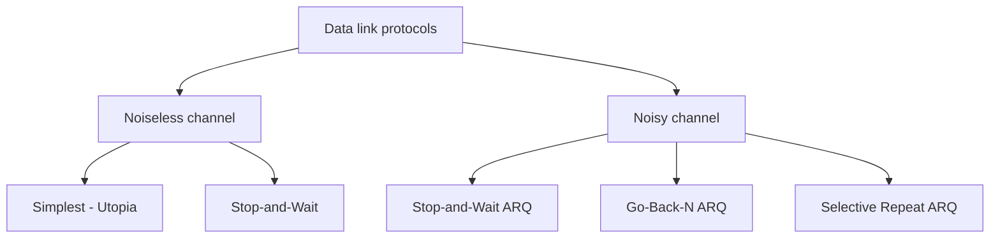

### 1. The simplest protocol ("Utopia")
The sender keeps sending frames; the receiver is always ready, has infinite buffer space, processing time is zero and the channel never loses or damages frames. It has **no flow control and no error control** — unrealistic, but it is the starting point.

### 2. Stop-and-Wait (noiseless channel)
The sender sends **one frame and waits for an acknowledgement (ACK)** before sending the next. The ACK is the receiver saying "OK, go ahead", so this adds **flow control**. Data frames go one way; small ACK frames come back.

### 3. Stop-and-Wait ARQ (noisy channel)
**ARQ = Automatic Repeat reQuest.** Now frames can be corrupted or lost, so the protocol adds error control:
- **Corrupted frames** are detected with redundancy bits (e.g. CRC) and **silently discarded** — the receiver's silence signals the problem.
- The sender **keeps a copy** of the sent frame and **starts a timer**. If no ACK arrives before the timer expires, it **resends** the frame.
- Frames are **numbered** so the receiver can recognise **duplicates** (which happen when the frame arrived but the ACK was lost). Because only one frame is outstanding at a time, a 1-bit sequence number is enough: frames are numbered **0, 1, 0, 1, ...** (modulo-2).
- The **ACK number announces the next frame expected**, also modulo 2: after receiving frame 0 the receiver sends ACK 1.

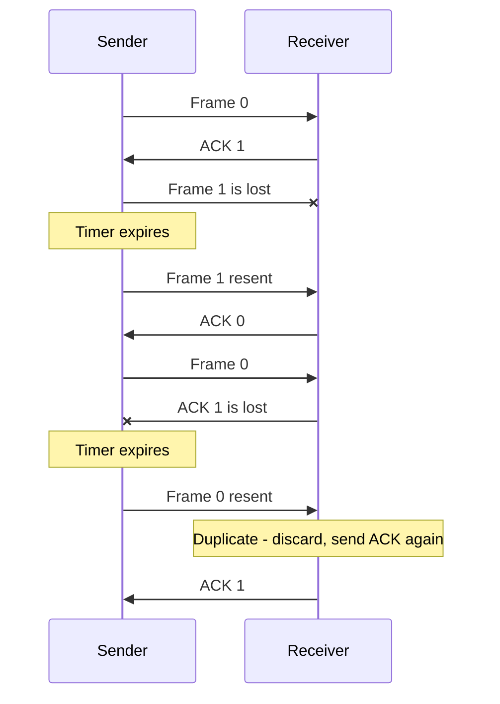

### The efficiency problem: bandwidth-delay product
Stop-and-Wait leaves the link idle while waiting for each ACK. The **bandwidth-delay product** tells you how many bits *could* be in flight during one round trip.

```calc
Link: 1 Mbps, round-trip time 20 ms, frames of 1000 bits

Bandwidth x delay = (1 x 10^6) x (20 x 10^-3) = 20,000 bits

Stop-and-Wait sends only 1000 bits per round trip:
Utilization = 1000 / 20,000 = 5%
```

On a fast or long link (high bandwidth or long delay), Stop-and-Wait wastes most of the capacity. The fix is to let **several frames be outstanding** at once — the **sliding window** protocols (Go-Back-N and Selective Repeat). In fact, **Stop-and-Wait ARQ is just a sliding window protocol with a window size of 1**.

### Piggybacking
In two-way communication, instead of sending separate ACK frames, a node can **attach the acknowledgement to its own outgoing data frame**. This "piggybacking" saves bandwidth and is used by sliding-window protocols and TCP.

**Key points:**
- Stop-and-Wait: one frame, then wait for an ACK — gives flow control.
- Stop-and-Wait ARQ adds a timer, a copy of the frame and modulo-2 sequence numbers.
- The ACK number is the number of the next frame expected.
- Utilization = frame size / bandwidth-delay product — very low on long or fast links.

=== Sliding Window Protocols: Go-Back-N and Selective Repeat ARQ
difficulty: hard
---
To keep the link busy, the sender must be allowed to send **several frames before receiving acknowledgements**. Sliding window protocols do this with a numbered **send window** at the sender and a **receive window** at the receiver.

If the sequence number field has **m bits**, sequence numbers go from **0 to 2ᵐ − 1** and then wrap around (modulo 2ᵐ). For m = 3 the numbers are 0–7; for m = 4 they are 0–15.

### Go-Back-N ARQ
**Send window** (size up to **2ᵐ − 1**). The sender keeps three variables: **Sf** (first outstanding frame), **Sn** (next frame to send) and **Ssize** (window size). The sequence numbers divide into four regions:

```calc
 already ACKed |  sent, not yet ACKed  |  can be sent  |  cannot be sent yet
               Sf                      Sn
```

When an ACK arrives, the window **slides** right over all acknowledged frames. **ACKs are cumulative**: ACK 4 means "I have received everything up to frame 3, send frame 4 next".

**Receive window** has **size 1**, with one variable **Rn** (next frame expected). Only the frame numbered Rn is accepted; **any out-of-order frame is discarded** (the receiver does not buffer it).

**Timer:** one timer for the oldest outstanding frame. When it expires, the sender **goes back and resends all outstanding frames** — that is where the name comes from.

```calc
Sender has sent frames 3, 4, 5, 6.  Frame 3 is lost.
Receiver discards 4, 5, 6 (out of order) and stays silent.
Timer for frame 3 expires -> sender resends 3, 4, 5, 6.
```

Lost ACKs are cheap thanks to cumulative acknowledgement: if ACK 2 is lost but ACK 3 arrives, frames 1 and 2 are covered as well.

**Why the window must be at most 2ᵐ − 1:** with m = 2 (numbers 0–3), if the window were 4 and *all four ACKs* were lost, the sender would resend frame 0 — but the receiver is now expecting the *new* frame 0 and would wrongly accept the duplicate. With a window of 3 this ambiguity cannot happen.

### Selective Repeat ARQ
Go-Back-N is wasteful on **noisy links**: one bad frame forces many good frames to be resent. Selective Repeat **resends only the damaged or lost frame**.
- The **receive window** is the same size as the send window, and the receiver **buffers out-of-order frames** until the missing ones arrive — but it still **delivers data to the network layer in order**.
- Each outstanding frame has **its own timer**.
- The receiver can send a **NAK (negative acknowledgement)** for a missing frame to trigger a quick resend.
- An ACK is sent when a group of frames is delivered; one ACK can cover several frames.
- **Window size must be at most 2ᵐ⁻¹** (half the sequence space) for both windows. Otherwise, after lost ACKs, a retransmitted old frame could fall inside the receiver's new window and be accepted as new data.

```calc
m = 3  (sequence numbers 0..7)
Go-Back-N:         send window <= 2^3 - 1 = 7,  receive window = 1
Selective Repeat:  send window = receive window <= 2^(3-1) = 4
```

### Comparison

| | Stop-and-Wait ARQ | Go-Back-N ARQ | Selective Repeat ARQ |
|---|---|---|---|
| Send window | 1 | up to 2ᵐ − 1 | up to 2ᵐ⁻¹ |
| Receive window | 1 | 1 | up to 2ᵐ⁻¹ |
| Out-of-order frames | — | Discarded | Buffered |
| On loss, resend | That frame | That frame and all after it | Only that frame |
| Timers | 1 | 1 (oldest frame) | One per frame |
| Receiver complexity | Simple | Simple | Complex (buffering, sorting) |
| Best for | Short, slow links | Low-error links | Noisy links |

### Piggybacking
In bidirectional communication, each data frame carries the acknowledgement for frames received in the other direction, so separate ACK frames are rarely needed. **TCP's sliding window** is a byte-oriented, variable-size mix of these ideas: cumulative ACKs like Go-Back-N, but out-of-order data is buffered like Selective Repeat.

**Key points:**
- With m-bit sequence numbers, numbers run 0 to 2ᵐ − 1.
- Go-Back-N: window ≤ 2ᵐ − 1, receiver window 1, resend everything from the lost frame.
- Selective Repeat: windows ≤ 2ᵐ⁻¹, buffers out-of-order frames, resends only lost ones.
- Stop-and-Wait is the special case with window size 1.

=== Multiple Access: Pure ALOHA and Slotted ALOHA
difficulty: medium
---
When many stations share **one broadcast link** (a multipoint link), the **MAC sublayer** needs a **multiple-access protocol** to decide who transmits when. These protocols fall into three families:

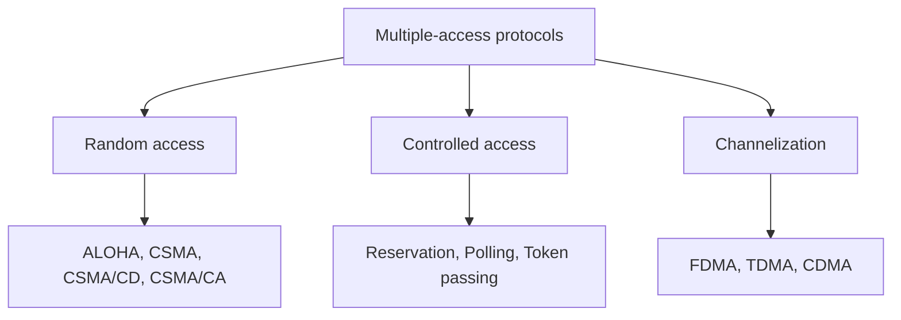

In **random access** (also called **contention**) methods, no station is in charge of the others; there is no schedule. Each station decides for itself when to send, and stations compete for the medium — so collisions are possible and must be handled.

### Pure ALOHA
The original protocol (University of Hawaii, 1970):
1. A station **sends a frame whenever it has one**.
2. It waits for an **acknowledgement**. If none arrives within a time-out (about 2 × the maximum propagation time), it assumes the frame collided.
3. It waits a **random back-off time** and resends. The randomness matters: if both colliding stations waited the same time, they would collide again. Using **binary exponential back-off**, after the K-th attempt it chooses R randomly between 0 and 2ᴷ − 1 and waits R × (propagation time or frame time).
4. After too many attempts (K_max, normally 15) it gives up.

**Vulnerable time.** Assume fixed-length frames, each taking **T_fr** seconds to send. A frame sent by A at time *t* collides with any frame started between **t − T_fr** (whose end overlaps A's start) and **t + T_fr** (whose start overlaps A's end):

```calc
Pure ALOHA vulnerable time = 2 x T_fr
```

**Throughput.** If G is the average number of frames generated per frame time:

```calc
Pure ALOHA:     S = G x e^(-2G)      maximum S = 0.184 at G = 1/2   (18.4%)
```

### Slotted ALOHA
Time is divided into **slots of length T_fr**, and a station may send **only at the beginning of a slot**. A station that misses the start must wait for the next slot, so a frame can collide only with frames that start in the *same* slot:

```calc
Slotted ALOHA vulnerable time = T_fr
Slotted ALOHA:  S = G x e^(-G)       maximum S = 0.368 at G = 1   (36.8%)
```

Halving the vulnerable time **doubles the maximum throughput**. The cost is that all stations need synchronized clocks.

### Worked example
A network transmits **200-bit frames** on a **200 kbps** shared channel, so **T_fr = 200 / 200,000 = 1 ms**.

**Collision-free requirement (pure ALOHA):** vulnerable time = 2 ms. No other station may start sending in the 1 ms before this station starts, nor during the 1 ms while it sends.

**Throughput when all stations together produce...**

```calc
                       G (frames per ms)   Pure ALOHA  S = G e^(-2G)    Slotted ALOHA  S = G e^(-G)
1000 frames/s          G = 1               0.135 -> about 135 frames/s  0.368 -> about 368 frames/s
 500 frames/s          G = 1/2             0.184 -> about  92 frames/s  0.303 -> about 152 frames/s
 250 frames/s          G = 1/4             0.152 -> about  38 frames/s  0.195 -> about  49 frames/s
```

Notice that pure ALOHA is best at G = 1/2 and slotted ALOHA at G = 1 — offering more load than that only produces more collisions.

| | Pure ALOHA | Slotted ALOHA |
|---|---|---|
| When to send | Any time | Only at slot start |
| Vulnerable time | 2 T_fr | T_fr |
| Throughput | G e^(-2G) | G e^(-G) |
| Max throughput | 18.4% (G = 0.5) | 36.8% (G = 1) |
| Synchronization | Not needed | Needed |

**Key points:**
- Random access = no scheduling; stations contend and must recover from collisions.
- ALOHA retries after a random (binary exponential) back-off.
- Pure ALOHA: vulnerable time 2T_fr, max 18.4%. Slotted: T_fr, max 36.8%.
- Learn S = Ge^(-2G) and S = Ge^(-G) — they are favourite exam/interview calculations.

=== CSMA, CSMA/CD and CSMA/CA
difficulty: medium
---
ALOHA stations transmit without checking the channel. **CSMA (Carrier Sense Multiple Access)** improves on this with a simple rule: **"listen before talk"** — sense the medium and transmit only if it seems idle.

CSMA **reduces** collisions but cannot **eliminate** them, because of **propagation delay**: station B starts sending at t1; at t2 station C senses the line, but B's first bits have not reached C yet, so C also sees an idle channel and transmits. The signals collide. The **vulnerable time for CSMA is the propagation time T_p** — once B's first bit has reached the far end, everyone hears it and stays quiet.

### Persistence methods — what to do when the channel is busy or idle
- **1-persistent** — keep sensing; as soon as the line is idle, send immediately (with probability 1). Highest chance of collision, because every waiting station jumps in at the same moment. Used by Ethernet.
- **Non-persistent** — if the line is busy, wait a **random** time and sense again; if idle, send. Fewer collisions, but the channel may stay idle while stations wait — lower efficiency.
- **p-persistent** — for slotted channels. When the line is idle, send with probability **p**; with probability **q = 1 − p**, wait for the next slot and sense again (if it is then busy, behave as if a collision occurred and back off). Balances the other two.

### CSMA/CD — Collision Detection (wired Ethernet)
Plain CSMA does not say what to do after a collision. **CSMA/CD** has the station **keep listening while it transmits**:
1. Apply a persistence method and start sending.
2. Transmit and monitor the medium **at the same time**.
3. If a collision is detected, **stop immediately** and send a short **jamming signal** so every station knows a collision happened.
4. Increment the attempt count K, wait a random **binary exponential back-off** (R between 0 and 2ᴷ − 1 slots), and try again; give up after K_max = 15 attempts.

**Minimum frame size.** The sender must still be transmitting when news of a collision gets back to it — otherwise it would finish, discard its copy, and never know. In the worst case the two stations are at opposite ends: the first bit takes T_p to arrive, and the collision takes another T_p to return.

```calc
Requirement: T_fr >= 2 x T_p

Example: 10 Mbps network, maximum propagation time 25.6 microseconds
T_fr     = 2 x 25.6 us = 51.2 us
Min size = 10 Mbps x 51.2 us = 512 bits = 64 bytes
```

That is exactly why **standard Ethernet frames are at least 64 bytes**.

**ALOHA vs CSMA/CD:** CSMA/CD (1) senses the channel first using a persistence method, (2) detects collisions *while transmitting* instead of waiting for a missing ACK, and (3) sends a jamming signal.

### CSMA/CA — Collision Avoidance (wireless LANs, 802.11)
On wireless links collisions **cannot be reliably detected** (a station cannot hear others while its own strong signal drowns them out, and of the "hidden terminal" problem). So CSMA/CA tries to **avoid** them with three tools:
1. **Inter-Frame Space (IFS)** — even when the channel is idle, wait an IFS before sending, in case a distant station has just started. A **shorter IFS gives higher priority** (used for ACKs).
2. **Contention window** — then wait a **random number of slots** chosen from a window that **doubles** after each failure (binary exponential back-off). The station senses the channel in each slot; if it becomes busy, the timer is **paused, not reset**, and resumes when the channel is idle — which gives priority to the station that has waited longest.
3. **Acknowledgement** — the receiver sends an ACK; if it does not arrive before the time-out, the sender assumes the frame was lost and retries.

Optionally, **RTS/CTS** (Request to Send / Clear to Send) frames reserve the channel before sending large frames, which solves the hidden-station problem.

| | CSMA/CD | CSMA/CA |
|---|---|---|
| Medium | Wired (classic Ethernet) | Wireless (Wi-Fi) |
| Strategy | Detect collisions and recover | Avoid collisions before they happen |
| During transmission | Listens for collisions | Cannot listen; relies on ACKs |
| Tools | Jamming signal, back-off | IFS, contention window, ACK, RTS/CTS |

**Key points:**
- CSMA = sense before transmit; vulnerable time = propagation time.
- 1-persistent sends at once, non-persistent waits randomly, p-persistent sends with probability p.
- CSMA/CD needs T_fr ≥ 2T_p → minimum Ethernet frame of 64 bytes.
- CSMA/CA (Wi-Fi) avoids collisions with IFS, a contention window and ACKs.

=== Controlled Access and Channelization: Reservation, Polling, Token Passing
difficulty: easy
---
Random access protocols allow collisions and then recover from them. **Controlled-access** protocols avoid collisions entirely: stations **consult one another** to decide who may send, and **only one station sends at a time**.

### 1. Reservation
- Time is divided into a **reservation interval** followed by a **data transmission period**.
- With **N stations**, the reservation interval has **N mini-slots**, one per station.
- A station that wants to send puts a **1 in its own mini-slot**.
- After the reservation interval, every station knows who wants to send, and the stations that reserved transmit their frames **in slot order**.
- Then the next reservation interval begins.

```calc
5 stations. Reservation frame:  1 0 1 1 0
-> stations 1, 3 and 4 send their data frames, in that order.
Next reservation frame:         1 0 0 0 0
-> only station 1 sends.
```

Since everyone agrees on the order, there are **no collisions**.

### 2. Polling
Works like a teacher taking roll call. One device is the **primary station (controller)**; the others are **secondaries**, and **all data passes through the primary**.
- **Poll** — the primary asks each secondary in turn, "do you have anything to send?". The secondary replies with data, or with a **NAK** (poll reject) if it has nothing.
- **Select** — when the primary wants to send to a secondary, it first sends a SEL frame, waits for an ACK showing the secondary is ready, then sends the data.

**Drawbacks:** the polling messages add **overhead** and delay, and the whole network depends on the **primary** — if it fails, everything stops.

### 3. Token passing
- Stations form a **logical ring**; a special small frame called the **token** circulates from station to station in a fixed order.
- **Holding the token means permission to send.** A station with data waiting sends its frame(s) when it receives the token, then passes the token on. A station with nothing to send passes it on immediately.
- In a **token ring** the token goes to the physically adjacent station; in a **token bus**, stations on a bus pass the token in a predefined logical order.
- After sending, a station must wait for the token to go round all N stations before it can send again — giving every station a fair, **bounded waiting time**.

**Problems to manage:** the token may be **lost** or **duplicated**, and stations may be **added or removed** — so the protocol needs token-management procedures (often a monitor station).

### Channelization
Channelization divides the link's **capacity itself** among stations:
- **FDMA (Frequency Division)** — each station gets its own frequency band (like radio stations).
- **TDMA (Time Division)** — each station gets its own time slot in a repeating cycle (needs synchronization).
- **CDMA (Code Division)** — all stations send at the same time on the same frequency, each with a unique code; the receiver separates them mathematically (used in 3G mobile networks).

### Random vs controlled access

| | Random access (ALOHA, CSMA) | Controlled access (reservation, polling, token) |
|---|---|---|
| Collisions | Possible | None |
| Light load | Very efficient — send immediately | Some overhead waiting for a turn |
| Heavy load | Efficiency collapses due to collisions | Stays efficient and fair |
| Delay guarantee | None | Bounded |
| Single point of failure | No | Primary station / token loss |

**Key points:**
- Controlled access means only one station sends at a time — no collisions.
- Reservation: mini-slots announce who will send.
- Polling: a primary station polls/selects secondaries; it is a single point of failure.
- Token passing: only the token holder sends; the token must be managed.
- Channelization (FDMA/TDMA/CDMA) splits frequency, time or code among stations.

=== Ethernet: Frame Format, MAC Addresses and Standards
difficulty: medium
---
**Ethernet** is the dominant wired LAN technology, standardized by IEEE as **802.3** within **Project 802** (started 1985), which defines the **physical and data link layers** of LANs. IEEE splits the data link layer into **LLC (Logical Link Control)** — common to all LANs — and **MAC (Media Access Control)**, which is specific to each technology (Ethernet, Token Ring, Token Bus...).

Ethernet was created at **Xerox PARC in 1976** and has gone through four generations:

| Generation | Speed |
|---|---|
| Standard Ethernet | 10 Mbps |
| Fast Ethernet | 100 Mbps |
| Gigabit Ethernet | 1 Gbps |
| Ten-Gigabit Ethernet | 10 Gbps |

### The 802.3 MAC frame

```calc
| Preamble | SFD | Destination | Source | Length/Type | Data + padding | CRC |
|  7 bytes |  1  |   6 bytes   | 6 bytes|   2 bytes   |  46-1500 bytes | 4   |
 \______ physical layer ______/
```

- **Preamble (7 bytes)** — alternating 1s and 0s (10101010...) that let the receiver **synchronize its clock**. Added by the physical layer; not formally part of the frame.
- **SFD — Start Frame Delimiter (1 byte, 10101011)** — signals the start of the frame; the final **11** tells the receiver the destination address comes next.
- **Destination address (6 bytes)** and **Source address (6 bytes)** — physical MAC addresses.
- **Length or Type (2 bytes)** — the original Ethernet used it as a **type** field (which upper-layer protocol, e.g. IPv4); IEEE 802.3 used it as the **length** of the data. Both are used today.
- **Data (46–1500 bytes)** — the encapsulated upper-layer packet; padded if shorter than 46 bytes.
- **CRC (4 bytes)** — **CRC-32** for error detection.

Ethernet **does not acknowledge frames** — it is an unreliable service; reliability is left to higher layers (TCP).

### Minimum and maximum frame length

```calc
Header + trailer = 6 + 6 + 2 + 4 = 18 bytes

Minimum frame = 64 bytes (512 bits)  ->  minimum data = 64 - 18 = 46 bytes
Maximum frame = 1518 bytes           ->  maximum data = 1518 - 18 = 1500 bytes
```

- The **minimum** comes from CSMA/CD: a frame must last at least two propagation times so collisions can be detected (64 bytes at 10 Mbps = 51.2 µs).
- The **maximum** exists for two historical reasons: memory was expensive (smaller buffers), and it prevents one station from **monopolizing** the shared medium. The 1500-byte payload is why the typical **MTU** is 1500 bytes.

### MAC (Ethernet) addresses
A MAC address is **6 bytes (48 bits)**, written in hexadecimal with colons, for example **06:01:02:01:2C:4B**. It is burned into the network card (the first 3 bytes identify the manufacturer).
- **Unicast** — one recipient. The **least significant bit of the first byte is 0**.
- **Multicast** — a group of recipients. That bit is **1**.
- **Broadcast** — all stations on the LAN: **FF:FF:FF:FF:FF:FF** (all 48 bits are 1) — a special case of multicast.
- The **source address is always unicast**.

```calc
First byte 0x06 = 0000 0110 -> last bit 0 -> unicast
First byte 0x47 = 0100 0111 -> last bit 1 -> multicast
```

### Access method, slot time and network length
Standard Ethernet uses **1-persistent CSMA/CD**. The **slot time** is the time to send 512 bits (51.2 µs at 10 Mbps) = round-trip time + jam time. It limits the size of a collision domain:

```calc
Max length = propagation speed x (slot time / 2)
           = (2 x 10^8 m/s) x (51.2 x 10^-6 s / 2) = 5120 m
```

Repeater and interface delays and the jam time reduce the practical limit to **2500 m** (about 48% of the theoretical value).

### Physical layer implementations (10 Mbps)
All use baseband digital signalling with **Manchester encoding** (a transition in the middle of every bit, so the signal carries its own clock).

| Name | Medium | Topology | Max segment |
|---|---|---|---|
| 10Base5 (Thicknet) | Thick coaxial | Bus, external transceivers | 500 m |
| 10Base2 (Thinnet / Cheapernet) | Thin coaxial | Bus | 185 m |
| 10Base-T | Twisted pair (UTP) | Star (hub) | 100 m |
| 10Base-F | Fiber | Star | 2000 m |

The naming rule: **10** = 10 Mbps, **Base** = baseband, and the suffix gives the medium or the length in hundreds of metres.

**Key points:**
- Frame: preamble, SFD, destination, source, length/type, data (46–1500), CRC-32.
- Minimum frame 64 bytes (for collision detection); maximum 1518 bytes.
- MAC addresses are 48 bits; LSB of the first byte 0 = unicast, 1 = multicast; all 1s = broadcast.
- Classic Ethernet: 1-persistent CSMA/CD, Manchester encoding, no ACKs.

=== Network Layer Design Issues and Routing Basics
difficulty: medium
---
The **network layer** delivers packets from the **source host to the destination host**, possibly across many intermediate networks. Its main job is **routing**. Several design issues shape how it works.

### 1. Store-and-forward packet switching
A host sends a packet to the nearest router. The router **stores the whole packet** until it has fully arrived and its checksum has been verified, then **forwards** it to the next router along the path, and so on until it reaches the destination. Every packet is buffered at each hop.

### 2. Services provided to the transport layer
The network layer's services are designed so that:
1. they are **independent of the router technology**;
2. the transport layer is **shielded from the number, type and topology** of routers;
3. network addresses follow a **uniform numbering plan**, even across different LANs and WANs.

### 3. Connectionless service (datagram network)
Packets — called **datagrams** — are injected individually and **routed independently**; no setup is needed. Each router has a **routing table** of (destination, outgoing line). If a router's view of the network changes (say, a path becomes congested), later packets of the same message may be sent another way — so they can **arrive out of order**. **The Internet (IP) works this way.**

### 4. Connection-oriented service (virtual-circuit network)
A path from source to destination is chosen **before** any data is sent — the **virtual circuit (VC)** — and stored in the routers' tables. Each packet carries a **connection identifier** rather than a full address, and all packets follow the same route, like a phone call. Because two different hosts may both pick identifier 1, routers **replace the connection identifier** on outgoing packets — this is called **label switching**. Example: **MPLS (Multi-Protocol Label Switching)**.

### 5. Datagram vs virtual circuit

| Issue | Datagram | Virtual circuit |
|---|---|---|
| Setup | Not needed | Required |
| Addressing | Full address in each packet | Short VC number |
| Router state | None | Per connection |
| Routing | Per packet | Once, at setup |
| Router failure | Lose only packets inside it | All VCs through it die |
| QoS and congestion control | Hard | Easier — resources reserved per VC |

### Forwarding vs routing
These two words are often confused in interviews:
- **Forwarding** — what a router does **for each arriving packet**: look up the destination in the routing table and send it out on the right line. Fast and local.
- **Routing** — the process of **building and updating the routing tables**, using a **routing algorithm**. Slower and involves the whole network.

### Desirable properties of a routing algorithm
**Correctness, simplicity, robustness** (cope with failures and topology changes without rebooting the network), **stability** (converge to an equilibrium), **fairness** and **optimality** (minimize delay, hops, or cost). Fairness and optimality often conflict.

### Non-adaptive vs adaptive routing
- **Non-adaptive (static) routing** — routes are computed **in advance, offline**, and loaded into the routers when the network boots. They do not react to traffic or failures. Simple; fine for small, stable networks.
- **Adaptive (dynamic) routing** — routes change to reflect topology and traffic. Algorithms differ in **where** they get information (locally, from neighbours, from all routers), **when** they update (periodically, on load change, on topology change) and **which metric** they optimize (distance, hop count, transit time).

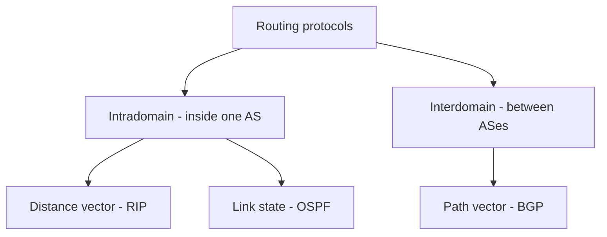

An **Autonomous System (AS)** is a group of networks and routers under **one administration** (an ISP, a university). Routing **inside** an AS is **intradomain** routing (distance vector, link state); routing **between** ASes is **interdomain** routing (path vector). Each AS may run its own intradomain protocol, but only one interdomain protocol (BGP) connects the Internet.

**Key points:**
- Network layer = host-to-host delivery and routing; routers store and forward packets.
- Datagram (connectionless, IP) vs virtual circuit (connection-oriented, MPLS).
- Forwarding uses the table; routing builds the table.
- Static routes are fixed in advance; dynamic routing adapts. RIP/OSPF inside an AS, BGP between ASes.

=== Routing Algorithms: Optimality Principle, Dijkstra's Shortest Path and Flooding
difficulty: medium
---
### The optimality principle
> If router **J** is on the optimal path from router **I** to router **K**, then the optimal path from **J** to **K** also lies along that same route.

The reason: if there were a better route from J to K, you could combine it with the route from I to J to get a better route from I to K — contradicting the assumption.

**Consequence:** the optimal routes from all sources to one destination form a **tree rooted at the destination**, called a **sink tree**. A sink tree has no loops, so every packet is delivered in a bounded number of hops. The goal of all routing algorithms is to discover and use the sink trees.

### Shortest path routing — Dijkstra's algorithm
Model the network as a **graph**: each router is a node and each link is an edge with a **cost** (distance, delay, hop count...). The best route is the **shortest (least-cost) path**.

Dijkstra's algorithm builds a **shortest-path tree** from the source using two lists — **tentative** and **permanent** nodes:
1. Start with the source as the root: cost 0, permanent.
2. Look at every neighbour of the node that just became permanent and compute its cumulative cost through that node. Put it in the tentative list (or lower its cost if this route is cheaper).
3. Among all tentative nodes, choose the one with the **smallest cost** and make it **permanent**.
4. Repeat until every node is permanent.

### Worked example
Links: A–B = 5, A–C = 2, A–D = 3, C–B = 4, C–E = 4, B–E = 3. Build the shortest-path tree from **A**.

```calc
Step  Permanent           Tentative (cost, via)
1     A(0)                B(5,A)  C(2,A)  D(3,A)
2     A, C(2)             B(5,A)  D(3,A)  E(6,C)     <- via C: E = 2 + 4
                                                       B via C = 6 > 5, keep 5
3     A, C, D(3)          B(5,A)  E(6,C)
4     A, C, D, B(5)       E(6,C)                     <- via B: E = 5 + 3 = 8 > 6
5     A, C, D, B, E(6)    (empty)

Routing table for A:
Node  Cost  Next router
A     0     -
B     5     B (direct)
C     2     C (direct)
D     3     D (direct)
E     6     C
```

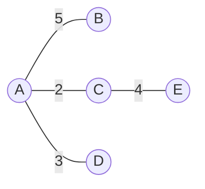

*(The shortest-path tree from A; the edges C–B and B–E are not used.)*

With a priority queue, Dijkstra runs in **O((V + E) log V)**. It requires **non-negative** link costs. **Link-state routing (OSPF)** runs exactly this algorithm on every router.

### Flooding
A static technique: **every incoming packet is sent out on every line except the one it arrived on**.
- **Problem:** it generates huge numbers of duplicates — infinitely many unless controlled.
- **Damping methods:**
  - a **hop counter** in the header, decremented at each router; the packet is dropped at zero (ideally initialized to the path length — or the network diameter if that is unknown);
  - **sequence numbers**, so each router forwards a given packet only the first time it sees it;
  - **selective flooding** — send only on lines going roughly in the right direction.
- **Uses:** flooding is wasteful for ordinary traffic but very **robust** — it always finds the shortest path (some copy takes it) and still works when much of the network is destroyed. It is used to distribute **link-state packets** in OSPF, and in military and wireless networks.

**Key points:**
- Optimality principle → optimal routes to a destination form a sink tree.
- Dijkstra: repeatedly make the cheapest tentative node permanent and relax its neighbours.
- Dijkstra needs non-negative costs; it is the core of link-state routing.
- Flooding is robust but creates duplicates — control it with hop counts or sequence numbers.

=== Distance Vector Routing and the Count-to-Infinity Problem
difficulty: hard
---
In **distance vector routing**, each router keeps a **vector (table) of the minimum distance to every destination** and the **next hop** to use. Routers learn about the network **only from their immediate neighbours** — the algorithm is the distributed **Bellman-Ford** algorithm. **RIP (Routing Information Protocol)** is the classic example.

### The three steps
**1. Initialization.** Each router knows only the cost to its **directly connected neighbours**; every other destination is set to **infinity**.

**2. Sharing.** Each router sends its table (destination and cost columns) to its **neighbours** — both **periodically** (e.g. every 30 s in RIP) and whenever its table changes (a **triggered update**).

**3. Updating.** When router X receives a table from neighbour Y:
1. Add the cost of the link X–Y to every distance in Y's table.
2. For each destination, Y becomes the potential next hop.
3. Compare with X's old table:
   - if the **next hop is different**, keep whichever route is **cheaper** (on a tie, keep the old one);
   - if the **next hop is the same** (Y), **always take the new value** — even if it is worse. Y is reporting the current state of its own route; for example, if Y's route to Z has broken, Y now advertises infinity and X must believe it.

### Worked example
Links: A–B = 5, A–C = 2, A–D = 3, B–C = 4, B–E = 3, C–E = 4. A receives C's table.

```calc
C's table:      A 2, B 4, C 0, D inf, E 4
Add cost A-C=2: A 4, B 6, C 2, D inf, E 6     (all via C)

A's old table:  A 0, B 5, C 2, D 3, E inf
Compare:        A 0 (keep), B 5 (keep, 6 is worse), C 2 (tie, keep old),
                D 3 (keep), E 6 via C (new - better than inf)

A's new table:  A 0, B 5, C 2, D 3, E 6 via C
```

After enough exchanges every router knows the shortest distance to every destination.

### The count-to-infinity problem
Distance vector routing spreads **good news fast** but **bad news slowly**.

Consider a line **A — B — C — D — E** with cost 1 per link. If A goes down, B no longer hears from A — but C still advertises "A is 2 hops away via me". B believes it and sets A = 3 (via C). Then C updates to 4 via B, B to 5 via C, and so on. The two routers **bounce the route between them, counting slowly up to infinity**, while packets for A loop between B and C.

```calc
                 B   C   D   E     (distance to A)
Initially        1   2   3   4
After 1 exchange 3   2   3   4
After 2          3   4   3   4
After 3          5   4   5   4
After 4          5   6   5   6
...              counts upward until it reaches "infinity"
```

The same thing happens in **two-node** and **three-node** loops.

### Solutions
1. **Define infinity as a small number.** RIP uses **16 = infinity**, so the counting stops after a few rounds. The downside: no route can be longer than **15 hops**, which limits RIP to small networks.
2. **Split horizon** — never advertise a route **back to the neighbour you learned it from**. If B reaches X through A, B does not tell A about X. A then cannot be fooled into routing back through B.
3. **Split horizon with poison reverse** — instead of omitting the route, B **does** advertise it to A but with distance **infinity**: "Don't use me to reach X — my route goes through you." This removes the ambiguity of silence (A cannot tell whether B omitted the route because of split horizon or because it has no news).

These fix two-node loops, but larger loops can still count to infinity — one reason link-state routing replaced distance vector in big networks.

### Distance vector vs link state (preview)

| | Distance vector (RIP) | Link state (OSPF) |
|---|---|---|
| Knowledge | Only neighbours' distance tables | Full map of the topology |
| Shares | Whole table, with neighbours only | Its own links, with everyone (flooding) |
| Algorithm | Bellman-Ford | Dijkstra |
| Convergence | Slow; count-to-infinity | Fast |
| Resources | Light | More CPU and memory |

**Key points:**
- Each router keeps distance + next hop to every destination and shares its table with neighbours only.
- Update rule: add the link cost; keep the cheaper route — but always accept updates from the current next hop.
- Bad news travels slowly: count-to-infinity.
- Fixes: infinity = 16 (RIP's 15-hop limit), split horizon, poison reverse.

=== Link State, Path Vector and Hierarchical Routing
difficulty: hard
---
### Link state routing (OSPF)
Instead of trusting neighbours' summaries, **every router builds a complete map of the network** and computes the best routes itself. Each router knows the **state of its own links** (which neighbours, what cost, up or down); by sharing that small piece with **everyone**, every router can assemble the whole topology.

**Building the routing tables takes four steps:**
1. **Create a Link State Packet (LSP)** containing: the router's identity, its list of links and their costs, a **sequence number** and an **age**. LSPs are generated when the topology changes, and periodically (but rarely — 60 minutes to 2 hours — to keep traffic low).
2. **Flood the LSP** to every router, reliably:
   - the creator sends it out of every interface;
   - a router receiving an LSP compares its **sequence number** with the copy it has. If it is **older**, discard it. If it is **newer**, keep it and **forward it out of every interface except the one it came from**.
   - The **age** field removes old LSPs that would otherwise live forever.
3. **Build a shortest-path tree** with **Dijkstra's algorithm**, using the router itself as the root.
4. **Derive the routing table** (destination, cost, next hop) from the tree.

Link state converges quickly and has no count-to-infinity problem, but needs more memory and CPU, and flooding adds traffic. **OSPF (Open Shortest Path First)** and **IS-IS** are link-state protocols.

### Path vector routing (BGP)
Distance vector and link state are **intradomain** protocols — neither scales to the whole Internet (distance vector is unstable in large networks; link state would need far too many resources and flooding). Routing **between** autonomous systems uses **path vector routing**, implemented by **BGP (Border Gateway Protocol)**.

- Each AS has a **speaker node** that talks to the speaker nodes of neighbouring ASes.
- Like distance vector, speakers share tables with neighbours — but instead of a cost they advertise the **whole path**: the list of ASes to traverse.

```calc
A1's table entry for D1:   D1 -> AS1-AS2-AS4    (or AS1-AS3-AS4)
C1's table entry for A1:   A1 -> AS3-AS1
```

- **Updating:** when a speaker receives a neighbour's table, it adds destinations it does not know, prepending its own AS and the sender's AS to the path.

**Advantages of advertising paths:**
- **Loop prevention** — a router simply ignores any advertisement whose path already contains **its own AS**.
- **Policy routing** — an AS can reject any path that passes through an AS it does not trust or does not want to pay for, and not pass it on.
- **Optimum path** — "best" is defined by each organization's policy (fewest ASes, security, cost, reliability), not by a single metric — different ASes may even use different internal metrics (RIP hop count, OSPF delay).

### Hierarchical routing
As networks grow, routing tables grow too — using more memory, more CPU to search them and more bandwidth to exchange them. **Hierarchical routing** divides routers into **regions**. Each router knows the full details of its own region, but treats every other region as a **single destination**.

```calc
720 routers, no hierarchy:                       720 entries per router

Two levels: 24 regions x 30 routers
  30 local entries + 23 other regions          =  53 entries

Three levels: 8 clusters x 9 regions x 10 routers
  10 local + 8 regions in own cluster + 7 other clusters = 25 entries
```

Kamoun and Kleinrock showed that the optimal number of levels for N routers is **ln N**, giving about **e · ln N** entries per router. The price of hierarchy: some paths become slightly longer than optimal, because a router sends everything for a region to the same entry point. The Internet itself is hierarchical — routers inside an AS know internal details, while BGP sees only ASes and address prefixes.

**Key points:**
- Link state: build an LSP, flood it (sequence number + age), run Dijkstra, build the table — OSPF.
- Path vector: speakers advertise full AS paths; loops are detected by spotting your own AS — BGP.
- BGP supports policy routing; "best" is decided by each AS.
- Hierarchical routing shrinks tables (720 → 53 → 25 entries) at the cost of slightly longer paths.

=== IPv4 Addressing, Classes, Subnetting and CIDR
difficulty: hard
---
An **IPv4 address** is a **32-bit** logical address that uniquely identifies a host's connection to the Internet. It is written in **dotted-decimal** notation — four bytes, each 0–255 — for example `192.168.10.37`. Every address has two parts: a **network part (prefix)** and a **host part (suffix)**.

```calc
192.168.10.37 = 11000000.10101000.00001010.00100101
Total addresses in IPv4 = 2^32 = about 4.3 billion
```

### Classful addressing (historical)
Originally the first bits of the address fixed the split between network and host:

| Class | First bits | First-byte range | Default mask | Networks | Hosts per network |
|---|---|---|---|---|---|
| A | 0 | 1 – 126 | 255.0.0.0 (/8) | 126 | 2²⁴ − 2 ≈ 16.7 M |
| B | 10 | 128 – 191 | 255.255.0.0 (/16) | 16,384 | 65,534 |
| C | 110 | 192 – 223 | 255.255.255.0 (/24) | ~2 M | 254 |
| D | 1110 | 224 – 239 | — | Multicast | — |
| E | 1111 | 240 – 255 | — | Reserved | — |

127.x.x.x is reserved for **loopback** (127.0.0.1 = this machine). Classful addressing wasted huge numbers of addresses (a company needing 300 hosts had to take a whole class B with 65,534), which is why it was replaced.

### Special addresses in every network
- The **network address** — host bits all **0** — names the network itself.
- The **broadcast address** — host bits all **1** — reaches every host on the network.
- So a network with *h* host bits has **2ʰ − 2 usable host addresses**.
- **Private ranges** (not routed on the Internet, used with NAT): 10.0.0.0/8, 172.16.0.0/12, 192.168.0.0/16.

### Subnet mask
A **subnet mask** has 1s over the network (and subnet) bits and 0s over the host bits. **ANDing** an address with the mask gives the network address.

```calc
Address  192.168.10.37    11000000.10101000.00001010.00100101
Mask     255.255.255.0    11111111.11111111.11111111.00000000
AND  ->  192.168.10.0     network address
```

### Subnetting
**Subnetting** borrows bits from the host part to divide one network into several smaller **subnets** — for different departments, to reduce broadcast traffic, or for security.

**Worked example:** divide **192.168.10.0/24** into **4 subnets**.

```calc
Need 4 subnets -> borrow 2 bits (2^2 = 4)
New prefix /26 -> mask 255.255.255.192
Host bits = 32 - 26 = 6 -> 2^6 = 64 addresses per subnet, 62 usable hosts

Subnet  Network address    Usable hosts                     Broadcast
1       192.168.10.0/26    192.168.10.1   - 192.168.10.62    192.168.10.63
2       192.168.10.64/26   192.168.10.65  - 192.168.10.126   192.168.10.127
3       192.168.10.128/26  192.168.10.129 - 192.168.10.190   192.168.10.191
4       192.168.10.192/26  192.168.10.193 - 192.168.10.254   192.168.10.255
```

**Which subnet is 192.168.10.150 in?** 150 AND 192 = 128 → subnet 3 (192.168.10.128/26).

**Quick formulas** for borrowed bits *s* and remaining host bits *h*: number of subnets = **2ˢ**, usable hosts per subnet = **2ʰ − 2**, block size = 256 − (last non-255 mask byte).

### CIDR — Classless Inter-Domain Routing
CIDR throws away the fixed classes: a block is written as **address/prefix-length**, for example **200.14.64.0/18**, where the prefix can be any length. Organizations receive blocks sized to their needs, which slows down address exhaustion.

**Supernetting (route aggregation)** is the reverse of subnetting: several contiguous blocks are combined into one larger block so routers need **one routing entry instead of many**.

```calc
200.14.64.0/24, 200.14.65.0/24, 200.14.66.0/24, 200.14.67.0/24
-> aggregated as 200.14.64.0/22   (first 22 bits are common)
```

Routers then forward using **longest prefix match**: if several entries match a destination, the one with the **longest prefix** (most specific) wins.

### NAT
**Network Address Translation** lets a whole private network share one public IPv4 address: the router rewrites private source addresses (and ports) into its public address on the way out, and back on the way in. NAT is the main reason IPv4 has survived so long despite having only ~4.3 billion addresses.

**Key points:**
- IPv4 = 32 bits, dotted decimal, network part + host part.
- Usable hosts = 2ʰ − 2 (network and broadcast addresses are reserved).
- Address AND mask = network address.
- Subnetting borrows host bits; CIDR uses any prefix length; supernetting aggregates routes; routers use longest prefix match.

=== IPv4 Packets, Fragmentation, IPv6 and ARP
difficulty: medium
---
### The IPv4 datagram
An IPv4 packet has a **20–60 byte header** followed by data. Interview-relevant fields:
- **Version** (4) and **Header length** (in 4-byte words, 5–15).
- **Type of service / DSCP** — priority and quality of service.
- **Total length** — header + data, up to 65,535 bytes.
- **Identification, Flags, Fragment offset** — used for fragmentation (below).
- **Time to Live (TTL)** — decremented by each router; the packet is dropped at 0 (and an ICMP "time exceeded" message is sent back). This stops packets looping forever — **traceroute** exploits it.
- **Protocol** — which upper-layer protocol the data belongs to (**6 = TCP, 17 = UDP, 1 = ICMP**).
- **Header checksum** — covers the header only, recomputed at each hop because TTL changes.
- **Source and destination IP addresses**.

IP is **connectionless and best-effort**: no guarantees of delivery, order or no-duplication. Reliability is the transport layer's job.

### Fragmentation
Every link has a **Maximum Transmission Unit (MTU)** — the largest packet its frames can carry (1500 bytes on Ethernet). If a datagram is larger than the next link's MTU, the router (or source) **fragments** it:
- Each fragment gets its own IP header with the **same Identification** value.
- The **Fragment offset** gives the position of the fragment's data in the original datagram, **in units of 8 bytes**.
- The **MF (More Fragments)** flag is 1 on every fragment except the last. The **DF (Don't Fragment)** flag forbids fragmentation (the packet is dropped and an ICMP error returned — this is how *Path MTU Discovery* works).
- **Reassembly happens only at the destination host**, never at intermediate routers.

```calc
Datagram: 4000 bytes total = 20-byte header + 3980 bytes of data
Link MTU: 1500 bytes -> each fragment can carry 1480 bytes of data (multiple of 8)

Fragment 1: data bytes    0 - 1479   offset   0/8 = 0     MF = 1
Fragment 2: data bytes 1480 - 2959   offset 1480/8 = 185  MF = 1
Fragment 3: data bytes 2960 - 3979   offset 2960/8 = 370  MF = 0   (1020 bytes)
```

If any fragment is lost, the whole datagram is discarded — fragmentation hurts performance, so modern systems avoid it.

### IPv6
IPv4's 32-bit space is exhausted. **IPv6** uses **128-bit addresses** — about 3.4 × 10³⁸ — written as eight groups of four hex digits:

```calc
2001:0db8:0000:0000:0000:ff00:0042:8329
-> leading zeros dropped, one run of zero groups replaced by "::"
2001:db8::ff00:42:8329
```

| | IPv4 | IPv6 |
|---|---|---|
| Address size | 32 bits | 128 bits |
| Notation | Dotted decimal | Hexadecimal with colons |
| Header | 20–60 bytes, variable, with checksum | Fixed 40 bytes, no checksum |
| Fragmentation | By routers and source | **Only by the source** |
| Broadcast | Yes | No — replaced by multicast/anycast |
| Configuration | Manual or DHCP | Also stateless auto-configuration |
| Security (IPsec) | Optional | Built in to the design |
| Extra features | — | Flow label for QoS, extension headers |

**Transition from IPv4 to IPv6** uses three strategies:
1. **Dual stack** — hosts and routers run both IPv4 and IPv6.
2. **Tunnelling** — IPv6 packets are carried inside IPv4 packets across IPv4-only parts of the network.
3. **Header translation (NAT64)** — converts between IPv6 and IPv4 headers when one side speaks only IPv4.

### ARP and RARP
IP addresses are used for routing, but a frame on a LAN must be delivered to a **MAC address**.
- **ARP (Address Resolution Protocol)** maps an **IP address → MAC address**.
  1. Host A wants to send to 192.168.1.20 on its LAN and does not know its MAC address.
  2. A **broadcasts** an ARP request: "Who has 192.168.1.20? Tell 192.168.1.10."
  3. Only the owner replies with a **unicast** ARP reply containing its MAC address.
  4. A stores the answer in its **ARP cache** for a while so it does not have to ask again.
  If the destination is on another network, A ARPs for its **default gateway's** MAC address instead.
- **RARP (Reverse ARP)** maps **MAC → IP** — used by old diskless machines that knew only their MAC address at boot. It has been replaced by **BOOTP** and **DHCP**, which can hand out an IP address, subnet mask, gateway and DNS server automatically.
- **ICMP** carries error and diagnostic messages for IP (destination unreachable, time exceeded, echo request/reply used by **ping**).

**Key points:**
- TTL prevents endless loops; Protocol field 6 = TCP, 17 = UDP.
- Fragments share an Identification value; offset is in 8-byte units; only the destination reassembles.
- IPv6: 128-bit addresses, fixed 40-byte header, no broadcast, no router fragmentation.
- ARP: IP → MAC by broadcast request and unicast reply; DHCP replaced RARP.

=== Congestion Control: Leaky Bucket, Token Bucket, RED and Choke Packets
difficulty: hard
---
**Congestion** happens when too many packets are present in (part of) the network, causing delay and loss. As the offered load approaches the network's capacity, router buffers overflow and packets are dropped; the dropped packets have already used capacity, so the delivered traffic (**goodput**) falls below the ideal. In a badly designed network goodput can collapse almost to zero — a **congestion collapse**.

### Congestion control vs flow control
A favourite interview question:
- **Flow control** concerns **one sender and one receiver**: stop a fast sender from overrunning a slow receiver. Example: a supercomputer sending a file over a 100-Gbps link to a PC that can only absorb 1 Gbps — the network is fine, the receiver is not.
- **Congestion control** is **global**: make sure the **network** can carry the offered traffic. Example: 1000 computers on 1-Mbps lines, half of them sending at 100 kbps to the other half — no receiver is overwhelmed, but the network is.

They get confused because the cure is the same: **tell the sender to slow down**.

The network and transport layers share the work: congestion is *experienced* in the network layer (router queues), but the most effective cure is for the *transport layer* to reduce the load it puts on the network.

### Detection and recovery techniques
**1. Warning bit.** A congested router sets a special bit in the packet header. The receiver copies it into the acknowledgement, and the sender reduces its rate according to how many ACKs arrive with the bit set. (Modern equivalent: **ECN — Explicit Congestion Notification**.)

**2. Choke packets.** The congested router sends a **choke packet** directly to the source, which must reduce its rate by some percentage (e.g. the old ICMP *Source Quench* message). On long or fast paths, packets already in flight keep arriving long after the choke is sent, so **hop-by-hop choke packets** make every router along the way slow down as the choke passes through it, giving faster relief.

**3. Load shedding.** When buffers are full, routers simply **drop packets**. The choice of victim matters: for a **file transfer** keep the old packets (dropping them would leave gaps that need retransmission); for **real-time audio/video** drop the old ones (new data is more valuable). Applications can mark packets with a **discard priority**.

### Avoidance techniques
**4. Random Early Detection / Discard (RED).** Instead of waiting until the queue is full, the router acts **early**:
- it keeps a running **average queue length**;
- below a **lower threshold** → queue the packet normally;
- above an **upper threshold** → drop it;
- in between → drop it with a **probability** that rises as the average grows.

Dropping a few packets early makes TCP senders back off before the queue overflows, avoiding the case where many flows lose packets at once.

**5. Traffic shaping** controls the **rate** at which packets enter the network (not just how many), smoothing out bursts. The sender and the network agree on a traffic pattern when the connection is set up.

### Leaky bucket
Imagine a bucket with a small hole: water poured in at any rate drips out at a **constant rate**; if the bucket overflows, the excess is lost.
- Packets enter a finite queue; they leave at a **fixed rate** (e.g. one packet, or a fixed number of bytes, per clock tick).
- Bursts are smoothed into a steady stream; if the queue is full, **packets are discarded**.
- When the input is idle, nothing is sent — unused capacity cannot be saved.

### Token bucket
- The bucket holds **tokens**, added at a fixed rate (one every ΔT), up to a maximum bucket size.
- To send a packet (or a number of bytes), the host must **capture and destroy** enough tokens.
- An idle host **saves up tokens** (up to the bucket size), so it can later send a **burst** at full speed.

```calc
Token bucket: rate 1 token per ms, bucket size 100 tokens, 1 token = 1 packet
Host idle for 200 ms -> bucket full at 100 tokens (extra tokens are discarded)
Host now has 150 packets -> sends 100 immediately as a burst,
                            then 1 packet per ms as new tokens arrive
```

| | Leaky bucket | Token bucket |
|---|---|---|
| Output rate | Constant | Variable — bursts allowed up to the bucket size |
| When full | Discards **packets** | Discards **tokens**, never packets |
| Idle periods | Capacity is lost | Tokens are saved for later bursts |
| Behaviour | Strict smoothing | Average-rate limit with burst tolerance |

The two are often combined: a token bucket followed by a leaky bucket gives a bounded average rate *and* a bounded peak rate.

**Key points:**
- Congestion control is global; flow control is between one sender and one receiver.
- Detection/recovery: warning bit (ECN), choke packets (hop-by-hop), load shedding.
- Avoidance: RED drops early with increasing probability; traffic shaping controls the rate.
- Leaky bucket = constant output, drops packets; token bucket = allows saved-up bursts, drops tokens.

=== Transport Layer Services: Ports, Sockets and Multiplexing
difficulty: medium
---
The network layer delivers packets from **host to host**. But a host runs many processes at once — a browser, a mail client, a game. The **transport layer** delivers data from **a process on the source machine to a process on the destination machine**, with whatever reliability the application needs, independently of the physical networks underneath. The software doing this work is the **transport entity** (usually part of the OS kernel).

```calc
Data link layer  : node to node      (MAC address)
Network layer    : host to host      (IP address)
Transport layer  : process to process (port number)
```

### Port numbers
A **port number** is a **16-bit** number (0–65,535) that identifies a process on a host. In OSI terms the transport endpoint is a **TSAP (Transport Service Access Point)**; the network endpoint (the IP address) is an **NSAP**. The ranges are assigned by IANA:

| Range | Name | Use |
|---|---|---|
| 0 – 1023 | **Well-known** | Standard servers: HTTP 80, HTTPS 443, FTP 20/21, SSH 22, TELNET 23, SMTP 25, DNS 53 |
| 1024 – 49,151 | **Registered** | Registered applications (e.g. MySQL 3306) |
| 49,152 – 65,535 | **Dynamic / ephemeral** | Temporary client ports chosen by the OS |

A server listens on a well-known port; the client's OS picks a random ephemeral port for its side.

### Sockets
A **socket address** = **IP address + port number**, e.g. `200.23.56.8:69`. The IP address selects the **host**; the port selects the **process**. A TCP connection is uniquely identified by the **4-tuple**: source IP, source port, destination IP, destination port — which is why one web server on port 80 can serve thousands of clients at once.

### Multiplexing and demultiplexing
- **Multiplexing (sender):** many processes hand data to the transport layer, which adds a header with port numbers and passes everything to the single IP layer.
- **Demultiplexing (receiver):** the transport layer reads the **destination port** and delivers each segment to the correct process.

### Services offered
- **Connection-oriented** (TCP) — three phases: **establishment, data transfer, release**; reliable, ordered, with flow and congestion control.
- **Connectionless** (UDP) — each message is sent independently; no guarantees.
- **Error control end to end** — the data link layer checks errors only on each link; errors can still occur *inside* routers, so the transport layer checks again end to end.

### Transport service primitives
A simple transport interface (the model behind the Berkeley **socket API**):

| Primitive | Packet sent | Meaning |
|---|---|---|
| LISTEN | (none) | Block until some process tries to connect |
| CONNECT | CONNECTION REQUEST | Actively try to establish a connection |
| SEND | DATA | Send information |
| RECEIVE | (none) | Block until a DATA segment arrives |
| DISCONNECT | DISCONNECTION REQUEST | This side wants to release the connection |

The server calls LISTEN and blocks. The client calls CONNECT, which sends a CONNECTION REQUEST; if the server is listening, it replies CONNECTION ACCEPTED and both are connected. Data then flows with SEND and RECEIVE, and finally DISCONNECT releases the connection. The socket API's `listen`/`accept`, `connect`, `send`/`recv` and `close` map directly onto these.

### Why the transport layer is harder than the data link layer
Both do error control, sequencing and flow control, but:
1. **Addressing** — on a point-to-point wire the other end is implicit; across the Internet the destination must be named explicitly.
2. **Connection establishment** — on a wire the other end is always there; across a network, setting up a connection is surprisingly tricky.
3. **Storage in the network** — routers can **delay and duplicate** packets, and an old duplicate can turn up seconds later. This needs special protocols (like the three-way handshake).
4. **Buffering and flow control** — a host may have a large, changing number of connections competing for bandwidth, so the data link layer's fixed per-line buffering does not work.

**Key points:**
- Transport = process-to-process delivery; the port number identifies the process.
- Ports: 0–1023 well-known, 1024–49,151 registered, 49,152–65,535 ephemeral.
- Socket = IP + port; a TCP connection = the 4-tuple.
- Multiplexing on send, demultiplexing by destination port on receive.

=== Connection Establishment and Release: Three-Way Handshake and the Two-Army Problem
difficulty: hard
---
### Why connection setup is tricky
Sending a CONNECTION REQUEST and waiting for CONNECTION ACCEPTED sounds enough. The problem is that the network can **lose, delay, corrupt and duplicate** packets. Imagine an old CONNECTION REQUEST, delayed inside the network, that suddenly arrives after the original connection has finished: the server would happily open a second, unwanted connection — and an old duplicate *data* packet might even be accepted as new data (imagine a repeated bank transfer).

### The three-way handshake (Tomlinson, 1975)
The fix is for each side to pick an **initial sequence number** and have the other side **confirm it**:
1. Host 1 chooses sequence number **x** and sends **CR (seq = x)**.
2. Host 2 replies with an **ACK of x** and announces its own initial sequence number **y**: **(seq = y, ACK = x)**.
3. Host 1 acknowledges **y** in its first data segment: **(seq = x, ACK = y)**.

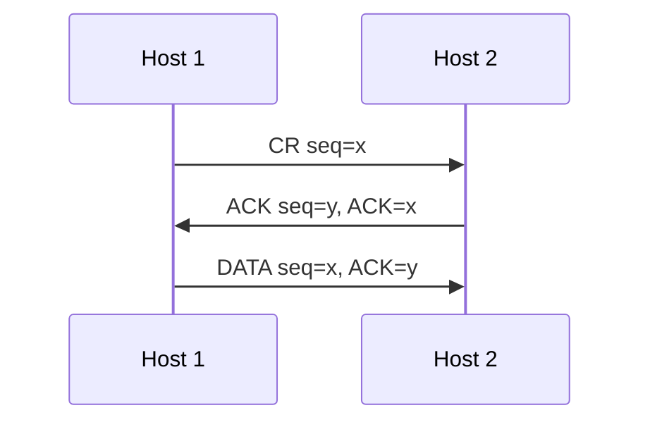

**Why it defeats old duplicates:**
- **Old CONNECTION REQUEST arrives:** Host 2 replies with ACK (seq = y, ACK = x). Host 1 knows it never asked for this connection, so it sends **REJECT**, and Host 2 abandons it.
- **Old CR and an old DATA/ACK both arrive:** Host 2 replies proposing y. The old data segment acknowledges some other number **z**, not y, so Host 2 knows it is stale and rejects it.

Because Host 2's y is fresh and no old segment can contain it, **no combination of delayed duplicates can open a connection nobody wanted**. TCP uses this handshake (with SYN segments) — and chooses initial sequence numbers carefully so old segments cannot fall into the current window.

### Releasing a connection
- **Asymmetric release** — like hanging up a phone: either side disconnects and the whole connection ends. It is abrupt and **can lose data**: if Host 1 sends two segments and Host 2 issues DISCONNECT after receiving only the first, the second is lost.
- **Symmetric release** — the connection is treated as **two independent one-way connections**, each released separately. A host that has sent DISCONNECT can still **receive** data. The idea is "I'm done. Are you done too?" — "Yes, I'm done too. Goodbye."

### The two-army problem
Can two parties ever be *certain* they agree to disconnect? Picture two blue armies on two hills, with a white army in the valley between them. Each blue army alone loses, but together they win — **if they attack at the same time**. Their only communication is a messenger who must cross the valley and may be captured.

Blue 1 sends "attack at dawn?". Blue 2 replies "yes" — but Blue 2 cannot be sure its reply arrived, so it hesitates. Blue 1 acknowledges the reply — but now Blue 1 cannot be sure the acknowledgement arrived... **The last message can always be lost, so no protocol of finite messages can guarantee agreement.** Applied to networks: there is **no perfect way to release a connection** over an unreliable channel.

### The practical solution: timers
Real protocols accept a small risk and use **timers**:
1. **Normal case** — Host 1 sends **DR** (disconnection request) and starts a timer. Host 2 replies with its own DR and starts a timer. Host 1 sends **ACK** and releases; when the ACK arrives, Host 2 releases.
2. **Final ACK lost** — Host 2's timer expires and it releases anyway.
3. **Second DR lost** — Host 1 times out and sends its DR again.
4. **All retries lost** — after **N** attempts Host 1 gives up and releases; Host 2 times out and releases too.

The remaining risk — a **half-open connection** if every DR is lost — is handled by a rule such as "if nothing arrives for a long time, release automatically". TCP's FIN exchange with a **TIME_WAIT** timer follows exactly this pattern.

**Key points:**
- Delayed duplicate packets make naive connection setup unsafe.
- Three-way handshake: CR(x) → ACK(y, x) → DATA(x, y); stale requests are rejected.
- Asymmetric release can lose data; symmetric release closes each direction separately.
- The two-army problem shows perfect agreement is impossible — real protocols use timers.

=== UDP: User Datagram Protocol (and TCP vs UDP)
difficulty: easy
---
**UDP (User Datagram Protocol)** is a **connectionless, unreliable** transport protocol. It adds very little to IP — essentially just **port numbers** for process-to-process delivery and an optional **checksum**. That simplicity is exactly why it is useful.

### The UDP header — only 8 bytes

```calc
|  Source port (16 bits)  |  Destination port (16 bits) |
|  Total length (16 bits) |  Checksum (16 bits)         |
|                       Data                            |
```

- **Source / destination port** — identify the processes.
- **Total length** — header + data in bytes.
- **Checksum** — optional in IPv4 (all 0s means "not used"); mandatory in IPv6.

### The checksum and the pseudo-header
The UDP checksum covers three things: a **pseudo-header**, the **UDP header** and the **data**. The pseudo-header contains fields from the IP header — **source IP, destination IP, the protocol number (17 for UDP) and the UDP length** — padded with zeros. It is used only for the calculation, never transmitted.

Why include it? If the IP header were corrupted, a datagram could arrive "safe and sound" according to its own checksum but at the **wrong host**. Including the addresses catches that; including the protocol number makes sure the packet really belongs to UDP. Data with an odd number of bytes is padded with a zero byte for the calculation. TCP uses the same pseudo-header with protocol number 6.

### How UDP operates
- **Connectionless** — every datagram is independent; datagrams are **not numbered**; no setup or teardown; each may take a different route.
- **No flow control** — a fast sender can overflow the receiver's queue.
- **No error control** except the checksum — a corrupted datagram is **silently discarded**; the sender never learns about lost or duplicated messages.
- **Queues** — each port has an incoming (and outgoing) queue; if a datagram arrives for a port with no process, it is discarded and an ICMP "port unreachable" message is sent back.

### Why use UDP?
- **Speed and low overhead** — no handshake, 8-byte header, no retransmission delays.
- **Real-time traffic** — for voice and video, a late packet is useless; better to skip it than wait for a retransmission (VoIP, video calls, online games).
- **Simple request-response** — one small query and one answer: **DNS** (port 53), **DHCP/BOOTP** (67/68), **SNMP** (161/162), **TFTP** (69), **NTP** (123).
- **Multicast and broadcast** — TCP cannot do one-to-many; UDP can.
- **Building custom reliability** — QUIC (used by HTTP/3) runs over UDP and implements its own reliability and congestion control.

### TCP vs UDP — the classic interview table

| | TCP | UDP |
|---|---|---|
| Connection | Connection-oriented (3-way handshake) | Connectionless |
| Reliability | Reliable: ACKs, retransmission | Unreliable: no ACKs |
| Ordering | Delivers bytes in order | No ordering |
| Data model | Byte stream | Independent messages (datagrams) |
| Flow control | Yes (sliding window) | No |
| Congestion control | Yes | No |
| Header size | 20–60 bytes | 8 bytes |
| Checksum | Mandatory | Optional (IPv4) |
| Speed / overhead | Slower, more overhead | Faster, minimal overhead |
| Broadcast / multicast | No | Yes |
| Used by | HTTP/HTTPS, FTP, SMTP, SSH, TELNET | DNS, DHCP, VoIP, video streaming, gaming, SNMP, TFTP |

> Interview angle: "Why does DNS use UDP?" — queries and answers are small, a single round trip is enough, and avoiding the TCP handshake makes lookups fast. DNS falls back to **TCP** for responses that are too large and for zone transfers between servers.

**Key points:**
- UDP = ports + optional checksum on top of IP; 8-byte header.
- The checksum includes a pseudo-header (IPs, protocol 17, length).
- No connection, no ordering, no flow or error control — just speed and simplicity.
- Use UDP for real-time, multicast and small request-response protocols.

=== TCP: Features, Byte Numbering and Segment Header
difficulty: medium
---
**TCP (Transmission Control Protocol)** is a **connection-oriented, reliable** transport protocol. It adds connection management, reliability, flow control and congestion control on top of IP's best-effort service. Most Internet traffic — web, email, file transfer, SSH — uses it.

### TCP services
1. **Process-to-process communication** using port numbers (HTTP 80, SMTP 25, FTP 20/21, TELNET 23, DNS 53...).
2. **Stream delivery** — the application writes a **stream of bytes** and the receiver reads a stream of bytes, as if through an imaginary "tube". TCP decides how to cut the stream into segments; message boundaries are not preserved.
3. **Sending and receiving buffers** — because sender and receiver work at different speeds, each direction has a buffer (conceptually a circular array). At the sender the buffer holds bytes **sent but not yet acknowledged**, bytes **waiting to be sent**, and **empty** slots for the application to fill. At the receiver it holds bytes **received but not yet read** by the application, and empty slots.
4. **Segments** — TCP groups bytes into **segments**, adds a header, and hands them to IP. Lost, duplicated or out-of-order segments are handled invisibly to the application.
5. **Full-duplex** — data flows both ways at the same time.
6. **Connection-oriented** — establish, transfer, terminate.
7. **Reliable** — every byte is acknowledged.

### The numbering system
TCP numbers **bytes, not segments**.
- **Byte numbers** start from a **random Initial Sequence Number (ISN)** chosen at connection setup (different in each direction).
- The **sequence number** of a segment is the number of its **first data byte**.
- The **acknowledgement number** is the number of the **next byte expected** — and it is **cumulative**.

```calc
ISN = 1056 (so the first data byte is 1057), file = 6000 bytes, segments of 1000 bytes
Bytes numbered 1057 .. 7056

Segment 1: seq = 1057  (bytes 1057 - 2056)
Segment 2: seq = 2057  (bytes 2057 - 3056)
...
Segment 5: seq = 5057  (bytes 5057 - 6056)
Segment 6: seq = 6057  (bytes 6057 - 7056)

After receiving segment 1 correctly the receiver sends ACK = 2057
```

### The TCP segment header (20–60 bytes)

```calc
| Source port (16)                | Destination port (16)          |
| Sequence number (32)                                             |
| Acknowledgement number (32)                                      |
| HLEN (4) | Reserved (6) | URG ACK PSH RST SYN FIN | Window (16)  |
| Checksum (16)                   | Urgent pointer (16)            |
| Options and padding (0 - 40 bytes)                               |
```

- **Source / destination port** — 16 bits each.
- **Sequence number** — 32 bits, number of the first data byte in this segment.
- **Acknowledgement number** — 32 bits; if byte *x* has been received, ACK = *x* + 1. ACKs can be **piggybacked** on data.
- **Header length (HLEN)** — in 4-byte words: 5 (20 bytes) to 15 (60 bytes).
- **Six control flags:**
  - **URG** — the urgent pointer is valid;
  - **ACK** — the acknowledgement number is valid;
  - **PSH** — push: deliver the data to the application immediately;
  - **RST** — reset (abort) the connection;
  - **SYN** — synchronize sequence numbers (connection setup);
  - **FIN** — finished sending (connection release).
- **Window size** — 16 bits: the **receive window (rwnd)** — how many bytes the receiver can accept. Max 65,535 bytes (larger with the window-scale option).
- **Checksum** — 16 bits, **mandatory** in TCP, computed over a pseudo-header (protocol number 6) + header + data, like UDP.
- **Urgent pointer** — with URG set, marks where the urgent data ends.
- **Options** — up to 40 bytes: MSS (maximum segment size), window scale, timestamps, SACK.

### Pushing and urgent data
- **Push (PSH):** normally TCP may wait to fill a segment. An interactive application can request a **push** so TCP sends immediately and the receiver delivers immediately, without waiting for more data.
- **Urgent (URG):** lets the sender mark some data to be handled **out of band** — for example pressing Ctrl+C to abort a remote program in the middle of a long output.

**Key points:**
- TCP gives reliable, ordered, full-duplex byte-stream delivery over IP.
- Sequence numbers count bytes, starting from a random ISN; ACK = next byte expected (cumulative).
- Header is 20–60 bytes; flags URG, ACK, PSH, RST, SYN, FIN; window = rwnd.
- Checksum is mandatory and includes a pseudo-header.

=== TCP Connection Management: Handshake, Data Transfer, Termination and SYN Flooding
difficulty: hard
---
A TCP connection goes through three phases: **connection establishment, data transfer and connection termination**.

### Connection establishment — the three-way handshake
The server does a **passive open** (it is listening). The client does an **active open**.

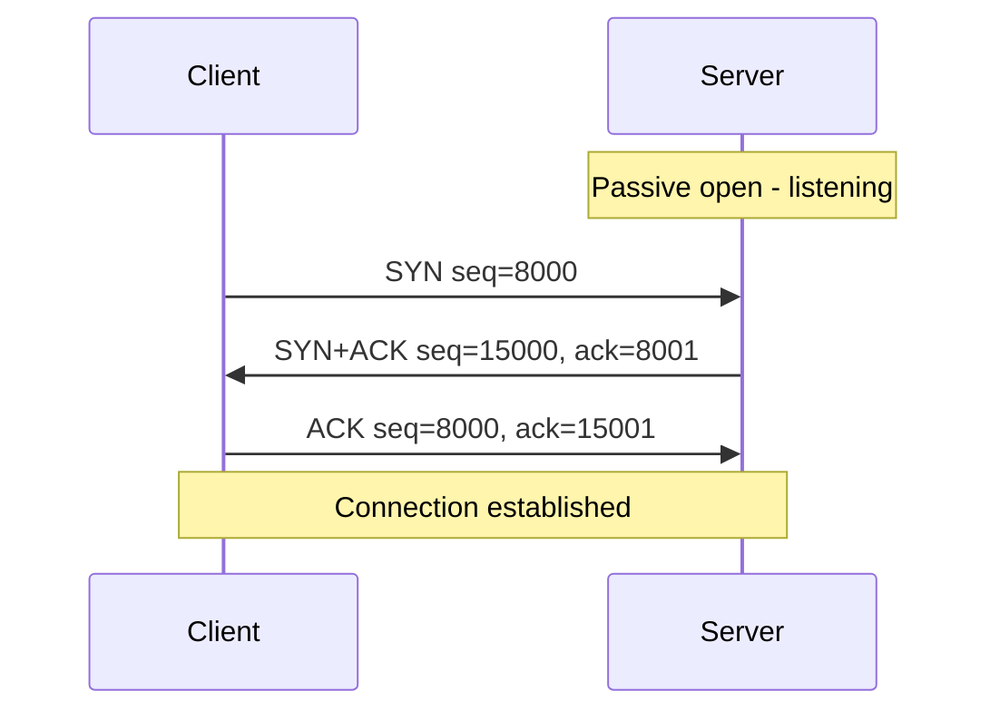

1. **SYN** — the client sends a segment with only the SYN flag set, carrying its ISN (8000). *A SYN carries no data but consumes one sequence number.*
2. **SYN + ACK** — the server acknowledges the client's SYN (ack = 8001) and sends its own ISN (15000). *It carries no data but consumes one sequence number.*
3. **ACK** — the client acknowledges the server's SYN (ack = 15001). *An ACK carrying no data consumes no sequence number* (so its seq is still 8000, and the first data byte will be 8001).

**Why three steps and not two?** Each side must announce its own ISN **and** get confirmation that the other side received it. With only two messages the server could not be sure its ISN reached the client, and an old delayed SYN could create a half-open connection.

### Data transfer
Both sides can send data and ACKs at the same time, with **ACKs piggybacked** on data.

```calc
Client -> Server: seq 8001,  ack 15001, bytes 8001-9000   (PSH)
Client -> Server: seq 9001,  ack 15001, bytes 9001-10000  (PSH)
Server -> Client: seq 15001, ack 10001, bytes 15001-17000
Client -> Server: seq 10001, ack 17001, rwnd 10000        (pure ACK, no data)
```

### Connection termination
**Three-way handshake (common case):**
1. The client sends **FIN** (it can carry the last data). *A FIN with no data consumes one sequence number.*
2. The server replies **FIN + ACK** — acknowledging the client's FIN and closing its own direction.
3. The client sends a final **ACK**.

**Four-way handshake with half-close:** a TCP end can **stop sending while still receiving** — a **half-close**. Example: a client sends a list of numbers to be sorted. After sending everything it closes its sending direction (FIN), the server acknowledges, then the server — which needs all the data before it can start sorting — sends the sorted results, and only afterwards sends its own FIN, which the client ACKs.

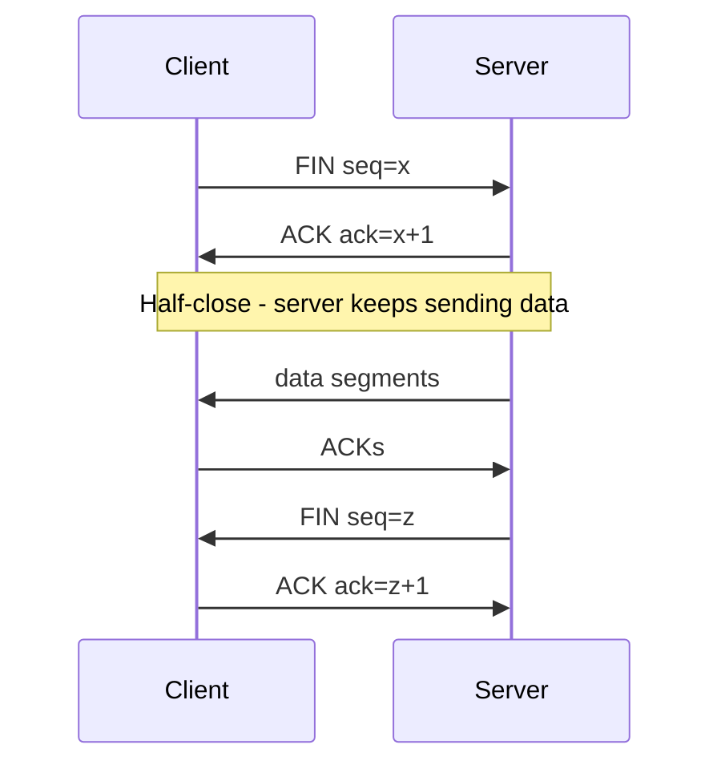

After sending the final ACK, the client waits in **TIME_WAIT** (2 × maximum segment lifetime) so that a lost final ACK can be resent and old duplicates die out before the port pair is reused.

The **RST** flag aborts a connection immediately — for example when a segment arrives for a port with no listening process.

### SYN flooding attack
An attacker sends a huge number of **SYN** segments with **spoofed (fake) source IP addresses**. For each one the server allocates resources (connection table entries, timers) and replies with SYN + ACK — to addresses that will never answer. The half-open connections pile up until the server **runs out of resources** and can no longer accept real clients. This is a **denial-of-service (DoS)** attack — or **DDoS** when launched from a botnet.

**Defences:**
1. **Limit** the number of connection requests accepted in a given period.
2. **Filter** datagrams from unwanted or obviously spoofed source addresses.
3. **Postpone resource allocation** until the handshake is complete — **SYN cookies**: the server encodes the connection details in its ISN instead of storing them, and allocates memory only when a valid final ACK returns.

**Key points:**
- Handshake: SYN (seq x) → SYN+ACK (seq y, ack x+1) → ACK (ack y+1).
- SYN and FIN consume one sequence number each; a pure ACK consumes none.
- Termination: FIN → FIN+ACK → ACK; a half-close lets one side keep sending.
- SYN flooding exhausts half-open connection resources; SYN cookies defend against it.

=== TCP Flow Control: Sliding Window, Nagle's Algorithm and Silly Window Syndrome
difficulty: hard
---
TCP uses a **sliding window** for flow control so the sender never overruns the receiver's buffer. It is a mix of the data link protocols:
- like **Go-Back-N**, it uses cumulative ACKs and no NAKs;
- like **Selective Repeat**, the receiver **buffers out-of-order segments** until the missing ones arrive.

It differs from data link windows in two ways: it is **byte-oriented** (not frame-oriented), and its **size is variable**.

### The window
```calc
Send window size = min(rwnd, cwnd)

rwnd = receiver window - advertised by the receiver in every ACK
       (how many more bytes its buffer can hold)
cwnd = congestion window - set by the sender from network conditions
```

The window's edges move in three ways, all driven by the **receiver** (and by congestion), not by the sender:
- **Opening** — the right edge moves right: more bytes may be sent.
- **Closing** — the left edge moves right: bytes have been acknowledged.
- **Shrinking** — the right edge moves left (strongly discouraged).

### Window management example
Receiver buffer = 4 KB.

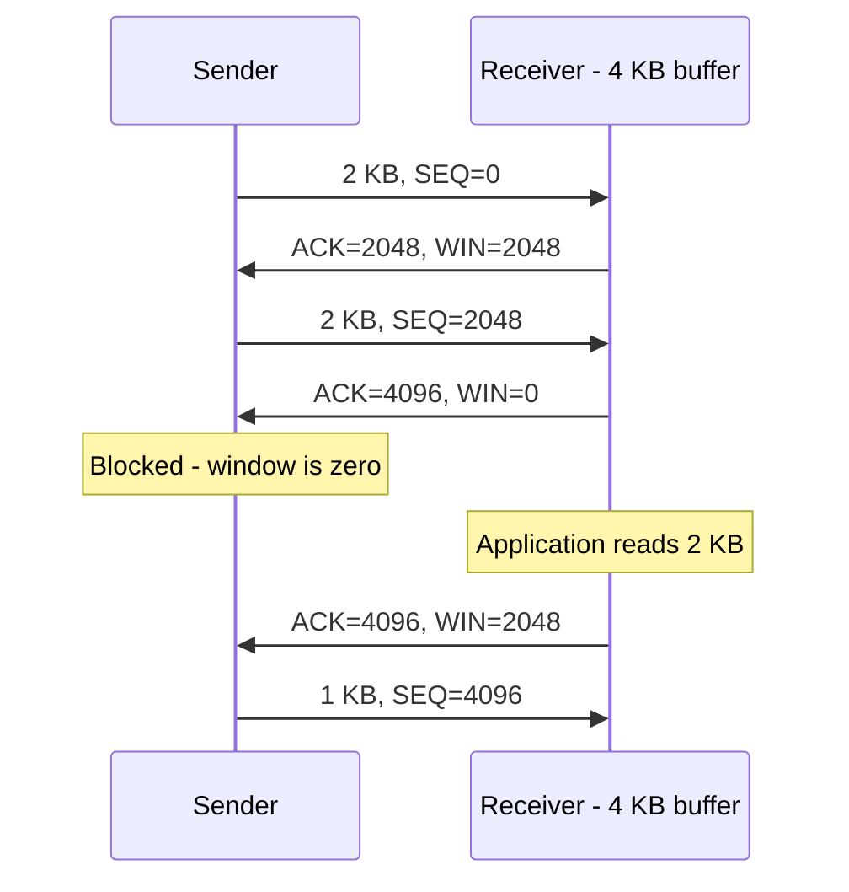

When the window is **0**, the sender normally may not send, with two exceptions: **urgent data**, and a 1-byte **window probe** that forces the receiver to re-announce its window. Probes prevent deadlock if the window update that reopens the window gets lost.

### Delayed acknowledgements
A receiver need not ACK every segment immediately. TCP may **delay ACKs for up to 500 ms** (commonly ~200 ms), hoping to **piggyback** the ACK on outgoing data or combine several ACKs. Exceptions: an ACK should be sent at least for every second full-sized segment, and immediately for out-of-order segments.

### Nagle's algorithm — don't send tiny segments
Interactive programs like **TELNET** generate one byte per keystroke. Each byte would travel in a 41-byte packet (20 IP + 20 TCP + 1 data), and every keystroke causes three packets (character, echo + ACK, ACK of echo) — terribly wasteful.

**Nagle's rule:** send the first small piece immediately; then **buffer all further data until the outstanding data is acknowledged**, and send everything buffered as one segment. Many small writes are merged into a few larger segments.

Nagle's algorithm is not always good: in **interactive games** or remote mouse movements, the extra delay is annoying; and together with delayed ACKs it can cause a temporary **deadlock-like pause** (the receiver waits for data to piggyback its ACK while the sender waits for the ACK). It can be turned off with the **TCP_NODELAY** socket option.

### Silly window syndrome — don't advertise tiny windows (Clark, 1982)
The opposite problem, caused by the receiver: the buffer is full, and the application reads **one byte**. The receiver advertises a 1-byte window, the sender sends 1 byte, the buffer is full again — and the cycle repeats, sending headers for single bytes.

**Clark's solution:** the receiver must **not advertise a small window**. It waits until it can accept a **full maximum segment size** or its buffer is **half empty**, whichever is smaller. The sender helps too, by not sending tiny segments — wait until it can send a full segment, or at least half the receiver's buffer.

> Together: **Nagle** stops the sender sending small segments; **Clark** stops the receiver asking for them.

**Key points:**
- TCP's window is byte-based and variable: send window = min(rwnd, cwnd).
- The receiver controls the window; WIN = 0 blocks the sender except for urgent data and window probes.
- Delayed ACKs reduce pure-ACK traffic; Nagle merges small writes (disable with TCP_NODELAY).
- Silly window syndrome is fixed by Clark's rule (don't advertise tiny windows) plus Nagle.

=== TCP Error Control and Congestion Control: Slow Start, AIMD and Fast Retransmit
difficulty: hard
---
### Error control
TCP delivers the whole byte stream **in order, without errors, losses or duplicates**, using three tools:
1. **Checksum** — a corrupted segment is discarded and treated as lost.
2. **Acknowledgements** — confirm received data. Control segments that consume a sequence number (SYN, FIN) are acknowledged too; **pure ACKs are never acknowledged** (and consume no sequence numbers).
3. **Time-out and retransmission:**
   - **Retransmission after RTO** — each sent segment is covered by a **retransmission timer**; the **RTO (retransmission time-out)** is computed dynamically from measured round-trip times. If it expires, the oldest unacknowledged segment is resent.
   - **Fast retransmission** — if **three duplicate ACKs** arrive, the segment is resent immediately without waiting for the timer.

**Out-of-order segments** are stored by the receiver but never delivered to the application out of order. **Duplicate** segments are simply discarded.

### Congestion control
The network signals congestion mainly by **dropping packets** (queues overflow). Van Jacobson (1988), after the Internet's first **congestion collapses** in 1986, made TCP treat **packet loss as the signal of congestion**. TCP keeps a **congestion window (cwnd)**, and the amount it may send is:

```calc
Send window = min(rwnd, cwnd)
```

Two ideas make it work:
- **Ack clock** — ACKs come back at roughly the rate the **slowest (bottleneck) link** delivers packets. Sending a new packet each time an ACK arrives paces the sender to exactly that rate without building queues.
- **AIMD (Additive Increase, Multiplicative Decrease)** — grow the window slowly while things go well, cut it sharply on loss. AIMD is what makes competing flows converge to a fair, efficient share.

### Slow start — exponential growth
Starting AIMD from a tiny window would take ages to reach a good speed on a fast network. So TCP begins with **slow start**:
- cwnd starts at **1 MSS** (maximum segment size);
- **every ACK increases cwnd by 1 MSS** — so cwnd **doubles every RTT**: 1, 2, 4, 8, 16...

Despite the name, this growth is exponential — "slow" only compared to blasting a whole window at once.

### Congestion avoidance — additive increase
When cwnd reaches the **slow start threshold (ssthresh)**, TCP switches to **additive increase**: cwnd grows by about **1 MSS per RTT** (linear growth).

### Reacting to loss
- **Timeout** (strong congestion signal):
  - ssthresh = cwnd / 2
  - cwnd = 1 MSS
  - restart slow start.
- **Three duplicate ACKs** (mild signal — later segments are still getting through): **fast retransmit** the missing segment. In **TCP Tahoe** this also resets cwnd to 1; in **TCP Reno** it uses **fast recovery** — set ssthresh = cwnd / 2 and cwnd = ssthresh (halve it) and continue with additive increase, skipping slow start.

```calc
Example (in KB, MSS = 1 KB), ssthresh = 32:

Round:  0  1  2  3   4   5   6   7  ...  13
cwnd:   1  2  4  8  16  32  33  34  ...  40     <- slow start, then +1 per RTT
Timeout at 40 KB -> ssthresh = 20, cwnd = 1
Then:   1  2  4  8  16  20  21  22 ...           <- slow start to 20, then linear
```

The result is the famous **sawtooth** shape of TCP Reno's window: linear climbs, halving on every loss.

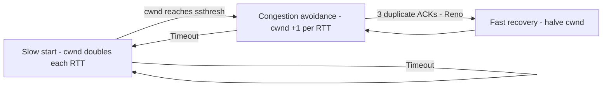

### TCP versions
- **TCP Tahoe (1988)** — slow start, congestion avoidance, fast retransmit (any loss → cwnd = 1).
- **TCP Reno (1990)** — adds **fast recovery** (halve instead of reset on duplicate ACKs).
- **NewReno (1996)** — better recovery from several losses in one window.
- **SACK (1996)** — **selective acknowledgements** tell the sender exactly which blocks arrived, so only the missing ones are resent.
- Modern systems mostly use **CUBIC** (Linux default) or **BBR** (Google), which grow the window differently but keep the same principles.

### ECN — Explicit Congestion Notification
Instead of waiting for a drop, an ECN-capable router **marks** the IP header of packets when it starts to get congested. The receiver echoes the mark in its ACK (ECE flag), and the sender reduces cwnd and confirms with the **CWR (Congestion Window Reduced)** flag — congestion is signalled with no packet lost.

**Key points:**
- Error control: checksum, cumulative ACKs, RTO retransmission, fast retransmit on 3 duplicate ACKs.
- Send window = min(rwnd, cwnd); loss = congestion signal; ACKs clock the sender.
- Slow start doubles cwnd per RTT up to ssthresh; then +1 MSS per RTT (AIMD).
- Timeout: ssthresh = cwnd/2, cwnd = 1. Reno's fast recovery just halves cwnd.

=== RPC, RTP and RTCP: Remote Procedure Calls and Real-Time Transport
difficulty: medium
---
UDP is the base for two important kinds of application: **remote procedure calls** and **real-time multimedia**.

### Remote Procedure Call (RPC)
Proposed by **Birrell and Nelson (1984)**: let a program **call a procedure that runs on another machine** as if it were a local function. The caller is suspended, the procedure runs remotely, and the result comes back — **no message passing is visible to the programmer**. The caller is the **client**, the remote procedure the **server**.

The trick is a pair of **stubs**:

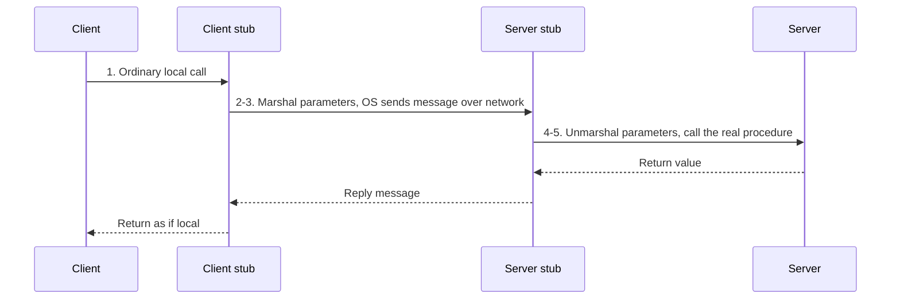

1. The client calls the **client stub** — a normal local call with parameters on the stack.
2. The client stub **packs the parameters into a message** — this is called **marshaling** — and makes a system call to send it.
3. The OS sends the message to the server machine.
4. The server's OS hands it to the **server stub**.
5. The server stub **unmarshals** the parameters and calls the real procedure. The reply travels back the same way.

**Problems with RPC (why it is not truly transparent):**
1. **Pointers** cannot be passed — client and server have different address spaces.
2. For weakly typed languages (e.g. a C array of unknown length) the stub **cannot tell how big a parameter is**, so it cannot marshal it.
3. Parameter **types cannot always be deduced** — think of `printf`, whose arguments depend on the format string.
4. **Global variables** shared between caller and callee stop working once the callee runs on another machine.

Modern descendants: Java RMI, gRPC, Thrift. RPC usually runs over **UDP** for speed (with its own retransmission), or TCP for large data.

### RTP — Real-time Transport Protocol
Internet radio, VoIP, video conferencing and video-on-demand all need the same things, so instead of each reinventing them there is a generic protocol: **RTP**, defined in **RFC 3550**.
- RTP runs in **user space** as a library on top of **UDP**: the application hands its audio/video streams to the RTP library, which **multiplexes** them into RTP packets, which go into UDP datagrams, then IP packets.
- It can be **unicast** or **multicast**.
- Like UDP, it gives **no delivery guarantees, no ACKs and no retransmission** — a late packet is useless for live media anyway.

**What the RTP header adds:**
- **Sequence number** — incremented on every packet, so the receiver can detect **loss** and reorder.
- **Timestamp** — when the first sample was taken, so the receiver can **play samples at the right time** regardless of network jitter, and synchronize streams.
- **Payload type** — the encoding used (e.g. PCM audio, MP3, H.264); it can change from packet to packet.
- **Synchronization source identifier (SSRC)** — which stream the packet belongs to.
- **Contributing source identifiers** — used when a mixer combines several streams (e.g. several people talking in a conference).
- Also: version (2), padding bit, extension bit, CC (count of contributing sources), and a **marker bit** (e.g. start of a video frame).

### RTCP — Real-time Transport Control Protocol
RTP's companion, also in RFC 3550. It carries **no media**; it handles:
- **Feedback** — reports of delay, **jitter**, loss and bandwidth back to the sources, so the encoder can raise quality when the network is good and lower the data rate when it is congested.
- **Inter-stream synchronization** — different streams (audio and video) may use different clocks; RTCP lets the receiver keep lip-sync.
- **Naming sources** — e.g. a participant's name, shown on screen to indicate who is speaking.

### Playout buffering and jitter
Packets sent at perfectly even intervals still arrive at uneven intervals — this variation in delay is **jitter**, and playing packets as soon as they arrive gives jerky video and choppy audio. The receiver therefore **buffers** packets and plays them out after a fixed delay, the **playback point**.
- A later playback point absorbs more jitter but increases latency (bad for conversations).
- A packet that arrives **after** its playback time is skipped (or the playback pauses).
- High-jitter networks need a playback point much further out to catch, say, 99% of packets.
- For audio, the playback point can be **adapted between talk spurts** — in the silent gaps of a conversation — where nobody notices a slightly longer or shorter pause.

**Key points:**
- RPC makes a remote call look local using client and server stubs; packing parameters = marshaling.
- RPC's limits: no pointers, unknown sizes and types, no shared globals.
- RTP (over UDP) adds sequence numbers, timestamps, payload type and SSRC — but no reliability.
- RTCP provides feedback, synchronization and naming; receivers buffer packets to hide jitter.

=== The World Wide Web and HTTP
difficulty: medium
---
The **World Wide Web (WWW)** is a **distributed client/server service**: a client using a **browser** accesses services provided by **servers**, which are spread over many locations called **sites**. Each page can link to pages on any other site.

### The browser and the server
A browser has three parts:
- a **controller**, which takes keyboard and mouse input and coordinates the other parts;
- **client protocols** to fetch documents (HTTP, FTP, ...);
- **interpreters** to display them (HTML, JavaScript, Java...).

A **web server** stores pages and returns a copy for each request. To be efficient it **caches** popular files in memory and serves many requests at once using **multithreading or multiprocessing**.

### URL — Uniform Resource Locator
A URL specifies any resource on the Internet:

```calc
protocol :// host : port / path

https://www.example.com:443/courses/networks.html?unit=3
  |          |            |            |
protocol    host        port        path (+ query)
```

- **Protocol** — how to fetch it (http, https, ftp...).
- **Host** — the server's name (often starting with "www") or IP address.
- **Port** — optional; defaults to 80 for HTTP and 443 for HTTPS.
- **Path** — the location of the file on the server.

### Cookies
HTTP is **stateless** — the server does not remember previous requests. A **cookie** is a small piece of data the server sends (`Set-Cookie`) and the browser **stores and returns with every later request** to that site (`Cookie`). Cookies are used for **login sessions**, shopping carts, preferences and tracking.

### Static, dynamic and active documents

| Type | When is the content created? | Where does code run? | Examples |
|---|---|---|---|
| **Static** | Fixed when written | Nowhere — the file is just copied | Plain HTML pages |
| **Dynamic** (server-side) | Created by the server **at each request** | Server | CGI, PHP, JSP, ASP, Node.js |
| **Active** (client-side) | Program sent to and run **in the browser** | Client | JavaScript, (formerly) Java applets |

**HTML (HyperText Markup Language)** describes page structure with tags such as `<b>bold</b>`: a beginning tag (with optional attributes) and an ending tag. **CGI (Common Gateway Interface)** was the first standard way for a web server to run a program that builds a dynamic page.

### HTTP — HyperText Transfer Protocol
HTTP is the application protocol for fetching web resources. It is a **request–response** protocol running over **TCP port 80** (HTTPS = HTTP over TLS on port 443).

```calc
Request:
GET /index.html HTTP/1.1
Host: www.example.com
Cookie: session=abc123

Response:
HTTP/1.1 200 OK
Content-Type: text/html
Content-Length: 1250

<html> ... </html>
```

**Common methods:**
| Method | Purpose |
|---|---|
| GET | Retrieve a resource (no body) |
| POST | Send data to the server (forms, create) |
| PUT | Replace a resource |
| PATCH | Partially update a resource |
| DELETE | Delete a resource |
| HEAD | Like GET but headers only |

**Status code classes:** **1xx** informational, **2xx** success (200 OK, 201 Created), **3xx** redirection (301 Moved Permanently, 304 Not Modified), **4xx** client error (400 Bad Request, 401 Unauthorized, 403 Forbidden, 404 Not Found), **5xx** server error (500 Internal Server Error, 503 Service Unavailable).

### Persistent vs non-persistent connections
- **Non-persistent (HTTP/1.0)** — a new TCP connection for **every object** (page, each image...): one handshake per object, which is slow.
- **Persistent (HTTP/1.1 default)** — the connection **stays open** for several requests and responses, saving handshakes and slow-start time.
- **HTTP/2** multiplexes many requests over one connection; **HTTP/3** runs over **QUIC (UDP)**.

### What happens when you type a URL? (classic interview question)
1. The browser parses the URL; checks its cache.
2. **DNS** resolves the host name to an IP address.
3. A **TCP** connection is opened (three-way handshake), plus a **TLS** handshake for HTTPS.
4. The browser sends an **HTTP request**; the server returns an **HTTP response**.
5. The browser parses the HTML, fetches CSS, JavaScript and images (more requests), and renders the page.

**Key points:**
- The web is a distributed client/server system addressed by URLs: protocol://host:port/path.
- HTTP is stateless; cookies add state.
- Static (fixed), dynamic (built on the server), active (runs in the browser).
- HTTP over TCP port 80; HTTP/1.1 uses persistent connections; know the main methods and status codes.

=== DNS: The Domain Name System
difficulty: medium
---
TCP/IP identifies hosts by **IP addresses**, but people prefer **names**. The **Domain Name System (DNS)** maps **names to addresses** (and addresses back to names). For example, before an email client can send mail to `someone@wonderful.com`, its DNS client must look up the address of `wonderful.com`.

### Name space: flat vs hierarchical
- In a **flat** name space each name is an unstructured string — impossible to manage centrally at Internet scale and prone to duplicates.
- In a **hierarchical** name space each name has several parts: the organization type, the organization's name, a department... Different organizations can reuse the same local part: `challenger.jhda.edu`, `challenger.berkeley.edu` and `challenger.smart.com` are three different hosts.

### The domain name space
DNS arranges names in an **inverted tree** with the **root** at the top — at most **128 levels** (0 to 127).
- Each node has a **label** of up to **63 characters**; the root's label is empty. Children of the same node must have different labels, which guarantees unique names.
- A node's **domain name** is the sequence of labels from the node **up to the root**, separated by dots.
- A **fully qualified domain name (FQDN)** ends with a dot (the empty root label): `challenger.atc.fhda.edu.`
- A **partially qualified domain name (PQDN)** does not reach the root: `challenger` — the resolver completes it with a default suffix.
- A **domain** is a **subtree** of the name space, named after the node at its top.

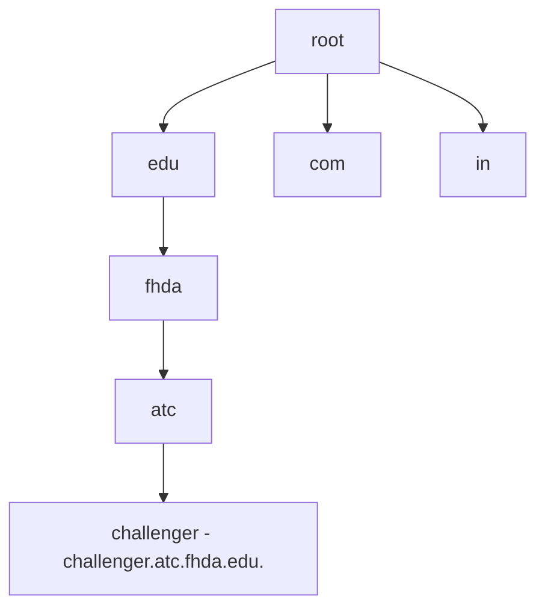

### Distribution: name servers and zones
One computer cannot hold the whole database (it would be overloaded and a single point of failure), so it is spread over a **hierarchy of DNS servers**.
- A **zone** is the part of the tree a server is **responsible for (has authority over)**. If a server delegates part of its domain to other servers, its zone is smaller than its domain.
- **Root servers** — their zone is the whole tree, but they normally store only references to the top-level servers (com, edu, in...). There are 13 named root server clusters distributed worldwide.
- **Primary server** — stores the **zone file** on disk and is responsible for creating and updating it.
- **Secondary server** — **copies** the zone file from a primary (a **zone transfer**) for redundancy; it never creates or edits it.

### DNS in the Internet: three sections
1. **Generic domains** — by type of organization: **com** (commercial), **edu** (education), **gov** (government), **org** (non-profit), **net** (network providers), **mil**, **int**, plus newer ones like aero, biz, info, museum, name, pro, coop.
2. **Country domains** — two-letter codes: **in** (India), **us**, **uk**, **fr**... with subdivisions (e.g. `ca.us.`, `ac.in`).
3. **Inverse domain** — maps an **address to a name** (reverse lookup), under `in-addr.arpa.` with the bytes reversed: the address 132.34.45.121 becomes `121.45.34.132.in-addr.arpa.`

### Resolution
Mapping a name to an address (or back) is **name–address resolution**. The DNS client on a host is called the **resolver**; it asks the nearest DNS server.

- **Recursive resolution** — the resolver asks for the **final answer**. Its server, if it does not know, asks the root (or a higher server), which asks the next one, and so on; the answer travels back along the same chain.
- **Iterative resolution** — a server that does not know the answer returns the **address of the next server to ask**, and the client queries each one in turn.

In practice your computer makes a **recursive** query to its local DNS resolver, and that resolver performs **iterative** queries — root → TLD (.com) → authoritative server.

```mermaid
sequenceDiagram
    participant C as Client
    participant L as Local DNS server
    participant R as Root server
    participant T as com server
    participant A as Authoritative server
    C->>L: Where is www.mcgraw.com - recursive
    L->>R: www.mcgraw.com?
    R-->>L: Ask the com server
    L->>T: www.mcgraw.com?
    T-->>L: Ask mcgraw.com's server
    L->>A: www.mcgraw.com?
    A-->>L: 198.45.24.1
    L-->>C: 198.45.24.1
```

### Caching
To avoid repeating the whole search, servers **cache** answers. Each cached record has a **TTL (time to live)**, after which it is discarded so stale mappings do not persist. Answers from cache are marked **unauthoritative**.

### DNS messages and records
- Two message types, **query** and **response**, with the same format: a **12-byte header** (identification, flags, and counts of each section) followed by **question records**, and in responses also **answer**, **authoritative** and **additional** records.
- **Resource records** in the database include **A** (name → IPv4), **AAAA** (name → IPv6), **CNAME** (alias), **MX** (mail server for a domain), **NS** (name server for a zone), **PTR** (reverse lookup) and **SOA** (start of authority for a zone).

### Registrars, DDNS and transport
- New domains are added through a **registrar** accredited by **ICANN**, which checks the name is unique and enters it into the DNS database for a fee.
- **Dynamic DNS (DDNS)** updates the master file automatically when hosts or addresses change (e.g. together with DHCP), instead of by hand.
- DNS uses **port 53** over **UDP** for normal queries (small and fast) and **TCP** for large responses and zone transfers.

**Key points:**
- DNS maps names to IP addresses; names form an inverted tree read from the node up to the root.
- A zone is what a server has authority over; root, primary and secondary servers.
- Generic, country and inverse (in-addr.arpa) domains.
- Recursive vs iterative resolution; caching with TTL; port 53, UDP (TCP for zone transfers).

=== Email, TELNET and FTP
difficulty: easy
---
### Electronic mail
Email involves three kinds of components:
- **User agent (UA)** — the program the user reads and writes mail with (Outlook, Gmail's web UI, Thunderbird).
- **Message transfer agent (MTA)** — the mail servers that move mail between systems, using **SMTP**.
- **Message access agent (MAA)** — lets the recipient fetch mail from their mailbox, using **POP3** or **IMAP**.

```mermaid
flowchart LR
    A["Alice - user agent"] -->|SMTP| S1["Alice's mail server"]
    S1 -->|SMTP| S2["Bob's mail server - mailbox"]
    S2 -->|"POP3 or IMAP"| B["Bob - user agent"]
```

Why the split? Mail servers must be **always on** to receive mail; users' PCs are not. So mail is **pushed** to the recipient's server with SMTP and later **pulled** by the recipient with POP3/IMAP.

| Protocol | Purpose | Port | Notes |
|---|---|---|---|
| **SMTP** (Simple Mail Transfer Protocol) | **Send / push** mail between servers and from client to server | 25 (587 for submission) | Text commands: HELO, MAIL FROM, RCPT TO, DATA, QUIT |
| **POP3** (Post Office Protocol v3) | **Retrieve** mail | 110 | Downloads mail, usually deleting it from the server; simple, offline-friendly |
| **IMAP** (Internet Message Access Protocol) | **Retrieve and manage** mail | 143 | Mail stays on the server; folders and sync across devices |

- **MIME (Multipurpose Internet Mail Extensions)** lets mail carry non-ASCII text, images, audio and attachments by encoding them into text SMTP can carry.
- **Webmail** (Gmail in a browser) uses **HTTP** between the browser and the mail server, and SMTP between servers.

### TELNET — remote login
**TELNET (TErminaL NETwork)** is a client/server application that lets a user log in to a **remote** computer as if their terminal were attached directly to it.
- **Local login:** keystrokes go to the **terminal driver**, which passes them to the operating system, which runs the requested program.
- **Remote login:** the local OS does **not** interpret the keystrokes; it passes them to the **TELNET client**, which converts them to a universal character set called **NVT (Network Virtual Terminal)** and sends them over TCP. The **TELNET server** at the other end converts NVT back to the remote system's characters — but the remote OS expects input from a terminal driver, not a server, so it is fed through a **pseudo-terminal driver** that makes it look like keyboard input.

Why NVT? Different computers use different character sets and control keys (e.g. end of line, interrupt); NVT gives both ends a common language. NVT data characters have the highest bit 0; control characters have it set to 1.

TELNET uses **TCP port 23**. It sends everything — **including passwords — in plain text**, so today it has been replaced by **SSH (port 22)**, which encrypts the session. (TELNET is also the textbook example for Nagle's algorithm: one keystroke per segment.)

### FTP — File Transfer Protocol
**FTP** copies files between hosts. Its distinctive feature is that it uses **two TCP connections**:
- a **control connection** on **port 21**, open for the whole session, carrying commands (USER, PASS, LIST, RETR, STOR) and replies;
- a **data connection** on **port 20** (active mode) — or a server-chosen port (passive mode) — opened **for each file transfer** and closed afterwards.

Separating control from data keeps commands responsive during long transfers. Like TELNET, plain FTP sends passwords unencrypted; **SFTP** (over SSH) or **FTPS** (over TLS) are used instead. **TFTP (Trivial FTP)** is a minimal version over **UDP port 69**, used for booting diskless devices and loading router firmware.

**Key points:**
- Email: SMTP pushes mail (port 25); POP3 (110) downloads it; IMAP (143) keeps it on the server; MIME handles attachments.
- TELNET (TCP 23) provides remote login via NVT and pseudo-terminal drivers; insecure, replaced by SSH (22).
- FTP uses a control connection (21) and separate data connections (20).
- TFTP is a tiny UDP-based (69) file transfer protocol.

=== Network Security Basics and the RSA Algorithm
difficulty: hard
---
### Security goals
- **Confidentiality** — only the intended receiver can read the message.
- **Integrity** — the message is not altered in transit.
- **Authentication** — the receiver can be sure who sent it.
- **Non-repudiation** — the sender cannot later deny sending it.
- **Availability** — the service stays usable (the target of DoS attacks).

### Common attacks
- **Phishing** — social engineering: the attacker poses as a trusted party (a bank, a colleague) to trick the victim into revealing passwords or card numbers or installing malware.
- **Botnets and DDoS** — a botnet is a large group of compromised machines under an attacker's control; together they flood a target with traffic (a **Distributed Denial of Service**). **SYN flooding** is a classic DoS against TCP.
- **Eavesdropping / sniffing**, **man-in-the-middle**, **spoofing** (faking a source IP or MAC address) and **replay** attacks.

### Symmetric vs asymmetric cryptography

| | Symmetric (secret key) | Asymmetric (public key) |
|---|---|---|
| Keys | One shared secret key | A key pair: **public** (shared) and **private** (kept secret) |
| Speed | Fast | Slow |
| Problem | How to share the key securely | Much more computation |
| Examples | AES, DES | **RSA**, ECC, Diffie-Hellman |

In practice they are combined: **HTTPS/TLS** uses public-key cryptography to authenticate the server and agree on a key, then a fast symmetric cipher for the actual data.

### RSA (Rivest, Shamir, Adleman, 1977)
RSA is the classic public-key algorithm. Its security rests on the fact that **multiplying two large primes is easy, but factoring the product back is infeasible**.

**Key generation:**
1. Choose two large primes **p** and **q**.
2. Compute **n = p × q** (the modulus).
3. Compute **φ(n) = (p − 1)(q − 1)**.
4. Choose a public exponent **e** with 1 < e < φ(n) and **gcd(e, φ(n)) = 1**.
5. Compute the private exponent **d** such that **(d × e) mod φ(n) = 1**.
6. **Public key = (e, n)**; **private key = (d, n)**.

**Encryption:** C = Mᵉ mod n  **Decryption:** M = Cᵈ mod n

### Worked example (small numbers)

```calc
p = 7, q = 11
n    = 7 x 11            = 77
phi  = (7 - 1)(11 - 1)   = 60
e    = 13                (gcd(13, 60) = 1)
d    = 37                (13 x 37 = 481 = 8 x 60 + 1  ->  481 mod 60 = 1)

Public key  (e, n) = (13, 77)
Private key (d, n) = (37, 77)

Encrypt M = 5:   C = 5^13 mod 77 = 26
Decrypt C = 26:  M = 26^37 mod 77 = 5    (original message recovered)
```

Real RSA uses primes hundreds of digits long (2048-bit or larger n), and the powers are computed with **fast modular exponentiation** (square-and-multiply), never by computing the huge power directly.

### Uses of RSA
- **Confidentiality** — anyone encrypts with your **public** key; only your **private** key decrypts.
- **Digital signatures** — you sign with your **private** key; anyone verifies with your **public** key. This gives **authentication, integrity and non-repudiation**. In practice you sign a **hash** of the message, not the message itself.
- **Key exchange** — sending a symmetric session key securely (older TLS versions).

### Other defences to know
- **Firewalls** filter traffic by address, port and protocol (packet filters) or by application content (proxy firewalls).
- **TLS/SSL** secures HTTP, SMTP and others; **IPsec** secures traffic at the network layer (used in VPNs).
- **Hash functions** (SHA-256) and **MACs** check integrity; **digital certificates** issued by a CA bind a public key to an identity.

**Key points:**
- Security goals: confidentiality, integrity, authentication, non-repudiation, availability.
- Symmetric = one shared key (fast); asymmetric = public/private key pair (solves key distribution).
- RSA: n = pq, φ = (p−1)(q−1), e coprime to φ, d = e⁻¹ mod φ; C = Mᵉ mod n, M = Cᵈ mod n.
- Encrypt with the receiver's public key; sign with your own private key.
