=== Classes and Objects in C++
difficulty: easy
---
A **class** is a user-defined type that bundles **data** (data members) and the **functions that operate on that data** (member functions) into a single unit. An **object** is an **instance** of a class — a real variable of that type, occupying memory. The class is the blueprint; objects are the houses built from it. Classes are the mechanism by which C++ supports encapsulation, and everything else in object-oriented C++ is built on them.

The book introduces classes with a simple stack. Here is a version of it:

```cpp
#include <iostream>
using namespace std;

#define SIZE 100

class Stack {
    int stck[SIZE];      // private by default
    int tos;             // top of stack
public:
    void init();         // public interface
    void push(int i);
    int pop();
};

// Member functions defined outside the class use the scope resolution operator ::
void Stack::init() { tos = 0; }

void Stack::push(int i)
{
    if (tos == SIZE) { cout << "Stack is full.\n"; return; }
    stck[tos++] = i;
}

int Stack::pop()
{
    if (tos == 0) { cout << "Stack underflow.\n"; return 0; }
    return stck[--tos];
}

int main()
{
    Stack s1, s2;        // two objects, each with its OWN stck and tos
    s1.init();
    s2.init();

    s1.push(1);
    s2.push(2);
    s1.push(3);
    s2.push(4);

    cout << s1.pop() << " " << s1.pop() << "\n";   // 3 1
    cout << s2.pop() << " " << s2.pop() << "\n";   // 4 2
    // s1.tos = 0;       // ERROR: tos is private
    return 0;
}
```

**What to notice:**
- **Access specifiers** control who can use each member:
  - `private` — accessible only by member functions (and friends) of the class. This is the **default** in a `class`.
  - `public` — accessible from anywhere the object is visible.
  - `protected` — like private, but also accessible in derived classes (matters for inheritance).
- The data (`stck`, `tos`) is private, so the only way to change it is through `push()` and `pop()`. The class can therefore guarantee that `tos` is always valid — that is **encapsulation**.
- **`::` (scope resolution operator)** in `Stack::push` tells the compiler that `push` belongs to class `Stack`. Functions defined inside the class body are automatically inline.
- Each object gets its **own copy of the data members**, but there is **only one copy of each member function** in memory, shared by all objects. (How does the function know which object's data to use? Through the hidden `this` pointer.)
- Members are accessed with the dot operator on objects (`s1.push(1)`) and with the arrow operator through pointers (`p->push(1)`).

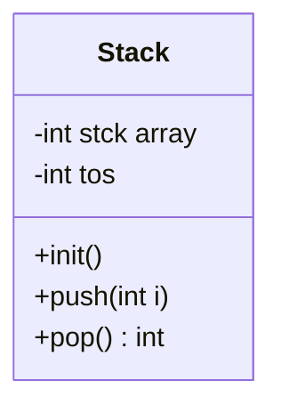

### Class vs object vs struct
- A **class declaration** creates a new type but allocates no memory for data. Memory is allocated when an **object** is created.
- In C++ a `struct` is also a class; the only difference is that members (and inheritance) are **public by default** in a struct and **private by default** in a class.
- A `union` can also have member functions and constructors, but all of its data members share the same memory.

### Size of an object
`sizeof(Stack)` equals the size of its data members (plus any padding) — member functions add nothing to an object's size. An **empty class** has size **1**, so that two distinct objects always have distinct addresses. A class with virtual functions gets an extra hidden pointer (the vptr).

### Why use classes?
Before classes, the stack's array and index would be global variables that any function could corrupt. Wrapping them in a class:
1. **Hides** the implementation — you could switch to a linked list without changing any code that uses `push` and `pop`.
2. **Groups** related data and behaviour, which makes large programs easier to understand.
3. **Allows multiple independent instances** — `s1` and `s2` do not interfere with each other.

The `init()` function in this example has a weakness: if the user forgets to call it, `tos` contains garbage. **Constructors** solve that problem by initializing objects automatically.

**Key points:**
- A class is a type; an object is an instance with its own copy of the data.
- Members are `private` by default in a class, `public` by default in a struct.
- Member functions are shared by all objects; data members are per object.
- `::` defines a member function outside the class; `.` and `->` access members.

=== Constructors and Destructors
difficulty: easy
---
An object usually needs some setup before it can be used — variables set to known values, memory allocated, a file opened. A **constructor** is a special member function that is **called automatically when an object is created**, so initialization can never be forgotten. Its partner, the **destructor**, is called automatically when the object is **destroyed**, so cleanup can never be forgotten either.

### Rules
- A constructor has the **same name as the class** and **no return type** (not even `void`).
- A destructor has the class name preceded by a **tilde** (`~`), takes **no parameters** and has no return type. There is exactly one destructor per class.
- Constructors can be **overloaded** and can have default arguments; destructors cannot be overloaded.
- If you write no constructor, the compiler supplies a **default constructor** that does nothing special for built-in members.

```cpp
#include <iostream>
#include <string>
using namespace std;

class Student {
    string name;
    int roll;
public:
    Student() : name("Unknown"), roll(0) {               // default constructor
        cout << "Default constructor\n";
    }
    Student(string n, int r) : name(n), roll(r) {        // parameterized constructor
        cout << "Constructing " << name << "\n";
    }
    ~Student() {                                          // destructor
        cout << "Destroying " << name << "\n";
    }
    void show() const { cout << roll << ": " << name << "\n"; }
};

int main()
{
    Student a;                    // calls Student()
    Student b("Riya", 7);         // calls Student(string, int)
    Student c = Student("Aman", 3);
    a.show();
    b.show();
    {
        Student temp("Temp", 99);  // destroyed at the end of this inner block
    }
    cout << "End of main\n";
    return 0;                      // c, b, a destroyed here - in REVERSE order
}
```

```text
Default constructor
Constructing Riya
Constructing Aman
0: Unknown
7: Riya
Constructing Temp
Destroying Temp
End of main
Destroying Aman
Destroying Riya
Destroying Unknown
```

### When are constructors and destructors executed?
- **Local objects:** the constructor runs when the declaration is reached; the destructor runs when the object goes out of scope. Locals are destroyed in the **reverse order of construction** (last created, first destroyed — like a stack).
- **Global objects:** constructed **before `main()` starts** and destroyed after `main()` ends.
- **Static local objects:** constructed the first time execution reaches the declaration, destroyed at program end.
- **Dynamic objects:** constructed by `new`, destroyed only when you call `delete`.

### Member initializer lists
The syntax `: name(n), roll(r)` after the parameter list is a **member initializer list**. It initializes members directly, instead of default-constructing them and then assigning. It is **required** for:
- `const` data members,
- reference members,
- members of a class type that has no default constructor,
- passing arguments to a base-class constructor.

Members are always initialized in the **order they are declared in the class**, not the order written in the list — a common trick question.

### Constructors with one parameter: a special case
If a constructor takes a single argument, you can initialize an object with `=`: `Student s = "Riya";` would call a `Student(string)` constructor. This implicit conversion can be disabled with the `explicit` keyword.

### Types of constructors
| Type | Example | Purpose |
|---|---|---|
| Default | `Student()` | No arguments; needed for arrays of objects |
| Parameterized | `Student(string, int)` | Initialize with given values |
| Copy | `Student(const Student &)` | Create a copy of an existing object |
| Move (C++11) | `Student(Student &&)` | Steal resources from a temporary |
| Delegating (C++11) | `Student() : Student("x", 0) {}` | Reuse another constructor |

Once you define **any** constructor, the compiler no longer generates the default one. So if `Student` had only the parameterized constructor, `Student a;` and `Student arr[10];` would not compile.

**Interview questions:**
- *Can a constructor be virtual?* No — when the constructor runs, the object's type is being established, so there is nothing to dispatch on yet. A destructor, however, can and often should be virtual.
- *Can a constructor be private?* Yes — it prevents outside code from creating objects, used in the Singleton pattern and factory functions.
- *Can a destructor throw?* It should not; throwing from a destructor during stack unwinding terminates the program.

**Key points:**
- Constructors initialize automatically; destructors clean up automatically.
- Same name as the class, no return type; destructors use `~` and take no arguments.
- Objects are destroyed in reverse order of construction.
- Prefer initializer lists; they are mandatory for const and reference members.

=== Copy Constructor, Deep Copy and Shallow Copy
difficulty: hard
---
A **copy constructor** is a constructor that creates a new object as a **copy of an existing object** of the same class. Its signature is `ClassName(const ClassName &other)`. This is one of the most heavily asked OOP-in-C++ topics, because getting it wrong in a class that owns memory causes crashes.

### When is the copy constructor called?
The copy constructor is used for **initialization**, which happens in three situations:
1. When one object explicitly initializes another: `Array x = y;` or `Array x(y);`
2. When an object is **passed by value** to a function.
3. When a function **returns an object by value** (a temporary is created — though modern compilers often elide this copy).

It is **not** called for **assignment** between two existing objects (`b = a;`) — that uses the assignment operator `operator=`.

### The problem: shallow copy
If you do not write a copy constructor, the compiler generates one that copies each member **bit by bit** (memberwise). For a pointer member, this copies the *address*, not the data it points to. Both objects then point to the **same memory**:

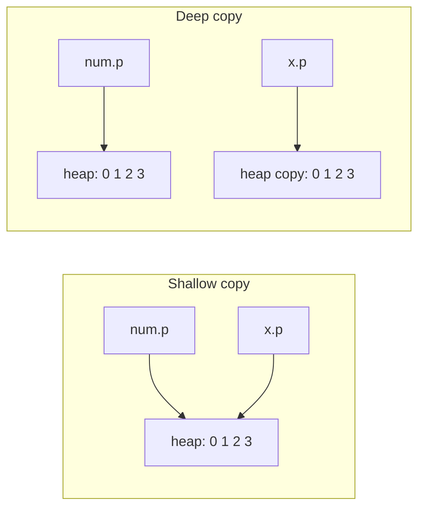

With a shallow copy:
- changing one object's data silently changes the other's, and
- when both destructors run, the same memory is `delete[]`d **twice** — undefined behaviour, usually a crash.

### The fix: deep copy
The book's example is a "safe array" class that allocates its storage with `new`. It needs its own copy constructor that allocates **fresh memory** and copies the **contents**:

```cpp
#include <iostream>
using namespace std;

class Array {
    int *p;
    int size;
public:
    Array(int sz) : p(new int[sz]), size(sz) {
        cout << "Constructor\n";
    }

    // Copy constructor: deep copy
    Array(const Array &a) : p(new int[a.size]), size(a.size) {
        for (int i = 0; i < size; i++) p[i] = a.p[i];
        cout << "Copy constructor\n";
    }

    // Copy assignment operator: also needs a deep copy
    Array &operator=(const Array &a) {
        if (this != &a) {                  // guard against self-assignment (a = a)
            int *newp = new int[a.size];
            for (int i = 0; i < a.size; i++) newp[i] = a.p[i];
            delete[] p;                    // release the old memory
            p = newp;
            size = a.size;
        }
        cout << "Assignment operator\n";
        return *this;
    }

    ~Array() { delete[] p; }

    void put(int i, int v) { if (i >= 0 && i < size) p[i] = v; }
    int get(int i) const { return p[i]; }
};

void display(Array a)              // pass by value -> copy constructor
{
    cout << a.get(0) << "\n";
}

int main()
{
    Array num(5);
    for (int i = 0; i < 5; i++) num.put(i, i);

    Array x(num);                  // copy constructor
    x.put(0, 100);                 // changes ONLY x, because the memory is separate
    cout << num.get(0) << " " << x.get(0) << "\n";   // 0 100

    display(num);                  // copy constructor again

    Array y(3);
    y = num;                       // assignment operator, NOT the copy constructor
    return 0;                      // each destructor frees its own memory: no crash
}
```

```text
Constructor
Copy constructor
0 100
Copy constructor
0
Constructor
Assignment operator
```

### Why must the parameter be a reference?
If the copy constructor took its parameter **by value** — `Array(Array a)` — then passing the argument would itself require a copy, which would call the copy constructor, which would need another copy... infinite recursion. The compiler rejects it. The parameter is `const` so that temporaries can be copied and the source cannot be modified.

### The Rule of Three (and Five)
If a class needs **any one** of these, it almost certainly needs **all three**:
1. a destructor,
2. a copy constructor,
3. a copy assignment operator.

They all exist because the class owns a resource (memory, a file, a socket). C++11 adds the **move constructor** and **move assignment operator** (Rule of Five), which transfer the resource from a temporary instead of copying it. The modern alternative is the **Rule of Zero**: hold resources in classes that already manage them (`vector`, `string`, `unique_ptr`), so the compiler-generated versions are correct and you write none of the five.

You can also **forbid** copying: `Array(const Array &) = delete;`.

**Key points:**
- The copy constructor runs on initialization (declaration, pass by value, return by value), not on assignment.
- The default copy is shallow — dangerous for pointer members.
- A deep copy allocates new memory and copies the contents.
- The parameter must be a (const) reference to avoid infinite recursion.
- Rule of Three: destructor, copy constructor and copy assignment go together.

=== The this Pointer
difficulty: medium
---
Every non-static member function receives a hidden extra argument: a pointer to the **object that invoked it**. This pointer is called **`this`**. It is how a single copy of a member function, shared by all objects, knows *which* object's data to work on.

When you write `ob.setBalance(500);`, the compiler effectively turns it into `setBalance(&ob, 500);`, and inside the function every reference to a member such as `balance` is really `this->balance`.

```cpp
#include <iostream>
#include <string>
using namespace std;

class Account {
    string owner;
    double balance;
public:
    // 1. Resolving a name clash between a parameter and a member
    Account(string owner, double balance) {
        this->owner = owner;        // this->owner is the member, owner is the parameter
        this->balance = balance;
    }

    // 2. Returning *this to allow method chaining
    Account &deposit(double amt)  { balance += amt; return *this; }
    Account &withdraw(double amt) { if (amt <= balance) balance -= amt; return *this; }

    // 3. Comparing with another object / detecting self-reference
    bool isSame(const Account &other) const { return this == &other; }

    void show() const {
        cout << owner << ": " << this->balance << "\n";   // same as balance
        cout << "object at address " << this << "\n";
    }
};

int main()
{
    Account a("Riya", 1000);
    a.deposit(500).withdraw(200).deposit(50);   // chaining - each call returns a
    a.show();                                   // Riya: 1350

    Account b("Aman", 300);
    cout << boolalpha << a.isSame(a) << " " << a.isSame(b) << "\n";   // true false
    return 0;
}
```

### Common uses of `this`
1. **Disambiguating names** — when a parameter has the same name as a data member, `this->member` refers to the member. (A member initializer list `: owner(owner)` also works.)
2. **Returning the current object** — `return *this;` returns the object itself (by reference), enabling **method chaining** such as `a.deposit(500).withdraw(200)`. This is how `cout << a << b` works: each `operator<<` returns the stream.
3. **Self-assignment check** in `operator=`: `if (this != &other) { ... }` prevents deleting your own data before copying it.
4. **Passing the current object** to another function, e.g. registering itself with a manager: `registry.add(this);`.
5. **Operator overloading** — in a member `operator+`, the left operand is `*this`.

### Facts interviewers check
- `this` is a **prvalue** of type `ClassName *` (in practice a constant pointer) — you cannot assign to it: `this = &other;` is an error.
- In a **const member function**, `this` has type `const ClassName *`, which is why such functions cannot modify members.
- **Static member functions do not have a `this` pointer**, because they are not called on an object. That is why a static function cannot access non-static members directly.
- **Friend functions** do not have a `this` pointer either, because they are not members.
- `delete this;` is legal but dangerous: the object must have been created with `new`, and no member may be touched afterwards.

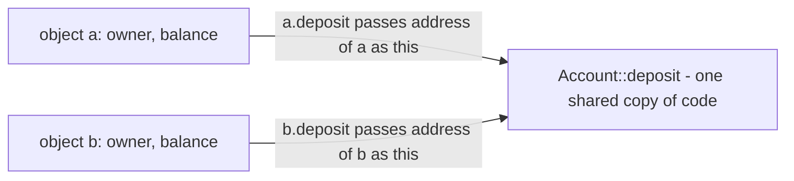

**Key points:**
- `this` points to the object on which a member function was called.
- Use `this->x` to distinguish a member from a parameter of the same name.
- `return *this;` enables chaining and is used by assignment and stream operators.
- Static member functions and friends have no `this`.

=== Static Data Members and Static Member Functions
difficulty: medium
---
Normally each object has its own copy of every data member. Sometimes, though, you need data that belongs to the **class as a whole** rather than to any one object — for example, a count of how many objects exist, a shared configuration value, or the next ID to hand out. Declaring a member **`static`** does exactly that: **only one copy exists, shared by all objects of the class**.

### Static data members

```cpp
#include <iostream>
#include <string>
using namespace std;

class Student {
    string name;
    int id;
    static int count;          // declaration: one shared copy
    static int nextId;
public:
    Student(string n) : name(n), id(nextId++) { count++; }
    ~Student() { count--; }

    void show() const { cout << id << ": " << name << "\n"; }

    static int getCount() { return count; }    // static member function
};

// Definition (and initialization) OUTSIDE the class - allocates the storage
int Student::count = 0;
int Student::nextId = 1001;

int main()
{
    cout << "Students: " << Student::getCount() << "\n";   // 0 - no object needed

    Student a("Riya");
    Student b("Aman");
    {
        Student c("Neha");
        cout << "Students: " << Student::getCount() << "\n";   // 3
        c.show();                                               // 1003: Neha
    }
    cout << "Students: " << Student::getCount() << "\n";   // 2 (c was destroyed)
    a.show();                                               // 1001: Riya
    b.show();                                               // 1002: Aman
    return 0;
}
```

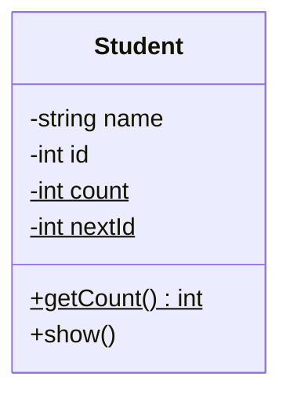

*(In UML, a `$` / underline marks a static member.)*

**Important rules:**
- The declaration inside the class does **not** allocate storage. You must **define** the static member exactly once outside the class (in a `.cpp` file), using the scope resolution operator: `int Student::count = 0;`. Forgetting this produces a linker error ("undefined reference to Student::count"). (Since C++17 you can write `inline static int count = 0;` inside the class instead. A `static const int` of integral type can also be initialized inside the class.)
- Static data members exist **before any object is created** and are zero-initialized by default.
- They can be accessed through the class name (`Student::count`, preferred) or through any object (`a.count`) — both refer to the same variable.
- They still obey access control: a private static is only visible to members and friends.

### Static member functions
A **static member function** belongs to the class rather than to an object. It can be called without any object: `Student::getCount()`.

Restrictions (frequently asked):
- It has **no `this` pointer**, so it can access **only static members** directly — it cannot touch `name` or `id`, because there is no object to take them from.
- It **cannot be virtual**, and cannot be declared `const`.
- It can, however, access private static data — and private non-static members of an object passed to it as a parameter.

Typical uses:
- Accessing or modifying static data (counters, shared settings).
- **Factory functions** — `static Student create(string name);`.
- The **Singleton pattern**, where a static function returns the single instance:

```cpp
class Config {
    Config() {}                     // private constructor
public:
    static Config &instance() {
        static Config obj;          // created once, on first call
        return obj;
    }
};
// Config::instance() always returns the same object
```

### Static members vs global variables
Static data members do the same job as global variables but without polluting the global namespace, and with access control. The book notes that one of their purposes is to eliminate the need for globals when objects must share information — for example a shared flag that tells every object whether a resource is currently in use.

**Key points:**
- One copy of a static data member is shared by every object of the class.
- Declare inside the class, define (allocate) once outside: `int Student::count = 0;`.
- Static member functions have no `this` and can only use static members directly.
- Access via `ClassName::member`; static members exist even when no objects do.

=== Friend Functions and Friend Classes
difficulty: medium
---
Private members are normally accessible only to a class's own member functions. Occasionally, however, a function that is *not* a member needs access to the private data of a class — typically because it works with **two classes at once**, or because it must be a non-member to have the right syntax (as with `operator<<`). C++ lets a class grant such access by declaring the function a **friend**.

### Friend functions
A friend function is declared inside the class with the keyword **`friend`**, but it is **not a member** of the class. It is defined like a normal function (without `ClassName::`) and called like a normal function (without an object and dot).

The book's example: two classes, `C1` and `C2`, each with a status flag, and one function that checks both:

```cpp
#include <iostream>
using namespace std;

class C2;                       // forward declaration - needed because C1 mentions C2

class C1 {
    int status;                 // IDLE = 0, ON = 1
public:
    void setStatus(int s) { status = s; }
    friend bool idle(const C1 &a, const C2 &b);
};

class C2 {
    int status;
public:
    void setStatus(int s) { status = s; }
    friend bool idle(const C1 &a, const C2 &b);
};

// Not a member of either class, but can read both private 'status' fields
bool idle(const C1 &a, const C2 &b)
{
    return a.status == 0 && b.status == 0;
}

int main()
{
    C1 x;
    C2 y;
    x.setStatus(1);
    y.setStatus(0);
    cout << (idle(x, y) ? "Screen can be used\n" : "In use\n");   // In use
    x.setStatus(0);
    cout << (idle(x, y) ? "Screen can be used\n" : "In use\n");   // Screen can be used
    return 0;
}
```

Without the friend function you would need public getters on both classes, or make `idle()` a member of one class and still need access to the other.

**Friend function facts:**
- It can be declared in the `public` or `private` section — it makes no difference.
- It has **no `this` pointer**; the objects it works on must be passed as arguments.
- It is **not inherited** — a friend of the base class is not automatically a friend of a derived class.
- A member function of *another* class can be a friend: `friend void Logger::write(const Account &);`.

### Friend functions in operator overloading
The most common real use. `cout << obj` requires `operator<<` to be a non-member (the left operand is `ostream`), yet it needs the private data:

```cpp
class Point {
    int x, y;
public:
    Point(int a, int b) : x(a), y(b) {}
    friend ostream &operator<<(ostream &out, const Point &p);
};

ostream &operator<<(ostream &out, const Point &p)
{
    return out << "(" << p.x << ", " << p.y << ")";
}
```

Similarly, `2 * obj` can only be supported by a friend (or non-member) `operator*(int, const T&)`.

### Friend classes
An entire class can be made a friend. Then **every** member function of the friend class can access the private members of the class that granted friendship:

```cpp
#include <iostream>
using namespace std;

class Engine {
    int rpm = 0;
    friend class Mechanic;          // Mechanic may access everything in Engine
};

class Mechanic {
public:
    void tune(Engine &e, int r) { e.rpm = r; }
    int check(const Engine &e) const { return e.rpm; }
};

int main()
{
    Engine e;
    Mechanic m;
    m.tune(e, 3000);
    cout << m.check(e) << "\n";     // 3000
    return 0;
}
```

### Friendship properties (classic interview question)
- **Not mutual:** if `A` declares `B` a friend, `B` can access `A`'s privates, but `A` cannot access `B`'s.
- **Not transitive:** a friend of a friend is not a friend.
- **Not inherited:** classes derived from `Mechanic` do not get access to `Engine`.
- Friendship is **granted** by the class, never taken — code cannot declare itself a friend of someone else's class.

### Does friend break encapsulation?
Partly, which is why it should be used sparingly. But a friend is declared *inside* the class, so the class still controls exactly who has access; it is often cleaner than making data public or adding getters just for one outside function. Stroustrup describes friends as part of the class's interface.

**Key points:**
- A friend function is a non-member that can access private and protected members.
- Use friends for functions that work with two classes, and for operators like `<<` or `int * obj`.
- A friend class gives all its member functions access.
- Friendship is not mutual, not transitive and not inherited.

=== Passing Objects to Functions, Returning Objects and Object Assignment
difficulty: medium
---
Objects can be passed to functions, returned from functions and assigned to one another just like built-in variables. But because objects have constructors and destructors — and may own resources such as dynamic memory — each of these operations has consequences that interviewers like to probe.

### Passing objects by value
By default objects are passed **by value**: a **copy** of the object is made for the parameter. This copy is created with the **copy constructor** (not the normal constructor), and when the function ends, the copy's **destructor** runs.

```cpp
#include <iostream>
using namespace std;

class Demo {
    int id;
public:
    Demo(int i) : id(i) { cout << "Constructing " << id << "\n"; }
    Demo(const Demo &d) : id(d.id) { cout << "Copying " << id << "\n"; }
    ~Demo() { cout << "Destroying " << id << "\n"; }
    void setId(int i) { id = i; }
    int getId() const { return id; }
};

void byValue(Demo d)          { d.setId(99); }   // changes only the copy
void byReference(Demo &d)     { d.setId(42); }   // changes the original
void byConstRef(const Demo &d) { cout << "Reading " << d.getId() << "\n"; }

int main()
{
    Demo ob(1);
    byValue(ob);                       // Copying 1 ... Destroying 99
    cout << "after byValue: " << ob.getId() << "\n";       // 1
    byReference(ob);
    cout << "after byReference: " << ob.getId() << "\n";   // 42
    byConstRef(ob);                    // no copy, no extra destructor
    return 0;
}
```

```text
Constructing 1
Copying 1
Destroying 99
after byValue: 1
after byReference: 42
Reading 42
Destroying 42
```

The book points out the danger here: when the parameter copy is destroyed, its **destructor runs**. If the class frees dynamic memory in its destructor and has **no proper copy constructor**, the copy's destructor frees the memory that the original object is still using. The original is then left with a dangling pointer, and the memory is freed a second time when the original is destroyed. Two solutions: write a copy constructor that does a deep copy, or — usually better — **pass by reference** (`const Demo &` when the function only reads).

### Returning objects
A function can return an object by value. Conceptually a **temporary object** is created to hold the return value, and destroyed after it has been used. That temporary has the same destructor problem as above if the class owns memory and lacks a deep-copying copy constructor. Modern compilers apply **return value optimization (RVO)** and C++11 adds **move semantics**, so returning even large objects such as `vector` by value is cheap and is the recommended style.

```cpp
Demo make(int i)
{
    Demo temp(i);
    return temp;      // RVO: usually constructed directly in the caller's variable
}
```

**Never return a reference or pointer to a local object** — it is destroyed when the function returns.

### Object assignment
One object can be assigned to another **of the same type**. By default this does a **memberwise copy** of all the data:

```cpp
Demo a(1), b(2);
b = a;            // b's data becomes a copy of a's data
```

Assignment uses `operator=`, **not** the copy constructor (the object already exists). As with copying, the default memberwise assignment is a problem for classes with pointer members: both objects end up pointing to the same memory, and `b`'s original memory leaks. The solution is to overload `operator=` to perform a deep copy (see [Copy Constructor, Deep Copy and Shallow Copy](/student/interview-prep/guides/oop/copy-constructor-deep-copy-and-shallow-copy)).

| Statement | What runs |
|---|---|
| `Demo b = a;` / `Demo b(a);` | Copy constructor (initialization) |
| `b = a;` (b already exists) | Copy assignment operator |
| `f(a)` with `void f(Demo d)` | Copy constructor for `d`, then destructor at the end of `f` |
| `return obj;` from `Demo f()` | Copy/move constructor, often elided (RVO) |

### Arrays of objects and pointers to objects
- An array of objects such as `Demo arr[3];` requires a **default constructor** unless you provide an initializer for every element: `Demo arr[3] = {Demo(1), Demo(2), Demo(3)};`.
- A pointer to an object uses the arrow operator: `Demo *p = &ob; p->getId();`. Incrementing a pointer to an array of objects moves to the next object, just as with built-in types.

**Key points:**
- Passing by value calls the copy constructor and, later, the destructor of the copy.
- Without a deep copy, a by-value copy's destructor can free memory the original still uses.
- Pass objects by (const) reference unless you need a copy.
- `b = a` uses `operator=`; `Demo b = a` uses the copy constructor.

=== Access Specifiers and Modes of Inheritance (public, protected, private)
difficulty: medium
---
When a class inherits from another, two separate things control access: the **access specifier of each member** in the base class (`public`, `protected`, `private`), and the **mode of inheritance** written in the derived class's declaration (`class Derived : public Base`). Interviewers love the resulting table.

### The protected specifier
`protected` sits between public and private:
- Like `private`, a protected member **cannot** be accessed by outside code.
- Unlike `private`, a protected member **can** be accessed by the member functions of **derived classes**.

Private members of a base class are **never** directly accessible in a derived class, under any inheritance mode — they still exist inside the derived object, but only the base class's own functions can touch them.

```cpp
#include <iostream>
using namespace std;

class Base {
private:
    int priv = 1;
protected:
    int prot = 2;
public:
    int pub = 3;
    int getPriv() const { return priv; }   // derived classes can use this
};

class Derived : public Base {
public:
    void show() {
        // cout << priv;          // ERROR: private in Base
        cout << prot << " ";      // OK: protected is visible to derived classes
        cout << pub << " ";       // OK
        cout << getPriv() << "\n"; // OK: through a public member function
    }
};

int main()
{
    Derived d;
    d.show();          // 2 3 1
    cout << d.pub << "\n";        // OK: still public through public inheritance
    // cout << d.prot;             // ERROR: protected is not accessible from outside
    return 0;
}
```

### Modes of inheritance
The inheritance mode decides what the **inherited** public and protected members become **in the derived class**:

| Member in Base | `public` inheritance | `protected` inheritance | `private` inheritance |
|---|---|---|---|
| `public` | public | protected | private |
| `protected` | protected | protected | private |
| `private` | not accessible | not accessible | not accessible |

An easy way to remember it: the inheritance mode is a **ceiling** — members can only become *more* restricted, never less.

- **Public inheritance** models an **"is-a"** relationship: a `Car` *is a* `Vehicle`, and every public operation of `Vehicle` is also a public operation of `Car`. This is what you want 95% of the time, and it is the only mode in which a base-class pointer can point to a derived object from outside code.
- **Protected inheritance** keeps the base's interface available to further-derived classes but hides it from the outside world. It is rarely used.
- **Private inheritance** means **"implemented in terms of"**: the derived class uses the base's code internally but does not expose it. Usually composition (holding a member object) expresses this more clearly.

```cpp
class Stack : private std::vector<int> {   // Stack uses vector internally...
public:
    void push(int x) { push_back(x); }
    int pop() { int t = back(); pop_back(); return t; }
    using std::vector<int>::size;          // ...and re-exposes only what it wants
};
// Stack s; s.push_back(1);   // ERROR: push_back is private in Stack
```

The `using Base::name;` declaration (older C++ used an *access declaration* `Base::name;`) **restores** the original access level of a specific inherited member — the book calls this "granting access".

### Defaults
If no mode is written, a `class` inherits **privately** by default and a `struct` inherits **publicly**:

```cpp
class D1 : Base {};    // private inheritance
struct D2 : Base {};   // public inheritance
```

Forgetting `public` is a common bug: everything inherited suddenly becomes inaccessible from outside.

### When to use protected members
Use `protected` for data or helper functions that derived classes genuinely need. Many style guides recommend keeping **data private** even in base classes and providing **protected functions** instead, so the base class keeps control over its own invariants.

**Key points:**
- `protected` = private to the outside world, accessible to derived classes.
- Base-class private members are never directly accessible in derived classes.
- Public inheritance keeps access levels; protected and private inheritance reduce them.
- `class` inherits privately by default, `struct` publicly.
- Public inheritance = "is-a"; private inheritance = "implemented in terms of".

=== Types of Inheritance in C++
difficulty: easy
---
**Inheritance** lets a new class (the **derived** class, or child) acquire the members of an existing class (the **base** class, or parent), then add or change behaviour. C++ supports several shapes of class hierarchy, and naming and drawing them is a standard interview question.

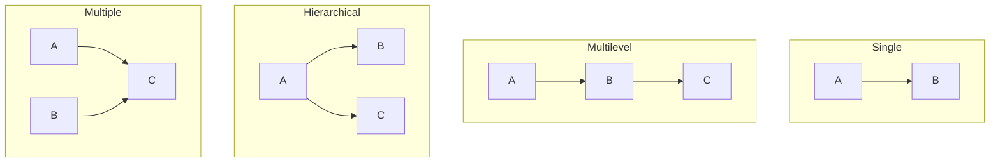

*(Arrows point from base to derived.)*

### 1. Single inheritance
One derived class, one base class.

```cpp
class Vehicle {
protected:
    int speed = 0;
public:
    void accelerate(int v) { speed += v; }
};

class Car : public Vehicle {
public:
    void show() const { cout << "Car at " << speed << " km/h\n"; }
};
```

### 2. Multilevel inheritance
A class is derived from a class that is itself derived — a chain. `Animal → Mammal → Dog`. The `Dog` has everything from both `Mammal` and `Animal`.

### 3. Hierarchical inheritance
Several classes derive from the same base. `Shape → Circle`, `Shape → Rectangle`, `Shape → Triangle`. This is the typical shape of polymorphic designs.

### 4. Multiple inheritance
One class inherits from **two or more** base classes at once. C++ supports this directly (Java does not, for classes):

```cpp
#include <iostream>
using namespace std;

class Printer {
public:
    void print() { cout << "Printing\n"; }
};

class Scanner {
public:
    void scan() { cout << "Scanning\n"; }
};

class AllInOne : public Printer, public Scanner {   // comma-separated list
public:
    void copy() { scan(); print(); }
};

int main()
{
    AllInOne m;
    m.print();
    m.scan();
    m.copy();
    return 0;
}
```

Each base class in the list has its own access specifier: `class D : public A, B` makes `B` **private**, a common slip.

**Ambiguity:** if two bases have a member with the same name, using it is ambiguous and must be qualified: `obj.Printer::status()`.

### 5. Hybrid inheritance
A combination of two or more of the above, for example hierarchical plus multiple. The best-known case is the **diamond**: `B` and `C` both derive from `A`, and `D` derives from both `B` and `C`. Without special handling, `D` contains **two copies** of `A`. C++ solves this with **virtual base classes** (see [Multiple Inheritance, the Diamond Problem and Virtual Base Classes](/student/interview-prep/guides/oop/multiple-inheritance-the-diamond-problem-and-virtual-base-classes)).

### A complete multilevel example

```cpp
#include <iostream>
#include <string>
using namespace std;

class Person {
protected:
    string name;
public:
    Person(string n) : name(n) {}
};

class Employee : public Person {
protected:
    double salary;
public:
    Employee(string n, double s) : Person(n), salary(s) {}
};

class Manager : public Employee {
    int teamSize;
public:
    Manager(string n, double s, int t) : Employee(n, s), teamSize(t) {}
    void show() const {
        cout << name << " manages " << teamSize
             << " people and earns " << salary << "\n";
    }
};

int main()
{
    Manager m("Riya", 150000, 8);
    m.show();       // Riya manages 8 people and earns 150000
    return 0;
}
```

`Manager` can use `name` (from `Person`) and `salary` (from `Employee`) because they are protected and the inheritance is public at every level.

### What is NOT inherited
- **Constructors and destructors** (each class has its own; derived constructors call base constructors). C++11 can opt in with `using Base::Base;`.
- The **copy assignment operator** (a derived class gets its own generated one, which calls the base's).
- **Friend** relationships.

**Benefits and caution:** inheritance gives code reuse and enables polymorphism, but it couples classes tightly. Prefer **composition** ("has-a") when the relationship is not truly "is-a".

**Key points:**
- Five forms: single, multilevel, hierarchical, multiple and hybrid.
- C++ supports multiple inheritance of classes; give each base its own access specifier.
- Name clashes in multiple inheritance are resolved with `Base::member`.
- Constructors, destructors, assignment and friendship are not inherited.

=== Constructors and Destructors in Inheritance
difficulty: medium
---
When a derived object is created, it contains a complete base-class part inside it. Both the base and the derived constructors must therefore run — in a defined order — and so must both destructors. "What is the order of constructor and destructor calls?" is a very common interview question, often asked as an output-prediction problem.

### The order
- **Constructors run from base to derived:** the base part must be built first, because the derived constructor may use it.
- **Destructors run in the reverse order, from derived to base:** the derived part may depend on the base, so it is torn down first.

The book's example:

```cpp
#include <iostream>
using namespace std;

class base {
public:
    base()  { cout << "Constructing base\n"; }
    ~base() { cout << "Destructing base\n"; }
};

class derived1 : public base {
public:
    derived1()  { cout << "Constructing derived1\n"; }
    ~derived1() { cout << "Destructing derived1\n"; }
};

class derived2 : public derived1 {
public:
    derived2()  { cout << "Constructing derived2\n"; }
    ~derived2() { cout << "Destructing derived2\n"; }
};

int main()
{
    derived2 ob;      // construct and destruct ob
    return 0;
}
```

```text
Constructing base
Constructing derived1
Constructing derived2
Destructing derived2
Destructing derived1
Destructing base
```

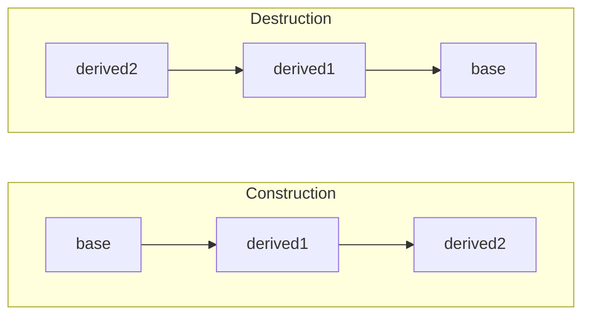

With **multiple inheritance**, base constructors run in the order the bases are **listed in the class declaration** (left to right), and destructors in the reverse order. For `class D : public A, public B`, the order is A, B, D, then ~D, ~B, ~A.

The complete rule for one object: (1) virtual base classes, (2) direct base classes in declaration order, (3) **data members** in declaration order, (4) the constructor body. Destruction is exactly the reverse.

### Passing arguments to base-class constructors
If the base constructor needs arguments, the derived constructor must pass them using an **initializer list**. The general form is:

```cpp
derived(arg-list) : base1(args), base2(args), member(args) { body }
```

```cpp
#include <iostream>
#include <string>
using namespace std;

class Shape {
protected:
    string name;
public:
    Shape(string n) : name(n) { cout << "Shape(" << name << ")\n"; }
    ~Shape() { cout << "~Shape\n"; }
};

class Rectangle : public Shape {
    double w, h;
public:
    // Rectangle passes the name on to Shape, keeps w and h for itself
    Rectangle(double width, double height)
        : Shape("rectangle"), w(width), h(height) {
        cout << "Rectangle " << w << " x " << h << "\n";
    }
    ~Rectangle() { cout << "~Rectangle\n"; }
    double area() const { return w * h; }
};

int main()
{
    Rectangle r(3, 4);
    cout << "Area: " << r.area() << "\n";
    return 0;
}
```

```text
Shape(rectangle)
Rectangle 3 x 4
Area: 12
~Rectangle
~Shape
```

Notes:
- If you do not call a base constructor explicitly, the base's **default constructor** is called. If the base has no default constructor, the code does not compile — you *must* use the initializer list.
- You cannot initialize base-class members directly in the derived initializer list (`: name("x")` is an error); pass the value to the base constructor instead.
- The derived constructor may take arguments that it only passes on, or that it shares with the base.
- Arguments to a **virtual base class** are passed by the **most-derived** class.

### Calling virtual functions in constructors — a trap
While the `Shape` constructor is running, the `Rectangle` part does not exist yet, so a virtual function call inside a base constructor (or destructor) calls the **base** version, not the override. Never rely on virtual dispatch during construction or destruction.

### Destructors and polymorphism
If a derived object is deleted **through a base-class pointer**, the base destructor must be **virtual**, otherwise only `~Shape` runs and the derived part is leaked (see [Virtual Destructors](/student/interview-prep/guides/oop/virtual-destructors)).

**Key points:**
- Constructors: base first, then derived. Destructors: derived first, then base.
- Multiple bases are constructed in declaration order; members after bases.
- Pass arguments to base constructors through the derived initializer list.
- Virtual calls inside constructors/destructors do not reach derived overrides.

=== Multiple Inheritance, the Diamond Problem and Virtual Base Classes
difficulty: hard
---
Multiple inheritance lets a class have more than one direct base class. It is powerful but introduces a well-known problem: when two base classes themselves share a common base, the most-derived class ends up with **two copies** of that common base. This is the **diamond problem**, and C++ solves it with **virtual base classes**.

### The problem
The book's example: class `base` has a member `i`. `derived1` and `derived2` both inherit from `base`, and `derived3` inherits from both:

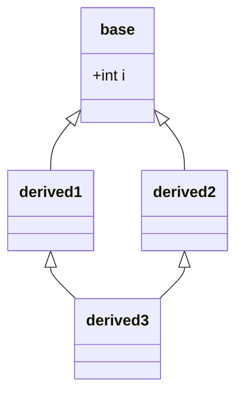

```cpp
class base { public: int i; };
class derived1 : public base { public: int j; };
class derived2 : public base { public: int k; };
class derived3 : public derived1, public derived2 { public: int sum; };

int main()
{
    derived3 ob;
    // ob.i = 10;          // ERROR: ambiguous - which i? derived1's or derived2's?
    ob.derived1::i = 10;   // legal, but there really are TWO separate i's
    ob.derived2::i = 20;
    return 0;
}
```

A `derived3` object physically contains two `base` sub-objects — one inside its `derived1` part and one inside its `derived2` part. Any reference to `i` is ambiguous, converting a `derived3*` to a `base*` is ambiguous, and in most designs having two copies is simply wrong (one `Person` should not have two names).

### The solution: virtual base classes
When the intermediate classes inherit with the keyword **`virtual`**, the compiler ensures that only **one shared copy** of the base exists in any object that inherits it through several paths:

```cpp
#include <iostream>
using namespace std;

class base {
public:
    int i;
    base() { cout << "base constructed\n"; }
};

// virtual inheritance: derived3 will contain only ONE base sub-object
class derived1 : virtual public base { public: int j; };
class derived2 : virtual public base { public: int k; };

class derived3 : public derived1, public derived2 {
public:
    int sum;
};

int main()
{
    derived3 ob;
    ob.i = 10;                 // no longer ambiguous
    ob.j = 20;
    ob.k = 30;
    ob.sum = ob.i + ob.j + ob.k;
    cout << ob.i << " " << ob.j << " " << ob.k << " " << ob.sum << "\n";
    cout << &ob.derived1::i << " == " << &ob.derived2::i << "\n";   // same address
    return 0;
}
```

```text
base constructed
10 20 30 60
0x61febc == 0x61febc   (same address twice - exact value differs per run)
```

`base` is constructed **once**, and `derived1::i` and `derived2::i` are the same variable.

### Who constructs the virtual base?
Because the shared base belongs to neither path exclusively, its constructor is called directly by the **most-derived class**, before any other base. Any arguments that `derived1` or `derived2` try to pass to `base` are ignored when building a `derived3`:

```cpp
class Person {
public:
    string name;
    Person(string n) : name(n) {}
};
class Student : virtual public Person {
public:
    Student(string n) : Person(n) {}
};
class Teacher : virtual public Person {
public:
    Teacher(string n) : Person(n) {}
};
class TA : public Student, public Teacher {
public:
    // TA must call Person's constructor itself
    TA(string n) : Person(n), Student(n), Teacher(n) {}
};
```

If `TA` did not call `Person(n)`, the compiler would try `Person`'s default constructor — and fail here because there is none.

### Facts to remember
- `virtual` is placed on the **intermediate** classes (`derived1`, `derived2`), not on the final class. Where it is placed relative to `public` does not matter: `virtual public` = `public virtual`.
- The only difference between a normal and a virtual base appears when an object inherits the base **more than once**; for a simple chain there is no observable difference.
- Virtual inheritance has a cost: objects carry an extra hidden pointer/offset to locate the shared base, and member access is slightly slower.
- The real-world example is the standard library itself: `iostream` inherits from both `istream` and `ostream`, which both virtually inherit `ios`, so a `iostream` has only one set of stream-state flags.

### Interview angle: why Java avoids it
Java and C# forbid multiple inheritance of classes precisely to avoid diamond ambiguity, allowing it only for **interfaces** (which have no data). In C++ you can follow the same discipline: inherit implementation from at most one class and use **abstract classes with only pure virtual functions** as "interfaces" for the others.

**Key points:**
- The diamond problem: a class inherits the same base through two paths and gets two copies.
- Members of the duplicated base become ambiguous; qualify with `Class::member` or fix the design.
- `class D1 : virtual public Base` makes all paths share one `Base` sub-object.
- The most-derived class calls the virtual base's constructor.

=== Virtual Functions and Runtime Polymorphism
difficulty: medium
---
**Polymorphism** ("many forms") is supported in C++ in two ways. **Compile-time polymorphism** comes from function and operator overloading and templates: the compiler decides which function to call. **Run-time polymorphism** comes from **inheritance plus virtual functions**: the decision is made while the program runs, based on the **actual type of the object**. The book describes this as "one interface, multiple methods".

### What is a virtual function?
A **virtual function** is a member function declared with the keyword **`virtual`** in a base class and **redefined (overridden)** in a derived class. When it is called **through a base-class pointer or reference**, C++ looks at the type of the object actually pointed to and calls *that* class's version.

```cpp
#include <iostream>
using namespace std;

class base {
public:
    virtual void vfunc() { cout << "This is base's vfunc().\n"; }
    void nonVirtual()    { cout << "base::nonVirtual\n"; }
};

class derived1 : public base {
public:
    void vfunc() override { cout << "This is derived1's vfunc().\n"; }
    void nonVirtual()     { cout << "derived1::nonVirtual\n"; }
};

class derived2 : public base {
public:
    void vfunc() override { cout << "This is derived2's vfunc().\n"; }
};

int main()
{
    base *p, b;
    derived1 d1;
    derived2 d2;

    p = &b;  p->vfunc();      // base's vfunc()
    p = &d1; p->vfunc();      // derived1's vfunc()  <- decided at run time
    p = &d2; p->vfunc();      // derived2's vfunc()

    p = &d1; p->nonVirtual(); // base::nonVirtual - NOT virtual, uses pointer type
    return 0;
}
```

```text
This is base's vfunc().
This is derived1's vfunc().
This is derived2's vfunc().
base::nonVirtual
```

The **same statement**, `p->vfunc()`, does different things depending on what `p` points to. For the non-virtual function, the compiler simply uses the **type of the pointer** (`base*`), so the derived version is ignored.

### The rules for run-time polymorphism
1. The function must be declared `virtual` in the base class.
2. The derived class must override it with the **same signature** (name, parameters, constness). A different signature creates a new, unrelated function that **hides** the base version instead of overriding it.
3. The call must be made through a **pointer or reference** to the base class. Calling through an object (`d1.vfunc()`) or a base *object* copied from a derived one uses static binding.

Mark overrides with **`override`** (C++11): the compiler then reports an error if the function does not actually override anything — catching typos and signature mismatches. `final` prevents further overriding.

### Calling through a reference
Polymorphism works just as well through references, which is the most common style for function parameters:

```cpp
void describe(base &r) { r.vfunc(); }
describe(d1);    // derived1's vfunc()
describe(d2);    // derived2's vfunc()
```

### The virtual attribute is inherited — and hierarchical
Once a function is virtual, it stays virtual in every class derived further down, whether or not they repeat the keyword. If a derived class does **not** override a virtual function, the **nearest version up the hierarchy** is used. In the book's example, if `derived2` inherits from `derived1` and does not override `vfunc()`, calling it on a `derived2` runs `derived1::vfunc()`.

### A practical example
```cpp
#include <iostream>
#include <vector>
using namespace std;

class Employee {
public:
    virtual double pay() const { return 30000; }
    virtual ~Employee() {}
};
class Manager : public Employee {
public:
    double pay() const override { return 80000; }
};
class Intern : public Employee {
public:
    double pay() const override { return 10000; }
};

int main()
{
    vector<Employee*> staff = { new Employee, new Manager, new Intern };
    double total = 0;
    for (Employee *e : staff) total += e->pay();   // each object picks its own pay()
    cout << "Payroll: " << total << "\n";          // 120000
    for (Employee *e : staff) delete e;
    return 0;
}
```

The payroll loop never checks types. Adding a new `Contractor` class requires **no change** to the loop — this is the **open/closed principle** in action, and the real reason polymorphism matters.

**Key points:**
- Compile-time polymorphism: overloading and templates. Run-time polymorphism: virtual functions.
- A virtual call through a base pointer/reference runs the version for the object's actual type.
- Overrides need the exact same signature; use `override` to have the compiler check.
- Virtual-ness is inherited; if not overridden, the nearest base version is used.
- Constructors cannot be virtual; destructors of polymorphic bases should be.

=== Pure Virtual Functions and Abstract Classes
difficulty: medium
---
Sometimes a base class represents a concept so general that it cannot sensibly implement a function at all. What is the `area()` of a generic "shape"? What should a generic "number" display? For this, C++ provides **pure virtual functions**, and a class that contains one is an **abstract class**.

### Pure virtual functions
A pure virtual function is a virtual function with **no definition in the base class**, declared with `= 0`:

```cpp
virtual double area() const = 0;
```

It says: "every concrete derived class **must** provide this function". If a derived class does not override it, that derived class is also abstract.

### Abstract classes
A class with at least one pure virtual function is an **abstract class**:
- You **cannot create objects** of an abstract class — the compiler refuses, because the object would have a function with no body.
- You **can** declare **pointers and references** to it — that is the whole point, since they are used to access derived objects polymorphically.
- It can still have data members, constructors, and ordinary (even non-virtual) functions.

The book's `figure` example, slightly extended:

```cpp
#include <iostream>
using namespace std;

class figure {                   // abstract base class
protected:
    double x, y;
public:
    figure(double i, double j = 0) : x(i), y(j) {}
    virtual double area() const = 0;            // pure virtual
    virtual const char *name() const = 0;
    void show() const {                         // ordinary function using the pure virtuals
        cout << name() << " area: " << area() << "\n";
    }
    virtual ~figure() {}
};

class triangle : public figure {
public:
    triangle(double b, double h) : figure(b, h) {}
    double area() const override { return 0.5 * x * y; }
    const char *name() const override { return "Triangle"; }
};

class rectangle : public figure {
public:
    rectangle(double w, double h) : figure(w, h) {}
    double area() const override { return x * y; }
    const char *name() const override { return "Rectangle"; }
};

class circle : public figure {
public:
    circle(double r) : figure(r) {}
    double area() const override { return 3.14159 * x * x; }
    const char *name() const override { return "Circle"; }
};

int main()
{
    // figure f(1, 2);              // ERROR: cannot instantiate abstract class
    triangle t(10.0, 5.0);
    rectangle r(10.0, 5.0);
    circle c(1.0);

    figure *shapes[] = { &t, &r, &c };    // pointers to the abstract type are fine
    for (figure *f : shapes) f->show();
    return 0;
}
```

```text
Triangle area: 25
Rectangle area: 50
Circle area: 3.14159
```

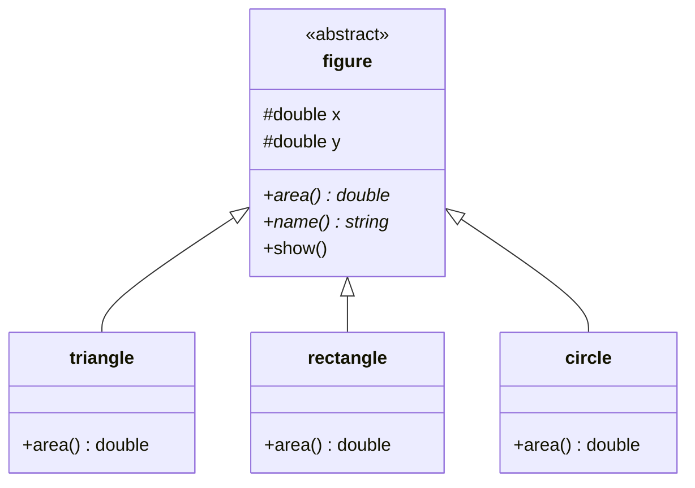

Notice that `show()` is written once in the base class but works for every shape: it calls `area()` and `name()`, which dispatch to the right derived version. This is the **Template Method** pattern.

### Abstract classes as interfaces
C++ has no `interface` keyword. A class containing **only pure virtual functions** (plus a virtual destructor) plays the same role as a Java interface — it defines a contract without any implementation:

```cpp
class Printable {
public:
    virtual void print() const = 0;
    virtual ~Printable() = default;
};
```

A class can implement several such interfaces via multiple inheritance without any diamond problems, since interfaces hold no data.

### Can a pure virtual function have a body?
Surprisingly, yes. You may define it outside the class; derived classes still must override it, but they can call the base version explicitly as `Base::func()` — useful for shared default work. A **pure virtual destructor** must always have a body, because derived destructors always call it:

```cpp
class Base { public: virtual ~Base() = 0; };
Base::~Base() {}   // required
```

### Abstract class vs concrete class
| Abstract class | Concrete class |
|---|---|
| Has at least one pure virtual function | All functions are implemented |
| Cannot be instantiated | Can be instantiated |
| Used as a base to define a common interface | Used to create objects |

**Key points:**
- `virtual void f() = 0;` declares a pure virtual function.
- A class with any pure virtual function is abstract and cannot be instantiated.
- Derived classes must override all pure virtual functions to become concrete.
- Pointers and references to abstract classes enable polymorphism.
- An interface in C++ = abstract class with only pure virtual functions and a virtual destructor.

=== Early vs Late Binding: How vtable and vptr Work
difficulty: hard
---
**Binding** means connecting a function call to the actual code that will run. C++ supports two kinds, and understanding how late binding is implemented — the **vtable** and **vptr** — is a favourite question for C++ roles.

### Early (static) binding
With **early binding** the compiler decides at **compile time** which function to call. It applies to normal functions, overloaded functions, non-virtual member functions and templates. Because everything is known ahead of time, the call is a direct jump — the fastest kind of call, and the compiler can even inline it.

### Late (dynamic) binding
With **late binding** the decision is postponed until **run time**. In C++ it happens when a **virtual function** is called through a **base-class pointer or reference**. The object's actual type is only known while the program runs, so the right function is looked up then. The book sums up the trade-off: late binding gives flexibility (a single interface handling many unforeseen types) at the cost of a slightly slower call.

```cpp
#include <iostream>
using namespace std;

class Animal {
public:
    void eat()           { cout << "Animal eats\n"; }      // early binding
    virtual void speak() { cout << "Animal speaks\n"; }    // late binding
    virtual ~Animal() {}
};

class Dog : public Animal {
public:
    void eat()            { cout << "Dog eats\n"; }
    void speak() override { cout << "Woof\n"; }
};

int main()
{
    Animal *a = new Dog;
    a->eat();     // Animal eats  - chosen at compile time from the POINTER type
    a->speak();   // Woof         - chosen at run time from the OBJECT type
    delete a;
    return 0;
}
```

### How late binding works: vtable and vptr
The C++ standard does not dictate an implementation, but every major compiler uses this scheme:

1. **vtable (virtual table):** for every class that has virtual functions, the compiler creates **one static table** containing the addresses of that class's virtual functions. If a class overrides a function, its entry points to the override; otherwise it points to the inherited version.
2. **vptr (virtual pointer):** every **object** of such a class contains a **hidden pointer** to its class's vtable. The constructor sets it.
3. **A virtual call** `a->speak()` is compiled into: follow `a` to the object → read its vptr → look up the `speak` slot in that vtable → call the function at that address.

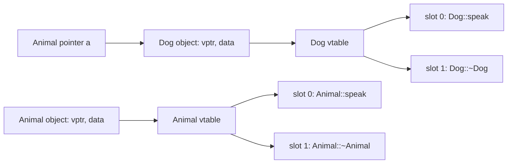

Because each object's vptr points to its *own* class's table, the same machine code for `a->speak()` reaches `Dog::speak` for a `Dog` and `Animal::speak` for an `Animal`.

### Consequences interviewers ask about
- **Object size grows:** a class with virtual functions has an extra pointer per object. On a 64-bit system, `sizeof` a class with one `int` and one virtual function is typically 16 (8 for the vptr + 4 for the int + 4 padding), versus 4 without `virtual`.
- **One vtable per class, one vptr per object.** Adding more virtual functions makes the table longer but does not make objects bigger.
- **Cost of a virtual call:** an extra memory load or two and an indirect jump, plus the compiler usually cannot inline it. Negligible in most code, relevant in very tight loops.
- **Constructors cannot be virtual:** the vptr is set *by* the constructor; before that, there is no table to look in.
- **During construction and destruction** the vptr points to the vtable of the class currently being constructed or destroyed. That is why a virtual call inside a base constructor runs the base version.
- **Calling a virtual function on an object (not a pointer/reference)**, or with explicit qualification like `a->Animal::speak()`, uses early binding.
- **Static functions and friends** cannot be virtual — there is no object, hence no vptr.

### Early vs late binding summary

| | Early binding | Late binding |
|---|---|---|
| Decided at | Compile time | Run time |
| Applies to | Normal, overloaded, non-virtual, template functions | Virtual functions via base pointer/reference |
| Mechanism | Direct call | vptr → vtable → function |
| Speed | Faster, inlinable | Slightly slower |
| Flexibility | Fixed | New derived types work without recompiling callers |

**Key points:**
- Early binding: compiler picks the function from the static type. Late binding: run time picks it from the object's dynamic type.
- Each polymorphic class has one vtable of function addresses; each object has a hidden vptr to it.
- Virtual functions add a pointer to each object and an indirect call.
- In constructors and destructors, virtual calls resolve to the current class.

=== Virtual Destructors
difficulty: medium
---
"Why should a base class destructor be virtual?" is one of the most frequently asked C++ OOP questions. The answer comes straight from how virtual functions and `delete` interact.

### The problem
When you `delete` an object through a **pointer to its base class**, C++ needs to know which destructor to run. If the base destructor is **not virtual**, the call is bound **statically**, using the pointer's type — so only the **base destructor** runs. The derived class's destructor never executes, and any resources it owns are **leaked**. Formally the behaviour is **undefined**.

```cpp
#include <iostream>
using namespace std;

class Base {
public:
    Base()  { cout << "Base constructor\n"; }
    ~Base() { cout << "Base destructor\n"; }        // NOT virtual
};

class Derived : public Base {
    int *data;
public:
    Derived() : data(new int[1000]) { cout << "Derived constructor (allocated)\n"; }
    ~Derived() { delete[] data; cout << "Derived destructor (freed)\n"; }
};

int main()
{
    Base *p = new Derived;
    delete p;                   // only ~Base runs -> 1000 ints leaked
    return 0;
}
```

```text
Base constructor
Derived constructor (allocated)
Base destructor
```

`Derived destructor (freed)` never appears.

### The fix
Declare the base-class destructor **`virtual`**. Now `delete p` uses dynamic binding: it calls the **most-derived** destructor first, which then automatically calls the base destructors in the usual order (derived → base).

```cpp
class Base {
public:
    Base()  { cout << "Base constructor\n"; }
    virtual ~Base() { cout << "Base destructor\n"; }   // virtual
};
```

```text
Base constructor
Derived constructor (allocated)
Derived destructor (freed)
Base destructor
```

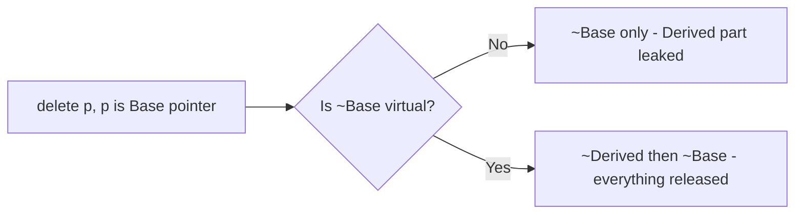

### The rule
> **If a class has any virtual function — i.e. it is meant to be used polymorphically — give it a virtual destructor.**

Once the base destructor is virtual, every derived destructor is automatically virtual too, even without the keyword. In modern C++ you can write `virtual ~Base() = default;`.

### When not to make it virtual
A virtual destructor adds a vtable and a vptr (if the class did not already have virtual functions). For a class that is **not designed to be a base class** — a simple value type like `Point` or `Date` — this is unnecessary overhead. Such classes can be marked `final` to prevent derivation. Another accepted alternative is a **protected non-virtual destructor**, which makes `delete` through a base pointer a compile error rather than a silent bug.

Standard library containers such as `std::vector` and `std::string` do **not** have virtual destructors, so you should not inherit from them publicly and delete through a base pointer.

### Related questions
- *Can a constructor be virtual?* No. Virtual dispatch needs the vptr, which the constructor itself sets up. To "virtually construct" objects, use a virtual `clone()` function or a factory.
- *Can a destructor be pure virtual?* Yes — `virtual ~Base() = 0;` makes a class abstract when it has no other natural pure virtual function. It **must still have a definition** (`Base::~Base() {}`), because every derived destructor calls it.
- *Does `unique_ptr<Base>` fix the problem?* No — `unique_ptr<Base>` calls `delete` on a `Base*`, so the base still needs a virtual destructor. (`shared_ptr` created with `make_shared<Derived>` happens to remember the correct deleter, but you should not rely on it.)

**Key points:**
- Deleting a derived object through a base pointer with a non-virtual destructor is undefined behaviour and typically leaks the derived part.
- A virtual base destructor makes `delete` call the derived destructor first, then the base.
- Rule: polymorphic base class ⇒ virtual destructor.
- Constructors cannot be virtual; pure virtual destructors need a body.

=== Function Overloading vs Overriding vs Hiding
difficulty: medium
---
Overloading and overriding sound similar and both involve functions with the same name, which is exactly why interviewers ask you to compare them. A third related concept, **name hiding**, explains a lot of confusing compiler errors.

### Overloading
**Overloading** means several functions with the **same name** but **different parameter lists** in the **same scope**. The compiler chooses one at **compile time** from the argument types — compile-time (static) polymorphism. No inheritance or `virtual` is involved.

### Overriding
**Overriding** means a **derived class** provides its own implementation of a **virtual** function from its base class, with the **same signature**. The version is chosen at **run time** from the actual object type when called through a base pointer or reference — run-time (dynamic) polymorphism.

```cpp
#include <iostream>
using namespace std;

class Printer {
public:
    // overloading: same name, different parameters, same class
    void print(int x)            { cout << "int: " << x << "\n"; }
    void print(double x)         { cout << "double: " << x << "\n"; }
    void print(const char *s)    { cout << "text: " << s << "\n"; }

    // a virtual function to be overridden
    virtual void header() const  { cout << "== Plain header ==\n"; }
    virtual ~Printer() {}
};

class FancyPrinter : public Printer {
public:
    // overriding: same signature, derived class, base function is virtual
    void header() const override { cout << "** Fancy header **\n"; }
};

int main()
{
    Printer p;
    p.print(5);          // int: 5          (compile-time choice)
    p.print(2.5);        // double: 2.5
    p.print("hi");       // text: hi

    Printer *ptr = new FancyPrinter;
    ptr->header();       // ** Fancy header **   (run-time choice)
    delete ptr;
    return 0;
}
```

### Comparison

| | Overloading | Overriding |
|---|---|---|
| Where | Same scope (usually the same class) | Base and derived classes |
| Signature | Must differ (number/types of parameters) | Must be the same |
| Return type | Can differ (but cannot be the *only* difference) | Same (or covariant pointer/reference) |
| `virtual` needed | No | Yes, in the base class |
| Resolved | Compile time | Run time |
| Polymorphism type | Static | Dynamic |
| Inheritance needed | No | Yes |
| Applies to constructors | Yes | No |
| Static functions | Can be overloaded | Cannot be overridden |

**Covariant return types:** an override may return a pointer or reference to a *derived* class where the base version returns one to the *base* class — for example `Base* clone()` overridden as `Derived* clone()`.

### Name hiding — the trap between the two
If a derived class declares a function with the **same name** as a base-class function but a **different signature**, it does **not** overload the base function — it **hides every base function with that name**:

```cpp
#include <iostream>
using namespace std;

class Base {
public:
    void show(int x)    { cout << "Base::show(int) " << x << "\n"; }
    void show()         { cout << "Base::show()\n"; }
};

class Derived : public Base {
public:
    void show(double d) { cout << "Derived::show(double) " << d << "\n"; }
};

int main()
{
    Derived d;
    d.show(3.5);       // Derived::show(double) 3.5
    d.show(7);         // ALSO Derived::show(double)! 7 is converted to 7.0
    // d.show();       // ERROR: Base::show() is hidden
    d.Base::show();    // OK with explicit qualification
    return 0;
}
```

Name lookup stops at the first scope where it finds the name (`Derived`), and only then does overload resolution happen — among `Derived`'s functions only. Fix it by bringing the base overloads into the derived scope:

```cpp
class Derived : public Base {
public:
    using Base::show;               // now all show() overloads are visible
    void show(double d) { /* ... */ }
};
```

The same mistake with a virtual function — slightly wrong signature, e.g. missing `const` — silently creates a new function instead of an override. Writing **`override`** turns that silent bug into a compile error.

### Redefining a non-virtual function
If a derived class redefines a **non-virtual** base function with the same signature, it also hides it; calls through a base pointer still run the base version (static binding). This is legal but confusing and is generally considered bad design.

**Key points:**
- Overloading: same name, different parameters, same scope, compile time.
- Overriding: same signature, virtual base function, derived class, run time.
- A same-name function in a derived class hides all base overloads; use `using Base::name;`.
- Always mark overrides with `override`.

=== Pointers to Derived Types and Object Slicing
difficulty: hard
---
C++ allows a **base-class pointer** (or reference) to point to an object of any class derived from that base. This one rule is what makes run-time polymorphism possible — and misusing it, by copying derived objects into base **objects**, causes **object slicing**.

### Base pointers to derived objects
```cpp
#include <iostream>
using namespace std;

class Base {
    int i;
public:
    void setI(int x) { i = x; }
    int getI() const { return i; }
    virtual void who() const { cout << "Base\n"; }
    virtual ~Base() {}
};

class Derived : public Base {
    int j;
public:
    void setJ(int x) { j = x; }
    int getJ() const { return j; }
    void who() const override { cout << "Derived\n"; }
};

int main()
{
    Base *bp;
    Derived d;

    bp = &d;               // OK: a Derived IS-A Base (upcast, implicit)
    bp->setI(10);          // OK: setI is a Base member
    cout << bp->getI() << "\n";   // 10
    bp->who();             // Derived (virtual call)
    // bp->setJ(20);       // ERROR: Base* only knows about Base members

    static_cast<Derived*>(bp)->setJ(20);   // OK because bp really points to a Derived
    cout << d.getJ() << "\n";              // 20
    return 0;
}
```

**Rules, as the book explains them:**
- A base pointer can point to a derived object (**upcasting**, implicit and always safe with public inheritance). The reverse — a derived pointer to a base object — is not allowed without a cast.
- Through a base pointer you can access **only the members defined in the base class**. Derived-only members (`setJ`) need a cast to a derived pointer (**downcasting**). Prefer `dynamic_cast`, which checks at run time and returns `nullptr` if the object is not really a `Derived`.
- **Pointer arithmetic** uses the pointer's base type. Incrementing a `Base*` that walks an array of `Derived` objects advances by `sizeof(Base)`, landing in the middle of an object — **never** do pointer arithmetic on base pointers to arrays of derived objects.

### Object slicing
Slicing happens when a derived object is **copied by value** into a base-class **object** (not a pointer or reference). Only the base part is copied; the derived part is "sliced off", and the copy is a genuine `Base` — its vptr points to `Base`'s vtable, so virtual calls no longer reach the derived overrides.

```cpp
#include <iostream>
#include <string>
using namespace std;

class Animal {
protected:
    string name;
public:
    Animal(string n) : name(n) {}
    virtual string sound() const { return "..."; }
    virtual ~Animal() {}
};

class Dog : public Animal {
    string breed;                       // this data will be sliced off
public:
    Dog(string n, string b) : Animal(n), breed(b) {}
    string sound() const override { return "Woof"; }
};

void byValue(Animal a)            { cout << "by value: " << a.sound() << "\n"; }
void byReference(const Animal &a) { cout << "by reference: " << a.sound() << "\n"; }

int main()
{
    Dog d("Tommy", "Beagle");

    Animal a = d;                 // SLICED: a is just an Animal now
    cout << a.sound() << "\n";    // ...

    byValue(d);                   // sliced again -> ...
    byReference(d);               // no slicing   -> Woof

    Animal &ref = d;              // reference: no slicing
    cout << ref.sound() << "\n";  // Woof
    return 0;
}
```

```text
...
by value: ...
by reference: Woof
Woof
```

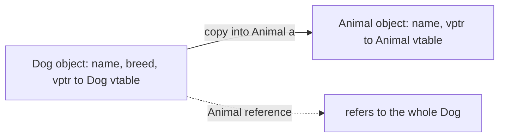

### Where slicing sneaks in
- Passing a derived object to a function that takes the base **by value**.
- Storing derived objects in a container of base objects: `vector<Animal> zoo; zoo.push_back(Dog(...));` — every element is a plain `Animal`.
- Catching exceptions by value: `catch (exception e)` slices a `runtime_error` (always catch by reference).
- Assigning: `Animal a = d;` or `a = d;`.

### How to avoid it
- Pass and store polymorphic objects by **reference** or **pointer**: `const Animal &`, `vector<unique_ptr<Animal>>`.
- Make polymorphic base classes **non-copyable** or abstract, so accidental slicing does not compile.
- If you really need a polymorphic copy, give the base a virtual `clone()` function.

**Key points:**
- A base pointer/reference can refer to a derived object; only base members are accessible through it.
- Downcast with `dynamic_cast` when you need derived-only members.
- Copying a derived object into a base object slices off the derived data and loses polymorphic behaviour.
- Use references, pointers or smart pointers for polymorphic objects; catch exceptions by reference.

=== RAII and Smart Pointers
difficulty: hard
---
**RAII — Resource Acquisition Is Initialization** — is the single most important idiom in C++, and it ties together constructors, destructors and exceptions. The idea: **tie the lifetime of a resource to the lifetime of an object**. The constructor acquires the resource (memory, a file, a lock, a network connection) and the destructor releases it. Because C++ guarantees that destructors of local objects run when they go out of scope — on normal return, on `break`, *and* during exception stack unwinding — the resource is always released and can never leak.

### The problem RAII solves
```cpp
void process()
{
    int *data = new int[1000];
    FILE *f = fopen("log.txt", "w");
    // ... if anything here throws or returns early ...
    fclose(f);          // ...these lines never run
    delete[] data;      // memory and file handle leaked
}
```

Every early `return` and every possible exception needs its own cleanup code — easy to get wrong.

### An RAII class
```cpp
#include <iostream>
#include <cstdio>
#include <stdexcept>
using namespace std;

class File {
    FILE *f;
public:
    File(const char *name, const char *mode) : f(fopen(name, mode)) {
        if (!f) throw runtime_error("cannot open file");
        cout << "File opened\n";
    }
    ~File() {
        fclose(f);                         // ALWAYS runs
        cout << "File closed\n";
    }
    File(const File &) = delete;           // non-copyable: one owner only
    File &operator=(const File &) = delete;
    void write(const char *s) { fputs(s, f); }
};

void work()
{
    File log("log.txt", "w");
    log.write("starting\n");
    throw runtime_error("something failed");   // log is still closed properly
}

int main()
{
    try { work(); }
    catch (const exception &e) { cout << "Caught: " << e.what() << "\n"; }
    return 0;
}
```

```text
File opened
File closed
Caught: something failed
```

The file is closed during stack unwinding, **before** the handler runs. The standard library is full of RAII types: `string`, `vector` and every container (memory), `ifstream`/`ofstream` (files), `lock_guard` (mutexes), and smart pointers.

### Smart pointers
A **smart pointer** is an RAII class that owns a dynamically allocated object and deletes it automatically. They live in `<memory>` and replace almost every raw `new`/`delete` in modern C++.

**`unique_ptr` — exclusive ownership**
```cpp
#include <iostream>
#include <memory>
using namespace std;

struct Node {
    int val;
    Node(int v) : val(v) { cout << "Node " << val << " created\n"; }
    ~Node() { cout << "Node " << val << " destroyed\n"; }
};

int main()
{
    unique_ptr<Node> a = make_unique<Node>(1);   // C++14
    cout << a->val << "\n";
    // unique_ptr<Node> b = a;                   // ERROR: cannot copy
    unique_ptr<Node> b = move(a);                // transfer ownership
    cout << (a ? "a owns" : "a is empty") << "\n";

    {
        shared_ptr<Node> s1 = make_shared<Node>(2);
        shared_ptr<Node> s2 = s1;                // shared ownership
        cout << "use_count: " << s1.use_count() << "\n";   // 2
    }                                            // count hits 0 -> Node 2 destroyed
    cout << "end of main\n";
    return 0;                                    // b destroyed -> Node 1 destroyed
}
```

```text
Node 1 created
1
a is empty
Node 2 created
use_count: 2
Node 2 destroyed
end of main
Node 1 destroyed
```

| Smart pointer | Ownership | Copyable | Notes |
|---|---|---|---|
| `unique_ptr<T>` | Exactly one owner | No (move only) | Zero overhead over a raw pointer; the default choice |
| `shared_ptr<T>` | Shared, reference-counted | Yes | Object deleted when the last owner goes away; count is atomic |
| `weak_ptr<T>` | Non-owning observer of a `shared_ptr` | Yes | Breaks reference cycles; `lock()` to use |

**Reference cycles:** if two objects hold `shared_ptr`s to each other (e.g. parent ↔ child), their counts never reach zero and both leak. Make one direction a `weak_ptr`.

**Prefer `make_unique` / `make_shared`** over `new`: they are exception-safe, and `make_shared` allocates the object and its control block in one allocation. (The book predates these — it shows the older `auto_ptr`, which was deprecated and later removed from C++ because its "copy" silently transferred ownership.)

### RAII and the Rule of Zero
If every resource is held by an RAII member (`vector`, `string`, `unique_ptr`), your class needs **no** user-written destructor, copy constructor or assignment operator — the compiler-generated ones do the right thing. That is the **Rule of Zero**, the modern alternative to hand-writing the Rule of Three/Five.

**Key points:**
- RAII: acquire in the constructor, release in the destructor; scope exit guarantees cleanup, even with exceptions.
- `unique_ptr` for single ownership, `shared_ptr` for shared ownership, `weak_ptr` to observe/break cycles.
- Use `make_unique`/`make_shared` rather than raw `new`.
- With RAII members, follow the Rule of Zero.
