=== What Is an Operating System? Definition, Goals and Views
difficulty: easy
---
An **operating system (OS)** is the system software that **manages the computer's hardware** and provides an environment in which application programs can run. It sits between the **user / application programs** and the **hardware**, hiding the hardware's complexity: a user saves a file without knowing which disk sectors are written, and a program prints without knowing the printer's control codes.

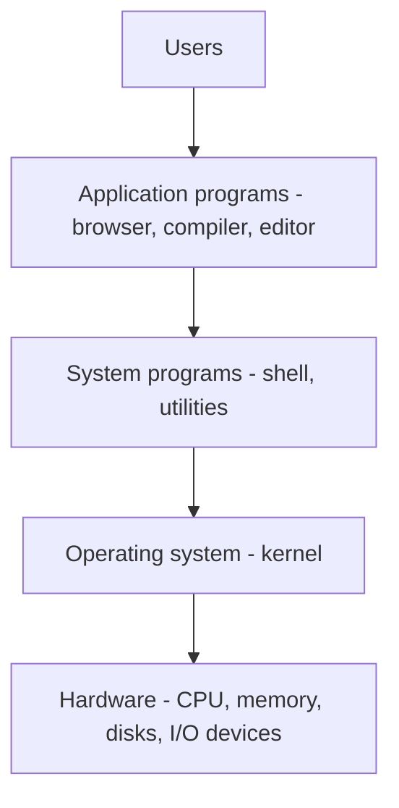

Examples: Windows, Linux, macOS, Android, iOS, Unix, MS-DOS. An OS is **system software**, not application software.

### Two classic definitions
1. **The OS as an extended machine (user / top-down view)** — it turns ugly, low-level hardware into clean **abstractions**: files instead of disk blocks, processes instead of CPU registers, sockets instead of network cards. The user sees a "virtual machine" that is easier to program than the real one.
2. **The OS as a resource manager (system / bottom-up view)** — it **allocates and controls** the CPU, memory, disks and devices among competing programs and users, efficiently and fairly, and prevents them from interfering with each other.

The **kernel** is the core part of the OS that is always resident in memory and runs with full hardware privileges. Everything else (shell, utilities, GUI) is built on top of it.

### Goals (objectives) of an OS
- **Convenience** — make the computer easy to use (most important for PCs).
- **Efficiency** — use the CPU, memory and I/O devices well (most important for shared servers and mainframes).
- **Ability to evolve** — allow new hardware, new services and bug fixes without disrupting users. Every new OS version adds at least one of: support for new hardware, new services, or fixes.

Different users weigh these differently: a single-user PC optimizes ease of use; a shared mainframe optimizes resource utilization; a networked workstation compromises between the two.

### Main functions of an OS
| Function | What the OS does |
|---|---|
| **Process management** | Create, schedule, suspend and terminate processes; synchronization and communication |
| **Memory management** | Track which memory is used, allocate/free it, virtual memory |
| **File management** | Create/delete files and directories, map them to storage, protect them |
| **Device (I/O) management** | Drivers, buffering, spooling, device scheduling |
| **Secondary storage management** | Free-space management, disk scheduling |
| **Protection and security** | Authentication, access control, isolating processes |
| **User interface** | Command line (CLI) or graphical (GUI) |
| **Accounting and error detection** | Track resource usage; detect and handle hardware/software errors |

### Dual-mode operation
To protect itself, the OS relies on hardware support:
- **User mode** and **kernel (supervisor) mode**, selected by a **mode bit**. Applications run in user mode; the OS kernel runs in kernel mode.
- **Privileged instructions** (I/O, halting the CPU, changing the timer or memory-protection registers) can run **only in kernel mode**; attempting one in user mode causes a trap.
- **Memory protection** keeps programs out of the OS's memory and each other's.
- A **timer** interrupts a program periodically so it cannot run forever (e.g. an infinite loop) and the OS regains control.

A program enters the kernel only through a **system call** (a deliberate trap), an **interrupt** from a device, or an **exception** (divide by zero, invalid address).

**Key points:**
- OS = intermediary between user/programs and hardware; it manages resources and provides abstractions.
- Two views: extended (virtual) machine and resource manager.
- Goals: convenience, efficiency, ability to evolve.
- Dual mode + privileged instructions + memory protection + timer protect the system.

=== Computer-System Organization: Interrupts, Storage Hierarchy and Caching
difficulty: easy
---
Before looking at what the OS does, it helps to know the hardware it manages. A modern computer has one or more CPUs and several **device controllers** connected by a common **bus** to shared memory. CPUs and controllers run **concurrently**, competing for memory cycles.

### Bootstrap
When the computer is powered on, a small **bootstrap program** stored in firmware (ROM/EEPROM) runs: it initializes CPU registers, device controllers and memory, then **locates the OS kernel and loads it into memory**. The kernel then starts the first process (`init`) and waits for **events**.

### Interrupts
An OS is **interrupt driven**: the occurrence of an event is signalled by an **interrupt**.
- **Hardware** raises interrupts by sending a signal to the CPU over the bus (a disk transfer finished, a key was pressed, the timer expired).
- **Software** raises them by executing a **system call** (a *trap*), or by an error (division by zero, invalid memory access) — software-generated interrupts are called **traps** or **exceptions**.

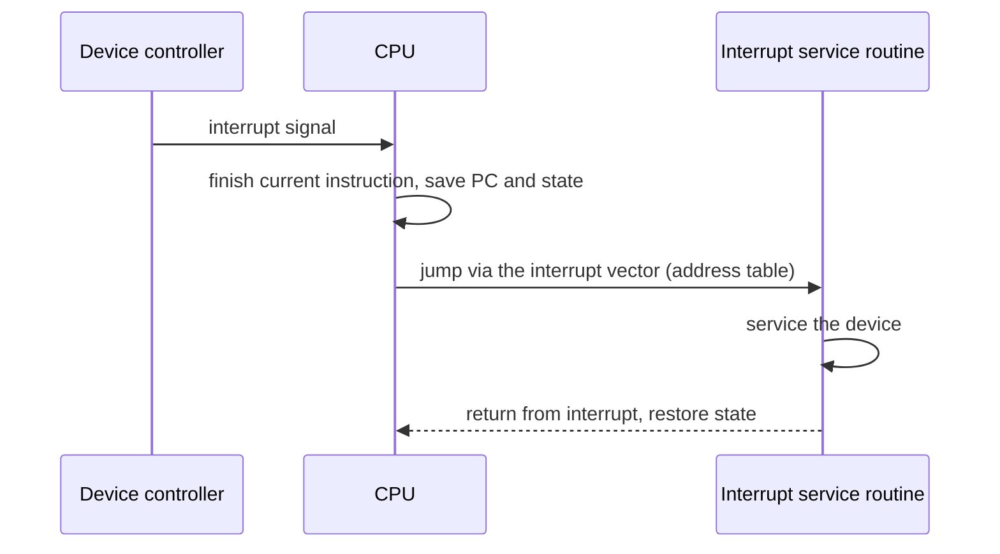

When the CPU is interrupted it stops what it is doing, **saves the address of the interrupted instruction**, and transfers control to the **interrupt service routine**, found through the **interrupt vector** — a table of addresses indexed by a device number. After servicing, the saved state is restored and the interrupted computation resumes as if nothing happened. Interrupts can be **disabled** (masked) while one is being processed, and they can have **priorities**, so an urgent interrupt can preempt a less urgent one.

### Storage structure and hierarchy

```calc
             registers          fastest, smallest, most expensive per byte
             cache              (volatile)
             main memory (RAM)
          ----------------------------------- volatile above / non-volatile below
             solid-state disk
             magnetic disk
             optical disk
             magnetic tape      slowest, largest, cheapest per byte
```

- The CPU can load instructions only from **main memory**, so programs must be in RAM to run. RAM is **volatile** (contents lost on power-off) and too small to hold everything permanently.
- **Secondary storage** (disks, SSDs) is a non-volatile extension of main memory.
- Higher levels are faster, smaller and costlier; lower levels are slower, larger and cheaper.

### Caching and coherence
**Caching** copies information from slower storage into faster storage temporarily: when data is needed, check the cache first; if it's there (**hit**) use it, otherwise (**miss**) fetch it from the slower level and keep a copy. Because caches are small, **cache management** — cache size and **replacement policy** — strongly affects performance.

The same data can then exist at several levels at once (disk → RAM → cache → register). In a multiprocessor each CPU has its own cache, so a value updated in one cache must be invalidated or updated in the others — **cache coherency**, usually handled in hardware. In distributed systems, replicas on different machines must be kept consistent too.

### I/O structure
A device controller has a **local buffer** and registers; its **device driver** in the OS presents a uniform interface to the rest of the kernel. For small transfers, the controller interrupts the CPU when an operation completes. For bulk data (disk), **DMA (direct memory access)** lets the controller move a whole block between its buffer and memory **without CPU intervention**, generating **one interrupt per block** instead of one per byte.

**Key points:**
- The bootstrap program in firmware loads the kernel; the OS is then interrupt driven.
- Interrupts save state, jump through the interrupt vector to a service routine, then resume.
- Traps/exceptions are software interrupts (system calls, errors).
- Storage hierarchy: registers → cache → RAM (volatile) → disk → tape; caching exploits it; coherence keeps copies consistent.
- DMA moves blocks without the CPU, one interrupt per block.

=== Evolution of Operating Systems: Serial, Batch, Multiprogramming and Time Sharing
difficulty: easy
---
Operating systems evolved alongside computer hardware; each stage solved the main weakness of the one before. Knowing why each stage existed explains the features of modern OSs.


### 1. Wired plug-boards (no OS)
Programs were written in machine language by **wiring plug-boards**. No OS, no programming languages, no operators — complex programming and badly underused machines.

### 2. Serial processing
Programmers punched programs on cards, **reserved machine time on a sign-up sheet**, and ran one job at a time. Problems: wasted time for scheduling and set-up, operators walking around the machine room, and a **CPU idle** most of the time.

### 3. Simple batch processing
Users submit jobs to an **operator**, who groups (**batches**) jobs with similar needs and runs them together; a small resident **monitor** program loads the next job automatically.
- **+** The computer runs unattended; many transactions processed together.
- **−** No interaction between user and job; long delay before results; hard to set priorities; the **CPU is often idle** because mechanical I/O (card readers, printers) is far slower than the CPU.

### 4. Spooling (Simultaneous Peripheral Operation On-Line)
Uses the **disk as a large buffer**: input cards are read to disk ahead of time and output is written to disk and printed later, **while the CPU executes other jobs**. Spooling overlaps the I/O of one job with the computation of another — the first step towards multiprogramming. The **print spooler** in every modern OS is the same idea.

### 5. Multiprogramming
**Several programs are kept in main memory at once.** When the running program waits for I/O, the OS switches the CPU to another ready program instead of idling.

```calc
Without multiprogramming          With multiprogramming
Job A: CPU ... I/O(wait) ... CPU  Job A: CPU   I/O ........ CPU
CPU  : busy ... IDLE ....... busy Job B:     CPU ..... I/O
                                  CPU  : A,   B, then A  -> no idle gap
```

- **Goal:** maximize **CPU utilization** — keep the CPU busy whenever some job is ready.
- **Requires:** memory management (several programs in memory), **protection** between them, CPU scheduling, and handling fragmentation (paging and virtual memory later solved programs too big for memory).
- **Limitation:** still no interaction — response time could be hours.

### 6. Time sharing (multitasking)
An extension of multiprogramming in which the CPU switches between jobs **so frequently** (every few milliseconds — a **time quantum**) that **each user can interact** with their program and gets a response within a second or so. Each user has the illusion of a dedicated machine.
- **+** Many users at once; quick response; less CPU idle time; avoids duplicating software.
- **−** Needs CPU scheduling, memory management and protection of users' data; reliability and security concerns.

**Multiprogramming vs time sharing:** multiprogramming aims at **CPU utilization** (switch only when a job waits); time sharing aims at **response time** (switch on a timer, even if the job could continue).

### 7. Real-time, network and distributed systems
- **Real-time systems** respond within strict deadlines (see "Types of Operating Systems").
- **Network OS** — independent computers, each with its own OS, share files and printers; users know about the other machines (remote login, file transfer).
- **Distributed OS** — many computers appear to the user as **one single system**; the existence of multiple machines is transparent. Benefits: resource sharing, computation speed-up, reliability (if one site fails others continue), communication. Problems: security, lost messages, network bandwidth and overload.

| | Network OS | Distributed OS |
|---|---|---|
| View for user | Many computers, user knows | One single system (transparent) |
| OS on each node | Own independent OS | Common OS across nodes |
| Coupling | Loosely coupled | Tightly integrated |
| Fault tolerance | Low | High |

**Key points:**
- Batch: group similar jobs; no interaction; CPU idle during I/O.
- Spooling: disk buffers I/O so I/O and computation overlap.
- Multiprogramming: several jobs in memory, switch on I/O wait → CPU utilization.
- Time sharing: switch on a time quantum → interactive response.

=== Types of Operating Systems and Computer Systems
difficulty: easy
---
### Batch operating system
Jobs with similar requirements are grouped and executed without user interaction (payroll, bank statement generation). See "Evolution of Operating Systems".

### Multiprogrammed and time-sharing (multitasking) OS
Several programs in memory; the CPU switches among them — on I/O waits (multiprogramming) or on a timer (time sharing). Every desktop OS today is a multitasking OS.

### Real-time operating system (RTOS)
A system where the **correctness of a result depends on the time** at which it is produced: it must respond to inputs within **well-defined, fixed time constraints**, otherwise the system fails. Used as control devices in dedicated applications: industrial control, medical imaging, air-traffic control, automobile engine and airbag controllers, robots, weapon systems.

| | Hard real-time | Soft real-time |
|---|---|---|
| Deadline | **Must** be met — missing it is a failure | Should be met; occasional misses tolerated |
| Example | Airbag, pacemaker, aircraft flight control | Video streaming, online games, VR |
| Design | Secondary storage limited, data in ROM; virtual memory almost never used | Critical tasks get priority over others until they finish |

Real-time processing is always online, but an online system need not be real-time.

### Desktop (personal) systems
Control a single machine for one user, focusing on convenience and responsiveness: Windows, Ubuntu, macOS.

### Multiprocessor (parallel / tightly coupled) systems
Two or more CPUs **sharing the bus, clock, memory and devices**.
- **Advantages:** increased **throughput** (speed-up with N processors is less than N because of overhead and contention); **economy of scale** (share peripherals and storage); increased **reliability** (graceful degradation — one CPU failing doesn't stop the system).
- **Symmetric multiprocessing (SMP):** every processor runs the OS and user processes as peers — used by all modern OSs.
- **Asymmetric multiprocessing:** one **master** processor runs the OS and schedules work; the others run only user code.

**Multicore** CPUs place several cores on one chip — effectively SMP on a single chip.

### Clustered systems
Multiple **complete computers** connected by a LAN that work together, usually to provide **high availability**: if one node fails, another takes over its work.
- **Asymmetric clustering:** one node is in **hot-standby**, monitoring the active server and taking over if it fails.
- **Symmetric clustering:** all nodes run applications and **monitor each other**.

### Distributed systems
Physically separate, possibly heterogeneous computers networked together and presented as one system (see "Evolution").

### Handheld / mobile systems
Phones and tablets (Android, iOS): limited memory, slower processors, small screens and **battery life** constraints, so the OS emphasizes power management.

### Embedded systems
OS inside devices — washing machines, routers, cars — often an RTOS with a fixed purpose.

### Commonly confused terms

| Term | Meaning |
|---|---|
| **Multiprogramming** | Several programs in memory at once; CPU switches when one waits — maximizes CPU use |
| **Multitasking** | Multiprogramming with rapid time-sliced switching for interactivity (time sharing) |
| **Multiprocessing** | More than one CPU executing simultaneously (true parallelism) |
| **Multithreading** | Several threads of execution inside one process |
| **Multiuser** | Several users using the system at the same time |

> Concurrency vs parallelism: on one CPU, multitasking gives **concurrency** (tasks interleave, progress overlaps in time); only multiple CPUs/cores give **parallelism** (tasks literally run at the same instant).

**Key points:**
- RTOS: correctness depends on meeting deadlines; hard vs soft real-time.
- Multiprocessor: shared memory and clock; SMP (peers) vs asymmetric (master/slave).
- Cluster: separate computers on a LAN for high availability.
- Multiprogramming ≠ multitasking ≠ multiprocessing ≠ multithreading.

=== Operating System Structures: Monolithic, Layered, Microkernel and More
difficulty: medium
---
An OS is too large to build without a structure. Designers trade off **performance**, **security**, **maintainability**, **compatibility** and **available hardware support**. These are the main structures.

### 1. Monolithic (simple) structure
The whole OS runs as **one large program in kernel mode** — a collection of procedures, each able to call any other. Each procedure is compiled separately and then linked into **one executable**.
- Even here there is a little structure: a **main program** that dispatches system calls, **service procedures** that carry them out, and **utility procedures** that help them. A system call places its arguments in a defined place and executes a **trap**; the kernel looks up the service in a **table of pointers** indexed by the call number.
- **+** Fast — components call each other directly.
- **−** Called "the big mess": no information hiding; a bug anywhere can crash the system; changing one part means recompiling and relinking the whole kernel.
- **Examples:** MS-DOS (with almost no structure), traditional Unix, **Linux** (monolithic but with **loadable kernel modules**).

### 2. Layered structure
The OS is divided into a hierarchy of **layers**; each layer uses only the services of the layers **below** it. Layer 0 is the hardware; the top layer is the user interface. The first was Dijkstra's **THE** system (a batch system with 6 layers):

| Layer | Function |
|---|---|
| 5 | The operator |
| 4 | User programs |
| 3 | I/O management |
| 2 | Operator–process communication (console) |
| 1 | Memory management |
| 0 | Processor allocation and multiprogramming (CPU scheduling) |

- **+** Easy to build, debug and verify layer by layer; high encapsulation.
- **−** Hard to decide the order of layers (a layer may need a service of a higher one); each call passes through several layers — slower.

### 3. Microkernel
Move as much as possible **out of the kernel into user-space server processes**. The microkernel keeps only the essentials: **low-level process/thread management, basic memory management and inter-process communication (message passing)**. File systems, device drivers and networking run as user processes.

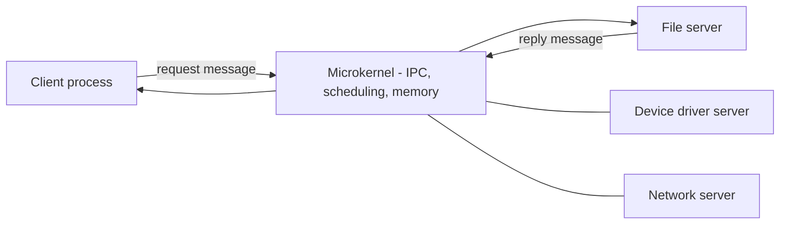

- **+** Small kernel is easier to verify; a crashing driver doesn't crash the system (**reliability and security**); easy to extend and **port** to new hardware; suits distributed systems.
- **−** **Performance overhead** of message passing and user/kernel switches.
- **Examples:** Mach, QNX, MINIX 3, L4.

### 4. Client–server model
The microkernel idea viewed as communication: user processes are **clients** that send requests to **server processes** (file server, memory server), which do the work and reply. Because clients and servers communicate only by messages, they can even run on **different machines** — natural for distributed systems.

### 5. Virtual machines
A **virtual machine monitor (hypervisor)** runs on the bare hardware and creates several **virtual machines, each an exact copy of the hardware** (CPU, memory, devices). Each VM can run a **different OS**.
- **+** Complete isolation (strong protection); run multiple OSs on one machine; good for testing, servers and cloud computing.
- **−** Sharing resources between VMs is difficult; making an exact copy of the machine is complex; some overhead.
- **Type 1 (bare-metal) hypervisors:** VMware ESXi, Hyper-V, Xen. **Type 2 (hosted):** VirtualBox, VMware Workstation. (The **JVM** is a different kind — a process-level virtual machine.)

### 6. Exokernel
Like a VM system, but instead of giving each VM a full copy of the hardware, the exokernel gives each one a **subset of the real resources** (certain disk blocks, memory pages) and only checks that no VM touches another's resources. Advantage: **no address remapping layer** — library OSs in user space manage resources directly.

### 7. Modular and hybrid kernels (modern systems)
- **Loadable modules** (Linux, Solaris): a core kernel plus modules (drivers, file systems) loaded at run time — monolithic speed with some flexibility.
- **Hybrid kernels** (Windows NT, macOS XNU): microkernel-style design but many services kept in kernel space for performance.

### Comparison

| | Monolithic | Layered | Microkernel |
|---|---|---|---|
| Kernel size | Large | Large | Small |
| Speed | Fastest | Slower (layer crossings) | Slower (message passing) |
| Reliability | A bug can crash all | Better isolation | Best — services isolated |
| Extensibility | Hard | Moderate | Easy |
| Example | MS-DOS, Linux | THE | Mach, QNX, MINIX 3 |

**Key points:**
- Monolithic: one big kernel, fast but fragile (Linux uses modules).
- Layered: each layer uses only lower layers; THE had 6 layers.
- Microkernel / client–server: minimal kernel + user-space servers communicating by messages.
- VMs give each guest an exact hardware copy; exokernels give a partition of real resources.

=== OS Services, System Calls and the User/Kernel Boundary
difficulty: medium
---
### Services an OS provides
- **User interface** — **CLI** (command line: users type commands they must remember, e.g. bash, cmd) or **GUI** (windows, icons, mouse — a desktop metaphor). Some systems also offer touch or voice interfaces.
- **Program execution** — load a program into memory, run it, end it normally or abnormally (with an error).
- **I/O operations** — programs cannot access devices directly; the OS performs I/O for them.
- **File-system manipulation** — create, delete, read, write, search files and directories; manage permissions.
- **Communication** — between processes on the same or different computers, via **shared memory** or **message passing**.
- **Error detection** — errors in the CPU, memory, I/O devices or user programs; the OS must continuously watch and take appropriate action.
- **Resource allocation** — share CPU, memory, files and devices among concurrent jobs and users.
- **Accounting** — record which users use how much of which resources.
- **Protection and security** — control all access to resources; authenticate users.

### System calls
A **system call** is the programming interface through which a process **requests a service from the kernel**. Programs usually don't invoke them directly but through an **API** (e.g. the C library / POSIX API, or the Win32 API), which hides the details.

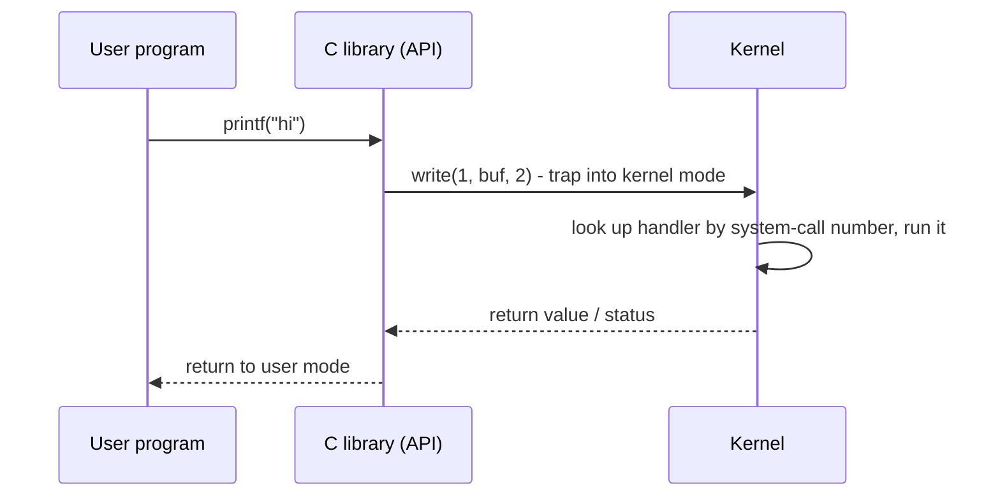

How a system call works:
1. The library places the **system-call number** and **parameters** in registers (or in a memory block/stack whose address is passed in a register).
2. It executes a **trap** (software interrupt / `syscall` instruction) — the CPU switches to **kernel mode** and jumps to a fixed handler.
3. The kernel uses the number to index the **system-call table**, runs the service routine, puts the result in a register.
4. Control returns to **user mode** after the trap instruction.

### Types of system calls

| Category | Examples (UNIX) | Examples (Windows) |
|---|---|---|
| **Process control** | fork(), exec(), exit(), wait() | CreateProcess(), ExitProcess(), WaitForSingleObject() |
| **File management** | open(), read(), write(), close() | CreateFile(), ReadFile(), WriteFile() |
| **Device management** | ioctl(), read(), write() | SetConsoleMode(), ReadConsole() |
| **Information maintenance** | getpid(), alarm(), sleep() | GetCurrentProcessId(), Sleep() |
| **Communication** | pipe(), shmget(), mmap(), socket() | CreatePipe(), MapViewOfFile() |
| **Protection** | chmod(), umask(), chown() | SetFileSecurity() |

### System call vs library function vs interrupt
- **Library function** (e.g. `strlen`, `printf`) runs in user mode; **some** library functions call system calls internally (`printf` eventually calls `write`).
- **System call** switches into kernel mode — much more expensive than a function call.
- **Interrupt** is asynchronous, generated by hardware (keyboard, timer, disk). A **trap/exception** is synchronous, caused by the running instruction (system call, divide by zero, page fault).

### System programs
Utilities shipped with the OS that make it usable: file managers, compilers, editors, shells, status tools (`ps`, Task Manager). Most users see the OS through these programs, not through system calls.

**Key points:**
- System call = controlled entry into the kernel via a trap; parameters passed in registers/memory.
- Programs use system calls through APIs (POSIX, Win32).
- Categories: process control, file, device, information, communication, protection.
- Interrupts are asynchronous (hardware); traps are synchronous (caused by the instruction).

=== Processes: Program vs Process, Memory Layout and the PCB
difficulty: easy
---
A **process** is a **program in execution**. A **program** is a passive entity — an executable file on disk. When it is loaded into memory and started, it becomes an **active** process with a program counter, registers and resources. **One program can be running as several processes** (two copies of a browser), and the process is the **unit of work** that the OS schedules and to which it allocates resources. Each process has a unique **process ID (PID)**.

| Program | Process |
|---|---|
| Passive — instructions stored on disk | Active — instructions being executed |
| Exists until deleted | Has a limited lifetime |
| Needs no resources except storage | Needs CPU, memory, files, I/O devices |
| One program | Can be many processes |

### Components of a process
1. **Address space** — the memory the process can access.
2. **Processor state** — the contents of the CPU registers: program counter, stack pointer, general registers. Saved and restored when the process is switched out and back in.
3. **OS resources** — open files, network sockets, signal handlers, etc.

### Memory layout of a process

```calc
High address  +-------------------------+
              | Kernel space            |  not accessible to user code
              +-------------------------+
              | Stack   (grows down)    |  local variables, return addresses
              |   |                     |
              |   v                     |
              |                         |  free space
              |   ^                     |
              |   |                     |
              | Heap    (grows up)      |  malloc / new
              +-------------------------+
              | BSS                     |  uninitialized globals/statics (zeroed)
              | Data                    |  initialized globals/statics
              | Text (code)             |  machine instructions, read-only
Low address   +-------------------------+
```

- **Text (code) segment** — the executable instructions, read from the program file; usually read-only and shareable.
- **Data segment** — global and static variables **with initial values**.
- **BSS** — uninitialized globals/statics, filled with zeros at load time.
- **Heap** — dynamically allocated memory (`malloc`/`free`, `new`/`delete`), grows upward.
- **Stack** — one **stack frame per function call**: local variables, parameters, saved registers and return address; freed automatically when the function returns. Grows downward. Deep recursion can cause a **stack overflow** when stack and heap collide or the stack limit is reached.

```c
int counter = 5;        // data segment
int table[1000];        // BSS
int main(void) {        // code in text segment
    int x = 10;         // stack
    int *p = malloc(40);// p on stack, the 40 bytes on heap
    free(p);
    return 0;
}
```

### Process Control Block (PCB)
The OS represents each process by a **PCB** (task control block — `task_struct` in Linux). All PCBs together form the **process table**.

| PCB field | Contents |
|---|---|
| Process state | new, ready, running, waiting, terminated |
| Process ID | PID; also parent's PID (`getpid()`, `getppid()`) |
| Program counter | Address of the next instruction |
| CPU registers | Accumulators, index registers, stack pointer, flags |
| CPU-scheduling info | Priority, pointers to scheduling queues |
| Memory-management info | Base/limit registers, page or segment tables |
| Accounting info | CPU time used, time limits, account numbers |
| I/O status info | List of open files, allocated devices |

When the CPU switches from one process to another, the state of the old process is **saved into its PCB** and the state of the new one is **loaded from its PCB** — a **context switch** (see "CPU Scheduling Concepts").

### Types of processes (Unix view)
- **Interactive (foreground/background) processes** — started by a user from a terminal; job control (`&`, `fg`, `bg`) moves them between foreground and background.
- **Batch (automatic) processes** — queued and run later in FIFO order; `at` runs a job at a certain time, `batch` runs it when the load is low (by default below 0.8).
- **Daemons** — server processes started at boot that wait in the background for requests (e.g. `sshd`, `cron`, the old `xinetd` network daemon). On Windows these are **services**.

**Key points:**
- Process = program in execution; one program can give many processes.
- Layout: text, data, BSS, heap (up), stack (down).
- PCB stores state, PID, PC, registers, scheduling, memory, accounting and I/O info.
- Daemons are long-running background server processes.

=== Process States, Transitions and Context Switching
difficulty: easy
---
As a process runs, it changes **state**. The basic three-state model has **Ready, Running and Waiting**; the usual five-state model adds **New** and **Terminated**.

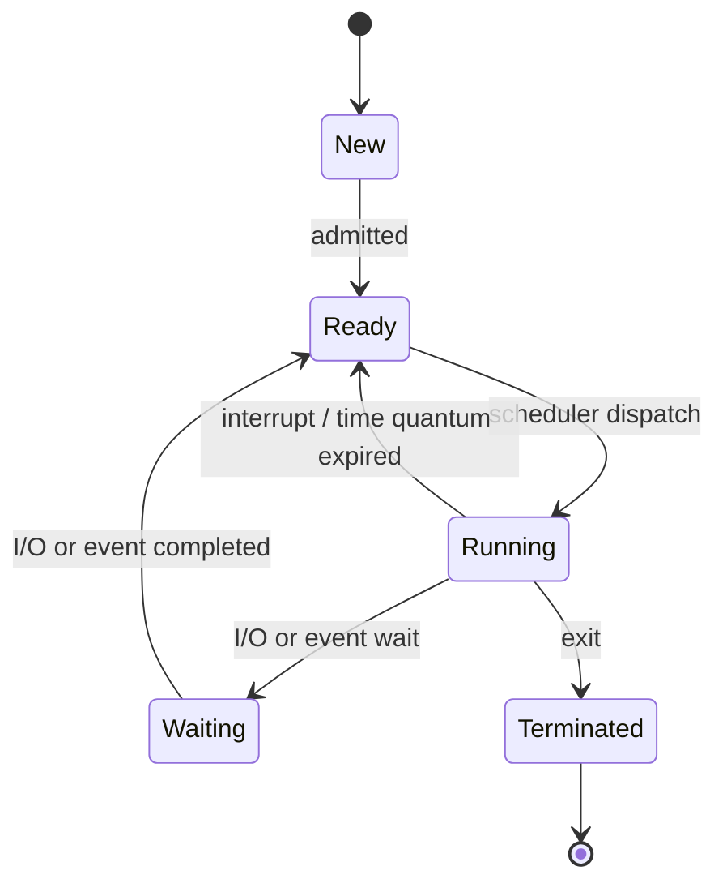

- **New** — the process is being created.
- **Ready** — loaded in memory and able to run, waiting only for the CPU.
- **Running** — instructions are being executed. On a single CPU, **at most one** process is running at any instant.
- **Waiting (blocked / sleeping)** — waiting for some event (I/O completion, a signal, a lock). Even if the CPU is free, a waiting process cannot use it.
- **Terminated** — finished; the OS reclaims its resources.

### The four transitions of the three-state model
1. **Running → Waiting** — the process requests I/O or waits for an event (it gives up the CPU itself).
2. **Running → Ready** — the scheduler preempts it: its time slice expired or a higher-priority process arrived (the process doesn't decide).
3. **Ready → Running** — the scheduler picks it (dispatch).
4. **Waiting → Ready** — the awaited event happened. It goes to **Ready, not straight to Running** — it must wait for the scheduler.

> Interview question: *Why can't a process go from Ready to Waiting?* A ready process isn't executing, so it cannot issue an I/O request or wait for anything — only a running process can block.
> *Why does Waiting go to Ready and not Running?* Another process is probably using the CPU; the scheduler decides when it runs.

### Suspended states (seven-state model)
When memory is short, the OS (medium-term scheduler) can **swap** a process out to disk:
- **Ready-suspended** — ready, but its image is on disk.
- **Blocked-suspended** — waiting for an event and swapped out.
It must be swapped back in before it can run.

### Context switch
Switching the CPU from one process to another requires:
1. **Saving** the state (PC, registers, stack pointer, memory-management info) of the current process into its **PCB**;
2. **Loading** the saved state of the next process from its PCB.

```calc
Process A executing instruction 4 ... interrupt
  save PC = 5, registers  -> PCB(A)
  load PC, registers      <- PCB(B)
Process B executes ...      ... later interrupt
  save state              -> PCB(B)
  load PC = 5, registers  <- PCB(A)   A resumes exactly at instruction 5
```

The book's analogy: if a friend interrupts your argument, you must remember exactly where you stopped to resume the conversation later — the PCB is that memory.

- Context switching is **pure overhead**: the CPU does no useful user work while switching (typically microseconds). Caches and TLB entries of the new process may also be "cold", adding hidden cost.
- More switches (e.g. a very small time quantum) = more overhead. Hardware with multiple register sets reduces the cost.
- Switching between **threads of the same process** is cheaper — the address space doesn't change.

### Scheduling queues
The OS keeps processes in queues (linked lists of PCBs): the **job queue** (all processes), the **ready queue** (in memory, ready to run) and **device queues** (waiting for a particular I/O device). A process migrates between these queues throughout its life.

**Key points:**
- Five states: new, ready, running, waiting, terminated.
- Running→Waiting is voluntary; Running→Ready is preemption; Waiting→Ready on event completion.
- No Ready→Waiting transition; only one running process per CPU.
- Context switch = save state to PCB + load next PCB; pure overhead.

=== Process Creation and Termination: fork(), exec(), wait(), Zombies and Orphans
difficulty: medium
---
### When are processes created?
1. **System initialization** — boot starts foreground processes and background **daemons**.
2. **A running process executes a process-creation system call** to get help with its job.
3. **A user request** — typing a command or double-clicking an icon.
4. **Initiation of a batch job** on mainframes.

In all cases an existing process creates the new one, forming a **process tree** (in Linux the root is `init`/`systemd`, PID 1). The creator is the **parent**, the new process the **child**.

### fork() and exec() in UNIX
- **`fork()`** creates a child that is an **exact copy** of the parent — same memory image, environment and open files. It **returns twice**: **0 in the child**, the **child's PID in the parent**, and **−1 on failure**.
- **`exec()`** (execve, execl, ...) **replaces** the calling process's memory image with a new program; on success it never returns.
- **`wait()`** makes the parent block until a child terminates and collects its exit status.
- **`exit()`** terminates the process.

Windows uses a single call, **`CreateProcess()`**, which creates a process and loads a program in one step.

```c
#include <stdio.h>
#include <unistd.h>
#include <sys/wait.h>

int main(void) {
    pid_t pid = fork();
    if (pid < 0) {
        perror("fork failed");
    } else if (pid == 0) {                 /* child */
        execlp("ls", "ls", "-l", NULL);    /* child becomes ls */
        perror("exec failed");             /* reached only if exec fails */
    } else {                               /* parent */
        wait(NULL);                        /* wait for the child */
        printf("Child %d finished\n", pid);
    }
    return 0;
}
```

Modern systems implement fork with **copy-on-write (COW)**: parent and child share the same physical pages, marked read-only; a page is copied only when one of them writes to it — so fork followed by exec is cheap.

### Classic fork() puzzle
How many times is "hello" printed?

```c
int main(void) {
    fork();
    fork();
    fork();
    printf("hello\n");
    return 0;
}
```

```calc
After fork 1: 2 processes
After fork 2: each of those forks -> 4
After fork 3: -> 8
n consecutive fork() calls -> 2^n processes, so "hello" is printed 2^3 = 8 times
(2^n - 1 = 7 of them are new child processes)
```

A variant: `if (fork() && fork()) fork();` — evaluate carefully with short-circuit `&&`: the child of the first fork gets 0 and skips the rest. Such questions test understanding that **fork returns 0 in the child and a positive PID in the parent**.

### Process termination
- **Normal exit** (voluntary), **error exit** (voluntary, e.g. file not found), **fatal error** (involuntary — illegal instruction, divide by zero, segmentation fault), or **killed by another process** (`kill`, Task Manager → End task).
- Some systems use **cascading termination**: when a parent terminates, all its children are terminated.

### Zombie and orphan processes
- **Zombie** — a child that has **terminated, but whose parent has not yet called `wait()`**. Its memory is freed, but its PCB entry (PID and exit status) remains in the process table so the parent can read it. Many zombies can exhaust PIDs. Fix: the parent must `wait()`, or handle `SIGCHLD`.
- **Orphan** — a child whose **parent terminated first**. In UNIX, orphans are adopted by `init`/`systemd` (PID 1), which periodically calls `wait()` to clean them up.

```calc
Zombie : child dead,  parent alive but not waiting   -> "defunct" entry in ps
Orphan : child alive, parent dead                    -> re-parented to PID 1
```

**Key points:**
- fork() returns 0 to the child, child PID to the parent, −1 on error.
- exec() replaces the process image; wait() collects a child's status.
- n forks in sequence create 2ⁿ processes.
- Zombie = dead child not yet waited for; orphan = live child whose parent died (adopted by init).

=== Threads: Benefits, User vs Kernel Threads and Multithreading Models
difficulty: medium
---
A **thread** is the **basic unit of CPU utilization** — a single flow of execution within a process. It has its own **thread ID, program counter, register set and stack**, but **shares** with the other threads of the same process its **code, data, heap, open files and other resources**. A thread is often called a **lightweight process**.

```calc
Single-threaded process          Multithreaded process
+----------------------+         +-------------------------------+
| code | data | files  |         | code | data | files  (shared) |
| registers | stack    |         | regs | regs | regs            |
|   one thread         |         | stack| stack| stack           |
+----------------------+         |  T1  |  T2  |  T3             |
                                 +-------------------------------+
```

A **process groups resources**; **threads are what gets scheduled** on the CPU. Example from the book: a word processor with one thread handling keystrokes, one checking spelling, one loading images and one auto-saving.

### Benefits of multithreading
1. **Responsiveness** — one thread can keep the UI responsive while another does a long computation or blocks on I/O.
2. **Resource sharing** — threads share memory and resources by default, so communication is easy.
3. **Economy** — creating and switching threads is much cheaper than creating and switching processes (no new address space).
4. **Scalability** — threads of one process can run **in parallel on multiple cores**; a single-threaded process can use only one CPU.

### Process vs thread

| Process | Thread |
|---|---|
| Heavyweight; own address space | Lightweight; shares the process's address space |
| Creation and context switch are expensive | Cheap to create and switch |
| Communication needs IPC (pipes, shared memory, messages) | Communicate through shared variables |
| Independent — one crashing usually doesn't affect others | A crashing thread can bring down the whole process |
| Isolated, more secure | Need synchronization to protect shared data |

Problems that threads introduce: **shared data needs synchronization** (one thread may modify or close a resource another is using), and questions such as *does fork() in a multithreaded process copy all threads?* (POSIX copies only the calling thread).

### User-level threads (ULT)
Implemented entirely by a **thread library in user space**; the **kernel doesn't know they exist** and sees a single-threaded process. Each process keeps its own **thread table**, managed by a run-time system.
- **+** Very fast creation and switching (no trap, no kernel involvement); each process can use its own scheduling algorithm; works even on an OS without thread support.
- **−** If one thread makes a **blocking system call or causes a page fault, the kernel blocks the whole process**; no clock interrupts inside a process, so a thread runs until it **voluntarily yields** (`thread_yield`) — one thread can monopolize the CPU; cannot run on multiple CPUs in parallel.

### Kernel-level threads (KLT)
The **kernel knows about and schedules each thread**; it keeps one thread table for the whole system. All modern OSs (Linux, Windows, macOS) support them.
- **+** A blocking call or page fault blocks only that thread — others continue; threads can run in parallel on multiple cores; the scheduler can give more time to processes with many threads.
- **−** Thread operations need system calls — much slower (hundreds of times) than ULT operations; more kernel overhead. Some systems **recycle** thread structures to reduce creation cost.

### Multithreading models (mapping user threads to kernel threads)

| Model | Mapping | Notes |
|---|---|---|
| **Many-to-one** | Many ULTs → 1 kernel thread | Fast, but one blocking call blocks all; no parallelism (old Solaris green threads) |
| **One-to-one** | Each ULT → its own kernel thread | True parallelism; cost of creating kernel threads (Linux, Windows) |
| **Many-to-many** | M ULTs multiplexed onto N kernel threads | Best of both; complex (the book's "hybrid" approach) |

**Scheduler activations** improve the hybrid model: the kernel gives each process **virtual processors** and notifies the user-level run-time system through an **upcall** whenever a thread blocks or unblocks, so the run-time can schedule another thread.

### POSIX threads (Pthreads)
The standard C threading API on Unix/Linux: `pthread_create`, `pthread_join`, `pthread_exit`, mutexes and condition variables.

```c
#include <pthread.h>
#include <stdio.h>

void *worker(void *arg) {
    int id = *(int *)arg;
    printf("thread %d running\n", id);
    return NULL;
}

int main(void) {
    pthread_t t[2];
    int ids[2] = {1, 2};
    for (int i = 0; i < 2; i++)
        pthread_create(&t[i], NULL, worker, &ids[i]);  /* id, attributes, function, argument */
    for (int i = 0; i < 2; i++)
        pthread_join(t[i], NULL);                      /* wait for each thread */
    printf("both threads done\n");
    return 0;
}
```

The two "running" lines may appear in **either order** — thread scheduling is not deterministic. Compile with `gcc prog.c -pthread`.

**Key points:**
- Threads share code, data, heap and files; each has its own PC, registers and stack.
- Benefits: responsiveness, resource sharing, economy, scalability.
- ULT: fast, but a blocking call blocks the whole process; KLT: kernel-scheduled, parallel, slower to manage.
- Models: many-to-one, one-to-one (Linux/Windows), many-to-many.

=== Threading Issues: fork/exec, Cancellation, Signals, Thread Pools and Thread Libraries
difficulty: hard
---
Multithreaded programs raise questions that single-threaded ones never do.

### fork() and exec() in a multithreaded process
If one thread calls `fork()`, does the child duplicate **all** threads or only the calling one? Some UNIX systems offer both versions.
- If the child immediately calls **`exec()`**, duplicating all threads is pointless — `exec` replaces the whole process — so duplicating **only the calling thread** is appropriate.
- If the child does **not** call `exec`, it should duplicate all threads. (POSIX `fork` duplicates only the calling thread.)
- `exec()` replaces the entire process, **including all threads**.

### Thread cancellation
Terminating a thread before it finishes (e.g. several threads search a database and one finds the answer; or the user presses Stop while a browser loads a page). The thread to be cancelled is the **target thread**.
- **Asynchronous cancellation** — one thread terminates the target **immediately**. Dangerous: the target may be in the middle of updating shared data or holding resources, which may never be freed.
- **Deferred cancellation** — the target **periodically checks** whether it should terminate, and exits at a safe **cancellation point**. Pthreads uses deferred cancellation by default.

### Signal handling
A **signal** notifies a process that an event occurred. Signals are generated by an event, delivered to a process, and then handled by a **default** or **user-defined handler**.
- **Synchronous** signals are delivered to the process that caused them (illegal memory access, division by zero).
- **Asynchronous** signals come from outside (Ctrl+C, a timer expiring).

In a multithreaded process, where should a signal go? Options: to the thread it applies to (synchronous signals), to every thread (Ctrl+C), to certain threads, or to one designated thread. UNIX lets each thread **block** signals it doesn't want, and `pthread_kill()` sends a signal to a specific thread. Windows has no signals; it emulates them with **asynchronous procedure calls (APCs)** delivered to a particular thread.

### Thread pools
Creating a thread for every request (e.g. a web server) has two problems: **creation time** for each short-lived thread, and **no bound** on the number of threads — enough requests could exhaust CPU or memory. A **thread pool** creates a number of threads at start-up that wait for work; a request is handed to a free thread, which returns to the pool when done; if none is free, the request waits.
- Servicing a request with an existing thread is **faster** than creating one.
- The pool **limits** the number of threads that exist at any time.
- Pool size can depend on CPUs, memory and expected load, and can be adjusted dynamically.

### Thread-specific data and scheduler activations
- **Thread-specific (thread-local) data** — each thread has its own copy of some data (e.g. a per-transaction ID), supported by Pthreads, Win32 and Java (`ThreadLocal`).
- **Scheduler activations** — in the many-to-many and two-level models, the kernel provides the thread library with **lightweight processes (LWPs)** — virtual processors — and informs it of events with **upcalls** (e.g. "this thread is about to block"), so the library can schedule another thread on a free LWP.

### Thread libraries
| Library | Level | Notes |
|---|---|---|
| **Pthreads** (POSIX 1003.1c) | User or kernel level | A **specification**, not an implementation; Linux, macOS, Solaris |
| **Win32 threads** | Kernel level | `CreateThread`, `WaitForSingleObject` |
| **Java threads** | Implemented with the host's library | Extend `Thread` or implement `Runnable`; `join()` waits |

```c
#include <pthread.h>
#include <stdio.h>
#include <stdlib.h>

int sum;                                   /* shared by the threads */

void *runner(void *param) {                /* the book's summation example */
    int upper = atoi(param);
    sum = 0;
    for (int i = 1; i <= upper; i++) sum += i;
    pthread_exit(0);
}

int main(int argc, char *argv[]) {
    pthread_t tid;
    pthread_attr_t attr;
    pthread_attr_init(&attr);              /* default attributes */
    pthread_create(&tid, &attr, runner, argc > 1 ? argv[1] : "10");
    pthread_join(tid, NULL);               /* wait for the thread to exit */
    printf("sum = %d\n", sum);
    return 0;
}
```

```text
sum = 55
```

**Key points:**
- fork in a threaded process may copy one or all threads; exec replaces every thread.
- Asynchronous cancellation is immediate and unsafe; deferred cancellation stops at safe points.
- Signals: synchronous ones go to the causing thread; threads can block signals.
- Thread pools avoid creation cost and bound thread count; Pthreads is a spec, Win32 and Java are other libraries.

=== Concurrency and Inter-Process Communication (IPC)
difficulty: medium
---
**Concurrency** — the simultaneous (interleaved or parallel) execution of multiple processes — is the central design issue of a modern OS. It arises in three contexts:
1. **Multiple applications** sharing the processor (multiprogramming);
2. **Structured applications** written as a set of concurrent processes or threads;
3. **The OS itself**, which is implemented as a set of processes and threads.

### How concurrent processes interact

| Interaction | Awareness | Relationship | Main problems |
|---|---|---|---|
| **Competition for resources** (printer, file, memory) | Unaware of each other | Compete | Mutual exclusion, deadlock, starvation |
| **Cooperation by sharing** (shared variables, files) | Indirectly aware | Cooperate through shared data | Data consistency (race conditions) |
| **Cooperation by communication** (messages) | Directly aware | Exchange messages; nothing shared | Deadlock, starvation |

Processes are **independent** if they cannot affect or be affected by others, and **cooperating** if they can. Reasons to cooperate: information sharing, computation speed-up, modularity, convenience.

### The two IPC models

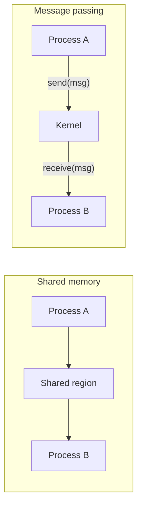

| Shared memory | Message passing |
|---|---|
| Processes map a common memory region | Processes exchange messages via the kernel: `send()`, `receive()` |
| **Fast** — after setup, no kernel involvement | Slower — a system call per message |
| Programmer must **synchronize** access | Synchronization built in; easier to get right |
| Same machine only | Works across machines (distributed systems) |
| e.g. `shmget`/`mmap` | e.g. pipes, message queues, sockets |

### Message-passing design choices
- **Direct** (`send(P, msg)` names the receiver) vs **indirect** communication (messages go to a **mailbox / port**).
- **Blocking (synchronous)** vs **non-blocking (asynchronous)** send and receive. Blocking send + blocking receive is a **rendezvous**.
- **Buffering**: zero capacity (sender waits for receiver), bounded or unbounded queue.

### Common IPC mechanisms
- **Pipes** — one-way byte stream between related processes (`ls | grep txt`); **named pipes (FIFOs)** work between unrelated processes.
- **Message queues** — kernel-managed lists of messages.
- **Shared memory** — fastest IPC.
- **Signals** — asynchronous notifications (`SIGKILL`, `SIGINT` from Ctrl+C, `SIGCHLD`).
- **Sockets** — communication between processes on the same or different machines over a network.
- **Remote procedure calls (RPC)** — call a procedure in another process/machine as if it were local.

### Problems of concurrency
- **Race condition** — the result depends on the exact timing of who runs when (see "Race Conditions and the Critical-Section Problem").
- **Deadlock** — a set of processes each waits for a resource held by another; none can proceed. The book's example: four cars at a four-way stop, each holding one quadrant and needing the next.
- **Starvation** — a ready process is **denied service indefinitely** because others are always favoured. The book's example: P1 and P2 alternately get resource R, so P3 never does.

**Key points:**
- Concurrency arises from multiple applications, structured applications and the OS itself.
- IPC models: shared memory (fast, needs synchronization) and message passing (simpler, works across machines).
- Mechanisms: pipes, message queues, shared memory, signals, sockets, RPC.
- Concurrency problems: race conditions, deadlock, starvation.

=== Race Conditions and the Critical-Section Problem
difficulty: medium
---
### Race condition
A **race condition** occurs when two or more processes (or threads) **read and write shared data** and the **final result depends on the precise order** in which they run.

The classic example: two threads each execute `count++` on a shared `count = 5`. In machine code `count++` is **three** steps — load, add, store — and a context switch can occur between them:

```calc
register1 = count          T1: register1 = 5
register1 = register1 + 1  T1: register1 = 6
                           --- context switch ---
                           T2: register2 = count      -> 5
                           T2: register2 = 6
                           T2: count = register2      -> count = 6
                           --- context switch ---
count = register1          T1: count = register1      -> count = 6
Two increments, but count is 6, not 7: one update was lost.
```

Race conditions are hard to debug because they appear only under certain timings — the program may work 999 times and fail once.

### Critical section
The part of a program that **accesses shared resources** (shared variables, files, devices) is its **critical section (critical region)**. To prevent races, **no two processes may be in their critical sections for the same shared data at the same time** — this is **mutual exclusion**.

```calc
do {
    entry section        <- ask permission to enter
        critical section <- use the shared data
    exit section         <- announce leaving
    remainder section
} while (true);
```

### Requirements for a correct solution
The standard three (Silberschatz):
1. **Mutual exclusion** — if one process is in its critical section, no other process can be in its critical section.
2. **Progress** — if no process is in its critical section, the decision of who enters next cannot be postponed indefinitely, and processes in their remainder sections don't take part in the decision (no unnecessary blocking).
3. **Bounded waiting** — there is a limit on how many times other processes may enter their critical sections after a process has requested entry (no starvation).

Tanenbaum's four conditions (as listed in the book) say the same in another form:
1. No two processes simultaneously in their critical regions.
2. **No assumptions** about speeds or the number of CPUs.
3. No process running **outside** its critical region may block other processes.
4. No process should wait **forever** to enter its critical region.

### Categories of solutions
- **Busy-waiting (spin) solutions** — the waiting process loops, testing a condition: disabling interrupts, lock variables, strict alternation, Peterson's algorithm, TSL instruction. Waste CPU time while waiting.
- **Blocking (sleep and wakeup) solutions** — the waiting process is put to sleep and woken up later: **semaphores, mutexes, monitors, message passing**.

**Key points:**
- Race condition: outcome depends on interleaving of operations on shared data.
- `count++` is not atomic: load, add, store.
- Critical section = code touching shared data; must be mutually exclusive.
- Requirements: mutual exclusion, progress, bounded waiting (no speed assumptions).

=== Mutual Exclusion with Busy Waiting: Peterson's Algorithm and TSL
difficulty: hard
---
These techniques enforce mutual exclusion by having a process **loop (spin) until it may enter**. (The book lists them as the busy-waiting approaches to mutual exclusion.)

### 1. Disabling interrupts
A process disables interrupts on entering its critical section and re-enables them on leaving — no clock interrupt means no context switch.
- Works only on a **single CPU** (other CPUs keep running).
- Giving user processes the power to turn off interrupts is dangerous (a bug could hang the system). Useful **inside the kernel** for short sequences.

### 2. Lock variable
A shared `lock = 0`; a process waits while `lock == 1`, then sets it to 1.

```c
while (lock == 1) ;   /* wait */
lock = 1;             /* <- a context switch here lets two processes in! */
critical_section();
lock = 0;
```

**Fails** — testing and setting the lock are two separate steps, so it has the very race condition it tries to prevent.

### 3. Strict alternation
A shared `turn` variable says whose turn it is.

```c
/* process 0 */                    /* process 1 */
while (turn != 0) ;                while (turn != 1) ;
critical_section();                critical_section();
turn = 1;                          turn = 0;
```

Mutual exclusion holds, but **progress is violated**: processes must strictly alternate, so a slow process in its remainder section blocks a fast one that wants to enter again.

### 4. Peterson's algorithm (two processes)
Combines a `turn` variable with an `interested` (flag) array — a correct software solution.

```c
#define FALSE 0
#define TRUE  1
int turn;               /* whose turn is it? */
int interested[2];      /* all values initially FALSE */

void enter_region(int process) {     /* process is 0 or 1 */
    int other = 1 - process;
    interested[process] = TRUE;      /* I want to enter */
    turn = process;                  /* ...but let the other go first if it also wants */
    while (turn == process && interested[other] == TRUE)
        ;                            /* busy wait */
}

void leave_region(int process) {
    interested[process] = FALSE;     /* done */
}
```

Why it works: if both set `interested` and then `turn`, whichever writes `turn` **last** waits — the other enters. It satisfies **mutual exclusion, progress and bounded waiting**. Limitations: two processes only (generalizations exist), busy waiting, and on modern CPUs it needs memory barriers because compilers/CPUs may reorder loads and stores.

### 5. Test-and-Set Lock (TSL) — hardware support
Modern CPUs provide an **atomic** instruction that reads a memory word and sets it in one indivisible step (TSL, `xchg` on x86, compare-and-swap):

```c
/* executed atomically by the hardware */
int test_and_set(int *lock) {
    int old = *lock;
    *lock = 1;
    return old;
}

/* spinlock */
while (test_and_set(&lock) == 1) ;   /* spin until we saw 0 */
critical_section();
lock = 0;
```

The CPU locks the memory bus during the instruction, so it works on **multiprocessors** too. On its own it does not guarantee bounded waiting (a process might keep losing), but it is the building block of real locks.

### Spinlocks and the cost of busy waiting
A **spinlock** is a lock acquired by busy waiting.
- **Bad on a single CPU** — the spinning process wastes its whole time slice while the lock holder can't run.
- **Good on multiprocessors for very short critical sections** — spinning for a few microseconds is cheaper than two context switches.
- **Priority inversion** — with priority scheduling, a high-priority process H spins waiting for a lock held by a low-priority process L, but L never gets the CPU to release it. Fix: **priority inheritance** (L temporarily gets H's priority).

**Key points:**
- Disabling interrupts: single CPU, kernel-only.
- Lock variable fails (test and set not atomic); strict alternation violates progress.
- Peterson's algorithm: `interested[]` + `turn`, correct for two processes.
- TSL/compare-and-swap: atomic hardware instruction underlying spinlocks and mutexes.

=== Semaphores, Mutexes and Monitors
difficulty: hard
---
Busy waiting wastes CPU time. **Blocking primitives** put a waiting process to sleep and wake it when it can proceed.

### Semaphore (Dijkstra, 1965)
An **integer variable** accessed only through two **atomic** operations:
- **wait(S)** — also called **P()**, *down*, *proberen*: decrement S; if S becomes negative (no units available), the caller **blocks**.
- **signal(S)** — also called **V()**, *up*, *verhogen*: increment S; if processes are blocked on S, **wake one up**.

```c
typedef struct {
    int value;
    struct process *list;   /* processes blocked on this semaphore */
} semaphore;

void wait(semaphore *S) {
    S->value--;
    if (S->value < 0) {
        add this process to S->list;
        block();             /* sleep - no busy waiting */
    }
}

void signal(semaphore *S) {
    S->value++;
    if (S->value <= 0) {
        remove a process P from S->list;
        wakeup(P);
    }
}
```

With this implementation a **negative value** tells how many processes are waiting. The OS makes wait and signal atomic (disabling interrupts or using spinlocks briefly).

### Types of semaphores
- **Counting semaphore** — value can range over any integer; controls access to a resource with **N instances** (initialize S = N). E.g. 3 printers → S = 3.
- **Binary semaphore** — value 0 or 1; used for **mutual exclusion** (initialize to 1).

```c
semaphore mutex = 1;
wait(&mutex);
    critical_section();
signal(&mutex);
```

Semaphores also enforce **ordering**: to make statement S2 in P2 run after S1 in P1, initialize `synch = 0`; P1 does `S1; signal(synch);` and P2 does `wait(synch); S2;`.

### Mutex (lock)
A **mutex** is a lock with two states, locked/unlocked, and an **owner**: only the thread that locked it may unlock it. `pthread_mutex_lock()` / `pthread_mutex_unlock()`.

| Mutex | Binary semaphore |
|---|---|
| Locking mechanism with **ownership** — only the locker unlocks | Signalling mechanism — any process can signal |
| For mutual exclusion only | Mutual exclusion **and** signalling/ordering |
| Often supports priority inheritance, recursion checks | Simple counter |

### Problems with semaphores
They are powerful but error-prone — a single misplaced call breaks the program:
- `signal(mutex) ... wait(mutex)` (swapped) → no mutual exclusion;
- `wait(mutex) ... wait(mutex)` → the process **deadlocks** itself;
- forgetting `signal` → others block forever;
- two processes doing `wait(S); wait(Q);` and `wait(Q); wait(S);` → **deadlock**.

### Monitors (Hoare, Brinch Hansen)
A **monitor** is a **high-level language construct**: an abstract data type whose shared variables can be accessed **only through its procedures**, and **only one process can be active inside the monitor at a time** — the compiler enforces mutual exclusion automatically.

For waiting inside a monitor, it provides **condition variables** with two operations:
- **`x.wait()`** — the caller is suspended (and releases the monitor) until another process signals x;
- **`x.signal()`** — resumes exactly one process waiting on x (does nothing if none waits — unlike a semaphore, signals are not remembered).

Java's `synchronized` methods with `wait()`/`notify()`, and C#'s `lock`, are monitors.

| Semaphore | Monitor |
|---|---|
| Low-level integer + wait/signal | High-level language construct |
| Programmer must place wait/signal correctly | Mutual exclusion automatic |
| signal() increments a value — remembered | Condition `signal()` lost if nobody waits |
| Can be used across processes in the OS | Needs language/compiler support |

**Key points:**
- Semaphore: integer with atomic wait (P, decrement, maybe block) and signal (V, increment, maybe wake).
- Counting semaphores for N resources; binary semaphores (=1) for mutual exclusion.
- Mutex has ownership; binary semaphore doesn't.
- Monitor: compiler-enforced mutual exclusion + condition variables.

=== Classic Synchronization Problems: Producer–Consumer, Readers–Writers, Dining Philosophers
difficulty: hard
---
These problems are used to test every new synchronization scheme — and are interview favourites.

### 1. Bounded-buffer (producer–consumer) problem
A **producer** puts items into a buffer of **N slots**; a **consumer** removes them. The producer must wait when the buffer is **full**, the consumer when it is **empty**, and they must not update the buffer simultaneously.

Three semaphores:

```c
semaphore mutex = 1;   /* mutual exclusion on the buffer */
semaphore empty = N;   /* counts empty slots */
semaphore full  = 0;   /* counts filled slots */

void producer(void) {
    while (1) {
        item = produce_item();
        wait(&empty);      /* wait for a free slot */
        wait(&mutex);
        insert_item(item);
        signal(&mutex);
        signal(&full);     /* one more full slot */
    }
}

void consumer(void) {
    while (1) {
        wait(&full);       /* wait for an item */
        wait(&mutex);
        item = remove_item();
        signal(&mutex);
        signal(&empty);    /* one more empty slot */
        consume_item(item);
    }
}
```

> The order matters: if the producer did `wait(&mutex)` **before** `wait(&empty)` and the buffer was full, it would sleep holding the mutex, the consumer could never enter — **deadlock**.

### 2. Readers–writers problem
A shared database: **many readers may read at the same time**, but a **writer needs exclusive access** (no other readers or writers).

```c
semaphore rw_mutex = 1;  /* exclusive access for writers */
semaphore mutex    = 1;  /* protects read_count */
int read_count     = 0;

void writer(void) {
    wait(&rw_mutex);
    write_data();
    signal(&rw_mutex);
}

void reader(void) {
    wait(&mutex);
    read_count++;
    if (read_count == 1) wait(&rw_mutex);   /* first reader locks out writers */
    signal(&mutex);

    read_data();

    wait(&mutex);
    read_count--;
    if (read_count == 0) signal(&rw_mutex); /* last reader lets writers in */
    signal(&mutex);
}
```

This is the **first readers–writers problem (readers' preference)**: a steady stream of readers can **starve writers**. The second variant gives writers preference (then readers may starve). Real systems provide **reader–writer locks** (`pthread_rwlock_t`).

### 3. Dining philosophers problem
Five philosophers sit around a table with **five chopsticks** (one between each pair). A philosopher alternately thinks and eats; to eat, they need **both** the left and the right chopstick.

```c
semaphore chopstick[5] = {1, 1, 1, 1, 1};

void philosopher(int i) {
    while (1) {
        think();
        wait(&chopstick[i]);             /* left  */
        wait(&chopstick[(i + 1) % 5]);   /* right */
        eat();
        signal(&chopstick[(i + 1) % 5]);
        signal(&chopstick[i]);
    }
}
```

**Deadlock:** if all five pick up their left chopstick at the same moment, each waits forever for the right one — a circular wait.

Solutions:
- Allow at most **four** philosophers at the table at once (a counting semaphore initialized to 4).
- Pick up **both** chopsticks only if both are free (check inside a critical section / monitor).
- **Asymmetric** solution: odd philosophers take left then right, even ones right then left — breaks the cycle.
- **Resource ordering**: number the chopsticks; always pick up the lower-numbered one first.

Avoiding deadlock is not enough: a solution must also avoid **starvation** (a philosopher whose neighbours keep alternating could never eat).

### 4. Sleeping barber (brief)
A barber sleeps when there are no customers; a customer wakes the barber or waits in one of N chairs, or leaves if all chairs are taken — another producer–consumer variant with a bounded queue.

**Key points:**
- Producer–consumer: `mutex = 1`, `empty = N`, `full = 0`; wait on the counting semaphore before the mutex.
- Readers–writers: many readers or one writer; readers' preference can starve writers.
- Dining philosophers: everyone grabbing the left chopstick → deadlock; fix with ordering, asymmetry or limiting diners.
- Correct solutions must avoid both deadlock and starvation.

=== Synchronization in Real Kernels: Priority Inversion, Adaptive Mutexes and Atomic Transactions
difficulty: hard
---
### How real operating systems synchronize
- **Solaris** uses **adaptive mutexes**: on a multiprocessor, a thread wanting a lock held by a thread **currently running** on another CPU **spins** (the holder will probably release it soon); if the holder is **not running**, it **blocks** (sleeps). On a single CPU it always sleeps. Spinning is only worth it for short code; longer sections use condition variables, semaphores, **readers–writers locks** and **turnstiles** (queues of threads blocked on a lock).
- **Windows XP** masks interrupts on single-processor systems for kernel data, uses **spinlocks** on multiprocessors (a thread holding a spinlock is never preempted), and offers **dispatcher objects** — mutexes, semaphores, events and timers — in a **signaled** (available) or **nonsignaled** state.
- **Linux** (2.6+, preemptive kernel) uses **spinlocks** and **semaphores**; on a single CPU, "spinlock" becomes enabling/disabling **kernel preemption**. A kernel task can be preempted only when its `preempt_count` (number of locks held) is 0.
- **Pthreads** provides mutex locks, condition variables and read–write locks; semaphores and spinlocks are extensions.

### Priority inversion
A **higher-priority process waits for a lock held by a lower-priority process**, and a **medium-priority** process that doesn't need the lock keeps preempting the low-priority holder — so the high-priority process effectively waits for the medium one.

```calc
Priorities L < M < H.  L holds lock R.
H wants R  -> H blocks, waiting for L.
M becomes runnable and preempts L (M > L) - M runs as long as it likes.
H (highest!) is now indirectly waiting for M.
Priority inheritance: while L holds R needed by H, L runs at H's priority,
so M cannot preempt it; when L releases R, it drops back to its own priority.
```

Fix: the **priority-inheritance protocol** — a process holding a resource needed by a higher-priority process temporarily **inherits** that higher priority. (The 1997 Mars Pathfinder lander kept resetting itself because of priority inversion; it was fixed remotely by enabling priority inheritance.)

### Atomic transactions
Mutual exclusion ensures that critical sections don't overlap; some applications also need a group of operations to be performed **all or nothing** — a **transaction** ending in **commit** or **abort** (**rolled back**). Storage types matter: **volatile** (lost in a crash), **non-volatile** (survives crashes but can fail) and **stable** storage (never loses information — approximated by replicating on several non-volatile devices with independent failure modes).

- **Log-based recovery** — before any change, write a **write-ahead log** record (transaction name, data item, old value, new value) to stable storage, plus ⟨T starts⟩ and ⟨T commits⟩ records. After a failure, **undo(T)** restores old values for transactions with no commit record; **redo(T)** reapplies new values for committed ones. Both are **idempotent** (safe to repeat).
- **Checkpoints** — periodically flush log and modified data to stable storage and write ⟨checkpoint⟩, so recovery only examines transactions after the last checkpoint.
- **Concurrent transactions** must be **serializable** — equivalent to some serial order. **Two-phase locking** (a **growing** phase acquiring locks, then a **shrinking** phase releasing them) guarantees conflict serializability but not freedom from deadlock. **Timestamp-ordering** protocols serialize by start time instead, and are deadlock-free.

(These are the same ideas databases use — see the DBMS guide's transactions, concurrency-control and recovery topics.)

**Key points:**
- Adaptive mutexes spin if the holder is running, sleep otherwise; Linux/Windows use spinlocks on SMP.
- Priority inversion: a medium-priority task delays a high one through a low-priority lock holder; fix with priority inheritance.
- Transactions are all-or-nothing; write-ahead logging + undo/redo + checkpoints give recovery.
- Two-phase locking and timestamp ordering make concurrent transactions serializable.

=== CPU Scheduling Concepts: Schedulers, Dispatcher and Criteria
difficulty: medium
---
In a multiprogrammed system several processes are ready at once; **CPU scheduling** decides **which ready process gets the CPU next**. The goals: keep the CPU busy and give acceptable response times, especially to interactive programs.

### CPU–I/O burst cycle
Process execution alternates between **CPU bursts** (computing) and **I/O bursts** (waiting for I/O).
- **CPU-bound** process — long CPU bursts, few I/O requests (scientific computation, video encoding).
- **I/O-bound** process — short CPU bursts, frequent I/O (editors, web servers).
A good system mixes both so that the CPU and I/O devices are busy at the same time.

### Types of schedulers

| Scheduler | Chooses | Frequency | Controls |
|---|---|---|---|
| **Long-term (job scheduler)** | Which jobs from the job pool are **admitted into memory** | Infrequent (seconds/minutes) — can be slow | **Degree of multiprogramming**, mix of CPU- and I/O-bound jobs. Often absent in time-sharing systems |
| **Short-term (CPU scheduler)** | Which **ready** process runs next | Very frequent (every few ms) — must be fast | CPU allocation |
| **Medium-term** | Which processes to **swap out/in** | Occasionally | Memory pressure, process mix |

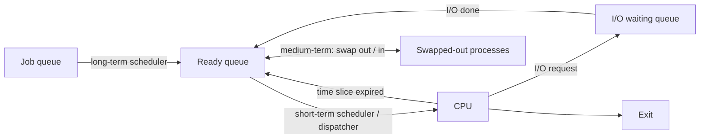

The **dispatcher** is the module that actually gives the CPU to the process chosen by the short-term scheduler: context switch, switch to user mode, jump to the right instruction. The time it takes is the **dispatch latency**.

### When does scheduling happen?
1. A process switches from **running → waiting** (I/O request, wait()).
2. A process switches from **running → ready** (timer interrupt).
3. A process switches from **waiting → ready** (I/O completes).
4. A process **terminates**.

If scheduling happens **only in cases 1 and 4**, the scheduling is **non-preemptive (cooperative)**; otherwise it is **preemptive**.

### Preemptive vs non-preemptive

| Non-preemptive | Preemptive |
|---|---|
| A process keeps the CPU until it **terminates or blocks** | The OS can **take the CPU away** (timer interrupt, higher-priority arrival) |
| Simple, low overhead, no races on kernel data | Better response time; fair; needed for interactive and real-time systems |
| One long process can hold up everyone | Context-switch overhead; shared data needs protection |
| FCFS, SJF, non-preemptive priority | RR, SRTF, preemptive priority |
| Windows 3.x, old Mac OS | All modern OSs |

### Scheduling criteria

| Criterion | Meaning | Goal |
|---|---|---|
| **CPU utilization** | Fraction of time the CPU is busy (real systems: 40–90%) | Maximize |
| **Throughput** | Processes completed per time unit | Maximize |
| **Turnaround time (TAT)** | Time from **arrival to completion** | Minimize |
| **Waiting time (WT)** | Total time spent **in the ready queue** | Minimize |
| **Response time (RT)** | Time from arrival until the **first response / first time on CPU** | Minimize (interactive) |
| **Fairness** | Comparable processes get comparable service | Ensure |

The formulas used in every scheduling problem:

```calc
Turnaround time = Completion time - Arrival time
Waiting time    = Turnaround time - Burst time
Response time   = First time scheduled - Arrival time
Average WT      = (sum of waiting times) / n
```

Different systems weigh these differently: **batch** systems care about throughput and turnaround; **interactive** systems about response time; **real-time** systems about meeting deadlines.

**Key points:**
- Long-term scheduler controls the degree of multiprogramming; short-term picks the next ready process; medium-term swaps.
- Dispatcher performs the context switch; its delay is dispatch latency.
- Non-preemptive: switch only on block/terminate; preemptive: the OS can interrupt.
- TAT = CT − AT; WT = TAT − BT; RT = first run − AT.

=== Scheduling Algorithms I: FCFS, SJF and SRTF
difficulty: hard
---
All examples use this workload unless stated otherwise (times in ms):

```calc
Process  Arrival  Burst
P1       0        8
P2       1        4
P3       2        9
P4       3        5
```

### First-Come, First-Served (FCFS)
The simplest algorithm: processes run **in order of arrival**, using a FIFO ready queue. **Non-preemptive.**

```calc
Gantt: | P1 | P2 | P3 | P4 |
       0    8    12   21   26

Process  CT  TAT=CT-AT  WT=TAT-BT
P1        8   8          0
P2       12  11          7
P3       21  19         10
P4       26  23         18
Average waiting time = (0+7+10+18)/4 = 8.75   Average TAT = 15.25
```

- **+** Simple, fair in arrival order, no starvation.
- **−** Average waiting time is often long and depends heavily on arrival order. **Convoy effect**: short processes wait behind one long CPU-bound process (like cars stuck behind a truck), lowering CPU and device utilization. Bad for interactive systems.

The book's example shows the convoy effect: bursts 24, 3, 3 arriving together.

```calc
Order P1,P2,P3: | P1 24 | P2 | P3 |  waits 0, 24, 27 -> average 17
Order P2,P3,P1: | P2 | P3 | P1 24 |  waits 0, 3, 6   -> average 3
```

### Shortest Job First (SJF)
Run the process with the **smallest next CPU burst**; ties broken by FCFS. **Non-preemptive** — once started, a job runs to completion.

```calc
t=0  only P1 has arrived -> P1 runs 0-8
t=8  ready: P2(4), P3(9), P4(5) -> shortest P2 (8-12), then P4 (12-17), then P3 (17-26)
Gantt: | P1 | P2 | P4 | P3 |
       0    8    12   17   26
Waiting: P1 0, P2 7, P3 15, P4 9  -> average 31/4 = 7.75
```

- SJF is **provably optimal for average waiting time** (among non-preemptive algorithms, for a given set of jobs available together): moving a short job ahead of a long one reduces the short job's wait more than it increases the long one's.
- **−** The length of the next CPU burst is **not known in advance**. It is predicted from previous bursts with **exponential averaging**: `τ(n+1) = α·t(n) + (1 − α)·τ(n)`, where t(n) is the latest actual burst and 0 ≤ α ≤ 1 (often ½).
- **−** **Starvation** of long jobs if short jobs keep arriving.

### Shortest Remaining Time First (SRTF) — preemptive SJF
When a new process arrives, compare its burst with the **remaining** time of the running process; **preempt** if the newcomer is shorter.

```calc
t=0  P1 starts (remaining 8)
t=1  P2 arrives (4) < P1 remaining (7)  -> preempt, P2 runs
t=2  P3 arrives (9) - P2 still shortest (3 left)
t=3  P4 arrives (5) - P2 still shortest (2 left)
t=5  P2 done; remaining: P1 7, P3 9, P4 5 -> P4 runs 5-10
t=10 P1 runs 10-17, then P3 17-26
Gantt: | P1 | P2 | P4 | P1 | P3 |
       0    1    5    10   17   26

Process  CT  TAT  WT  RT
P1       17  17    9   0
P2        5   4    0   0
P3       26  24   15  15
P4       10   7    2   2
Average WT = (9+0+15+2)/4 = 6.5   Average RT = 4.25
```

- Gives the **minimum average waiting time** of all algorithms; very good response for short jobs.
- **−** Needs burst lengths in advance; long jobs may **starve**; more context switches.

### Summary on this workload

| Algorithm | Avg waiting | Avg turnaround |
|---|---|---|
| FCFS | 8.75 | 15.25 |
| SJF (non-preemptive) | 7.75 | 14.25 |
| SRTF (preemptive) | 6.5 | 13.0 |

**Key points:**
- FCFS: simple, non-preemptive, suffers the convoy effect.
- SJF: optimal average waiting time but needs burst prediction (exponential averaging); long jobs can starve.
- SRTF: preemptive SJF — preempts when a shorter job arrives; best average WT.
- Always draw the Gantt chart, then WT = TAT − BT.

=== Scheduling Algorithms II: Round Robin and Priority Scheduling
difficulty: hard
---
### Round Robin (RR)
Designed for **time-sharing**: each process gets a small unit of CPU time, the **time quantum (time slice)**, typically 10–100 ms. The ready queue is a **circular FIFO queue**.
- The scheduler takes the process at the head, sets a timer for one quantum and dispatches it.
- If the burst finishes within the quantum, the process releases the CPU itself.
- Otherwise the timer interrupts, the process is **preempted** and put at the **tail** of the queue.
- No process gets more than one quantum in a row; with n processes and quantum q, no process waits more than **(n − 1) × q** before its next turn.

The book's example: P1 = 53, P2 = 8, P3 = 68, P4 = 24, all arriving at 0, quantum 20.

```calc
Gantt:
| P1 | P2 | P3 | P4 | P1 | P3 | P4  | P1  | P3  | P3  |
0    20   28   48   68   88   108   112   125   145   153

Waiting time = completion - burst (all arrived at 0):
P1 = 125 - 53 = 72     ( = (68-20) + (112-88) )
P2 =  28 -  8 = 20
P3 = 153 - 68 = 85     ( = 28 + (88-48) + (125-108) )
P4 = 112 - 24 = 88     ( = 48 + (108-68) )
Average waiting time = (72+20+85+88)/4 = 66.25
```

On our standard workload (P1 0/8, P2 1/4, P3 2/9, P4 3/5) with quantum 3: average waiting 13.5 but **average response time only 3** — RR trades turnaround for responsiveness.

**Choosing the quantum**:
- **Too large** → RR degenerates into **FCFS**; poor response for short interactive jobs.
- **Too small** → too many **context switches**; the CPU spends its time switching (if the quantum is 4 ms and a switch costs 1 ms, 20% of CPU time is wasted).
- Rule of thumb: about **80% of CPU bursts should be shorter than the quantum**; 20–50 ms is a reasonable compromise.

- **+** Fair, no starvation, good response time — ideal for interactive systems. Also used for network packet scheduling.
- **−** Average waiting/turnaround often higher than SJF; context-switch overhead.

### Priority scheduling
Each process has a **priority**; the CPU goes to the **highest-priority** ready process; equal priorities are served FCFS. (Whether 0 is highest or lowest varies by system — here, as in the book, **a lower number means higher priority**.) SJF is a special case where priority = predicted burst.

Priorities can be:
- **Static** — fixed from external criteria (importance, owner, payment);
- **Dynamic** — computed by the OS from measurable quantities (time limits, memory, I/O vs CPU usage). E.g. giving I/O-bound processes high priority lets them start their next I/O quickly.

**Preemptive priority** (the book's example):

```calc
Process  Arrival  Burst  Priority (1 = highest)
P1       0        3      2
P2       1        2      1
P3       2        1      3

t=0  P1 alone -> runs
t=1  P2 arrives with higher priority -> preempts P1, runs 1-3
t=3  P1 (prio 2) beats P3 (prio 3) -> P1 runs 3-5
t=5  P3 runs 5-6
Gantt: | P1 | P2 | P1 | P3 |
       0    1    3    5    6
WT: P1 = 5-0-3 = 2, P2 = 0, P3 = 6-2-1 = 3 -> average 5/3 = 1.67
```

**Non-preemptive priority** (all arrive at 0):

```calc
Process  Burst  Priority
P1       10     3
P2        1     1
P3        2     4
P4        1     5
P5        5     2
Gantt: | P2 | P5 | P1 | P3 | P4 |
       0    1    6    16   18   19
WT: P2 0, P5 1, P1 6, P3 16, P4 18 -> average 41/5 = 8.2
```

**Starvation (indefinite blocking)** — a low-priority process may never run if higher-priority processes keep arriving. (Legend has it that when MIT's IBM 7094 was shut down in 1973, a low-priority job submitted in 1967 had still not run.)
**Solution — aging:** gradually **increase the priority of processes that wait a long time**, e.g. raise it by 1 every 15 minutes, so every process eventually gets the CPU.

### Comparison of algorithms

| Algorithm | Preemptive? | Starvation? | Best for |
|---|---|---|---|
| FCFS | No | No | Batch, simple systems |
| SJF | No | Yes (long jobs) | Batch with known run times |
| SRTF | Yes | Yes (long jobs) | Minimum average waiting |
| Round Robin | Yes | No | Time-sharing, interactive |
| Priority | Either | Yes (fix: aging) | Systems with important tasks |
| Multilevel feedback queue | Yes | Possible (fix: aging) | General-purpose OS |

**Key points:**
- RR: time quantum, circular queue, preempt at quantum end; quantum too big → FCFS, too small → overhead.
- RR gives good response time, no starvation.
- Priority: highest priority first (preemptive or not); starvation fixed by aging.
- SJF is priority scheduling with priority = predicted burst length.

=== Multilevel Queue, Multilevel Feedback Queue and Multiprocessor Scheduling
difficulty: hard
---
### Multilevel queue scheduling
When processes fall into clear groups, the ready queue is **split into several separate queues**, and each process is **permanently assigned** to one queue (by type, priority or memory size). Each queue has **its own algorithm**, and there is scheduling **between** queues.

```calc
Highest priority   system processes        (priority / FCFS)
                   interactive processes    (RR)
                   interactive editing      (RR)
                   batch processes          (FCFS)
Lowest priority    student / background     (FCFS)
```

Scheduling between queues:
- **Fixed priority preemptive** — e.g. the foreground queue has absolute priority; a background process runs only if all foreground queues are empty (and is preempted when a foreground process arrives) → background **starvation** is possible.
- **Time slicing between queues** — e.g. foreground 80% of CPU time (RR among its processes), background 20% (FCFS).

### Multilevel feedback queue (MLFQ)
Like multilevel queues, but processes **move between queues** according to their behaviour:
- A process that **uses too much CPU time** (uses its whole quantum) is moved **down** to a lower-priority queue.
- A process that **waits too long** in a low queue is moved **up** (**aging**) — prevents starvation.
- I/O-bound and interactive processes therefore stay in the high-priority queues, CPU-bound ones sink.

The book's example: three queues.

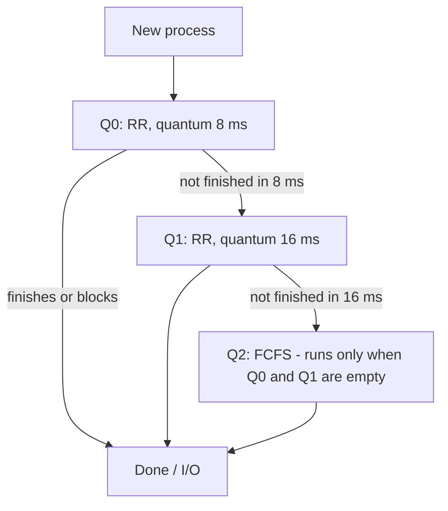

```calc
A job needing 30 ms of CPU:
Q0: runs 8 ms (22 left) -> demoted
Q1: runs 16 ms (6 left) -> demoted
Q2: runs the last 6 ms whenever Q0 and Q1 are empty
A job needing 5 ms finishes in Q0 with top priority.
```

An MLFQ is defined by: the **number of queues**, the **algorithm for each queue**, the rule for **upgrading** a process, the rule for **demoting** it, and the rule for **which queue a new process enters**. It is the **most general** CPU-scheduling algorithm (it can be configured to match a specific system) but also the **most complex** to tune. Variants in the book: give each lower queue a longer quantum; move a job up when it is preempted for I/O and down when it uses its whole slice; use aging to move long-waiting jobs up.

### Thread scheduling
- **User-level threads**: the kernel schedules only the **process**; a thread library inside the process picks which thread runs (process-contention scope). If a thread blocks on I/O, the kernel blocks the whole process. Switching threads is cheap; the run-time can use an **application-specific** scheduler.
- **Kernel-level threads**: the kernel schedules **threads directly** (system-contention scope), each with its own quantum, regardless of the process they belong to. A blocking thread doesn't stop its siblings, but switching between threads of different processes needs a full context switch.

### Multiprocessor scheduling
- **Asymmetric multiprocessing** — one **master** processor runs all scheduling, I/O and system activities; the others run only user code. Simple (only one CPU touches kernel data) but the master can become a bottleneck.
- **Symmetric multiprocessing (SMP)** — **each processor schedules itself**. Ready queues may be **common** (one shared queue — must ensure two CPUs don't pick the same process and none is lost) or **per-processor** (one CPU may be idle while another is overloaded). Nearly all modern OSs use SMP.

Issues in SMP scheduling:
- **Processor affinity** — keep a process on the same CPU to reuse its warm cache. **Soft** affinity (try to) vs **hard** affinity (must).
- **Load balancing** — **push migration** (a task moves work from overloaded CPUs) and **pull migration** (an idle CPU pulls work). Balancing works against affinity.
- **Multicore and hardware threads** — while one hardware thread stalls on memory, the core runs another (hyper-threading).

### Real-time scheduling (brief)
- **Rate-monotonic** — static priority, shorter period = higher priority.
- **Earliest Deadline First (EDF)** — dynamic priority, nearest deadline runs first.

**Key points:**
- Multilevel queue: fixed assignment to queues, each with its own algorithm.
- MLFQ: processes move — demoted after using a full quantum, promoted by aging; most general but complex.
- ULT scheduled by a library inside the process; KLT scheduled by the kernel.
- SMP: per-CPU self-scheduling with affinity and load balancing (push/pull).

=== Evaluating Scheduling Algorithms: Deterministic Modeling, Queueing and Simulation
difficulty: medium
---
Which scheduling algorithm is "best" depends on the **criteria** chosen — e.g. maximize CPU utilization subject to a maximum response time of 1 second, or maximize throughput with turnaround time linearly proportional to execution time. Once criteria are fixed, the algorithms are compared with one of four methods.

### 1. Deterministic modeling
Take a **specific, predetermined workload** and compute each algorithm's performance on it. The book's example: five processes arriving at time 0 with CPU bursts **P1 = 10, P2 = 29, P3 = 3, P4 = 7, P5 = 12** ms.

```calc
FCFS:  | P1 | P2 | P3 | P4 | P5 |
       0    10   39   42   49   61
       waits 0, 10, 39, 42, 49   -> average 140/5 = 28 ms

SJF (non-preemptive):  | P3 | P4 | P1 | P5 | P2 |
                       0    3    10   20   32   61
       waits P1 10, P2 32, P3 0, P4 3, P5 20  -> average 65/5 = 13 ms

RR, quantum 10:  | P1 | P2 | P3 | P4 | P5 | P2 | P5 | P2 |
                 0    10   20   23   30   40   50   52   61
       waits P1 0, P2 32, P3 20, P4 23, P5 40 -> average 115/5 = 23 ms
```

SJF gives less than half FCFS's average wait; RR lies in between.
- **+** Simple, fast, exact numbers; good for teaching and for showing trends (for all processes available at time 0, SJF always gives the minimum average wait).
- **−** Requires exact input, and the answer applies **only to that workload**.

### 2. Queueing models
Real workloads vary, but the **distributions** of CPU and I/O bursts and of arrival times can be measured and described mathematically. The system is modeled as a **network of servers**, each with a queue (the CPU with its ready queue, devices with their device queues) — **queueing-network analysis**. Knowing arrival and service rates, we can compute utilization, average queue length and average waiting time.

**Little's formula**: in a steady state, the number of processes leaving the queue equals the number arriving, so

```calc
n = λ × W
n = average queue length, λ = average arrival rate, W = average waiting time

Example: 7 processes arrive per second and 14 are normally in the queue
         W = n / λ = 14 / 7 = 2 seconds
```

It holds for **any** scheduling algorithm and arrival distribution. Limitation: realistic algorithms and distributions are hard to analyse, so models rely on simplifying assumptions and are only approximations.

### 3. Simulation
Program a **model of the computer system**: a clock variable advances, and the simulator updates the state of devices, processes and the scheduler. Data to drive it comes from **random-number generators** following measured distributions, or from **trace tapes** — recordings of real event sequences on a real system, which give the most accurate comparisons for that workload.
- **+** More accurate than queueing models.
- **−** Expensive: hours of computation, large storage for traces, and the simulator itself takes effort to design, code and debug.

### 4. Implementation
The only completely accurate method: **code the algorithm into the OS** and measure it under real conditions. Costs: coding and modifying the kernel, user reaction to a changing OS, and the fact that the environment changes — users adapt their behaviour to the scheduler (e.g. a user who learns that short interactive processes get priority may break work into tiny jobs). The most flexible schedulers can be **tuned** by administrators or offer APIs to adjust priorities.

**Key points:**
- Deterministic modeling: exact results for one fixed workload (book example: FCFS 28, SJF 13, RR(10) 23 ms).
- Queueing models use measured distributions; Little's formula n = λ × W holds for any algorithm.
- Simulation (random or trace-driven) is more accurate but costly.
- Implementation is the only exact test, but users and workloads change in response.

=== Real-Time CPU Scheduling: Rate-Monotonic and Earliest-Deadline-First
difficulty: hard
---
A **real-time system** must produce results within **timing constraints**. In **hard real-time** systems, a missed deadline is a failure (airbag, anti-lock brakes); in **soft real-time** systems critical tasks just get priority and occasional misses are tolerated (multimedia). Real-time kernels need **preemptive, priority-based scheduling** and **low latency**.

### Latency
- **Interrupt latency** — time from an interrupt's arrival to the start of its service routine. Kernel code must disable interrupts only briefly.
- **Dispatch latency** — time to stop one process and start another. Its **conflict phase** includes preempting any process running in the kernel and making low-priority processes release resources needed by a high-priority one. A **preemptive kernel** keeps it small.

### Periodic tasks
Real-time processes are often **periodic**: each needs the CPU at constant intervals. A task has a processing time **t**, a deadline **d** and a period **p**, with 0 ≤ t ≤ d ≤ p; its **rate** is 1/p. (In the examples below the deadline is the start of the next period.) A scheduler may use **admission control**: admit a process only if it can guarantee its deadline.

CPU utilization of a task = **t / p**. A set of tasks can't be scheduled if total utilization exceeds 1.

### Rate-monotonic scheduling
**Static priorities, inversely proportional to the period** — the shorter the period, the higher the priority — with preemption.

The book's example: **P1: p = 50, t = 20; P2: p = 100, t = 35.** Utilization = 20/50 + 35/100 = **0.75**.

```calc
If P2 had the higher priority:
| P2 0-35 | P1 35-55 ...      P1 finishes at 55 > its deadline 50 -> MISSED

Rate-monotonic (P1 has the shorter period -> higher priority):
| P1 0-20 | P2 20-50 | P1 50-70 | P2 70-75 | idle 75-100 | P1 100-120 | P2 120-150 | ...
P1 meets 50 and 100; P2 finishes at 75 (deadline 100). Both deadlines met.
```

Rate-monotonic is **optimal among static-priority algorithms**: if it can't schedule a task set, no static-priority algorithm can. But its utilization is bounded. The worst-case bound for **N** processes is

```calc
U <= N (2^(1/N) - 1)
N = 1: 1.00    N = 2: about 0.83    N = 3: about 0.78    N -> infinity: ln 2 = about 0.69
```

The first example's 75% is under the 83% bound for two tasks, so it is **guaranteed** schedulable.

Second example: **P1: p = 50, t = 25; P2: p = 80, t = 35.** Utilization = 25/50 + 35/80 ≈ **0.94** — above 0.83, so not guaranteed:

```calc
| P1 0-25 | P2 25-50 | P1 50-75 | P2 75-85 ...
At 50, P1 preempts P2 (P2 still needs 10 ms). P2 finishes at 85 > deadline 80 -> MISSED
```

### Earliest-deadline-first (EDF)
**Dynamic priorities by deadline** — the earlier the deadline, the higher the priority. When a process becomes runnable it announces its deadline, and priorities are adjusted.

Same task set (50/25, 80/35):

```calc
| P1 0-25 | P2 25-60 | P1 60-85 | P2 85-100 | P1 100-125 | P2 125-145 | idle | P1 150-175 | ...
At 50, P1's new job has deadline 100 but P2's deadline is 80 -> P2 keeps running (no preemption).
P2 finishes at 60 (deadline 80); P1 finishes at 85 (deadline 100). All deadlines met.
```

EDF doesn't need periodic tasks or constant bursts — only that processes announce deadlines. **Theoretically optimal**: it can schedule any set whose utilization is ≤ 100%, but in practice context switching and interrupt handling make 100% unattainable.

### Proportional-share scheduling
Allocate **T shares** among all applications; an application given N shares gets N/T of the processor time. Must be combined with **admission control** — a new process is admitted only if enough shares are available.

**Key points:**
- Hard real-time: missing a deadline is failure; soft: priority only. Keep interrupt and dispatch latency low.
- Utilization of a periodic task = t/p.
- Rate-monotonic: static priority by shortest period; optimal among static schemes; bound N(2^(1/N) − 1) → 69%.
- EDF: dynamic priority by earliest deadline; can reach 100% utilization in theory.

=== Deadlocks: Conditions and Resource-Allocation Graphs
difficulty: medium
---
A **deadlock** is a situation in which **a set of processes are blocked forever**, because **each is holding a resource and waiting for a resource held by another process in the set**. None can proceed, release its resources or be woken up.

The book's example: processes A and B both need a scanner and a CD recorder. A gets the scanner, B gets the recorder; A then asks for the recorder and B for the scanner — both block forever.

A process uses a resource in three steps: **request → use → release**. The OS records in a system table whether each resource is free or allocated, and to whom.

### Preemptable vs non-preemptable resources
- **Preemptable** — can be taken away from the owner without harm (memory, CPU — state can be saved and restored).
- **Non-preemptable** — taking it away would cause the computation to fail (printer mid-job, CD recorder, a lock on a record). **Deadlocks involve non-preemptable resources.**

### The four necessary (Coffman) conditions
A deadlock can arise **only if all four hold simultaneously**:
1. **Mutual exclusion** — at least one resource is non-sharable: only one process can use it at a time.
2. **Hold and wait** — a process holds at least one resource while waiting to acquire others held by other processes.
3. **No preemption** — resources cannot be forcibly taken; they are released only voluntarily.
4. **Circular wait** — there is a cycle P0 → P1 → … → Pn → P0 in which each process waits for a resource held by the next.

The conditions are **necessary but not sufficient**: all four can hold without a deadlock actually occurring (circular wait already implies hold and wait).

### Deadlock vs starvation

| Deadlock | Starvation |
|---|---|
| Processes wait **for each other** in a cycle | A process waits indefinitely while **others progress** |
| None of them can proceed, even with a free CPU | It could run, but keeps losing to others |
| Global — involves a set of processes | Can affect a single process |
| Needs all four conditions | Caused by unfair scheduling/allocation; fixed by aging |

Deadlock is a **global condition**: inspecting any single process's code reveals no bug — the problem is the interaction.

### Resource-allocation graph (RAG)
A directed graph with two kinds of nodes — **processes (circles)** and **resource types (rectangles, with a dot per instance)** — and two kinds of edges:
- **Request edge** Pi → Rj: Pi has requested an instance of Rj and is waiting.
- **Assignment edge** Rj → Pi: an instance of Rj is allocated to Pi.

A request edge becomes an assignment edge when granted and disappears on release.

The book's example (R1 and R3 have one instance; R2 two; R4 two):

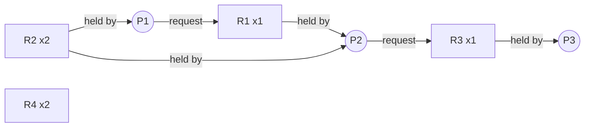

P1 holds R2 and waits for R1; P2 holds R1 and R2 and waits for R3; P3 holds R3 and wants nothing more. **No cycle → no deadlock**: P3 finishes, releases R3, then P2, then P1.

Now suppose **P3 requests R2** (both instances are taken):

```calc
Cycles:  P1 -> R1 -> P2 -> R3 -> P3 -> R2 -> P1
         P2 -> R3 -> P3 -> R2 -> P2
P2 waits for R3 (held by P3); P3 waits for R2 (held by P1 and P2);
P1 waits for R1 (held by P2)  -> P1, P2 and P3 are deadlocked.
```

### Reading a RAG
- **No cycle** → **no deadlock**.
- **Cycle, and every resource has a single instance** → **deadlock** (cycle is necessary **and sufficient**).
- **Cycle, with multiple-instance resources** → **possibly** a deadlock (necessary but **not** sufficient). Example: P1 → R1 → P2 → R2 → P1 is a cycle, but if R2 has a second instance held by P3, which is not waiting, P3 can finish and release it, breaking the cycle.

**Key points:**
- Deadlock: each process in a set holds a resource and waits for another held in the set.
- Four necessary conditions: mutual exclusion, hold and wait, no preemption, circular wait.
- RAG: request edges P→R, assignment edges R→P.
- Single-instance resources: cycle ⇔ deadlock; multiple instances: cycle = only possible deadlock.

=== Deadlock Handling: Prevention, Avoidance (Banker's Algorithm), Detection and Recovery
difficulty: hard
---
There are four strategies:
1. **Ignore** the problem (the **ostrich algorithm**) — used by most general-purpose OSs (Windows, Linux) for user resources, because deadlocks are rare and prevention is expensive.
2. **Prevention** — design the system so one of the four conditions can never hold.
3. **Avoidance** — use advance information to grant requests only when it is safe.
4. **Detection and recovery** — let deadlocks happen, detect them, then recover.

### 1. Deadlock prevention — break one condition

| Condition | How to break it | Drawback |
|---|---|---|
| **Mutual exclusion** | Make resources sharable (read-only files); spool printers | Some resources are inherently non-sharable |
| **Hold and wait** | Request **all** resources before starting, or request only when holding **none** | Low resource utilization; starvation of processes needing popular resources |
| **No preemption** | If a request can't be granted, **release everything held** and retry later; or preempt from waiting processes | Only for resources whose state is easy to save (CPU registers, memory), not printers |
| **Circular wait** | **Order all resource types** with numbers; request only in **increasing** order (or hold one resource at a time) | Ordering must suit all programs — **the most practical** prevention method |

### 2. Deadlock avoidance — safe states
Each process declares in advance its **maximum claim** of each resource type. Before granting a request, the OS checks that the system would stay in a **safe state**.

- A state is **safe** if there exists a **safe sequence** ⟨P1, P2, …, Pn⟩ in which each Pi's remaining needs can be satisfied by the currently available resources **plus** the resources held by all Pj with j < i (which will have finished and released them).
- **Safe → no deadlock. Unsafe → deadlock is possible** (not certain). Avoidance never lets the system enter an unsafe state.

The book's example: 10 instances of one resource.

```calc
Process  Has  Max  Need
P1       3    9    6
P2       2    4    2
P3       2    7    5
Available = 10 - 7 = 3

Safe? Give P2 its 2 -> it finishes, releases 4: available 1 + 4 = 5
      P3 needs 5 <= 5 -> finishes, available 5 + 2 = 7
      P1 needs 6 <= 7 -> finishes
Safe sequence <P2, P3, P1>  -> SAFE

Now P1 asks for one more and it is granted: P1 has 4, available 2
      P2 needs 2 -> finishes, available 4
      P1 needs 5 > 4, P3 needs 5 > 4 -> stuck  -> UNSAFE, so the request must wait
```

(The book quotes 4 instances being free after P2 finishes in the first case; it is actually 5 — 1 left over plus the 4 P2 returns.)

### Banker's algorithm (multiple resource types)
Named after a banker who never lends cash in a way that could leave them unable to satisfy all customers. Data structures for n processes and m resource types:
- **Available[m]** — free instances of each type;
- **Max[n][m]** — maximum demand of each process;
- **Allocation[n][m]** — currently allocated;
- **Need[n][m] = Max − Allocation**.

**Safety algorithm:** Work = Available; repeatedly find an unfinished process with **Need ≤ Work**, pretend it finishes (**Work += its Allocation**). If all processes can finish, the state is safe.

**Resource-request algorithm:** when Pi requests Request_i: (1) error if Request_i > Need_i; (2) wait if Request_i > Available; (3) **pretend** to allocate (Available −= Request, Allocation += Request, Need −= Request) and run the safety algorithm — grant if safe, otherwise roll back and make Pi wait.

Classic worked example (resources A, B, C with 10, 5, 7 instances):

```calc
        Allocation   Max      Need = Max - Allocation
        A B C        A B C    A B C
P0      0 1 0        7 5 3    7 4 3
P1      2 0 0        3 2 2    1 2 2
P2      3 0 2        9 0 2    6 0 0
P3      2 1 1        2 2 2    0 1 1
P4      0 0 2        4 3 3    4 3 1
Available = 3 3 2

Work = 3 3 2
P1: need 1 2 2 <= 3 3 2 -> Work = 3 3 2 + 2 0 0 = 5 3 2
P3: need 0 1 1 <= 5 3 2 -> Work = 5 3 2 + 2 1 1 = 7 4 3
P4: need 4 3 1 <= 7 4 3 -> Work = 7 4 3 + 0 0 2 = 7 4 5
P0: need 7 4 3 <= 7 4 5 -> Work = 7 4 5 + 0 1 0 = 7 5 5
P2: need 6 0 0 <= 7 5 5 -> Work = 7 5 5 + 3 0 2 = 10 5 7
Safe sequence <P1, P3, P4, P0, P2>  -> SAFE

Request from P1 = (1, 0, 2): <= Need(1 2 2) and <= Available(3 3 2)
Pretend: Available = 2 3 0, Allocation(P1) = 3 0 2, Need(P1) = 0 2 0
Safety check again -> <P1, P3, P4, P0, P2> still works -> GRANT
```

Limitations: processes must declare maximum needs in advance; the number of processes and resources is assumed fixed; processes must release resources within finite time; O(m × n²) per check. So few real systems use it.

### 3. Deadlock detection
Allow deadlocks, but run a detection algorithm periodically (e.g. every k minutes, or when CPU utilization drops sharply).
- **Single instance of each resource type:** reduce the RAG to a **wait-for graph** (Pi → Pj if Pi waits for a resource held by Pj) and search for a **cycle** — O(n²). The book describes the DFS approach: keep a list L of nodes on the current path, follow unmarked arcs, and if a node appears in L twice, a cycle (deadlock) is found; at a dead end, backtrack. In the book's 7-process example the cycle found is D → T → E → V → G → U → D.
- **Multiple instances:** an algorithm like Banker's safety check, but using **current requests** instead of maximum needs; processes that can't finish are deadlocked.

### 4. Recovery from deadlock
- **Process termination** — abort **all** deadlocked processes (expensive, lots of lost work), or abort them **one at a time** until the cycle disappears (detection must rerun after each). Choose victims by priority, how long they've run and how much remains, resources held, whether interactive or batch. Killing a process mid-update can leave files inconsistent.
- **Resource preemption** — take resources away from some processes and give them to others. Issues: **selecting a victim** (minimum cost), **rollback** (return the victim to a safe state — often a total restart; checkpoints help), and **starvation** (don't always pick the same victim — include the number of rollbacks in the cost).
- **Manual** — notify the operator.

**Key points:**
- Strategies: ignore (ostrich), prevent, avoid, detect and recover.
- Prevention breaks a condition; resource ordering (no circular wait) is most practical.
- Safe state ⇒ no deadlock; unsafe ⇒ deadlock possible. Banker's: Need = Max − Allocation, find a safe sequence.
- Detection: cycle in the wait-for graph; recovery by killing processes or preempting resources.

=== Memory Management Basics: Address Binding, Logical vs Physical Addresses and Swapping
difficulty: medium
---
Every program must be in **main memory (RAM)** to run, and in a multiprogrammed system many processes share it. The **memory manager** keeps track of which parts are in use, allocates and frees memory, and moves processes between memory and disk.

### Address binding
A program refers to code and data by symbolic names; these must be **bound** to real memory addresses. Binding can happen at:
1. **Compile time** — if the memory location is known in advance, **absolute code** is generated. If the starting location changes, the program must be **recompiled** (MS-DOS .COM programs).
2. **Load time** — the compiler generates **relocatable code**; the loader binds addresses when the program is brought into memory. Moving it later requires reloading.
3. **Execution (run) time** — binding is delayed until each instruction runs; the process can be **moved in memory during execution**. Requires hardware support (base/limit registers, MMU). Used by almost all modern OSs.

Steps from source to running program: source → preprocessor → compiler → assembler → **object code** → **linker** (combines object files and libraries) → executable → **loader** puts it into memory.
- **Static linking** copies library code into the executable. **Dynamic linking** (DLLs, `.so` files) links at run time; one copy of the library in memory is shared by all processes.
- **Dynamic loading** loads a routine only when it is first called — saves memory for rarely used code.

### Logical vs physical addresses
- **Logical (virtual) address** — generated by the CPU / the program; the set of all of them is the **logical address space** (from 0 up to the size of the process).
- **Physical address** — the address actually sent to the memory unit; the set is the **physical address space**.
- Logical and physical addresses are the **same** with compile-time and load-time binding, but **differ** with execution-time binding.
- The **Memory Management Unit (MMU)** is the hardware that maps logical to physical addresses at run time. The user program never sees physical addresses.

The simplest MMU uses a **relocation (base) register** and a **limit register**:

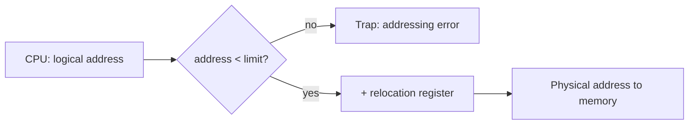

The book's example:

```calc
Relocation register = 16000, logical address = 510
510 < limit  -> physical address = 16000 + 510 = 16510
If the logical address were >= limit -> trap (the process tried to access
memory outside its own address space)
```

The base and limit registers also give **memory protection**: a process cannot touch the OS or other processes. Only the OS (in kernel mode) can load these registers.

### Swapping
Main memory can't hold every process at once (an idle PC already runs dozens). **Swapping** temporarily moves a whole process **out of memory to a backing store (disk)** and later **back in** to continue.

```calc
memory: [ OS | A | ... ]  -- swap out A -->  disk: [ A ]
memory: [ OS | B | ... ]  <-- swap in B --   disk: [ B ]
```

- The scheduler's choice drives swapping: processes that have just used their quantum, have low priority, or are blocked for long are good candidates.
- With compile/load-time binding a swapped process must return to the **same** location; with execution-time binding it can go anywhere.
- The main cost is **transfer time**, proportional to the amount swapped — swapping a 100 MB process at 50 MB/s takes 2 s each way.
- Modern systems swap **pages**, not whole processes (see "Virtual Memory and Demand Paging"), and mobile OSs generally don't swap at all (they terminate background apps instead).

**Key points:**
- Binding at compile time (absolute code), load time (relocatable), or execution time (needs MMU).
- Logical address from the CPU; physical address in RAM; MMU translates at run time.
- Base + limit registers: physical = base + logical, trap if logical ≥ limit.
- Swapping moves whole processes between memory and disk.

=== Contiguous Memory Allocation: Partitions, Fit Algorithms and Fragmentation
difficulty: medium
---
Memory is divided into the **OS area** (usually low memory) and the **user area**. In **contiguous allocation** each process occupies **one single contiguous block** of memory.

### Single-partition allocation
One user process at a time, protected by relocation and limit registers.

### Fixed (static) partitioning — MFT
User memory is divided in advance into **fixed partitions** (equal or unequal sizes); each holds one process. IBM's OS/MFT (Multiprogramming with a Fixed number of Tasks) worked this way.
- Simple, but the degree of multiprogramming is limited by the number of partitions, a process larger than every partition can't run, and a small process in a big partition wastes space (**internal fragmentation**).

### Variable (dynamic) partitioning — MVT
Partitions are created **to the exact size** each process needs. Free blocks are called **holes**, scattered through memory. The OS keeps a list of allocated blocks and holes; when a process ends, its block becomes a hole and is **merged** with adjacent holes.

### Placement (fit) algorithms
Which hole should a request of n bytes use?
- **First fit** — the **first** hole that is big enough (search from the beginning). Fast.
- **Next fit** — like first fit, but start searching from where the **last** search stopped.
- **Best fit** — the **smallest** hole that is big enough — smallest leftover; must search the whole list (unless sorted).
- **Worst fit** — the **largest** hole — leaves the largest leftover, hoping it stays usable; must search the whole list.

Simulations show **first fit and best fit beat worst fit** in storage utilization; first fit is usually fastest.

Classic example: holes of **100, 500, 200, 300, 600 KB** (in order); processes of **212, 417, 112, 426 KB** arrive in that order.

```calc
First fit: 212 -> 500 (leaves 288)   417 -> 600 (leaves 183)
           112 -> 288 (leaves 176)   426 -> no hole big enough, must WAIT
Best fit:  212 -> 300 (88)   417 -> 500 (83)   112 -> 200 (88)   426 -> 600 (174)
           all four placed  <- best here
Worst fit: 212 -> 600 (388)  417 -> 500 (83)   112 -> 388 (276)  426 -> must WAIT
Next fit:  212 -> 500 (288)  417 -> 600 (183)  112 -> 183 (71)   426 -> must WAIT
```

### Fragmentation
- **External fragmentation** — enough **total** free memory exists to satisfy a request, but it is **not contiguous** (split into many small holes). Typical of variable partitioning and segmentation. The **50-percent rule**: with first fit, for N allocated blocks about 0.5N blocks are lost to fragmentation — one-third of memory may be unusable.
- **Internal fragmentation** — memory allocated to a process is **larger than it needs**; the unused part **inside** the partition is wasted. Typical of fixed partitions and paging (last page).

**Solutions to external fragmentation:**
- **Compaction** — shuffle the allocated blocks to one end of memory to create one large hole. Expensive (copying memory) and possible only with **dynamic (execution-time) relocation**.
- **Non-contiguous allocation** — let a process's memory be split up: **paging** and **segmentation**.

| | Internal fragmentation | External fragmentation |
|---|---|---|
| Where | Inside an allocated block | Between allocated blocks |
| Cause | Fixed-size allocation units | Variable-size allocation |
| Occurs in | Fixed partitions, paging | Variable partitions, segmentation |
| Fix | Smaller units / best-fit sizes | Compaction, paging |

**Key points:**
- Fixed partitions → internal fragmentation; variable partitions → external fragmentation.
- First fit (first big enough), best fit (smallest big enough), worst fit (largest), next fit (continue from last).
- First and best fit are better than worst fit.
- Compaction or paging cures external fragmentation.

=== Paging: Pages, Frames, Page Tables and Address Translation
difficulty: hard
---
**Paging** removes external fragmentation by letting a process's physical memory be **non-contiguous**.
- Physical memory is divided into fixed-size blocks called **frames** (page frames).
- Logical memory is divided into blocks of the **same size** called **pages**.
- Size is a **power of 2**, typically 4 KB (from 512 bytes up to several MB with huge pages).
- To run a program of n pages, the OS finds **any n free frames**, loads the pages and builds the process's **page table**. The OS keeps a **free-frame list**.

**No external fragmentation** (any free frame can be used); only **internal fragmentation** in the **last page** of a process — on average half a page per process.

### Address translation
A logical address is split into a **page number (p)** and a **page offset (d)**. The page number indexes the **page table**, which gives the **frame number (f)**; the physical address is **f combined with d**.

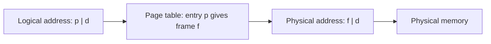

If the logical address space is 2^m and the page size 2^n bytes, the **low n bits are the offset** and the **high m − n bits the page number**.

The book's example — page size 1 KB, page table {0→5, 1→6, 2→1, 3→2}, logical address 1300:

```calc
page   p = 1300 div 1024 = 1
offset d = 1300 mod 1024 = 276
frame  f = page_table[1] = 6
physical = f x page size + d = 6 x 1024 + 276 = 6144 + 276 = 6420
```

With binary addresses the split is just bits. 32-bit address, 4 KB pages (2^12 → 12 offset bits, 20 page-number bits):

```calc
virtual address 0x12345678
offset = low 12 bits  = 0x678
page   = high 20 bits = 0x12345
If page 0x12345 is in frame 0x00ABC -> physical address 0x00ABC678
```

### Page table entry (PTE)
| Field | Meaning |
|---|---|
| **Frame number** | Where the page is in physical memory |
| **Present/absent (valid) bit** | Is the page in memory? If 0 → **page fault** |
| **Protection bits** | Read / write / execute permissions |
| **Modified (dirty) bit** | Page written since loaded — must be written back before eviction |
| **Referenced bit** | Page accessed recently — used by replacement algorithms |
| **Caching disabled** | For pages mapped to device registers |

Paging also provides **protection** (each process can reach only frames in its own table) and **sharing** (several processes' tables can map the same frames — e.g. one copy of shared library code).

### Translation Lookaside Buffer (TLB)
Keeping the page table in memory means **every access needs two memory accesses** (PTE + data). The **TLB** is a small, fast **associative cache of recent page → frame translations** inside the MMU (typically 64–1024 entries).
- **TLB hit** → frame number immediately; **TLB miss** → read the page table in memory, then put the entry in the TLB (replacing one).
- Entries may carry an **ASID** (address-space identifier) so the TLB needn't be flushed on every context switch.

**Effective access time (EAT)**, with TLB lookup 20 ns, memory access 100 ns:

```calc
Hit ratio 80%:  EAT = 0.80 x (20 + 100) + 0.20 x (20 + 100 + 100) = 96 + 44 = 140 ns
Hit ratio 98%:  EAT = 0.98 x 120 + 0.02 x 220 = 122 ns
(without a TLB every access costs 200 ns)
```

Hit ratios above 99% are normal, thanks to **locality of reference**.

### Page size trade-offs
- **Small pages:** less internal fragmentation, better fit to the working set — but bigger page tables and more TLB misses.
- **Large pages:** smaller tables, fewer TLB misses, more efficient disk I/O — but more internal fragmentation.

**Key points:**
- Pages (logical) and frames (physical) have equal size; page table maps p → f.
- Physical address = f × page size + offset; with powers of two, just split the bits.
- No external fragmentation; internal fragmentation only in the last page.
- TLB caches translations; EAT = hit × (TLB + mem) + miss × (TLB + 2 mem).

=== Multilevel, Hashed and Inverted Page Tables
difficulty: hard
---
With large address spaces a single flat page table becomes enormous.

```calc
32-bit address, 4 KB pages: 2^32 / 2^12 = 2^20 pages = 1,048,576 entries
4 bytes per entry -> 4 MB of page table PER PROCESS
= 4 MB / 4 KB = 1024 pages just for the page table (which must itself be contiguous)
```

### Hierarchical (multilevel) paging
**Page the page table.** In two-level paging, the 20-bit page number is split into **p1 (outer index)** and **p2 (inner index)**:

```calc
| p1 (10 bits) | p2 (10 bits) | offset (12 bits) |

p1 -> entry in the outer (top-level) page table -> address of a second-level table
p2 -> entry in that second-level table          -> frame number
offset -> byte within the frame

Example: 0x12345678 = 0001 0010 0011 0100 0101 0110 0111 1000
p1 = top 10 bits = 72, p2 = next 10 bits = 837, offset = 0x678
```

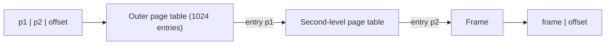

Why it saves memory: the outer table is just one page (1024 entries); **second-level tables are created only for the parts of the address space actually in use** (a process using code at the bottom and stack at the top needs only 3 small tables, not 1024). This is "demand paging on the page table". x86 uses 2 levels (32-bit), x86-64 uses **4 levels** (48-bit addresses), and newer CPUs 5.

Cost: each extra level adds a memory access on a TLB miss — which is why the TLB matters even more.

### Hashed page tables
Common for address spaces larger than 32 bits: the virtual page number is **hashed** into a table; each bucket is a linked list of (page number, frame) pairs to handle collisions. **Clustered page tables** store several consecutive pages per entry.

### Inverted page table
With 64-bit addresses even multilevel tables are huge: 2^64 bytes is 16 million terabytes; with 4 KB pages and 4-byte PTEs a full table would be about 16 thousand terabytes (the book shows that only a 4-level table brings the in-memory part down to about 16 MB).

An **inverted page table (frame table)** has **one entry per physical frame**, not per virtual page. Entry f holds **(process ID, virtual page number)** of the page now in frame f.
- Its size depends on **physical** memory: with 4 KB frames and 4-byte entries it is a constant **0.1%** of RAM, shared by all processes.
- **Drawback:** translation must **search** the table for (pid, page) — far too slow linearly, so a **hash table** is used, plus the TLB for the common case. Sharing pages between processes is harder (one frame, one entry).
- Used by PowerPC, IA-64 and UltraSPARC.

| | Multilevel | Inverted |
|---|---|---|
| Entries | Per virtual page (only for used regions) | Per physical frame |
| Tables | One per process | One for the whole system |
| Lookup | Direct indexing, several levels | Hash search on (pid, page) |
| Size grows with | Virtual address space used | Physical memory |

**Key points:**
- Flat table for 32-bit/4 KB = 4 MB per process; split into levels so unused parts need no tables.
- Two-level: p1 indexes the outer table, p2 the inner table.
- Hashed page tables for > 32-bit spaces.
- Inverted table: one entry per frame, size ∝ physical memory, needs hashing to search.

=== Segmentation and Segmentation with Paging
difficulty: medium
---
Paging splits a program into equal pieces that mean nothing to the programmer. **Segmentation** matches the **programmer's view**: a program is a collection of **segments** — logical units such as main program, functions, stack, global data, heap, symbol table, arrays — each of **variable length**.

- A logical address is **⟨segment number s, offset d⟩**.
- The **segment table** has, for each segment, a **base** (starting physical address) and a **limit** (length).
- Translation: if **d < limit[s]**, physical address = **base[s] + d**; otherwise **trap** (segmentation fault).

```calc
Segment table      base   limit
segment 0          1400   1000
segment 1          6300    400
segment 2          4300    400
segment 3          3200   1100

<2, 53>   -> 53 < 400   -> 4300 + 53  = 4353
<3, 852>  -> 852 < 1100 -> 3200 + 852 = 4052
<0, 1222> -> 1222 >= 1000 -> TRAP (addressing error)
```

### Advantages of segmentation
- Matches the program's logical structure; natural for modular programming.
- **Protection per segment** — code segment read-only/execute, data read-write.
- **Sharing** whole segments (e.g. a library's code segment) is natural.
- Segments can grow independently (stack, heap).
- **No internal fragmentation** (each segment gets exactly what it needs).

### Disadvantage
Segments are variable-sized and must each be contiguous → **external fragmentation**, just like dynamic partitioning (but a program may occupy **several non-contiguous** partitions — one per segment). Needs compaction or best/first fit.

### Paging vs segmentation

| | Paging | Segmentation |
|---|---|---|
| Unit size | Fixed (page) | Variable (segment) |
| Visible to programmer? | No — transparent | Yes — logical units |
| Address | page number + offset | segment number + offset |
| Fragmentation | Internal (last page) | External |
| Table | Page table (frame numbers) | Segment table (base + limit) |
| Sharing/protection | Per page | Per logical segment — more natural |

### Segmentation with paging
Combine both: the program is divided into **segments**, and **each segment is paged**. The segment table points to a **page table for that segment**; each segment uses frames anywhere in memory.
- Keeps the **logical view and per-segment protection** of segmentation, and the **no-external-fragmentation** property of paging.
- Used by MULTICS and Intel IA-32 (x86 protected mode: segmentation unit followed by paging unit). x86-64 essentially disables segmentation and relies on paging alone.

**Key points:**
- Segment = variable-size logical unit; address = ⟨s, d⟩.
- Physical = base[s] + d if d < limit[s], else trap.
- Segmentation: no internal fragmentation, but external fragmentation.
- Segmented paging: page each segment — best of both.

=== Virtual Memory and Demand Paging
difficulty: medium
---
**Virtual memory** separates the **logical memory** seen by a program from physical memory, so that **a process can run even if only part of it is in RAM**. The rest stays on disk (the **swap space / backing store**).

Benefits:
- Programs can be **larger than physical memory**; programmers needn't worry about memory size.
- **More processes in memory** at once → higher CPU utilization and throughput.
- **Less I/O** to load or swap programs (only needed parts are loaded).
- Easy **sharing** (shared libraries, shared memory) and fast process creation (copy-on-write).

### Demand paging
Pages are loaded **only when they are referenced** (a "lazy swapper", called a **pager**). Each PTE has a **valid–invalid (present/absent) bit**.

### Handling a page fault

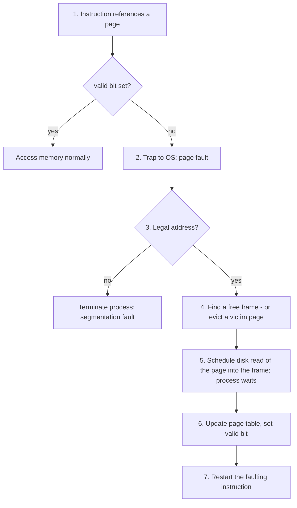

While the disk read happens, the faulting process is **blocked** and the CPU runs another process. If no frame is free, a **page-replacement algorithm** picks a victim; if the victim is **dirty** it must first be written to disk (two disk transfers instead of one).

- **Pure demand paging** — start a process with **no** pages in memory; it faults its way in.
- **Prepaging** — load several pages expected to be needed (e.g. the working set of a resumed process).
- A process starting up incurs many faults until its working pages are loaded (a **cold start**); afterwards the rate drops thanks to **locality**.

### Locality of reference
- **Temporal locality** — a location referenced now is likely to be referenced again soon (loops, counters).
- **Spatial locality** — locations **near** one just referenced are likely to be referenced soon (arrays, sequential code).
Locality is why bringing in a whole page on a fault, and keeping recently used pages, works well.

### Performance of demand paging

```calc
EAT = (1 - p) x memory access time + p x page-fault service time
Memory access = 200 ns, page-fault service = 8 ms = 8,000,000 ns

p = 1/1000:  EAT = 0.999 x 200 + 0.001 x 8,000,000 = 8199.8 ns = about 8.2 us
             -> the computer is slowed down by a factor of about 40!

To keep slowdown under 10% (EAT < 220 ns):
220 > 200 + p x (8,000,000 - 200)  ->  p < 0.0000025
i.e. fewer than 1 fault per 400,000 memory accesses
```

So the page-fault rate must be kept **extremely low** — the job of good replacement algorithms and enough frames.

### Copy-on-write (COW)
After `fork()`, parent and child **share** the same pages marked read-only; a page is copied only when one of them **writes** to it. Makes fork fast, especially when followed by `exec()`.

### Frame allocation
- **Equal allocation** (m frames / n processes) or **proportional allocation** (by process size or priority).
- **Global replacement** — a victim can be any frame (from other processes) — better throughput, but a process can't control its own fault rate.
- **Local replacement** — a victim must come from the faulting process's own frames.

**Key points:**
- Virtual memory: only part of a process needs to be in RAM; programs can exceed physical memory.
- Demand paging loads a page on its first reference; invalid bit → page fault.
- Fault handling: trap, check legality, find frame (maybe evict), read page, update table, restart instruction.
- EAT = (1 − p)·ma + p·fault time; p must be tiny.

=== Page Replacement Algorithms: FIFO, Optimal, LRU and Approximations
difficulty: hard
---
When a page fault occurs and **no frame is free**, the OS must choose a **victim page** to evict. A good algorithm minimizes future page faults. (Evicting a **clean** page is cheaper than a dirty one, which must be written back.) Pages of terminated processes, or of processes blocked for a long time, are natural victims.

All examples use the reference string **7, 0, 1, 2, 0, 3, 0, 4, 2, 3, 0, 3, 2, 1, 2, 0, 1, 7, 0, 1** with **3 frames**.

### FIFO (First-In, First-Out)
Evict the page that has been **in memory the longest** — a queue of loaded pages.

```calc
Ref:    7  0  1  2  0  3  0  4  2  3  0  3  2  1  2  0  1  7  0  1
F1:     7  7  7  2  2  2  2  4  4  4  0  0  0  0  0  0  0  7  7  7
F2:        0  0  0  0  3  3  3  2  2  2  2  2  1  1  1  1  1  0  0
F3:           1  1  1  1  0  0  0  3  3  3  3  3  2  2  2  2  2  1
Fault:  *  *  *  *     *  *  *  *  *  *        *  *        *  *  *
FIFO page faults = 15
(columns show the frame contents after each reference; * = page fault)
```

Simple, but it may evict a heavily used page just because it was loaded long ago.

**Belady's anomaly** — with FIFO, **more frames can produce more page faults**:

```calc
Reference string 1, 2, 3, 4, 1, 2, 5, 1, 2, 3, 4, 5
FIFO with 3 frames:  9 faults
FIFO with 4 frames: 10 faults   <- more memory, more faults!
LRU  with 3 frames: 10 faults,  with 4 frames: 8 faults (no anomaly)
```

**Stack algorithms** (LRU, Optimal) never suffer from Belady's anomaly: the set of pages in memory with n frames is always a subset of those with n + 1 frames.

### Optimal (OPT, MIN, Belady's algorithm)
Evict the page that **will not be used for the longest time in the future**.

```calc
Ref:    7  0  1  2  0  3  0  4  2  3  0  3  2  1  2  0  1  7  0  1
F1:     7  7  7  2  2  2  2  2  2  2  2  2  2  2  2  2  2  7  7  7
F2:        0  0  0  0  0  0  4  4  4  0  0  0  0  0  0  0  0  0  0
F3:           1  1  1  3  3  3  3  3  3  3  3  1  1  1  1  1  1  1
Fault:  *  *  *  *     *     *        *        *           *      
OPT page faults = 9
(columns show the frame contents after each reference; * = page fault)
```

**Lowest possible fault rate** for any number of frames — but it needs knowledge of the future, so it **can't be implemented**. It is used as a **benchmark** to judge other algorithms.

### LRU (Least Recently Used)
Use the past as a predictor of the future: evict the page that **has not been used for the longest time**.

```calc
Ref:    7  0  1  2  0  3  0  4  2  3  0  3  2  1  2  0  1  7  0  1
F1:     7  7  7  2  2  2  2  4  4  4  0  0  0  1  1  1  1  1  1  1
F2:        0  0  0  0  0  0  0  0  3  3  3  3  3  3  0  0  0  0  0
F3:           1  1  1  3  3  3  2  2  2  2  2  2  2  2  2  7  7  7
Fault:  *  *  *  *     *     *  *  *  *        *     *     *      
LRU page faults = 12
(columns show the frame contents after each reference; * = page fault)
```

Result on this string: **OPT 9 < LRU 12 < FIFO 15**. LRU is usually close to optimal, but exact LRU needs hardware help on **every** memory reference:
- **Counters / timestamps** — store the time of last use in each PTE; search for the smallest.
- **Stack** — keep page numbers in a doubly linked list; move a page to the top when referenced; the bottom is the LRU page.
Both are too expensive for real hardware, so OSs use **approximations** based on the hardware **reference (R) bit**.

### LRU approximations
- **NRU (Not Recently Used)** — uses the **R** (referenced) and **M** (modified) bits; the OS clears R bits periodically (every clock tick). Pages fall into four classes; evict a random page from the lowest non-empty class:
  - Class 0: not referenced, not modified (best victim)
  - Class 1: not referenced, modified
  - Class 2: referenced, not modified
  - Class 3: referenced, modified
- **Second chance** — FIFO, but if the oldest page has **R = 1**, clear R and move it to the tail ("give it a second chance"); evict the first page found with R = 0. If all R bits are set it degenerates to FIFO.
- **Clock** — the same as second chance, implemented as a **circular list with a hand** pointing at the oldest page: if R = 1, clear it and advance the hand; if R = 0, replace that page and advance. No list moves — efficient.
- **NFU (Not Frequently Used)** — a software counter per page; at each clock tick add R to the counter; evict the page with the smallest count. Problem: it **never forgets** — a page heavily used long ago keeps a high count.
- **Aging** — fixes NFU: at each tick, **shift the counter right by 1 and insert R as the leftmost bit**; evict the page with the smallest counter. Recent references weigh more than old ones.

```calc
Aging with 8-bit counters, R bits over 3 ticks:
page A: R = 1, 0, 0  -> 10000000 -> 01000000 -> 00100000  (= 32)
page B: R = 0, 0, 1  -> 00000000 -> 00000000 -> 10000000  (= 128)
B was used more recently -> larger counter -> A is evicted first
```

- **LFU / MFU** — evict the least / most frequently used page (rarely used in practice).
- **LIFO** — evict the most recently loaded page: very poor — effectively only one frame is ever replaced.

### Comparison

| Algorithm | Idea | Practical? | Belady's anomaly |
|---|---|---|---|
| FIFO | Oldest loaded | Yes, simple | Yes |
| Optimal | Used furthest in future | No (benchmark) | No |
| LRU | Least recently used | Needs hardware support | No |
| Second chance / Clock | FIFO skipping recently referenced pages | Yes (widely used) | — |
| NRU | Class by R/M bits | Yes | — |
| Aging | Shifted R-bit history | Yes, good LRU approximation | — |

**Key points:**
- FIFO: simplest, suffers Belady's anomaly (1,2,3,4,1,2,5,1,2,3,4,5: 9 faults with 3 frames, 10 with 4).
- Optimal: evict the page used furthest in the future — the unbeatable benchmark.
- LRU approximates optimal; stack algorithms have no Belady's anomaly.
- Real systems approximate LRU with R bits: clock/second chance, NRU, aging.

=== Thrashing, Working Sets and Caching
difficulty: medium
---
### Thrashing
**Thrashing** happens when a process (or the whole system) spends **more time paging than executing**: the pages being actively used don't fit in the frames available, so every fault evicts a page that will be needed again almost immediately.

How it develops (classic scenario with a global replacement policy):
1. CPU utilization is low, so the OS **raises the degree of multiprogramming**.
2. The new processes take frames from others; page faults rise.
3. Processes queue for the paging disk; **CPU utilization drops further**.
4. The OS sees low CPU use and adds **even more** processes → collapse.

```calc
CPU utilization
   ^          ____
   |        /      \
   |      /          \        <- thrashing: utilization collapses
   |    /              \___
   |  /
   +--------------------------> degree of multiprogramming
```

If a **single process** is larger than memory, nothing helps — it will thrash. If the problem is the **sum** of several processes, the OS must **reduce the load** (suspend/swap out some processes).

### Working-set model (Peter Denning)
Based on locality: the **working set** W(t, Δ) is the set of pages referenced in the most recent **Δ** references (the **working-set window**; Denning's formulation uses the last T seconds).
- If Δ is too small, it misses the current locality; too large, it spans several localities.
- **D = Σ WSSi** (sum of all working-set sizes) is the total demand for frames. **If D > available frames, thrashing will occur** → suspend a process.
- A process may run only if its whole working set is in memory. Running processes form the **balance set**; processes are moved into and out of it as working sets change.

```calc
Window = 10 references
... 2 6 1 5 7 7 7 7 5 1 | 6 2 3 4 1 2 3 4 4 4 3 4 3 4 4 4 ...
WS at t1 = {1, 2, 5, 6, 7}         WS later = {3, 4}
```

Implementation: approximate with a timer and reference bits (e.g. the clock algorithm extended with a "time of last use"; pages idle for longer than T leave the working set).

Hard questions for this approach (the book lists them): how large should T be, how to handle changing working sets, how to manage the balance set, how to account for shared pages.

### Page-fault frequency (PFF)
A more direct way to control thrashing: measure each process's **page-fault rate**.
- Rate **above an upper bound** → give the process **more frames**.
- Rate **below a lower bound** → take frames away.
- If no free frames are available for a process that needs them, **suspend** a process and free its frames.

In practice, desktop users facing thrashing simply notice the slowdown (disk activity, lag) and close programs or add RAM; it was a bigger concern for shared time-sharing machines.

### Caching
A **cache** keeps a **subset of data in a smaller, faster storage** close to where it is used. Caches exist at every level:

```calc
CPU registers -> L1 cache -> L2 cache -> L3 cache -> main memory (RAM)
-> disk cache / page cache -> SSD/HDD -> network (web proxy, browser cache, CDN)
faster, smaller, more expensive per byte  <---->  slower, larger, cheaper
```

- The goal is to minimize the **miss rate** (in paging: the page-fault rate).
- Performance metric: **effective access time** — e.g. with hit ratio h: EAT = h × cache time + (1 − h) × (miss penalty).
- Caching works because of **locality**: a small number of slow accesses is "buried" under many fast ones.
- Main design questions: what to cache, **replacement policy** (LRU, LFU, ...), and **write policy** (write-through vs write-back) and **coherence** when data is cached in several places.

**Key points:**
- Thrashing: more time paging than executing; more multiprogramming makes it worse.
- Working set = pages used in the last Δ references; if Σ WSS > frames, suspend a process.
- PFF: adjust frames to keep the fault rate between bounds.
- Caches exploit locality at every level; measure by hit ratio and EAT.

=== Memory-Mapped Files, Kernel Memory Allocation (Buddy and Slab) and Other VM Considerations
difficulty: hard
---
### Memory-mapped files
**Memory mapping** a file associates a range of a process's **virtual address space** with the file's disk blocks. Initial access faults in a page-sized part of the file; afterwards reads and writes are **ordinary memory accesses** — no `read()`/`write()` system calls — and the OS writes changed pages back (on `msync`, when the file is closed, or periodically).
- Several processes can map the **same file** to **share** data (each one's writes are visible to the others), with **copy-on-write** mapping if a private copy is wanted.
- **Shared memory** between processes is commonly implemented this way (Win32 `CreateFileMapping` / `MapViewOfFile`; POSIX `mmap`).
- **Memory-mapped I/O**: device registers appear at memory addresses; the CPU transfers data by reading/writing those addresses (video memory, serial and parallel ports).

### Allocating kernel memory
User pages come from the free-frame list, but the **kernel** has different needs:
1. Its data structures have **many different sizes**, often smaller than a page — fragmentation must be minimized because much kernel code isn't paged.
2. Some memory must be **physically contiguous** (devices doing DMA may not go through the virtual-memory interface).

**Buddy system** — allocate from a fixed-size segment of contiguous pages using a **power-of-2 allocator**: requests are rounded up to the next power of 2, and a segment is split into two equal halves (**buddies**) until a block of the right size exists.

```calc
Segment of 256 KB; kernel requests 21 KB
256 -> two 128 KB buddies -> 64 KB buddies -> 32 KB buddies
21 KB is served from a 32 KB block (next power of 2)
Internal fragmentation: 32 - 21 = 11 KB wasted in that block
Freeing: adjacent buddies are COALESCED back into larger blocks (32 + 32 -> 64 ...)
```

- **+** Fast **coalescing** of free buddies into larger segments.
- **−** Rounding up to powers of 2 causes **internal fragmentation** (a 33 KB request gets 64 KB — almost half wasted).

**Slab allocation** — a **slab** is one or more physically contiguous pages; a **cache** consists of one or more slabs, and there is a cache for **each unique kernel data structure** (process descriptors, file objects, semaphores...). Each cache is filled with **objects** of that type, marked **free** or **used**.
- Requests are satisfied with a free object from the right cache; slabs are **full**, **empty** or **partial**; a new slab is allocated only when needed.
- **No fragmentation** — each object exactly fits its cache's object size.
- **Fast** — objects are created in advance and reused, which is ideal for kernel structures that are allocated and freed often.
- First in Solaris 2.4; Linux has used a slab allocator since 2.2 (its own buddy system manages pages underneath).

### Other virtual-memory considerations
- **Prepaging** — bring in at once some or all of the pages a process will need (e.g. its remembered working set when it resumes) to avoid the burst of faults at start-up; worth it only if the cost is less than servicing the faults it prevents.
- **Page size** — small pages: less internal fragmentation, better **resolution** (load only what's used), less I/O per fault; large pages: smaller page tables, fewer faults, faster disk transfers. The trend has been toward **larger** pages.
- **TLB reach** = number of TLB entries × page size — the amount of memory accessible without a TLB miss. Ideally the working set fits in it.

```calc
64-entry TLB with 8 KB pages : reach = 64 x 8 KB  = 512 KB
64-entry TLB with 4 MB pages : reach = 64 x 4 MB  = 256 MB
Going from 8 KB to 32 KB pages quadruples the reach (at the cost of more fragmentation),
so systems support several page sizes (Solaris uses 8 KB and 4 MB).
```

- **Inverted page tables** save memory but don't contain the information needed to page in a non-resident page; an external page table per process is still needed (consulted only on a fault).
- **Program structure** matters. With `int data[128][128]` stored **row by row**, pages of 128 words (one row per page), and fewer than 128 frames:

```c
// fragment
for (j = 0; j < 128; j++)          /* column by column: touches a new page on   */
    for (i = 0; i < 128; i++)      /* every access -> 128 x 128 = 16,384 faults  */
        data[i][j] = 0;

for (i = 0; i < 128; i++)          /* row by row: finishes one page before the  */
    for (j = 0; j < 128; j++)      /* next -> 128 faults                         */
        data[i][j] = 0;
```

Careful choice of data structures and loop order improves **locality**; stacks have good locality, hash tables poor locality.
- **I/O interlock** — pages being used as buffers for a pending I/O must not be replaced; a **lock bit** pins them in memory until the transfer finishes (or I/O is done only into kernel buffers and copied).

**Key points:**
- Memory-mapped files turn file I/O into memory accesses and let processes share memory.
- Kernel memory needs mixed sizes and contiguity: buddy system (power-of-2 split/coalesce, internal fragmentation) and slab allocator (per-type caches, no fragmentation).
- Prepaging, page size trade-offs, TLB reach = entries × page size.
- Loop order and data structures change page-fault counts (16,384 vs 128); lock bits pin I/O pages.

=== I/O Management: Devices, Controllers, DMA and the I/O Software Layers
difficulty: medium
---
The OS as **I/O manager** monitors all devices, issues commands to them, catches interrupts, handles errors, and provides a simple, uniform interface between devices and the rest of the system.

### Kinds of devices
- **Block devices** — store data in **fixed-size blocks**, each with its own address (block sizes 512 bytes to 32 KB); any block can be read or written independently, so they support **seek**. Examples: hard disks, SSDs, USB drives.
- **Character devices** — deliver or accept a **stream of characters** without block structure; not addressable, **no seek**. Examples: keyboards, mice, printers, network interfaces, serial ports.
- By purpose: **storage**, **communication** (network), **user interface** (keyboard, display).

Devices connect through **ports** (serial, parallel, USB) and **buses** (a common set of wires, e.g. PCIe).

### Device controllers and drivers
An I/O unit has a **mechanical part** (the device itself) and an **electronic part** — the **device controller (adapter)**, which has **registers** (command, status, data) and often a **buffer**. The OS talks to the controller, not the device directly.

A **device driver** is the OS module containing all **device-specific code** for one device type (or class of similar devices). It translates generic requests ("read block 1234") into commands written to the controller's registers.

How the CPU talks to controller registers:
- **Port-mapped (isolated) I/O** — a separate I/O address space and special instructions (`IN`/`OUT` on x86).
- **Memory-mapped I/O** — controller registers/buffers appear as **memory addresses**; ordinary load/store instructions access them. Convenient and fast for large data (graphics cards' frame buffers), but those addresses must be protected from user processes.

### Three ways to perform I/O
1. **Programmed I/O (polling / busy waiting)** — the CPU repeatedly checks the device's status register until it is ready, then moves each byte itself. Simple, but wastes CPU time.
2. **Interrupt-driven I/O** — the CPU starts the I/O and goes on with other work; the controller raises an **interrupt** when done; the **interrupt handler** moves the data. Still costs an interrupt per byte/word for character devices.
3. **Direct Memory Access (DMA)** — a **DMA controller** transfers a whole block **directly between the device and memory without the CPU**; the CPU is interrupted **once**, when the whole transfer completes.

Without DMA, reading a disk block means: the controller reads the block into its buffer, verifies the checksum, interrupts, and then the **OS copies the buffer byte by byte (or word by word) into memory** — a loop that wastes CPU time. With DMA:

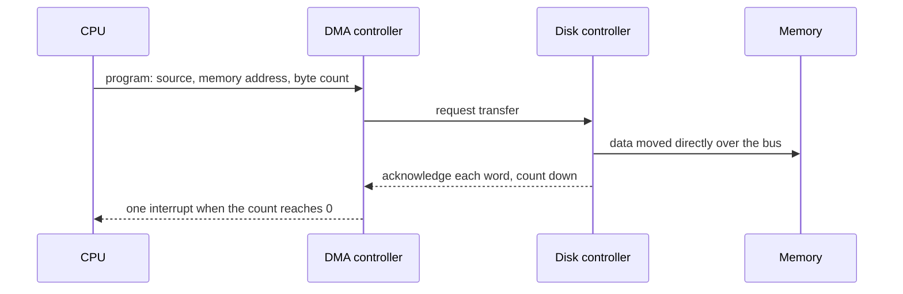

The DMA controller **steals bus cycles** (cycle stealing) from the CPU, but the CPU is free to compute in the meantime.

### Goals of I/O software
- **Device independence** — a program reads a file the same way whether it's on a hard disk, USB stick or DVD.
- **Uniform naming** — names (`/dev/sda`, `/mnt/usb/report.txt`, `C:\`) don't depend on the device.
- **Error handling** — as close to the hardware as possible (controller/driver retries a read that failed due to dust or noise).
- **Synchronous (blocking) vs asynchronous (interrupt-driven) transfers** — most physical I/O is asynchronous; the OS makes it look blocking to programs, which is easier to write.
- **Buffering** — data often must be stored temporarily.
- **Sharable vs dedicated devices** — disks can be used by many users at once; tape drives and printers must be dedicated to one user at a time.

### Layers of I/O software

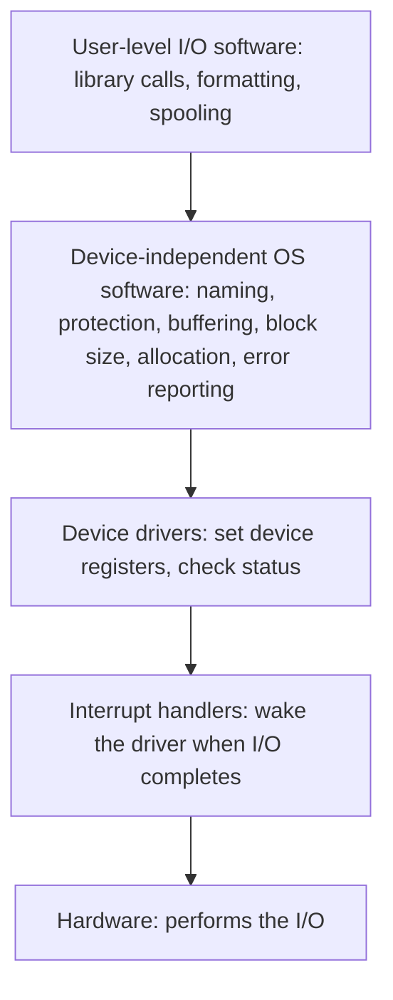

1. **Interrupt handlers** (bottom) — when I/O completes, the handler acknowledges the interrupt and **unblocks** the driver/process waiting for it.
2. **Device drivers** — accept abstract requests, write commands to the controller, block until the interrupt, check for errors, return data.
3. **Device-independent software** — uniform driver interface, **device naming**, **protection**, a device-independent block size, **buffering**, **allocating and releasing dedicated devices**, error reporting.
4. **User-level software** — library procedures (`printf`, `fwrite`) that format data and make system calls; **spooling** daemons (print spooler) that turn a dedicated device into a shared one.

Example — reading a file: the user program makes a read system call → device-independent software checks the **block cache**; if the block is there, it's returned at once → otherwise the **driver** issues the request to the hardware and the process **blocks** → the disk finishes and raises an **interrupt** → the **interrupt handler** finds which device needs attention, collects the result and **wakes** the process.

### Buffering, caching and spooling
- **Buffer** — memory holding data **in transit** between a device and an application (e.g. keystrokes that arrive before the program asks for them; half a block written by a process). **Double buffering** lets one buffer be filled while the other is emptied.
- **Cache** — a **copy** of data kept in faster memory for reuse.
- **Spooling** — holding output for a device that can serve only one job at a time (printer) in **disk files** until the device is free.

**Key points:**
- Block devices are addressable with seek; character devices are streams.
- Controller = electronics with registers; driver = device-specific OS code.
- Polling → interrupts → DMA (one interrupt per block, CPU free during transfer).
- Layers: interrupt handlers, drivers, device-independent software, user-level software.

=== Application I/O Interface: Blocking, Non-blocking and Asynchronous I/O; the Kernel I/O Subsystem
difficulty: medium
---
### Polling vs interrupts
- **Polling (busy waiting)** — the host repeatedly reads the controller's **busy bit** until it clears, then issues the command. Efficient if the device is fast and ready almost at once; wasteful if the host waits a long time.
- **Interrupts** — the device notifies the CPU when it is ready; better for slow or unpredictable devices. Interrupt controllers provide **deferral**, **vectored** dispatch and **priority levels** (with non-maskable interrupts for critical errors).

### The application I/O interface
The OS hides device differences behind a few **generic kinds of devices**, accessed through standard interfaces; device-specific code lives in **device drivers**. Devices differ along several dimensions:

| Aspect | Variation | Example |
|---|---|---|
| Data-transfer mode | character / block | terminal / disk |
| Access method | sequential / random | modem / CD-ROM |
| Transfer schedule | synchronous / asynchronous | tape / keyboard |
| Sharing | dedicated / sharable | tape / keyboard |
| Speed | latency, seek time, transfer rate | |
| I/O direction | read-only / write-only / read–write | CD-ROM / graphics controller / disk |

Interfaces offered: **block-device** interface (`read`, `write`, `seek`; or memory-mapped access), **character-stream** interface (`get`, `put` — keyboards, mice), **network sockets** (with `select()` to manage many sockets), and **clocks and timers** (current time, elapsed time, set a timer to trigger an operation — the **programmable interval timer** drives time slicing). An escape (UNIX **`ioctl()`**) passes arbitrary commands to a driver.

### Blocking, non-blocking and asynchronous I/O

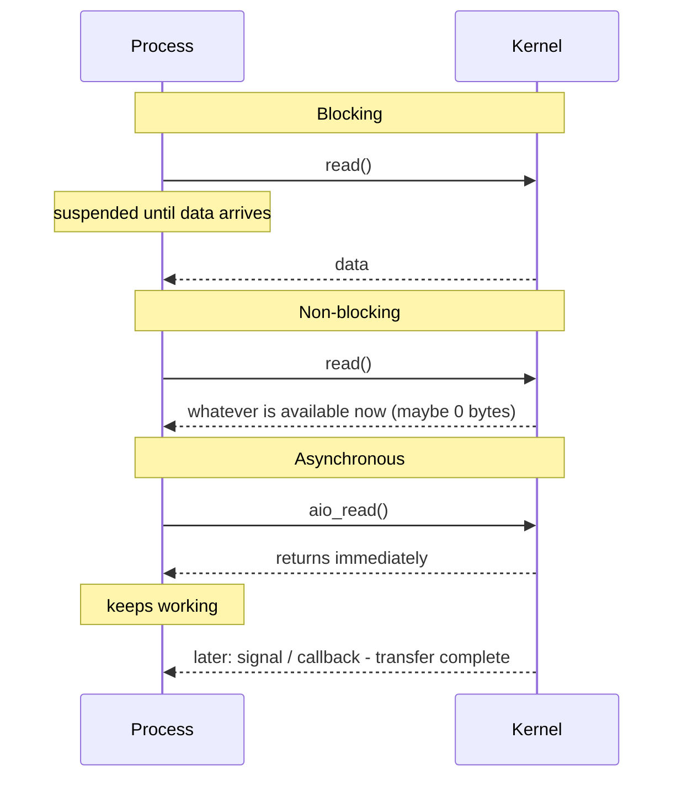

- **Blocking** — the process is suspended (moved to a wait queue) until the I/O completes. Easiest to program; most common.
- **Non-blocking** — the call returns **immediately with whatever data is available** (possibly none). Used by interactive programs (a UI reading the keyboard and mouse while processing data). Often done instead with multiple threads, each making blocking calls.
- **Asynchronous** — the call returns immediately; the **entire transfer** completes later, and the process is notified (a variable is set, a signal, a callback).
- Difference: a non-blocking `read()` returns what it can **right now**; an asynchronous `read()` requests the **whole** transfer, which finishes in the future.

### The kernel I/O subsystem
- **I/O scheduling** — reorder requests in device queues to improve overall efficiency and fairness (e.g. disk scheduling); a **device-status table** records each device's state and queue.
- **Buffering** — memory that holds data during a transfer, to cope with **speed mismatch** (a slow modem filling a buffer before one fast disk write), **transfer-size mismatch** (network packet fragmentation), and **copy semantics** (copying the application's data into a kernel buffer when `write()` is called, so later changes by the app don't affect what's written). **Double buffering** lets one buffer fill while the other is written.
- **Caching** — fast memory holding **copies** of data (a buffer may hold the only copy; a cache never does).
- **Spooling** — a buffer holding output for a device that can't accept interleaved streams (a printer): each application's output is spooled to a separate disk file and printed one at a time.
- **Device reservation** — exclusive access (`open` fails if the device is busy, or explicit allocate/deallocate) — beware deadlock.
- **Error handling** — retries for transient failures (a disk read error, a network resend); system calls return an error code (UNIX `errno`); SCSI reports a **sense key**, additional sense code and qualifier.
- **I/O protection** — all I/O instructions are **privileged**; users go through system calls; memory-mapped device and port addresses are protected from user access.
- **Kernel data structures** — open-file tables, network connections, character-device state; UNIX's file-like abstraction lets `read()` work on files, devices and sockets alike.

### From request to hardware — a blocking read
1. The process issues a blocking `read()` on a file descriptor.
2. The system-call code checks the parameters; if the data is in the **buffer cache**, it's returned at once.
3. Otherwise physical I/O is needed: the process is moved to the device's **wait queue** and the request is scheduled.
4. The driver allocates kernel buffer space and sends commands to the **device controller**.
5. The controller operates the hardware (via **DMA**, generating an interrupt when done).
6. The **interrupt handler** stores the data, signals the driver, and returns.
7. The driver identifies the completed request and signals the kernel I/O subsystem.
8. The kernel copies data to the process's address space and moves the process from the **wait queue to the ready queue**; the system call returns when the scheduler runs it.

**STREAMS** (UNIX System V) is a full-duplex channel between a driver and a user process: a **stream head**, a **driver end** and any number of **stream modules** in between, passing messages through read and write queues — a modular way to build drivers and network protocols.

### Performance
I/O is a major factor in performance: it costs CPU time in drivers, context switches for interrupts, and data copies. Improve it by reducing context switches, data copies and interrupts (larger transfers, smart controllers, polling where busy waiting is short), using DMA, moving processing into hardware, and balancing CPU, memory, bus and I/O load.

**Key points:**
- Polling suits fast devices; interrupts suit slow ones.
- Device classes: block, character, network (sockets), clocks/timers; `ioctl` for the rest.
- Blocking suspends; non-blocking returns what's available now; asynchronous returns at once and notifies on completion.
- Kernel I/O subsystem: scheduling, buffering (copy semantics, double buffering), caching, spooling, reservation, error handling, protection.

=== Disk Structure and Disk Scheduling: FCFS, SSTF, SCAN, C-SCAN, LOOK
difficulty: hard
---
### Disk structure
A magnetic disk has **platters**; each surface is divided into concentric **tracks**, each track into **sectors** (often 512 bytes or 4 KB). The set of tracks at the same arm position on all surfaces is a **cylinder**. A **read/write head** for each surface sits on a common **arm**.

- With the same number of sectors per track, inner tracks have higher bit density. Modern drives use **zoned recording** — more sectors on outer tracks.
- Disks are addressed as a linear array of **logical blocks** mapped onto sectors.

### Disk access time
```calc
Access time = Seek time + Rotational latency + Transfer time

Seek time          - move the arm to the right cylinder (usually the largest part)
Rotational latency - wait for the sector to rotate under the head
                     average = half a rotation: at 7200 RPM, 1 rotation = 60/7200 s = 8.33 ms
                     -> average rotational latency = 4.17 ms
Transfer time      - actually read/write the data
```

Since **seek time dominates**, ordering the pending requests to **reduce arm movement** improves performance. (SSDs have no moving parts — no seek time — so they usually use simple FCFS-like scheduling.)

### Disk scheduling algorithms
Standard example: cylinders 0–199, head at **53**, moving towards higher numbers; queue **98, 183, 37, 122, 14, 124, 65, 67**.

**FCFS** — serve in arrival order. Fair, but no optimization.

```calc
53 -> 98 -> 183 -> 37 -> 122 -> 14 -> 124 -> 65 -> 67
Total head movement = 640 cylinders
```

**SSTF (Shortest Seek Time First)** — always serve the request **closest** to the current head position.

```calc
53 -> 65 -> 67 -> 37 -> 14 -> 98 -> 122 -> 124 -> 183
Total = 12 + 2 + 30 + 23 + 84 + 24 + 2 + 59 = 236
```

Much better, but like SJF it can **starve** requests far from the head when new nearby requests keep arriving, and it isn't optimal.

**SCAN (elevator)** — the arm moves in one direction **to the end of the disk**, serving requests on the way, then reverses.

```calc
53 -> 65 -> 67 -> 98 -> 122 -> 124 -> 183 -> 199 (end) -> 37 -> 14
Total = (199 - 53) + (199 - 14) = 146 + 185 = 331
```

**C-SCAN (circular SCAN)** — serves requests **in one direction only**; on reaching the end the arm **returns immediately to the beginning** without serving, treating the cylinders as a circular list. Gives **more uniform waiting times** (requests at the edges don't wait twice as long).

```calc
53 -> 65 -> 67 -> 98 -> 122 -> 124 -> 183 -> 199 -> (jump to 0) -> 14 -> 37
Total = 146 + 199 (return) + 37 = 382   (some textbooks don't count the return: 183)
```

**LOOK and C-LOOK** — like SCAN and C-SCAN, but the arm goes only **as far as the last request** in each direction, not to the disk end. These are what real systems implement.

```calc
LOOK:   53 -> 65 -> 67 -> 98 -> 122 -> 124 -> 183 -> 37 -> 14
        Total = (183 - 53) + (183 - 14) = 130 + 169 = 299
C-LOOK: 53 -> 65 -> 67 -> 98 -> 122 -> 124 -> 183 -> 14 -> 37
        Total = 130 + (183 - 14) + (37 - 14) = 130 + 169 + 23 = 322
```

### The book's example
Head at 11; requests 1, 36, 16, 34, 9, 12.

```calc
FCFS:          1, 36, 16, 34, 9, 12   moves 10+35+20+18+25+3 = 111
SSTF:          12, 9, 16, 1, 34, 36   moves 1+3+7+15+33+2   = 61
Elevator (up): 12, 16, 34, 36, 9, 1   moves 1+4+18+2+27+8   = 60
```

The book's "elevator" turns around at 36 (the last request) — strictly that is **LOOK**; pure SCAN would continue to the last cylinder first.

### Comparison

| Algorithm | Idea | Starvation | Notes |
|---|---|---|---|
| FCFS | Arrival order | No | Fair, poor performance |
| SSTF | Nearest request | Yes | Good throughput |
| SCAN | Sweep to the end and back | No | Middle cylinders favoured |
| C-SCAN | Sweep one way, jump back | No | Most uniform wait |
| LOOK / C-LOOK | Turn at last request | No | Practical versions of SCAN/C-SCAN |

### RAM disks and disk caches
- A **RAM disk** uses part of main memory as a block device — instant access, but volatile.
- A **disk cache (buffer cache)** keeps recently used disk blocks in memory, managed with LRU-like replacement; it narrows the speed gap between memory and disk, just as CPU caches narrow the gap between CPU and memory.

**Key points:**
- Access time = seek + rotational latency + transfer; seek dominates.
- FCFS (fair, slow), SSTF (nearest, may starve), SCAN (to the end and back), C-SCAN (one direction, uniform), LOOK/C-LOOK (turn at last request).
- On 98,183,37,122,14,124,65,67 from 53: FCFS 640, SSTF 236.
- SSDs don't need seek optimization.

=== Mass Storage: Disk Management, Swap Space, RAID and Stable Storage
difficulty: hard
---
### Disk management
- **Low-level (physical) formatting** divides the disk into **sectors** the controller can read and write; each sector has a header and trailer with a sector number and an **error-correcting code (ECC)**, plus the data area (usually 512 bytes). Done at the factory.
- The OS then **partitions** the disk into one or more groups of cylinders, and does **logical formatting** — writing the initial file-system structures (free-space map, empty root directory). For efficiency, blocks are grouped into **clusters**. Some programs (databases) use a partition as a **raw disk** without a file system.
- **Boot block** — a tiny bootstrap loader in ROM loads the full bootstrap program from the disk's **boot blocks** (on Windows the **MBR** in the first sector, with the partition table identifying the **boot partition**).
- **Bad blocks** — disks have defective sectors. Simple disks handle them manually (`chkdsk`, marking blocks unusable in the FAT). SCSI disks keep a list of bad blocks and use **sector sparing (forwarding)**: the controller remaps a bad sector to a spare one, ideally on the same cylinder to preserve disk-scheduling optimizations; **sector slipping** shifts sectors down to free a spot next to the bad one.

### Swap-space management
Swap space is disk space used by virtual memory as an extension of main memory; because disk is far slower than memory, its management aims at **throughput**.
- It can live in the normal **file system** (an ordinary large file — easy, but slow to navigate) or in a separate **raw partition** with its own allocator optimized for speed (some internal fragmentation, but short-lived data).
- Overestimating swap space wastes disk; underestimating can force the system to abort processes or crash. Modern systems (Solaris, Linux) allocate swap space only when a page is **paged out**, not when a process is created; text (code) pages are re-read from the executable instead of being swapped.

### RAID (Redundant Arrays of Independent Disks)
Many cheap disks attached to one system improve **reliability** through **redundancy** and **performance** through **parallelism**.

**Reliability by mirroring.** With N disks, the chance that *some* disk fails is much higher than for one disk. **Mirroring** duplicates every disk; data is lost only if the second disk fails before the first is repaired.

```calc
Mean time to failure of one disk = 100,000 hours, mean time to repair = 10 hours
Mean time to data loss of a mirrored pair = 100,000^2 / (2 x 10) = 500 x 10^6 hours
                                          = about 57,000 years
(assuming independent failures - power failures, disasters and manufacturing
 defects make failures correlated, so the real figure is lower)
```

**Performance by striping.** Mirroring doubles the number of reads served per second. **Striping** splits data across disks: **bit-level striping** writes bit *i* of each byte to disk *i*; **block-level striping** (most common) puts block *i* of a file on disk (*i* mod *n*) + 1. Goals: increase throughput of many small accesses (load balancing) and reduce response time of large accesses.

**RAID levels**

| Level | Scheme | Redundancy | Notes |
|---|---|---|---|
| **0** | Block striping, **no redundancy** | None | Fastest, but one failure loses data |
| **1** | **Mirroring** | Full copy | Doubles disks; fast reads; simple rebuild |
| **2** | Memory-style **ECC** (Hamming) across disks | ECC bits | 3 overhead disks for 4 data disks; not used today |
| **3** | **Bit-interleaved parity** — one parity disk | Parity | Controllers detect the bad sector, so 1 parity bit corrects it; each disk takes part in every I/O |
| **4** | **Block-interleaved parity** — one parity disk | Parity | Small reads hit one disk; every write updates the parity disk (bottleneck) |
| **5** | **Block-interleaved distributed parity** | Parity spread over all disks | Avoids the parity-disk bottleneck; the most common parity RAID |
| **6** | **P + Q redundancy** (Reed-Solomon codes) | 2 redundant blocks per stripe | Survives **two** disk failures |
| **0 + 1** | Stripe, then mirror the stripe | Mirror | One failure makes a whole stripe unavailable |
| **1 + 0** | Mirror pairs, then stripe the pairs | Mirror | One failure loses only one disk; mirror still serves |

How parity rebuilds a lost block — **XOR** of the surviving blocks:

```calc
data blocks   D1 = 1011   D2 = 0110   D3 = 1100
parity        P  = D1 xor D2 xor D3 = 0001
disk 2 fails: D2 = P xor D1 xor D3 = 0001 xor 1011 xor 1100 = 0110   (recovered)

Usable capacity with four 1 TB disks:
RAID 0: 4 TB   RAID 1 (mirrored pairs): 2 TB   RAID 5: 3 TB   RAID 6: 2 TB   RAID 1+0: 2 TB
```

Parity RAID's costs: computing and writing parity (a small write needs read-modify-write of data and parity — four I/Os), and slow **rebuilds**. Choosing a level: RAID 0 for speed where data loss is acceptable; RAID 1 for high reliability with fast recovery; RAID 1+0 for performance + reliability (databases); RAID 5 for large volumes of data with moderate write load; RAID 6 when two failures must be survived. **Hot spares** — idle disks that automatically replace a failed one.

RAID can be implemented in kernel software, in the host bus adapter, in the storage array, or in the SAN interconnect. It protects against disk failures, **not** against software bugs, wrong writes or deleted files — backups are still needed.

### Disk attachment and stable storage
- **Host-attached storage** — via local I/O ports (SATA, SCSI, Fibre Channel).
- **NAS (network-attached storage)** — a storage system accessed remotely over the data network with RPC-based protocols (**NFS**, **CIFS**).
- **SAN (storage-area network)** — a private network (often Fibre Channel) connecting servers and storage units, so storage can be allocated flexibly to hosts.
- **Stable storage** — information never lost: keep two physical copies; write the first block, then (only after success) the second; after a failure, compare the copies and repair from the good one.

**Key points:**
- Low-level formatting creates sectors with ECC; partitions + logical formatting create file systems; boot block loads the OS; bad sectors are spared or slipped.
- Swap space lives in a file or raw partition; allocated on page-out.
- Mirroring gives huge reliability (about 57,000 years MTTDL in the book's example); striping gives speed.
- RAID 0 stripe, 1 mirror, 5 distributed parity, 6 double redundancy, 1+0 mirror-then-stripe; parity = XOR.

=== Files: Attributes, Operations, Types and Access Methods
difficulty: easy
---
A process could keep information in its own address space, but that has three problems: the space is **limited** to the virtual address space, the information is **lost when the process ends**, and other processes **cannot access** it. The solution is to store information on secondary storage in units called **files**, managed by the OS's **file system**.

A **file** is a **named collection of related information**, stored on secondary storage, that the OS presents as a **uniform logical storage unit**, independent of the physical device. Files store programs and data (numeric, text, binary), and are **persistent** — they survive power failures and reboots.

### File naming
A name is assigned when the file is created and used afterwards by any process. Typical names have a **base name and an extension** separated by a period (`report.docx`, `prog.c`). The extension indicates the **type** and, on Windows, which program opens it; on UNIX it is only a convention. UNIX file names are **case-sensitive**; MS-DOS/Windows names are not.

### File structure
1. **Byte sequence** — an unstructured sequence of bytes; meaning is up to the programs. Maximum flexibility — used by **UNIX and Windows**.
2. **Record sequence** — a sequence of fixed-length records; reads and writes work on whole records (old mainframes, punched-card era).
3. **Tree** — variable-length records, each with a **key** in a fixed position, kept sorted in a tree for fast key lookup (some mainframe systems).

### File types (UNIX)
- **Regular files** — ordinary user data: **ASCII text** or **binary** (executables, images, archives).
- **Directories** — system files that hold the structure of the file system (`.` = this directory, `..` = parent).
- **Character special files** — model serial I/O devices (terminals, printers); unbuffered (e.g. `/dev/tty`, raw disks `/dev/rsd0a`).
- **Block special files** — model block devices such as disks; the kernel buffers I/O for them (e.g. `/dev/sda`).
- Also **symbolic links**, **named pipes (FIFOs)** and **sockets**.

### File attributes (metadata)
| Attribute | Meaning |
|---|---|
| Name, identifier | Human-readable name; internal unique ID (e.g. inode number) |
| Type, location | File type; pointer to its blocks on the device |
| Size / maximum size | Current size in bytes; allowed maximum |
| Protection | Who may read, write, execute |
| Owner, creator | Current owner; user who created it |
| Time stamps | Creation, last access, last modification |
| Flags | Read-only, hidden, system, archive (needs backup), temporary, lock |
| Record length, key position/length | For record-structured files |

### File operations (system calls)
- **create** — make a new empty file and its directory entry; **delete** — remove it and free its space.
- **open** — look the file up **once**, load its attributes and disk addresses into memory, and return a **file descriptor/handle** used in later calls; **close** — release those internal tables.
- **read / write** — transfer data at the **current file position**; write may extend the file or overwrite.
- **append** — write only at the end; **seek (reposition)** — move the current position (needed for random access).
- **truncate** — erase the contents but keep the attributes; **get/set attributes**, **rename**, **copy**.

The OS keeps an **open-file table**: a system-wide table (one entry per open file, with an **open count**) and a per-process table (each with its own **current position** and access mode). Opening once avoids searching the directory on every read and write.

### Access methods
- **Sequential access** — read/write bytes or records **in order** from the beginning (like a tape); can only rewind or skip. Used by editors, compilers.
- **Direct (random/relative) access** — read/write any block **in any order** by block number or key; made possible by disks; essential for **databases**.
- **Indexed access** — an **index** maps keys to block addresses (an index file pointing into the data file); for large files, multi-level indexes (ISAM).

**Key points:**
- Files give persistent, shareable, large storage outside process address spaces.
- Structures: byte sequence (UNIX/Windows), records, tree.
- UNIX types: regular, directory, character special, block special.
- open() caches attributes and returns a descriptor; access is sequential, direct or indexed.

=== Directories, Path Names and Links
difficulty: medium
---
A **directory** (folder) is a structure that **maps file names to files** — each entry holds a name and either the attributes and location of the file or a pointer to them (an inode number). Directories are themselves files owned by the OS. Directory design goals: **efficiency** (find files fast), **naming convenience** (different users can use the same names) and **grouping** (logical organization).

### Directory structures
**1. Single-level directory** — all files of all users in **one** directory.
- Simple and fast to search.
- **All names must be unique** — with many files or many users, name clashes occur and a new file with an existing name overwrites the old one.

**2. Two-level directory** — a **master file directory** holds one **user file directory** per user.
- Different users can use the same file names; searching is limited to the user's own directory.
- **Isolates** users — awkward when they need to share files; still no grouping within a user's files.

**3. Tree-structured (hierarchical) directory** — directories can contain files **and subdirectories** to any depth, with one **root**. Used by all modern OSs.
- Efficient searching and **logical grouping**; users create their own subdirectories.
- Each process has a **current (working) directory**; files there can be named directly.

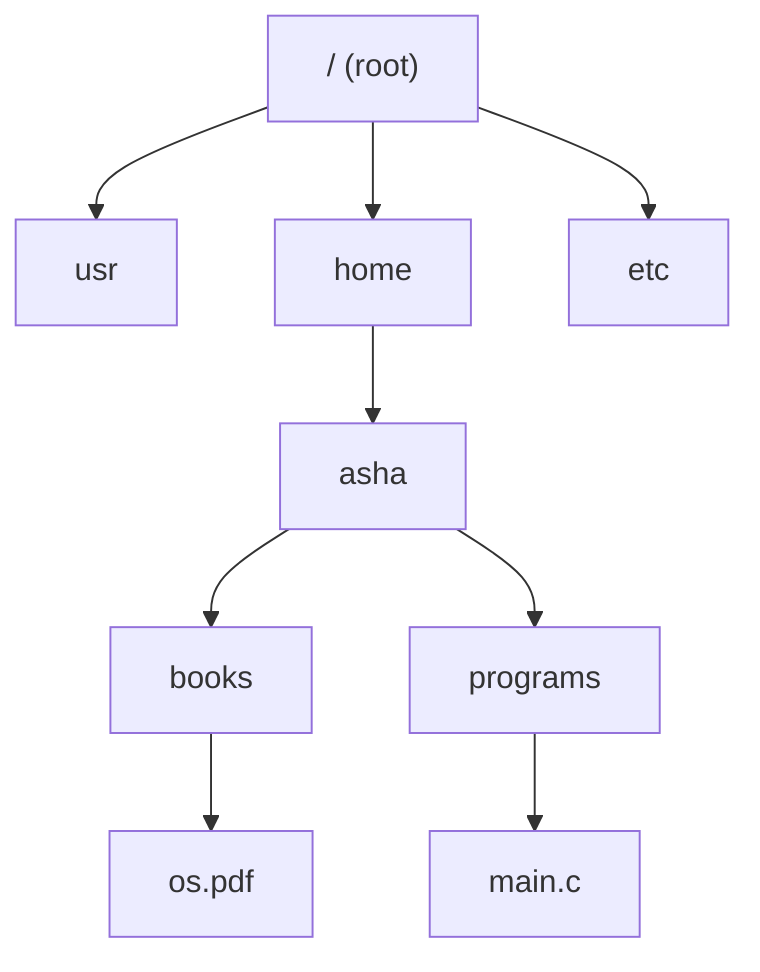

**4. Acyclic-graph directory** — a tree plus **links**, so the same file or subdirectory can appear in several directories (sharing) — but **no cycles**.

**5. General graph** — cycles allowed; requires care during traversal and garbage collection.

### Path names
- **Absolute path** — starts at the **root** and lists every directory on the way: `/home/asha/books/os.pdf` (UNIX, separator `/`) or `C:\Users\asha\books\os.pdf` (Windows, separator `\`). Always unique.
- **Relative path** — relative to the **current directory**: if the working directory is `/home/asha`, the same file is `books/os.pdf`; `..` refers to the parent (`../ravi/notes.txt`).

### Directory operations
create (`mkdir`), delete (`rmdir` — only if empty, apart from `.` and `..`), **opendir / readdir / closedir** (list entries), rename, **link**, **unlink**, search.

### Hard links vs symbolic (soft) links

| Hard link | Symbolic (soft) link |
|---|---|
| A second directory entry pointing to the **same inode** | A small special file containing the **path name** of the target |
| `ln file link` / `link()` | `ln -s file link` / `symlink()` |
| Indistinguishable from the original name | Recognizably a link |
| Only within **one file system**; usually not to directories | Can cross file systems and point to directories, even across a network |
| File deleted only when the **link count** drops to 0 | If the target is deleted, the link **dangles** (broken) |
| No extra inode | Needs its own inode; following it costs extra disk accesses |

`unlink()` (used by `rm`) removes one directory entry; the file's data is freed only when no hard links (and no open descriptors) remain.

**Key points:**
- Single-level (name clashes), two-level (per-user, poor sharing), tree (grouping, paths), acyclic graph (sharing via links).
- Absolute paths start at the root; relative paths start at the current directory.
- Hard link = another name for the same inode, same file system only.
- Soft link = file containing a path; can cross file systems; may dangle.

=== File System Implementation: Layout, Allocation Methods and Inodes
difficulty: hard
---
### Layered file-system design

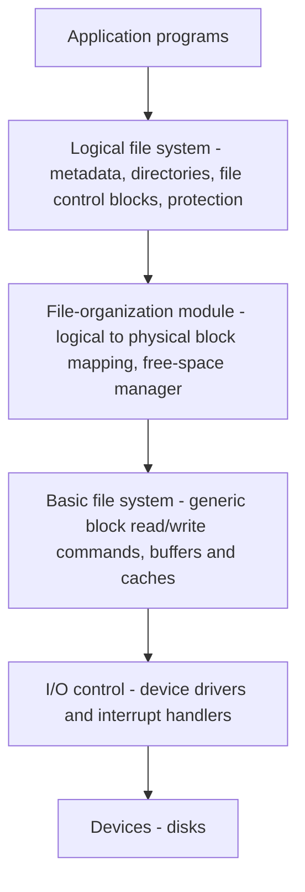

Each layer uses the one below it. Layering lets several file systems share the lower layers (less duplicated code) at the cost of some performance overhead. Creating a file: the application calls the **logical file system**, which allocates a new **file control block (FCB / inode)**, reads the directory into memory, adds the entry and writes it back; the file-organization module maps everything to disk blocks.

### On-disk layout
```calc
| MBR + partition table | Partition 1 | Partition 2 | ... |
                         |
                         v
  | Boot block | Superblock | Free-space mgmt | Inodes | Root dir | Files and directories |
```

- **Master Boot Record (MBR)** — **sector 0** of the disk; contains the boot code and, at its end, the **partition table** (start and end of each partition). At boot, the BIOS runs the MBR, which finds the **active partition** and runs its **boot block** (partition boot sector in Windows). Modern systems use **UEFI + GPT** instead.
- **Boot block** — code to load the OS from that partition.
- **Superblock (volume control block)** — key parameters of the file system: number and size of blocks, free-block count, inode count; read into memory at boot or first use.
- **Free-space management** structures (bitmap or list), the **inodes**, the **root directory**, then files and directories.

### Allocation methods
**1. Contiguous allocation** — each file occupies **consecutive blocks**; the directory stores the **start block and length**.
- **+** Simple; **excellent performance** — the whole file can be read with one seek; supports direct access (block i is at start + i).
- **−** **External fragmentation**; must know the file's final size at creation; files **can't grow** if the next block is taken (the whole file must be copied elsewhere). Good for read-only media (CD-ROM, DVD).

**2. Linked allocation** — each file is a **linked list of blocks** scattered anywhere; each block holds a pointer to the next; the directory stores the first (and last) block.
- **+** No external fragmentation; files grow easily.
- **−** **Only efficient for sequential access** — reaching block i requires reading i blocks; pointers waste space in every block; **one damaged pointer loses the rest of the file**.

**File Allocation Table (FAT)** — a variant that moves all the next-pointers into a **table in memory**, one entry per disk block. Used by MS-DOS and FAT12/16/32 (USB drives, SD cards).
- **+** Whole blocks hold data; random access only follows pointers **in memory**, not on disk.
- **−** The table must be in memory and its size is **proportional to the disk** — a 1 GB disk with 4 KB clusters needs 262,144 entries.

**3. Indexed allocation (inodes)** — each file has an **index node (inode)** listing its **attributes and the addresses of its blocks**. The inode is loaded into memory **only while the file is open**, so memory needed is proportional to the number of **open files**, not to the disk size.

The UNIX inode handles both small and huge files with **direct and indirect** pointers:

```calc
Inode: attributes + 12 direct block pointers + 1 single + 1 double + 1 triple indirect
Block size 4 KB, pointer 4 bytes -> 1024 pointers per block

12 direct blocks           = 12 x 4 KB           = 48 KB
single indirect: 1024 blks = 1024 x 4 KB         = 4 MB
double indirect: 1024^2    = 1,048,576 x 4 KB    = 4 GB
triple indirect: 1024^3    x 4 KB                = 4 TB
Small files need no indirect blocks; huge files use more levels.
```

The number of inodes is fixed when the file system is created, which caps the number of files (including directories, special files and links).

| Method | Direct access | Fragmentation | Growth | Used by |
|---|---|---|---|---|
| Contiguous | Fast | External | Hard | CD-ROM, early systems |
| Linked | Slow (sequential) | None | Easy | — |
| FAT | Via in-memory table | None | Easy | MS-DOS, FAT32 |
| Indexed / inode | Fast | None | Easy | UNIX/Linux (ext4), NTFS (MFT) |

### Directory implementation
- **Linear list** of (name, pointer) entries — simple, but **searching is linear** (slow for big directories); creating a file requires checking that the name doesn't exist.
- **Hash table** — hash the file name to find the entry quickly (collisions chained in linked lists); faster lookups, more complex management. Caching recent lookups also helps.
- Long, variable-length names: fixed-size entries with a length limit (wasteful), variable-size entries, or fixed entries with names kept in a **heap** at the end of the directory.
- Attributes are stored either **in the directory entry** (MS-DOS) or **in the inode** with the entry holding only name + inode number (UNIX).

### Free-space management
**Bitmap (bit vector)** — one bit per block; e.g. 1 = free, 0 = allocated. Compact and fast to search for runs of free blocks with bit operations; but must be kept in memory for speed.

```calc
1 TB disk, 4 KB blocks -> 2^40 / 2^12 = 2^28 blocks -> 2^28 bits = 32 MB of bitmap
```

**Linked list** — free blocks are linked together, with a pointer to the first one kept on disk (and cached). No wasted space, but traversing it means disk I/O. Variants: **grouping** (the first free block stores addresses of n free blocks) and **counting** (store start + count of runs of free blocks). FAT's table handles free space too.

### Disk quotas
Multi-user systems limit how many **blocks and files** each user may own. When a file is opened, the owner's quota record is loaded into an in-memory table; every block added to the file is charged to the owner, and the request fails once the **hard limit** is exceeded (a **soft limit** only warns).

### File sharing
- **Links** (symbolic links, hard links) let one file appear in several directories — changes are seen by everyone since there is one file. Symbolic links can even point across a network; their drawbacks are extra lookups and multiple paths to one file.
- **Duplicating directory entries** (copying the block addresses into both directories) causes **consistency problems** — if one user appends blocks, the other entry doesn't know.
- With **copies**, each user changes only their own copy.

**Key points:**
- Layers: logical FS, file-organization module, basic FS, I/O control, devices.
- MBR (sector 0) + partition table → boot block, superblock, free-space structures, inodes.
- Contiguous (fast, fragmentation), linked (sequential only), FAT (table in memory), inode (index; direct + single/double/triple indirect).
- Free space: bitmap or linked list; directories: linear list or hash table.

=== File System Reliability and Performance: Backups, Consistency and Caching
difficulty: medium
---
Losing a computer is annoying; losing its **files** can be catastrophic. Files are damaged by hardware failures, OS bugs, user errors, and malware, so the file system must protect data from **logical** damage and help recover.

### Backups
Backups (to tape, external disks or the cloud) recover from **disasters** and from **user mistakes** (accidentally deleted files).
- Back up only what can't be recovered otherwise — not program files that can be reinstalled, nor temporary files.
- **Full backup** — everything, periodically (e.g. weekly).
- **Incremental backup (dump)** — only files **changed since the last backup** (daily). Faster and smaller, but **restore** is more complex: restore the most recent full backup, then apply the incremental backups **in order** (oldest to newest).
- **Differential backup** — changes since the last **full** backup (restore = full + latest differential).
- Compress backups; store copies **off-site** (a fire destroys the computer and the tapes next to it); taking backups of an **active** file system can capture an inconsistent state — use snapshots.

**Physical dump** — copies **every block** from 0 to the end. Simple and very fast, but copies unused blocks too (and must skip bad blocks), can't skip directories, can't do incremental dumps, and can't restore single files easily.

**Logical dump** — starts at chosen directories and recursively copies files and directories **changed since a given date** — the most common form. Points to handle: the **free-block list** is not dumped and must be rebuilt after restore; files with several **links** must be restored only once; **sparse files** with holes shouldn't have the holes written out.

### File-system consistency
If the system crashes after modifying blocks in memory but before writing them, the file system becomes **inconsistent** — worst of all when the lost block is an inode, a directory or the free list. Consistency checkers run at boot: **fsck** (UNIX) and **chkdsk / scandisk** (Windows).

**Block consistency** — build two tables of counters, one per block:
- *in-use* counts: how many times each block appears in a file (from all inodes);
- *free* counts: how many times it appears in the free list/bitmap.

```calc
Block number : 0 1 2 3 4 5
In use       : 1 1 0 1 0 2
Free         : 0 0 1 0 0 0
Block 0,1,3  : in use once, not free          -> consistent
Block 2      : free once                       -> consistent
Block 4      : in neither table -> MISSING block   -> add it to the free list
Block 5      : in two files     -> DUPLICATE block -> copy it so each file has its own
(A block free twice -> rebuild the free list; in use AND free -> remove from free list)
```

**File consistency** — walk the directory tree from the root counting how many directory entries refer to each inode, and compare with the **link count** stored in the inode. If the stored count is too **high**, the file is never freed (wasted space); if too **low**, the file would be freed while still referenced (dangerous) — fix the count.

**Journaling (log-structured metadata updates)** — modern file systems (ext4, NTFS, APFS, XFS) first write intended changes to a **journal**; after a crash they replay or discard incomplete transactions, so recovery takes seconds instead of a full fsck.

### File-system performance
Disk access is millions of times slower than memory, so file systems optimize:
- **Block (buffer) cache** — keep recently used blocks in memory; check the cache before every read; find blocks via a hash of (device, block number); replace with LRU-like policies. Modern OSs use a **unified page cache** for file data and virtual memory. Critical blocks (inodes, directories) should be **written through** quickly for consistency (UNIX `sync` flushes every 30 s).
- **Block read-ahead** — when block k of a sequentially read file is requested, also fetch **k + 1** into the cache before it is asked for. Great for sequential access; wastes bandwidth for random access.
- **Reducing disk-arm motion** — place blocks likely to be accessed together (a file's blocks, its inode and its directory) **close together**, e.g. in the same cylinder group; **defragment** disks with contiguous-ish allocation.

**Key points:**
- Full + incremental backups; restore full first, then incrementals in order; keep copies off-site.
- Physical dump copies every block; logical dump copies changed files recursively.
- fsck/chkdsk compare in-use and free counts per block and link counts per inode; journaling speeds recovery.
- Performance: buffer cache, read-ahead, placing related blocks together.

=== File-System Mounting, Sharing, NFS and Log-Structured Recovery
difficulty: medium
---
### Mounting
A file system must be **mounted** before processes can use it. The OS is given the **device name** and a **mount point** — the location in the directory tree (usually an empty directory) where the new file system will be attached. It verifies that the device holds a valid file system (reading its directory structure and checking the format) and records the mount in its **mount table**.

```calc
Before:  /users is an empty directory on the root file system
mount /dev/sdb1 /users
After:   /users/asha, /users/ravi ... now come from the disk /dev/sdb1
```

Windows traditionally gives each volume a **drive letter** (`C:`, `F:`); UNIX and macOS mount file systems anywhere in a single tree (macOS mounts new disks under `/Volumes`).

### File sharing
On a multiuser system, files are shared under the control of **owner** and **group** attributes — the owner can change attributes and grant access; group members get a subset of the owner's rights (UNIX's `rwx` for owner/group/others).

**Consistency semantics** specify when one user's modifications become visible to others sharing the file:
- **UNIX semantics** — writes are **immediately visible** to all users with the file open; users may even share the file pointer.
- **Session semantics** (Andrew File System) — writes are visible only to sessions that **open the file after it is closed**; each user works on their own image.
- **Immutable-shared-files semantics** — once a file is declared shared it **cannot be modified**.

### Remote file systems
Methods have evolved from manual transfer (FTP), to **distributed file systems** that make remote directories visible locally, to the WWW.
- **Client–server model** — the **server** exports file systems; **clients** mount them. Clients are identified by IP address or authenticated with keys/Kerberos; users must have matching IDs on both sides.
- **Distributed information systems** (DNS, NIS, LDAP, Active Directory) provide unified naming and authentication.
- **Failure modes** — local failures (disk crash, corrupted metadata) plus network and server failures. **Stateless** protocols (NFS v3) let a client simply retry after a server restart; **stateful** ones must recover state.

### NFS (Network File System)
Sun's NFS lets a set of interconnected, independent machines share file systems **transparently**:
- A remote directory is **mounted** over a local directory; the mounted directory looks like an integral subtree. Mounts can be **cascading** (mount on top of a mounted file system).
- The **mount protocol** handles exporting and mounting (the server's export list says which file systems can be mounted and by whom).
- The **NFS protocol** provides RPCs for remote file operations: search for a file in a directory, read directory entries, manipulate links and directories, access file attributes, read and write files. Servers are **stateless** (each request carries all needed information, e.g. the file handle and the absolute offset); modified data must be committed to the server's disk before results return.
- In the client, the **Virtual File System (VFS)** layer separates generic file operations from their implementation: a **vnode** represents each file, and VFS dispatches to the local file system or to the NFS client.
- Path-name translation is done **component by component** (each lookup may cross a mount point), with a **directory-name-lookup cache** to speed it up.

### Consistency checking, backups and log-structured recovery
- **Consistency checker** (`fsck`, `chkdsk`) compares directory structure with data blocks and fixes inconsistencies after a crash — slow on large disks.
- **Backup and restore** — full backups plus incremental ones (a typical cycle: day 1 full, days 2–N incremental since the previous day, then repeat).
- **Log-structured (journaling) file systems** apply database **log-based recovery** to metadata: each metadata update is written **sequentially to a log** as a **transaction**; once written to the log it is **committed**, and the system call can return. Log entries are then **replayed** onto the actual file-system structures and removed as they complete. After a crash, committed but unapplied transactions in the log are completed; uncommitted ones are undone — so the file system is consistent without a full scan. Sequential log writes are also faster than random metadata writes. (Examples: NTFS, ext3/ext4, XFS, JFS.)
- **WAFL** (NetApp's Write-Anywhere File Layout) never overwrites blocks in place; it writes new data to free blocks and can take **snapshots** (read-only copies of the file system at an instant) cheaply by keeping the old root.

**Key points:**
- Mounting attaches a file system at a mount point and records it in the mount table.
- Consistency semantics: UNIX (immediate), session (on close/open), immutable shared files.
- NFS: mount protocol + stateless NFS RPC protocol; VFS/vnodes make remote files transparent.
- Journaling writes metadata changes to a log first, so crash recovery replays/undoes transactions instead of running fsck.

=== Computer Security: Goals, Threats, Intruders and Malware
difficulty: medium
---
**Security** is about protecting the computer system's resources (hardware, software, data) against **unauthorized access, malicious destruction or alteration, and accidental introduction of inconsistency**. A system is **secure** if its resources are used and accessed as intended under all circumstances. **Protection** (next topic) is the set of **internal mechanisms** that control access by processes and users.

### Key terms
| Term | Meaning |
|---|---|
| **Threat** | A potential event that could harm the system |
| **Vulnerability** | A weakness that a threat could exploit |
| **Attack** | An attempt to break security — a threat carried out |
| **Intruder** | Person or program carrying out unauthorized activity |
| **Cryptography** | Hiding the content of messages |
| **Authentication** | Verifying identity |
| **Access control** | Defining what each user may do with each resource |

### Security goals (CIA triad) and the threats against them

| Goal | Means | Threat |
|---|---|---|
| **Confidentiality** | Data is seen only by authorized parties | **Exposure / disclosure** (eavesdropping, data theft) |
| **Integrity** | Data is changed only by authorized parties | **Tampering / alteration** |
| **Availability** | The system is usable when needed | **Denial of service (DoS)** |

Often added: **authentication** and **non-repudiation** (the sender can't deny sending).

### Intruders
- **Passive intruders** only **read/listen** (eavesdropping) — threaten confidentiality.
- **Active intruders** try to **modify** data or disrupt the system — more dangerous.
Common motives (from the book): **casual prying** by non-technical users, **snooping** by skilled insiders testing their ability, **making money** (e.g. fraud on financial data), **commercial or military espionage**.

### Accidental data loss
Often more damage is done by accidents than by intruders:
- **Acts of nature** — fire, flood, earthquake, rats chewing tapes.
- **Hardware/software errors** — CPU malfunction, unreadable disks, bugs.
- **Human errors** — wrong data entry, running the wrong program, losing or mounting the wrong disk.
The main defence: **regular, adequate backups kept far from the originals**.

### Inside attacks (by someone already on the system)
- **Trojan horse** — an apparently useful program (a game, a free tool) with **hidden malicious code** that runs with the user's privileges (modifying, deleting or sending the user's files to the attacker).
- **Login spoofing** — a **fake login screen** that captures the user's name and password, then exits to the real login screen; the user thinks they mistyped. Defence: a key sequence user programs can't catch, like Windows' **Ctrl+Alt+Del**.
- **Logic bomb** — code planted by an insider that **"explodes"** when a condition is met (a date, or the programmer's name disappearing from the payroll).
- **Trap door (back door)** — a **secret entry point** left by a programmer that bypasses normal checks (e.g. a special login name that always succeeds). Code reviews help.
- **Buffer overflow** — exploits code that doesn't check array bounds: the attacker sends **more data than the buffer holds**, overwriting the stack — including the **return address** — so the function "returns" into the attacker's code. Defences: bounds checking (`strncpy`, `fgets` instead of `gets`), stack canaries, non-executable stack (NX), ASLR.

```c
void greet(void) {
    char name[16];
    gets(name);          /* no length check: input longer than 16 bytes */
    printf("Hi %s\n", name);  /* overwrites the saved return address */
}
```

### Outside attacks (malicious code from outside, usually via the network)
- **Virus** — a program fragment that **attaches itself to another program** (host) and replicates when the host runs; usually spread through infected files, email attachments, appealing free software. It may stay dormant until triggered, then damage files or the system. Types include file infectors, boot-sector viruses, macro viruses, polymorphic viruses (change their code to evade detection).
- **Worm** — a **standalone** program that **replicates itself over the network** without needing a host program (email, remote execution, remote login), consuming resources and causing damage (the 1988 Morris worm).
- **Mobile code** — code downloaded and run from remote sites (applets, scripts) — needs sandboxing.
- Others: **spyware**, **ransomware** (encrypts files and demands payment), **rootkits** (hide malware deep in the OS), **botnets** of zombie machines used for **DDoS**.

### Virus vs worm vs Trojan horse

| | Virus | Worm | Trojan horse |
|---|---|---|---|
| Needs a host program? | Yes | No | Disguised as a useful program |
| Self-replicates? | Yes (when host runs) | Yes, by itself over networks | No |
| Spreads by | Infected files, user action | Network vulnerabilities | User installing it |

**Defences against malware:** antivirus software (**signature scanning** of executables against known virus definitions, **heuristic/behaviour** detection, integrity checking), keeping systems patched, firewalls, least privilege, not running untrusted code, sandboxes, and backups.

**Key points:**
- Security goals: confidentiality, integrity, availability (vs exposure, tampering, denial of service).
- Passive intruders read; active intruders modify.
- Inside attacks: Trojan horse, login spoofing, logic bomb, trap door, buffer overflow.
- Virus needs a host; a worm spreads by itself; a Trojan pretends to be useful.

=== Protection: Design Principles, Cryptography, Authentication and Access Control
difficulty: hard
---
### Security design principles (Saltzer and Schroeder)
- **Least privilege** — every user and process gets only the minimum rights needed; the default is **no access**.
- **Economy of mechanism** — keep security mechanisms small and simple so they can be verified; build them into the design, not as an afterthought.
- **Acceptability (psychological acceptability)** — mechanisms must be easy to use, or users will bypass them.
- **Complete mediation** — check **every** access, including during backup and maintenance.
- **Open design** — security must not depend on keeping the design secret (no "security by obscurity"); public designs get reviewed and improved.
- Also: **fail-safe defaults**, **separation of privilege** (e.g. two keys), **defence in depth**.

### Cryptography
**Encryption** transforms **plaintext** P into **ciphertext** C with an algorithm E and a key; **decryption** reverses it with algorithm D and a key:

```calc
C = E(P, Ke)        P = D(C, Kd)
Algorithms are public; only the KEYS are secret (Kerckhoffs's principle).
```

A good scheme is easy for authorized users, depends only on the secrecy of the **key**, and makes the key extremely hard for an intruder to find.

**Symmetric (secret-key) cryptography** — the **same key** encrypts and decrypts (Ke = Kd).
- Classical techniques: **substitution** (replace each letter by another, e.g. Caesar cipher with shift 3: `ATTACK → DWWDFN`) and **transposition** (rearrange letter positions); **DES** combines both in many rounds; **AES** is today's standard.
- **+** Fast — good for bulk data. **−** The key must be **shared securely** in advance — hard when the parties are far apart; n users need n(n−1)/2 keys.

**Asymmetric (public-key) cryptography** — each user has a **key pair**: a **public key** (published) and a **private key** (kept secret).
- **Confidentiality:** encrypt with the **receiver's public key**; only the receiver's **private key** decrypts.
- **Digital signature:** sign with the **sender's private key**; anyone verifies with the sender's public key (authenticity, integrity, non-repudiation).
- **RSA** (based on the difficulty of factoring large numbers) is the best-known; also elliptic-curve cryptography.
- **+** Solves key distribution. **−** Much slower — so in practice (TLS/HTTPS) public-key crypto exchanges a **session key**, and symmetric crypto encrypts the data.

**Hash functions** (SHA-256) produce a fixed-size digest; any change to the data changes the digest — used for integrity checks and password storage.

### User authentication
Verifying **who** the user is, usually at login. Based on:
1. **Something the user knows** — password, PIN, answers to secret questions.
2. **Something the user has** — smart card, ATM card, token, phone (OTP).
3. **Something the user is** — **biometrics**: fingerprint, retina/iris, face, voice, signature dynamics, typing rhythm.
4. **Something about the context** — location, IP address, time of day, recognized device (adaptive/risk-based authentication).
Combining two or more factors = **multi-factor (two-factor) authentication**.

**Passwords** — the oldest and most common method. The system stores not the password but **(user ID, f(password))**, where f is a **one-way hash**; at login it hashes the typed password and compares. A random **salt** is added per user so identical passwords have different hashes and precomputed tables don't work. Passwords aren't echoed (Windows shows dots, Linux shows nothing).

Attacks on passwords:
- **Guessing / dictionary attacks** — trying common words, names, birthdays; **brute force** tries every combination (short passwords fall quickly).
- **Social engineering** — tricking someone into revealing it ("this is IT support...").
- **Sniffing** — capturing passwords sent unencrypted over the network (fix: encryption).
- **Trojan login / keyloggers** — capturing keystrokes.
- **Replay** — resending captured (even encrypted) credentials.

Improving password security: long passwords mixing upper/lower case, digits and symbols; screening out weak passwords; limiting failed attempts; periodic change or **one-time passwords**; **challenge–response** (the system sends a random challenge, the user/device returns f(challenge) computed with a secret — the secret itself never travels).

**Biometrics** — an **enrollment** phase measures and stores the characteristic; the **identification** phase measures again and compares. The feature must be **distinctive** and **stable** over time (hair colour or voice under a cold are poor choices). Costly; false accepts/rejects possible; a stolen fingerprint can't be changed.

**Physical objects** — smart cards with a CPU and memory, ATM cards with a PIN, hardware tokens.

### Access control
The **access matrix** has a row per **subject** (user/process/domain), a column per **object** (file, device, segment), and each cell lists the allowed **rights** (read, write, execute, own...).

```calc
            File1          File2               File3
Diane       read,execute   read,write,execute  -
Katie       read,execute   read                -
John        read,execute   -                   read,write
```

The matrix is sparse, so it is stored either by columns or by rows:
- **Access Control List (ACL)** — **per object** (column): the list of subjects and their rights. Easy to see/revoke who can access an object; hard to list everything one user can access. UNIX permissions (owner/group/others × rwx) are a compressed ACL; Windows NTFS has full ACLs.
- **Capability list** — **per subject** (row): unforgeable tickets naming objects and rights the subject holds. Easy to see what a user can do and to pass rights along; hard to revoke access to an object or to find all its users.

### Access-control models
- **Discretionary Access Control (DAC)** — the **owner** decides who gets access (UNIX permissions, ACLs). Flexible, but users can give away access (and Trojan horses act with the user's rights).
- **Mandatory Access Control (MAC)** — the **system** enforces access based on **security labels/clearances** (Top secret, Secret, Confidential...); users **cannot change** the rules. Used in military/government systems. **Bell–LaPadula** model protects confidentiality ("no read up, no write down"); **Biba** protects integrity. SELinux implements MAC on Linux.
- **Role-Based Access Control (RBAC)** — rights are attached to **roles** (doctor, nurse, clerk); users get roles. Matches organizations; supports separation of duties and least privilege; easy to administer.

### Hardware protection rings
CPUs provide privilege levels: **ring 0** (kernel, most privileged) to **ring 3** (user applications). Code in an outer ring can enter an inner ring only through controlled gates (system calls), which is how dual-mode operation is implemented.

**Key points:**
- Principles: least privilege, economy of mechanism, complete mediation, open design, acceptability.
- Symmetric crypto (one shared key, fast — DES/AES) vs public-key (key pair, slower — RSA); used together in practice.
- Authentication: knows / has / is / context; store salted password hashes.
- Access matrix stored as ACLs (per object) or capabilities (per subject); models DAC, MAC, RBAC.

=== Protection Domains, Access Matrix Implementation and Revocation
difficulty: hard
---
**Protection** is about controlling the access of **processes and users** to the resources of the system — a mechanism. **Security** (next topics) is the measure of confidence that the system's integrity will be preserved.

### Goals and principles
- Prevent mischievous or intentional violation of access restrictions, ensure each active component uses resources only according to stated **policies**, and detect latent errors at interfaces between subsystems.
- **Separate policy from mechanism** — mechanisms say *how*, policies say *what*; policies change over time and between applications.
- **Principle of least privilege** — programs, users and systems get **just enough privileges** to do their tasks, which limits the damage a failure or compromise can cause.
- **Need-to-know** — a process should be able to access only the objects it **currently requires** to complete its task.

### Domains of protection
A process operates within a **protection domain**, which specifies the objects it may access and the operations allowed on each. A domain is a set of **access rights**: ⟨object-name, rights-set⟩, e.g. ⟨file F, {read, write}⟩. Domains may overlap, and can be realized as a **user**, a **process** or a **procedure**.
- The association can be **static** (fixed for the process's life — then the domain must contain all rights it might ever need, violating need-to-know) or **dynamic** (the process can **switch domains**).
- **UNIX**: the domain is the **user ID**; switching happens through the **setuid** bit — a program whose setuid bit is on runs with the **owner's** user ID (e.g. `passwd` runs as root so it can update the password file).
- **MULTICS**: concentric **protection rings** 0–7; ring 0 has the most privileges; crossing into a lower ring goes through controlled **gates**. (x86 hardware rings come from the same idea.)

### The access matrix
Rows are **domains**, columns are **objects**; entry access(i, j) is the set of operations a process in domain Di may invoke on object Oj. Domains themselves can be objects, so the matrix also controls **switching**, and special rights control **changes to the matrix**:
- **copy** (written `R*`) — a process in the domain may copy that right to another domain in the same column (variants: transfer — the original loses it; limited copy — the copy can't be copied further).
- **owner** — the owner of an object may add and remove any rights in its column.
- **control** — a process in domain Di with control over domain Dj may remove rights from row j.

```calc
          F1        F2        F3        printer   D1      D2
D1        read                read                        switch
D2                                      print             switch, control
D3                  read*     execute
D4        read,     read,               owner
          write     write
read* = may copy the read right; D1 may switch to D2; D2 controls row D4 ...
```

### Implementing the access matrix
The matrix is large and sparse, so it is stored in other forms:

| Method | Stored as | Pros | Cons |
|---|---|---|---|
| **Global table** | Set of triples ⟨domain, object, rights⟩ | Simple | Huge; can't be kept in memory; hard to group objects |
| **Access lists** (ACLs) | Per **object** (column): ⟨domain, rights⟩ pairs, plus a default | Matches users' needs; easy to find all users of an object | To find all rights of a domain, search every object |
| **Capability lists** | Per **domain** (row): list of ⟨object, rights⟩ — a capability is like a protected pointer | Easy to localize a process's rights | Hard to revoke; capabilities must be protected (tagged or kept in kernel space) |
| **Lock–key** | Objects have **locks**, domains have **keys** (unique bit patterns) | Compromise; efficient revocation by changing a lock | Keys must be managed by the OS |

Most systems combine **access lists and capabilities**: the ACL is checked on the **first access** (e.g. `open()`), which then returns a capability-like handle (a file descriptor) used for subsequent operations, with no further ACL checks.

### Revocation of access rights
Questions: **immediate or delayed**? **Selective** (some users) **or general** (all)? **Partial** (some rights) **or total**? **Temporary or permanent**?
- With **access lists**, revocation is easy: search the list and delete the rights.
- With **capabilities**, they are scattered across domains, so other schemes are needed: **reacquisition** (periodically delete all capabilities; a process must reacquire them), **back-pointers** (each object keeps pointers to all its capabilities — general but costly; MULTICS), **indirection** (capabilities point to a table entry that points to the object; delete the entry — Cal), and **keys** (a master key is associated with each object; changing it invalidates all capabilities — CAP, Hydra).

### Capability-based and language-based protection
- **Hydra** and **Cambridge CAP** are capability-based systems: rights include user-defined ones interpreted by subsystems; **rights amplification** lets a procedure gain extra rights on an object while executing on its behalf.
- **Language-based protection** declares protection requirements in the programming language; the compiler and runtime enforce them. **Java**: classes are loaded into **protection domains** based on where they came from (e.g. a remote applet gets fewer rights); before a sensitive operation, the JVM performs **stack inspection** — walking the call stack — and permits it only if every caller's domain allows it (a trusted class can use `doPrivileged` to assert its own rights).

**Key points:**
- Least privilege and need-to-know; separate policy from mechanism.
- A domain = set of ⟨object, rights⟩; UNIX domains are user IDs switched via setuid; MULTICS uses rings.
- Access matrix rows = domains, columns = objects; copy/owner/control rights manage it.
- Implemented as global table, ACLs (per object), capability lists (per domain) or lock–key; revocation is easy with ACLs, harder with capabilities.

=== Network Threats, Firewalls and Security Classifications
difficulty: medium
---
### System and network threats
Program threats (Trojan horses, trap doors, logic bombs, stack/buffer overflows, viruses) attack through programs; **system and network threats** abuse services and network connections, and create an environment where OS resources and user files are misused. The more **open** a system (more services enabled, more remote access), the larger its attack surface — systems should be **secure by default**.
- **Worms** — standalone programs that use **spawn** mechanisms to replicate across a network. The **Morris worm** (1988) exploited `rsh` trust between machines, a buffer overflow in **finger**, and the **debug** option of **sendmail**, infecting thousands of machines within hours. Its grappling-hook "bootstrap" program fetched the main worm.
- **Port scanning** — automated attempts to connect to a range of TCP/IP ports to find services, and then to probe them for known bugs (tools like **nmap** detect the services and even the OS). Usually launched from previously compromised **zombie** machines to hide the attacker.
- **Denial of service (DoS)** — not stealing resources but **disrupting legitimate use**: consuming CPU, or flooding the network. **SYN flooding** abuses TCP's handshake by starting many sessions and never completing them, exhausting the server's connection table. **Distributed DoS (DDoS)** launches attacks from many compromised machines at once; DoS is hard to prevent because attack traffic can look like normal traffic.

### Implementing security defenses
- **Security policy** — the first step: what is being secured, and against whom.
- **Vulnerability assessment** — **penetration tests** and scans for weak passwords, unauthorized privileged programs (setuid), unexpected long-running processes, improper directory protections, suspicious changes to system files (detected with checksums — **Tripwire**).
- **Intrusion detection** — detect attempted or successful intrusions and respond: **signature-based** detection looks for known attack patterns (like antivirus signatures; can't detect new attacks), **anomaly detection** flags deviations from normal behaviour (can detect new attacks but produces false alarms — the **base-rate fallacy** makes even a small false-alarm rate overwhelm operators). Honeypots attract and observe attackers.
- **Virus protection** — antivirus scanning, safe computing practices, sandboxing.
- **Auditing, accounting and logging** — record security-relevant events so violations can be traced.

### Firewalls
A **firewall** is a computer, appliance or router placed between the **trusted** and **untrusted** networks that limits network access between security domains, and monitors and logs connections. It can filter by source or destination address, port number or direction of connection.
- A network is often split into security domains: the **Internet** (untrusted), a semi-trusted **demilitarized zone (DMZ)** holding public servers (web, mail), and the **company network** (trusted). Allowed: Internet → DMZ, company → Internet, company → DMZ; **not** Internet or DMZ → company network.
- Kinds of firewalls: **network (packet-filtering)**, **personal firewalls** (software on a host, controlling what traffic each application may send/receive), **application proxy firewalls** (understand the protocol — e.g. an SMTP proxy accepts mail and then forwards it, rejecting illegal commands), **XML firewalls**, and **system-call firewalls** (between applications and the kernel).
- Limitations: firewalls can't prevent attacks that **tunnel** inside allowed protocols (an attack over HTTP to an allowed web server), DoS against the firewall itself, or **spoofing** (an unauthorized host pretending to be authorized).

### Computer-security classifications (Orange Book)
The U.S. Department of Defense **Trusted Computer System Evaluation Criteria** define four divisions, **A** (highest) to **D**:
- **D — minimal protection**: systems that failed higher classes (MS-DOS, Windows 3.1).
- **C — discretionary protection and auditing**: **C1** (users cooperate at one level; identification/authentication; the **trusted computing base (TCB)** — all protection hardware and software enforcing the policy) and **C2** (individual-level access control and auditing; most commercial UNIX versions are C1, some are C2).
- **B — mandatory protection**: **B1** adds **sensitivity labels** (unclassified, confidential, secret, top secret) on every object; **B2** extends labels to all resources and covers **covert channels**; **B3** adds access-control lists and security-domain structures.
- **A — verified design**: **A1** is functionally like B3 but uses formal design specifications and verification.

These have since been superseded by the international **Common Criteria**, but the vocabulary — TCB, discretionary vs mandatory access control, labels — remains standard.

**Key points:**
- Network threats: worms (Morris worm: rsh, finger overflow, sendmail debug), port scanning, DoS/DDoS (SYN flood).
- Defenses: policy, vulnerability assessment, signature vs anomaly intrusion detection, auditing.
- Firewalls separate trusted/untrusted networks; a DMZ hosts public servers; they can't stop tunnelled attacks or spoofing.
- Orange Book: D (minimal), C (discretionary + audit), B (mandatory labels), A (verified).

=== Distributed Systems: Event Ordering, Mutual Exclusion, Election and Agreement
difficulty: hard
---
A **distributed system** is a collection of processors that **do not share memory or a clock**; each has its own local memory, and they communicate over a network. Motivations: **resource sharing**, **computation speedup** (load sharing), **reliability** (if one site fails, others continue), and **communication**.
- **Network operating systems** — users know about the other machines and access them explicitly (remote login, file transfer).
- **Distributed operating systems** — remote resources are accessed like local ones; the OS migrates **data** (whole files or needed portions), **computation** (remote procedure calls) or **processes** (for load balancing, speedup, hardware or software preference, data access).
- **Robustness** requires detecting failures (**heartbeats**: "are you up?" messages), reconfiguring and recovering.

Without shared memory or a common clock, familiar synchronization tools must be redesigned.

### Event ordering: Lamport's logical clocks
We can't always tell which of two events in different processes happened first. The **happened-before** relation (→) is defined as:
1. If A and B are events in the **same process** and A was executed before B, then A → B.
2. If A is **sending** a message and B is **receiving** it, then A → B.
3. If A → B and B → C, then A → C (transitive).

Events not related by → are **concurrent**. Each process keeps a **logical clock** LC, a counter incremented between successive events; an event's timestamp is the clock value. To respect messages, a process that receives a message with timestamp **t** where its clock **LC ≤ t** advances its clock to **t + 1**.

```calc
P1 sends a message at LC1 = 200; P2's slower clock reads 195 when it arrives.
195 < 200 would make the receive look EARLIER than the send - wrong.
Rule: LC2 = max(195, 200) + 1 = 201      -> send (200) < receive (201)
Equal timestamps = concurrent events; break ties with process IDs for a total order.
```

### Distributed mutual exclusion
- **Centralized approach** — one process is the **coordinator**. A process sends a **request**; the coordinator replies when the critical section is free (queueing other requests, often FCFS); the process sends **release** when done. **3 messages** per critical-section entry; if the coordinator fails, a new one must be elected.
- **Fully distributed approach (Ricart–Agrawala)** — to enter, Pi sends **request(Pi, TS)** to all processes. A receiver replies **immediately** if it doesn't want the critical section, **defers** if it is in it, and if it also wants to enter, compares timestamps: it replies if the incoming request has the **smaller (earlier)** timestamp, otherwise defers. Pi enters after receiving replies from everyone, and on exit sends all deferred replies.

```calc
P1 requests with TS 10; P3 requests with TS 4; P2 doesn't want the section.
P2 replies to both at once.
P1 replies to P3 (P3's TS 4 < its own 10);   P3 defers its reply to P1.
P3 has replies from P1 and P2 -> enters. On exit it replies to P1 -> P1 enters.
Messages per entry: 2 x (n - 1)   (n = 3 -> 4 messages)
```

It guarantees mutual exclusion, freedom from deadlock and from starvation (FCFS by timestamp), with the minimum number of messages for independent processes — but every process must know all others, a failed process breaks it, and processes that never want the section still have to answer.
- **Token-passing approach** — a single **token** circulates around a **logical ring**; only the holder may enter the critical section. Problems: a lost token (needs an election to regenerate it) and a failed process (the ring must be rebuilt).

### Atomicity: two-phase commit (2PC)
A transaction running at several sites must commit at **all or none**. Each site has a local **transaction coordinator**; the coordinator of the site where T started runs 2PC after T finishes:
1. **Phase 1 (voting)** — the coordinator logs ⟨prepare T⟩ and sends **prepare** to all sites. Each site logs ⟨ready T⟩ and answers **ready**, or logs ⟨no T⟩ and answers **abort**.
2. **Phase 2 (decision)** — if all answered ready, the coordinator logs ⟨commit T⟩ and sends **commit**; if any said abort (or timed out), it logs ⟨abort T⟩ and sends **abort**. Sites act on the decision and log it.

If a site fails, on recovery it checks its log: ⟨commit T⟩ → redo, ⟨abort T⟩ → undo, ⟨ready T⟩ → ask the coordinator. If the **coordinator fails** while sites are in the ready state, they must **wait** for it to recover (the **blocking problem**) — they can't decide on their own.

### Concurrency control and deadlock in distributed systems
- Locking with a **single coordinator** (simple, a bottleneck), **majority protocol** (lock a majority of replicas), **biased protocol** (shared locks need one replica, exclusive locks all), or **primary copy**; or **timestamp ordering** with globally unique timestamps (local timestamp + site ID).
- Deadlock **prevention** with timestamps: **wait-die** (an older process waits for a younger one; a younger requester dies and restarts with its original timestamp) and **wound-wait** (an older process wounds — preempts — a younger one; a younger requester waits). Both avoid starvation because timestamps are kept.
- Deadlock **detection** needs a **global wait-for graph** (built centrally, or fully distributed with probe messages); false cycles can appear because of message delays.

### Election algorithms
Many algorithms need a coordinator; when it fails, a new one must be **elected** — the process with the **highest priority (ID)** that is still alive.
- **Bully algorithm** — Pi, noticing the coordinator is dead, sends an **election** message to every process with a **higher** number. If none answers within time T, Pi wins and announces itself coordinator to all lower-numbered processes. If someone answers, Pi waits for its coordinator announcement (restarting if none comes). A recovered process starts an election and "bullies" its way back if it has the highest number.
- **Ring algorithm** — processes form a logical ring; an **elect(i)** message travels around collecting active process numbers; when a process receives its own message back, the highest number in the list is the coordinator.

### Reaching agreement
- **Unreliable communication** — over a lossy network, two processes can **never be certain** they agree (the **two-army problem**: no finite number of acknowledgements suffices); timeouts give a practical answer.
- **Faulty processes** — the **Byzantine generals problem**: n generals, m traitors that may send arbitrary messages. Agreement is possible only if **n ≥ 3m + 1** — e.g. one traitor needs at least 4 generals (the book works through exactly that case, m = 1, n = 4).

**Key points:**
- No shared clock: Lamport clocks order events (receiver sets LC = max(LC, t) + 1; tie-break by process ID).
- Mutual exclusion: centralized (3 messages), Ricart–Agrawala (2(n − 1) messages), token ring.
- Two-phase commit: prepare/ready, then commit/abort; blocks if the coordinator fails.
- Elections: bully (highest ID wins) and ring; Byzantine agreement needs n ≥ 3m + 1.

=== Distributed File Systems: Naming, Remote Access and Stateful vs Stateless Service
difficulty: medium
---
A **distributed file system (DFS)** implements the classic time-sharing model of a file system, where many users share files and storage, on machines connected by a network. Clients, servers and storage are dispersed; **service activity** happens across the network. The ideal DFS looks to clients like a conventional centralized file system — its multiplicity and dispersion are **transparent** — and performs about as well.

### Naming and transparency
- **Location transparency** — the file name gives no hint of its **physical storage** location.
- **Location independence** — the file name **doesn't need to change** when the file's physical location changes (supports **file migration**). Location independence is stronger than location transparency.

Naming schemes:
1. **Host name + local name** (`host:local-name`) — simple, but neither transparent nor independent.
2. **Attach remote directories to local ones** (Sun's **NFS**) — mount the remote directory; only previously mounted remote directories are accessible transparently. Different clients may see different trees.
3. **A single global name structure** spanning all files (Andrew, Locus) — ideally the composed file system is isomorphic to a conventional one.

### Remote file access and caching
With the **remote-service** method, every request goes to the server (RPC) and results return — like a disk access becoming a network message. To reduce traffic, clients **cache** data:
- **Cache location** — **disk caches** survive crashes and allow large caches; **main-memory caches** allow diskless clients and faster access.
- **Cache-update policy** — **write-through** (writes go to the server immediately: reliable, slow), **delayed write / write-back** (writes collected in the cache and flushed later — fast, but data can be lost if the client crashes); variants flush when a block is evicted, at regular intervals, or **write-on-close** (AFS).
- **Consistency** — is the cached copy still valid? **Client-initiated** validation (contact the server on every access, or at fixed intervals) or **server-initiated** (the server records which files each client caches and notifies them of conflicting accesses — AFS **callbacks**).

| | Caching | Remote service |
|---|---|---|
| Network traffic | Lower — most accesses served locally | Every access goes to the server |
| Server load | Lower | Higher |
| Large sequential transfers | Efficient | Less efficient |
| Consistency | Hard when writes are frequent | Simple — one copy |
| Diskless clients | Need memory caches | Natural |

### Stateful vs stateless service
- **Stateful** service — the server keeps information about each client (an `open` creates an entry in the server's table of open files; later requests use an identifier). **+** Better performance: read-ahead, cached data, no repeated information in requests. **−** After a **server crash** the state is lost; clients must detect it and rebuild it (or abort). After a **client crash**, the server must detect it and discard **orphan** state.
- **Stateless** service (NFS v3) — each request is **self-contained**: it names the file and the position (absolute offset) — no open/close bookkeeping on the server. **+** Crash recovery is trivial: after a server restart, the client simply **retries** until it gets a response; no orphans. **−** Longer request messages, slower processing, no server-side read-ahead; operations must be **idempotent** (repeatable with the same effect). File locking needs a separate stateful service.

### File replication
Replicas of a file on different machines improve **availability** and performance (read the nearest one); they should be on failure-independent machines. The naming scheme maps a **replicated file name** to a particular replica, invisibly to users. Updates must keep replicas consistent (or allow controlled, **demand replication** where a nonlocal replica is cached on access).

### An example: AFS (Andrew File System)
Developed at CMU for very large scale (thousands of workstations). Clients see a **shared name space** (`/afs`) and a local one. Files are grouped into **volumes**. AFS caches **entire files** on the client's local disk, uses **session semantics** (changes visible to others after **close**), and **server-initiated callbacks** to invalidate stale cached copies — so most operations need no server contact, which gives it its scalability.

**Key points:**
- DFS goal: transparency — location transparency (name hides location) vs location independence (name survives migration).
- Naming: host:name, NFS mounts, or a single global name space (AFS).
- Caching (write-through vs write-back; client- vs server-initiated validation) vs remote service.
- Stateful servers are faster but must recover state after crashes; stateless servers (NFS) just get retried — requests must be idempotent.

=== Case Studies: How Linux and Windows XP Implement These Ideas
difficulty: medium
---
The book ends with case studies showing how two real systems apply the concepts.

### Linux
- **History and design** — Linus Torvalds's 1991 kernel, combined with GNU tools into a free, **UNIX-compatible** system; distributions package kernel, libraries and tools. Licensed under the **GPL** (derived works must also be free).
- **Kernel structure** — a **monolithic** kernel (all core code in one address space) for performance, but extensible with **loadable kernel modules** (device drivers, file systems, network protocols) loaded and unloaded at run time; module management, driver registration and **conflict resolution** for hardware resources.
- **Processes and threads** — `fork()` creates a process; Linux doesn't distinguish processes and threads internally — both are **tasks**. `clone()` creates a task and its flags decide what is **shared** with the parent (`CLONE_FS`, `CLONE_VM` — address space, `CLONE_SIGHAND`, `CLONE_FILES`): share everything and you get a thread; share nothing and you get a process.
- **Scheduling** — the 2.6 kernel's **O(1) scheduler**: preemptive, priority-based, with **real-time** priorities 0–99 and **nice** values for normal tasks (140 levels total); higher-priority tasks get **longer** time quanta; per-CPU **active** and **expired** arrays — when the active array is empty the two are swapped. Interactive (I/O-bound) tasks get dynamic priority bonuses. (Since 2.6.23 Linux uses the **Completely Fair Scheduler**, which gives each task a fair proportion of CPU time based on its weight.)
- **Kernel synchronization** — a **preemptive kernel** (since 2.6) using spinlocks, semaphores and preemption disabling; interrupt handling is split into a fast **top half** and deferred **bottom halves**.
- **Memory** — physical memory in **zones** (DMA, normal, high memory); a **buddy-system page allocator** plus a **slab allocator** for kernel objects; demand-paged virtual memory with **copy-on-write** for `fork`; a page-replacement policy based on a clock-like LFU approximation; the **page cache** unified with file I/O.
- **File systems** — the **Virtual File System (VFS)** with four object types (**inode**, **file**, **superblock**, **dentry**) so many file systems coexist; **ext2/ext3** (ext3 adds journaling) allocate data in **block groups** to keep related blocks together; the **/proc** file system exposes kernel data as files.
- **I/O** — block devices (with request queues and I/O schedulers such as the deadline scheduler), character devices and network devices; every device appears as a file.
- **IPC** — signals, pipes, shared memory, semaphores and message queues; networking via sockets and a full TCP/IP stack.
- **Security** — **PAM** (pluggable authentication modules), UNIX user/group IDs and permissions, **setuid** programs, and capabilities that split root's powers.

### Windows XP
- **Design goals** — security, reliability, Windows and POSIX application compatibility, high performance, extensibility, portability and international support.
- **Architecture** — a layered, **hybrid (modified microkernel)** design: the **Hardware Abstraction Layer (HAL)** hides chipset differences; the **kernel** handles thread scheduling, low-level processor synchronization, interrupt and exception handling; the **executive** above it provides the **object manager**, **virtual-memory manager**, **process manager**, **I/O manager** (with layered drivers), **cache manager**, **security reference monitor**, plug-and-play and power managers, and the **local procedure call (LPC)** facility. User-mode **environmental subsystems** (Win32, POSIX) run applications.
- **Objects** — kernel resources are **objects** managed by the object manager and accessed through **handles**, with reference counts and **ACL-based** security descriptors; dispatcher objects (events, mutants/mutexes, semaphores, threads, timers) are used for synchronization.
- **Scheduling** — **32 priority levels**: 16–31 the **real-time class**, 1–15 the **variable class** (priority boosted after I/O completes or a wait ends, lowered after using a full quantum), 0 for the memory-management thread; preemptive, with per-priority queues and the foreground window's process given a larger quantum.
- **Memory** — 32-bit virtual address space (2 GB user / 2 GB kernel by default); demand paging with **clustering** (fault in neighbouring pages too), **working-set** minimums and maximums per process, and copy-on-write.
- **File system** — **NTFS**: everything is a file described in the **Master File Table (MFT)**; B+ trees index directories; **log-based recovery** of metadata (journaling); compression, encryption, and support for volume sets and **RAID-like fault tolerance** (striping, mirroring, parity).
- **Networking** — protocols (TCP/IP, SMB/CIFS), distributed processing (RPC, named pipes), and **domains** with **Active Directory** for directory services and authentication (Kerberos).

### Concepts mapped to real systems
| Concept | Linux | Windows XP |
|---|---|---|
| Kernel structure | Monolithic + loadable modules | Hybrid: HAL, kernel, executive, subsystems |
| Thread model | Tasks via `clone()` | Processes contain threads; kernel threads + fibers |
| Scheduler | O(1) / CFS, real-time + nice priorities | 32-level priority, boosts and quanta |
| Kernel allocator | Buddy + slab | Paged and nonpaged memory pools |
| File system | VFS; ext3/ext4 with journaling | NTFS with MFT and log-based recovery |
| Synchronization | Spinlocks, semaphores, preemption control | Spinlocks, dispatcher objects |

**Key points:**
- Linux: monolithic kernel with loadable modules; tasks created by clone() with sharing flags; O(1)/CFS scheduling; buddy + slab memory; VFS with inode/file/superblock/dentry; ext3 journaling.
- Windows XP: HAL + kernel + executive + subsystems; everything is an object accessed by handles; 32 priority levels with boosts; NTFS with MFT and log-based recovery.
- Both use preemptive kernels, demand paging with copy-on-write, and journaling file systems.

=== Booting and Installing an Operating System
difficulty: easy
---
### How a computer boots
1. **Power on** → the CPU starts executing **firmware** at a fixed address: the **BIOS** (legacy) or **UEFI** (modern).
2. The firmware runs the **POST** (power-on self-test) and initializes hardware.
3. It finds a bootable device according to the **boot order** (disk, USB, network).
4. **Legacy BIOS:** loads the **MBR** (sector 0, 512 bytes) which contains a small boot program and the **partition table**; it locates the **active partition** and loads its **boot block**. **UEFI:** reads a **GPT** partition table and runs the boot loader file from the **EFI system partition**; **Secure Boot** checks that the loader is signed.
5. The **boot loader** (GRUB, Windows Boot Manager) loads the **kernel** into memory (and an initial RAM disk), passing parameters.
6. The kernel initializes memory management, drivers and the scheduler, **mounts the root file system**, and starts the first user process — **init/systemd (PID 1)** on Linux, **smss/wininit** on Windows — which starts services (daemons) and the login screen.

| BIOS + MBR | UEFI + GPT |
|---|---|
| 16-bit legacy firmware | Modern firmware with drivers, GUI, network |
| Up to 4 primary partitions, 2 TB disks | Up to 128 partitions, huge disks |
| Boot code in sector 0 | Boot loader as a file on the EFI partition |
| No signature checks | **Secure Boot** verifies signed loaders |

### Installing an OS (the book's Windows 10 walkthrough)
Two approaches:
- **Upgrade (in-place)** — install the new version **over the existing one**; documents, settings and applications are kept. Windows 10 offered this through Windows Update: download, accept the licence, install now or schedule, several automatic reboots, then express or custom settings.
- **Clean install** — **wipe** the system partition and install fresh; nothing is kept (back up first). Fixes long-standing problems and removes clutter.

Minimum Windows 10 requirements quoted: **1 GHz CPU, 1 GB RAM (32-bit) / 2 GB (64-bit), 16–32 GB disk, DirectX 9 GPU with WDDM 1.0 driver, 800×600 display**.

Clean-install steps:
1. Check the hardware meets the requirements.
2. Create **installation media** — Microsoft's Media Creation Tool writes the installer to a USB drive (8 GB+) or produces an ISO/DVD.
3. Enter the **BIOS/UEFI setup** (Esc, F1, F2, F12 or Delete during boot) and put the USB/DVD **first in the boot order** (disable Secure Boot only if needed).
4. Boot from the media → choose language → **Install now** → enter a product key (or skip on a reinstall of an already activated device) → choose the edition → accept the licence.
5. Choose **Custom: Install Windows only (advanced)** → **delete** the old system partition(s) → select the **unallocated space** → Next. Setup copies files and reboots.
6. **Out-of-box experience (OOBE)** — region, keyboard layout, personal or organization account, Microsoft account, Windows Hello PIN, privacy settings, optional OneDrive/Cortana/phone linking → desktop.

Installing applications (the book's example, Microsoft 365 / Office): sign in at the vendor's portal, download and run the installer (64-bit by default), then **activate** by signing in and accepting the licence when an app first opens.

### Upgrade vs clean install

| Upgrade | Clean install |
|---|---|
| Keeps files, settings and apps | Starts from scratch (back up first) |
| Quicker to get back to work | Removes accumulated problems, malware, clutter |
| Old problems may carry over | Apps must be reinstalled |

**Key points:**
- Boot: firmware (BIOS/UEFI) → POST → MBR/GPT → boot loader → kernel → init/systemd → services and login.
- MBR is sector 0 with the partition table; UEFI uses GPT and Secure Boot.
- Upgrade keeps data and apps; a clean install wipes the partition.
- Clean install: create media, change boot order, custom install on unallocated space, OOBE.
