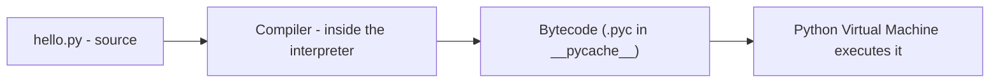

=== Introduction to Python: Features, Interpreter, REPL and Your First Program
difficulty: easy
---
**Python** is a high-level, general-purpose, **interpreted**, **dynamically typed** language created by **Guido van Rossum** (first released in 1991). Its design philosophy stresses **readability**: code looks close to plain English and uses **indentation** instead of braces. It powers web back ends (Instagram, YouTube, Reddit), data science and machine learning, automation and scripting.

Compare "Hello, World" in C and Python:

```c
#include <stdio.h>

int main(void)
{
    printf("Hello, World\n");
}
```

```python
print("Hello, World")
```

```text
Hello, World
```

### Key features
| Feature | Meaning |
|---|---|
| **Interpreted** | Source is compiled to **bytecode** (`.pyc`) and run by the Python Virtual Machine — no separate compile step for you |
| **Dynamically typed** | Variables have no declared type; the **value** has a type, checked at run time |
| **Strongly typed** | No silent mixing of types: `"3" + 3` is a `TypeError` |
| **Multi-paradigm** | Procedural, object-oriented and functional styles |
| **Batteries included** | Huge standard library (files, JSON, HTTP, CSV, SQLite, math, dates...) plus 400,000+ packages on **PyPI** (installed with `pip`) |
| **Automatic memory management** | Reference counting + a cycle-detecting garbage collector |
| **Portable, open source** | Runs on Windows, macOS, Linux; free for any use |
| **Indentation is syntax** | Blocks are defined by consistent indentation (4 spaces by convention) |

Drawbacks interviewers ask about: **slower** than compiled languages like C/C++/Java for CPU-heavy work, the **GIL** limits CPU-parallel threads in CPython, and runtime type errors appear only when the code runs.

### How Python runs your code


**CPython** (written in C) is the reference implementation. Others: **PyPy** (JIT-compiled, faster), **Jython** (on the JVM), **IronPython** (.NET), **MicroPython** (microcontrollers).

### Interactive mode (REPL) vs script mode
- **Interactive shell / REPL** — **R**ead–**E**valuate–**P**rint **L**oop: type a line at the `>>>` prompt and see the result immediately. IDLE (Python's **I**ntegrated **D**evelopment and **L**earning **E**nvironment) opens one; so does `python` in a terminal.
- **Script mode** — save code in a `.py` file and run the whole program (`python hello.py`, or F5 in IDLE).

In the REPL, typing an expression shows its **representation** (`repr`), while `print()` shows the readable form:

```calc
>>> greeting = "Hello, World"
>>> greeting           <- variable inspection: shows quotes (repr)
'Hello, World'
>>> print(greeting)    <- human-readable form
Hello, World
>>> x, y = 2, "2"
>>> x, y               <- inspection reveals the difference print() would hide
(2, '2')
```

Variable inspection works **only** in the interactive window; a script that just contains `greeting` on a line prints nothing.

### Python 2 vs Python 3
Python 2 reached end of life in 2020. Key differences: `print` is a function in 3 (`print("x")`), `/` is true division in 3 (`7 / 2 == 3.5`), strings are Unicode by default, `range` is lazy, `input()` always returns a string.

**Key points:**
- Python is interpreted (source → bytecode → PVM), dynamically and strongly typed.
- Readable syntax with indentation-defined blocks; huge standard library and PyPI.
- REPL for experiments, `.py` scripts for programs; inspection shows `repr`, `print` shows `str`.
- CPython is the reference implementation; the GIL and speed are its known weaknesses.

=== Syntax Errors, Runtime Errors, Tracebacks and Comments
difficulty: easy
---
Mistakes in programs are **errors**. Python programs fail in two main ways.

### Syntax errors
Code that **isn't valid Python**. The interpreter reports them **before the program starts running** — nothing executes.

```python
# expect-error: missing closing quote
print("Hello, World)
```

```text
SyntaxError: EOL while scanning string literal
```

(Python 3.9 says *EOL while scanning string literal* — "EOL" means **end of line**; Python 3.10+ words it *unterminated string literal*.) Other common syntax errors: missing colon after `if`/`def`/`for`, unbalanced brackets, `=` where `==` was meant inside a condition, and bad indentation (`IndentationError`, a subclass of `SyntaxError`).

### Runtime errors (exceptions)
The code is valid, but something goes wrong **while running** — Python stops and prints a **traceback**:

```python
# expect-error: Hello is not a variable
print("before")
print(Hello, World)
print("never printed")
```

```text
before
NameError: name 'Hello' is not defined
```

**Read a traceback from the bottom up**:
1. The **last line** gives the exception type and message (`NameError: name 'Hello' is not defined`).
2. Above it, the **line of code** that failed.
3. Above that, the **file and line number** (and, for nested calls, the chain of function calls that led there — "most recent call last").

Common runtime errors: `NameError` (undefined name), `TypeError` (wrong type for an operation), `ValueError` (right type, bad value, e.g. `int("abc")`), `IndexError`, `KeyError`, `ZeroDivisionError`, `AttributeError`, `FileNotFoundError`. Handling them is covered in "Exceptions".

### Comments
Comments are ignored by Python and explain **why** code does something.

```python
# This is a block comment: it sits on its own line.
greeting = "Hello, World"
print(greeting)  # An inline comment: two spaces, #, one space (PEP 8).
print("#1")      # A # inside a string is just a character, not a comment.
```

```text
Hello, World
#1
```

- PEP 8 style: block comments start with `# ` and complete sentences; inline comments have **at least two spaces** before `#`; don't comment the obvious (`# print hello` above `print("hello")` adds nothing).
- **Commenting out** code (putting `#` before lines) disables them temporarily. IDLE shortcuts: Alt+3 / Alt+4 on Windows (Ctrl+3 / Ctrl+4 on macOS).
- Python has **no multi-line comment syntax**. A triple-quoted string that isn't assigned is just an unused expression; when it's the first statement of a module, function or class it becomes a **docstring** (see "Functions").

**Key points:**
- Syntax errors are found before running; runtime errors (exceptions) happen during execution.
- Read tracebacks bottom-up: exception type/message, failing line, file and line number.
- `#` starts a comment; PEP 8 wants two spaces before inline comments.
- No block-comment syntax; first-statement triple-quoted strings are docstrings.

=== Variables, Names, Dynamic Typing and Object References
difficulty: medium
---
A **variable** is a **name that refers to a value (an object)**. Variables keep values accessible and give them meaning — `seconds_per_hour = 3600` says far more than `s = 3600`.

### Assignment
`=` is the **assignment operator**: evaluate the right side, then bind the name on the left to the result. It is not mathematical equality.

```python
num_students = 28
num_students = num_students + 2      # rebinding: right side first
print(num_students)

a, b = 1, 2                           # multiple assignment (tuple unpacking)
a, b = b, a                           # swap without a temporary variable
print(a, b)

x = y = 0                             # chained assignment: both names, same object
count = 10
count += 5                            # augmented assignment: count = count + 5
print(x, y, count)
```

```text
30
2 1
0 0 15
```

### Rules for names
- Letters (A–Z, a–z), digits (0–9) and underscores; **cannot start with a digit** (`9lives` is invalid, `string1` and `_a1p4a` are valid).
- **Case-sensitive**: `greeting` and `Greeting` are different names.
- Cannot be a **keyword** (`if`, `for`, `class`, `def`, `return`, `None`, `True`, `lambda`...). `import keyword; keyword.kwlist` lists them.
- Unicode letters are allowed (`café = 1`), but avoid them in shared code.

### Naming conventions (PEP 8)
- `lower_case_with_underscores` (snake_case) for variables and functions: `num_students`, `list_of_names` — not mixedCase `numStudents`.
- `CapWords` (PascalCase) for classes: `BankAccount`.
- `UPPER_CASE` for constants: `MAX_SIZE = 100` (a convention only — Python has no real constants).
- A leading underscore `_internal` means "private by convention"; avoid shadowing built-ins (`list = [...]` hides the `list()` function).
- Prefer descriptive names of three or four words at most.

### Dynamic typing
A name has no fixed type — the **object** has the type. The same name can refer to objects of different types over time:

```python
value = 42
print(type(value))
value = "forty-two"
print(type(value))
value = [4, 2]
print(type(value))
print(isinstance(value, list))
```

```text
<class 'int'>
<class 'str'>
<class 'list'>
True
```

Use `type()` to see a value's class and `isinstance(obj, cls)` to test it (it also accepts subclasses). **Type hints** (`count: int = 0`, `def f(x: str) -> int:`) document intended types and are checked by tools like mypy, but Python itself doesn't enforce them.

### Names are references to objects
Every value is an **object** with an **identity** (`id()`), a **type** and a **value**. Assignment never copies an object — it makes the name **refer** to the same object.

```python
a = [1, 2, 3]
b = a                 # b refers to the SAME list
b.append(4)
print(a)              # changed through b
print(a is b, a == b) # identity and equality

c = [1, 2, 3, 4]
print(a == c, a is c) # equal values, different objects

n = 10
m = n
m += 1                # ints are immutable: m now refers to a NEW object
print(n, m)
```

```text
[1, 2, 3, 4]
True True
True False
10 11
```

- **`==`** compares **values**; **`is`** compares **identity** (same object). Use `is` only for singletons: `if x is None:`.
- This sharing matters only for **mutable** objects (lists, dicts, sets); for immutable ones (int, str, tuple) "changing" always creates a new object. See "Mutable vs Immutable Objects".

**Key points:**
- Variables are names bound to objects; `=` binds, it doesn't compare.
- Names: letters/digits/underscores, no leading digit, case-sensitive, no keywords; PEP 8 snake_case.
- Dynamic typing: objects have types, names don't; check with `type()`/`isinstance()`.
- Assignment shares references; `==` compares values, `is` compares identity.

=== Strings: Literals, Escapes, Indexing, Slicing and Immutability
difficulty: easy
---
A **string** (`str`) is an immutable **sequence of Unicode characters** used to represent text. Strings have characters, a **length** and an **order** — each character has a numbered position.

### Creating strings
```python
s1 = 'single quotes'
s2 = "double quotes"
s3 = "We're #1!"                     # the other quote type can appear inside
s4 = 'I said, "Put it over by the llama."'
s5 = "She said, \"What time is it?\""  # escape a matching quote
print(s3, s4, s5, sep="\n")
print(type(s1), len("Don't Panic"))
print("Tab:\tend", "New\nline", r"raw: C:\new\table", sep=" | ")
```

```text
We're #1!
I said, "Put it over by the llama."
She said, "What time is it?"
<class 'str'> 11
Tab:	end | New
line | raw: C:\new\table
```

- **Escape sequences**: `\n` newline, `\t` tab, `\\` backslash, `\'` and `\"` quotes, `\u00e9` a Unicode code point.
- **Raw strings** `r"..."` treat backslashes literally — handy for Windows paths and regular expressions.
- The quotes are **delimiters**; a string literal must end on the same line unless it is triple-quoted.

### Multiline strings
```python
joined = "This multiline string is \
displayed on one line"
print(joined)

poem = """Line one
    keeps its indentation
Line three"""
print(poem)
print(len(""), len(" "))      # empty string vs a string with one space
```

```text
This multiline string is displayed on one line
Line one
    keeps its indentation
Line three
0 1
```

A backslash at the end of a line continues the literal (output on one line). **Triple quotes** (`"""` or `'''`) preserve newlines and indentation exactly. The **empty string** `""` has length 0; any string containing even a space is non-empty.

### Indexing
Indices start at **0**; negative indices count from the end (`-1` is the last character).

```calc
 index:   0   1   2   3   4   5   6
         | f | i | g |   | p | i | e |
negative: -7  -6  -5  -4  -3  -2  -1
```

```python
# expect-error: index 9 is out of range
flavor = "fig pie"
print(flavor[0], flavor[1], flavor[-1], flavor[len(flavor) - 1])
print(flavor[9])
```

```text
f i e e
IndexError: string index out of range
```

Using index 1 for the first character is a classic **off-by-one error**. The largest valid index is `len(s) - 1`.

### Slicing
`s[start:stop]` returns the substring from `start` up to **but not including** `stop`. Think of the indices as the **boundaries between characters**. Omitted start = 0, omitted stop = end; a third value is the **step**.

```python
flavor = "fig pie"
print(flavor[0:3], "|", flavor[3:], "|", flavor[:3], "|", flavor[:])
print(flavor[-3:], "|", flavor[-7:-4])
print(repr(flavor[:14]), repr(flavor[13:15]), repr(flavor[-7:0]))
print("bazinga"[2:6])
print(flavor[::2], "|", flavor[::-1])        # every 2nd char; reversed
```

```text
fig |  pie | fig | fig pie
pie | fig
'fig pie' '' ''
zing
fgpe | eip gif
```

- Slices **never raise IndexError** — out-of-range bounds are clipped, and an empty range gives `""`.
- `[-7:0]` is empty because both bounds are the left edge; to include the end, omit the stop (`[-7:]`).
- `s[::-1]` is the idiomatic way to **reverse** a string (palindrome checks: `s == s[::-1]`).

### Strings are immutable
```python
# expect-error: strings cannot be changed in place
word = "goal"
new_word = "f" + word[1:]       # build a NEW string instead
print(new_word)
word[0] = "f"
```

```text
foal
TypeError: 'str' object does not support item assignment
```

Immutability makes strings safe to share, usable as dictionary keys, and hashable. "Modifying" methods always return a **new** string.

**Key points:**
- Single, double or triple quotes; escapes with `\`; raw strings `r"..."` ignore escapes.
- Indices start at 0; negative indices count from the end; out-of-range index → IndexError.
- `s[start:stop:step]` excludes stop, never errors, `[::-1]` reverses.
- Strings are immutable: build new strings instead of assigning to `s[i]`.

=== String Methods, Formatting with f-strings and User Input
difficulty: easy
---
Strings come with many **methods** — functions called on a string with dot notation (`name.upper()`). Because strings are immutable, methods **return new strings** and leave the original unchanged.

```python
name = "  Jean-Luc Picard  "
print(repr(name.strip()), repr(name.lstrip()), repr(name.rstrip()))
clean = name.strip()
print(clean.upper(), clean.lower(), clean.title(), "picard".capitalize(), sep=" | ")
print(clean.startswith("Jean"), clean.startswith("jean"), clean.endswith("ard"))
print(clean.find("Luc"), clean.find("Kirk"), clean.count("a"))
print(clean.replace("Picard", "Riker"))
print("a,b,,c".split(","), "one two  three".split())
print("-".join(["2024", "01", "05"]), "42".zfill(5), "hi".center(8, "*"))
print("abc123".isalnum(), "123".isdigit(), "abc".isalpha(), "   ".isspace())
name.upper()
print(repr(name))          # unchanged: the result above was discarded
```

```text
'Jean-Luc Picard' 'Jean-Luc Picard  ' '  Jean-Luc Picard'
JEAN-LUC PICARD | jean-luc picard | Jean-Luc Picard | Picard
True False True
5 -1 2
Jean-Luc Riker
['a', 'b', '', 'c'] ['one', 'two', 'three']
2024-01-05 00042 ***hi***
True True True True
'  Jean-Luc Picard  '
```

| Method | Purpose |
|---|---|
| `.lower()`, `.upper()`, `.title()`, `.capitalize()`, `.swapcase()` | Change case |
| `.strip()`, `.lstrip()`, `.rstrip()` | Remove whitespace (or given characters) from the ends — never from the middle |
| `.startswith()`, `.endswith()` | Prefix/suffix tests — **case-sensitive** |
| `.find(sub)` / `.index(sub)` | Position of first occurrence; `find` returns **−1** if absent, `index` raises **ValueError** |
| `.count(sub)`, `.replace(old, new)` | Count / replace all occurrences |
| `.split(sep)`, `sep.join(iterable)` | String ↔ list of strings |
| `.isdigit()`, `.isalpha()`, `.isalnum()`, `.isspace()` | Character tests |
| `in` operator | `"Luc" in clean` → True; the simplest substring test |

In IDLE, type `name.` and pause to see every string method; **Tab** completes names.

### Combining strings and numbers
`+` concatenates strings; `*` with an **integer** repeats; mixing a string and a number is a **TypeError**.

```python
# expect-error: str + int
print("2" + "2", "12" * 3, 3 * "ab")
num_pancakes = 10
print("I am going to eat " + str(num_pancakes) + " pancakes.")
print(int("12") + 1, float("12"), float("3.5") * 2)
print("3" + 3)
```

```text
22 121212 ababab
I am going to eat 10 pancakes.
13 12.0 7.0
TypeError: can only concatenate str (not "int") to str
```

- `int("12.0")` raises `ValueError` (use `int(float("12.0"))`); `int(3.9)` truncates to 3.
- `str()` converts any object to its readable string form.

### f-strings and other formatting
**f-strings** (Python 3.6+) put expressions directly inside `{}` — the clearest way to build output.

```python
name, heads, arms = "Zaphod", 2, 3
print(f"{name} has {heads} heads and {arms} arms")
n, m = 3, 4
print(f"{n} times {m} is {n * m}")
price, ratio = 1234567.891, 0.4567
print(f"{price:,.2f} | {ratio:.1%} | {42:05d} | {'left':<8}| {'right':>8}| {7:b}")
print("{} has {} heads".format(name, heads))       # older str.format
print("%s has %d heads" % (name, heads))            # oldest %-formatting
print(f"{name=}, {heads + arms=}")                  # 3.8+: shows expression and value
```

```text
Zaphod has 2 heads and 3 arms
3 times 4 is 12
1,234,567.89 | 45.7% | 00042 | left    |    right| 111
Zaphod has 2 heads
Zaphod has 2 heads
name='Zaphod', heads + arms=5
```

Format spec mini-language after a colon: `.2f` (2 decimals), `,` (thousands separator), `%` (percentage), `05d` (zero-pad to width 5), `<`, `>`, `^` (align), `b`/`x` (binary/hex).

### Getting input from the user
`input(prompt)` displays the prompt, waits for the user to press Enter, and **always returns a string** — convert it before doing arithmetic.

```python
# fragment
num = input("Enter a number to be doubled: ")   # user types 2
print(num * 2)                                   # '22' - string repetition!
print(float(num) * 2)                            # 4.0 - convert first
```

`print()` itself accepts several arguments separated by `sep` (default `" "`) and ends with `end` (default `"\n"`): `print("a", "b", sep="-", end="!")` → `a-b!`.

**Key points:**
- String methods return new strings; assign the result (`name = name.upper()`).
- `find` returns −1, `index` raises; `split`/`join` convert between strings and lists.
- `+` on str and int is a TypeError — convert with `str()`, `int()`, `float()`.
- f-strings: `f"{value:,.2f}"`; `input()` always returns a string.

=== Numbers: int, float, complex, Operators and Precedence
difficulty: medium
---
Python has three built-in numeric types:
- **`int`** — whole numbers of **unlimited size** (no overflow): `2 ** 100` just works. Underscores improve readability: `1_000_000`.
- **`float`** — double-precision floating point (64-bit IEEE 754, ~15–17 significant digits): `3.14`, `1e-3`, `float("inf")`.
- **`complex`** — `3 + 2j` with `.real`, `.imag`, `.conjugate()`.
`bool` is a subclass of `int` (`True == 1`, `False == 0`).

### Arithmetic operators
| Operator | Meaning | Example | Result |
|---|---|---|---|
| `+ - *` | add, subtract, multiply | `2 * 3` | `6` |
| `/` | **true division — always a float** | `9 / 3` | `3.0` |
| `//` | **floor division** — rounds toward −∞ | `-7 // 2` | `-4` |
| `%` | remainder (sign of the **divisor**) | `-7 % 2` | `1` |
| `**` | exponent | `2 ** -1` | `0.5` |

```python
print(7 / 2, 9 / 3, 7 // 2, -7 // 2, 7 % 3, -7 % 3, 7 % -3)
print(2 ** 10, 2 ** 100, 2 ** 0.5)
print(divmod(17, 5), abs(-4), round(2.675, 2), round(2.5), round(3.5))
print(type(3 + 4.0), type(10 // 3), type(10 / 5))
print(3 + 2j, (3 + 2j) * (1 - 1j), (3 + 4j).real, abs(3 + 4j))
```

```text
3.5 3.0 3 -4 1 2 -2
1024 1267650600228229401496703205376 1.4142135623730951
(3, 2) 4 2.67 2 4
<class 'float'> <class 'int'> <class 'float'>
(3+2j) (5-1j) 3.0 5.0
```

- Mixing int and float gives a float; `/` always returns float even for exact results.
- `round()` uses **banker's rounding** (round half to even): `round(2.5) == 2`, `round(3.5) == 4`. `round(2.675, 2)` gives 2.67 because 2.675 can't be stored exactly.
- `//` and `%` satisfy `a == (a // b) * b + a % b`.

### "Make Python lie to you" — floating-point representation
```python
print(0.1 + 0.2, 0.1 + 0.2 == 0.3)
import math
print(math.isclose(0.1 + 0.2, 0.3))
from decimal import Decimal
from fractions import Fraction
print(Decimal("0.1") + Decimal("0.2"), Fraction(1, 3) + Fraction(1, 6))
print(1e308 * 10, float("nan") == float("nan"))
```

```text
0.30000000000000004 False
True
0.3 1/2
inf False
```

Floats are stored in **binary**, so most decimal fractions (like 0.1) are approximations. Never compare floats with `==` — use `math.isclose()`; use **`decimal.Decimal`** for money and **`fractions.Fraction`** for exact rationals. Overflow gives `inf`; `nan` is not equal even to itself.

### The math module and number methods
```python
import math
print(math.sqrt(16), math.pi, math.ceil(4.1), math.floor(-4.1), math.trunc(-4.9))
print(math.factorial(5), math.gcd(12, 18), math.log(8, 2), math.hypot(3, 4))
print((12.0).is_integer(), (255).bit_length(), hex(255), bin(5), int("ff", 16))
```

```text
4.0 3.141592653589793 5 -5 -4
120 6 3.0 5.0
True 8 0xff 0b101 255
```

### Operator precedence (highest first)
```calc
()                          parentheses
**                          exponent (right-associative: 2 ** 3 ** 2 = 2 ** 9 = 512)
+x  -x  ~x                  unary
*  /  //  %                 multiplicative (left to right)
+  -                        additive
<<  >>  &  ^  |             bitwise
==  !=  <  >  <=  >=  is  in   comparisons (can be chained)
not                         logical NOT
and                         logical AND
or                          logical OR
```

```python
print(2 + 3 * 4, (2 + 3) * 4, -3 ** 2, (-3) ** 2, 2 ** 3 ** 2)
print(10 - 4 - 3, 100 / 10 / 5, 1 < 2 < 3, 3 > 2 == 2)
```

```text
14 20 -9 9 512
3 2.0 True True
```

`-3 ** 2` is `-(3 ** 2) = -9` — exponent binds tighter than unary minus. Comparisons **chain**: `1 < 2 < 3` means `1 < 2 and 2 < 3`.

**Key points:**
- int has unlimited precision; float is 64-bit binary floating point; complex uses `j`.
- `/` always returns float, `//` floors toward −∞, `%` takes the divisor's sign.
- `0.1 + 0.2 != 0.3`: use `math.isclose`, `Decimal` or `Fraction`; `round` is banker's rounding.
- `**` is right-associative and binds tighter than unary minus; comparisons chain.

=== Conditional Logic: Booleans, Comparisons, if/elif/else and match
difficulty: easy
---
### Booleans and comparison operators
Comparisons return a **Boolean** (`bool`): `True` or `False` (capitalized).

| Operator | Meaning |
|---|---|
| `==`, `!=` | equal, not equal (value) |
| `<`, `>`, `<=`, `>=` | ordering (numbers; strings compare **lexicographically** by Unicode code point) |
| `is`, `is not` | same object |
| `in`, `not in` | membership |

```python
print(1 == 1.0, "a" < "b", "Zebra" < "apple", "apple" < "apricot", [1, 2] < [1, 3])
print("e" in "hello", 3 not in [1, 2], "key" in {"key": 1})
```

```text
True True True True True
True True True
```

Uppercase letters sort before lowercase (`"Z"` is code point 90, `"a"` is 97), which is why `"Zebra" < "apple"`.

### Logical operators: and, or, not
- `and` is True only if both sides are True; `or` if at least one is; `not` inverts.
- Precedence: **`not` > `and` > `or`** — use parentheses for clarity.
- **Short-circuit evaluation**: `and` stops at the first falsy operand, `or` at the first truthy one — and they return that **operand itself**, not necessarily a bool.

```python
print(True and False, True or False, not True)
print(not False == True)               # not (False == True)
print(True or False and False)         # and binds first
x = 0
print(x != 0 and 10 / x > 1)           # right side never evaluated: no ZeroDivisionError
name = ""
print(name or "Anonymous", 0 or [] or "last", 1 and "both truthy")
```

```text
False True False
True
True
False
Anonymous last both truthy
```

### Truthiness
Any object can be tested in a condition. **Falsy** values: `False`, `None`, `0`, `0.0`, `0j`, empty `""`, `[]`, `()`, `{}`, `set()`, `range(0)`. Everything else is **truthy**.

```python
for value in [0, 1, "", "0", [], [0], None, 0.0, " "]:
    print(repr(value), bool(value))
```

```text
0 False
1 True
'' False
'0' True
[] False
[0] True
None False
0.0 False
' ' True
```

Note `"0"` and `[0]` are truthy — they are non-empty. Write `if items:` instead of `if len(items) > 0:`.

### if / elif / else
```python
def grade(score):
    if score >= 90:
        return "A"
    elif score >= 80:
        return "B"
    elif score >= 70:
        return "C"
    else:
        return "F"

print([grade(s) for s in (95, 85, 72, 40, 90)])

age = 20
status = "adult" if age >= 18 else "minor"     # conditional (ternary) expression
print(status)
```

```text
['A', 'B', 'C', 'F', 'A']
adult
```

- Each block is defined by **indentation** after a colon; inconsistent indentation is an `IndentationError`.
- Conditions are checked **top to bottom**; only the first true branch runs.
- `pass` is a do-nothing placeholder for an empty block.

### match statement (Python 3.10+)
Structural pattern matching — a more powerful `switch`:

```python
# fragment
match command.split():
    case ["go", direction]:
        print(f"Going {direction}")
    case ["quit" | "exit"]:
        print("Bye")
    case _:
        print("Unknown command")
```

(Older versions use `if/elif` chains or a dictionary of functions.)

**Key points:**
- Comparisons return bool; strings compare by code point; comparisons chain.
- `not` > `and` > `or`; `and`/`or` short-circuit and return an operand.
- Falsy: False, None, zero, empty containers; `"0"` and `[0]` are truthy.
- if/elif/else with indentation; `x if cond else y` is the one-line conditional expression.

=== Loops: while, for, range, break, continue and else
difficulty: easy
---
### while loops
Repeat **while a condition is true**. Something inside must eventually make it false, or the loop is infinite (stop with Ctrl+C).

```python
n = 1
while n <= 5:
    print(n, end=" ")
    n = n + 1
print()

balance, years = 100.0, 0
while balance < 200:                   # how long until money doubles at 7%?
    balance *= 1.07
    years += 1
print(years, round(balance, 2))
```

```text
1 2 3 4 5
11 210.49
```

### for loops and range
`for` iterates over **each item of an iterable** — a string, list, tuple, dict, set, file, range...

```python
for letter in "Python":
    print(letter, end=" ")
print()
print(list(range(5)), list(range(2, 8)), list(range(10, 0, -3)))
for i in range(3):
    print("Python is fun", i)
total = 0
for n in range(1, 101):
    total += n
print(total)
```

```text
P y t h o n
[0, 1, 2, 3, 4] [2, 3, 4, 5, 6, 7] [10, 7, 4, 1]
Python is fun 0
Python is fun 1
Python is fun 2
5050
```

`range(start, stop, step)` produces integers from start up to **but not including** stop; it is **lazy** (doesn't build a list in memory).

Useful helpers:

```python
fruits = ["apple", "banana", "cherry"]
prices = [1.2, 0.5, 3.0]
for i, fruit in enumerate(fruits, start=1):        # index + item
    print(i, fruit)
for fruit, price in zip(fruits, prices):            # pairs from parallel lists
    print(f"{fruit}: {price}")
for fruit in reversed(sorted(fruits)):
    print(fruit, end=" ")
print()
```

```text
1 apple
2 banana
3 cherry
apple: 1.2
banana: 0.5
cherry: 3.0
cherry banana apple
```

Avoid `for i in range(len(items)):` when you only need the items — iterate directly, or use `enumerate`.

### break, continue and loop else
- **`break`** exits the loop immediately.
- **`continue`** skips the rest of this iteration.
- A loop's **`else`** block runs only if the loop **finished without `break`** — ideal for "search, and report if not found".

```python
for n in range(1, 10):
    if n % 2 == 0:
        continue                # skip even numbers
    if n > 7:
        break                   # stop completely
    print(n, end=" ")
print()

def is_prime(num):
    if num < 2:
        return False
    for d in range(2, int(num ** 0.5) + 1):
        if num % d == 0:
            break
    else:                       # no divisor found
        return True
    return False

print([p for p in range(30) if is_prime(p)])

for factor in range(1, 13):     # the book's challenge: factors of a number
    if 12 % factor == 0:
        print(f"{factor} is a factor of 12")
```

```text
1 3 5 7
[2, 3, 5, 7, 11, 13, 17, 19, 23, 29]
1 is a factor of 12
2 is a factor of 12
3 is a factor of 12
4 is a factor of 12
6 is a factor of 12
12 is a factor of 12
```

### Nested loops
```python
for i in range(1, 4):
    row = ""
    for j in range(1, i + 1):
        row += "* "
    print(row)
```

```text
*
* *
* * *
```

**Key points:**
- `while` repeats while a condition holds; `for` iterates over any iterable.
- `range(start, stop, step)` excludes stop and is lazy.
- `enumerate` gives index + item; `zip` pairs iterables.
- `break` exits, `continue` skips; loop `else` runs only when no `break` happened.

=== Functions: def, return, Parameters, Default Values and Docstrings
difficulty: easy
---
A **function** is a named, reusable block of code that performs a task. Calling `print("hi")` runs the function `print` with the **argument** `"hi"`. Functions are themselves **objects** — they can be stored in variables, passed to other functions and returned.

### Defining a function
```python
def convert_cel_to_far(cel):
    """Return the Fahrenheit equivalent of a Celsius temperature."""
    return cel * 9 / 5 + 32

print(convert_cel_to_far(37))
print(convert_cel_to_far.__doc__)
result = print("print returns:")
print(result)
```

```text
98.6
Return the Fahrenheit equivalent of a Celsius temperature.
print returns:
None
```

Anatomy:
- **`def`**, the function name, **parameters** in parentheses, a colon, then an indented **body**.
- A **docstring** (first statement, triple-quoted) documents it — shown by `help(func)`.
- **`return`** sends a value back and ends the function. A function without `return` (or with a bare `return`) returns **`None`** — that's what `print()` returns.
- **Parameters** are the names in the definition; **arguments** are the values passed in a call.

### Kinds of arguments
```python
def greet(name, greeting="Hello", punctuation="!"):     # defaults
    return f"{greeting}, {name}{punctuation}"

print(greet("Asha"))                                  # positional
print(greet("Asha", "Hi"))
print(greet(punctuation="?", name="Ravi"))            # keyword arguments: any order
print(greet("Meera", punctuation="."))                # mix: positional first

def stats(*numbers, round_to=2):                      # *args collects extra positionals
    avg = sum(numbers) / len(numbers)
    return round(avg, round_to)

def describe(**info):                                 # **kwargs collects extra keywords
    return ", ".join(f"{k}={v}" for k, v in info.items())

print(stats(1, 2, 4), stats(1, 2, 4, round_to=0))
print(describe(name="Asha", age=21))
values = [3, 5]
print(stats(*values), greet(**{"name": "Karan", "greeting": "Hey"}))   # unpacking in calls
```

```text
Hello, Asha!
Hi, Asha!
Hello, Ravi?
Hello, Meera.
2.33 2.0
name=Asha, age=21
4.0 Hey, Karan!
```

Parameter order in a definition: `def f(pos_only, /, normal, *args, kw_only, **kwargs)`. Parameters after `*args` (or a bare `*`) are **keyword-only**; before `/` they are positional-only (3.8+).

### The mutable default argument trap
Default values are evaluated **once, when the function is defined** — not on each call. A mutable default (list, dict) is therefore **shared** between calls:

```python
def add_item_bad(item, basket=[]):
    basket.append(item)
    return basket

def add_item_good(item, basket=None):
    if basket is None:
        basket = []                  # a fresh list on every call
    basket.append(item)
    return basket

print(add_item_bad("apple"), add_item_bad("pear"))
print(add_item_good("apple"), add_item_good("pear"))
```

```text
['apple', 'pear'] ['apple', 'pear']
['apple'] ['pear']
```

### Returning several values
A function returns one object, but that object can be a **tuple**, which the caller unpacks:

```python
def min_max_avg(nums):
    return min(nums), max(nums), sum(nums) / len(nums)

low, high, avg = min_max_avg([4, 9, 2, 7])
print(low, high, avg)
```

```text
2 9 5.5
```

### Argument passing: "pass by object reference"
Python passes a **reference to the object**. If the function **mutates** a mutable argument, the caller sees it; if it **rebinds** the parameter name, the caller doesn't.

```python
def modify(lst, n):
    lst.append(99)      # mutation: visible outside
    lst = [0]           # rebinding: only the local name changes
    n += 1              # ints are immutable: local only

nums, count = [1, 2], 5
modify(nums, count)
print(nums, count)
```

```text
[1, 2, 99] 5
```

**Key points:**
- `def name(params):` + indented body; docstring first; `return` ends and returns (default `None`).
- Positional, keyword, default, `*args`, `**kwargs`; `*`/`**` also unpack in calls.
- Defaults are evaluated once — use `None` instead of a mutable default.
- Arguments are object references: mutations show outside, rebinding doesn't.

=== Scope, the LEGB Rule, global/nonlocal and Closures
difficulty: medium
---
**Scope** is the region of code where a name is visible. When Python looks up a name it searches four scopes in order — the **LEGB rule**:

```calc
L - Local      names assigned inside the current function
E - Enclosing  locals of any enclosing (outer) functions
G - Global     names assigned at the top level of the module
B - Built-in   names Python predefines: print, len, range, int ...
First match wins; if none matches -> NameError.
```

```python
x = "global"

def outer():
    x = "enclosing"
    def inner():
        x = "local"
        print("inner sees:", x)
    inner()
    print("outer sees:", x)

outer()
print("module sees:", x)
print(len("abc"))          # len found in the built-in scope
```

```text
inner sees: local
outer sees: enclosing
module sees: global
3
```

### Assignment creates a local name
Assigning to a name **anywhere** in a function makes it local for the **whole** function — reading it before the assignment fails:

```python
# expect-error: total is local because it is assigned below
total = 0

def add(n):
    total = total + n     # reads the local 'total' before it has a value
    return total

add(5)
```

```text
UnboundLocalError: local variable 'total' referenced before assignment
```

### global and nonlocal
```python
counter = 0

def increment():
    global counter         # refer to the module-level name
    counter += 1

def make_counter():
    count = 0
    def step():
        nonlocal count     # refer to the enclosing function's name
        count += 1
        return count
    return step

increment(); increment()
print(counter)
c = make_counter()
print(c(), c(), c())
d = make_counter()         # independent state
print(d())
```

```text
2
1 2 3
1
```

- `global` rebinds a module-level name; `nonlocal` rebinds a name in the nearest **enclosing function**.
- Mutating a global object (`items.append(x)`) needs no declaration — only **rebinding** does.
- Heavy use of `global` makes code hard to test; prefer parameters and return values.

### Closures
A **closure** is an inner function that **remembers variables from its enclosing scope** even after the outer function has returned (`step` above keeps `count` alive). Closures power decorators and factory functions:

```python
def multiplier(factor):
    def multiply(x):
        return x * factor
    return multiply

double, triple = multiplier(2), multiplier(3)
print(double(5), triple(5))

funcs = [lambda: i for i in range(3)]          # late binding trap
print([f() for f in funcs])
funcs = [lambda i=i: i for i in range(3)]      # fix: bind the value now
print([f() for f in funcs])
```

```text
10 15
[2, 2, 2]
[0, 1, 2]
```

Closures look up the variable **when called**, not when created — every lambda in the first list sees the final `i` (2).

**Key points:**
- Name lookup follows LEGB: Local → Enclosing → Global → Built-in.
- Any assignment in a function makes the name local → UnboundLocalError if read first.
- `global` for module names, `nonlocal` for enclosing-function names.
- Closures capture variables (late binding); bind current values with default arguments.

=== Lists and Tuples: Sequences, Methods, Unpacking and Sorting
difficulty: easy
---
### Tuples — immutable sequences
A **tuple** is an ordered, **immutable** sequence: `(1, 2, 3)`. The **comma** makes the tuple, not the parentheses — `(1,)` is a one-element tuple, `(1)` is just the int 1.

```python
point = (3, 4)
single, not_tuple = (5,), (5)
print(type(single), type(not_tuple))
x, y = point                                  # unpacking
first, *rest = (1, 2, 3, 4)                    # extended unpacking
print(x, y, first, rest)
print(point[0], point[-1], len(point), point + (5,), point * 2, 4 in point)
print((1, 2, 2, 3).count(2), (1, 2, 3).index(3))
print(tuple("abc"), tuple(range(3)))
```

```text
<class 'tuple'> <class 'int'>
3 4 1 [2, 3, 4]
3 4 2 (3, 4, 5) (3, 4, 3, 4) True
2 2
('a', 'b', 'c') (0, 1, 2)
```

Use tuples for fixed collections of related values (coordinates, database rows, multiple return values) and as **dictionary keys** (they're hashable if their items are).

### Lists — mutable sequences
A **list** is an ordered, **mutable** sequence: items can be added, removed and changed in place.

```python
colors = ["red", "green"]
colors.append("blue")                 # add one item at the end
colors.extend(["cyan", "magenta"])    # add many
colors.insert(1, "yellow")            # insert at index
print(colors)
print(colors.pop(), colors.pop(0))    # remove and return (last / by index)
colors.remove("green")                # remove first matching value
colors[0] = "orange"                  # item assignment
print(colors, len(colors))
nums = [5, 2, 9, 1]
nums[1:3] = [20, 30, 40]              # slice assignment can change length
print(nums, nums.index(30), nums.count(5))
del nums[0]
print(nums, sum(nums), min(nums), max(nums))
```

```text
['red', 'yellow', 'green', 'blue', 'cyan', 'magenta']
magenta red
['orange', 'blue', 'cyan'] 3
[5, 20, 30, 40, 1] 2 1
[20, 30, 40, 1] 91 1 40
```

| Method | Effect | Returns |
|---|---|---|
| `append(x)` | add x at the end | None |
| `extend(iterable)` | add all items | None |
| `insert(i, x)` | insert before index i | None |
| `pop([i])` | remove item at i (default last) | the item |
| `remove(x)` | remove first x (ValueError if absent) | None |
| `index(x)`, `count(x)` | position / occurrences | int |
| `sort()`, `reverse()` | in place | None |
| `copy()`, `clear()` | shallow copy / empty | list / None |

Most list methods **modify in place and return None** — `nums = nums.sort()` sets `nums` to None!

### Sorting
```python
nums = [5, 2, 9, 1]
print(sorted(nums), nums)                  # sorted() returns a NEW list
nums.sort(reverse=True)                     # .sort() changes the list, returns None
print(nums)
words = ["banana", "apple", "Cherry", "date"]
print(sorted(words))                        # uppercase sorts first
print(sorted(words, key=str.lower))
print(sorted(words, key=len))
students = [("Asha", 91), ("Ravi", 82), ("Meera", 82)]
print(sorted(students, key=lambda s: (-s[1], s[0])))   # marks desc, then name
```

```text
[1, 2, 5, 9] [5, 2, 9, 1]
[9, 5, 2, 1]
['Cherry', 'apple', 'banana', 'date']
['apple', 'banana', 'Cherry', 'date']
['date', 'apple', 'banana', 'Cherry']
[('Asha', 91), ('Meera', 82), ('Ravi', 82)]
```

Python's sort (**Timsort**) is **stable** — items with equal keys keep their original order — and runs in O(n log n).

### List vs tuple

| List | Tuple |
|---|---|
| Mutable | Immutable |
| `[1, 2]` | `(1, 2)` |
| Many methods (append, remove...) | Only `count`, `index` |
| Not hashable — can't be a dict key | Hashable (if items are) |
| Homogeneous collections that change | Fixed records, return values, keys |
| Slightly more memory | Smaller, slightly faster |

**Key points:**
- Tuples are immutable; the comma creates them; `(x,)` for one element.
- Lists are mutable: append/extend/insert/pop/remove; most methods return None.
- `sorted()` returns a new list, `.sort()` sorts in place; `key=` customizes; sort is stable.
- Unpacking: `a, b = pair`, `first, *rest = seq`.

=== Copying, Mutability and Nested Lists: Shallow vs Deep Copy
difficulty: medium
---
### Mutable vs immutable types
| Immutable | Mutable |
|---|---|
| `int`, `float`, `complex`, `bool`, `str`, `tuple`, `frozenset`, `bytes`, `None` | `list`, `dict`, `set`, `bytearray`, most user-defined objects |

"Changing" an immutable value creates a **new object**; a mutable object can change **in place**, and every name referring to it sees the change.

```python
s = "abc"
before = id(s)
s += "d"                                # new string object
print(id(s) == before)

lst = [1, 2]
before = id(lst)
lst += [3]                              # in-place extend: same list object
print(id(lst) == before, lst)
```

```text
False
True [1, 2, 3]
```

### Three ways to "copy" a list
```python
import copy

matrix = [[1, 2], [3, 4]]
alias = matrix                          # 1. assignment: same object
shallow = matrix.copy()                 # 2. shallow copy: new outer list, SAME inner lists
deep = copy.deepcopy(matrix)            # 3. deep copy: everything duplicated

matrix[0][0] = 99                       # change an inner list
matrix.append([5, 6])                   # change the outer list

print("alias:  ", alias)
print("shallow:", shallow)
print("deep:   ", deep)
```

```text
alias:   [[99, 2], [3, 4], [5, 6]]
shallow: [[99, 2], [3, 4]]
deep:    [[1, 2], [3, 4]]
```

- **Assignment** copies nothing.
- **Shallow copy** (`list.copy()`, `lst[:]`, `list(lst)`, `copy.copy()`) creates a new outer container but its elements are the **same objects** — nested mutable objects are shared.
- **Deep copy** (`copy.deepcopy()`) recursively copies everything — fully independent (slower, handles cycles).

### The [[0] * n] * m trap
```python
grid_bad = [[0] * 3] * 2            # the SAME inner list repeated twice
grid_bad[0][0] = 1
print(grid_bad)
grid_good = [[0] * 3 for _ in range(2)]   # a new inner list per row
grid_good[0][0] = 1
print(grid_good)
```

```text
[[1, 0, 0], [1, 0, 0]]
[[1, 0, 0], [0, 0, 0]]
```

### Nested lists (list of lists)
```python
universities = [
    ["California Institute of Technology", 2175, 37704],
    ["Harvard", 19627, 39849],
    ["MIT", 10566, 40732],
]
students = [u[1] for u in universities]
tuition = [u[2] for u in universities]
print("Total students:", sum(students))
print("Mean tuition:", round(sum(tuition) / len(tuition), 2))
for name, enrolled, fee in universities:
    print(f"{name[:12]:<12} {enrolled:>6} {fee:>6}")
```

```text
Total students: 32368
Mean tuition: 39428.33
California I   2175  37704
Harvard       19627  39849
MIT           10566  40732
```

(The book's "list of lists" challenge computes totals and averages from data like this.)

**Key points:**
- Immutable: numbers, str, tuple, frozenset; mutable: list, dict, set.
- Assignment shares; shallow copy duplicates only the outer container; deepcopy duplicates everything.
- `[[0]*n]*m` repeats one inner list — build rows with a comprehension.
- Nested lists model tables; unpack rows in the for loop.

=== Dictionaries and Sets: Hashing, Methods and When to Use Each
difficulty: medium
---
### Dictionaries
A **dict** stores **key → value** pairs with fast lookup by key. Keys must be **hashable** (immutable: str, int, tuple of immutables); values can be anything. Since Python 3.7 dicts **preserve insertion order**.

```python
capitals = {"California": "Sacramento", "New York": "Albany"}
capitals["Texas"] = "Austin"                    # add
capitals["New York"] = "Albany (NY)"            # update
print(capitals["Texas"], len(capitals), "Texas" in capitals)
print(capitals.get("Ohio"), capitals.get("Ohio", "unknown"))
del capitals["California"]
print(capitals)
for state, capital in capitals.items():
    print(f"{state} -> {capital}")
print(list(capitals.keys()), list(capitals.values()))
```

```text
Austin 3 True
None unknown
{'New York': 'Albany (NY)', 'Texas': 'Austin'}
New York -> Albany (NY)
Texas -> Austin
['New York', 'Texas'] ['Albany (NY)', 'Austin']
```

```python
# expect-error: missing key with []
scores = {"asha": 91}
print(scores.setdefault("ravi", 0), scores)    # insert default if missing
scores.update({"meera": 77, "asha": 95})
print(scores.pop("meera"), scores)
print(scores["karan"])
```

```text
0 {'asha': 91, 'ravi': 0}
77 {'asha': 95, 'ravi': 0}
KeyError: 'karan'
```

| Operation | Notes |
|---|---|
| `d[key]` | KeyError if missing |
| `d.get(key, default)` | None/default if missing |
| `d.setdefault(key, default)` | get, inserting default if missing |
| `d.update(other)`, `d \| other` (3.9) | merge |
| `d.pop(key)`, `del d[key]` | remove |
| `d.keys()`, `d.values()`, `d.items()` | live **views** |
| `key in d` | O(1) average |

### Counting and grouping — common interview tasks
```python
from collections import Counter, defaultdict

text = "the cat and the hat and the bat"
freq = {}
for word in text.split():
    freq[word] = freq.get(word, 0) + 1
print(freq)
print(Counter(text.split()).most_common(2))

by_length = defaultdict(list)
for word in set(text.split()):
    by_length[len(word)].append(word)
print({k: sorted(v) for k, v in sorted(by_length.items())})

inverted = {v: k for k, v in {"a": 1, "b": 2}.items()}   # swap keys and values
print(inverted)
```

```text
{'the': 3, 'cat': 1, 'and': 2, 'hat': 1, 'bat': 1}
[('the', 3), ('and', 2)]
{3: ['and', 'bat', 'cat', 'hat', 'the']}
{1: 'a', 2: 'b'}
```

### How dicts work: hashing
`hash(key)` picks a slot in an internal hash table, giving **O(1) average** lookup, insert and delete. That's why keys must be **immutable**: if a key's value could change, its hash would change and it would be lost. A list can't be a key; a tuple can.

```python
# expect-error: list as a key
d = {(1, 2): "tuple key ok"}
print(d[(1, 2)], hash("abc") == hash("abc"))
d[[1, 2]] = "list key"
```

```text
tuple key ok True
TypeError: unhashable type: 'list'
```

### Sets
A **set** is an **unordered collection of unique, hashable items** — fast membership tests and math set operations. `{}` is an empty **dict**; use `set()` for an empty set.

```python
a = {1, 2, 3, 4}
b = {3, 4, 5}
print(a | b, a & b, a - b, a ^ b)          # union, intersection, difference, symmetric diff
print(3 in a, {1, 2} <= a, len(set("mississippi")))
nums = [3, 1, 3, 2, 1]
print(sorted(set(nums)), list(dict.fromkeys(nums)))   # dedupe; second keeps order
a.add(10); a.discard(99); a.remove(1)
print(sorted(a), type({}), type(set()))
print(frozenset({1, 2}) | {3})
```

```text
{1, 2, 3, 4, 5} {3, 4} {1, 2} {1, 2, 5}
True True 4
[1, 2, 3] [3, 1, 2]
[2, 3, 4, 10] <class 'dict'> <class 'set'>
frozenset({1, 2, 3})
```

### How to pick a data structure
| Need | Use |
|---|---|
| Ordered collection that changes | **list** |
| Fixed record / unchangeable sequence / dict key | **tuple** |
| Look up values by a key | **dict** |
| Unique items, fast membership, set algebra | **set** (frozenset if immutable) |
| Counting things | `collections.Counter` |
| Queue / stack with fast ends | `collections.deque` |

| Operation | list | dict / set |
|---|---|---|
| `x in container` | O(n) | O(1) average |
| index / key access | O(1) | O(1) average |
| append / add | O(1) amortized | O(1) average |
| insert/delete at front | O(n) | — |

**Key points:**
- dict: key→value, keys hashable, insertion-ordered (3.7+); `get` avoids KeyError.
- Hash tables give O(1) average lookups for dicts and sets; mutable objects can't be keys.
- set: unique items, `| & - ^`; `{}` is an empty dict, `set()` an empty set.
- Counter and defaultdict simplify counting and grouping.

=== Comprehensions, Generators and Iterators
difficulty: medium
---
### Comprehensions
A **comprehension** builds a collection from an iterable in one readable expression:

```calc
[expression for item in iterable if condition]          list
{key: value for item in iterable if condition}          dict
{expression for item in iterable}                        set
(expression for item in iterable)                        generator (lazy)
```

```python
squares = [n * n for n in range(6)]
evens = [n for n in range(10) if n % 2 == 0]
labels = ["even" if n % 2 == 0 else "odd" for n in range(4)]   # if-else goes BEFORE for
lengths = {w: len(w) for w in ["apple", "fig", "kiwi"]}
initials = {name[0] for name in ["Asha", "Ajay", "Ravi"]}
pairs = [(x, y) for x in range(1, 3) for y in "ab"]             # nested loops, left to right
matrix = [[1, 2, 3], [4, 5, 6]]
flat = [v for row in matrix for v in row]
transposed = [[row[i] for row in matrix] for i in range(3)]
print(squares, evens, labels, sep="\n")
print(lengths, sorted(initials), pairs, flat, transposed, sep="\n")
```

```text
[0, 1, 4, 9, 16, 25]
[0, 2, 4, 6, 8]
['even', 'odd', 'even', 'odd']
{'apple': 5, 'fig': 3, 'kiwi': 4}
['A', 'R']
[(1, 'a'), (1, 'b'), (2, 'a'), (2, 'b')]
[1, 2, 3, 4, 5, 6]
[[1, 4], [2, 5], [3, 6]]
```

Comprehensions are usually faster and clearer than building a list with a loop and `append`, but keep them simple — a nested comprehension with several conditions is better written as a loop.

### Iterables and iterators
- An **iterable** is anything you can loop over (has `__iter__`): list, str, dict, file, range.
- An **iterator** produces items one at a time with `next()` and raises **StopIteration** when exhausted. `iter(iterable)` returns one. A `for` loop does exactly this behind the scenes.

```python
# expect-error: iterator exhausted
it = iter([10, 20])
print(next(it), next(it))
next(it)
```

```text
10 20
StopIteration
```

### Generators
A **generator function** uses **`yield`** instead of `return`. Calling it returns a generator (an iterator) that **produces values lazily**, pausing at each `yield` and resuming where it left off — memory-efficient for large or infinite sequences.

```python
def countdown(n):
    while n > 0:
        yield n          # pause here, hand back n
        n -= 1

def fibonacci():
    a, b = 0, 1
    while True:          # infinite - fine because it's lazy
        yield a
        a, b = b, a + b

print(list(countdown(5)))
gen = fibonacci()
print([next(gen) for _ in range(10)])

import sys
big_list = [n * n for n in range(100_000)]
big_gen = (n * n for n in range(100_000))      # generator expression
print(sum(big_gen) == sum(big_list), sys.getsizeof(big_gen) < 1000 < sys.getsizeof(big_list))
```

```text
[5, 4, 3, 2, 1]
[0, 1, 1, 2, 3, 5, 8, 13, 21, 34]
True True
```

| `return` | `yield` |
|---|---|
| Ends the function, returns one value | Pauses the function, produces one value, keeps state |
| Function returns a value | Function returns a generator |
| All results computed at once | Values computed on demand |

A generator can be iterated **only once**. `yield from other_iterable` delegates to another generator.

### Useful built-ins and itertools
```python
from itertools import islice, chain, groupby, accumulate, combinations, permutations

nums = [3, 8, 1, 6]
print(any(n > 7 for n in nums), all(n > 0 for n in nums))
print(list(map(str.upper, ["a", "b"])), list(filter(lambda n: n % 2, nums)))
print(list(chain([1, 2], (3,))), list(accumulate([1, 2, 3, 4])))
print(list(combinations("abc", 2)), len(list(permutations(range(4)))))
print([(k, len(list(g))) for k, g in groupby("aaabbc")])
print(list(islice(range(100), 5, 10)))
```

```text
True True
['A', 'B'] [3, 1]
[1, 2, 3] [1, 3, 6, 10]
[('a', 'b'), ('a', 'c'), ('b', 'c')] 24
[('a', 3), ('b', 2), ('c', 1)]
[5, 6, 7, 8, 9]
```

**Key points:**
- Comprehensions: `[expr for x in it if cond]`; conditional expression goes before `for`.
- Iterator = `next()` until StopIteration; for loops use `iter`/`next` internally.
- Generators (`yield`) are lazy, keep state, are single-use and save memory.
- `any`, `all`, `map`, `filter`, `zip`, `enumerate` and itertools cover most iteration needs.

=== Lambdas, map/filter/reduce and Decorators
difficulty: hard
---
### Lambda functions
A **lambda** is a small **anonymous function** limited to a **single expression**: `lambda args: expression`. Use it for short callbacks — sort keys, `map`, `filter`.

```python
from functools import reduce

square = lambda x: x * x          # works, but PEP 8 prefers def for named functions
print(square(5))
nums = [1, 2, 3, 4, 5, 6]
print(list(map(lambda n: n * 10, nums)))
print(list(filter(lambda n: n % 2 == 0, nums)))
print(reduce(lambda acc, n: acc * n, nums, 1))      # 6! = 720
print([n * 10 for n in nums if n % 2 == 0])         # usually clearer than map+filter
print(sorted(["bb", "a", "ccc"], key=lambda s: -len(s)))
```

```text
25
[10, 20, 30, 40, 50, 60]
[2, 4, 6]
720
[20, 40, 60]
['ccc', 'bb', 'a']
```

- `map(f, it)` applies f to each item; `filter(pred, it)` keeps items where pred is truthy; both return **lazy iterators**.
- `functools.reduce(f, it, init)` folds a sequence into one value.
- Comprehensions are generally preferred over `map`/`filter` with lambdas.

### First-class functions
Functions are objects: they can be assigned, stored in data structures, passed as arguments and returned (higher-order functions):

```python
def shout(text): return text.upper() + "!"
def whisper(text): return text.lower() + "..."

def speak(style, text):
    return style(text)

actions = {"loud": shout, "quiet": whisper}
print(speak(shout, "hello"), actions["quiet"]("HELLO"), shout.__name__)
```

```text
HELLO! hello... shout
```

### Decorators
A **decorator** is a function that **takes a function and returns a new function** that adds behaviour (logging, timing, caching, authorization) without changing the original code. `@decorator` above a `def` is shorthand for `func = decorator(func)`.

```python
import functools

def log_calls(func):
    @functools.wraps(func)                 # keep the original name and docstring
    def wrapper(*args, **kwargs):
        print(f"calling {func.__name__}{args}")
        result = func(*args, **kwargs)
        print(f"{func.__name__} returned {result}")
        return result
    return wrapper

@log_calls                                 # same as: add = log_calls(add)
def add(a, b):
    """Add two numbers."""
    return a + b

add(2, 3)
print(add.__name__, "-", add.__doc__)

def repeat(times):                         # decorator with arguments = a decorator factory
    def decorator(func):
        @functools.wraps(func)
        def wrapper(*args, **kwargs):
            return [func(*args, **kwargs) for _ in range(times)]
        return wrapper
    return decorator

@repeat(3)
def hello():
    return "hi"

print(hello())
```

```text
calling add(2, 3)
add returned 5
add - Add two numbers.
['hi', 'hi', 'hi']
```

### Built-in decorators and caching
```python
from functools import lru_cache

calls = 0

@lru_cache(maxsize=None)          # memoization: remember results for each argument
def fib(n):
    global calls
    calls += 1
    return n if n < 2 else fib(n - 1) + fib(n - 2)

print(fib(80), calls)             # 81 calls instead of an exponential number
```

```text
23416728348467685 81
```

Other built-in decorators: `@staticmethod`, `@classmethod`, `@property` (see "Classes"), `@dataclass`, `@contextlib.contextmanager`.

**Key points:**
- `lambda args: expr` — single expression, anonymous; best for short key/callback functions.
- map/filter return lazy iterators; reduce folds; comprehensions are usually clearer.
- Decorators wrap functions: `@d` means `f = d(f)`; use `functools.wraps`; factories take arguments.
- `lru_cache` memoizes pure functions (fib(80) with 81 calls).

=== Exceptions: try, except, else, finally, raise and Custom Exceptions
difficulty: medium
---
When an error occurs at run time Python **raises an exception**. Unless it is **caught**, the program stops with a traceback. Exception handling lets a program **recover** — re-prompt the user, retry, use a default — instead of crashing.

### try / except / else / finally
```python
def safe_divide(a, b):
    try:
        result = a / b                  # code that might fail
    except ZeroDivisionError:
        print("Cannot divide by zero")
        return None
    except TypeError as e:              # 'as' gives the exception object
        print("Bad types:", e)
        return None
    else:
        print("no exception - else runs")   # only if try succeeded
        return result
    finally:
        print("finally always runs")    # cleanup, even after return

print(safe_divide(10, 2))
print(safe_divide(10, 0))
print(safe_divide(10, "x"))
```

```text
no exception - else runs
finally always runs
5.0
Cannot divide by zero
finally always runs
None
Bad types: unsupported operand type(s) for /: 'int' and 'str'
finally always runs
None
```

- **except** clauses are checked in order — put **specific** exceptions before general ones. `except (ValueError, TypeError):` catches several.
- **else** runs only when no exception occurred — keeps the try block minimal.
- **finally** always runs (even after `return` or an unhandled exception) — for releasing resources.
- Avoid a bare `except:` or `except Exception:` that silently swallows errors — it hides bugs (and a bare `except` even catches Ctrl+C's `KeyboardInterrupt`).

### Validating user input
The book's pattern for recovering from bad input:

```python
inputs = iter(["abc", "-5", "42"])          # simulated user typing

def fake_input(prompt):
    value = next(inputs)
    print(prompt + value)
    return value

while True:
    try:
        number = int(fake_input("Enter an integer: "))
        if number < 0:
            raise ValueError("must not be negative")
        break
    except ValueError as e:
        print("Invalid:", e)
print("You entered", number)
```

```text
Enter an integer: abc
Invalid: invalid literal for int() with base 10: 'abc'
Enter an integer: -5
Invalid: must not be negative
Enter an integer: 42
You entered 42
```

### Exception hierarchy
```calc
BaseException
 +-- SystemExit, KeyboardInterrupt, GeneratorExit
 +-- Exception
      +-- ArithmeticError -> ZeroDivisionError, OverflowError
      +-- LookupError     -> IndexError, KeyError
      +-- ValueError, TypeError, NameError (-> UnboundLocalError), AttributeError
      +-- OSError         -> FileNotFoundError, PermissionError
      +-- ImportError     -> ModuleNotFoundError
      +-- RuntimeError    -> RecursionError, NotImplementedError
      +-- StopIteration
```

Catching a parent catches all its children (`except LookupError` handles both IndexError and KeyError). Python has **no checked exceptions** (unlike Java) — nothing forces you to catch or declare them.

### raise and custom exceptions
```python
class InsufficientFundsError(Exception):
    """Raised when a withdrawal exceeds the balance."""
    def __init__(self, balance, amount):
        super().__init__(f"Need {amount - balance} more")
        self.balance, self.amount = balance, amount

def withdraw(balance, amount):
    if amount <= 0:
        raise ValueError("amount must be positive")
    if amount > balance:
        raise InsufficientFundsError(balance, amount)
    return balance - amount

for amt in (30, 500, -1):
    try:
        print("left:", withdraw(100, amt))
    except InsufficientFundsError as e:
        print("Insufficient:", e, "| short by", e.amount - e.balance)
    except ValueError as e:
        print("Invalid:", e)

try:
    try:
        int("x")
    except ValueError as e:
        raise RuntimeError("config is broken") from e   # exception chaining
except RuntimeError as e:
    print(e, "<- caused by", repr(e.__cause__))
```

```text
left: 70
Insufficient: Need 400 more | short by 400
Invalid: amount must be positive
config is broken <- caused by ValueError("invalid literal for int() with base 10: 'x'")
```

- `raise` with no argument inside an except block **re-raises** the current exception.
- Custom exceptions subclass **`Exception`** and are named `...Error`.
- `assert condition, "message"` raises AssertionError — for internal sanity checks only (disabled with `python -O`), never for validating user input.

### LBYL vs EAFP
- **LBYL** — "Look Before You Leap": `if key in d: value = d[key]`.
- **EAFP** — "Easier to Ask Forgiveness than Permission": `try: value = d[key] except KeyError: ...`. The Pythonic style, and race-free for things like files.

**Key points:**
- try → except (specific first) → else (no error) → finally (always).
- Don't swallow errors with bare except; catch what you can handle.
- `raise` errors, subclass Exception for custom ones, chain with `raise ... from e`.
- No checked exceptions in Python; EAFP is the idiomatic style.

=== Classes and Objects: __init__, self, Attributes and Methods
difficulty: medium
---
**Object-oriented programming (OOP)** bundles **data (attributes)** and **behaviour (methods)** into **objects**. A **class** is a blueprint; an **object (instance)** is one concrete thing built from it. Everything in Python is an object — `type(42)` is the class `int`.

```python
class Dog:
    species = "Canis familiaris"            # class attribute: shared by all instances

    def __init__(self, name, age):          # initializer: runs on Dog(...)
        self.name = name                    # instance attributes: per object
        self.age = age

    def description(self):                  # instance method
        return f"{self.name} is {self.age} years old"

    def speak(self, sound):
        return f"{self.name} says {sound}"

buddy = Dog("Buddy", 9)
miles = Dog("Miles", 4)
print(buddy.description(), "|", miles.speak("Woof"))
print(buddy.species, miles.species, Dog.species)
buddy.age = 10                              # attributes are mutable
print(buddy.age, type(buddy).__name__, isinstance(miles, Dog))
print(buddy == Dog("Buddy", 10))            # different objects (no __eq__ defined)
```

```text
Buddy is 9 years old | Miles says Woof
Canis familiaris Canis familiaris Canis familiaris
10 Dog True
False
```

- **`__init__`** initializes a new object (the object is created just before by `__new__`). It is not technically the constructor, but is commonly called that.
- **`self`** is the instance the method is called on; `buddy.description()` is really `Dog.description(buddy)`. The name `self` is a convention, but it must be the first parameter.
- **Instance attributes** (`self.name`) belong to one object; **class attributes** (`species`) are shared — assigning `buddy.species = "x"` creates an instance attribute that **shadows** the class one for buddy only.

### Class methods, static methods and properties
```python
class Temperature:
    count = 0

    def __init__(self, celsius):
        self.celsius = celsius               # goes through the property setter
        Temperature.count += 1

    @property
    def celsius(self):                        # read like an attribute: t.celsius
        return self._celsius

    @celsius.setter
    def celsius(self, value):                 # validation on assignment
        if value < -273.15:
            raise ValueError("below absolute zero")
        self._celsius = value

    @property
    def fahrenheit(self):                     # computed, read-only
        return self._celsius * 9 / 5 + 32

    @classmethod
    def from_fahrenheit(cls, f):              # alternative constructor; gets the class
        return cls((f - 32) * 5 / 9)

    @staticmethod
    def is_freezing(celsius):                 # utility; gets neither self nor cls
        return celsius <= 0

t = Temperature(25)
print(t.celsius, t.fahrenheit)
t2 = Temperature.from_fahrenheit(212)
print(t2.celsius, Temperature.is_freezing(-3), Temperature.count)
try:
    t.celsius = -300
except ValueError as e:
    print("Rejected:", e)
```

```text
25 77.0
100.0 True 2
Rejected: below absolute zero
```

| | Instance method | `@classmethod` | `@staticmethod` |
|---|---|---|---|
| First parameter | `self` (the instance) | `cls` (the class) | none |
| Can access | instance and class data | class data | neither |
| Typical use | normal behaviour | alternative constructors, factories | helper functions grouped in the class |

### Encapsulation in Python
Python has **no `private` keyword**. Conventions instead:
- `_name` — "internal, please don't touch" (a hint only).
- `__name` — **name mangling**: becomes `_ClassName__name`, avoiding accidental clashes in subclasses (not real security).
- `@property` lets you start with a plain attribute and later add validation **without changing callers**.

**Key points:**
- Class = blueprint, instance = object; `__init__` sets instance attributes on `self`.
- Class attributes are shared; instance attributes are per object.
- `@property` for computed/validated attributes; `@classmethod` gets `cls`; `@staticmethod` gets nothing.
- Privacy is by convention: `_internal`, `__mangled`.

=== Inheritance, super(), Polymorphism and the MRO
difficulty: medium
---
**Inheritance** lets a **child (sub)class** take on the attributes and methods of a **parent (super/base)class**, then **extend** or **override** them — an "is-a" relationship. The book models dog breeds: a `JackRussellTerrier` *is a* `Dog`.

```python
class Dog:
    species = "Canis familiaris"

    def __init__(self, name, age):
        self.name, self.age = name, age

    def __str__(self):
        return f"{self.name} is {self.age} years old"

    def speak(self, sound):
        return f"{self.name} says {sound}"

class JackRussellTerrier(Dog):
    def speak(self, sound="Arf"):                 # override with a default
        return super().speak(sound)               # reuse the parent's version

class Bulldog(Dog):
    def __init__(self, name, age, weight):
        super().__init__(name, age)               # parent sets name and age
        self.weight = weight                      # child adds its own attribute

    def speak(self, sound="Woof"):
        return super().speak(sound) + "!!"

miles = JackRussellTerrier("Miles", 4)
jim = Bulldog("Jim", 5, 25)
print(miles, "|", miles.speak(), "|", miles.speak("Grrr"))
print(jim.speak(), jim.weight)
print(isinstance(miles, Dog), isinstance(miles, Bulldog), issubclass(Bulldog, Dog))
print(type(miles) is Dog, type(miles).__mro__)
```

```text
Miles is 4 years old | Miles says Arf | Miles says Grrr
Jim says Woof!! 25
True False True
False (<class '__main__.JackRussellTerrier'>, <class '__main__.Dog'>, <class 'object'>)
```

- **`super()`** returns a proxy to the next class in the MRO — use it to call parent methods (especially `__init__`).
- If the child doesn't define `__init__`, the parent's is used.
- `isinstance()` respects inheritance; `type(x) is C` does not.
- Every class ultimately inherits from **`object`**.

### Polymorphism and duck typing
**Polymorphism**: the same method call behaves differently depending on the object's class. Python uses **duck typing** — "if it walks like a duck and quacks like a duck, it's a duck": any object with the right methods works, no common base class required.

```python
class Cat:
    def speak(self):
        return "Meow"

class Robot:                 # unrelated class - still works
    def speak(self):
        return "Beep"

class Duck:
    def speak(self):
        return "Quack"

for thing in (Cat(), Robot(), Duck()):
    print(type(thing).__name__, "->", thing.speak())

print(len("abc"), len([1, 2]), len({"a": 1}))   # len works on anything with __len__
```

```text
Cat -> Meow
Robot -> Beep
Duck -> Quack
3 2 1
```

Python has **no method overloading** by signature (a second `def` with the same name replaces the first) — use default arguments or `*args` instead.

### Multiple inheritance and the MRO
A class can inherit from several parents. Python resolves attribute lookup with the **Method Resolution Order (MRO)**, computed by the **C3 linearization** — the diamond problem is handled by visiting each class once, children before parents, left parents before right.

```python
class A:
    def who(self): return "A"
class B(A):
    def who(self): return "B -> " + super().who()
class C(A):
    def who(self): return "C -> " + super().who()
class D(B, C):
    def who(self): return "D -> " + super().who()

print(D().who())
print([cls.__name__ for cls in D.__mro__])
```

```text
D -> B -> C -> A
['D', 'B', 'C', 'A', 'object']
```

`super()` follows the MRO, not just "the parent": in D's MRO, B's `super()` is **C**, not A — so every class's method runs exactly once (cooperative multiple inheritance). **Mixins** (small classes adding one capability, e.g. `JSONMixin`) are the common, safe use of multiple inheritance.

### Abstract base classes
```python
# expect-error: cannot instantiate an incomplete subclass
from abc import ABC, abstractmethod

class Shape(ABC):
    @abstractmethod
    def area(self): ...

class Square(Shape):
    def __init__(self, s): self.s = s
    def area(self): return self.s ** 2

class Circle(Shape):
    pass                           # forgot area()

print(Square(3).area())
Circle()
```

```text
9
TypeError: Can't instantiate abstract class Circle with abstract method area
```

### Inheritance vs composition
Inheritance = "is-a"; **composition** = "has-a" (a `Car` has an `Engine` attribute). Prefer composition unless there's a genuine is-a relationship — it keeps classes loosely coupled.

**Key points:**
- `class Child(Parent)`; override methods; call the parent via `super()`.
- Duck typing: any object with the needed methods works; no overloading by signature.
- Multiple inheritance uses the C3 MRO; `super()` follows the MRO.
- `abc.ABC` + `@abstractmethod` prevent instantiating incomplete classes.

=== Magic (Dunder) Methods, Dataclasses and Operator Overloading
difficulty: hard
---
**Dunder ("double underscore") methods** like `__init__` and `__len__` let your classes plug into Python's syntax and built-ins: `print(obj)` calls `obj.__str__()`, `a + b` calls `a.__add__(b)`, `len(x)` calls `x.__len__()`.

```python
class Vector:
    def __init__(self, x, y):
        self.x, self.y = x, y

    def __repr__(self):                       # unambiguous, for developers / the REPL
        return f"Vector({self.x}, {self.y})"

    def __str__(self):                        # readable, for print()
        return f"({self.x}, {self.y})"

    def __add__(self, other):                 # v1 + v2
        return Vector(self.x + other.x, self.y + other.y)

    def __mul__(self, k):                     # v * 3
        return Vector(self.x * k, self.y * k)

    __rmul__ = __mul__                        # 3 * v

    def __eq__(self, other):                  # v1 == v2
        return isinstance(other, Vector) and (self.x, self.y) == (other.x, other.y)

    def __hash__(self):                       # needed to use in sets/dict keys with __eq__
        return hash((self.x, self.y))

    def __abs__(self):
        return (self.x ** 2 + self.y ** 2) ** 0.5

    def __bool__(self):
        return bool(self.x or self.y)

    def __len__(self):
        return 2

    def __getitem__(self, i):                 # v[0], also makes it iterable
        return (self.x, self.y)[i]

v1, v2 = Vector(1, 2), Vector(3, 4)
print(v1 + v2, v1 * 3, 3 * v1, abs(v2))
print(repr(v1), [v1, v2], v1 == Vector(1, 2), len({v1, Vector(1, 2)}))
print(bool(Vector(0, 0)), len(v1), v2[0], list(v2), *v1)
```

```text
(4, 6) (3, 6) (3, 6) 5.0
Vector(1, 2) [Vector(1, 2), Vector(3, 4)] True 1
False 2 3 [3, 4] 1 2
```

| Method | Triggered by |
|---|---|
| `__init__`, `__new__`, `__del__` | creation / finalization |
| `__str__` / `__repr__` | `str()`/`print()` / `repr()`, REPL, inside containers |
| `__eq__`, `__lt__`, `__le__`... | comparisons (`functools.total_ordering` fills in the rest) |
| `__hash__` | `hash()`, set membership, dict keys |
| `__add__`, `__sub__`, `__mul__`, `__truediv__`... | arithmetic operators (`__radd__` etc. for reversed operands) |
| `__len__`, `__getitem__`, `__setitem__`, `__contains__`, `__iter__` | `len()`, `obj[k]`, `in`, `for` |
| `__call__` | `obj()` — makes instances callable |
| `__enter__`, `__exit__` | `with obj:` (context managers) |

**`__str__` vs `__repr__`:** `__str__` is the readable form for end users; `__repr__` is the unambiguous developer form (ideally valid code to recreate the object). If only `__repr__` is defined, `str()` uses it too. Containers always show their items' `repr`.

Defining `__eq__` without `__hash__` makes instances **unhashable** — define both, based on the same fields, and only for objects that won't change.

### Dataclasses
`@dataclass` (3.7+) generates `__init__`, `__repr__` and `__eq__` from type-annotated fields — the go-to for classes that mainly hold data:

```python
from dataclasses import dataclass, field

@dataclass(order=True)
class Student:
    marks: int
    name: str
    tags: list = field(default_factory=list)   # safe mutable default

@dataclass(frozen=True)
class Point:
    x: float
    y: float

students = [Student(82, "Ravi"), Student(91, "Asha"), Student(82, "Meera")]
print(sorted(students)[0], Student(82, "Ravi") == students[0])
p = Point(1, 2)
print(p, hash(p) == hash(Point(1, 2)))
try:
    p.x = 5
except Exception as e:
    print(type(e).__name__)
```

```text
Student(marks=82, name='Meera', tags=[]) True
Point(x=1, y=2) True
FrozenInstanceError
```

`order=True` adds comparison methods (field order matters); `frozen=True` makes instances immutable and hashable. `NamedTuple` is a lightweight immutable alternative.

### __slots__
Declaring `__slots__ = ("x", "y")` stops Python creating a per-instance `__dict__` — less memory for millions of small objects, and no new attributes can be added.

**Key points:**
- Dunder methods connect classes to operators and built-ins (`+`, `len`, `print`, `in`, `with`).
- `__repr__` for developers, `__str__` for users; containers use repr.
- Define `__eq__` and `__hash__` together, from the same fields.
- `@dataclass` generates init/repr/eq; `frozen=True` gives immutable, hashable records.

=== Modules, Packages, Imports and pip
difficulty: easy
---
### Modules
A **module** is a `.py` file containing definitions. Splitting code into modules keeps programs organized and reusable. Importing a module **runs it once** and caches it in `sys.modules`.

```python
import math                          # import the module: use math.sqrt
from math import pi, floor           # import specific names
from statistics import mean as avg   # rename with 'as'
import collections.abc               # dotted import of a submodule

print(math.sqrt(16), pi, floor(2.7), avg([1, 2, 3]))
print(math.__name__, __name__)       # a running script is named '__main__'
```

```text
4.0 3.141592653589793 2 2
math __main__
```

- **`from module import *`** imports every public name — avoid it; it hides where names come from and can overwrite yours.
- Python looks for modules in **`sys.path`**: the script's folder, `PYTHONPATH`, the standard library, then `site-packages` (installed packages).
- A file named like a standard module (e.g. your own `random.py`) **shadows** it — a classic beginner bug.

### The `if __name__ == "__main__":` idiom
Every module has a `__name__`. It equals `"__main__"` when the file is **run directly** and the **module name** when it is **imported**. Code under the guard runs only when executed as a script — so the file can be both an importable module and a runnable program.

```python
# fragment - adder.py
def add(a, b):
    return a + b

if __name__ == "__main__":     # runs for "python adder.py", not for "import adder"
    print(add(2, 3))
```

### Packages
A **package** is a **folder of modules**, traditionally containing an **`__init__.py`** file (run when the package is imported; it can be empty).

```calc
mypackage/
    __init__.py
    module1.py
    subpackage/
        __init__.py
        helpers.py

import mypackage.module1
from mypackage.subpackage import helpers
from mypackage.subpackage.helpers import some_function
from . import module1          # relative import, inside the package
```

Since Python 3.3, folders without `__init__.py` work as **namespace packages**, but including it is still the norm.

### pip and third-party packages
**pip** installs packages from **PyPI** (the Python Package Index):

```calc
python -m pip install requests          install the latest version
python -m pip install requests==2.31.0  pin a version
python -m pip show requests             details
python -m pip list                      installed packages
python -m pip uninstall requests        remove
python -m pip freeze > requirements.txt record exact versions
python -m pip install -r requirements.txt   reproduce them elsewhere
```

Using `python -m pip` ensures pip installs into the same interpreter you run.

### Virtual environments
A **virtual environment** is an isolated folder with its own interpreter link and `site-packages`, so each project has its own dependency versions:

```calc
python -m venv .venv
.venv\Scripts\activate          (Windows)      source .venv/bin/activate   (macOS/Linux)
pip install -r requirements.txt
deactivate
```

The book's warnings about third-party packages apply: check that a package is **maintained**, popular and trustworthy (typosquatted names on PyPI have carried malware), pin versions, and remember that dependencies can break when upgraded.

**Key points:**
- Module = .py file; `import`, `from ... import`, `as`; avoid `import *`.
- `if __name__ == "__main__":` separates script code from importable code.
- Package = folder of modules with `__init__.py`; relative imports with `.`.
- pip installs from PyPI; use virtual environments and requirements.txt.

=== File Handling: open, with, Paths and CSV
difficulty: medium
---
### Opening files and the with statement
`open(path, mode)` returns a file object. Always use **`with`**: it closes the file automatically, even if an error occurs (the file object is a **context manager**).

| Mode | Meaning |
|---|---|
| `"r"` | read (default) — FileNotFoundError if missing |
| `"w"` | write — **creates or truncates** |
| `"a"` | append to the end |
| `"x"` | create, error if it exists |
| `"b"` / `"t"` | binary / text (default) — e.g. `"rb"`, `"wb"` |
| `"+"` | read and write |

```python
from pathlib import Path

path = Path("poem.txt")
with open(path, "w", encoding="utf-8") as f:
    f.write("Line one\n")
    f.writelines(["Line two\n", "Line three\n"])

with open(path, "a", encoding="utf-8") as f:
    print("Line four", file=f)              # print can write to files too

with open(path, encoding="utf-8") as f:
    print(repr(f.readline()))               # one line, including '\n'
    for line in f:                          # iterate the rest lazily - memory friendly
        print(line.rstrip())

text = path.read_text(encoding="utf-8")     # whole file at once
print(len(text.splitlines()), "lines;", f.closed)
path.unlink()                               # delete
print(path.exists())
```

```text
'Line one\n'
Line two
Line three
Line four
4 lines; True
False
```

- `read()` reads everything, `readline()` one line, `readlines()` a list of lines; iterating the file object is the memory-efficient way for large files.
- Always pass **`encoding="utf-8"`** for text — the default depends on the operating system (Windows often uses cp1252).
- Text mode translates line endings; binary mode (`"rb"`) returns `bytes` — use it for images, PDFs, etc.

### Working with paths: pathlib
```python
from pathlib import Path

base = Path("project")
(base / "images").mkdir(parents=True, exist_ok=True)       # / joins paths
for name in ["a.png", "b.txt", "c.png"]:
    (base / name).write_text("x")

print(sorted(p.name for p in base.glob("*.png")))
for p in base.glob("*.png"):                               # the book's challenge:
    p.replace(base / "images" / p.name)                    # move all images
print(sorted(p.name for p in (base / "images").iterdir()))
f = base / "b.txt"
print(f.name, f.stem, f.suffix, f.parent.name, f.exists(), f.is_file())

import shutil
shutil.rmtree(base)                                         # delete the folder tree
print(base.exists())
```

```text
['a.png', 'c.png']
['a.png', 'c.png']
b.txt b .txt project True True
False
```

`pathlib.Path` (3.4+) replaces most of `os.path`: `Path.home()`, `Path.cwd()`, `.resolve()`, `.glob("**/*.py")` (recursive), `.mkdir()`, `.unlink()`, `.rename()`, `.read_text()`. `shutil` copies and deletes whole trees.

### CSV files
```python
import csv
from pathlib import Path

rows = [{"name": "Asha", "score": 91}, {"name": "Ravi", "score": 82}, {"name": "Asha", "score": 95}]
with open("scores.csv", "w", newline="", encoding="utf-8") as f:   # newline="" avoids blank lines on Windows
    writer = csv.DictWriter(f, fieldnames=["name", "score"])
    writer.writeheader()
    writer.writerows(rows)

high = {}
with open("scores.csv", newline="", encoding="utf-8") as f:
    for row in csv.DictReader(f):                  # each row is a dict of STRINGS
        high[row["name"]] = max(high.get(row["name"], 0), int(row["score"]))
print(high)                                        # the book's "high scores" challenge
print(Path("scores.csv").read_text().splitlines()[0])
Path("scores.csv").unlink()
```

```text
{'Asha': 95, 'Ravi': 82}
name,score
```

CSV values are read as **strings** — convert numbers yourself. Use the `csv` module rather than `line.split(",")`, which breaks on quoted fields containing commas.

### JSON
`json.dump(obj, f)` / `json.load(f)` (and `dumps`/`loads` for strings) convert between Python dicts/lists and JSON text — the standard format for APIs and config files.

### Context managers
Any object with `__enter__`/`__exit__` works with `with`; `contextlib.contextmanager` builds one from a generator:

```python
from contextlib import contextmanager

@contextmanager
def tag(name):
    print(f"<{name}>")
    yield                      # the body of the with-block runs here
    print(f"</{name}>")

with tag("b"):
    print("bold text")
```

```text
<b>
bold text
</b>
```

**Key points:**
- Use `with open(path, mode, encoding="utf-8")`; "w" truncates, "a" appends, "b" for binary.
- Iterate the file object for large files; read()/readlines() load everything.
- pathlib: `/` joins, glob, mkdir, read_text/write_text; shutil for trees.
- csv.DictReader/DictWriter (values are strings, `newline=""`); json for structured data.

=== Python Internals: Memory Management, the GIL and Concurrency
difficulty: hard
---
### Memory management
- Every object lives on a **private heap** managed by Python.
- **Reference counting** — each object counts the references to it; when the count reaches 0 it is freed **immediately**.
- A **cyclic garbage collector** (`gc` module) finds groups of objects that reference each other but are unreachable (reference counting alone can't free them). It is **generational**: young objects are checked more often.
- Small ints (−5 to 256) and some strings are **cached/interned** — why `a is b` can be True for small numbers. Never rely on it; compare values with `==`.

```python
import sys, gc

data = []
print(sys.getrefcount(data) - 1)      # -1: getrefcount's own argument adds one
alias = data
print(sys.getrefcount(data) - 1)
del alias                              # del removes a NAME, not the object
print(sys.getrefcount(data) - 1)

a = []
b = [a]
a.append(b)                            # a reference cycle
del a, b
print(gc.collect() >= 2)               # the cycle collector frees them

x, y = 256, 256
print(x is y)                          # small-int cache (CPython detail)
```

```text
1
2
1
True
True
```

### The Global Interpreter Lock (GIL)
**CPython's GIL** is a mutex that lets **only one thread execute Python bytecode at a time** (it protects reference counts and interpreter state).
- **I/O-bound** work (network, disk, `time.sleep`) still benefits from threads — the GIL is released while waiting.
- **CPU-bound** pure-Python work **does not** run faster with threads; use **multiprocessing** (separate processes, each with its own GIL), or C extensions like NumPy that release the GIL.
- Python 3.13 added an experimental **free-threaded** build without the GIL.

### threading, multiprocessing and asyncio
```python
import threading, time
from concurrent.futures import ThreadPoolExecutor

def fake_download(n):
    time.sleep(0.2)                 # I/O wait: the GIL is released
    return n * n

start = time.perf_counter()
with ThreadPoolExecutor(max_workers=5) as pool:
    results = list(pool.map(fake_download, range(5)))
elapsed = time.perf_counter() - start
print(results, "parallel waits:", elapsed < 0.6)    # ~0.2 s, not 1.0 s

counter = 0
lock = threading.Lock()
def work():
    global counter
    for _ in range(100_000):
        with lock:                  # protect the shared read-modify-write
            counter += 1
threads = [threading.Thread(target=work) for _ in range(4)]
for t in threads: t.start()
for t in threads: t.join()
print(counter)
```

```text
[0, 1, 4, 9, 16] parallel waits: True
400000
```

| Approach | Best for | Notes |
|---|---|---|
| `threading` / `ThreadPoolExecutor` | I/O-bound tasks | Shared memory → use locks; limited by the GIL for CPU work |
| `multiprocessing` / `ProcessPoolExecutor` | CPU-bound tasks | True parallelism; separate memory, data is pickled between processes |
| `asyncio` (`async`/`await`) | Many concurrent I/O tasks (thousands of sockets) | Single thread, cooperative; needs async libraries |

The GIL doesn't make your code thread-safe: `counter += 1` is several bytecodes, so threads can still interleave — use a `Lock`.

### Other interview favourites
- **`is` vs `==`**: identity vs equality (see "Variables").
- **Shallow vs deep copy** (see "Copying").
- **Mutable default arguments** (see "Functions").
- **`*args` / `**kwargs`**, **decorators**, **generators**, **`with`** (see the earlier topics).
- **Python is "pass by object reference"**.
- **`__init__` vs `__new__`**: `__new__` creates the instance (used for immutables/singletons), `__init__` initializes it.
- **Why are tuples faster than lists?** Fixed size, allocated once, can be cached; also hashable.
- **PEP 8** — the style guide: 4-space indentation, snake_case names, lines ≤ 79 characters, two blank lines between top-level definitions.

**Key points:**
- Reference counting frees objects immediately; the generational GC collects cycles.
- The GIL lets one thread run Python bytecode at a time: threads for I/O, processes for CPU.
- asyncio handles many I/O tasks in one thread with async/await.
- Shared state still needs locks; `del` removes names, not objects.

=== The Standard Library and Ecosystem: What Python Is Used For
difficulty: easy
---
The second half of *Python Basics* is about **practical, real-world tasks**. Each is a library worth knowing by name in interviews.

### Built-in "batteries"
| Module | Use |
|---|---|
| `os`, `sys`, `pathlib`, `shutil` | operating system, interpreter, paths, file trees |
| `datetime`, `time`, `calendar` | dates and times |
| `random`, `statistics`, `math`, `decimal`, `fractions` | numbers and simulations |
| `collections`, `itertools`, `functools`, `heapq`, `bisect` | data structures and algorithms |
| `json`, `csv`, `sqlite3`, `pickle` | data formats and storage |
| `re` | regular expressions |
| `urllib`, `http`, `email`, `smtplib` | networking and mail |
| `logging`, `unittest`, `argparse`, `typing` | logging, testing, CLIs, type hints |
| `tkinter` | desktop GUIs |

### Simulations with random (the book's coin-toss and election challenges)
```python
import random
random.seed(42)                         # fixed seed -> reproducible results

flips = [random.choice("HT") for _ in range(10_000)]
print("heads ratio about 0.5:", abs(flips.count("H") / len(flips) - 0.5) < 0.02)

def run_election(p_a=(0.87, 0.65, 0.17)):
    regions_won = sum(random.random() < p for p in p_a)
    return "A" if regions_won >= 2 else "B"

results = [run_election() for _ in range(10_000)]
print("A wins about 63% of simulations:", 0.60 < results.count("A") / len(results) < 0.68)
print(random.randint(1, 6) in range(1, 7), len(random.sample(range(100), 5)))
```

```text
heads ratio about 0.5: True
A wins about 63% of simulations: True
True 5
```

(Exact probability that A wins at least two of the three regions: P(all three) + P(exactly two) = 0.0961 + 0.4694 + 0.0518 + 0.0144 ≈ 0.6316 — the simulation lands close to it.)

### Databases: sqlite3
```python
import sqlite3

with sqlite3.connect(":memory:") as conn:          # in-memory database
    cur = conn.cursor()
    cur.execute("CREATE TABLE people (name TEXT, age INTEGER)")
    cur.executemany("INSERT INTO people VALUES (?, ?)",   # ? placeholders prevent SQL injection
                    [("Asha", 21), ("Ravi", 25), ("Meera", 19)])
    for row in cur.execute("SELECT name, age FROM people WHERE age > ? ORDER BY age", (20,)):
        print(row)
```

```text
('Asha', 21)
('Ravi', 25)
```

For other databases: `psycopg2` (PostgreSQL), `mysql-connector-python`, and ORMs like **SQLAlchemy** and the Django ORM.

### Regular expressions
```python
import re
text = "Contact: asha@example.com, ravi@test.org; phone 98765-43210"
print(re.findall(r"[\w.]+@[\w.]+", text))
print(re.search(r"\d{5}-\d{5}", text).group())
print(re.sub(r"\d", "#", "pin 4521"))
```

```text
['asha@example.com', 'ravi@test.org']
98765-43210
pin ####
```

### The wider ecosystem (from the book's later chapters)
- **Web scraping and HTTP** — `urllib`, **`requests`**, **Beautiful Soup** (HTML parsing), **MechanicalSoup**/Selenium (forms, browsers).
- **PDFs** — **PyPDF2 / pypdf** (extract, merge, rotate, encrypt), **ReportLab** (create).
- **Scientific computing** — **NumPy** (fast n-dimensional arrays, vectorized math), **Matplotlib** (plots), **pandas** (tables/DataFrames), SciPy, scikit-learn.
- **GUIs** — **EasyGUI** (simple dialogs) and **Tkinter** (widgets such as Label, Button, Entry, Text; geometry managers `.pack()`, `.grid()`, `.place()`; event binding with `command=` or `.bind()`).
- **Web development** — Django, Flask, FastAPI.

NumPy in one line — vectorized arithmetic on whole arrays without Python loops:

```python
# fragment - needs: python -m pip install numpy
import numpy as np
m = np.array([[1, 2], [3, 4]])
print(m * 2, m @ m, m.T, m.mean())   # elementwise, matrix product, transpose, mean
```

**Key points:**
- The standard library covers files, data formats, math, dates, networking, testing and GUIs.
- `random` with a seed gives reproducible simulations; sqlite3 uses `?` placeholders.
- `re` for pattern matching: findall, search, sub.
- Key third-party names: requests, Beautiful Soup, pypdf, NumPy, Matplotlib, pandas, Django/Flask.
