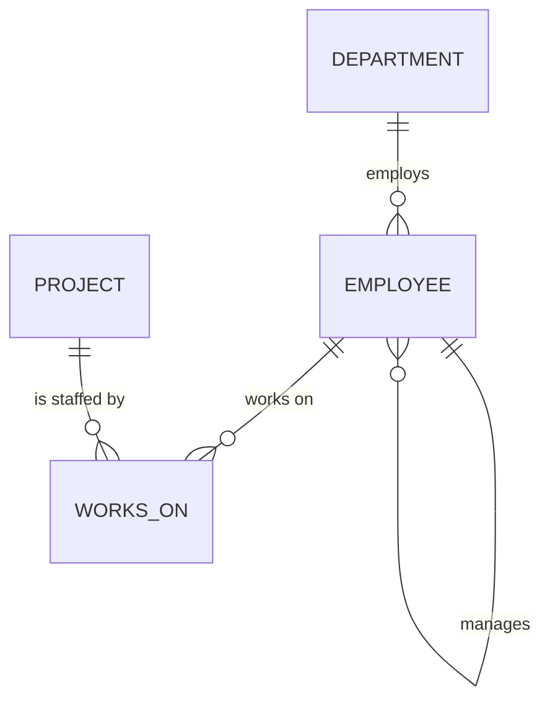
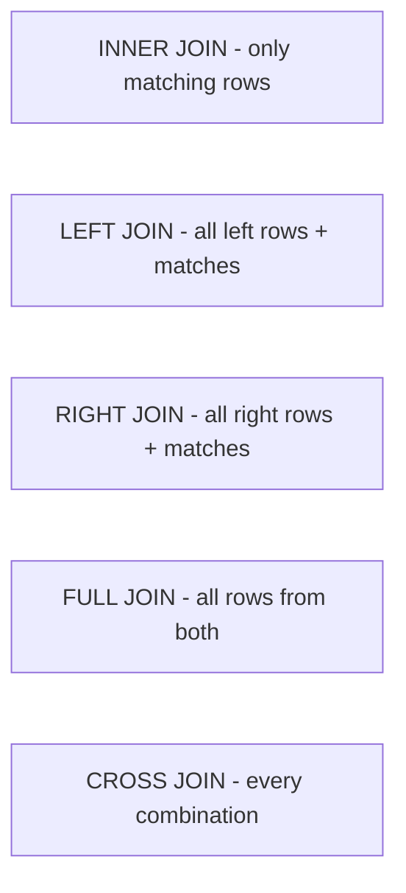

=== SQL Overview, Command Categories and the Sample Database
difficulty: easy
---
**SQL (Structured Query Language)** is the standard language for relational databases. It was developed at IBM in the 1970s (originally *SEQUEL*) and standardized by ANSI/ISO. It is **declarative**: you describe *what* data you want, and the DBMS's optimizer decides *how* to get it. Oracle, MySQL, PostgreSQL and SQL Server all speak SQL, each with its own extensions (Oracle's procedural extension is **PL/SQL**).

SQL statements are **not case-sensitive** (keywords, table and column names), but **string literals are**: `'Mumbai'` ≠ `'MUMBAI'`. Statements end with a semicolon.

### Categories of SQL commands

| Category | Purpose | Commands |
|---|---|---|
| **DDL** — Data Definition Language | Create and change the structure (schema) | CREATE, ALTER, DROP, TRUNCATE, RENAME, COMMENT |
| **DML** — Data Manipulation Language | Change the data | INSERT, UPDATE, DELETE, MERGE |
| **DQL** — Data Query Language | Read the data | SELECT |
| **DCL** — Data Control Language | Permissions | GRANT, REVOKE |
| **TCL** — Transaction Control Language | Manage transactions | COMMIT, ROLLBACK, SAVEPOINT |

Many books (including Shah's) count SELECT as DML. **DDL commits automatically** in Oracle; DML changes are not permanent until COMMIT.

### The sample database used in this guide
Every query in this guide runs against this small company database:



```sql
SELECT * FROM department ORDER BY dept_id;
```

```text
dept_id | dept_name | location
--------+-----------+----------
10      | HR        | Delhi
20      | IT        | Bengaluru
30      | Sales     | Mumbai
40      | Research  | Pune
```

```sql
SELECT * FROM employee ORDER BY emp_id;
```

```text
emp_id | name         | dept_id | manager_id | salary | hire_date  | commission
-------+--------------+---------+------------+--------+------------+-----------
101    | Rahul Mehta  | 20      | NULL       | 150000 | 2015-04-01 | NULL
102    | Priya Sharma | 20      | 101        | 95000  | 2017-06-15 | NULL
103    | Arjun Nair   | 20      | 102        | 72000  | 2019-01-10 | NULL
104    | Sneha Iyer   | 30      | 101        | 88000  | 2016-09-01 | 5000
105    | Vikram Rao   | 30      | 104        | 61000  | 2020-02-20 | 3000
106    | Neha Gupta   | 10      | 101        | 67000  | 2018-11-05 | NULL
107    | Karan Singh  | 30      | 104        | 61000  | 2021-07-12 | 2000
108    | Meera Joshi  | NULL    | 102        | 54000  | 2023-03-01 | NULL
```

```sql
SELECT p.proj_id, p.proj_name, w.emp_id, w.hours
FROM project p JOIN works_on w ON w.proj_id = p.proj_id
ORDER BY p.proj_id, w.emp_id;
```

```text
proj_id | proj_name      | emp_id | hours
--------+----------------+--------+------
1       | Payroll System | 102    | 10
1       | Payroll System | 103    | 30
2       | CRM Upgrade    | 102    | 15
2       | CRM Upgrade    | 105    | 25
2       | CRM Upgrade    | 107    | 40
3       | Data Warehouse | 102    | 5
3       | Data Warehouse | 103    | 20
3       | Data Warehouse | 108    | 35
```

Things worth noticing — many interview queries depend on them:
- **Rahul Mehta (101)** has no manager (`manager_id` NULL) — he is the CEO.
- **Meera Joshi (108)** has **no department** (`dept_id` NULL).
- **Research (40)** has **no employees**.
- **Vikram Rao and Karan Singh both earn 61000** — a tie, useful for RANK vs DENSE_RANK.
- Only the Sales staff have a **commission**; for others it is NULL.
- Employees 101, 104 and 106 work on **no project**.

The full schema:

```sql
-- not run (shown for reference; it is the setup script)
CREATE TABLE department (
  dept_id   INT PRIMARY KEY,
  dept_name VARCHAR(30) NOT NULL UNIQUE,
  location  VARCHAR(30)
);
CREATE TABLE employee (
  emp_id     INT PRIMARY KEY,
  name       VARCHAR(40) NOT NULL,
  dept_id    INT REFERENCES department(dept_id),
  manager_id INT REFERENCES employee(emp_id),
  salary     INT CHECK (salary > 0),
  hire_date  DATE,
  commission INT
);
CREATE TABLE project  (proj_id INT PRIMARY KEY, proj_name VARCHAR(40) NOT NULL);
CREATE TABLE works_on (
  emp_id  INT REFERENCES employee(emp_id),
  proj_id INT REFERENCES project(proj_id),
  hours   INT,
  PRIMARY KEY (emp_id, proj_id)
);
```

> All queries were executed on PostgreSQL; outputs are exactly what the database returned. Where Oracle syntax differs (VARCHAR2, NUMBER, NVL, ROWNUM, MINUS, DECODE ...) it is pointed out in the text. Blocks labelled PL/SQL are Oracle-only.

**Key points:**
- SQL is declarative and standardized; vendors add extensions (PL/SQL, T-SQL).
- DDL = structure, DML = data, DQL = SELECT, DCL = permissions, TCL = transactions.
- Keywords are case-insensitive; string comparisons are case-sensitive.

=== Data Types and CREATE TABLE with Constraints
difficulty: easy
---
### Common data types

| Purpose | Oracle | Standard / MySQL / PostgreSQL |
|---|---|---|
| Variable-length text | **VARCHAR2(n)** | VARCHAR(n) |
| Fixed-length text | CHAR(n) — padded with spaces | CHAR(n) |
| Integer | NUMBER(p) / INTEGER | INT, BIGINT, SMALLINT |
| Decimal | **NUMBER(p, s)** — p = total digits, s = digits after the point | DECIMAL(p, s) / NUMERIC(p, s) |
| Date | **DATE** (stores date *and* time) | DATE (date only) |
| Date + time | TIMESTAMP | TIMESTAMP |
| Large text | CLOB | TEXT |
| Binary | BLOB, RAW | BYTEA, BLOB |

- **CHAR vs VARCHAR2:** CHAR(10) always uses 10 characters (pads 'Ram' to 'Ram       '); VARCHAR2(10) stores only what is given. Use CHAR only for truly fixed-length codes (gender 'M'/'F', state codes).
- **NUMBER(7,2)** stores up to 99999.99 — 7 digits in total, 2 after the decimal point.
- In Oracle, VARCHAR is currently a synonym for VARCHAR2, but Oracle recommends VARCHAR2.

### CREATE TABLE
```sql
CREATE TABLE student (
  student_id  INT          PRIMARY KEY,
  name        VARCHAR(40)  NOT NULL,
  email       VARCHAR(60)  UNIQUE,
  gender      CHAR(1)      CHECK (gender IN ('M', 'F')),
  dept_id     INT          REFERENCES department(dept_id),
  cgpa        DECIMAL(4,2) DEFAULT 0 CHECK (cgpa BETWEEN 0 AND 10),
  joined_on   DATE         DEFAULT CURRENT_DATE
);
INSERT INTO student (student_id, name, email, gender, dept_id)
VALUES (1, 'Asha Rao', 'asha@college.edu', 'F', 20);
SELECT student_id, name, gender, dept_id, cgpa FROM student;
```

```text
student_id | name     | gender | dept_id | cgpa
-----------+----------+--------+---------+-----
1          | Asha Rao | F      | 20      | 0.00
```

The omitted `cgpa` took its DEFAULT. (In Oracle use `SYSDATE` instead of `CURRENT_DATE`, and VARCHAR2/NUMBER types.)

### Named, table-level constraints
Constraints can be written next to a column (**column level**) or after all columns (**table level**). Composite keys must be table level. **Naming** constraints makes errors readable and allows dropping them later; Oracle otherwise invents names like SYS_C007341.

```sql
CREATE TABLE enrollment (
  student_id INT,
  course_id  INT,
  grade      CHAR(2),
  CONSTRAINT enrollment_pk PRIMARY KEY (student_id, course_id),
  CONSTRAINT enrollment_grade_ck CHECK (grade IN ('A','B','C','D','F'))
);
INSERT INTO enrollment VALUES (1, 10, 'A');
INSERT INTO enrollment VALUES (1, 10, 'B');   -- same key again
```

```text
ERROR: duplicate key value violates unique constraint "enrollment_pk"
```

### Constraint violations you should recognize
- Inserting a NULL into a NOT NULL column → error.
- Inserting `dept_id = 99` when department 99 doesn't exist → **foreign key violation** (Oracle: ORA-02291 *parent key not found*).
- Deleting a department that still has employees → ORA-02292 *child record found* (unless ON DELETE CASCADE / SET NULL).
- `salary = -5` → CHECK violation.

### Creating a table from a query
```sql
CREATE TABLE it_staff AS
SELECT emp_id, name, salary FROM employee WHERE dept_id = 20;
SELECT * FROM it_staff ORDER BY emp_id;
```

```text
emp_id | name         | salary
-------+--------------+-------
101    | Rahul Mehta  | 150000
102    | Priya Sharma | 95000
103    | Arjun Nair   | 72000
```

**CREATE TABLE ... AS SELECT (CTAS)** copies the structure and rows (and NOT NULL constraints) but **not** primary keys, foreign keys, UNIQUE or CHECK constraints or indexes. `WHERE 1 = 0` copies only the structure.

**Key points:**
- Oracle: VARCHAR2 and NUMBER(p,s); DATE includes time.
- CHAR is fixed-length (padded), VARCHAR2 is variable-length.
- Constraints: PRIMARY KEY, FOREIGN KEY, UNIQUE, NOT NULL, CHECK (+ DEFAULT); name them.
- CTAS copies data and NOT NULL, but not keys or indexes.

=== ALTER, DROP, TRUNCATE: DELETE vs TRUNCATE vs DROP
difficulty: easy
---
### ALTER TABLE
Changes the structure of an existing table:

```sql
-- Oracle
ALTER TABLE employee ADD (email VARCHAR2(60));                 -- add a column
ALTER TABLE employee MODIFY (name VARCHAR2(60));               -- change type/size
ALTER TABLE employee DROP COLUMN email;                        -- remove a column
ALTER TABLE employee RENAME COLUMN name TO full_name;          -- rename a column
ALTER TABLE employee ADD CONSTRAINT emp_sal_ck CHECK (salary < 1000000);
ALTER TABLE employee DROP CONSTRAINT emp_sal_ck;
ALTER TABLE employee DISABLE CONSTRAINT emp_dept_fk;           -- temporarily
RENAME employee TO staff;                                      -- rename a table
```

The standard/PostgreSQL forms differ only slightly (`ADD COLUMN`, `ALTER COLUMN ... TYPE`):

```sql
ALTER TABLE department ADD COLUMN budget INT DEFAULT 500000;
ALTER TABLE department ALTER COLUMN location TYPE VARCHAR(50);
ALTER TABLE department RENAME COLUMN location TO city;
SELECT * FROM department ORDER BY dept_id;
```

```text
dept_id | dept_name | city      | budget
--------+-----------+-----------+-------
10      | HR        | Delhi     | 500000
20      | IT        | Bengaluru | 500000
30      | Sales     | Mumbai    | 500000
40      | Research  | Pune      | 500000
```

Rules to remember: you can always **increase** a column's width; **decreasing** it or changing its type requires the existing data to fit (or the column to be empty); a **NOT NULL** column can be added to a non-empty table only with a DEFAULT.

### DROP TABLE
Removes the table **structure and data**, plus its indexes, constraints and triggers. Views and synonyms on it become invalid.
- A table referenced by foreign keys cannot be dropped; Oracle's `DROP TABLE department CASCADE CONSTRAINTS` drops those foreign keys first.
- Oracle 10g+ moves dropped tables to the **recycle bin** (`FLASHBACK TABLE t TO BEFORE DROP` restores it) unless you add **PURGE**.

### TRUNCATE TABLE
Removes **all rows** but keeps the structure — very fast, because it deallocates the storage instead of deleting row by row.

### DELETE vs TRUNCATE vs DROP — a classic interview question

| | DELETE | TRUNCATE | DROP |
|---|---|---|---|
| Type | **DML** | **DDL** | **DDL** |
| Removes | Selected rows (WHERE) or all | **All** rows | Rows **and** structure |
| WHERE clause | Yes | No | No |
| Rollback | **Yes** (before COMMIT) | **No** in Oracle (auto-commit) | No (only flashback/recycle bin) |
| Triggers fired | Yes (DELETE triggers) | No | No |
| Speed | Slow — logs every row | Fast — minimal undo | Fast |
| Storage | Space stays allocated | Space released, high-water mark reset | Everything released |
| Identity / auto-increment | Not reset | Reset (in most DBMSs) | Gone |

```sql
DELETE FROM works_on WHERE hours < 20;          -- DML: only some rows
SELECT COUNT(*) AS remaining FROM works_on;
```

```text
remaining
---------
5
```

> In PostgreSQL and SQL Server, TRUNCATE can be rolled back inside an explicit transaction; in Oracle and MySQL it commits immediately. When answering in an interview, say "in Oracle".

**Key points:**
- ALTER TABLE adds, modifies, renames and drops columns and constraints.
- DELETE = DML, row by row, WHERE allowed, can roll back, fires triggers.
- TRUNCATE = DDL, all rows, fast, no rollback in Oracle, keeps the structure.
- DROP = removes the table itself (Oracle: recycle bin unless PURGE).

=== DML: INSERT, UPDATE, DELETE and MERGE
difficulty: easy
---
### INSERT
```sql
-- 1. All columns, in table order
INSERT INTO department VALUES (50, 'Finance', 'Chennai');
-- 2. Named columns (safer: survives column reordering); omitted columns get DEFAULT or NULL
INSERT INTO department (dept_id, dept_name) VALUES (60, 'Legal');
-- 3. Multiple rows from a query (no VALUES keyword)
CREATE TABLE dept_archive (dept_id INT, dept_name VARCHAR(30));
INSERT INTO dept_archive SELECT dept_id, dept_name FROM department WHERE dept_id >= 50;
SELECT * FROM dept_archive ORDER BY dept_id;
```

```text
dept_id | dept_name
--------+----------
50      | Finance
60      | Legal
```

- Character and date values go in **single quotes**. To insert a quote, double it: `'O''Brien'`.
- Oracle SQL*Plus supports **substitution variables** for interactive inserts: `VALUES (&dept_id, '&dept_name')` prompts for each value.
- Multi-row `VALUES (...), (...)` works in MySQL/PostgreSQL/SQL Server and Oracle 23c; older Oracle uses `INSERT ALL` or INSERT ... SELECT.

### UPDATE
```sql
-- 10% raise for the Sales department
UPDATE employee SET salary = salary * 1.10 WHERE dept_id = 30;
SELECT emp_id, name, salary FROM employee WHERE dept_id = 30 ORDER BY emp_id;
```

```text
emp_id | name        | salary
-------+-------------+-------
104    | Sneha Iyer  | 96800
105    | Vikram Rao  | 67100
107    | Karan Singh | 67100
```

**Always check the WHERE clause** — `UPDATE employee SET salary = 0;` updates every row. Several columns can be set at once (`SET salary = ..., commission = ...`), and the new value may come from a subquery:

```sql
-- Give Meera (no department) the department of her manager
UPDATE employee
SET dept_id = (SELECT m.dept_id FROM employee m WHERE m.emp_id = employee.manager_id)
WHERE dept_id IS NULL;
SELECT emp_id, name, dept_id FROM employee WHERE emp_id = 108;
```

```text
emp_id | name        | dept_id
-------+-------------+--------
108    | Meera Joshi | 20
```

### DELETE
```sql
DELETE FROM works_on WHERE emp_id = 102;
SELECT COUNT(*) AS rows_left FROM works_on;
```

```text
rows_left
---------
5
```

DELETE without WHERE removes every row (but, unlike TRUNCATE, can be rolled back). Deleting a parent row that still has children fails unless the foreign key says ON DELETE CASCADE / SET NULL.

### MERGE (upsert)
**MERGE** inserts a row if it doesn't exist and updates it if it does — in one statement. Typical use: syncing a staging table into a master table.

```sql
CREATE TABLE salary_changes (emp_id INT, new_salary INT);
INSERT INTO salary_changes VALUES (103, 80000), (109, 45000);

MERGE INTO employee e
USING salary_changes s ON (e.emp_id = s.emp_id)
WHEN MATCHED THEN
  UPDATE SET salary = s.new_salary
WHEN NOT MATCHED THEN
  INSERT (emp_id, name, salary) VALUES (s.emp_id, 'New Joinee', s.new_salary);

SELECT emp_id, name, salary FROM employee WHERE emp_id IN (103, 109) ORDER BY emp_id;
```

```text
emp_id | name       | salary
-------+------------+-------
103    | Arjun Nair | 80000
109    | New Joinee | 45000
```

(The same syntax works in Oracle 9i+, SQL Server and PostgreSQL 15+. MySQL uses `INSERT ... ON DUPLICATE KEY UPDATE`; PostgreSQL also has `INSERT ... ON CONFLICT DO UPDATE`.)

**Key points:**
- Name the columns in INSERT; use INSERT ... SELECT to copy rows.
- UPDATE/DELETE without WHERE affect every row.
- Values can come from subqueries (correlated subqueries in UPDATE).
- MERGE = update if matched, insert if not (upsert).

=== SELECT Basics: Columns, Aliases, DISTINCT and Expressions
difficulty: easy
---
```sql
-- not run (syntax)
SELECT [DISTINCT] column | expression [AS alias], ...
FROM   table
[WHERE condition]
[GROUP BY columns]
[HAVING group_condition]
[ORDER BY columns [ASC | DESC]];
```

Only SELECT and FROM are required (Oracle requires FROM even for a calculation: `SELECT 2 * 3 FROM dual;` — **DUAL** is a one-row dummy table).

### Columns, expressions and aliases
```sql
SELECT name,
       salary,
       salary * 12        AS annual_salary,
       salary * 0.10      AS "Bonus 10%",
       'Emp-' || emp_id   AS code
FROM employee
WHERE dept_id = 20
ORDER BY emp_id;
```

```text
name         | salary | annual_salary | Bonus 10% | code
-------------+--------+---------------+-----------+--------
Rahul Mehta  | 150000 | 1800000       | 15000.00  | Emp-101
Priya Sharma | 95000  | 1140000       | 9500.00   | Emp-102
Arjun Nair   | 72000  | 864000        | 7200.00   | Emp-103
```

- **Column alias** — renames a column in the output; `AS` is optional. Use **double quotes** for aliases with spaces, special characters or case to preserve.
- **`||`** concatenates strings (Oracle, PostgreSQL); MySQL/SQL Server use `CONCAT()` / `+`.
- **Arithmetic precedence:** `*` and `/` before `+` and `-`; use parentheses.
- An alias **cannot be used in WHERE** (WHERE runs before SELECT — see "Logical Query Processing Order"), but can be used in ORDER BY.

### NULL in arithmetic
**Any arithmetic with NULL gives NULL.** Total pay = salary + commission is NULL for everyone without a commission:

```sql
SELECT name, salary, commission,
       salary + commission               AS wrong_total,
       salary + COALESCE(commission, 0)  AS total_pay
FROM employee
WHERE dept_id IN (20, 30)
ORDER BY emp_id;
```

```text
name         | salary | commission | wrong_total | total_pay
-------------+--------+------------+-------------+----------
Rahul Mehta  | 150000 | NULL       | NULL        | 150000
Priya Sharma | 95000  | NULL       | NULL        | 95000
Arjun Nair   | 72000  | NULL       | NULL        | 72000
Sneha Iyer   | 88000  | 5000       | 93000       | 93000
Vikram Rao   | 61000  | 3000       | 64000       | 64000
Karan Singh  | 61000  | 2000       | 63000       | 63000
```

Oracle's equivalent of `COALESCE(commission, 0)` is **`NVL(commission, 0)`** (see "Handling NULL").

### DISTINCT
Removes duplicate **rows** from the result. With several columns, the *combination* must be unique.

```sql
SELECT DISTINCT dept_id FROM employee ORDER BY dept_id;
```

```text
dept_id
-------
10
20
30
NULL
```

Note that NULL appears once — DISTINCT treats NULLs as equal to each other. (`SELECT DISTINCT dept_id, manager_id` would return each distinct pair.)

### SELECT * — use with care
`SELECT *` returns every column. Fine for exploring, but in application code list the columns: it reads only needed data, is robust to added columns and documents intent.

**Key points:**
- Aliases rename output columns; quote them for spaces; not usable in WHERE.
- `||` concatenates; Oracle needs `FROM dual` for table-less SELECTs.
- NULL + anything = NULL — use NVL/COALESCE.
- DISTINCT works on the whole row.

=== Filtering and Sorting: WHERE, BETWEEN, IN, LIKE and ORDER BY
difficulty: easy
---
### Comparison and logical operators

| Operator | Meaning |
|---|---|
| `=`, `<>` (or `!=`), `>`, `<`, `>=`, `<=` | Comparison |
| `BETWEEN a AND b` | Inclusive range a ≤ x ≤ b |
| `IN (list)` | Equals any value in the list |
| `LIKE pattern` | Pattern match |
| `IS NULL` / `IS NOT NULL` | NULL test (never `= NULL`) |
| `AND`, `OR`, `NOT` | Logical operators |

```sql
SELECT name, salary FROM employee
WHERE salary BETWEEN 60000 AND 90000
ORDER BY salary DESC, name;
```

```text
name        | salary
------------+-------
Sneha Iyer  | 88000
Arjun Nair  | 72000
Neha Gupta  | 67000
Karan Singh | 61000
Vikram Rao  | 61000
```

BETWEEN is **inclusive**, and the lower value must come first (`BETWEEN 90000 AND 60000` returns nothing). The `ORDER BY salary DESC, name` breaks the 61000 tie alphabetically.

### LIKE wildcards
- `%` — any sequence of zero or more characters.
- `_` — exactly one character.

```sql
SELECT name FROM employee
WHERE name LIKE '%a %'     -- first name ends with 'a'
   OR name LIKE '_r%'      -- second letter is 'r'
ORDER BY name;
```

```text
name
------------
Arjun Nair
Meera Joshi
Neha Gupta
Priya Sharma
Sneha Iyer
```

To search for a literal `%` or `_`, use an escape character: `WHERE code LIKE 'A\_%' ESCAPE '\'`.

### AND/OR precedence
**NOT** is evaluated first, then **AND**, then **OR**. This query looks like "IT or Sales employees earning over 80000", but is not:

```sql
SELECT name, dept_id, salary FROM employee
WHERE dept_id = 20 OR dept_id = 30 AND salary > 80000
ORDER BY emp_id;
```

```text
name         | dept_id | salary
-------------+---------+-------
Rahul Mehta  | 20      | 150000
Priya Sharma | 20      | 95000
Arjun Nair   | 20      | 72000
Sneha Iyer   | 30      | 88000
```

It was read as `dept_id = 20 OR (dept_id = 30 AND salary > 80000)`, so every IT employee appears. Use parentheses — or IN:

```sql
SELECT name, dept_id, salary FROM employee
WHERE dept_id IN (20, 30) AND salary > 80000
ORDER BY emp_id;
```

```text
name         | dept_id | salary
-------------+---------+-------
Rahul Mehta  | 20      | 150000
Priya Sharma | 20      | 95000
Sneha Iyer   | 30      | 88000
```

### ORDER BY
- Default is **ASC**; add **DESC** per column.
- Sort by a column, an expression, an alias, or a column **position** (`ORDER BY 2`).
- You can sort by a column not in the SELECT list (unless DISTINCT is used).
- **NULLs:** Oracle and PostgreSQL treat NULL as the **largest** value (last in ASC, first in DESC); MySQL and SQL Server treat it as smallest. Override with `NULLS FIRST` / `NULLS LAST` (Oracle, PostgreSQL).

```sql
SELECT name, commission FROM employee
ORDER BY commission DESC NULLS LAST, name
LIMIT 4;
```

```text
name        | commission
------------+-----------
Sneha Iyer  | 5000
Vikram Rao  | 3000
Karan Singh | 2000
Arjun Nair  | NULL
```

(LIMIT is PostgreSQL/MySQL; see "Top-N Queries" for Oracle's ROWNUM and FETCH FIRST.)

**Without ORDER BY the order of rows is not guaranteed** — never rely on insertion order.

**Key points:**
- BETWEEN is inclusive; IN replaces chains of OR; LIKE uses % and _.
- NOT > AND > OR — use parentheses.
- ORDER BY supports DESC, multiple columns, aliases and positions.
- Oracle sorts NULLs last in ascending order; use NULLS FIRST/LAST to control it.

=== Handling NULL: Three-Valued Logic, NVL, COALESCE, NULLIF
difficulty: medium
---
**NULL means "unknown" or "not applicable"** — not zero, not an empty string. (Oracle is unusual: it treats the **empty string '' as NULL**.)

### Three-valued logic
A comparison with NULL is neither TRUE nor FALSE but **UNKNOWN**, and WHERE keeps only TRUE rows. So `NULL = NULL` is unknown, and `commission <> 5000` does **not** return the employees with NULL commission.

```sql
SELECT
  (SELECT COUNT(*) FROM employee WHERE commission = NULL)   AS eq_null,
  (SELECT COUNT(*) FROM employee WHERE commission IS NULL)  AS is_null,
  (SELECT COUNT(*) FROM employee WHERE commission <> 5000)  AS not_5000,
  (SELECT COUNT(*) FROM employee)                           AS total;
```

```text
eq_null | is_null | not_5000 | total
--------+---------+----------+------
0       | 5       | 2        | 8
```

8 employees, yet `<> 5000` returns only 2 — the 5 NULL rows are UNKNOWN. And `= NULL` never matches anything; always use **IS NULL / IS NOT NULL**.

Truth tables (T = true, F = false, U = unknown): `U AND F = F`, `U AND T = U`, `U OR T = T`, `U OR F = U`, `NOT U = U`.

### NULL-handling functions

| Function | Returns | Availability |
|---|---|---|
| **NVL(a, b)** | b if a is NULL, else a | Oracle (MySQL: IFNULL, SQL Server: ISNULL) |
| **NVL2(a, b, c)** | b if a is **not** NULL, c if it is | Oracle |
| **COALESCE(a, b, c, ...)** | The first non-NULL argument | Standard — everywhere |
| **NULLIF(a, b)** | NULL if a = b, else a | Standard |

```sql
SELECT name,
       commission,
       COALESCE(commission, 0)                                  AS nvl_style,
       CASE WHEN commission IS NOT NULL THEN 'Yes' ELSE 'No' END AS nvl2_style,
       NULLIF(salary, 61000)                                    AS nullif_61000
FROM employee
WHERE dept_id = 30
ORDER BY emp_id;
```

```text
name        | commission | nvl_style | nvl2_style | nullif_61000
------------+------------+-----------+------------+-------------
Sneha Iyer  | 5000       | 5000      | Yes        | 88000
Vikram Rao  | 3000       | 3000      | Yes        | NULL
Karan Singh | 2000       | 2000      | Yes        | NULL
```

In Oracle the second and third columns are simply `NVL(commission, 0)` and `NVL2(commission, 'Yes', 'No')`. A classic use of NULLIF is avoiding division by zero: `total / NULLIF(count, 0)` returns NULL instead of an error.

### NULL in other places
- **Aggregates ignore NULLs** — `COUNT(commission)` counts only non-NULL values, and `AVG(commission)` divides by that count, not by the number of rows (see "Aggregate Functions").
- **GROUP BY** puts all NULLs into **one group**.
- **DISTINCT / UNION** treat NULLs as duplicates of each other.
- **UNIQUE constraints** allow multiple NULLs (in Oracle, PostgreSQL, MySQL; SQL Server allows only one).
- **NOT IN with a NULL in the list returns no rows** — see "Correlated Subqueries, EXISTS and the NOT IN Trap".

**Key points:**
- Any comparison with NULL is UNKNOWN; WHERE keeps only TRUE.
- Use IS NULL / IS NOT NULL, never = NULL.
- NVL/NVL2 (Oracle), COALESCE and NULLIF (standard) handle NULLs.
- Aggregates ignore NULLs; GROUP BY puts NULLs together.

=== Single-Row Functions: String, Number, Date, Conversion and CASE
difficulty: medium
---
**Single-row functions** return one result per row (as opposed to aggregate/group functions, which return one result per group).

### Character functions
| Function | Example | Result |
|---|---|---|
| UPPER / LOWER / INITCAP | INITCAP('rahul MEHTA') | Rahul Mehta |
| LENGTH | LENGTH('Oracle') | 6 |
| SUBSTR(s, start, len) | SUBSTR('Database', 1, 4) | Data |
| INSTR(s, sub) (Oracle) | INSTR('Database', 'base') | 5 |
| LPAD / RPAD | LPAD('42', 5, '0') | 00042 |
| TRIM / LTRIM / RTRIM | TRIM('  hi  ') | hi |
| REPLACE | REPLACE('2024-01-05', '-', '/') | 2024/01/05 |
| CONCAT / `\|\|` | 'A' \|\| 'B' | AB |

```sql
SELECT name,
       UPPER(name)                             AS upper_name,
       LENGTH(name)                            AS len,
       SUBSTR(name, 1, POSITION(' ' IN name) - 1) AS first_name,
       LPAD(emp_id::text, 6, '0')              AS padded_id
FROM employee
WHERE emp_id <= 103
ORDER BY emp_id;
```

```text
name         | upper_name   | len | first_name | padded_id
-------------+--------------+-----+------------+----------
Rahul Mehta  | RAHUL MEHTA  | 11  | Rahul      | 000101
Priya Sharma | PRIYA SHARMA | 12  | Priya      | 000102
Arjun Nair   | ARJUN NAIR   | 10  | Arjun      | 000103
```

(Oracle: `INSTR(name, ' ')` instead of `POSITION(' ' IN name)`, and `TO_CHAR(emp_id)` instead of `emp_id::text`.)

### Number functions
| Function | Example | Result |
|---|---|---|
| ROUND(n, d) | ROUND(1234.567, 1) / ROUND(1234.567, -2) | 1234.6 / 1200 |
| TRUNC(n, d) | TRUNC(1234.567, 1) | 1234.5 |
| MOD(m, n) | MOD(17, 5) | 2 |
| CEIL / FLOOR | CEIL(4.1) / FLOOR(4.9) | 5 / 4 |
| ABS, POWER, SQRT, SIGN | POWER(2, 10) | 1024 |

```sql
SELECT ROUND(1234.567, 1) AS r1, ROUND(1234.567, -2) AS r2,
       TRUNC(1234.567, 1) AS t1, MOD(17, 5) AS m,
       CEIL(4.1) AS c, FLOOR(4.9) AS f;
```

```text
r1     | r2   | t1     | m | c | f
-------+------+--------+---+---+--
1234.6 | 1200 | 1234.5 | 2 | 5 | 4
```

A negative precision rounds to the left of the decimal point (tens, hundreds...).

### Date functions (Oracle)
Oracle DATE stores date and time. `SYSDATE` returns the current date/time, and **date arithmetic works in days**: `hire_date + 30`, `SYSDATE - hire_date` (days employed).

| Oracle function | Purpose |
|---|---|
| SYSDATE / SYSTIMESTAMP | Current date-time |
| ADD_MONTHS(d, n) | Add n months |
| MONTHS_BETWEEN(d1, d2) | Months between two dates |
| LAST_DAY(d) | Last day of d's month |
| NEXT_DAY(d, 'FRIDAY') | Next Friday after d |
| EXTRACT(YEAR FROM d) | Part of a date (standard) |
| ROUND(d, 'MONTH') / TRUNC(d, 'YEAR') | Round/truncate dates |

### Conversion functions
- **TO_CHAR(date, format)** — date → text: `TO_CHAR(hire_date, 'DD-Mon-YYYY')`, `'Month DD, YYYY'`, `'Day'`.
- **TO_CHAR(number, format)** — `TO_CHAR(150000, '99,99,999')`.
- **TO_DATE(text, format)** — text → date: `TO_DATE('15-06-2017', 'DD-MM-YYYY')`.
- **TO_NUMBER(text)** — text → number.

TO_CHAR works the same way in PostgreSQL:

```sql
SELECT name,
       TO_CHAR(hire_date, 'DD-Mon-YYYY')  AS hired,
       TO_CHAR(hire_date, 'FMMonth YYYY') AS month_year,
       EXTRACT(YEAR FROM hire_date)       AS yr
FROM employee
WHERE hire_date < DATE '2018-01-01'
ORDER BY hire_date;
```

```text
name         | hired       | month_year     | yr
-------------+-------------+----------------+-----
Rahul Mehta  | 01-Apr-2015 | April 2015     | 2015
Sneha Iyer   | 01-Sep-2016 | September 2016 | 2016
Priya Sharma | 15-Jun-2017 | June 2017      | 2017
```

Avoid relying on **implicit conversion** (`WHERE hire_date = '01-APR-15'` depends on the session's date format); convert explicitly with TO_DATE or use ANSI literals `DATE '2015-04-01'`.

### CASE expression (and Oracle's DECODE)
CASE adds if-then-else logic to SQL. **Searched CASE** tests conditions; **simple CASE** compares one expression with values.

```sql
SELECT name, salary,
       CASE
         WHEN salary >= 100000 THEN 'Senior'
         WHEN salary >= 70000  THEN 'Mid'
         ELSE 'Junior'
       END AS band,
       CASE dept_id WHEN 20 THEN 'Tech' WHEN 30 THEN 'Business' ELSE 'Other' END AS area
FROM employee
ORDER BY salary DESC, name;
```

```text
name         | salary | band   | area
-------------+--------+--------+---------
Rahul Mehta  | 150000 | Senior | Tech
Priya Sharma | 95000  | Mid    | Tech
Sneha Iyer   | 88000  | Mid    | Business
Arjun Nair   | 72000  | Mid    | Tech
Neha Gupta   | 67000  | Junior | Other
Karan Singh  | 61000  | Junior | Business
Vikram Rao   | 61000  | Junior | Business
Meera Joshi  | 54000  | Junior | Other
```

- WHEN conditions are checked **top to bottom**; the first match wins.
- Without ELSE, unmatched rows get NULL (Meera's NULL dept_id is "Other" only because of the ELSE).
- Oracle's older **DECODE** is a compact simple CASE: `DECODE(dept_id, 20, 'Tech', 30, 'Business', 'Other')`.

**Key points:**
- Single-row functions: one output per row — character, number, date, conversion, general.
- ROUND vs TRUNC; negative precision rounds to tens/hundreds.
- Oracle date arithmetic is in days; TO_CHAR/TO_DATE convert with format models.
- CASE (standard) and DECODE (Oracle) provide conditional logic.

=== Aggregate Functions, GROUP BY and HAVING
difficulty: medium
---
**Aggregate (group) functions** take many rows and return **one value**: COUNT, SUM, AVG, MIN, MAX (plus STDDEV and VARIANCE).

```sql
SELECT COUNT(*)           AS employees,
       COUNT(commission)  AS with_commission,
       COUNT(DISTINCT dept_id) AS departments,
       SUM(salary)        AS payroll,
       ROUND(AVG(salary)) AS avg_salary,
       MIN(hire_date)     AS first_hire,
       MAX(salary)        AS top_salary
FROM employee;
```

```text
employees | with_commission | departments | payroll | avg_salary | first_hire | top_salary
----------+-----------------+-------------+---------+------------+------------+-----------
8         | 3               | 3           | 648000  | 81000      | 2015-04-01 | 150000
```

- **COUNT(\*)** counts rows; **COUNT(column)** counts **non-NULL** values; **COUNT(DISTINCT column)** counts distinct non-NULL values (Meera's NULL department is not counted).
- All aggregates except COUNT(\*) **ignore NULLs**. `AVG(commission)` averages only the 3 Sales employees (3333.33), whereas `AVG(COALESCE(commission, 0))` averages over all 8 (1250).
- SUM/AVG need numbers; MIN/MAX also work on text and dates.

### GROUP BY
GROUP BY splits rows into groups with equal values, and the aggregates are computed **per group**:

```sql
SELECT dept_id, COUNT(*) AS headcount, SUM(salary) AS total, MAX(salary) AS highest
FROM employee
GROUP BY dept_id
ORDER BY dept_id;
```

```text
dept_id | headcount | total  | highest
--------+-----------+--------+--------
10      | 1         | 67000  | 67000
20      | 3         | 317000 | 150000
30      | 3         | 210000 | 88000
NULL    | 1         | 54000  | 54000
```

NULL forms its own group (Meera). Research (40) does not appear — it has no employee rows (an outer join would be needed; see "Joins").

**The golden rule:** every column in the SELECT list must either be **in GROUP BY** or **inside an aggregate**. `SELECT dept_id, name, COUNT(*) ... GROUP BY dept_id` is an error (Oracle: ORA-00979 *not a GROUP BY expression*) — which name would the group show?

### HAVING
**WHERE filters rows before grouping; HAVING filters groups after grouping**, so conditions on aggregates go in HAVING:

```sql
SELECT dept_id, COUNT(*) AS headcount, ROUND(AVG(salary)) AS avg_salary
FROM employee
WHERE hire_date >= DATE '2016-01-01'      -- row filter (before grouping)
GROUP BY dept_id
HAVING COUNT(*) >= 2                      -- group filter (after grouping)
ORDER BY avg_salary DESC;
```

```text
dept_id | headcount | avg_salary
--------+-----------+-----------
20      | 2         | 83500
30      | 3         | 70000
```

Rahul (hired 2015) was removed by WHERE before IT's group was formed; HR and Meera's NULL group have only one employee each and were removed by HAVING.

| WHERE | HAVING |
|---|---|
| Filters individual **rows** | Filters **groups** |
| Runs **before** GROUP BY | Runs **after** GROUP BY |
| **Cannot** use aggregate functions | Usually uses aggregate functions |
| Works without GROUP BY | Normally used with GROUP BY |

Put a condition in WHERE whenever possible — it reduces the rows before the expensive grouping step.

### Grouping by several columns and nested aggregates

```sql
SELECT e.dept_id, w.proj_id, SUM(w.hours) AS hours
FROM employee e JOIN works_on w ON w.emp_id = e.emp_id
GROUP BY e.dept_id, w.proj_id
ORDER BY e.dept_id, w.proj_id;
```

```text
dept_id | proj_id | hours
--------+---------+------
20      | 1       | 40
20      | 2       | 15
20      | 3       | 25
30      | 2       | 65
NULL    | 3       | 35
```

Oracle allows nesting two group functions: `SELECT MAX(AVG(salary)) FROM employee GROUP BY dept_id;` returns the highest department average (other databases need a subquery). Oracle also offers `ROLLUP` and `CUBE` for subtotals: `GROUP BY ROLLUP(dept_id)` adds a grand-total row.

**Key points:**
- COUNT(\*) counts rows; other aggregates ignore NULLs.
- Every non-aggregated SELECT column must appear in GROUP BY.
- WHERE filters rows before grouping; HAVING filters groups after.
- NULLs form one group.

=== Logical Query Processing Order
difficulty: medium
---
SQL is written in one order but **logically executed in another**. Knowing this order explains many errors and is a favourite interview question.

```calc
Written order                Logical execution order
1. SELECT                    1. FROM / JOIN    - build the working set of rows
2. FROM                      2. WHERE          - filter rows
3. WHERE                     3. GROUP BY       - form groups
4. GROUP BY                  4. HAVING         - filter groups
5. HAVING                    5. SELECT         - compute expressions and aliases
6. ORDER BY                  6. DISTINCT       - remove duplicates
                             7. ORDER BY       - sort
                             8. LIMIT / OFFSET / FETCH / TOP
```


### Consequences
1. **A column alias cannot be used in WHERE** — WHERE runs before SELECT creates the alias:

```sql
SELECT name, salary * 12 AS annual FROM employee WHERE annual > 1000000;
```

```text
ERROR: column "annual" does not exist
```

Repeat the expression (`WHERE salary * 12 > 1000000`) or wrap the query in a subquery/CTE.

2. **An alias can be used in ORDER BY** — ORDER BY runs after SELECT:

```sql
SELECT name, salary * 12 AS annual FROM employee ORDER BY annual DESC LIMIT 2;
```

```text
name         | annual
-------------+--------
Rahul Mehta  | 1800000
Priya Sharma | 1140000
```

3. **Aggregates cannot appear in WHERE** — groups don't exist yet. `WHERE AVG(salary) > 70000` is an error; use HAVING.
4. **Window functions cannot appear in WHERE or HAVING** — they are computed in the SELECT step; filter them in an outer query.
5. **ROWNUM in Oracle is assigned before ORDER BY** — the reason `WHERE ROWNUM <= 3 ORDER BY salary DESC` does not return the top 3 (see "Top-N Queries").
6. (MySQL and PostgreSQL relax some rules — e.g. PostgreSQL allows SELECT aliases in GROUP BY — but the logical order is the safe mental model.)

The optimizer may **physically** execute steps in a different order (pushing filters down, using indexes) as long as the result is the same.

**Key points:**
- FROM → WHERE → GROUP BY → HAVING → SELECT → DISTINCT → ORDER BY → LIMIT.
- Aliases are not visible in WHERE, but are in ORDER BY.
- Aggregates belong in HAVING, not WHERE.

=== Joins: Inner, Outer, Cross and Natural
difficulty: medium
---
A **join** combines rows from two or more tables using related columns — usually a foreign key and the primary key it references. Shah's book treats the join as the core multi-table operation and shows both the **Oracle traditional syntax** (join condition in WHERE) and the **ANSI JOIN syntax** (Oracle 9i+).



### INNER JOIN (equijoin)
Returns only rows that **match in both tables**.

```sql
SELECT e.name, d.dept_name
FROM employee e
INNER JOIN department d ON e.dept_id = d.dept_id
ORDER BY e.emp_id;
```

```text
name         | dept_name
-------------+----------
Rahul Mehta  | IT
Priya Sharma | IT
Arjun Nair   | IT
Sneha Iyer   | Sales
Vikram Rao   | Sales
Neha Gupta   | HR
Karan Singh  | Sales
```

Meera (no department) and Research (no employees) are missing — they have no match. The equivalent traditional syntax is `FROM employee e, department d WHERE e.dept_id = d.dept_id`. **Table aliases** (e, d) shorten queries and are required when column names are ambiguous. Joining n tables needs at least **n − 1 join conditions**; forgetting one produces a Cartesian product.

### LEFT (OUTER) JOIN
All rows from the **left** table, plus matching rows from the right; NULLs where there is no match.

```sql
SELECT e.name, d.dept_name
FROM employee e
LEFT JOIN department d ON e.dept_id = d.dept_id
WHERE e.emp_id >= 106
ORDER BY e.emp_id;
```

```text
name        | dept_name
------------+----------
Neha Gupta  | HR
Karan Singh | Sales
Meera Joshi | NULL
```

### RIGHT (OUTER) JOIN
All rows from the **right** table. "Departments with their headcount, including empty ones":

```sql
SELECT d.dept_name, COUNT(e.emp_id) AS headcount
FROM employee e
RIGHT JOIN department d ON e.dept_id = d.dept_id
GROUP BY d.dept_name
ORDER BY headcount DESC, d.dept_name;
```

```text
dept_name | headcount
----------+----------
IT        | 3
Sales     | 3
HR        | 1
Research  | 0
```

Note `COUNT(e.emp_id)`, not `COUNT(*)` — COUNT(\*) would count Research's NULL-extended row as 1.

### FULL (OUTER) JOIN
All rows from **both** tables, matched where possible:

```sql
SELECT e.name, d.dept_name
FROM employee e
FULL JOIN department d ON e.dept_id = d.dept_id
WHERE e.emp_id IS NULL OR d.dept_id IS NULL;
```

```text
name        | dept_name
------------+----------
Meera Joshi | NULL
NULL        | Research
```

(With the WHERE clause this shows only the unmatched rows from each side.)

**Oracle's old outer-join operator `(+)`** goes on the side that may be missing (the side that gets NULLs): `WHERE e.dept_id = d.dept_id(+)` is a LEFT join of employee to department. It cannot express a FULL join directly.

### The ON vs WHERE trap in outer joins
A condition on the **right** table placed in WHERE turns a LEFT JOIN back into an INNER JOIN, because NULL-extended rows fail the condition:

```sql
SELECT d.dept_name, e.name
FROM department d
LEFT JOIN employee e ON e.dept_id = d.dept_id AND e.salary > 90000
ORDER BY d.dept_id;
```

```text
dept_name | name
----------+-------------
HR        | NULL
IT        | Rahul Mehta
IT        | Priya Sharma
Sales     | NULL
Research  | NULL
```

Every department stays. Moving `e.salary > 90000` into WHERE would leave only the IT row.

### CROSS JOIN (Cartesian product)
Every row of one table with every row of the other: 8 employees × 4 departments = 32 rows. Rarely wanted — usually the result of a missing join condition — but useful for generating combinations (sizes × colours).

### NATURAL JOIN and USING
- **NATURAL JOIN** joins automatically on **all columns with the same name**. Risky: adding a same-named column later silently changes the join.
- **JOIN ... USING (col)** names the common column explicitly; the column appears once and cannot be qualified with a table alias.

```sql
SELECT name, dept_name FROM employee JOIN department USING (dept_id)
WHERE salary > 90000 ORDER BY name;
```

```text
name         | dept_name
-------------+----------
Priya Sharma | IT
Rahul Mehta  | IT
```

**Key points:**
- INNER = matches only; LEFT/RIGHT = all rows of one side; FULL = all rows of both.
- n tables need n − 1 join conditions; a missing one gives a Cartesian product.
- In outer joins, filters on the optional table belong in ON, not WHERE.
- Oracle's (+) marks the deficient side; prefer ANSI syntax.

=== Self Join and Non-Equi Join
difficulty: medium
---
### Self join
A **self join** joins a table **to itself**, using two different aliases as if they were two tables. It is used for **hierarchical or comparative data within one table** — the classic example is employee/manager, because `manager_id` references `emp_id` in the same table.

```sql
SELECT e.name AS employee, m.name AS manager
FROM employee e
LEFT JOIN employee m ON e.manager_id = m.emp_id
ORDER BY e.emp_id;
```

```text
employee     | manager
-------------+-------------
Rahul Mehta  | NULL
Priya Sharma | Rahul Mehta
Arjun Nair   | Priya Sharma
Sneha Iyer   | Rahul Mehta
Vikram Rao   | Sneha Iyer
Neha Gupta   | Rahul Mehta
Karan Singh  | Sneha Iyer
Meera Joshi  | Priya Sharma
```

A LEFT join keeps Rahul, who has no manager; an inner join would drop him.

**Employees who earn more than their manager** — a very common interview question:

```sql
SELECT e.name, e.salary, m.name AS manager, m.salary AS manager_salary
FROM employee e
JOIN employee m ON e.manager_id = m.emp_id
WHERE e.salary > m.salary;
```

```text
name | salary | manager | manager_salary
-----+--------+---------+---------------
(0 rows)
```

Nobody does — so let's check the query works by asking the opposite, "employees earning at least 30000 less than their manager":

```sql
SELECT e.name, m.name AS manager, m.salary - e.salary AS gap
FROM employee e
JOIN employee m ON e.manager_id = m.emp_id
WHERE m.salary - e.salary >= 30000
ORDER BY gap DESC;
```

```text
name         | manager      | gap
-------------+--------------+------
Neha Gupta   | Rahul Mehta  | 83000
Sneha Iyer   | Rahul Mehta  | 62000
Priya Sharma | Rahul Mehta  | 55000
Meera Joshi  | Priya Sharma | 41000
```

Other self-join uses: pairs of employees in the same department (`e1.dept_id = e2.dept_id AND e1.emp_id < e2.emp_id` — the `<` avoids pairing a row with itself and listing each pair twice), and comparing a row with the previous one (now usually done with LAG).

```sql
SELECT e1.name AS emp1, e2.name AS emp2, e1.salary
FROM employee e1
JOIN employee e2 ON e1.salary = e2.salary AND e1.emp_id < e2.emp_id;
```

```text
emp1       | emp2        | salary
-----------+-------------+-------
Vikram Rao | Karan Singh | 61000
```

### Non-equi join
A **non-equi join** uses an operator other than `=` — usually BETWEEN, `<`, `>`. The classic example matches salaries to a **grade table** of ranges (Oracle's SALGRADE):

```sql
CREATE TABLE salgrade (grade INT, low_sal INT, high_sal INT);
INSERT INTO salgrade VALUES (1, 0, 59999), (2, 60000, 79999), (3, 80000, 119999), (4, 120000, 999999);

SELECT e.name, e.salary, g.grade
FROM employee e
JOIN salgrade g ON e.salary BETWEEN g.low_sal AND g.high_sal
ORDER BY g.grade DESC, e.salary DESC, e.name;
```

```text
name         | salary | grade
-------------+--------+------
Rahul Mehta  | 150000 | 4
Priya Sharma | 95000  | 3
Sneha Iyer   | 88000  | 3
Arjun Nair   | 72000  | 2
Neha Gupta   | 67000  | 2
Karan Singh  | 61000  | 2
Vikram Rao   | 61000  | 2
Meera Joshi  | 54000  | 1
```

**Key points:**
- Self join = one table, two aliases; ideal for manager/employee hierarchies.
- Use a LEFT self join to keep the top of the hierarchy.
- `e1.id < e2.id` lists each pair once.
- Non-equi joins match on ranges (BETWEEN), e.g. salary grades.

=== Set Operators: UNION, UNION ALL, INTERSECT and MINUS
difficulty: easy
---
Set operators combine the **results of two queries vertically** (stacking rows), whereas joins combine tables horizontally (adding columns). The book introduces them with the PROJ2002/PROJ2003 tables; here we use the company data.

### Rules
- Both queries must return the **same number of columns** with **compatible data types** (union compatibility).
- **Column names come from the first query.**
- **ORDER BY** may appear only **once, at the end**.
- UNION, INTERSECT and MINUS **remove duplicates**; UNION ALL does not.

| Operator | Returns |
|---|---|
| **UNION** | Rows in either query, duplicates removed (result sorted/hashed) |
| **UNION ALL** | All rows from both, duplicates kept — faster |
| **INTERSECT** | Rows in both queries |
| **MINUS** (Oracle) / **EXCEPT** (standard) | Rows in the first query but not the second |

```sql
-- Departments with an employee earning > 90000
SELECT dept_id FROM employee WHERE salary > 90000
UNION
-- Departments located in Mumbai or Pune
SELECT dept_id FROM department WHERE location IN ('Mumbai', 'Pune')
ORDER BY dept_id;
```

```text
dept_id
-------
20
30
40
```

```sql
SELECT dept_id FROM employee WHERE salary > 90000
UNION ALL
SELECT dept_id FROM department WHERE location IN ('Mumbai', 'Pune')
ORDER BY dept_id;
```

```text
dept_id
-------
20
20
30
40
```

UNION ALL keeps IT twice (Rahul and Priya both earn over 90000).

```sql
-- Employees who work on project 1 AND project 3
SELECT emp_id FROM works_on WHERE proj_id = 1
INTERSECT
SELECT emp_id FROM works_on WHERE proj_id = 3
ORDER BY emp_id;
```

```text
emp_id
------
102
103
```

```sql
-- Departments that have no employees (Oracle: MINUS)
SELECT dept_id FROM department
EXCEPT
SELECT dept_id FROM employee;
```

```text
dept_id
-------
40
```

### UNION vs UNION ALL — the interview answer
- **UNION** removes duplicates, which requires a sort or hash — slower.
- **UNION ALL** simply appends — faster; use it whenever duplicates are impossible or wanted.

### UNION vs JOIN

| UNION | JOIN |
|---|---|
| Combines **rows** (vertical) | Combines **columns** (horizontal) |
| Queries must be union compatible | Tables need related columns |
| Number of columns unchanged | Columns from both tables |

**Key points:**
- Same number of columns and compatible types; names from the first query; one ORDER BY at the end.
- UNION removes duplicates; UNION ALL keeps them and is faster.
- INTERSECT = common rows; MINUS/EXCEPT = first minus second (order matters).

=== Subqueries: Single-Row, Multi-Row and Inline Views
difficulty: medium
---
A **subquery** (nested query, inner query) is a SELECT inside another statement. The inner query usually runs first and its result is used by the outer query. Shah's book: use a subquery when the condition depends on data that must itself be looked up (*"employees who earn more than the average"*).

Rules: enclose it in **parentheses**; put it on the right side of the comparison; ORDER BY is not allowed inside a WHERE-clause subquery in Oracle (it is pointless there).

### Single-row subquery
Returns **one row, one column**; used with single-row operators `=, <>, >, <, >=, <=`.

```sql
SELECT name, salary
FROM employee
WHERE salary > (SELECT AVG(salary) FROM employee)
ORDER BY salary DESC;
```

```text
name         | salary
-------------+-------
Rahul Mehta  | 150000
Priya Sharma | 95000
Sneha Iyer   | 88000
```

(The average is 81000.) If a single-row subquery returns more than one row you get an error — Oracle ORA-01427 *single-row subquery returns more than one row*:

```sql
SELECT name FROM employee
WHERE dept_id = (SELECT dept_id FROM department WHERE location IN ('Delhi', 'Mumbai'));
```

```text
ERROR: more than one row returned by a subquery used as an expression
```

### Multi-row subquery
Returns **several rows**; used with **IN, NOT IN, ANY, ALL**.

```sql
SELECT name FROM employee
WHERE dept_id IN (SELECT dept_id FROM department WHERE location IN ('Delhi', 'Mumbai'))
ORDER BY name;
```

```text
name
-----------
Karan Singh
Neha Gupta
Sneha Iyer
Vikram Rao
```

- **`> ANY (list)`** — greater than **at least one** value (= greater than the minimum). `= ANY` is the same as IN.
- **`> ALL (list)`** — greater than **every** value (= greater than the maximum).
- `< ANY` = less than the maximum; `< ALL` = less than the minimum.

```sql
-- Earn more than everyone in Sales
SELECT name, salary FROM employee
WHERE salary > ALL (SELECT salary FROM employee WHERE dept_id = 30)
ORDER BY salary DESC;
```

```text
name         | salary
-------------+-------
Rahul Mehta  | 150000
Priya Sharma | 95000
```

### Subquery in HAVING

```sql
-- Departments whose average salary is above the company average
SELECT dept_id, ROUND(AVG(salary)) AS avg_sal
FROM employee
GROUP BY dept_id
HAVING AVG(salary) > (SELECT AVG(salary) FROM employee);
```

```text
dept_id | avg_sal
--------+--------
20      | 105667
```

### Subquery in FROM (inline view / derived table)
A subquery in FROM acts as a temporary table — useful for filtering on aggregates or window results:

```sql
SELECT d.dept_name, t.avg_sal
FROM (SELECT dept_id, ROUND(AVG(salary)) AS avg_sal
      FROM employee GROUP BY dept_id) t
JOIN department d ON d.dept_id = t.dept_id
ORDER BY t.avg_sal DESC;
```

```text
dept_name | avg_sal
----------+--------
IT        | 105667
Sales     | 70000
HR        | 67000
```

### Scalar subquery in SELECT
Returns one value per row of the outer query:

```sql
SELECT name, salary,
       salary - (SELECT ROUND(AVG(salary)) FROM employee) AS diff_from_avg
FROM employee
WHERE dept_id = 20
ORDER BY emp_id;
```

```text
name         | salary | diff_from_avg
-------------+--------+--------------
Rahul Mehta  | 150000 | 69000
Priya Sharma | 95000  | 14000
Arjun Nair   | 72000  | -9000
```

### Subqueries in DML
Subqueries also drive UPDATE, DELETE, INSERT ... SELECT and CREATE TABLE ... AS SELECT — e.g. `DELETE FROM works_on WHERE emp_id IN (SELECT emp_id FROM employee WHERE dept_id IS NULL);`.

**Key points:**
- Single-row subqueries use =, >, <...; more than one row → error (ORA-01427).
- Multi-row subqueries use IN, ANY, ALL; `> ALL` = above the max, `> ANY` = above the min.
- Subqueries can appear in WHERE, HAVING, FROM (inline view) and SELECT (scalar).

=== Correlated Subqueries, EXISTS and the NOT IN Trap
difficulty: hard
---
### Correlated subquery
A **correlated subquery** refers to a column of the **outer** query, so it is (logically) **re-executed for every outer row** — unlike a normal subquery, which runs once.

```sql
-- Employees who earn more than the average of THEIR OWN department
SELECT e.name, e.dept_id, e.salary
FROM employee e
WHERE e.salary > (SELECT AVG(x.salary) FROM employee x WHERE x.dept_id = e.dept_id)
ORDER BY e.dept_id, e.salary DESC;
```

```text
name        | dept_id | salary
------------+---------+-------
Rahul Mehta | 20      | 150000
Sneha Iyer  | 30      | 88000
```

For each employee e, the inner query computes the average of e's department (IT 105667, Sales 70000). Only Rahul and Sneha beat their department average.

| Normal subquery | Correlated subquery |
|---|---|
| Independent of the outer query | Uses outer query's columns |
| Runs **once** | Runs **once per outer row** (logically) |
| Can be run on its own | Cannot run alone |

Correlated subqueries can also appear in UPDATE/DELETE (see the MERGE/UPDATE examples in "DML").

### EXISTS and NOT EXISTS
**EXISTS** is TRUE if the subquery returns **at least one row**; it stops at the first match and doesn't care what is selected (so `SELECT 1` is conventional).

```sql
-- Employees who work on at least one project
SELECT e.name FROM employee e
WHERE EXISTS (SELECT 1 FROM works_on w WHERE w.emp_id = e.emp_id)
ORDER BY e.name;
```

```text
name
------------
Arjun Nair
Karan Singh
Meera Joshi
Priya Sharma
Vikram Rao
```

```sql
-- Departments with no employees
SELECT d.dept_name FROM department d
WHERE NOT EXISTS (SELECT 1 FROM employee e WHERE e.dept_id = d.dept_id);
```

```text
dept_name
---------
Research
```

### The NOT IN trap
"Find employees who are not anyone's manager." The natural query returns **nothing**:

```sql
SELECT name FROM employee
WHERE emp_id NOT IN (SELECT manager_id FROM employee);
```

```text
name
----
(0 rows)
```

Why? The subquery's list contains a **NULL** (Rahul's manager_id). `emp_id NOT IN (101, 102, 104, NULL)` means `emp_id <> 101 AND ... AND emp_id <> NULL`, and `emp_id <> NULL` is UNKNOWN, so the whole condition is never TRUE. **If a NOT IN list contains a NULL, NOT IN returns no rows.**

Fixes — exclude NULLs, or use NOT EXISTS (which is NULL-safe):

```sql
SELECT name FROM employee e
WHERE NOT EXISTS (SELECT 1 FROM employee x WHERE x.manager_id = e.emp_id)
ORDER BY name;
```

```text
name
-----------
Arjun Nair
Karan Singh
Meera Joshi
Neha Gupta
Vikram Rao
```

(`WHERE emp_id NOT IN (SELECT manager_id FROM employee WHERE manager_id IS NOT NULL)` returns the same five names.)

### IN vs EXISTS

| IN | EXISTS |
|---|---|
| Compares a value against a list of values | Tests whether any row exists |
| Subquery usually runs once, result list built | Correlated; stops at the first match |
| Good when the subquery result is small | Good when the outer result is small and the inner table is large/indexed |
| NOT IN breaks with NULLs | NOT EXISTS is NULL-safe |

Modern optimizers often rewrite both into the same **semi-join** / **anti-join**, but the NULL behaviour of NOT IN is a real semantic difference.

### Anti-join with LEFT JOIN
A third way to find "rows with no match":

```sql
SELECT d.dept_name FROM department d
LEFT JOIN employee e ON e.dept_id = d.dept_id
WHERE e.emp_id IS NULL;
```

```text
dept_name
---------
Research
```

**Key points:**
- Correlated subqueries reference the outer row and run once per outer row.
- EXISTS tests for at least one row; NOT EXISTS for none.
- NOT IN with a NULL in the list returns no rows — prefer NOT EXISTS.
- "No match" queries: NOT EXISTS, LEFT JOIN ... IS NULL, or MINUS/EXCEPT.

=== Top-N Queries and the Nth Highest Salary
difficulty: hard
---
"Find the top 3 earners" and "find the 2nd/Nth highest salary" are probably **the most frequently asked SQL interview questions**. Watch out for **ties** — Vikram and Karan both earn 61000.

### Top-N
```sql
SELECT name, salary FROM employee
ORDER BY salary DESC
FETCH FIRST 3 ROWS ONLY;            -- Oracle 12c+, PostgreSQL, SQL standard
```

```text
name         | salary
-------------+-------
Rahul Mehta  | 150000
Priya Sharma | 95000
Sneha Iyer   | 88000
```

Equivalents: `LIMIT 3` (MySQL, PostgreSQL), `SELECT TOP 3` (SQL Server). `FETCH FIRST 3 ROWS WITH TIES` also returns rows tied with the last one; `OFFSET 3 ROWS FETCH NEXT 3 ROWS ONLY` does paging.

### The ROWNUM pitfall (Oracle before 12c)
**ROWNUM** is a pseudo-column numbering rows **as they are fetched — before ORDER BY**. So this is **wrong**: it takes 3 arbitrary rows and then sorts them.

```sql
-- Oracle: WRONG
SELECT name, salary FROM employee WHERE ROWNUM <= 3 ORDER BY salary DESC;
-- Oracle: correct - sort in an inline view first, then apply ROWNUM
SELECT * FROM (SELECT name, salary FROM employee ORDER BY salary DESC)
WHERE ROWNUM <= 3;
```

Also, `WHERE ROWNUM = 2` (or `> 1`) never returns rows: the first fetched row gets ROWNUM 1, fails the test and is discarded, so the next row is ROWNUM 1 again.

### 2nd highest salary — several approaches
**1. MAX below the MAX** (simple, only for the 2nd):

```sql
SELECT MAX(salary) AS second_highest
FROM employee
WHERE salary < (SELECT MAX(salary) FROM employee);
```

```text
second_highest
--------------
95000
```

**2. DISTINCT + OFFSET** (Nth highest — skip N−1 distinct salaries):

```sql
SELECT DISTINCT salary FROM employee
ORDER BY salary DESC
OFFSET 1 ROWS FETCH NEXT 1 ROWS ONLY;
```

```text
salary
------
95000
```

**3. DENSE_RANK** (the best general answer — handles ties and returns the employees too):

```sql
SELECT name, salary
FROM (SELECT name, salary,
             DENSE_RANK() OVER (ORDER BY salary DESC) AS rnk
      FROM employee) t
WHERE rnk = 6;
```

```text
name        | salary
------------+-------
Vikram Rao  | 61000
Karan Singh | 61000
```

The 6th highest *distinct* salary is 61000, shared by two people — both are returned. ROW_NUMBER would return only one of them. RANK also gives 6 here, but ask for the **7th** highest and RANK returns nothing (it jumps from 6 to 8), while `DENSE_RANK = 7` correctly returns Meera (54000). That is why DENSE_RANK is the right tool for "Nth highest".

**4. Correlated subquery** (classic, no window functions — "N−1 distinct salaries are higher"):

```sql
SELECT DISTINCT e1.salary
FROM employee e1
WHERE 2 = (SELECT COUNT(DISTINCT e2.salary) FROM employee e2 WHERE e2.salary > e1.salary);
```

```text
salary
------
88000
```

This finds the **3rd** highest: exactly 2 distinct salaries (150000, 95000) are above 88000. Replace 2 with N−1 for the Nth. It is O(n²), so mention the window-function version as preferred.

### Highest salary in each department

```sql
SELECT dept_id, name, salary
FROM (SELECT dept_id, name, salary,
             RANK() OVER (PARTITION BY dept_id ORDER BY salary DESC) AS rnk
      FROM employee
      WHERE dept_id IS NOT NULL) t
WHERE rnk = 1
ORDER BY dept_id;
```

```text
dept_id | name        | salary
--------+-------------+-------
10      | Neha Gupta  | 67000
20      | Rahul Mehta | 150000
30      | Sneha Iyer  | 88000
```

(Without window functions: `WHERE (dept_id, salary) IN (SELECT dept_id, MAX(salary) FROM employee GROUP BY dept_id)`.)

**Key points:**
- FETCH FIRST n ROWS ONLY / LIMIT / TOP for Top-N; WITH TIES to include ties.
- Oracle ROWNUM is assigned before ORDER BY — sort in an inline view first; ROWNUM = 2 never matches.
- Nth highest: DENSE_RANK() = N (handles ties), or DISTINCT ... OFFSET N−1.
- Per-group top: RANK() OVER (PARTITION BY ...).

=== Window (Analytic) Functions: ROW_NUMBER, RANK, DENSE_RANK, LAG, LEAD
difficulty: hard
---
**Window functions** (Oracle: **analytic functions**) compute a value **across a set of rows related to the current row**, but — unlike GROUP BY — they **do not collapse rows**: every row stays and gets an extra computed column.

```sql
-- not run (syntax)
function_name(args) OVER (
  [PARTITION BY columns]      -- split rows into groups (windows)
  [ORDER BY columns]          -- order within each partition
  [ROWS | RANGE frame]        -- which rows around the current one to use
)
```

### ROW_NUMBER vs RANK vs DENSE_RANK
The most-asked comparison. Notice what happens at the 61000 tie:

```sql
SELECT name, salary,
       ROW_NUMBER() OVER (ORDER BY salary DESC, name) AS row_num,
       RANK()       OVER (ORDER BY salary DESC) AS rnk,
       DENSE_RANK() OVER (ORDER BY salary DESC) AS dense_rnk
FROM employee
ORDER BY salary DESC, name;
```

```text
name         | salary | row_num | rnk | dense_rnk
-------------+--------+---------+-----+----------
Rahul Mehta  | 150000 | 1       | 1   | 1
Priya Sharma | 95000  | 2       | 2   | 2
Sneha Iyer   | 88000  | 3       | 3   | 3
Arjun Nair   | 72000  | 4       | 4   | 4
Neha Gupta   | 67000  | 5       | 5   | 5
Karan Singh  | 61000  | 6       | 6   | 6
Vikram Rao   | 61000  | 7       | 6   | 6
Meera Joshi  | 54000  | 8       | 8   | 7
```

| Function | Ties | Gaps after ties | Example |
|---|---|---|---|
| ROW_NUMBER | Different numbers (arbitrary order among ties) | — | 1, 2, 3, 4 |
| RANK | Same rank | **Yes** — skips | 1, 2, 2, 4 |
| DENSE_RANK | Same rank | **No** | 1, 2, 2, 3 |

Look at the last row: after the 61000 tie, RANK jumps from 6 to **8** (position-based), while DENSE_RANK continues with **7**. ROW_NUMBER breaks ties arbitrarily, so add a tie-breaker (`ORDER BY salary DESC, name`) whenever the numbering must be repeatable.

### PARTITION BY — ranking within groups

```sql
SELECT dept_id, name, salary,
       DENSE_RANK() OVER (PARTITION BY dept_id ORDER BY salary DESC) AS rank_in_dept,
       MAX(salary)  OVER (PARTITION BY dept_id)                      AS dept_max,
       salary - ROUND(AVG(salary) OVER (PARTITION BY dept_id))       AS vs_dept_avg
FROM employee
WHERE dept_id IN (20, 30)
ORDER BY dept_id, rank_in_dept, name;
```

```text
dept_id | name         | salary | rank_in_dept | dept_max | vs_dept_avg
--------+--------------+--------+--------------+----------+------------
20      | Rahul Mehta  | 150000 | 1            | 150000   | 44333
20      | Priya Sharma | 95000  | 2            | 150000   | -10667
20      | Arjun Nair   | 72000  | 3            | 150000   | -33667
30      | Sneha Iyer   | 88000  | 1            | 88000    | 18000
30      | Karan Singh  | 61000  | 2            | 88000    | -9000
30      | Vikram Rao   | 61000  | 2            | 88000    | -9000
```

GROUP BY could give the department max, but not alongside every employee's own row — that's what window functions add.

### Running totals and moving averages
With ORDER BY inside OVER, aggregate functions become **cumulative**:

```sql
SELECT name, hire_date, salary,
       SUM(salary) OVER (ORDER BY hire_date) AS running_payroll,
       COUNT(*)    OVER (ORDER BY hire_date) AS headcount_so_far
FROM employee
ORDER BY hire_date;
```

```text
name         | hire_date  | salary | running_payroll | headcount_so_far
-------------+------------+--------+-----------------+-----------------
Rahul Mehta  | 2015-04-01 | 150000 | 150000          | 1
Sneha Iyer   | 2016-09-01 | 88000  | 238000          | 2
Priya Sharma | 2017-06-15 | 95000  | 333000          | 3
Neha Gupta   | 2018-11-05 | 67000  | 400000          | 4
Arjun Nair   | 2019-01-10 | 72000  | 472000          | 5
Vikram Rao   | 2020-02-20 | 61000  | 533000          | 6
Karan Singh  | 2021-07-12 | 61000  | 594000          | 7
Meera Joshi  | 2023-03-01 | 54000  | 648000          | 8
```

A frame clause controls the window precisely, e.g. a 3-row moving average: `AVG(salary) OVER (ORDER BY hire_date ROWS BETWEEN 2 PRECEDING AND CURRENT ROW)`.

### LAG and LEAD — previous and next rows
`LAG(col, n, default)` reads the value n rows **before** the current one; `LEAD` reads **after**. No self join needed.

```sql
SELECT name, hire_date,
       LAG(name)  OVER (ORDER BY hire_date) AS hired_before,
       hire_date - LAG(hire_date) OVER (ORDER BY hire_date) AS days_since_previous_hire
FROM employee
ORDER BY hire_date;
```

```text
name         | hire_date  | hired_before | days_since_previous_hire
-------------+------------+--------------+-------------------------
Rahul Mehta  | 2015-04-01 | NULL         | NULL
Sneha Iyer   | 2016-09-01 | Rahul Mehta  | 519
Priya Sharma | 2017-06-15 | Sneha Iyer   | 287
Neha Gupta   | 2018-11-05 | Priya Sharma | 508
Arjun Nair   | 2019-01-10 | Neha Gupta   | 66
Vikram Rao   | 2020-02-20 | Arjun Nair   | 406
Karan Singh  | 2021-07-12 | Vikram Rao   | 508
Meera Joshi  | 2023-03-01 | Karan Singh  | 597
```

### Other useful window functions
- **NTILE(n)** — divides rows into n buckets (quartiles: NTILE(4)).
- **FIRST_VALUE / LAST_VALUE / NTH_VALUE** — a value from the first/last/nth row of the window.
- **PERCENT_RANK, CUME_DIST** — relative position (0–1).
- Oracle: **LISTAGG(name, ', ') WITHIN GROUP (ORDER BY name)** concatenates values (PostgreSQL: STRING_AGG).

### Filtering on a window function
Window functions are computed in the SELECT phase, so they **cannot be used in WHERE** — wrap the query in a subquery or CTE and filter outside (as in the Nth-highest-salary examples).

**Key points:**
- Window functions add a computed column without collapsing rows.
- PARTITION BY = groups; ORDER BY = order (and makes aggregates cumulative); frame = which rows.
- ROW_NUMBER (unique), RANK (ties, gaps), DENSE_RANK (ties, no gaps).
- LAG/LEAD access previous/next rows; filter window results in an outer query.

=== CTEs and Hierarchical (Recursive) Queries
difficulty: hard
---
### Common Table Expressions (WITH clause)
A **CTE** names a subquery at the top of a statement so it can be referenced — even several times — like a table. It makes complex queries readable, step by step (Oracle calls it **subquery factoring**).

```sql
WITH dept_stats AS (
  SELECT dept_id, ROUND(AVG(salary)) AS avg_sal, COUNT(*) AS headcount
  FROM employee
  WHERE dept_id IS NOT NULL
  GROUP BY dept_id
),
company AS (
  SELECT ROUND(AVG(salary)) AS company_avg FROM employee
)
SELECT d.dept_name, s.headcount, s.avg_sal, c.company_avg
FROM dept_stats s
JOIN department d ON d.dept_id = s.dept_id
CROSS JOIN company c
ORDER BY s.avg_sal DESC;
```

```text
dept_name | headcount | avg_sal | company_avg
----------+-----------+---------+------------
IT        | 3         | 105667  | 81000
Sales     | 3         | 70000   | 81000
HR        | 1         | 67000   | 81000
```

**CTE vs subquery vs view vs temporary table:** a CTE exists only for one statement; a view is a stored, reusable query; a temporary table actually stores rows for the session.

### Recursive CTE — walking a hierarchy
A recursive CTE has an **anchor member** (the starting rows) and a **recursive member** that joins back to the CTE itself, repeated until no new rows are produced. Perfect for org charts, category trees and bill-of-materials.

```sql
WITH RECURSIVE org AS (
  SELECT emp_id, name, manager_id, 1 AS level, name::text AS path
  FROM employee
  WHERE manager_id IS NULL                          -- anchor: the CEO
  UNION ALL
  SELECT e.emp_id, e.name, e.manager_id, o.level + 1, o.path || ' > ' || e.name
  FROM employee e
  JOIN org o ON e.manager_id = o.emp_id             -- recursive step
)
SELECT level, name, path FROM org ORDER BY path;
```

```text
level | name         | path
------+--------------+-----------------------------------------
1     | Rahul Mehta  | Rahul Mehta
2     | Neha Gupta   | Rahul Mehta > Neha Gupta
2     | Priya Sharma | Rahul Mehta > Priya Sharma
3     | Arjun Nair   | Rahul Mehta > Priya Sharma > Arjun Nair
3     | Meera Joshi  | Rahul Mehta > Priya Sharma > Meera Joshi
2     | Sneha Iyer   | Rahul Mehta > Sneha Iyer
3     | Karan Singh  | Rahul Mehta > Sneha Iyer > Karan Singh
3     | Vikram Rao   | Rahul Mehta > Sneha Iyer > Vikram Rao
```

(Oracle 11g R2+ supports the same syntax without the word RECURSIVE.)

### Oracle's CONNECT BY
Oracle's traditional hierarchical query syntax, very common in Oracle interviews:

```sql
-- Oracle
SELECT LEVEL, LPAD(' ', 2 * (LEVEL - 1)) || name AS org_chart
FROM employee
START WITH manager_id IS NULL             -- root rows
CONNECT BY PRIOR emp_id = manager_id      -- parent's emp_id = child's manager_id
ORDER SIBLINGS BY name;
```

- **START WITH** picks the root(s); **CONNECT BY PRIOR** defines the parent → child link (PRIOR marks the parent side).
- **LEVEL** is the depth (1 for the root); `SYS_CONNECT_BY_PATH(name, '/')` builds the path; `CONNECT_BY_ISLEAF` flags leaves; `NOCYCLE` guards against loops.

### Generating series
Recursive CTEs can also generate rows — e.g. numbers 1–5 (Oracle: `SELECT LEVEL FROM dual CONNECT BY LEVEL <= 5`):

```sql
WITH RECURSIVE n(x) AS (SELECT 1 UNION ALL SELECT x + 1 FROM n WHERE x < 5)
SELECT SUM(x) AS total, COUNT(*) AS cnt FROM n;
```

```text
total | cnt
------+----
15    | 5
```

**Key points:**
- WITH names subqueries for readability and reuse within one statement.
- Recursive CTE = anchor UNION ALL recursive member, repeated until no new rows.
- Oracle: START WITH ... CONNECT BY PRIOR, with LEVEL and SYS_CONNECT_BY_PATH.

=== Frequently Asked SQL Interview Queries
difficulty: hard
---
A collection of classic queries, all run on the sample database.

### 1. Find duplicate values
```sql
SELECT salary, COUNT(*) AS cnt
FROM employee
GROUP BY salary
HAVING COUNT(*) > 1;
```

```text
salary | cnt
-------+----
61000  | 2
```

### 2. Delete duplicate rows, keeping one
Duplicates in a table without a key are removed by keeping the row with the smallest **ROWID** (Oracle) — or the smallest key / ctid elsewhere:

```sql
-- Oracle
DELETE FROM emp_copy a
WHERE a.ROWID > (SELECT MIN(b.ROWID) FROM emp_copy b WHERE b.email = a.email);
```

The portable approach uses ROW_NUMBER over the duplicated columns:

```sql
CREATE TABLE emp_copy AS SELECT name, salary FROM employee;
INSERT INTO emp_copy VALUES ('Arjun Nair', 72000), ('Arjun Nair', 72000);

DELETE FROM emp_copy WHERE ctid IN (
  SELECT ctid FROM (
    SELECT ctid, ROW_NUMBER() OVER (PARTITION BY name, salary ORDER BY ctid) AS rn
    FROM emp_copy) t
  WHERE rn > 1);

SELECT name, COUNT(*) AS copies FROM emp_copy WHERE name = 'Arjun Nair' GROUP BY name;
```

```text
name       | copies
-----------+-------
Arjun Nair | 1
```

(`ctid` is PostgreSQL's physical row address — the equivalent of Oracle's ROWID.)

### 3. Department with the highest average salary
```sql
SELECT d.dept_name, ROUND(AVG(e.salary)) AS avg_sal
FROM employee e JOIN department d ON d.dept_id = e.dept_id
GROUP BY d.dept_name
ORDER BY avg_sal DESC
FETCH FIRST 1 ROW ONLY;
```

```text
dept_name | avg_sal
----------+--------
IT        | 105667
```

### 4. Employees hired in the last N years / in a given year
```sql
SELECT name, hire_date FROM employee
WHERE EXTRACT(YEAR FROM hire_date) BETWEEN 2019 AND 2021
ORDER BY hire_date;
```

```text
name        | hire_date
------------+-----------
Arjun Nair  | 2019-01-10
Vikram Rao  | 2020-02-20
Karan Singh | 2021-07-12
```

(Oracle relative version: `WHERE hire_date >= ADD_MONTHS(SYSDATE, -36)`.)

### 5. Employees who work on every project (relational division)
```sql
SELECT e.name
FROM employee e JOIN works_on w ON w.emp_id = e.emp_id
GROUP BY e.emp_id, e.name
HAVING COUNT(DISTINCT w.proj_id) = (SELECT COUNT(*) FROM project);
```

```text
name
------------
Priya Sharma
```

### 6. Count employees per manager, with manager names
```sql
SELECT m.name AS manager, COUNT(*) AS direct_reports
FROM employee e JOIN employee m ON e.manager_id = m.emp_id
GROUP BY m.name
ORDER BY direct_reports DESC, manager;
```

```text
manager      | direct_reports
-------------+---------------
Rahul Mehta  | 3
Priya Sharma | 2
Sneha Iyer   | 2
```

### 7. Pivot: count of employees per department in columns (conditional aggregation)
```sql
SELECT
  COUNT(CASE WHEN dept_id = 10 THEN 1 END) AS hr,
  COUNT(CASE WHEN dept_id = 20 THEN 1 END) AS it,
  COUNT(CASE WHEN dept_id = 30 THEN 1 END) AS sales,
  COUNT(CASE WHEN dept_id IS NULL THEN 1 END) AS unassigned
FROM employee;
```

```text
hr | it | sales | unassigned
---+----+-------+-----------
1  | 3  | 3     | 1
```

(Oracle 11g+ also has a PIVOT clause.)

### 8. Percentage of total payroll by department
```sql
SELECT COALESCE(d.dept_name, 'Unassigned') AS dept,
       SUM(e.salary) AS payroll,
       ROUND(100.0 * SUM(e.salary) / SUM(SUM(e.salary)) OVER (), 1) AS pct
FROM employee e LEFT JOIN department d ON d.dept_id = e.dept_id
GROUP BY d.dept_name
ORDER BY payroll DESC;
```

```text
dept       | payroll | pct
-----------+---------+-----
IT         | 317000  | 48.9
Sales      | 210000  | 32.4
HR         | 67000   | 10.3
Unassigned | 54000   | 8.3
```

`SUM(SUM(salary)) OVER ()` is a window over the grouped result — the grand total.

### 9. Odd/even rows and every Nth row
```sql
SELECT emp_id, name FROM employee WHERE MOD(emp_id, 2) = 0 ORDER BY emp_id;
```

```text
emp_id | name
-------+-------------
102    | Priya Sharma
104    | Sneha Iyer
106    | Neha Gupta
108    | Meera Joshi
```

(To pick alternate rows *by position*, number them first with ROW_NUMBER() and test MOD(rn, 2).)

### 10. Projects with total hours and the busiest employee on each
```sql
SELECT p.proj_name, SUM(w.hours) AS total_hours,
       (SELECT e.name FROM works_on x JOIN employee e ON e.emp_id = x.emp_id
        WHERE x.proj_id = p.proj_id ORDER BY x.hours DESC LIMIT 1) AS top_contributor
FROM project p JOIN works_on w ON w.proj_id = p.proj_id
GROUP BY p.proj_id, p.proj_name
ORDER BY p.proj_id;
```

```text
proj_name      | total_hours | top_contributor
---------------+-------------+----------------
Payroll System | 40          | Arjun Nair
CRM Upgrade    | 80          | Karan Singh
Data Warehouse | 60          | Meera Joshi
```

**Key points:**
- Duplicates: GROUP BY ... HAVING COUNT(\*) > 1; delete with ROWID or ROW_NUMBER.
- "For every" questions: compare COUNT(DISTINCT ...) with the total count.
- Conditional aggregation (COUNT/SUM with CASE) pivots rows into columns.
- SUM(...) OVER () gives grand totals for percentages.

=== Views and Materialized Views
difficulty: medium
---
A **view** is a **stored SELECT statement** that behaves like a virtual table. It stores no data of its own (only its definition, in the data dictionary); each time you query the view, the underlying query runs against the **base tables**.

```sql
CREATE VIEW emp_public AS
SELECT e.emp_id, e.name, d.dept_name, d.location
FROM employee e LEFT JOIN department d ON d.dept_id = e.dept_id;

SELECT * FROM emp_public WHERE location = 'Mumbai' ORDER BY emp_id;
```

```text
emp_id | name        | dept_name | location
-------+-------------+-----------+---------
104    | Sneha Iyer  | Sales     | Mumbai
105    | Vikram Rao  | Sales     | Mumbai
107    | Karan Singh | Sales     | Mumbai
```

### Why use views?
- **Security** — expose only some columns/rows: emp_public hides salaries and commissions; grant users access to the view, not the table.
- **Simplicity** — hide complex joins and calculations behind a simple name.
- **Logical data independence** — if base tables are restructured, the view can keep presenting the old shape so applications don't change.
- **Consistency** — a business definition (e.g. "active customer") lives in one place.

### Simple vs complex views

| Simple view | Complex view |
|---|---|
| One base table | One or more tables (joins) |
| No functions, GROUP BY, DISTINCT | Contains functions, GROUP BY, DISTINCT, set operators |
| DML usually **allowed** | DML usually **not allowed** (or restricted) |

DML through a view is allowed only when each view row maps to exactly one base-table row — no aggregates, GROUP BY, DISTINCT, ROWNUM, set operators, and columns defined by expressions cannot be updated. Oracle lets you make any view updatable with an **INSTEAD OF trigger**.

```sql
CREATE VIEW sales_staff AS
SELECT emp_id, name, salary, dept_id FROM employee WHERE dept_id = 30;

UPDATE sales_staff SET salary = salary + 1000 WHERE emp_id = 105;   -- updates the base table
SELECT emp_id, name, salary FROM employee WHERE emp_id = 105;
```

```text
emp_id | name       | salary
-------+------------+-------
105    | Vikram Rao | 62000
```

### WITH CHECK OPTION
Without it, you could insert or update rows through a view that the view itself can't see (e.g. moving an employee out of department 30 via sales_staff). **WITH CHECK OPTION** rejects such changes:

```sql
CREATE VIEW sales_only AS
SELECT emp_id, name, salary, dept_id FROM employee WHERE dept_id = 30
WITH CHECK OPTION;

UPDATE sales_only SET dept_id = 20 WHERE emp_id = 105;
```

```text
ERROR: new row violates check option for view "sales_only"
```

Oracle also has **WITH READ ONLY** to forbid all DML through a view.

### Managing views
- `CREATE OR REPLACE VIEW` changes a view without dropping it (grants are kept).
- `DROP VIEW name` removes the definition; the data is untouched.
- In Oracle, `CREATE FORCE VIEW` creates a view even if the base table doesn't exist yet.
- Dictionary views: `USER_VIEWS` shows your views and their query text.

### Inline view
A subquery in the FROM clause is called an **inline view** — a view that exists only for one query (see "Subqueries").

### Materialized views
A **materialized view** (Oracle; also PostgreSQL) **stores the query result physically**, like a table, and is **refreshed** periodically or on commit.

| View | Materialized view |
|---|---|
| Stores only the query | Stores the result rows |
| Always current | Can be stale until refreshed |
| Query runs every time — slower for heavy queries | Fast reads; costs storage and refresh time |
| Used for security/simplicity | Used for performance: summaries, data warehouses, replication |

```sql
CREATE MATERIALIZED VIEW dept_payroll AS
SELECT dept_id, SUM(salary) AS payroll FROM employee GROUP BY dept_id;

UPDATE employee SET salary = salary + 10000 WHERE dept_id = 10;
SELECT payroll AS before_refresh FROM dept_payroll WHERE dept_id = 10;
```

```text
before_refresh
--------------
67000
```

The stored result still shows the old payroll; `REFRESH MATERIALIZED VIEW dept_payroll;` (Oracle: `DBMS_MVIEW.REFRESH`, or `REFRESH FAST/COMPLETE ON COMMIT/ON DEMAND` options) brings it up to date.

**Key points:**
- A view is a stored query (virtual table) — no data of its own.
- Views provide security, simplicity and logical data independence.
- Simple views are updatable; complex views usually are not (use INSTEAD OF triggers).
- WITH CHECK OPTION blocks changes that would move rows outside the view; materialized views store results and need refreshing.

=== Sequences, Identity Columns and Synonyms
difficulty: easy
---
### Sequences
A **sequence** is a database object that generates **unique numbers**, typically for surrogate primary keys. It is independent of any table, so several tables or sessions can share it, and numbers are generated without locking.

```sql
CREATE SEQUENCE emp_seq START WITH 200 INCREMENT BY 10;

INSERT INTO employee (emp_id, name, salary) VALUES (NEXTVAL('emp_seq'), 'Intern One', 30000);
INSERT INTO employee (emp_id, name, salary) VALUES (NEXTVAL('emp_seq'), 'Intern Two', 30000);
SELECT emp_id, name FROM employee WHERE emp_id >= 200 ORDER BY emp_id;
```

```text
emp_id | name
-------+-----------
200    | Intern One
210    | Intern Two
```

In Oracle the syntax is **`emp_seq.NEXTVAL`** (the next number) and **`emp_seq.CURRVAL`** (the last number *this session* got; NEXTVAL must be called first):

```sql
-- Oracle
CREATE SEQUENCE emp_seq
  START WITH 200 INCREMENT BY 10
  MAXVALUE 99999 NOCYCLE CACHE 20;
INSERT INTO employee (emp_id, name, salary) VALUES (emp_seq.NEXTVAL, 'Intern One', 30000);
SELECT emp_seq.CURRVAL FROM dual;
```

Options: **START WITH**, **INCREMENT BY** (can be negative), **MINVALUE/MAXVALUE**, **CYCLE/NOCYCLE** (restart after the max — never for primary keys), **CACHE n** (pre-allocate n numbers in memory for speed).

**Gaps are normal:** a rolled-back transaction does not return its number, cached numbers are lost on a restart, and other sessions take numbers in between. Never use a sequence where gap-free numbering is a legal requirement (invoice numbers in some countries).

### Identity columns
Oracle 12c+, PostgreSQL, SQL Server (`IDENTITY`) and MySQL (`AUTO_INCREMENT`) can generate the key automatically — an implicit sequence attached to the column:

```sql
CREATE TABLE ticket (
  ticket_id INT GENERATED ALWAYS AS IDENTITY PRIMARY KEY,
  title     VARCHAR(50)
);
INSERT INTO ticket (title) VALUES ('Login fails'), ('Slow report');
SELECT * FROM ticket;
```

```text
ticket_id | title
----------+------------
1         | Login fails
2         | Slow report
```

`GENERATED ALWAYS` forbids supplying your own value; `GENERATED BY DEFAULT` allows it.

### Synonyms (Oracle)
A **synonym** is an **alias for a database object** (table, view, sequence, procedure), usually to hide the owner's schema name or a long name.

```sql
-- Oracle
CREATE SYNONYM emp FOR hr.employee;              -- private: only for you
CREATE PUBLIC SYNONYM dept FOR hr.department;    -- public: for every user (needs privilege)
SELECT * FROM emp;                               -- instead of SELECT * FROM hr.employee
DROP SYNONYM emp;
```

A synonym gives **no privileges** by itself — the user still needs SELECT on hr.employee. Synonyms also make it possible to move an object to another schema or database (via a database link) without changing application code.

### Pseudo-columns (Oracle)
Values that behave like columns but are not stored in the table: **ROWID** (physical address of a row — the fastest way to reach it), **ROWNUM** (order in which rows were fetched), **LEVEL** (hierarchical queries), **NEXTVAL/CURRVAL**, and **SYSDATE/USER**.

**Key points:**
- Sequences generate unique numbers (NEXTVAL / CURRVAL); gaps are normal.
- CACHE improves performance; NOCYCLE for keys.
- Identity columns attach an automatic sequence to a column.
- Synonyms are aliases for objects; they don't grant access.

=== Indexes in SQL and Query Performance
difficulty: medium
---
An **index** speeds up retrieval of rows by key, at the cost of storage and slower writes (every INSERT, UPDATE of an indexed column and DELETE must also maintain the index). Theory (B+ trees, hashing, clustered vs non-clustered) is covered in the DBMS guide's "Indexing" topic; this topic is about using indexes from SQL.

### Creating and dropping indexes
```sql
CREATE INDEX emp_dept_idx ON employee (dept_id);                   -- single column
CREATE INDEX emp_dept_sal_idx ON employee (dept_id, salary);       -- composite
CREATE UNIQUE INDEX dept_name_uq ON department (LOWER(dept_name)); -- unique, function-based
SELECT indexname FROM pg_indexes WHERE tablename = 'employee' ORDER BY indexname;
```

```text
indexname
----------------
emp_dept_idx
emp_dept_sal_idx
employee_pkey
```

- **PRIMARY KEY and UNIQUE constraints create unique indexes automatically** (employee_pkey above). Foreign keys do **not** get an index automatically — index them yourself, because joins and parent deletes use them.
- Oracle: `DROP INDEX emp_dept_idx;`, `ALTER INDEX ... REBUILD;`, list with `SELECT index_name FROM user_indexes;`. Oracle also has **bitmap** indexes (`CREATE BITMAP INDEX`) for low-cardinality columns.
- An index can be made **invisible** (Oracle 11g+) to test whether queries need it.

### Composite index column order
An index on (dept_id, salary) helps:
- `WHERE dept_id = 30` ✔
- `WHERE dept_id = 30 AND salary > 60000` ✔
- `WHERE salary > 60000` ✘ (leading column missing — though Oracle may use an index *skip scan*)

Put the most frequently filtered (and equality-filtered) column first.

### Queries that can't use a normal index (sargability)
A condition is **sargable** (Search ARGument ABLE) when the database can search the index for it. These are not:

| Not index-friendly | Rewrite |
|---|---|
| `WHERE UPPER(name) = 'NEHA GUPTA'` | Function-based index on UPPER(name), or store normalized data |
| `WHERE salary * 12 > 1000000` | `WHERE salary > 1000000 / 12` |
| `WHERE name LIKE '%Gupta'` | `LIKE 'Neha%'` uses the index; leading `%` can't |
| `WHERE TO_CHAR(hire_date, 'YYYY') = '2018'` | `WHERE hire_date >= DATE '2018-01-01' AND hire_date < DATE '2019-01-01'` |
| `WHERE emp_code = 123` (emp_code is VARCHAR) | `WHERE emp_code = '123'` — avoid implicit conversion |
| `WHERE commission IS NULL` (Oracle B-tree) | Oracle B-tree indexes don't store all-NULL keys |

### Execution plans
The **optimizer** decides how to run a query — full table scan or index, join order, join method (nested loops, hash join, sort-merge). Inspect its choice:

```sql
-- Oracle
EXPLAIN PLAN FOR SELECT * FROM employee WHERE emp_id = 101;
SELECT * FROM TABLE(DBMS_XPLAN.DISPLAY);
-- PostgreSQL/MySQL: EXPLAIN SELECT ...;   EXPLAIN ANALYZE also runs it
```

Look for **full table scans on large tables**, **index range/unique scans**, and the estimated rows and cost. The optimizer relies on **statistics** (Oracle `DBMS_STATS.GATHER_TABLE_STATS`), so stale statistics cause bad plans.

### General SQL performance tips
1. Select only the columns you need (avoid `SELECT *`) — may allow **index-only** scans.
2. Filter early with WHERE; use HAVING only for aggregate conditions.
3. Index foreign keys and frequently filtered/joined columns; don't over-index write-heavy tables.
4. Prefer UNION ALL to UNION when duplicates are impossible.
5. Prefer EXISTS/joins to large IN lists; avoid NOT IN with nullable columns.
6. Use bind variables (`WHERE emp_id = :id`) so Oracle can reuse parsed plans (shared pool) and to prevent SQL injection.
7. Paginate with keyset pagination (`WHERE id > :last_id ORDER BY id FETCH FIRST 20 ROWS ONLY`) instead of huge OFFSETs.
8. Batch large DML and commit in reasonable chunks.

**Key points:**
- PK/UNIQUE create indexes automatically; foreign keys don't.
- Composite indexes work from the leading column.
- Functions on columns, leading wildcards and implicit conversions defeat indexes.
- Read execution plans (EXPLAIN PLAN / DBMS_XPLAN) and keep statistics fresh.

=== Transaction Control in SQL: COMMIT, ROLLBACK, SAVEPOINT and Locking
difficulty: medium
---
(The theory — ACID, isolation levels, deadlocks — is in the DBMS guide. Here is how it looks in SQL.)

### COMMIT and ROLLBACK
- **COMMIT** makes the transaction's changes permanent and visible to others, and releases its locks.
- **ROLLBACK** undoes all uncommitted changes and releases the locks.
- **SAVEPOINT name** marks an intermediate point; **ROLLBACK TO [SAVEPOINT] name** undoes only the work after it — the transaction stays open.

```sql
BEGIN;                                            -- Oracle starts transactions implicitly
UPDATE employee SET salary = salary + 5000 WHERE emp_id = 103;
SAVEPOINT after_raise;
DELETE FROM works_on WHERE emp_id = 103;
UPDATE employee SET salary = 1 WHERE emp_id = 106;  -- a mistake
ROLLBACK TO SAVEPOINT after_raise;                -- undo the delete and the mistake
COMMIT;                                           -- keep the raise

SELECT e.emp_id, e.salary,
       (SELECT COUNT(*) FROM works_on w WHERE w.emp_id = e.emp_id) AS projects
FROM employee e WHERE e.emp_id IN (103, 106) ORDER BY e.emp_id;
```

```text
emp_id | salary | projects
-------+--------+---------
103    | 77000  | 2
106    | 67000  | 0
```

The raise survived; the delete and the bad update were rolled back.

### When does Oracle commit or roll back automatically?
- **Implicit COMMIT:** before and after any **DDL** statement (CREATE, ALTER, DROP, TRUNCATE, GRANT...), and on a normal exit from SQL*Plus. In SQL*Plus, `SET AUTOCOMMIT ON` commits after every statement.
- **Implicit ROLLBACK:** abnormal termination of the session or a system crash.
- A failing statement is rolled back on its own (**statement-level rollback**); earlier work in the transaction is kept.

### Read consistency
Until you commit:
- **You** see your own changes;
- **other sessions** see the data as it was before your changes (Oracle builds the old version from undo) — they are never blocked from reading;
- the rows you changed are **locked**, so other sessions trying to update them wait.

### Locking from SQL
- Oracle automatically takes a **row-level exclusive lock** on every row changed by INSERT/UPDATE/DELETE, and a table-level lock to prevent the table being dropped meanwhile.
- **SELECT ... FOR UPDATE** locks the selected rows *now* (pessimistic locking) — use it when you read a value and will update it based on what you read:

```sql
-- Oracle
SELECT balance FROM account WHERE acc_no = 'A' FOR UPDATE;   -- others now wait
UPDATE account SET balance = balance - 5000 WHERE acc_no = 'A';
COMMIT;                                                       -- releases the lock
-- FOR UPDATE NOWAIT  -> error immediately if the row is already locked
-- FOR UPDATE WAIT 5  -> wait up to 5 seconds
-- FOR UPDATE SKIP LOCKED -> skip locked rows (job queues)
```

- `LOCK TABLE employee IN EXCLUSIVE MODE;` locks a whole table (rarely needed).
- **Optimistic locking** (common in web apps): don't lock; add a `version` column and update with `WHERE id = :id AND version = :old_version` — if 0 rows are updated, someone else changed the row first.

**Key points:**
- COMMIT makes changes permanent; ROLLBACK undoes; SAVEPOINT allows partial rollback.
- Oracle: DDL commits implicitly; abnormal exit rolls back.
- Readers see committed data and are not blocked; writers lock rows until commit.
- SELECT ... FOR UPDATE locks rows ahead of an update (NOWAIT / SKIP LOCKED variants).

=== DCL: Users, Privileges, Roles, GRANT and REVOKE
difficulty: easy
---
**Data Control Language** controls **who can do what** in the database.

### Users and schemas
In Oracle every user owns a **schema** — the set of objects (tables, views, procedures) they created. hr.employee is the employee table in HR's schema.

```sql
-- Oracle
CREATE USER app_user IDENTIFIED BY "StrongPass#1";
ALTER USER app_user IDENTIFIED BY "NewPass#2";     -- change password
ALTER USER app_user ACCOUNT LOCK;                   -- lock the account
DROP USER app_user CASCADE;                         -- drop with all their objects
```

### Two kinds of privileges
- **System privileges** — the right to perform an action in the database: CREATE SESSION (log in), CREATE TABLE, CREATE VIEW, CREATE SEQUENCE, CREATE PROCEDURE, CREATE USER, DROP ANY TABLE...
- **Object privileges** — rights on a specific object: SELECT, INSERT, UPDATE, DELETE, ALTER, INDEX, REFERENCES on tables; EXECUTE on procedures; SELECT on sequences.

### GRANT and REVOKE
```sql
-- Oracle
GRANT CREATE SESSION, CREATE TABLE TO app_user;                 -- system privileges
GRANT SELECT, INSERT ON hr.employee TO app_user;                -- object privileges
GRANT UPDATE (salary) ON hr.employee TO payroll_clerk;          -- column-level
GRANT SELECT ON hr.department TO PUBLIC;                        -- every user
GRANT SELECT ON hr.employee TO team_lead WITH GRANT OPTION;     -- may pass it on
GRANT CREATE VIEW TO dev_lead WITH ADMIN OPTION;                -- for system privileges

REVOKE INSERT ON hr.employee FROM app_user;
REVOKE CREATE TABLE FROM app_user;
```

- **WITH GRANT OPTION** (object privileges): the grantee can grant the privilege to others. When the privilege is **revoked**, the grants they made **cascade** (are revoked too).
- **WITH ADMIN OPTION** (system privileges and roles): the grantee can grant it on; revoking it does **not** cascade.

### Roles
A **role** is a **named group of privileges**. Grant privileges to the role once, then grant the role to many users — much easier to manage.

```sql
-- Oracle
CREATE ROLE reporting;
GRANT SELECT ON hr.employee TO reporting;
GRANT SELECT ON hr.department TO reporting;
GRANT reporting TO asha, ravi;
REVOKE reporting FROM ravi;
```

Oracle's predefined roles include **CONNECT**, **RESOURCE** and **DBA** (all privileges — never give it to applications).

### Data dictionary views for privileges
`USER_SYS_PRIVS`, `USER_TAB_PRIVS`, `USER_ROLE_PRIVS`, `ROLE_TAB_PRIVS`, `SESSION_PRIVS`.

### Principle of least privilege
Give each user or application **only the privileges it needs**: the web application's account gets SELECT/INSERT/UPDATE on its own tables (often only through views or procedures), not DROP or DBA. Combine with **views** (restrict rows/columns) and **stored procedures** (grant EXECUTE instead of table access).

**Key points:**
- System privileges = actions (CREATE TABLE); object privileges = rights on an object (SELECT ON t).
- GRANT gives, REVOKE takes away; PUBLIC = everyone.
- WITH GRANT OPTION revocations cascade; WITH ADMIN OPTION ones do not.
- Roles group privileges; follow least privilege.

=== PL/SQL Basics: Blocks, Variables and Control Structures
difficulty: medium
---
**PL/SQL** (Procedural Language/SQL) is Oracle's procedural extension of SQL. SQL alone can't loop, branch or handle errors; PL/SQL adds **variables, conditions, loops, cursors, exception handling and named program units**, while SQL statements are embedded directly in the code.

Benefits: **fewer network round trips** — a whole block is sent to the server and executed there; tight integration with SQL data types; modular, reusable code (procedures, functions, packages, triggers); and better security (users can be given EXECUTE on a procedure instead of access to tables).

### Block structure
PL/SQL code is organized in **blocks**:

```plsql
DECLARE                 -- optional: variables, constants, cursors, exceptions
  v_name   employee.name%TYPE;
  v_salary employee.salary%TYPE;
BEGIN                   -- mandatory: executable statements
  SELECT name, salary INTO v_name, v_salary
  FROM employee WHERE emp_id = 102;
  DBMS_OUTPUT.PUT_LINE(v_name || ' earns ' || v_salary);
EXCEPTION               -- optional: error handlers
  WHEN NO_DATA_FOUND THEN
    DBMS_OUTPUT.PUT_LINE('No such employee');
END;                    -- mandatory
/
```

```text
Priya Sharma earns 95000
```

- An **anonymous block** has no name and is not stored; **named blocks** (procedures, functions, packages, triggers) are compiled and stored in the database.
- In SQL*Plus, `/` runs the block and **`SET SERVEROUTPUT ON`** is needed to see DBMS_OUTPUT.
- **SELECT ... INTO** must return **exactly one row** — zero rows raise NO_DATA_FOUND, more than one raises TOO_MANY_ROWS.

### Variables and data types
```plsql
DECLARE
  v_count    NUMBER(5)     := 0;           -- := is assignment
  v_city     VARCHAR2(30)  DEFAULT 'Pune';
  c_tax_rate CONSTANT NUMBER := 0.18;      -- constant: must be initialized
  v_active   BOOLEAN       := TRUE;        -- PL/SQL only, not an SQL type
  v_salary   employee.salary%TYPE;         -- same type as a column
  v_emp      employee%ROWTYPE;             -- a record with all columns of a row
BEGIN
  SELECT * INTO v_emp FROM employee WHERE emp_id = 104;
  DBMS_OUTPUT.PUT_LINE(v_emp.name || ', dept ' || v_emp.dept_id);
END;
/
```

```text
Sneha Iyer, dept 30
```

**%TYPE** and **%ROWTYPE** anchor a variable to a column or row type, so code keeps working if the column's size or type changes. Variables are NULL unless initialized; NOT NULL variables must be initialized.

### IF and CASE
```plsql
DECLARE
  v_salary employee.salary%TYPE;
  v_band   VARCHAR2(10);
BEGIN
  SELECT salary INTO v_salary FROM employee WHERE emp_id = 103;
  IF v_salary >= 100000 THEN
    v_band := 'Senior';
  ELSIF v_salary >= 70000 THEN          -- note: ELSIF, not ELSEIF
    v_band := 'Mid';
  ELSE
    v_band := 'Junior';
  END IF;
  DBMS_OUTPUT.PUT_LINE('Band: ' || v_band);
END;
/
```

```text
Band: Mid
```

A CASE statement (`CASE v_dept WHEN 20 THEN ... ELSE ... END CASE;`) is also available.

### Loops
```plsql
DECLARE
  v_i   NUMBER := 1;
  v_sum NUMBER := 0;
BEGIN
  LOOP                                -- 1. basic loop: needs EXIT
    v_sum := v_sum + v_i;
    v_i := v_i + 1;
    EXIT WHEN v_i > 5;
  END LOOP;
  DBMS_OUTPUT.PUT_LINE('Sum 1..5 = ' || v_sum);

  WHILE v_i <= 7 LOOP                 -- 2. WHILE loop: test before each pass
    v_i := v_i + 1;
  END LOOP;

  FOR k IN REVERSE 1..3 LOOP          -- 3. numeric FOR loop: counter is implicit
    DBMS_OUTPUT.PUT_LINE('k = ' || k);
  END LOOP;
END;
/
```

```text
Sum 1..5 = 15
k = 3
k = 2
k = 1
```

The FOR loop counter is declared automatically, is read-only, and exists only inside the loop. `CONTINUE` (11g+) skips to the next iteration.

### Using DML in PL/SQL
INSERT, UPDATE, DELETE and MERGE are written directly. **SQL%ROWCOUNT** returns the number of rows affected by the last statement (see "Cursors"). **DDL** cannot be written directly — use `EXECUTE IMMEDIATE 'CREATE TABLE ...'` (dynamic SQL).

**Key points:**
- Block = DECLARE (optional) / BEGIN (required) / EXCEPTION (optional) / END.
- SELECT INTO must return exactly one row.
- %TYPE anchors to a column; %ROWTYPE to a whole row.
- IF/ELSIF/ELSE, CASE, basic LOOP with EXIT WHEN, WHILE and FOR loops.

=== PL/SQL Cursors
difficulty: medium
---
A **cursor** is a pointer to the **private SQL work area** (context area) that Oracle uses to process a SQL statement and hold its result set. Cursors let PL/SQL process a multi-row query **one row at a time**.

### Implicit cursors
Oracle automatically creates an implicit cursor, named **SQL**, for every DML statement and every SELECT INTO. Its attributes describe the **most recent** statement:

| Attribute | Meaning |
|---|---|
| **SQL%FOUND** | TRUE if the last statement affected/returned at least one row |
| **SQL%NOTFOUND** | Opposite of %FOUND |
| **SQL%ROWCOUNT** | Number of rows affected |
| **SQL%ISOPEN** | Always FALSE (Oracle closes implicit cursors automatically) |

```plsql
BEGIN
  UPDATE employee SET salary = salary * 1.05 WHERE dept_id = 30;
  DBMS_OUTPUT.PUT_LINE(SQL%ROWCOUNT || ' employees got a raise');
  IF SQL%NOTFOUND THEN
    DBMS_OUTPUT.PUT_LINE('Nobody in department 30');
  END IF;
END;
/
```

```text
3 employees got a raise
```

### Explicit cursors
Declared by the programmer for a SELECT that returns **several rows**. Four steps — **DECLARE, OPEN, FETCH, CLOSE**:

```plsql
DECLARE
  CURSOR c_emp IS
    SELECT name, salary FROM employee WHERE dept_id = 20 ORDER BY salary DESC;
  v_name   employee.name%TYPE;
  v_salary employee.salary%TYPE;
BEGIN
  OPEN c_emp;                              -- run the query, point before the 1st row
  LOOP
    FETCH c_emp INTO v_name, v_salary;     -- move to the next row
    EXIT WHEN c_emp%NOTFOUND;              -- stop after the last row
    DBMS_OUTPUT.PUT_LINE(c_emp%ROWCOUNT || '. ' || v_name || ' - ' || v_salary);
  END LOOP;
  CLOSE c_emp;                             -- release the work area
END;
/
```

```text
1. Rahul Mehta - 150000
2. Priya Sharma - 95000
3. Arjun Nair - 72000
```

Explicit cursor attributes: **%ISOPEN, %FOUND, %NOTFOUND, %ROWCOUNT** (rows fetched so far). Fetching from a closed cursor raises INVALID_CURSOR; opening an open one raises CURSOR_ALREADY_OPEN.

### Cursor FOR loop — the preferred form
Opens, fetches every row into an implicitly declared record and closes the cursor automatically — even if an exception occurs:

```plsql
BEGIN
  FOR r IN (SELECT d.dept_name, COUNT(e.emp_id) AS cnt
            FROM department d LEFT JOIN employee e ON e.dept_id = d.dept_id
            GROUP BY d.dept_name ORDER BY d.dept_name) LOOP
    DBMS_OUTPUT.PUT_LINE(r.dept_name || ': ' || r.cnt);
  END LOOP;
END;
/
```

```text
HR: 1
IT: 3
Research: 0
Sales: 3
```

### Parameterized cursors
```plsql
DECLARE
  CURSOR c_dept (p_dept NUMBER) IS
    SELECT name FROM employee WHERE dept_id = p_dept;
BEGIN
  FOR r IN c_dept(30) LOOP
    DBMS_OUTPUT.PUT_LINE(r.name);
  END LOOP;
END;
/
```

### FOR UPDATE cursors and WHERE CURRENT OF
`CURSOR c IS SELECT ... FOR UPDATE;` locks the rows when the cursor opens; inside the loop, `UPDATE employee SET ... WHERE CURRENT OF c;` updates exactly the row just fetched.

### Ref cursors (cursor variables)
`SYS_REFCURSOR` is a pointer to a cursor that can be opened for different queries at run time and **returned from procedures** to applications (Java, .NET) — the standard way to return result sets from Oracle procedures.

### Bulk processing
`FETCH c BULK COLLECT INTO collection LIMIT 1000;` and `FORALL i IN ... INSERT/UPDATE` move many rows per round trip between the PL/SQL and SQL engines — much faster than row-by-row loops for large data.

**Key points:**
- Implicit cursor (SQL%) for DML and SELECT INTO; explicit cursors for multi-row queries.
- Explicit cursor lifecycle: DECLARE → OPEN → FETCH → CLOSE.
- Attributes: %FOUND, %NOTFOUND, %ROWCOUNT, %ISOPEN.
- Cursor FOR loops open/fetch/close automatically; BULK COLLECT/FORALL for speed.

=== PL/SQL Exception Handling
difficulty: medium
---
An **exception** is a run-time error or warning condition. When one is raised, normal execution stops and control jumps to the **EXCEPTION section** of the current block. If no handler matches, the exception **propagates** to the enclosing block, and finally to the caller as an error.

```plsql
DECLARE
  v_name employee.name%TYPE;
BEGIN
  SELECT name INTO v_name FROM employee WHERE emp_id = 999;
  DBMS_OUTPUT.PUT_LINE(v_name);              -- skipped
EXCEPTION
  WHEN NO_DATA_FOUND THEN
    DBMS_OUTPUT.PUT_LINE('Employee 999 does not exist');
  WHEN TOO_MANY_ROWS THEN
    DBMS_OUTPUT.PUT_LINE('Query returned more than one row');
  WHEN OTHERS THEN                           -- catch-all: must be last
    DBMS_OUTPUT.PUT_LINE('Error ' || SQLCODE || ': ' || SQLERRM);
END;
/
```

```text
Employee 999 does not exist
```

### 1. Predefined (named) exceptions
Common Oracle errors that already have names:

| Exception | ORA error | Raised when |
|---|---|---|
| NO_DATA_FOUND | ORA-01403 | SELECT INTO returns no rows |
| TOO_MANY_ROWS | ORA-01422 | SELECT INTO returns more than one row |
| ZERO_DIVIDE | ORA-01476 | Division by zero |
| DUP_VAL_ON_INDEX | ORA-00001 | Duplicate value in a unique/primary key |
| VALUE_ERROR | ORA-06502 | Conversion, truncation or size error |
| INVALID_NUMBER | ORA-01722 | Text can't be converted to a number (in SQL) |
| INVALID_CURSOR | ORA-01001 | Illegal cursor operation |
| CURSOR_ALREADY_OPEN | ORA-06511 | Opening an open cursor |

### 2. Non-predefined Oracle errors
Give a name to any other ORA error with **PRAGMA EXCEPTION_INIT**:

```plsql
DECLARE
  e_child_exists EXCEPTION;
  PRAGMA EXCEPTION_INIT(e_child_exists, -2292);   -- ORA-02292 child record found
BEGIN
  DELETE FROM department WHERE dept_id = 20;
EXCEPTION
  WHEN e_child_exists THEN
    DBMS_OUTPUT.PUT_LINE('Department 20 still has employees');
END;
/
```

```text
Department 20 still has employees
```

### 3. User-defined exceptions
For **business-rule** violations: declare an exception, **RAISE** it, handle it.

```plsql
DECLARE
  e_low_salary EXCEPTION;
  v_salary employee.salary%TYPE := 25000;
BEGIN
  IF v_salary < 30000 THEN
    RAISE e_low_salary;
  END IF;
  INSERT INTO employee (emp_id, name, salary) VALUES (120, 'Trainee', v_salary);
EXCEPTION
  WHEN e_low_salary THEN
    DBMS_OUTPUT.PUT_LINE('Salary below the minimum wage policy');
END;
/
```

```text
Salary below the minimum wage policy
```

### RAISE_APPLICATION_ERROR
Sends a **custom error number (−20000 to −20999) and message** back to the caller (application, trigger, SQL*Plus) as a real Oracle error — the usual way to reject an operation from procedures and triggers:

```plsql
-- inside a procedure or trigger
IF :NEW.salary > 500000 THEN
  RAISE_APPLICATION_ERROR(-20001, 'Salary exceeds the approved limit');
END IF;
```

### SQLCODE and SQLERRM
In a handler, **SQLCODE** returns the error number (negative for Oracle errors, +100 for NO_DATA_FOUND, 1 for user-defined) and **SQLERRM** the message. Log them in `WHEN OTHERS`, and then usually **re-raise** with `RAISE;` — swallowing every error with `WHEN OTHERS THEN NULL` hides bugs.

### Propagation
An exception raised in the **declaration section** or inside a handler propagates **immediately to the enclosing block**. Nesting blocks lets you handle an error locally and continue: put risky statements in an inner `BEGIN ... EXCEPTION ... END;`.

**Key points:**
- Three kinds: predefined (NO_DATA_FOUND...), non-predefined (PRAGMA EXCEPTION_INIT), user-defined (RAISE).
- WHEN OTHERS must be last; log SQLCODE/SQLERRM and usually re-raise.
- RAISE_APPLICATION_ERROR(-20000..-20999, msg) returns custom errors to callers.
- Unhandled exceptions propagate to the enclosing block, then to the caller.

=== Stored Procedures, Functions and Packages
difficulty: hard
---
**Named PL/SQL blocks** are compiled and stored in the database, so they can be called repeatedly by name from SQL*Plus, other PL/SQL code or applications.

### Procedures
A **procedure** performs an action. Parameters have a **mode**:
- **IN** (default) — passes a value in; read-only inside.
- **OUT** — returns a value to the caller.
- **IN OUT** — passes a value in and returns an updated value.

```plsql
CREATE OR REPLACE PROCEDURE give_raise (
  p_dept_id IN  employee.dept_id%TYPE,
  p_percent IN  NUMBER DEFAULT 5,
  p_count   OUT NUMBER
) IS
BEGIN
  UPDATE employee
  SET salary = salary * (1 + p_percent / 100)
  WHERE dept_id = p_dept_id;
  p_count := SQL%ROWCOUNT;
  COMMIT;
END give_raise;
/

-- calling it
DECLARE
  v_n NUMBER;
BEGIN
  give_raise(30, 10, v_n);                                        -- positional
  give_raise(p_dept_id => 20, p_count => v_n);                    -- named (5% default)
  DBMS_OUTPUT.PUT_LINE(v_n || ' rows updated');
END;
/
```

```text
3 rows updated
```

A procedure with only IN parameters can also be run from SQL*Plus with `EXECUTE proc_name(args);`. Parameter types are declared **without size** (NUMBER, not NUMBER(5)).

### Functions
A **function** computes and **RETURNs a value**, so it can be used in expressions — and, if it has no side effects (no DML, only IN parameters, SQL data types), **inside SQL statements**:

```plsql
CREATE OR REPLACE FUNCTION annual_pay (p_emp_id employee.emp_id%TYPE)
RETURN NUMBER IS
  v_total NUMBER;
BEGIN
  SELECT salary * 12 + NVL(commission, 0) * 12 INTO v_total
  FROM employee WHERE emp_id = p_emp_id;
  RETURN v_total;
EXCEPTION
  WHEN NO_DATA_FOUND THEN
    RETURN NULL;
END annual_pay;
/

SELECT name, annual_pay(emp_id) AS annual FROM employee WHERE dept_id = 30;
```

```text
NAME          ANNUAL
------------  -------
Sneha Iyer    1116000
Vikram Rao     768000
Karan Singh    756000
```

### Procedure vs function

| Procedure | Function |
|---|---|
| Performs an action | Computes a value |
| RETURN (no value) is optional | **Must RETURN a value** |
| Returns values only through OUT parameters | Returns one value (and may have OUT params, but avoid it) |
| Called as a statement | Called as part of an expression |
| **Cannot** be used in SELECT | **Can** be used in SELECT/WHERE (if side-effect free) |
| Typically does DML | Should not do DML when called from SQL |

### Packages
A **package** groups related procedures, functions, variables, cursors and exceptions into one unit with two parts:
- **Specification** — the **public interface**: declarations visible to callers.
- **Body** — the **implementation**, plus private items not declared in the spec.

```plsql
CREATE OR REPLACE PACKAGE hr_pkg IS
  c_max_raise CONSTANT NUMBER := 20;                    -- public constant
  PROCEDURE give_raise (p_dept_id NUMBER, p_percent NUMBER);
  FUNCTION  headcount  (p_dept_id NUMBER) RETURN NUMBER;
END hr_pkg;
/

CREATE OR REPLACE PACKAGE BODY hr_pkg IS
  PROCEDURE log_action (p_msg VARCHAR2) IS              -- private: not in the spec
  BEGIN
    DBMS_OUTPUT.PUT_LINE('LOG: ' || p_msg);
  END;

  PROCEDURE give_raise (p_dept_id NUMBER, p_percent NUMBER) IS
  BEGIN
    IF p_percent > c_max_raise THEN
      RAISE_APPLICATION_ERROR(-20010, 'Raise too large');
    END IF;
    UPDATE employee SET salary = salary * (1 + p_percent / 100) WHERE dept_id = p_dept_id;
    log_action(SQL%ROWCOUNT || ' salaries updated');
  END;

  FUNCTION headcount (p_dept_id NUMBER) RETURN NUMBER IS
    v_n NUMBER;
  BEGIN
    SELECT COUNT(*) INTO v_n FROM employee WHERE dept_id = p_dept_id;
    RETURN v_n;
  END;
END hr_pkg;
/

-- usage: package_name.member
EXECUTE hr_pkg.give_raise(30, 10);
SELECT hr_pkg.headcount(20) FROM dual;
```

**Advantages of packages:**
- **Modularity** — related code lives together.
- **Encapsulation / information hiding** — only the spec is public; the body can change without affecting callers (callers don't need recompiling).
- **Performance** — the whole package is loaded into memory on first use.
- **Session-level state** — package variables keep their values for the whole session.
- **Overloading** — several subprograms with the same name and different parameters.

Oracle's own built-in packages: DBMS_OUTPUT, DBMS_SQL, DBMS_JOB/DBMS_SCHEDULER, UTL_FILE, DBMS_STATS.

### Managing stored code
- `SHOW ERRORS` in SQL*Plus lists compilation errors.
- Dictionary views: `USER_SOURCE` (code), `USER_OBJECTS` (status VALID/INVALID), `USER_PROCEDURES`.
- `DROP PROCEDURE name; DROP FUNCTION name; DROP PACKAGE name;`
- Grant `EXECUTE ON proc TO user` so others can run it — by default it runs with the **owner's** privileges (definer's rights; `AUTHID CURRENT_USER` for invoker's rights).

**Key points:**
- Procedures perform actions (IN/OUT/IN OUT parameters); functions RETURN a value and can be used in SQL.
- Packages = specification (public) + body (implementation, private items).
- Packages give encapsulation, overloading, session state and better performance.
- Stored code runs with the definer's rights; grant EXECUTE instead of table access.

=== Triggers
difficulty: hard
---
A **trigger** is a stored PL/SQL block that **executes automatically** when a specific event happens — you never call it directly.

### Uses
- **Auditing** — record who changed what and when.
- **Complex business rules** that CHECK constraints can't express (rules involving other rows or tables, time of day).
- **Derived/denormalized data** — keep totals or history tables in sync.
- **Automatic values** — fill in IDs (before identity columns existed), timestamps, usernames.
- **Making complex views updatable** (INSTEAD OF triggers).

### Classification
- **Timing:** **BEFORE** (validate or modify values before the change) or **AFTER** (audit, cascade once the change is done); **INSTEAD OF** for views.
- **Event:** INSERT, UPDATE [OF columns], DELETE — or several with OR.
- **Level:**
  - **Statement-level** (default) — fires **once per statement**, even if it affects 0 or 1000 rows.
  - **Row-level** (`FOR EACH ROW`) — fires **once for each affected row**, with access to **:OLD** and **:NEW** values.
- Other kinds: **DDL triggers** (CREATE/ALTER/DROP) and **database event triggers** (LOGON, LOGOFF, STARTUP, SERVERERROR).

**:OLD and :NEW**

| Event | :OLD | :NEW |
|---|---|---|
| INSERT | NULL | The new row |
| UPDATE | Values before | Values after |
| DELETE | The deleted row | NULL |

### Example 1 — audit salary changes (AFTER, row level)
```plsql
CREATE TABLE salary_audit (
  emp_id     NUMBER,
  old_salary NUMBER,
  new_salary NUMBER,
  changed_by VARCHAR2(30),
  changed_on DATE
);

CREATE OR REPLACE TRIGGER trg_salary_audit
AFTER UPDATE OF salary ON employee
FOR EACH ROW
WHEN (NEW.salary <> OLD.salary)          -- no colons inside WHEN
BEGIN
  INSERT INTO salary_audit
  VALUES (:OLD.emp_id, :OLD.salary, :NEW.salary, USER, SYSDATE);
END;
/

UPDATE employee SET salary = salary + 1000 WHERE dept_id = 10;
SELECT emp_id, old_salary, new_salary FROM salary_audit;
```

```text
EMP_ID  OLD_SALARY  NEW_SALARY
------  ----------  ----------
   106       67000       68000
```

### Example 2 — validate and adjust data (BEFORE, row level)
```plsql
CREATE OR REPLACE TRIGGER trg_emp_check
BEFORE INSERT OR UPDATE ON employee
FOR EACH ROW
BEGIN
  :NEW.name := INITCAP(TRIM(:NEW.name));          -- BEFORE triggers can change :NEW
  IF :NEW.salary > 500000 THEN
    RAISE_APPLICATION_ERROR(-20001, 'Salary above approved limit');
  END IF;
  IF INSERTING THEN
    :NEW.hire_date := NVL(:NEW.hire_date, SYSDATE);
  END IF;
END;
/
```

The predicates **INSERTING, UPDATING, DELETING** tell a multi-event trigger which event fired it. Raising an error inside a trigger **rolls back the triggering statement**.

### Example 3 — statement-level trigger (restrict changes to office hours)
```plsql
CREATE OR REPLACE TRIGGER trg_office_hours
BEFORE INSERT OR UPDATE OR DELETE ON employee
BEGIN
  IF TO_CHAR(SYSDATE, 'DY') IN ('SAT', 'SUN')
     OR TO_NUMBER(TO_CHAR(SYSDATE, 'HH24')) NOT BETWEEN 9 AND 17 THEN
    RAISE_APPLICATION_ERROR(-20002, 'Changes allowed only during office hours');
  END IF;
END;
/
```

### Firing order
For one DML statement: **BEFORE statement → (for each row: BEFORE row → the change → AFTER row) → AFTER statement**. Oracle 11g+ **FOLLOWS** controls the order among triggers of the same type; **compound triggers** combine all four timing points in one trigger.

### Restrictions and pitfalls
- A trigger **cannot COMMIT or ROLLBACK** (it is part of the triggering transaction) — except with an autonomous transaction (`PRAGMA AUTONOMOUS_TRANSACTION`), typically for logging.
- **Mutating table error (ORA-04091):** a row-level trigger cannot query or modify the table that is being changed by the triggering statement. Solutions: a statement-level trigger, a compound trigger, or rethinking the design.
- Triggers are invisible to developers reading application code — overuse makes behaviour hard to follow and slows bulk DML. Prefer **declarative constraints** when they can express the rule.
- `ALTER TRIGGER name DISABLE/ENABLE;`, `ALTER TABLE employee DISABLE ALL TRIGGERS;`, `DROP TRIGGER name;`; code in `USER_TRIGGERS`.

### Trigger vs stored procedure

| Trigger | Stored procedure |
|---|---|
| Runs **automatically** on an event | Runs only when **called** |
| No parameters | Can take parameters |
| Cannot COMMIT/ROLLBACK (normally) | Can control transactions |
| Tied to a table/view/schema/database event | Independent |

**Key points:**
- Triggers fire automatically: BEFORE/AFTER/INSTEAD OF, on INSERT/UPDATE/DELETE (or DDL/database events).
- Row-level triggers (FOR EACH ROW) see :OLD and :NEW; statement-level fire once.
- BEFORE row triggers can modify :NEW; RAISE_APPLICATION_ERROR rejects the change.
- No COMMIT in triggers; beware the mutating table error (ORA-04091).
